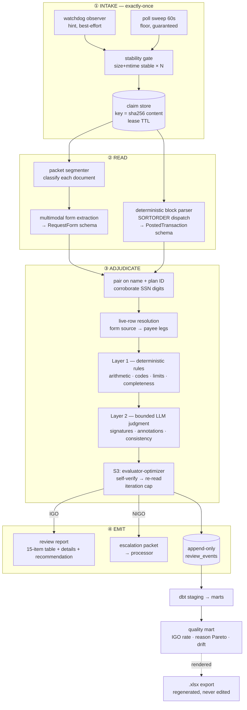

# 📋 POSTCHECK — Full Production Scope v1.2

## Autonomous Post-Posting QA Review Agent for Regulated Distribution Operations
## "Verify What Was Keyed" — Event-Driven Packet Intake → Deterministic Rules + Vision Reasoning → IGO/NIGO Adjudication → Escalation & Quality Analytics

**Document Version:** 1.2 (⚠️ **CORRECTED against a validated matched pair.** v1.0 was written from an unpaired form and export; v1.1 renamed GoodOrder → PostCheck; **v1.2 corrects five schema/rule facts and adds two rule families** — see §0. Governed by Career Roadmap **v10.0**, CORRECTION 33.)
**Last Updated:** August 14, 2026
**Status:** 📋 DRAFT — awaiting approval. No repo created, no roadmap correction written.
**Author:** Manuel Reyes
**Companion document:** `POSTCHECK_QA_AGENT_SCOPE_v1_1_STAGE1.md` (Stage-1 build sheet, v1.3)
**Roadmap authority:** v10.0 **CORRECTION 33** — PostCheck added as Flagship #4, the dual-target artifact.
**Predecessor system:** A prompt-only QA reviewer configured in a commercial chat-assistant UI (the *incumbent baseline*). This project replaces it with a governed, versioned, evaluated system.
**Strategic Priority:** 🧾 DETERMINISTIC PARSE → 👁️ MULTIMODAL PACKET REASONING → 🤖 AGENTIC ADJUDICATION → 📊 QUALITY MART

---

## 🎯 v10.0 ROADMAP ALIGNMENT & STAGE-EVOLUTION ARC — AUTHORITATIVE

> **This block governs.** Where anything below it conflicts, **this block wins.**

**Aligned to:** Career Roadmap **v10.0 (2026 Market Realignment)**.

**Governing model:** **3 stages, not 5.** Destination title is **Applied AI Engineer → Forward Deployed Engineer (FDE)**, first external door **Analytics Engineer**, Data Engineer parallel. **This project is ONE system that evolves across stages — never rebuilt per stage.**

**Portfolio role:** 🏁 **Flagship — dual-target lead.** This is the only project in the portfolio whose *single* deliverable produces first-class evidence for **both** target doors simultaneously: an agentic adjudication system (Applied AI) and a governed quality-metrics mart (Analytics Engineer / DE). Flagship vs supporting = **size & emphasis, not a quality tier** — every project is production-grade.

**⚠️ Identity note — this is NOT FormSense.** The two projects sit on opposite sides of the transaction and share no source of truth:

| | **FormSense** | **PostCheck (this project)** |
|---|---|---|
| **Position in workflow** | **Pre-index** — before the packet is filed | **Post-posting** — after the transaction is keyed and posted |
| **Question asked** | *"Is this form complete and legible enough to index?"* | *"Does what was keyed match what was requested, and does both comply with the SOP?"* |
| **Source of truth** | The form, judged against itself | The **form**, judged against the **posted transaction export** |
| **Subject under review** | The form | The **recordkeeping system's posted result** |
| **Inputs** | One form | A **packet** — form, posted-transaction export, letters of acceptance, plan-approval certificates, ticket screenshots, statements |
| **Decision** | Clear / needs-info / low-confidence → human | **IGO** / **NIGO (needs clarification)** / **NIGO (do not process)** |
| **Escalates to** | The submitting party, for a better form | The **processor**, to correct keying before money moves |
| **Failure it prevents** | A bad document entering the index | **A mis-keyed distribution reaching the participant and the 1099-R** |

**Stage-evolution arc:**

| Stage | Theme | This project's layer |
|---|---|---|
| **S1** | Foundation (GenAI-first core) | Event-driven packet intake + **deterministic block parser** + Layer-1 rule engine + multimodal form extraction + IGO/NIGO adjudication + review-report artifact + **blocking eval gates** on a frozen golden set + **FastMCP** read tools. Synthetic corpus only. |
| **S2** | DE/AE hardening | Review events as **data infrastructure** — Airflow-orchestrated runs, append-only event log, **dbt models + tests + data contracts** (Great Expectations), NIGO-reason marts, semantic/metrics layer, Postgres + S3, **Docker → ECS/Fargate** (Terraform), monitoring + written postmortem. |
| **S3** | Applied AI (RAG/agentic + eval) | **Agentic evaluator-optimizer adjudication loop** (extract → adjudicate → self-verify → re-read, *iteration cap = safety backstop*) + SOP retrieval layer (the SOP as a versioned, cited knowledge source) + **three-layer eval** + **Arize Phoenix** observability + expanded MCP (approval-gated) + **feedback-inheritance** prompt refinement from processor corrections + privacy-routed providers. |

**Production standard (non-negotiable, ALL projects):** business-outcome headline · Mermaid diagram · **C4 Context + Container** · **`docs/adr/` numbered immutable ADRs** · Dockerfile · eval-metrics table · 15–30s demo GIF · "What I Learned" · **synthetic data only in public repos** · `pyproject.toml` + `uv.lock` + `src/` + `py.typed` + ruff + mypy · **`structlog` via `ProcessorFormatter` + `redact_pii` processor** · **`pydantic-settings` sole config entrypoint, `SecretStr` credentials** · **`stamina` capped jittered retries** · Conventional Commits · **`.pre-commit-config.yaml`** (Tier A + **Tier B `nbstripout`** — notebook-bearing) · **Python 3.14+ floor, standard GIL build only** (`requires-python = ">=3.14"` as single source; ruff `py314`, mypy `3.14`, Dockerfile base and CI matrix all read from it — mismatch is a CI failure) · Structurizr DSL → Mermaid export · `.cursor/rules/` + `.opencode/` + `AGENTS.md` + `opencode.jsonc`.

**⚖️ Language ruling.** **Python-primary.** Agent core, parsing, rules, adjudication, eval and orchestration are Python. **No TypeScript layer is scoped** — this project ships no browser UI; its consumers are a filesystem, a processor's inbox, and a BI surface. ⚠️ **Falsifier:** add a `web/` sibling only if a processor-facing review queue UI becomes a stated requirement, and never before DataVault S2 and PolicyPulse's last-mile sprint are complete.

---

## 🔒 SAFETY INVARIANT — BINDING, NEVER RELAXED

> **PostCheck is read-only and advisory. It has no write path into any system of record, and it never contacts a human counterparty.**
>
> 1. **Never keys. Never posts. Never reverses. Never corrects.** The system produces a *finding*; a human processor acts on it.
> 2. **Never contacts a participant, advisor, TPA, or plan sponsor.** Outbound contact is a ticket assigned to the service team by a *human*, per SOP. The agent may *recommend* that a ticket be opened; it may not open one.
> 3. **Never edits identity fields.** SSN, legal name, and date of birth are read-only inputs under all circumstances.
> 4. **An IGO verdict is not an authorization.** It is a recommendation to a human who retains the decision. Eval scores never authorize a posting.
> 5. **Iteration cap on the S3 agentic loop is a safety backstop, not a cost control.** A loop that cannot converge escalates; it does not keep trying.
>
> This is the same class of invariant as Crucible's mandatory human sign-off and kill-switch. **Irreversible financial actions require a higher safety bar than read-only or verifiable actions** — and this system stays firmly on the read-only side of that line by construction, not by policy.

---

## 0. ⚠️ v1.2 CORRECTIONS — WHAT THE VALIDATED PAIR CHANGED

> **v1.0 and v1.1 were written from an unpaired sample.** A validated matched pair (one hardship distribution: request form packet + its own posted export) was then traced by hand across all 15 items. Seven changes follow. **Additive-only: nothing below removes a capability; each item states what was wrong and what replaced it.**

| # | v1.0/v1.1 said | Corrected | Impact |
|---|---|---|---|
| **C-1** | The row-type discriminator is a string prefix | **It is typed inconsistently — `float` in one export, `str` in another, and `int` for whole values.** `1.1` as a float also collides with a hypothetical `1.10`. | **Normalise the discriminator to a canonical string before dispatch; never compare floats.** §5.2 |
| **C-2** | Cell values are strings | **Value types drift within the same block, same column.** In the validated pair, payee leg 1 carries native `int`/`str` while leg 2 carries all-`str` — for identical columns. | **Type coercion at the boundary is mandatory, not defensive.** §5.3 |
| **C-3** | One form type, with a movement-type checkbox governing the code | ❌ **Wrong. There are at least two distinct form families**, and they route to different rule paths entirely. | **New §6.5 — the form-family router. This is now the first branch in adjudication.** |
| **C-4** | Gross-up reconciles net requests | Correct, but incomplete — **the form carries an explicit Gross/Net election**, and Gross makes item 11 `N/A`, not `PASS`. | Gross-up is now an **explicit form-driven branch**, not an inference from the presence of a net amount. §7.2 |
| **C-5** | (absent) | **The plan-approval certificate carries a transaction amount and a validity window.** Two rules were missing. | **New rule family: approval-certificate reconciliation.** §7.2 |
| **C-6** | (absent) | **The template string encodes reason + gross/net + payment method** (e.g. `Hardship Gross ACH`, `Partial Liquidation Net ACH`). | **New rule: template-vs-form consistency** — a free cross-check that catches template-selection errors. §7.2 |
| **C-7** | Dead legs are an edge case | ❌ **Wrong — a dead leg is the DEFAULT shape.** Both validated exports show exactly one live leg and one dead sibling leg carrying stale defaults. | The anti-false-positive suite is now **the largest single block of the golden set**, not a corner case. §16.3, §12.2 |

### 🎯 What the traced pair proved

The hand-trace produced **14 correct verdicts and one genuine finding a human would skim past**: the participant's mailing address on the signed form disagreed with the address on their own attached voided check and with the address of record in the export. Because payment was ACH, no check is mailed, and the SOP's address-match rule is **conditional on the payment method being check** — so this is an `EXCEPTION`, not a `CRITICAL`, and the transaction is still **READY TO PROCESS (IGO)**.

> **That conditional is the whole thesis of the project in one rule.** A naive reviewer flags the address mismatch and produces a false NIGO. A careless one ignores it entirely. The correct behaviour — surface it, classify it as curable, do not block — requires reading the payment method *first*. **Rules that are conditional on another field are exactly where prompt-only reviewers fail and where a compiled rule engine does not.**

The same trace also confirmed **six anti-false-positive cases firing correctly in a single real transaction**: a dead Roth leg carrying a stale withholding method; `$0` in the dollar fields under a pre-built percentage method; a blank plan-administrator block beside an attached approval certificate; an absent signature guarantee below the pre-printed threshold; a `None` state method with a valid zero election; and an electronic-signature identity check with one failed sub-question but an overall passing result. **Any one of those, mishandled, is a false NIGO.**

---

## 📋 Table of Contents

0. [v1.2 Corrections](#0-️-v12-corrections--what-the-validated-pair-changed)
1. [Executive Summary](#1-executive-summary)
2. [The Business Problem](#2-the-business-problem)
3. [Market Validation](#3-market-validation)
4. [Platform Architecture](#4-platform-architecture)
5. [The Deterministic Parse Layer (Signature Differentiator)](#5-the-deterministic-parse-layer-signature-differentiator)
6. [Packet Segmentation, Extraction & the Form-Family Router](#6-packet-segmentation--multimodal-extraction)
7. [The Rule Engine (Layer 1)](#7-the-rule-engine-layer-1)
8. [Agentic Adjudication (Layer 2, S3)](#8-agentic-adjudication-layer-2-s3)
9. [Intake, Claiming & Idempotency](#9-intake-claiming--idempotency)
10. [Output Artifacts](#10-output-artifacts)
11. [Data Architecture — The Quality Mart](#11-data-architecture--the-quality-mart)
12. [LLMOps & Evaluation](#12-llmops--evaluation)
13. [MCP Server](#13-mcp-server)
14. [Tech Stack](#14-tech-stack)
15. [Infrastructure & DevOps](#15-infrastructure--devops)
16. [Security, Privacy & ERISA Compliance](#16-security-privacy--erisa-compliance)
17. [Project Structure](#17-project-structure)
18. [Development Phases](#18-development-phases)
19. [Project Evolution (3 Stages)](#19-project-evolution-3-stages)
20. [Success Metrics](#20-success-metrics)
21. [Risk Mitigation](#21-risk-mitigation)
22. [Skills Required](#22-skills-required)

---

## 1. Executive Summary

**PostCheck** is an autonomous, event-driven QA review system for regulated retirement-plan distribution operations. It watches an intake folder, claims each new document packet exactly once, reads a scanned participant request form alongside the recordkeeping system's posted-transaction export, adjudicates the pair against a versioned SOP, and produces one of three outcomes: **READY TO PROCESS (IGO)**, **NEEDS CLARIFICATION (NIGO)**, or **DO NOT PROCESS (NIGO)**. Clean reviews are written as report artifacts to an output folder; findings are escalated to the human processor with the specific field, the form value, the system value, the SOP citation, and the fix. Every adjudication is appended to an event log that feeds a dbt-modelled quality mart tracking first-pass IGO rate and NIGO reason mix over time.

**The verification surface is fixed and auditable: 15 items, in a fixed order, on every transaction, IGO or NIGO, no row ever omitted** — source & live rows, name/plan, SSN, reason & partial/full, date/event consistency, fund/source election, fee, type & distribution code, federal withholding, state withholding, gross-up arithmetic, payment instructions & reference line, participant authorization, plan-level authorization, and supporting documentation. Each is scored `PASS` / `EXCEPTION` / `CRITICAL` / `N/A`. Any `CRITICAL` blocks.

### 1.1 Why this is a dual-target flagship

| Door | What this project proves |
|---|---|
| **Applied AI / FDE** | Agentic adjudication with a hard escalation boundary; multimodal reasoning over scanned, faxed, handwritten packets; three-layer eval with a blocking gate; MCP tool surface; HITL on every consequential path; an ADR set defending each boundary. |
| **Analytics Engineer / DE** | Event-driven ingestion with exactly-once semantics; a ragged, block-structured source parsed deterministically; append-only event log with a declared grain; dbt models + tests + contracts; a metrics layer answering a real operational question; Airflow orchestration; the spreadsheet-as-rendered-export ruling. |

### 1.2 Stage 1 vs Full Production

| Dimension | Stage 1 | Full Production |
|---|---|---|
| **Trigger** | Watched folder, single worker | Same contract + Airflow-scheduled sweeps, multi-worker with leases |
| **Parse** | Deterministic block parser (SORTORDER dispatch) | Same, hardened with schema-drift detection and contract gates |
| **Form reading** | Multimodal extraction, retry-then-unreadable | + packet segmentation, per-document classification, page-level rasterization fallback |
| **Adjudication** | Deterministic rules + bounded LLM judgment on the residual | + evaluator-optimizer self-verification loop with iteration cap |
| **SOP** | Rules compiled into versioned Python + YAML tables | + SOP as a cited retrieval source; findings quote the governing clause |
| **Output** | Review report per pair + roll-up | + escalation packets, ticket-draft content (never submitted), processor feedback capture |
| **Analytics** | Append-only event log + a rendered export | dbt marts, contracts, semantic layer, drift monitoring, BI surface |
| **Eval** | Frozen golden set, blocking false-NIGO gate | + trajectory tracing, drift vs frozen set, shadow evaluation before promotion |
| **Deploy** | Local / Docker Compose | ECS/Fargate (Terraform), Phoenix observability, monitoring + postmortem |

> **The Stage-1 contract is frozen and never thrown away.** The 15-item verification surface, the four status values, the three outcomes, the report format, and the safety invariant carry forward unchanged in interface. Every later stage adds a layer *behind* that stable contract.

---

## 2. The Business Problem

### 2.1 Context

A distribution request moves through a human workflow: a participant submits a signed request form (frequently faxed, scanned, or DocuSigned, often with handwritten annotations); a processor adjudicates it for good order, keys it into the recordkeeping system, and posts it. **After posting, someone must verify that what was keyed matches what was requested** — because a mis-keyed distribution code, an unapplied gross-up, a withholding election below a mandatory minimum, or an unverified bank account produces a wrong payment, a wrong 1099-R, a reissue, and an audit finding.

That verification is currently manual, and where it has been automated it has been automated as a prompt in a chat UI — unversioned, unevaluated, non-reproducible, and with no record of what it found.

### 2.2 What makes this genuinely hard

| Difficulty | Detail |
|---|---|
| **The source of truth is a scan** | Faxed at 200 dpi, handwritten in places, with rotated and blank pages, annotations in the margin, and signature blocks that must be *seen*, not parsed. |
| **The input is a packet, not a document** | One PDF may concatenate a transmittal email, the request form, a letter of acceptance from a receiving institution, a quarterly statement, and a third-party plan-approval certificate. Each must be identified before it can be used. |
| **The export is ragged and block-structured** | Two logical tables stacked in one sheet, generic column headers, one row per transaction and one row per payee leg. See §5. |
| **Dead rows carry live-looking values** | A payee leg with no distribution code is inert, but still displays stale defaults — a payment method, an address, a withholding method. Reading them produces confident, wrong findings. |
| **The rules are conditional on a checkbox** | Exchange vs Transfer vs Rollover — chosen on the form — determines the distribution code, the withholding treatment, and whether gross-up applies at all. Plan type does not. Source type does not. |
| **The expensive failure is a false alarm** | See §12.2. |

### 2.3 The questions the system answers

- Does the posted transaction match the participant's request, field by field?
- Is the distribution code correct for *this* transaction type, source, age, and reason?
- Was the gross-up applied, and does the arithmetic reconcile to the cent?
- Is withholding within mandatory limits and keyed by a valid method/amount pattern?
- Is the payment destination complete and consistent with the letter of acceptance?
- Is the authorization complete for this plan type?
- **Across time:** which NIGO reasons dominate, and is the mix changing?

### 2.4 Measurable impact

Reported per the **relative-delta rule** only. Permitted: first-pass IGO rate, NIGO reason distribution, agent-vs-human agreement rate, review-cycle-time reduction as a percentage, error classes caught pre-payment. 🚫 Prohibited: absolute dollar amounts, participant or plan data, client identifiers, volumes that could identify the employer or its clients, and any figure failing the deposition test.

---

## 3. Market Validation

| Evidence | Finding | Weight |
|---|---|---|
| **ACL 2026 demo — *IDP Accelerator*** | Production agentic document intelligence with four components: packet segmentation (BIO-tagged multimodal classifier), configurable multimodal extraction, an **MCP-compliant analytics module with sandboxed execution**, and a **rule-validation module replacing deterministic engines with LLM-driven logic**. Healthcare deployment at 98% classification accuracy. **This is the closest published reference architecture to PostCheck** — and PostCheck deliberately inverts its fourth component (see §7.1). | 🟢 Peer-reviewed |
| **arXiv 2026 — *MADP*** | Multi-agent document processing under human oversight; 955 real production documents; 97.0% full-pipeline automation, **98.5% document-level accuracy with HITL**; a prompt-refinement-from-human-corrections mechanism that improves behaviour without retraining. Directly models the S3 feedback layer. | 🟢 Primary |
| **arXiv 2026 — *SecGoal*** | Structured extraction from technical documents: zero-shot precision **20–32%** against recall **94–98%**; best few-shot precision ~36%. **Grounds the §12.2 gate.** | 🟢 Primary |
| **arXiv 2026 — *PromptPort*** | Per-field confidence with conservative safe-override, enabling **field-level** escalation rather than whole-instance rejection. | 🟢 Primary |
| **`FAIRmat-NFDI/extract-eval`**, **`ContextualAI/extract-bench`** | Open-source schema-driven field-level precision/recall/F1 classifying results into **omissions, hallucinations, mismatches**; array alignment and semantic matching. Adopted rather than hand-rolled. | 🟢 Runnable |
| Agentic-IDP practitioner analysis (2026) | Five vendor claims that are **not** agentic — first among them *"LLM-powered single-pass extraction."* Also: *at 1,000 documents/day, 98% accuracy still produces 20 daily failures* — **system-level reliability design outranks chasing the last point of model accuracy.** | 🟡 Directional |
| Agent-eval practitioner guidance (2026) | Four-layer model: code checks → LLM-judge (**25–35% of eval surface**) → human calibration → **shadow evaluation before promotion**. | 🟡 Directional |
| LLM-eval guidance (2026) | Golden set: ~50 detects large regressions, **200 gives confidence on a 3–5% change**, >500 diminishing returns. Sets built purely from documentation or naive synthesis are *"too clean."* | 🟡 Directional |

> ⚠️ Directional sources are marked as such per the **CORRECTIONS 18–19 evidence standard** and are not load-bearing for any architectural ruling.

**Where agentic processing genuinely earns its cost** (per the 2026 practitioner consensus): high document variety with inconsistent layouts · **validation-heavy compliance workflows** · exception rates above 15–20% · downstream action chains. PostCheck sits squarely in the second and fourth. That is the honest justification, and the scope states it rather than assuming it.

---

## 4. Platform Architecture



---

## 5. The Deterministic Parse Layer (Signature Differentiator)

> **This section contains the single most important technical finding in the project, and it is the strongest ADR the repo will carry.**

### 5.1 The finding

The posted-transaction export is **not** a flat table. It is **two logical tables stacked in one sheet**, with generic physical column names (`SORTORDER`, `COLUMN2` … `COLUMN31`) and a **row-type discriminator in the first column**:

| `SORTORDER` prefix | Row type | Grain |
|---|---|---|
| `1.1` | Block-1 section title | — |
| `1.2` | **Block-1 logical header** | — |
| `1.3` | Block-1 data — transaction ledger | **one row per transaction** |
| `2` | Spacer | — |
| `2.1` | Block-2 section title | — |
| `2.2` | **Block-2 logical header** | — |
| `2.3` | Block-2 data — payment / payee legs | **one row per payee sequence** |

**Consequence: the file is 100% deterministically parseable.** Dispatch on the `SORTORDER` prefix, bind each block's data rows to that block's header row positionally, and every field lands under its correct label with zero ambiguity.

⚠️ **Two typing hazards found in the validated pair — both would silently break a naive implementation (v1.2 CORRECTIONS C-1, C-2):**

| Hazard | What was observed | Required handling |
|---|---|---|
| **Discriminator type drift** | The discriminator arrives as `float` in one export (`1.1`, `1.2`, `2.1`), as `int` where the value is whole (`2`), and as `str` in another export — **for the same logical row types**. | **Normalise to a canonical string before dispatch.** Never compare floats: `1.1 == 1.1` is fragile, and `1.1` would collide with a hypothetical `1.10` under float semantics. Format to a fixed decimal representation and match on that. |
| **Value type drift within a block** | Payee leg 1 carried native `int`/`str` values while leg 2 carried all-`str` — **same columns, same block, same file**. | **Coerce every field at the boundary**, driven by the Pydantic schema. Nothing downstream ever sees a raw cell. A leg whose `Transid` is `782` and a sibling whose `Transid` is `'782'` must produce identical models. |

> These are not defensive extras. They are the two ways a correct-looking parser silently produces wrong pairs — and both were present in a two-file sample.

### 5.2 Why this matters more than it looks

The incumbent prompt-only reviewer carries an entire defensive rule — *never infer the source from the amount columns, because flattening shifts values left; a Roth amount can appear under a non-Roth header; a blank reads as zero* — **and that hazard is an artifact of reading a flattened text rendering of the workbook, not a property of the file.**

> **A whole class of the incumbent's CRITICAL findings are mitigations for a bug that a correct parser does not have.**

This produces the project's headline before/after: **the deterministic parser eliminates the column-shift failure mode by construction**, measured as the reduction in false CRITICAL findings on the frozen golden set versus a flattened-text baseline running the same rules. It is a real, defensible, non-manufactured metric — and it is exactly the kind of finding that separates an engineer from a prompt author.

**ADR-001: Deterministic block parsing over LLM table reading.** *Context* — the export is ragged and block-structured; LLM ingestion flattens it. *Decision* — parse with `openpyxl` dispatching on the row-type discriminator; the LLM never sees the workbook. *Consequences* — zero column-shift errors; a schema contract that fails loudly on layout change; the LLM budget is spent entirely on the scan, where it is actually needed. *Rejected* — feeding the sheet to a vision or text model, which is what the incumbent does and what the flattening rule exists to patch.

### 5.3 Schema contracts

Two Pydantic models, two Great Expectations suites.

**Block 1 — transaction ledger (16 fields):** plan ID, transaction ID, post date, participant name, SSN, participant age, distribution type, distribution template, total transaction amount, distribution amount, fee, activity fee, activity fee method code, non-Roth source amount, Roth source amount.

**Block 2 — payee legs (30 fields):** plan ID, transaction ID, payee sequence, gross-distribution flag, payment method, payee name, street 1, street 2, city, state, ZIP, payee company, **check reference line text**, bank account name, ABA routing number, account number, payment fee amount, **payee source type**, **federal withholding method code**, federal withholding amount, federal tax amount, manual federal tax amount, **distribution code 1** + description, **distribution code 2** + description, state withholding amount, state tax amount, **state withholding method code**, manual state tax amount.

> ⚠️ **Source-system header typos are preserved verbatim in the physical column map and normalised only at the boundary.** Several header labels are misspelled upstream. The mapping layer owns that; nothing downstream ever sees a misspelled field name. Correcting them in the map would silently break on the next export.

**⚠️ Schema-drift gate.** The header rows are validated against the expected label sequence on every run. A changed, added, removed, or reordered column **fails the run and escalates** — it never silently mis-binds. This is a Great Expectations contract, CI-gated, and it is the difference between a pipeline and a script.

### 5.4 Live vs dead leg resolution

**The form's account type fixes the source. Always.** Pre-tax → non-Roth legs; Roth → Roth legs; both → both.

> 🎯 **A dead sibling leg is the DEFAULT shape, not an edge case (v1.2 CORRECTION C-7).** Every validated export showed exactly one live leg plus one dead sibling carrying stale values. A system that mishandles dead legs does not fail occasionally — **it fails on essentially every transaction.** This single fact is why the anti-false-positive suite is the largest block of the golden set.

A payee leg is **live** when its distribution code is a real code and **dead** when the code is blank, null, zero, or a dash. **Dead legs carry stale defaults** — in the reference sample, an inert Roth leg still displays a payment method, a bank routing number, an account number, and a state withholding method. Reading any of those produces a confident, wrong finding.

| Rule | Statement |
|---|---|
| **R-LIVE-1** | Source is determined by the form's account-type selection, never by which amount column holds a value. |
| **R-LIVE-2** | Corroborate with the payee source type field (`Traditional` / `Roth`); these are never swapped. |
| **R-LIVE-3** | Every payee leg *within the live source* is live and reviewed independently. One transaction may pay two destinations with **different codes on each leg** — that is normal, not a finding. |
| **R-LIVE-4** | Dead legs are skipped entirely. Their code, method, payee, and address are never read. |
| **R-LIVE-5** | **A dead leg paying the participant while a live leg pays an institution is normal and is NOT a finding.** |

---

## 6. Packet Segmentation & Multimodal Extraction

### 6.1 The packet is not one document

A single intake PDF may concatenate several distinct documents. Confirmed types from validated packets:

| Document type | Role in adjudication | Extracted to |
|---|---|---|
| Transmittal email / fax cover | Provenance and receipt date | `Transmittal` |
| **Request form** (multi-page; scanned+handwritten *or* born-digital+electronically signed) | 🎯 **Source of truth** | `RequestForm` (+ family tag) |
| **Letter of acceptance** | Receiving institution, account number, FBO line, delivery address — the check-reference-line authority | `LetterOfAcceptance` |
| **Plan-approval certificate** | Plan-level authorization · **approved amount** · **validity window** · confirmation number · sponsor | `ApprovalCertificate` |
| 🆕 **Banking document (voided check or bank letter)** | **ACH ownership verification** — pre-printed name, routing, account | `BankingDocument` |
| 🆕 **Electronic-signature certificate of completion** | Envelope ID · **status** · signer name + email · timestamps · identity-check result · adoption method | `SignatureCertificate` |
| Account statement | Balance context; rarely load-bearing | `Statement` |
| Ticket screenshot / confirmation | Prior-correspondence context | `TicketArtifact` |
| Blank / rotated / duplicate pages | Discarded after classification | — |

⚠️ **Two of these are new in v1.2** and both are load-bearing: without `BankingDocument` there is no ACH ownership check, and without `SignatureCertificate` there is no way to distinguish a completed envelope from a sent-but-unsigned one.

🆕 **Packets are not uniformly scanned.** One validated packet was a 200 dpi fax of handwritten pages; another was born-digital with a crisp text layer and an appended signature certificate. **Detect the text layer per document, not per packet** — a single packet can contain both, and rasterizing a clean digital form wastes the vision budget while text-extracting a fax returns nothing.

**Segmentation runs before extraction.** Each page is classified into a document type; contiguous pages of the same type form a document; each document is then extracted against its own schema. This mirrors the packet-splitting component of the 2026 reference architecture.

### 6.2 Reading discipline — a bad read is not an unreadable file

> **This distinction is load-bearing and is a rule, not a heuristic.**

| Status | Meaning | Action |
|---|---|---|
| `Paired` | Form and export both present and readable | Review |
| `Missing export` | Form with no matching export | **Flag, do not review, continue** |
| `Missing form` | Export with no matching form | **Flag, do not review, continue** |
| `Retry` | Garbled, empty, or partial text | **Not a finding.** Finish the other pairs, then re-open this file alone in extended mode, scanned pages rasterized page by page |
| `Unreadable` | Retry failed | Flag |

**One flag never stops the rest of the run.** Every run opens with an intake table listing pair number, participant, plan ID, form status, export status, and pairing status.

### 6.3 Pairing

**Key = participant name + plan ID.** One transaction per participant per plan per day, so a key match *is* the pair. Corroborate with the visible SSN digits. Case, initials, and file ordering never break a match. **Filenames are generic and are never used for pairing.** No participant is ever reported unknown before both files have been read.

### 6.5 🆕 The form-family router — the first branch in adjudication

> **v1.2 CORRECTION C-3. This was missing from v1.0 and is now the first decision the adjudicator makes.**

There is **not one request form.** At least two distinct families circulate, they carry different steps, and **they route to entirely different rule paths.** Choosing the wrong path produces a confidently wrong code finding on every transaction of that family.

| | **Family A — Outgoing Exchange / Transfer / Rollover Request** | **Family B — Account Distribution Form** |
|---|---|---|
| **Scope** | Money leaving to another provider or plan | Money leaving to the participant |
| **Governing step** | **Type of Exchange / Transfer / Rollover** — exactly one checkbox | **Distribution Reason** — normal, separation, QDRO, corrective, hardship, RMD, death |
| **Code path** | Exchange or Transfer → **code 6**, not a distribution: 0% withholding, **no gross-up**. Rollover → pre-tax code vs designated-Roth code by source. | **SOP code tables** by plan type, live source, **age**, and reason |
| **Amount step** | Full liquidation vs specified amount | **Explicit Gross / Net election** + entire vs partial balance |
| **Required companions** | **Letter of acceptance** (receiving institution, account number, FBO line, address) + plan-approval certificate | Reason-specific documentation; **voided check** where ACH is elected |
| **Payment shape** | Payment to an institution; **check reference line is CRITICAL on every live leg** | Payment to the participant; **check reference line is `N/A`** |
| **Gross-up** | Never applies (code 6 and direct rollovers are 0%) | Applies **only** where the form elects **Net** |
| **Signature guarantee** | Pre-printed threshold language present | Pre-printed threshold language present |
| **In both** | 🚫 **A medallion is NEVER required.** Threshold language creates no requirement. | 🚫 Same. |

**Routing rule.** Classify the form family *before* any rule runs. The family determines which code module executes, whether gross-up is even in scope, whether a letter of acceptance is required, and whether the check reference line is a `CRITICAL` surface or `N/A`. **A misrouted form is not a partial failure — it is a wrong answer on most of the 15 items at once.**

**⚠️ Falsifier / open input.** Two families are confirmed from validated samples. Others may exist (beneficiary/death claims, QDRO, systematic-distribution changes, in-plan Roth conversions). The router is built as a **registry keyed on form identifier**, so a new family is a new entry plus a new rule path — not a rewrite. **An unrecognised form family is a flag, never a guess:** the packet is routed to the processor with `NOT REVIEWED — unrecognised form family`, and the golden set carries a case for exactly this.

---

### 6.4 What the vision layer extracts from the form

Participant identity (name, visible SSN digits, date of birth, address) · **from-account type** (the source determinant) · accepting-carrier plan type · receiving institution, account number, FBO line, mailing address · **the exchange/transfer/rollover type checkbox** (the code determinant) · amount and full-vs-partial election · designated funds or sources, if any · reason · **signature presence, type, and date** · plan-administrator approval block state · attached approval certificate presence · handwritten annotations and their location.

---

## 7. The Rule Engine (Layer 1)

### 7.1 The inversion — and why

The 2026 reference architecture replaces deterministic rule engines with LLM-driven validation logic. **PostCheck deliberately does the opposite**, and records why.

**ADR-002: Deterministic rules first; LLM confined to the residual.** *Context* — the governing SOP is a written, versioned, tabular standard: fee tables, code tables by plan type and age, withholding limits by transaction type, a closed-form gross-up. These are *executable*, not interpretive. *Decision* — compile them into versioned Python and YAML; reserve the LLM for what genuinely requires seeing and judging. *Consequences* — the majority of findings are free, instant, fully explainable, and perfectly reproducible; the eval surface shrinks to what actually varies; a rule change is a diff, not a prompt rewrite. *Rejected* — LLM-driven rule validation, on the grounds that non-determinism in an arithmetic check is a defect, not a feature. **Target: ≥ 65% of all findings originate in Layer 1.**

### 7.2 The rule families

| Family | Representative rules | Layer |
|---|---|---|
| **Identity** | Name match; plan ID/sponsor match; **visible SSN digits only** — a match is `PASS` and never an exception, a conflict is `CRITICAL` | 1 |
| **Type & code** | The form's type checkbox governs, not plan type and not template. **Exchange or Transfer → code 6, not a distribution: 0% withholding, no gross-up.** Rollover → pre-tax code vs designated-Roth code by source. **A Roth source alone does not imply the Roth rollover code — a Roth contract exchange is code 6.** Otherwise the SOP code tables apply by plan type, source, age, and reason. | 1 |
| **Withholding limits** | Mandatory minimum on eligible rollover distributions paid to the participant; defaults on required distributions, hardships, and IRA distributions; 0% and no gross-up on direct rollovers, exchanges, transfers, and charitable distributions; federal + state ≤ 100%. | 1 |
| **Withholding keying pattern** | **Read the method, not the dollar field — exactly one is ever populated.** A pre-built percentage method with $0 in the dollar fields is *correct*; the system computes at posting. **$0 there is never a finding.** A method of `None` with a manual amount is *correct* when the elected rate has no pre-built option or a flat amount was elected — `None` does not mean declined. **Findings: both populated, or `None` with $0 where the form elected withholding.** Identical logic for state. | 1 |
| **Gross-up** | **Net requests only.** `r = fed% + state%`; **expected gross = (net + fee) / (1 − r)**. Flat-dollar elections: `net + manual federal + state + fee`. Compare to the transaction total at **±$0.01**, show the arithmetic, mismatch is `CRITICAL`. A total equal to expected proves the rate was applied; a total at or near net proves it was not. | 1 |
| **Fee** | Fee matched against the SOP fee table by distribution type and payment method. | 1 |
| **Payment completeness** | Method and address match the form; payee complete — institution, account number, FBO line, address — against the letter of acceptance. Routing number exactly nine digits, **cross-checked against the routing line of the attached banking document**. **ACH ownership is verified from the pre-printed name on that document matching the participant of record** — a handwritten or absent name is unverified and `CRITICAL`. **Check reference line on every exchange/transfer/rollover-out leg must carry that leg's receiving account number and the participant name per its letter of acceptance; missing or mismatched is `CRITICAL`.** | 1 |
| **Authorization** | Wet signature **or** a completed electronic envelope with its certificate — **either alone suffices.** IRA plans: that signature is the *only* authorization. Employer plans: that **plus** plan-level authorization — approval-block signature **or** a separate certificate; **a blank approval block is not a finding when a certificate is attached.** Death distributions add beneficiary authorization. | 1 + 2 |
| **Anti-false-positive** | **A medallion signature guarantee is NEVER required.** Pre-printed threshold language on the form does not create a requirement. **Expired or under-covered stamps are never findings when a valid signature is present.** 🆕 **An electronic-signature identity check may show individual failed sub-questions while the overall result passes — the overall result governs, and a failed sub-question is NEVER a finding.** 🆕 A signature guarantee section left blank below the pre-printed threshold is `N/A`, not a gap. | 1 |
| 🆕 **Signature certificate** | Envelope **status must be Completed** (Sent, Delivered, Voided, Declined, Expired are `CRITICAL`). **Signer name and email must match the participant of record.** Signature must be an applied electronic signature with an audit trail — a typed name or pasted image is invalid. **Signed date must not precede the event permitting the distribution.** Certificate pages must be present with the form. | 1 |
| 🆕 **Form family** | **Runs first.** Classify the form family and select the code path, the gross-up applicability, the companion-document requirement, and the reference-line applicability. **Unrecognised family ⇒ flag, never guess.** (C-3) | 1 |
| 🆕 **Gross vs Net** | **The form carries an explicit Gross/Net election, and it governs.** Gross elected ⇒ item 11 is **`N/A` with reason**, not `PASS` — there is nothing to reconcile. Net elected ⇒ the gross-up formula runs. **Never infer the election from the presence of a net amount.** (C-4) | 1 |
| 🆕 **Approval certificate** | Where a plan-approval certificate supplies plan-level authorization, it also carries **a transaction amount and a validity window**. Two checks: **(a)** certificate amount reconciles to the posted transaction amount (and to any stated cap); **(b)** the **post date falls inside the certificate's validity window** — an expired approval is `CRITICAL`, and a posted amount exceeding the approved cap is `CRITICAL`. (C-5) | 1 |
| 🆕 **Template consistency** | The recordkeeping template string **encodes reason + gross/net + payment method** (e.g. `Hardship Gross ACH`, `Partial Liquidation Net ACH`). Cross-check all three against the form. A template naming `Net` on a `Gross` request, or `Check` on an ACH election, is a **template-selection error** — `EXCEPTION`, and a high-signal one because it usually co-occurs with a downstream defect. Free, deterministic, no LLM. (C-6) | 1 |
| 🆕 **Age derivation** | The export supplies a participant age **and** the form supplies a date of birth. **Derive age from DOB as of the post date and cross-check.** Age drives the code table, so a stale or wrong age silently produces a wrong code. Disagreement is `EXCEPTION`; a disagreement that would change the code band is `CRITICAL`. | 1 |
| 🆕 **Address, three-way & conditional** | Reconcile the address across **form / supporting banking document / export**. ⚠️ **The SOP's address-match rule is conditional on the payment method being check.** For ACH the routing and account number are the destination, so an address discrepancy is an `EXCEPTION` (address of record differs from the signed form), **never a `CRITICAL`, and never a block.** For check payments the same discrepancy is blocking. **This conditional is the single clearest example of why rules are compiled, not prompted.** | 1 |
| **Judgment** | Is this mark a signature? Does a handwritten annotation contradict a keyed value? Is the stated reason consistent with the transaction and the event date? Was the document altered? | **2** |

### 7.3 The re-read rule

> **Before emitting any CRITICAL, re-read the cell and its bound header.** A finding raised on a blank or mis-bound cell is not a finding. **If the export contradicts the form in a way that suggests a bad read, call that field unreadable and request a re-export — never report a processor error.**

This is the single most important false-positive control in the system, and it is implemented as a mandatory verification step, not as prompt advice.

---

## 8. Agentic Adjudication (Layer 2, S3)

**Anthropic taxonomy: this is a workflow with a bounded agentic verification step — not an autonomous agent.** Naming that correctly is itself the differentiator, given that "LLM-powered single-pass extraction" marketed as agentic is the first item on the 2026 list of false agentic claims.

```
extract → adjudicate → SELF-VERIFY → (re-read | emit)
                            │
                            ├─ Did I read a dead leg? → re-resolve, re-adjudicate
                            ├─ Is this CRITICAL raised on a null/mis-bound field? → re-read
                            ├─ Does my code finding cite the governing SOP clause? → retrieve
                            └─ iteration cap reached → ESCALATE, do not retry
```

**S3 adds a retrieval layer over the SOP itself**, so every finding cites the governing clause by section rather than asserting a rule from parametric memory. The SOP is versioned; a finding records which SOP version adjudicated it. When the SOP changes, prior findings remain interpretable — which is what makes the event log auditable years later.

**Feedback inheritance.** Processor corrections on escalated reviews are captured as labeled examples and used to refine adjudication behaviour **without retraining any model** — the mechanism formalised in the 2026 multi-agent document-processing literature. Corrections enter the golden set's production-failure bucket; they do not silently alter prompts.

---

## 9. Intake, Claiming & Idempotency

**Recommendation: filesystem event as a *hint*, polling as the guaranteed floor, content hash as identity.**

Naïve event-driven processing is the failure mode this design exists to avoid, and it is well documented in the watcher library's own tracker: **large files raise multiple modified events during copy**, making write completion undetectable from the event alone; **duplicate events fire for a single modification** across platforms; and **network shares often deliver no events at all**, which is the realistic corporate deployment target.

| Property | Mechanism | Failure prevented |
|---|---|---|
| **Exactly-once** | Idempotency key = SHA-256 of content, **not path** | Duplicate events; re-drops; renames; the same packet arriving twice |
| **Never reads a partial write** | Size + mtime unchanged across N consecutive checks before eligibility | Reading a half-copied scan |
| **Crash-safe** | Durable claim store, states `discovered → claimed → reviewing → igo \| nigo \| flagged \| failed`, **lease with TTL** so a dead worker's claim expires and is retried | A killed worker silently swallowing a packet |
| **Works on a network share** | Poll floor runs regardless of event support | Silent zero throughput |

**ADR-003: Event-as-hint with a poll floor.** *Rejected* — poll-only (loses sub-second latency for no reliability gain) and event-only (loses the network-share case entirely). ⚠️ **Falsifier:** drop the watcher if the deployment target is confirmed to be a network share *and* it is measured to add no detections the sweep misses.

**Batch bound: 1–10 packets per run**, matching the operational reality of the workflow and keeping the roll-up human-readable.

---

## 10. Output Artifacts

**Same format every run — IGO or NIGO, one pair or ten. Format stability is a feature: a processor should never have to re-learn where to look.**

**A. Intake table** — first, always. Pair, participant, plan ID, form status, export status, pairing status.

**B. One block per transaction**, in intake order, headed `Transaction [ID] — [participant] — [plan ID] — [source] — code(s) — [IGO/NIGO]`:
1. **Verification summary** — no prose above it. A table of **15 rows in fixed order, none ever omitted**, each `PASS` / `EXCEPTION` / `CRITICAL` / `N/A` with a few words on the value or the problem. Rows 8 and 12 repeat per live payee leg.
2. **Details — failed items only**, criticals first: item, field, form value, export value, SOP section, fix. All clean → `No failed items.`
3. **Recommendation**, one line: **READY TO PROCESS (IGO)** / **NEEDS CLARIFICATION (NIGO)** *(how to fix)* / **DO NOT PROCESS (NIGO)** *(why)*.

**C. Roll-up** — for multi-pair runs: transaction, participant, plan ID, code, verdict, reason, plus counts of IGO / NIGO / not reviewed.

**Per-pair document artifact:** one review report per reviewed pair, named `Distribution_QA_Review_[PARTICIPANT]_[YYYY-MM-DD].docx`, containing the header (run date, SOP version, source files, **agent version and prompt hash**) and that pair's block. **Flagged pairs produce no report** — one line in the roll-up only.

> 🆕 **Addition to the incumbent's format: every report carries the adjudicating agent version, rule-pack version, SOP version, and prompt hash.** Without those, a report is unreproducible and therefore not audit evidence. This is a one-line change with disproportionate value.

---

## 11. Data Architecture — The Quality Mart

### 11.1 The ruling that makes this an Analytics Engineer artifact

> **The spreadsheet is a rendered export. It is never the source of truth, and it is never hand-edited.**

Writing metrics directly into a workbook produces a mutable, unversioned, untestable artifact with no declared grain, no contract, and no lineage. The correct shape is an append-only event log, modelled and tested, with the workbook regenerated from the marts on demand.

```
review_events (append-only)  →  dbt staging  →  dbt marts  →  rendered .xlsx / BI
       SOURCE OF TRUTH                                        regenerated, never edited
```

### 11.2 Models and grain

| Model | Grain | Note |
|---|---|---|
| `stg_review_events` | one row per emitted review event | Append-only. Nothing is ever updated in place. |
| `stg_verification_items` | one row per (review run, item #, payee leg) | The 15-item surface, unpivoted — **this is where reason analysis actually lives** |
| `fct_document_reviews` | **one row per (packet_hash, review_run)** | ⚠️ **Load-bearing.** *Not* one row per packet — a re-review after correction must stay distinguishable from the first pass, or first-pass IGO rate is unmeasurable. |
| `dim_nigo_reason` | one row per reason code | Versioned taxonomy; changes are additive, codes are never reused |
| `dim_sop_version` | one row per SOP version | Lets a finding be interpreted against the standard in force when it was made |
| `mart_first_pass_quality` | one row per (period, plan cohort, reason) | The reporting surface |

### 11.3 Metrics that earn their place

| Metric | Why |
|---|---|
| **First-pass IGO rate** | The headline. Requires the grain above to compute honestly. |
| **NIGO reason Pareto** | Which errors dominate — the operational answer |
| **Reason-mix drift over time** | A *shift* in mix is an upstream process signal, not noise. This is the finding a reviewer can interrogate. |
| **Agent-vs-human agreement rate** | The audit metric. Makes the system defensible and produces an ERISA-safe relative figure. |
| **Escalation precision in production** | The §12.2 gate, tracked live and not only in CI |
| **Layer-1 share of findings** | Guards the §7.1 ADR — if it drifts below target, deterministic coverage is eroding |
| **Time from posting to adjudication** | Freshness; the operational SLA |

**Contracts:** Great Expectations at the source boundary (schema drift, header sequence, block presence, non-null keys); dbt tests CI-gated. Both are already the standing S2 requirement.

---

## 12. LLMOps & Evaluation

### 12.1 The golden set

**Synthetic, labeled, frozen, versioned, stratified by NIGO reason.** Target **200 packets** — the level at which a 3–5% quality change is detectable; ~50 would only catch large regressions. Built by a **controlled-perturbation generator** (§16.3) so ground truth is known by construction, with a fourth bucket that grows monotonically from real production failures and processor corrections. ⚠️ **A set built only from clean synthesis is "too clean"** — the perturbation catalog and the production-failure bucket exist specifically to fix that.

### 12.2 The blocking gate — and it is not accuracy

> **The expensive failure is a false NIGO, not a missed NIGO.**

Extraction models are systematically **high-recall, low-precision**: 2026 benchmark evidence puts zero-shot extraction precision at roughly **20–32%** against **94–98%** recall, with the best few-shot precision reaching only ~36%. Translated here: the model will flag nearly every real error *and* a great many non-errors.

A processor who receives five bad escalations for every good one **stops trusting the tool and stops using it.** That failure is terminal. A missed NIGO is caught downstream by the human who was reviewing anyway.

| Gate | Metric | Blocks merge? |
|---|---|---|
| **Primary** | **False-NIGO rate** (precision on the NIGO class) | ✅ **Yes** |
| **Primary** | **False-CRITICAL rate** on the 15-item surface | ✅ **Yes** |
| Secondary | NIGO recall | Reported, trend must be non-decreasing |
| Secondary | Field-level extraction F1 by field | Reported |
| Secondary | Layer-1 share of findings | Reported, alarms below target |
| Structural | Report-format conformance (15 rows, fixed order, none omitted) | ✅ **Yes** |

### 12.3 The four layers

| Layer | What | Share |
|---|---|---|
| **1 — Code** | Schema conformance, arithmetic, format, required-field presence, live/dead resolution correctness | Majority |
| **2 — LLM judge** | Where code cannot express "good": signature judgment, annotation consistency, finding-text quality. Calibrated against human verdicts, re-calibrated on a schedule. | **25–35% of eval surface** |
| **3 — Human** | Ground truth for ambiguous cases; builds and validates the golden set; quarterly judge calibration | Small, deliberate |
| **4 — Shadow** | New version runs alongside incumbent on live packets; promoted only when it matches or beats on the §12.2 gates | Pre-promotion, S3 |

**Per-field confidence, not per-document rejection.** Field-level confidence with a conservative safe-override enables *"item 9 needs a human"* rather than *"this packet is wrong"* — the difference between an actionable escalation and a shrug.

### 12.4 Observability

**Arize Phoenix (OTel-native, free)** — same trace backend as the rest of the portfolio; no second observability stack. Traces carry retrieval calls, tool calls, per-item verdicts, and loop iterations, queryable independently. ⚠️ **PII constraint applies to spans exactly as to logs**: the three-layer PII defence and `redact_pii` posture extend to every span attribute. Nothing not explicitly allowlisted enters a trace.

---

## 13. MCP Server

| Stage | Tool | Type |
|---|---|---|
| S1 | `list_pending_packets` | read |
| S1 | `get_review_report(transaction_id)` | read |
| S1 | `get_verification_detail(transaction_id, item)` | read |
| S3 | `get_nigo_trend(period, plan_cohort)` | read — the mart, exposed |
| S3 | `explain_finding(finding_id)` | read — returns the governing SOP clause and the arithmetic |
| S3 | `draft_escalation(transaction_id)` | ⚠️ **approval-gated — drafts text only; never submits a ticket, never contacts anyone** |

**No write tool ever touches a system of record.** See the safety invariant.

---

## 14. Tech Stack

| Layer | Choice | Note |
|---|---|---|
| Language | **Python 3.14+**, standard GIL build | Portfolio floor; `requires-python` is the single source |
| Packaging | `uv` + committed `uv.lock`, `pyproject.toml`, `src/` layout, `py.typed` | `requirements.txt` banned |
| Watcher | `watchdog` (hint) + poll sweep (floor) | §9 |
| Claim store | SQLite (S1) → PostgreSQL (S2) | Lease TTL, content-hash key |
| Excel parse | `openpyxl` read-only, `SORTORDER` dispatch | §5 — **never pandas `read_excel` on the raw sheet** |
| PDF | `pypdf` for inventory; page rasterization for scans | Scanned faxes have no usable text layer |
| Vision / LLM | **Anthropic SDK primary**; provider-agnostic interface | Privacy routing: sensitive → local; synthetic → cloud |
| Local models | **Ollama** for any run touching non-synthetic data | Standing privacy-first routing rule |
| Schemas | `pydantic` + `pydantic-settings` (`SecretStr`) | Sole config entrypoint |
| Rules | Versioned Python + YAML tables | Fee, code, withholding-limit tables |
| Retries | `stamina` | Capped, jittered |
| Logging | `structlog` via `ProcessorFormatter` + `redact_pii` | Three-layer PII defence |
| Eval | **DeepEval**, **GEval**, `extract-eval` | Field-level P/R/F1 with omission/hallucination/mismatch |
| Observability | **Arize Phoenix** (OTel) | S3 |
| Orchestration | **Airflow** | S2. ⚠️ Constraint-file caveat applies — fall back to the 3.13 constraint file for the Airflow service only; the interpreter stays 3.14 |
| Transform | **dbt** + **Great Expectations** | S2 |
| Warehouse | PostgreSQL → S3/warehouse | S2 |
| Report render | `python-docx` | Per-pair artifact |
| Container | Docker → **ECS/Fargate** (Terraform) | S2 |
| MCP | **FastMCP** | S1 read tools |
| Quality | `ruff`, `mypy`, `pytest`, `pre-commit` (Tier A + B `nbstripout`) | CI authoritative; hooks a strict subset |

---

## 15. Infrastructure & DevOps

- **S1:** Docker Compose — worker + SQLite claim store + Phoenix (local). Runnable from a clean clone with one command against the synthetic corpus.
- **S2:** Terraform-provisioned; ECS/Fargate service; RDS PostgreSQL; S3 for packets and reports; Airflow DAG for scheduled sweeps and nightly mart rebuilds; CloudWatch alarms on claim-store lease expiry, schema-drift failures, and escalation-rate anomalies; **a written postmortem on the first real incident** — the postmortem is a required deliverable, not a nice-to-have.
- **CI:** ruff → mypy → pytest → dbt build → **eval gate** (§12.2) → contract check → Docker build. **The eval gate is a merge condition, not a report.**

---

## 16. Security, Privacy & ERISA Compliance

### 16.1 The public/private boundary — binding

| Artifact | Private spec input | Public repo |
|---|---|---|
| Real transaction exports | ✅ Schema derivation only | 🚫 Never — not a row, not a filename |
| Real request forms / packets | ✅ Field-map derivation only | 🚫 Never — filenames alone name plan sponsors |
| The governing SOP | ✅ Rule derivation | 🚫 Never — verbatim, paraphrased, or restructured |
| Incumbent agent instructions | ✅ Baseline reference | ⚠️ **Re-authored only**, against the synthetic schema |
| Employer / recordkeeper / plan-sponsor names | — | 🚫 **Never appear.** Vendor and system names are aliased in the public repo |

### 16.2 Reporting rule

✅ **Permitted:** mechanism, architecture, reliability posture, non-identifying relative deltas, and **the regulatory constraints that shaped the design** — the last being the genuinely scarce signal and an ADR topic in its own right.
🚫 **Prohibited:** absolute dollar amounts, participant or plan data, client identifiers, volumes that could identify the employer or its clients, and any figure failing the deposition test.

**Consequence, stated plainly:** PostCheck's public **Cost** section will be thin, and that is correct rather than a gap. The compensating strength is **Production** — a genuinely deployed, depended-upon system operating under regulatory constraint, which most applicants cannot claim at all.

### 16.3 The synthetic corpus generator — an artifact in its own right

The public build runs entirely on a generated corpus: synthetic packets (form + export + letter of acceptance + approval certificate), a re-authored rule pack, and a synthetic SOP. **This is not a downgrade.** A generator with **controlled NIGO injection** — wrong code on a live leg, gross-up not applied, withholding below a mandatory minimum, missing plan-level authorization, mismatched check reference line, unverified account ownership, dead-leg-only findings designed to catch false positives — produces a **labeled golden set with ground truth known by construction.** Real packets could never do that. This is the same controlled-perturbation approach AFC already uses.

### 16.4 Defence in depth

Three-layer PII defence (source boundary → `redact_pii` log processor → `nbstripout` at the git boundary) · `gitleaks` and `detect-private-key` in Tier A · `SecretStr` on every credential · privacy-routed inference, with any run touching non-synthetic data pinned to local models · reports written to an access-controlled path · full audit trail with agent, rule-pack, and SOP versions on every finding.

---

## 17. Project Structure

```
postcheck/
├── pyproject.toml · uv.lock · .pre-commit-config.yaml · Dockerfile
├── AGENTS.md · opencode.jsonc · .cursor/rules/ · .opencode/
├── docs/
│   ├── adr/                        # ADR-001 parse · 002 rules-first · 003 intake
│   │                               # 004 grain · 005 false-NIGO gate · 006 synthetic-only
│   │                               # 007 mypy CI-only · 008 no-TypeScript
│   ├── architecture.dsl            # Structurizr → Mermaid export
│   ├── rule_catalog.md · nigo_taxonomy.md · data_dictionary.md
├── src/postcheck/
│   ├── config.py                   # pydantic-settings, sole entrypoint
│   ├── intake/                     # watcher · poll · stability · claim store · leases
│   ├── parsing/
│   │   ├── ledger_export.py        # SORTORDER dispatch — §5
│   │   ├── column_map.py           # physical→canonical, source typos preserved
│   │   └── contracts.py            # schema-drift gate
│   ├── packet/                     # segmentation · classification · rasterization · retry
│   ├── extraction/                 # multimodal form extraction → schemas
│   ├── pairing/                    # name+plan key · SSN corroboration · intake table
│   ├── liveness/                   # live/dead leg resolution — §5.4
│   ├── rules/                      # identity · code · withholding · grossup · payment · auth
│   │   └── tables/                 # fee.yaml · codes.yaml · wh_limits.yaml (versioned)
│   ├── adjudication/               # 15-item surface · statuses · verdict · S3 loop
│   ├── reporting/                  # intake table · blocks · rollup · docx render
│   ├── events/                     # append-only emitter
│   ├── mcp_server/                 # FastMCP
│   ├── observability/              # structlog · redact_pii · Phoenix
│   └── ai/provider.py              # provider-agnostic, privacy-routed
├── transform/                      # dbt project — staging · marts · tests · contracts
├── evals/
│   ├── golden/                     # frozen, versioned, stratified
│   ├── generator/                  # synthetic corpus + controlled NIGO injection
│   └── suites/                     # field F1 · false-NIGO gate · format conformance
├── notebooks/                      # nbstripout-enforced
└── tests/
```

---

## 18. Development Phases

| Phase | Stage | Build focus | Exit criteria |
|---|---|---|---|
| **Foundation** | **S1** | Deterministic parser + rule engine + form extraction + adjudication + report + golden set + FastMCP | Full run on synthetic corpus; **false-NIGO gate green in CI**; 15-item format conformance enforced; MCP read tools callable |
| **Baseline** | **S1** | Flattened-text baseline harness | **Deterministic parser measurably beats the flattened baseline on false-CRITICAL rate** on the same golden set — the headline metric |
| **Hardening** | **S2** | Event log → dbt marts → contracts → Airflow → Postgres → Docker → ECS | Contracts CI-gated; grain verified; first-pass IGO rate computable; scheduled sweeps live; **postmortem written** |
| **Intelligence** | **S3** | SOP retrieval + evaluator-optimizer loop + three-layer eval + Phoenix + feedback inheritance | Findings cite SOP clauses; loop measurably lifts precision; iteration cap enforced and tested; drift tracked vs frozen set |
| **Shadow** | **S3** | Shadow evaluation before promotion | New versions promote only on matching or beating the incumbent on the §12.2 gates |

---

## 19. Project Evolution (3 Stages)

| Stage | Role (v10.0) | PostCheck layer | Exit criteria |
|---|---|---|---|
| **S1** | Foundation (GenAI-first core) | Event-driven intake with exactly-once claiming · deterministic block parser · Layer-1 rule engine · multimodal packet extraction · 15-item adjudication · report artifacts · frozen golden set with blocking false-NIGO gate · FastMCP read tools. Synthetic corpus only. | Gate green; format conformance enforced; deterministic parser beats flattened baseline |
| **S2** | DE/AE hardening | Append-only event log · **dbt models + tests + data contracts** · NIGO marts + semantic layer · Airflow-scheduled runs · Postgres + S3 · **Docker → ECS/Fargate** (Terraform) · monitoring + **written postmortem** | Contracts enforced in CI; grain verified; marts answer a real operational question; deploy live |
| **S3** | Applied AI (RAG/agentic + eval) | SOP retrieval with clause citation · **evaluator-optimizer adjudication loop** (iteration cap = safety backstop) · **three-layer eval** + shadow promotion · **Arize Phoenix** · expanded MCP (approval-gated draft only) · **feedback inheritance** from processor corrections · privacy-routed providers | Precision lift measured and attributable; zero safety-invariant violations in audit; drift tracked against frozen set |

---

## 20. Success Metrics

| Metric | S1 target | Full-production target |
|---|---|---|
| **False-NIGO rate** | Measured, gate set, CI-blocking | No release above baseline; trend decreasing |
| **False-CRITICAL rate vs flattened baseline** | **Measurably lower** — headline | Sustained; regression blocks merge |
| NIGO recall | Measured and reported | Non-decreasing across releases |
| Layer-1 share of findings | ≥ 65% | Maintained; alarms on erosion |
| Report-format conformance | 100%, CI-enforced | 100% |
| Intake exactly-once | Verified under kill-during-processing | Verified in production; zero swallowed packets |
| Schema-drift detection | Fails loudly in tests | Fails loudly in production, escalates, never mis-binds |
| First-pass IGO rate | n/a | Computed, trended, cohort-split |
| Agent-vs-human agreement | n/a | Tracked; the audit metric |
| Safety-invariant violations | **Zero** | **Zero** — any occurrence is a Sev-1 |

---

## 21. Risk Mitigation

| Risk | Mitigation |
|---|---|
| **False escalations destroy processor trust** | False-NIGO rate is the blocking gate (§12.2); mandatory re-read before any CRITICAL (§7.3); per-field escalation rather than whole-packet rejection |
| **Confidentiality breach** | Synthetic-only public repo; three-layer PII defence; `nbstripout` + `gitleaks` at the git boundary; employer and sponsor names never appear |
| **Silent mis-binding on schema change** | Header-sequence contract fails the run and escalates — never degrades quietly |
| **Dead-leg findings** | Liveness resolution is a distinct, separately tested module with dedicated golden-set cases designed to produce false positives if it regresses |
| **Eval theater** | Frozen labeled set, stratified by reason, with a monotonically growing production-failure bucket; judge calibrated against human verdicts on a schedule; shadow evaluation before promotion |
| **Scope creep into a write path** | The safety invariant is stated at the top of this document, tested, and is a Sev-1 if violated. `draft_escalation` drafts text; it does not submit |
| **Over-reliance on the LLM** | Layer-1 share of findings is a tracked metric with an alarm; erosion is treated as a defect |
| **Schedule risk against 25 hrs/week** | S1 is scoped to be independently shippable and independently evidence-bearing; S2 and S3 are additive and never block S1's completeness |

---

## 22. Skills Required

| Skill | Stage | How PostCheck uses it |
|---|---|---|
| Python, Pydantic, `openpyxl` | S1 ✅ | Deterministic parsing, schemas, structured outputs |
| Multimodal LLM (Anthropic primary) | S1 ✅ | Scanned, handwritten packet extraction |
| Event-driven systems, idempotency, leases | S1 ✅ | Exactly-once intake — **rare and high-signal in a portfolio** |
| Rule-engine design, versioned rule tables | S1 ✅ | The SOP as executable, diffable code |
| **DeepEval / GEval / `extract-eval`** | S1 ✅ | Field-level P/R/F1; the blocking gate |
| FastMCP | S1 ✅ | Read-tool exposure |
| **dbt + Great Expectations** | **S2** | Marts, tests, contracts — the AE evidence |
| **Airflow, Terraform** | **S2** | Scheduled sweeps; reproducible infra |
| PostgreSQL, dimensional modelling, **grain design** | **S2** | `fct_document_reviews` — the interview-probed decision |
| AWS (S3, RDS, ECS/Fargate), Docker | S2 | Deployment |
| **Semantic / metrics layer** | **S2** | First-pass IGO rate defined once, consumed everywhere |
| **Agentic loops + iteration caps** | **S3** | Evaluator-optimizer self-verification |
| **RAG over a governing standard** | **S3** | SOP clause citation on every finding |
| **Three-layer eval + shadow promotion** | **S3** | Per-item metrics · trajectory tracing · drift vs frozen set |
| **Arize Phoenix / OTel** | **S3** | Tracing with PII allowlisting |
| **ADR + C4 + architecture defence** | S3 | The FDE panel rehearsal artifact |
| **Discovery & decomposition** | S3 | 🎯 This project *is* the artifact — an undocumented human workflow decomposed into rules, thresholds, and an escalation boundary |

---

## ✅ Approval Checklist

- [ ] Identity confirmed: **distinct from FormSense** — pre-index vs post-posting, per the §Alignment table
- [ ] **Flagship — dual-target lead** status approved (requires a roadmap correction; portfolio line becomes 4 Flagships + 2 Supporting)
- [ ] **Safety invariant** approved as binding and never relaxed
- [ ] §5 deterministic-parse ruling approved as the signature differentiator + headline metric
- [ ] §7.1 rules-first inversion approved (≥ 65% Layer-1 target)
- [ ] §9 intake design approved (event-as-hint + poll floor + content-hash claims + leases)
- [ ] §11.1 spreadsheet-as-rendered-export ruling approved; `fct_document_reviews` grain accepted
- [ ] §12.2 false-NIGO-rate-as-blocking-gate approved (recall reported, not blocking)
- [ ] §16 confidentiality gate approved; synthetic-corpus-only confirmed; name scrub confirmed
- [ ] Project name **PostCheck** approved or replaced
- [ ] Stage-1 build sheet reviewed and approved separately

---

## Quick Reference

```
┌─────────────────────────────────────────────────────────────────┐
│   POSTCHECK — FULL PRODUCTION v1.0                              │
│   🧾 Deterministic Parse → 👁️ Packet Vision → 🤖 Adjudication    │
│   "Verify what was keyed" — read-only, advisory, always         │
├─────────────────────────────────────────────────────────────────┤
│  ① INTAKE — exactly-once                                        │
│     • event = hint · poll = floor · sha256 = identity           │
│     • stability gate · durable claims · lease TTL               │
├─────────────────────────────────────────────────────────────────┤
│  ② READ                                                          │
│     • Excel: SORTORDER dispatch — LLM NEVER sees the workbook   │
│     • Packet: segment → classify → extract → retry → unreadable │
├─────────────────────────────────────────────────────────────────┤
│  ③ ADJUDICATE — 15 items, fixed order, none omitted             │
│     • Layer 1 deterministic ≥65% · Layer 2 bounded judgment     │
│     • PASS / EXCEPTION / CRITICAL / N/A                         │
│     • Re-read before any CRITICAL (false-positive control)      │
├─────────────────────────────────────────────────────────────────┤
│  ④ EMIT                                                          │
│     • IGO → report artifact  ·  NIGO → processor escalation     │
│     • append-only events → dbt marts → rendered export          │
├─────────────────────────────────────────────────────────────────┤
│  🧪 GATE (blocking): FALSE-NIGO RATE — not accuracy             │
│     recall reported · precision blocks · shadow before promote  │
├─────────────────────────────────────────────────────────────────┤
│  🔒 INVARIANT: never keys · never posts · never contacts anyone │
└─────────────────────────────────────────────────────────────────┘
```

---

## Production README Standard

### README Presentation Order — ① Production · ② Cost · ③ Architecture

| # | Heading | What goes under it | What does *not* |
|---|---|---|---|
| **①** | **Production** | 🟢 **Strongest section.** Containerised event-driven service with a documented deploy path, exactly-once intake verified under kill-during-processing, schema-drift contracts, structured logging with PII redaction. **Blocking eval gates are merge conditions, not reports** — false-NIGO rate, false-CRITICAL vs flattened baseline, format conformance. State failure and retry behaviour. | A stack list is not a production claim. If nothing depends on it and nothing watches it, move it to Architecture. |
| **②** | **Cost** | 🟡 **Deliberately constrained** — ERISA rule. Mechanism plus non-identifying relative deltas; token discipline; local-vs-cloud routing policy; **cost-per-packet across substrates**, and the Layer-1 share metric as the real cost story (deterministic findings are free). | No absolute figures. Never a speed or cost win without its reliability disclosure. |
| **③** | **Architecture** | 🟢 ADRs with **rejected alternatives recorded** — the parse ruling, the rules-first inversion, the intake design, the grain, the gate choice. C4 L1+L2 from Structurizr. The read-only boundary. | Diagrams without the decision behind them. |

**Résumé bullets:** `Action + What + Outcome + Proof`, carrying a named metric against a baseline · the method · the scope. Cap at 4–6. **Never invent a figure to fill the shape.**

---

## 📚 Courses & Certifications — per Stage (v10.0 reference)

*All certifications self-funded per CORRECTION 32. Replace-not-stack; conditional certs are take-ONE-only.*

### 🎓 Stage 1 — Foundation
- **Courses:** Building with the Claude API (Anthropic Academy) · IBM Generative AI Engineering (structured-output spine) · Improving the Accuracy of LLM Applications (eval-from-scratch) · **Pre-processing Unstructured Data for LLM Applications** (directly load-bearing here) · MCP primer (Anthropic Academy — *before* the FastMCP build) · Docker for Beginners · CS50P · MITx 6.00.1x
- **Certifications:** **AI-901** · **AB-620**

### 🎓 Stage 2 — DE/AE hardening
- **Courses:** PostgreSQL for Everybody + use-the-index-luke.com · dbt Fundamentals + Advanced Learning Paths · Astronomer Academy (Airflow 101 + DAG Authoring) · Terraform Fundamentals · **Document AI**
- **Certifications:** **DP-700** · **AWS DEA-C01** · *conditional — ONE only:* DP-750 / SnowPro Core / Databricks DE Associate (deciding input = target employer stack, unknowable until the apply window)

### 🎓 Stage 3 — Applied AI
- **Courses:** MCP: Advanced Topics · AI Agents in LangGraph · LangChain Academy · **Evaluating AI Agents** · **Automated Testing for LLMOps** · Agent Skills with Anthropic · NVIDIA DLI: Building RAG Agents with LLMs
- **Certifications:** **NCA-GENL** · **Databricks GenAI Engineer Associate** · **AI-103** · **Anthropic CCA-F**
- **🎯 Stage 3 deliverable:** ADR set + C4 + **architecture-defence rehearsal**, mirroring the FDE panel format. **This project is the recommended subject** — it is the portfolio's clearest decomposition story.
