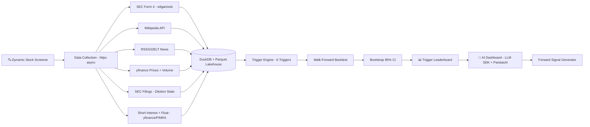

# 🚀 ATTENTION-FLOW CATALYST — Complete Project Scope v9.0

## AI-Powered Predictive Trigger Analysis for Small-Cap Stocks
## A Defensible Research System with Statistical Rigor

**Document Version:** 9.0 (🎯 **v10.0 REALIGNMENT** — **downgraded from flagship to Supporting** (production-grade; size ≠ tier); 3-stage arc (S1 eval-first core → S2 financial-data lakehouse + signalcore → S3 GraphRAG research loop); destination Applied AI Engineer → FDE. "All 5 stages / Senior LLM Engineer" framing retired. Prior v8.6/8.7 note archived below.)
**Last Updated:** June 16, 2026  
**Status:** ✅ APPROVED  
**Author:** Manuel Reyes  

---


## 🎯 v10.0 ROADMAP ALIGNMENT & STAGE-EVOLUTION ARC — AUTHORITATIVE

> **This block governs.** Where anything below it conflicts (old stage numbers, retired titles, pre-v10.0 portfolio lists), **this block wins.**

**Aligned to:** Career Roadmap **v10.0 (2026 Market Realignment)**.

**Governing model:** **3 stages, not 5.** The retired 14-month "ML Engineer" stage is now an **embedded ML-literacy module inside Stage 3** (earned-overlay — ships only if it beats the baseline). The destination title is **Applied AI Engineer → Forward Deployed Engineer (FDE)**; the retired "Senior LLM Engineer" title is dropped. **This project is ONE system that evolves across stages — never rebuilt per stage.**

**Portfolio role:** 🧩 **Supporting** (production-grade; size ≠ tier) — read-only **GraphRAG financial-research** + **faithfulness ≥ 0.9** eval showcase. **Corrects the prior "flagship" self-label.** In v10.0, **flagship vs supporting = size & emphasis, not a quality tier — every project is production-grade.** Lead projects get new tooling first and are updated continuously as skills grow.

**Stage-evolution arc:**

| Stage | Theme | This project's layer |
|---|---|---|
| **S1** | Foundation (GenAI-first core) | Eval-first core (the **AFC Eval-First slice**) — SEC-grounded faithfulness benchmark: filing retrieval + LLM analyst + three-method eval + controlled-perturbation catalog, as a portable benchmark repo. |
| **S2** | DE/AE hardening | Financial-data lakehouse — EDGAR ingestion + PIT data + **signalcore** primitives + **dbt models** over filings/short-interest + contracts + orchestration (the DE/AE layer beneath the research system). |
| **S3** | Applied AI (RAG/agentic + eval) | **GraphRAG financial-KG hybrid** (Neo4j + ChromaDB) + read-only agentic research loop + eval-suite verifier + faithfulness ≥ 0.9 + Phoenix observability. |

- **Every project's S2 adds:** ingestion → **dbt-tested models (CI-gated)** → **data contracts** (Great Expectations) → warehouse/lakehouse → **Airflow** (idempotent runs) → Docker/**ECS** → monitoring + written **postmortem** → **semantic/metrics layer**.
- **Every project's S3 adds:** RAG/GraphRAG/agentic layer + **three-layer eval** (per-query metrics · trajectory tracing · drift vs frozen golden set) + **observability (Arize Phoenix, OTel-native, free)** + MCP + **HITL** on irreversible actions.

**Production standard (non-negotiable, ALL projects):** business-outcome headline · Mermaid diagram · **C4 Context diagram (+ Container view on lead flagships)** 🆕 · **`docs/adr/` — numbered, immutable Architecture Decision Records (context → decision → consequences)** 🆕 · Dockerfile · eval-metrics table · 15–30s demo GIF · "What I Learned" · **synthetic data only in public repos** · `pyproject.toml` + `uv.lock` + `src/` + `py.typed` + ruff + mypy · **structured logging (`structlog` over stdlib via `ProcessorFormatter`) + PII redaction processor · typed config (`pydantic-settings`, `SecretStr` credentials) · capped jittered retries (`stamina`)** · Conventional Commits. *(🆕 C4 + ADR added per roadmap v10.0 CORRECTION 8, July 2026 — additive documentation discipline: the decision-and-defense artifacts Applied-AI/FDE interviews probe; same doc version, no structural change.)* **🆕 Toolchain (v10.0 CORRECTION 14, July 2026):** the C4 diagram and the Mermaid diagram come from **one source** — the architecture is modeled once in **Structurizr DSL** (`docs/architecture.dsl`, version-controlled) and the C4 Context/Container views are exported to **Mermaid** via `structurizr-cli` for the README, so the two never drift. Structurizr Lite is free and self-hosts in Docker (already required); model in Structurizr, render out to Mermaid. Additive; same doc version.* **🆕 Agentic harness (July 2026):** every repo also carries **`.opencode/`** (`agents/` — subagent definitions where the filename becomes the agent name; `commands/` — `/`-invoked slash commands), plus **`AGENTS.md`** and **`opencode.jsonc`** at the root. This mirrors the existing `.cursor/rules/` setup rather than replacing it — OpenCode's `instructions[]` field can load `.cursor/rules/*.md` directly and combines them with `AGENTS.md`, so **one set of standards drives both harnesses** and neither drifts. Tooling discipline, not a portfolio artifact.*

---

## 📋 Table of Contents

1. [Executive Summary](#1-executive-summary)
2. [Research Question](#2-research-question)
3. [Stock Screening Criteria](#3-stock-screening-criteria)
4. [Trigger Framework](#4-trigger-framework)
5. [Backtest Methodology](#5-backtest-methodology) ⭐ NEW
6. [Data Integrity & Bias Controls](#6-data-integrity--bias-controls) ⭐ NEW
7. [Data Architecture: Lakehouse Design](#7-data-architecture-lakehouse-design) ⭐ ENHANCED
8. [Market Data Modes](#8-market-data-modes) ⭐ NEW
9. [Phase 1A Scope — Backtest Engine](#9-phase-1a-scope--backtest-engine-weeks-1-6)
10. [Phase 1B Scope — AI-Powered Dashboard](#10-phase-1b-scope--ai-powered-dashboard-weeks-7-10)
11. [AI Guardrails](#11-ai-guardrails) ⭐ NEW
12. [Tech Stack](#12-tech-stack)
13. [CI/CD Pipeline](#13-cicd-pipeline)
14. [Logging & Debugging](#14-logging--debugging) ⭐ NEW
15. [Project Structure](#15-project-structure)
16. [Project Evolution (3 Stages)](#16-project-evolution-3-stages)
17. [Success Metrics](#17-success-metrics)
18. [Risk Mitigation](#18-risk-mitigation)
19. [Timeline Summary](#19-timeline-summary)

---

## 1. Executive Summary

**Attention-Flow Catalyst** is a **Supporting** project (production-grade — size, not quality, distinguishes it from the lead flagships) that evolves through the **3 stages** toward **Applied AI Engineer → FDE**. It is designed as a **defensible research system**—not just a dashboard—with proper statistical methodology, bias controls, and reproducibility.

### What Makes This Project Different

| Dimension | Typical Tutorial Project | Attention-Flow Catalyst |
|-----------|-------------------------|-------------------------|
| **Data Selection** | Manual stock list | Dynamic screener with survivorship bias controls |
| **Backtest Method** | Naive "if signal, check return" | Walk-forward validation, de-clustering, confidence intervals |
| **Storage** | SQLite or CSV | Lakehouse (partitioned Parquet + DuckDB) |
| **API Calls** | Sequential requests | Async httpx (10-50x faster) |
| **AI Architecture** | Single provider, raw text | Provider-agnostic SDK (**Anthropic Claude primary**, Gemini/OpenAI fallback) |
| **AI Outputs** | Unstructured text responses | Pydantic-validated structured outputs |
| **AI Features** | Gimmicky chatbot | LLM SDK + PandasAI, SQL-first, guardrails & observability |
| **Triggers** | News + Volume only | SEC Form 4, Wiki, News, Volume, **Dilution state**, **Squeeze context (short interest + float)** |
| **Reproducibility** | None | Audit tables, pipeline run logs, version control |
| **CI/CD** | None | GitHub Actions on every PR |

### Core Capabilities

- **Statistical Rigor:** Walk-forward backtesting, bootstrap confidence intervals, multiple testing controls
- **Alternative Data:** SEC Form 4 insider filings, dilution/offering state (S-1, 424B5, 8-K), Wikipedia attention, news mentions, volume patterns
- **Bias Controls:** Survivorship bias handling via historical universe snapshots, corporate actions adjustment
- **Modern Data Stack:** DuckDB for analytics, Parquet lakehouse, httpx for async API calls
- **AI Integration:** Natural language queries via LLM SDK (**Anthropic Claude primary** — financial reasoning quality matters most for AFC's 0.9 faithfulness threshold) + PandasAI with guardrails and SQL transparency
- **Structured Outputs:** Pydantic-validated AI responses with type-safe schemas
- **AI Observability:** Token usage, cost tracking, latency monitoring, guardrail activation logs
- **Production Practices:** GitHub Actions CI, type hints, comprehensive testing, audit logging
- **Domain Expertise:** 6 years of trading knowledge codified into algorithms

---

> 🔁 **Agentic Loop Spec (roadmap v8.8):**
> - **Loop type:** *read-only research / goal-loop* — screen → trigger-detect (T1–T6) → label (+10%-in-3-days) → score → leaderboard; S3 wraps this as the **Agentic Trading Assistant**.
> - **Verifier:** the eval suite — **DeepEval ≥0.9 faithfulness**, SelfCheckGPT / FActScore on SEC-grounded claims; PIT / leakage tests gate the backtest.
> - **Autonomy:** safe to run **unattended** because the system is **read-only** (no orders, no execution). The **"behind the Wall"** rule (LLM sees only aggregated in-sample stats) is the governance that keeps the loop honest. Layered exits: verifier pass + max-iteration cap + token budget.

## 2. Research Question

> **Primary Question:** Which trigger or combination of triggers best predicts +10% price moves within 3 trading days for small-cap stocks?

**Secondary Questions:**
1. Does sector strength context improve trigger hit rates?
2. Does index trend context (bullish vs bearish market) affect performance?
3. Do multi-trigger combinations outperform single triggers?
4. Which volume patterns precede significant moves?
5. Does post-dilution-close create higher probability setups?
6. Are results stable across train vs test periods (walk-forward)?
7. **Does a loaded short-squeeze context (high short-%-of-float + low float + high days-to-cover) lift the hit rate of catalysts T1–T5?** ⭐ NEW

**Hypothesis:** Combining multiple alternative data signals (insider buying + attention spike + volume accumulation + dilution-clear state) will produce higher hit rates than any single signal alone, and these results will be stable out-of-sample.

---

## 3. Stock Screening Criteria

The system dynamically screens for stocks meeting ALL criteria:

| Criterion | Requirement | Rationale |
|-----------|-------------|-----------|
| **Price** | < $5.00 | Bigger percentage move potential |
| **Exchange** | NYSE, NASDAQ, AMEX only | NO OTC/Pink Sheets — better data quality |
| **Float** | Small (bottom 30% of screened universe) | Limited supply = faster moves |
| **Sector** | Strong (top 3 sectors by 20-day performance) | Sector tailwinds increase probability |
| **Volume** | Minimum avg daily volume > 100K | Ensures liquidity for entry/exit |
| **Market Cap** | < $500M (micro/small cap) | Focus on overlooked opportunities |

**Output:** ~50 stocks refreshed weekly that meet all criteria

---

## 4. Trigger Framework

### 4.1 Overview

| ID | Trigger Name | Data Source | Signal Type |
|----|--------------|-------------|-------------|
| **T1** | SEC Form 4 Insider Buy | edgartools | Smart Money |
| **T2** | Wikipedia Attention Spike | Wikipedia API | Public Attention |
| **T3** | News Mention Spike | RSS/GDELT | Media Coverage |
| **T4** | Volume Accumulation (5 sub-signals) | yfinance | Institutional Activity |
| **T5** | Dilution/Offering State | edgartools | Capital Structure ⭐ NEW |
| **T6** | Squeeze Context (short interest + float) | yfinance / FINRA | Supply Pressure ⭐ NEW |

---

### 4.2 T1: SEC Form 4 Insider Buy

```yaml
t1_insider_buy:
  transaction_types:
    - P: "Open market purchase"
    - A: "Grant/Award (if acquisition)"
  minimum_value: $10,000
  insider_types:
    - CEO, CFO, COO, President
    - Director
    - 10% Owner
  lookback_window: 30 days
  signal_fires_when: "Any qualifying purchase detected"
```

---

### 4.3 T2: Wikipedia Attention Spike

```yaml
t2_wiki_attention:
  baseline_period: 30 days rolling average
  spike_threshold: 2.0 standard deviations above baseline
  minimum_daily_views: 100  # filter noise
  lookback_window: 7 days
  signal_fires_when: "Daily views > baseline + (2 × std_dev)"
```

---

### 4.4 T3: News Mention Spike

```yaml
t3_news_spike:
  baseline_period: 14 days rolling average
  spike_threshold: 2.0 standard deviations above baseline
  minimum_mentions: 3 per day  # filter noise
  sentiment_filter: null  # Phase 1 = volume only
  lookback_window: 7 days
  signal_fires_when: "Daily mentions > baseline + (2 × std_dev)"
```

---

### 4.5 T4: Volume Accumulation (5 Sub-Signals)

| ID | Signal | Calculation | Threshold |
|----|--------|-------------|-----------|
| **T4a** | RVOL | Today's volume / 20-day avg | ≥ 1.5 |
| **T4b** | Accumulation Score | (Close-Low)/(High-Low) × Volume | Rising over 5 days |
| **T4c** | OBV Breakout | Cumulative volume | 20-day high |
| **T4d** | Quiet Accumulation | Price flat + OBV rising | Price < 2% / 10 days, OBV up |
| **T4e** | Volume Dry-Up | Volume < 50% avg for 3+ days | Tight range < 3% |

---

### 4.6 T5: Dilution / Offering State (NEW)

**What It Detects:** Capital structure changes that affect supply/demand dynamics.

**Forms Tracked:**
- **S-1, S-3:** Shelf registration filed
- **424B5:** Prospectus supplement — offering PRICED
- **8-K:** Material event — offering CLOSED
- **EFFECT:** Registration statement effective

**State Machine:**
```yaml
t5_state_machine:
  states:
    CLEAR: "No recent dilution (> 90 days since last event)"
    OVERHANG: "Shelf registration filed, no active deal"
    ACTIVE_DEAL: "Offering priced, shares being sold"
    CLOSED: "Offering completed within 30 days"
    
  transitions:
    CLEAR → OVERHANG: "S-3/S-1 filed"
    OVERHANG → ACTIVE_DEAL: "424B5 filed"
    ACTIVE_DEAL → CLOSED: "8-K announcing completion"
    CLOSED → CLEAR: "30 days elapsed"
```

**Combination Hypotheses:**
- `T5_CLOSED + T1 (insider buy)` = Strong bullish conviction
- `T5_CLOSED + T2 (attention) + T4 (volume)` = Post-dilution reversal
- `T5_OVERHANG + ANY trigger` = Reduce expected hit rate

---

### 4.7 T6: Squeeze Context (NEW)

**What It Detects:** a *loaded* short-squeeze state — a large block of obligated future buying (short interest) trapped against a small tradable supply (float). Conceptual reference: `Short_Squeeze_Context_Reference.md`.

> **Role — read this first.** T6 is **fuel, not a spark.** Short interest is a reservoir of forced future buying; it does *nothing* until a catalyst ignites it. So T6's **primary** use is as a **context filter** (the 5th context in §4.8), answering "does a loaded squeeze state lift the hit rate of catalysts T1–T5?" — **not** as a standalone leg blown out across the full trigger-combination matrix. Treating fuel as a catalyst would be mechanically wrong and would explode the multiple-testing surface (63 combos × contexts) for setups that are already rare.

**Metrics** (computed from `signalcore` primitives — short interest + float; see Boundary Spec):

| Metric | Formula | Covers |
|---|---|---|
| `pct_float_short` | `shares_short / float` | Supply pressure — the fuel |
| `days_to_cover` (≡ short interest ratio) | `shares_short / avg_daily_volume` | Time-to-exit — congested cover |
| `float_turnover` | `daily_volume / float` | Velocity — real-time ignition tell |

```yaml
t6_squeeze_context:
  role: "CONTEXT (loaded state). Fuel, not spark. Primary use = 5th context filter (§4.8)."
  data_source:
    short_interest: "FINRA bi-monthly (via yfinance sharesShort) — LAGGED ~2 weeks"
    float: "yfinance floatShares (re-derive on dilution events; see T5)"
    volume / avg_daily_volume: "yfinance daily / 20-day"
  loaded_state_when:                 # the CONTEXT (potential) — a-priori, to be tuned in-sample only
    pct_float_short: ">= 0.20"       # test 0.15–0.30
    days_to_cover:   ">= 5"          # test 3–10
    float:           "bottom 30% of universe (already screened in §3)"
  ignition_tell:                     # optional live confirmation
    float_turnover_spike: ">= 2.0x its 20-day median"
  fires_when: "loaded_state AND paired with a catalyst (T1–T5) — NEVER standalone"
  squeeze_combination_hypotheses:
    - "T6_loaded + T1 (insider buy)   = smart money buying into trapped shorts (highest conviction)"
    - "T6_loaded + T2/T3 (attention)  = retail-driven ignition"
    - "T6_loaded + T4 (RVOL/accum)    = squeeze likely already underway"
    - "T6_loaded + T5_CLOSED          = post-dilution squeeze (float fixed, shorts offside)"
  caveats:
    - "Short interest is bi-monthly / lagged ~2 weeks — a real weakness vs the 3-day horizon; measure it, don't assume it away."
    - "High short interest is often justified (deteriorating fundamentals) — fuel is NOT bullish alone."
    - "Squeeze setups are RARE — the 30-signal minimum (§5.5) will exclude many squeeze-context scenarios; report honest n."
    - "Float is not static — re-derive from the T5 dilution state on offerings/lockups; do not cache."
```

---

### 4.8 Combination Testing Matrix

**Individual Triggers (5):** T1, T2, T3, T4, T5_CLOSED

**2-Trigger Combinations (10)**
**3-Trigger Combinations (10)**
**4-Trigger Combinations (5)**
**5-Trigger Combination (1)**

**With Context Filters (×5):**
- No filter
- Sector strength filter
- Index trend filter
- Dilution state filter
- **Squeeze-context filter (T6 loaded state)** ⭐ NEW

**Total Potential Scenarios:** 31 combinations × 5 contexts = **~155 scenarios**

> **Why T6 is a context, not a 6th combinatorial trigger:** squeeze fuel is not a catalyst, so it is tested as an overlay that either lifts or doesn't lift the existing catalysts — not as another standalone leg. This keeps the scenario count at 155 rather than exploding to 63 combos × 5 = 315, which matters under the §5.5 multiple-testing controls and the 30-signal floor (squeeze setups are rare).

---

## 5. Backtest Methodology

> **This section defines the rules that make results trustworthy.**

### 5.1 Signal Anchor Definition

```yaml
signal_anchor:
  rule: "Signal confirmed at market close"
  measurement_start: "Next trading day open"
  measurement_period: "3 trading days (close-to-close)"
  
  example:
    signal_date: "2025-01-15 (Wednesday close)"
    entry_price: "2025-01-16 open (Thursday)"
    exit_price: "2025-01-21 close (Tuesday)"
    return: "(exit - entry) / entry"
```

### 5.2 De-Clustering Rule

```yaml
de_clustering:
  rule: "One active signal per ticker per 5 trading days"
  
  example:
    day_1: "ABCD fires T1 → COUNTED"
    day_2: "ABCD fires T1 → IGNORED (within 5-day window)"
    day_3: "ABCD fires T4 → COUNTED (different trigger type)"
    day_6: "ABCD fires T1 → COUNTED (new window)"
    
  rationale: "Prevents inflated hit rates from consecutive signals"
```

### 5.3 Transaction Cost Model

```yaml
transaction_costs:
  slippage_bps: 25      # 0.25% for small-cap entry
  spread_proxy_bps: 50  # typical bid-ask spread
  commission: 0         # most brokers commission-free
  
  total_round_trip: 150 bps (1.5%)
  
  hit_threshold:
    gross: "+10% raw return"
    net: "+11.5% raw return (to net +10% after costs)"
```

### 5.4 Walk-Forward Validation

```yaml
walk_forward:
  training_period: "Year 1 - Year 2 (24 months)"
  testing_period: "Year 3 (12 months)"
  
  rules:
    - "Tune thresholds on training period ONLY"
    - "Leaderboard rankings based on TEST period ONLY"
    - "NO re-tuning after seeing test results"
    
  process:
    1: "Run backtest on training period"
    2: "Identify top 10 trigger combinations"
    3: "Run SAME combinations on test period (no changes)"
    4: "Report test period metrics as final"
```

### 5.5 Multiple Testing Controls

```yaml
multiple_testing_controls:
  minimum_signal_count:
    threshold: 30 signals minimum per scenario
    action: "Exclude scenarios with < 30 signals"
    
  confidence_intervals:
    method: "Bootstrap 95% CI on hit rate"
    iterations: 1000
    reporting: "Hit rate [CI_low - CI_high]"
    
  stability_check:
    method: "Compare train vs test rankings"
    metric: "Spearman rank correlation"
    threshold: "> 0.5 correlation = stable"
```

---

## 6. Data Integrity & Bias Controls

### 6.1 Survivorship Bias Policy

```yaml
survivorship_bias:
  problem: "Screening TODAY's stocks and backtesting 3 years = bias"
  
  solution: "Historical universe snapshots"
  
  implementation:
    frequency: "Weekly (every Monday)"
    storage: "data/processed/universes/universe_{YYYY}_{WW}.parquet"
    
    backtest_rule: |
      For each historical signal date, use the universe snapshot
      that was active at that time. A stock must have been in
      the universe BEFORE the signal to be included.
```

### 6.2 Corporate Actions Handling

```yaml
corporate_actions:
  splits:
    handling: "Use adjusted close for all return calculations"
    
  reverse_splits:
    handling: "Flag, use adjusted prices, exclude 5 days post-split"
    
  ticker_changes:
    storage: "ticker_history table with old → new mapping"
    
  delistings:
    policy: "Include in backtest up to delist date"
    bankruptcy: "Return = -100% (total loss)"
```

### 6.3 Calendar & Timezone

```yaml
calendar:
  timezone: "US/Eastern"
  source: "pandas_market_calendars (NYSE)"
  
  data_availability_rule: |
    Signal on date D can only use data available by market close on D.
```

---

## 7. Data Architecture: Lakehouse Design

### 7.1 Parquet Partitioning

```yaml
parquet_structure:
  raw_prices: "data/raw/prices/{source}/year={YYYY}/month={MM}/{ticker}.parquet"
  raw_events: "data/raw/events/{source}/year={YYYY}/month={MM}/events.parquet"
  processed_triggers: "data/processed/triggers/year={YYYY}/triggers.parquet"
  processed_universes: "data/processed/universes/universe_{YYYY}_{WW}.parquet"
```

### 7.2 Persistent DuckDB Schema

```yaml
duckdb_file: "data/db/afc.duckdb"

dimension_tables:
  - dim_company: "ticker, name, sector, exchange, dates"
  - dim_calendar: "date, is_trading_day, week_id, month_id"
  - dim_trigger_type: "trigger_id, name, category, description"

fact_tables:
  - fact_signals: "signal_id, ticker, date, trigger, return, hit"
  - fact_backtest_results: "scenario, period, signals, hit_rate, CI"

audit_tables:
  - audit_pipeline_runs: "run_id, pipeline, status, rows, timestamp"
  - audit_data_quality: "issue_id, table, check, passed, details"
```

### 7.3 DuckDB Views (Query Parquet)

```sql
CREATE VIEW v_prices AS
SELECT * FROM read_parquet('data/raw/prices/**/*.parquet');

CREATE VIEW v_active_signals AS
SELECT * FROM fact_signals 
WHERE signal_date >= CURRENT_DATE - 7;

CREATE VIEW v_leaderboard AS
SELECT trigger_combination, hit_rate_net, hit_rate_ci_low, hit_rate_ci_high
FROM fact_backtest_results
WHERE period = 'test' AND signal_count >= 30
ORDER BY hit_rate_net DESC;
```

---

## 8. Market Data Modes

### 8.1 Mode A: Intraday (Future)

```yaml
mode_a_intraday:
  providers: "Polygon.io ($29-199/mo), Alpaca ($0-99/mo)"
  resolution: "1-minute bars"
  features: "True VWAP, intraday volume profile, T4f VWAP Hold"
  when: "Stage 2+ when budget allows"
```

### 8.2 Mode B: Daily Only (Phase 1A)

```yaml
mode_b_daily:
  provider: "yfinance (FREE)"
  resolution: "Daily OHLCV"
  
  features_enabled:
    - All T1 (insider) ✅
    - All T2 (wiki) ✅
    - All T3 (news) ✅
    - T4a-e (all volume signals) ✅
    - All T5 (dilution) ✅
    - T6 (squeeze context) ✅  # short interest is bi-monthly anyway → daily mode sufficient (lag noted)
    
  features_disabled:
    - True VWAP (no intraday)
    - T4f VWAP Hold
```

### 8.3 Phase 1A Decision

```yaml
phase_1a_decision:
  selected: "Mode B (daily-only)"
  rationale:
    - "FREE — no budget required"
    - "Sufficient for validating core hypothesis"
    - "All primary triggers work with daily data"
```

---

## 9. Phase 1A Scope — Backtest Engine (Weeks 1-6)

### 9.1 Deliverables

| # | Deliverable | Acceptance Criteria |
|---|-------------|---------------------|
| 1 | Project Setup | CI green, pre-commit working |
| 2 | Stock Screener | ~50 stocks, proper filters |
| 3 | Universe Snapshots | Weekly Parquet files |
| 4 | Sector Strength | 11 ETFs tracked |
| 5 | Async Collectors | httpx parallel calls |
| 6 | Price Pipeline | 3+ years, adjusted prices |
| 7 | T1-T6 Detectors | All triggers working |
| 8 | DuckDB Schema | All tables created |
| 9 | Backtest Engine | Walk-forward, de-clustering |
| 10 | Bootstrap CI | 95% CI on all hit rates |
| 11 | Leaderboard | Test period metrics |
| 12 | Signal Generator | Daily active signals |
| 13 | Data Quality | Automated checks |
| 14 | Documentation | README, .cursor/rules/ |
| 15 | Test Suite | >80% coverage |

### 9.2 Week-by-Week

| Week | Focus |
|------|-------|
| 1 | Setup, CI, screener, universe builder |
| 2 | Collectors (httpx), Parquet, corporate actions |
| 3 | T1-T6 triggers, state machine |
| 4 | DuckDB schema, backtest core, de-clustering |
| 5 | Walk-forward, bootstrap CI, combinations |
| 6 | Signal generator, quality checks, docs |

---

## 10. Phase 1B Scope — AI-Powered Dashboard (Weeks 7-10)

### 10.1 Deliverables

| # | Deliverable | Acceptance Criteria |
|---|-------------|---------------------|
| 1 | Streamlit Shell | Multi-page, responsive |
| 2 | Home Page | Quick stats, AI insights |
| 3 | Leaderboard Page | Sortable, with CI |
| 4 | Screener Page | Current universe |
| 5 | Active Signals | Today's watchlist |
| 6 | Backtest Explorer | Historical signals |
| 7 | LLM SDK Integration | Provider-agnostic AI layer (**Anthropic Claude primary**, Gemini fallback) |
| 8 | Pydantic Response Models | Structured outputs for all AI responses |
| 9 | PandasAI | Supplementary chat + SQL transparency |
| 10 | AI Guardrails | Read-only, governance as code, disclaimers |
| 11 | AI Observability | Token/cost/latency tracking per query |
| 12 | Deployment | Streamlit Cloud live |
| 13 | Demo Video | 60 seconds |

### 10.2 Dashboard Wireframe

```
┌─────────────────────────────────────────────────────────────┐
│  🚀 ATTENTION-FLOW CATALYST                                 │
├─────────────────────────────────────────────────────────────┤
│  📊 Quick Stats                                             │
│  │ 50 Stocks │ 12 Signals │ 62.5% Hit │ T1+T4+T5_CLOSED │  │
├─────────────────────────────────────────────────────────────┤
│  🤖 AI Insights (LLM SDK — Anthropic Claude primary)        │
│  "T1+T4+T5_CLOSED shows 62.5% hit rate [55-70% CI]..."     │
│  📝 Query: SELECT ... FROM v_leaderboard LIMIT 5            │
│  📊 Tokens: 342 input / 128 output | Cost: $0.0003          │
│  ⚠️ AI insights are explanatory, not financial advice.     │
├─────────────────────────────────────────────────────────────┤
│  💬 Ask a Question: [________________________] [Ask]        │
└─────────────────────────────────────────────────────────────┘
```

---

## 11. AI Guardrails

### 11.1 Access Control

```yaml
ai_access:
  mode: "Read-only"
  allowed: "SELECT, aggregations, joins"
  prohibited: "INSERT, UPDATE, DELETE, file access"
```

### 11.2 Governance as Code

```python
# src/ai/guardrails.py — Testable guardrail logic
class AIGuardrail:
    """Validates AI queries before execution.
    
    Unlike config-only guardrails, this approach is testable
    with pytest and enforced at runtime.
    """
    def validate_query(self, query: str) -> GuardrailResult:
        """Check query against security rules."""
        # Check for modification attempts (INSERT, UPDATE, DELETE)
        # Check against blocked tables (v_prices, audit_*)
        # Check row scan limits (max 10,000)
        # Check token budget (4000 max)
        # Return validated or rejected with reason
        
    def validate_table_access(self, sql: str) -> bool:
        """Ensure query only touches allowed tables."""
        # Parse SQL for table references
        # Compare against allowed_tables whitelist
        
    def sanitize_response(self, response: BaseModel) -> BaseModel:
        """Ensure AI response contains no inappropriate content."""
        # Verify no financial advice language
        # Confirm disclaimer attached
        # Log guardrail activation if triggered
```

### 11.3 Table Restrictions

```yaml
allowed_tables:
  - v_leaderboard
  - v_active_signals
  - dim_company
  - fact_backtest_results

blocked_tables:
  - v_prices (too large)
  - audit_* (internal)

row_limits:
  max_scan: 10000
  max_return: 1000
```

### 11.4 Transparency

```yaml
transparency:
  show_sql: "Every response shows the SQL query used"
  show_source: "Display source table and row count"
  show_limitations: "Acknowledge when data insufficient"
```

### 11.5 Cost Controls

```yaml
cost_controls:
  caching: "1 hour TTL for identical queries"
  token_limits: "4000 total tokens per request"
  rate_limits: "100 queries/day"
```

### 11.6 Disclaimers

```yaml
disclaimers:
  text: "⚠️ AI insights are explanatory, not financial advice."
  location: "Footer of every AI response"
```

---

## 12. Tech Stack

### Phase 1A: Backtest Engine

| Category | Technology |
|----------|------------|
| Language | Python 3.11+ |
| Storage | Parquet (partitioned) |
| Query | DuckDB |
| HTTP | httpx (async) |
| SEC Data | edgartools |
| Market Data | yfinance |
| Wiki | Wikipedia API |
| News | feedparser, GDELT |
| Statistics | scipy, numpy |
| **Logging** | **logging (stdlib) + python-json-logger** |
| Testing | pytest, pytest-asyncio |
| Linting | Ruff, mypy |
| CI/CD | GitHub Actions |

### Phase 1B: Dashboard

| Category | Technology |
|----------|------------|
| Web | Streamlit |
| Charts | Plotly |
| **AI (Primary)** | **LLM SDK (Anthropic Claude primary, Gemini/OpenAI fallback) — prompt caching reduces costs ~90% on repeated SEC filing context** |
| **AI (Supplementary)** | **PandasAI (natural language data querying)** |
| **Structured Outputs** | **Pydantic v2 (response validation)** |
| **AI Observability** | **Python logging + token/cost tracking** |
| Hosting | Streamlit Cloud (FREE) |
| **AI Evaluation** | **DeepEval (answer relevancy, faithfulness > 0.9 for financial data accuracy)** |
| **Containerization** | **Docker (Dockerfile for app + DuckDB deployment)** |

---

## 13. CI/CD Pipeline

### GitHub Actions

```yaml
# .github/workflows/ci.yml
on: [push, pull_request]
jobs:
  test:
    steps:
      - Checkout
      - Setup Python 3.11/3.12
      - Install dependencies
      - Ruff lint
      - mypy type check
      - pytest with coverage
      - Upload to Codecov
```

### Pre-commit

```yaml
# .pre-commit-config.yaml
- ruff (lint + format)
- trailing-whitespace
- end-of-file-fixer
- check-yaml
- mypy
```

---

## 14. Logging & Debugging

> **🆕 CORRECTION 16 (v10.0):** this section is rewritten to the structured-logging standard.
> The previous design — a `config/logging.yaml` dictConfig, a `logs/` tree of
> `TimedRotatingFileHandler` outputs, and f-string log calls — is superseded on three counts:
> f-strings destroy queryability, per-domain file handlers duplicate and interleave lines, and
> Python-side rotation duplicates what the container runtime already does. All headings are
> preserved; only the mechanism changed.

### 14.1 Logging Directory Structure

**Primary destination is stdout.** Rotation, shipping and retention belong to Docker /
systemd / the log aggregator, not to Python (12-Factor). "Per-domain logs" become *derived
views* — filter on the `logger` field or the event name downstream.

```
logs/                             # gitignored; NOT the primary destination
├── evaluation/                   # DeepEval/RAGAS result artifacts (not app logs)
└── runs/                         # ⏸️ OPT-IN ONLY — long unattended local collector /
    └── run_<id>.jsonl            #    backtest runs, via an explicit log_file= argument.
                                  #    Never the default. Never inside a container.
```

Everything the old tree separated by file (`collectors`, `backtest`, `ai`, `guardrails`) is
now one stdout stream, separable by field:

| Old file | Now retrieved by |
|----------|------------------|
| `collectors/collectors.log` | `logger` starts with `afc.collectors` |
| `collectors/errors/sec_errors.log` | `logger == "afc.collectors.sec"` and `level == "error"` |
| `backtest/runs/backtest_{id}.log` | `run_id == "<id>"` (bound via contextvars) |
| `ai/queries.log` | `event == "ai_query_completed"` |
| `ai/guardrails.log` | `event == "guardrail_blocked"` |

### 14.2 Logging Configuration

No YAML. Configuration is typed Python in `src/observability/logging.py`, per the
`python-production-standards.mdc` rule — `structlog` renders both its own records and every
foreign stdlib record (edgartools, httpx, Neo4j, DuckDB) through one `ProcessorFormatter`
chain, so third-party output cannot drift into a second format.

```python
# src/observability/logging.py  (see python-production-standards.mdc for the full module)
SHARED_PROCESSORS = [
    structlog.contextvars.merge_contextvars,   # run_id, ticker, trigger_id
    structlog.stdlib.add_logger_name,
    structlog.stdlib.add_log_level,
    structlog.processors.TimeStamper(fmt="iso", utc=True),
    structlog.processors.StackInfoRenderer(),
    structlog.processors.UnicodeDecoder(),
    redact_pii,                                # choke point — runs on foreign records too
]

THIRD_PARTY_LEVELS = {
    "httpx": logging.WARNING,
    "httpcore": logging.WARNING,
    "urllib3": logging.WARNING,
    "neo4j": logging.WARNING,
    "anthropic": logging.INFO,
}

# Renderer is selected at runtime, replacing the old YAML's three named
# formatters (standard / detailed / json) with one TTY check.
json_mode = force_json or not sys.stderr.isatty()
renderer = (
    structlog.processors.JSONRenderer()          # containers, CI, prod
    if json_mode
    else structlog.dev.ConsoleRenderer(colors=True)   # local dev
)
```

| Old YAML formatter | Replacement |
|---|---|
| `standard` (console, `%`-format) | `structlog.dev.ConsoleRenderer(colors=True)` — auto-selected on a TTY |
| `detailed` (adds `funcName:lineno`) | not needed — `add_logger_name` + `StackInfoRenderer` carry it structurally |
| `json` (`pythonjsonlogger`) | `structlog.processors.JSONRenderer` + `dict_tracebacks` — auto-selected off-TTY |

Dropping `python-json-logger` is deliberate: with `ProcessorFormatter` the event dict is
rendered by structlog itself, so the stdlib formatter no longer owns (and can no longer
silently drop) the context fields.

`configure_logging()` is called **once**, at the entrypoint (`app.py`, the CLI, the DAG task).
Never inside a collector, a trigger module, or anything importable — and never in `signalcore`
(see the boundary spec §7).

### 14.3 Logging Utility Module

The hand-rolled `setup_logging()` / `get_logger()` / `LogContext` / `get_run_logger()` helpers
are retired — `structlog` supplies all four capabilities natively:

| Retired helper | Replacement |
|----------------|-------------|
| `setup_logging(config_path=...)` | `configure_logging(level=..., force_json=...)` |
| `get_logger("collectors.sec")` | `structlog.stdlib.get_logger(__name__)` |
| `LogContext(logger, "...")` | `structlog.contextvars.bind_contextvars(...)` |
| `get_run_logger("backtest", run_id=...)` | `bind_contextvars(run_id=...)` — one stream, filterable |

Retiring `get_run_logger` is the substantive win: a per-run *file* cannot be joined against
anything, whereas a per-run *field* lets one query span collectors, triggers and backtest in a
single timeline.

### 14.4 Usage Examples

```python
import structlog
from src.observability.logging import configure_logging

configure_logging()                       # once, at the entrypoint
log = structlog.stdlib.get_logger(__name__)

# Bind run context — every downstream line, including edgartools' and httpx's,
# inherits run_id without being passed a logger.
structlog.contextvars.clear_contextvars()  # ALWAYS first — prevents cross-run bleed
structlog.contextvars.bind_contextvars(run_id=run_id, pipeline="sec_collection")

log.info("collection_started", ticker_count=len(tickers), source="sec_form4")
log.debug("ticker_processing", ticker=ticker)
log.warning("rate_limit_approaching", remaining=remaining, source="sec")
log.error("filing_fetch_failed", ticker=ticker, exc_info=True)

# Per-ticker context inside the loop
for ticker in tickers:
    with structlog.contextvars.bound_contextvars(ticker=ticker):
        collect_insider_filings(ticker)

log.info("collection_completed", ticker_count=len(tickers), elapsed_ms=elapsed)
```

### 14.5 Log Levels Guide

| Level | When to Use | Example |
|-------|-------------|---------|
| **DEBUG** | Detailed diagnostic info | `log.debug("query_returned", row_count=len(rows))` |
| **INFO** | General operational events | `log.info("backtest_completed", scenario=scenario_id)` |
| **WARNING** | Unexpected but handled | `log.warning("data_missing", ticker="AAPL", strategy="interpolation")` |
| **ERROR** | Operation failed | `log.error("api_request_failed", source="sec", exc_info=True)` |
| **CRITICAL** | Severe; may not continue | `log.critical("database_unavailable", db="afc.duckdb")` |

Event names are stable `snake_case` **identifiers**, not sentences. Renaming one breaks
downstream filters exactly as renaming a column breaks SQL.

### 14.6 Error Tracking Pattern

```python
import httpx
import stamina
import structlog

log = structlog.stdlib.get_logger(__name__)


# stamina detects structlog and logs each scheduled retry automatically —
# retry storms become visible without any extra code.
@stamina.retry(on=(httpx.HTTPError, httpx.TimeoutException), attempts=3, timeout=60.0)
async def collect_wiki_pageviews(ticker: str) -> pd.DataFrame | None:
    """Collect pageviews. Transport errors retry; anything else fails loudly."""
    async with httpx.AsyncClient() as client:
        response = await client.get(url)
        response.raise_for_status()

    log.info("collection_succeeded", ticker=ticker, day_count=len(data), source="wiki")
    return pd.DataFrame(data)


# At the call site — retries are exhausted by the time we get here.
try:
    df = await collect_wiki_pageviews(ticker)
except httpx.HTTPStatusError as exc:
    log.error("http_error", ticker=exc.request.url.host, status=exc.response.status_code)
    df = None
except Exception:
    log.exception("collection_failed_unexpectedly", ticker=ticker)   # includes traceback
    df = None
```

Two rules carried over from the standard: never retry a 4xx that is not 429 (it will fail
identically), and never retry a write without an idempotency key.

### 14.7 Gitignore for Logs

```gitignore
# Logs — stdout is primary; these are opt-in local artifacts only
logs/
*.log
*.jsonl

# Keep directory structure
!logs/.gitkeep
!logs/*/
!logs/*/.gitkeep

# Evaluation artifacts ARE tracked (they back the README metrics table)
!logs/evaluation/
!logs/evaluation/**
```

---


## 15. Project Structure

```
attention-flow-catalyst/
├── .cursor/
│   ├── rules/                    # Production standards (version-controlled)
│   │   ├── git-workflow.mdc      # alwaysApply: true — branch, commit, PR conventions
│   │   ├── learning-mode.mdc     # alwaysApply: true — learning patterns, skill progression
│   │   ├── python-production-standards.mdc  # alwaysApply: true — code style, types, testing
│   │   ├── streamlit-patterns.mdc    # Auto-attached: app/**/*.py
│   │   ├── ai-sdk-patterns.mdc       # Auto-attached: src/ai/**/*.py
│   │   └── evaluation.mdc           # Auto-attached: tests/test_eval.py
│   ├── commands/                 # Repeatable agent workflows (/command-name)
│   │   ├── draft-issue.md        # /draft-issue <goal>
│   │   ├── task-brief.md         # /task-brief <issue#>
│   │   ├── pr-prep.md            # /pr-prep
│   │   ├── review.md             # /review
│   │   ├── test.md               # /test
│   │   ├── eval.md               # /eval
│   │   └── commit-msg.md         # /commit-msg
│   ├── hooks/                    # Auto-run scripts
│   │   └── format.sh             # Auto-format (black + ruff) after agent edits
│   ├── hooks.json                # Hook configuration
│   └── plans/                    # Saved task briefs per Issue
│       └── issue-XX-task-brief.md
├── .cursorignore                 # Excludes data/logs/venv from Cursor indexing
├── .opencode/                    # OpenCode agentic harness (mirrors .cursor/; portable across editors)
│   ├── agents/                   # subagent defs — filename = agent name (per OpenCode spec)
│   │   ├── docs-fix.md           # repairs drift in README / scope docs
│   │   ├── docs-sync.md          # keeps the 3 public docs aligned to the roadmap
│   │   ├── eval-guardian.md      # guards the eval-first blocking gates
│   │   ├── learn.md              # explain-before-merge; enforces "no vibe coding"
│   │   ├── pattern-scout.md      # finds prior art in-repo before new code
│   │   └── security-auditor.md   # secrets / dependency / config audit
│   ├── commands/                 # slash commands — /review, /test, /commit-msg, ...
│   │   ├── commit-msg.md
│   │   ├── draft-issue.md
│   │   ├── eval.md
│   │   ├── labels.md
│   │   ├── pr-prep.md
│   │   ├── readme.md
│   │   ├── review.md
│   │   ├── task-brief.md
│   │   └── test.md
│   ├── .gitignore                # ignores node_modules/ (harness deps are installed, not committed)
│   ├── package.json              # pinned OpenCode plugin dependencies
│   └── package-lock.json         # committed — reproducible harness
├── AGENTS.md                     # standing instructions; combined with opencode.jsonc instructions[]
├── opencode.jsonc                # harness config — model routing, permissions, instructions[]
├── .github/
│   ├── templates/                # Production workflow templates
│   │   ├── issue_template.md     # GitHub Issue format
│   │   ├── project_labels.md     # Approved labels + definitions
│   │   ├── pull_request_template.md  # PR body format
│   │   └── cursor_task_brief.md  # Agent execution contract
│   └── workflows/ci.yml
├── config/
│   ├── thresholds.yaml
│   └── # (no logging.yaml — 🆕 CORRECTION 16: logging is configured in
│                                 #  src/observability/logging.py, not YAML dictConfig)
├── data/
│   ├── raw/prices/, events/
│   ├── processed/triggers/, universes/
│   ├── db/afc.duckdb
│   └── outputs/
├── logs/                         # ⭐ Logging directory
│   ├── app/                      # Dashboard logs
│   ├── pipeline/                 # Pipeline logs
│   │   └── runs/                 # Per-run logs
│   ├── collectors/               # API collector logs
│   │   └── errors/               # Error-specific logs
│   ├── backtest/                 # Backtest logs
│   │   └── runs/                 # Per-scenario logs
│   ├── ai/                       # ⭐ AI observability logs
│   │   ├── queries.log           # LLM queries, tokens, cost, latency
│   │   └── guardrails.log        # Guardrail activations
│   ├── evaluation/               # ⭐ DeepEval evaluation results
│   ├── debug/                    # Verbose debug logs
│   └── errors.log                # Aggregated errors
├── src/
│   ├── __init__.py
│   ├── py.typed                  # PEP 561 — type hint support marker
│   ├── observability/           # 🆕 CORRECTION 16
│   │   ├── __init__.py
│   │   └── logging.py          # configure_logging() + redact_pii processor
│   ├── screener/
│   ├── collectors/
│   ├── triggers/
│   ├── backtest/
│   ├── signals/
│   ├── database/
│   ├── ai/                       # ⭐ AI integration layer (2026 patterns)
│   │   ├── __init__.py
│   │   ├── provider.py           # Provider-agnostic LLM abstraction
│   │   ├── schemas.py            # Pydantic response models (structured outputs)
│   │   ├── guardrails.py         # Governance as code (testable)
│   │   └── observability.py      # Token/cost/latency tracking
│   └── utils/
│       ├── __init__.py
│       ├── config.py
│       ├── logging.py            # ⭐ Logging utilities
│       ├── calendar.py
│       └── async_utils.py
├── app/
│   ├── pages/
│   ├── components/
│   └── utils/
├── tests/
│   ├── conftest.py               # Shared fixtures, mock APIs, test DuckDB, sample data
│   ├── ...
│   ├── test_ai_guardrails.py     # ⭐ AI guardrails unit tests
│   ├── test_eval.py              # ⭐ DeepEval AI quality evaluation tests
│   └── eval_dataset.json         # ⭐ 30+ analytics query-response pairs for evaluation
├── notebooks/
├── scripts/
├── Dockerfile                    # Container definition
├── .dockerignore                 # Excludes .git, logs, data/raw, tests, notebooks from image
├── .env.example                  # Required environment variables template
├── .gitignore
├── CONTRIBUTING.md               # Branch naming, commit style, PR process
├── LICENSE                       # MIT License
├── Makefile                      # make test, make lint, make eval, make docker-build
├── pyproject.toml                # Project metadata, dependencies, tool config (PEP 621)
├── uv.lock                        # committed lockfile — deterministic installs; `uv sync --frozen` in CI/Docker
├── docs/                          # architecture + decision records (v10.0 CORRECTION 8/14)
│   ├── architecture.dsl           # Structurizr DSL — single C4 model source; exported to Mermaid via structurizr-cli
│   └── adr/                       # numbered, immutable ADRs (context → decision → consequences)
│       ├── 0001-record-architecture-decisions.md
│       └── 0002-....md            # one file per architecturally-significant decision
└── README.md
```

---

## 16. Project Evolution (3 Stages)

| Stage | Role | Enhancements |
|-------|------|--------------|
| S1 | Foundation (GenAI-first core) | Backtest engine + AI dashboard + **eval-first faithfulness core** |
| S2 | DE/AE hardening | EDGAR ingestion, Airflow, 500+ tickers, **signalcore** primitives, **dbt models + contracts**. 🆕 **Financial Knowledge Graph + Vector DB (GraphRAG capstone):** SEC filings → **Neo4j KG** (companies, filings, insiders, holdings, dates) + vector index, served via a **hybrid retriever** for multi-hop explainable reasoning. Vector stays the backbone (~80%); the graph adds relationship reasoning. |
| S3 | Applied AI (GraphRAG + agentic + eval) | ML triggers (XGBoost/LSTM/MLflow — **earned-overlay**). GraphRAG financial-KG hybrid + **read-only agentic research loop** (orchestrator-workers → Analyst workers; Risk-Manager gate; evaluator-optimizer self-correction) calling SEC/market APIs via **MCP**; **faithfulness ≥ 0.9** + **Phoenix**. *Optional beyond-portfolio: multi-tenant SaaS, A2A.* |

---

## 17. Success Metrics

### Phase 1A

| Metric | Target |
|--------|--------|
| Price history | 3+ years, 50+ stocks |
| Universe snapshots | Weekly |
| Walk-forward | Y1-2 train, Y3 test |
| De-clustering | 5-day rule |
| Bootstrap CI | 95% on all |
| Test coverage | >80% |
| CI | All green |

### Phase 1B

| Metric | Target |
|--------|--------|
| Pages working | All 6 |
| AI transparency | 100% SQL shown |
| Structured outputs | 100% Pydantic-validated |
| Provider switching | Gemini ↔ OpenAI works via config |
| AI observability | Token/cost/latency logged per query |
| Guardrail test coverage | >90% |
| Deployment | Streamlit Cloud |
| Load time | <5 seconds |

---

## 18. Risk Mitigation

| Risk | Mitigation |
|------|------------|
| Survivorship bias | Historical universe snapshots |
| Overfitting | Walk-forward validation |
| Multiple testing | Bootstrap CI, min 30 signals |
| API limits | Caching, async batching |
| AI hallucinations | SQL transparency, Pydantic structured outputs, governance as code |
| Provider lock-in | Provider-agnostic abstraction layer (swap via config) |
| AI cost overruns | Token/cost observability, rate limits, caching |

---


### AI Evaluation Layer (Financial Data — Higher Threshold)

AFC uses DeepEval with **elevated thresholds** because incorrect financial analysis
can mislead trading decisions. Faithfulness is set to 0.9 (vs 0.85 standard).

**v8.3 Enhancement:** Beyond DeepEval, AFC adds **SelfCheckGPT** (consistency-based) 
and **FActScore** (atomic-fact decomposition with SEC retrieval verification) — 
financial-grade rigor justified by trading decision risk.

**Frameworks:** DeepEval + SelfCheckGPT + FActScore (all pytest-compatible, open-source)

| Metric | Target | Why Higher |
|--------|--------|-----------|
| Answer Relevancy | > 0.8 | Standard threshold |
| Faithfulness | > 0.9 | Financial data must be accurate — higher than standard 0.85 |
| Hallucination | < 0.10 | Lower tolerance — fabricated financial data is dangerous |
| **SelfCheckGPT Score** | > 0.85 | Consistency-based — sample N=5 responses, score divergence as hallucination signal. Catches subtle fabrications DeepEval misses. No external KB needed. |
| **FActScore (atomic)** | > 0.80 | Decomposes claims into atomic facts → verifies each against SEC EDGAR + financial sources. Gold standard for SEC-grounded analysis. |

**Implementation:**
- Evaluation test cases in `tests/test_eval.py` (DeepEval)
- **NEW v8.3:** `tests/test_selfcheckgpt.py` (consistency sampling, ~3-5 LOC per test using `selfcheckgpt` library)
- **NEW v8.3:** `tests/test_factscore.py` (atomic-fact decomposition; uses SEC EDGAR + cached Wikipedia as KB)
- Financial accuracy test cases in `tests/eval_dataset.json` (30+ cases covering filings, earnings, technicals)
- CI pipeline includes evaluation gate (all three frameworks must pass)


### Docker Support (Containerization)

**Dockerfile** provided for reproducible local development and deployment.

```dockerfile
# Dockerfile
FROM python:3.11-slim
WORKDIR /app
# uv (Astral) — pinned binary from the official image; lockfile-strict install
COPY --from=ghcr.io/astral-sh/uv:latest /uv /uvx /bin/
COPY pyproject.toml uv.lock ./
RUN uv sync --frozen --no-dev
COPY . .
EXPOSE 8501
CMD ["uv", "run", "streamlit", "run", "app/Home.py", "--server.port=8501"]
```

**`.dockerignore`** (keeps image small and secure):
```
.git
.gitignore
.github/
.cursor/
.env
.env.example
*.md
LICENSE
CONTRIBUTING.md
Makefile
tests/
notebooks/
logs/
data/raw/
__pycache__/
*.pyc
.pytest_cache/
.venv/
```

**Run locally:**
```bash
docker build -t attention-flow-catalyst .
docker run -p 8501:8501 --env-file .env attention-flow-catalyst
```

**Why This Matters for Portfolio:**
Docker appears in 60%+ of AI/ML job postings. Including a Dockerfile
shows deployment readiness — critical for Junior AI Engineer applications.


---

## 19. Timeline Summary

| Week | Phase | Focus |
|------|-------|-------|
| 1 | 1A | Setup, CI, screener |
| 2 | 1A | Collectors, Parquet |
| 3 | 1A | T1-T6 triggers |
| 4 | 1A | DuckDB, backtest core |
| 5 | 1A | Walk-forward, CI |
| 6 | 1A | Signals, quality, docs |
| 7 | 1B | Streamlit shell |
| 8 | 1B | Charts, leaderboard |
| 9 | 1B | LLM SDK + PandasAI, structured outputs, guardrails |
| 10 | 1B | AI observability, deploy, demo video |

---

## ✅ Approval Status

**APPROVED** — February 14, 2026

This document represents the complete, methodology-complete scope for Attention-Flow Catalyst v8.0 with SDK-first AI architecture and 2026 production patterns.

---

## Quick Reference: What Makes This Defensible + Production-Grade

```
┌─────────────────────────────────────────────────────────────┐
│           ATTENTION-FLOW CATALYST v8.0 (FINAL)             │
│           Defensible Research System + SDK-First AI          │
├─────────────────────────────────────────────────────────────┤
│  ✅ METHODOLOGY                                             │
│     • Walk-forward validation (train Y1-2, test Y3)        │
│     • De-clustering (5-day rule per ticker)                │
│     • Transaction costs (1.5% round-trip)                  │
│     • Bootstrap 95% confidence intervals                   │
│     • Minimum 30 signals per scenario                      │
├─────────────────────────────────────────────────────────────┤
│  ✅ BIAS CONTROLS                                           │
│     • Historical universe snapshots (survivorship)         │
│     • Corporate actions handling (splits, delistings)      │
│     • Point-in-time data only (no look-ahead)             │
├─────────────────────────────────────────────────────────────┤
│  ✅ MODERN STACK                                            │
│     • DuckDB + Parquet lakehouse                           │
│     • httpx async collectors                               │
│     • GitHub Actions CI                                    │
├─────────────────────────────────────────────────────────────┤
│  ✅ UNIQUE TRIGGERS                                         │
│     • T5 Dilution state machine (differentiator)           │
│     • T6 Squeeze context (short int. + float, as overlay)  │
│     • SEC Form 4 + offering tracking (S-1, 424B5, 8-K)    │
├─────────────────────────────────────────────────────────────┤
│  ✅ AI WITH GUARDRAILS (2026 Production Patterns)           │
│     • LLM SDK (Anthropic Claude primary, Gemini fallback)  │
│     • Provider-agnostic abstraction layer                   │
│     • Pydantic-validated structured outputs                 │
│     • SQL transparency (show every query)                  │
│     • Governance as code (testable guardrails)             │
│     • AI observability (tokens, cost, latency per query)   │
│     • Read-only access + disclaimers                       │
└─────────────────────────────────────────────────────────────┘
```

---


## Production README Standard

> **v8.2 Cross-Project Standard:** Every project README must include these elements to meet production-grade portfolio quality.

| Element | Description | Format |
|---------|-------------|--------|
| **Mermaid Architecture Diagram** | System flow rendered inline on GitHub — no external images needed | ```` ```mermaid ```` code block |
| **Dockerfile** | Containerized local setup for reproducibility | `Dockerfile` in project root |
| **Evaluation Metrics Table** | DeepEval + pytest results summary showing AI quality measurements | Markdown table in README |
| **Demo GIF** | 15-30 second walkthrough of key functionality | Embedded GIF in README hero section |
| **"What I Learned" Section** | Key technical takeaways, patterns discovered, and challenges overcome | README section before footer |

### Architecture Diagram (Mermaid)



> **Why Mermaid?** Renders directly in GitHub README — no PNG files to maintain, stays in sync with code, signals architectural thinking to recruiters. Recruiters see the diagram without clicking external links.

---

**Date:** May 07, 2026

*"Defensible methodology + Modern stack + SDK-first AI with structured outputs & guardrails = Research system, not just a dashboard"* 🚀
---

## Skills Required (Roadmap Alignment — v10.0)

*Maps roadmap **v10.0** skills to how **this specific project** uses them. ✅ = already in hand / built at this stage. Skills escalate **within** the project (S1→S2→S3) — the system is never rebuilt.*

| Skill | Stage | How this project uses it |
|-------|-------|--------------------------|
| Python 3.11+, pandas, numpy | S1 ✅ | Trigger framework, backtest engine |
| SEC EDGAR retrieval | S1 ✅ | Filing ingestion — the grounding corpus |
| DuckDB + partitioned Parquet lakehouse | S1 ✅ | Data spine (shared with Crucible) |
| **PIT data + bias controls** | **S1 ✅** | **Survivorship/look-ahead defenses — the statistical-rigor story** |
| LLM SDK (provider-agnostic) | S1 ✅ | The LLM analyst under evaluation |
| **RAGAS + SelfCheckGPT + DeepEval (three-method eval)** | **S1 ✅** | **Faithfulness ≥ 0.9 on financial claims — the signature showcase** |
| **Controlled-perturbation catalog** | **S1 ✅** | **Proves the eval detects injected errors — rare, high-signal evidence** |
| Pydantic v2 | S1 ✅ | Structured analyst outputs |
| Streamlit | S1 ✅ | Research dashboard |
| Docker, pytest, ruff, mypy, GitHub Actions | S1 ✅ | Production standard |
| **dbt + tests** | **S2** | **Models over filings / short-interest / attention data** |
| **Data contracts (Great Expectations)** | **S2** | **Quality gates on EDGAR + market feeds** |
| **Airflow** | **S2** | **Scheduled EDGAR ingestion (500+ tickers)** |
| **`signalcore` primitives library** | **S2** | **Shared tested spine with Crucible — the DE/AE layer** |
| **Neo4j + ChromaDB (GraphRAG hybrid)** | **S2 → S3** | **Financial KG (companies, filings, insiders, holdings) + vector index; multi-hop explainable retrieval** |
| **LangGraph (read-only research loop)** | **S3** | **Orchestrator → Analyst workers; Risk-Manager gate; evaluator-optimizer self-correction** |
| **MCP** | **S3** | **SEC/market API tools exposed to the research agent** |
| XGBoost / LSTM / MLflow | S3 | ML triggers — **earned-overlay only** |
| **Arize Phoenix** | **S3** | **Trajectory tracing + drift vs frozen golden set** |


> **Read-only by design:** AFC never executes trades (that's Crucible's job). The safety story here is *epistemic* — faithfulness and non-hallucination — not execution risk.

---

## 📚 Courses & Certifications — per Stage (v10.0 reference)

*Synced to roadmap **v10.0**. Names match the roadmap's stage tables; ordered by the stage in which AFC needs them. ✅ = committed canon; conditional/platform certs are **take-ONE-only**, matched to a concrete apply-list. Employer-reimbursable certs noted. The shipped production-grade project is the primary hiring signal — certs are tiebreakers.*

### 🎓 Stage 1 — Foundation (GenAI-first core)
- **Courses:** Building with the Claude API · Building & Evaluating Advanced RAG · Improving the Accuracy of LLM Applications · IBM Generative AI Engineering PC (RAG modules) · Pre-processing Unstructured Data for LLM Applications
- **Certifications:** **AI-901** Azure AI Fundamentals (employer-reimbursed) · **AB-620** AI Agent Builder Associate (employer-reimbursed)

### 🎓 Stage 2 — DE/AE hardening
- **Courses:** PostgreSQL for Everybody · dbt Fundamentals + dbt Advanced Learning Paths · Astronomer Academy (Airflow) · Terraform Fundamentals — for the EDGAR/filings lakehouse + signalcore primitives
- **Certifications:** **DP-700** Fabric Data Engineer (✅ committed · employer-reimbursed) · **AWS DEA-C01** Data Engineer Associate (✅ committed)

### 🎓 Stage 3 — Applied AI (RAG / agentic + eval)
- **Courses:** Neo4j GraphAcademy (Knowledge Graphs & GraphRAG) · Knowledge Graphs for RAG (DL.AI × Neo4j) · HuggingFace NLP + LLM Course · NVIDIA DLI: Building RAG Agents with LLMs · LangChain Academy · Automated Testing for LLMOps
- **Certifications:** **Neo4j Certified Professional** (FREE — backs the GraphRAG layer) · **NVIDIA NCA-GENL** ($125) · **Anthropic CCA-F** ($125) · **Databricks GenAI Engineer Associate** ($200 — optional)
- **🆕 Stage 3 deliverable — architecture-defense (v10.0 CORRECTION 8):** ADR set + C4 diagram + **architecture-defense rehearsal** — present and defend the design against a reviewer, mirroring the FDE panel format.

**Focus thread:** EDGAR filing retrieval → LLM analyst → faithfulness eval + perturbation catalog → GraphRAG financial-KG read-only research loop.

> **Honest gap:** trading/backtesting methodology has no matching roadmap cert — the benchmark repo + eval results are the signal.