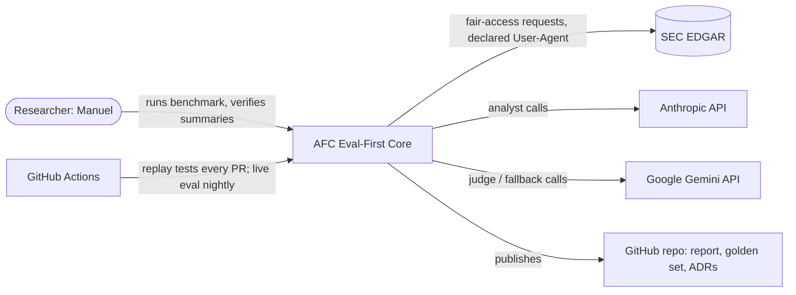

# 🧪 ATTENTION-FLOW CATALYST (AFC) — Stage 1 Project Scope v9.1 (APPROVED)

> **Companions:** `ATTENTION_FLOW_CATALYST_SCOPE_v9_2_FULL_PRODUCTION.md` — AFC's **Full-Production** scope (promoted from v9.0, section numbers preserved), **authoritative for methodology (§2–§8), dashboard/guardrail design (§10–§11) and S2–S3 architecture** (D-6, completed). `AFC_EVAL_FIRST_CORE_SCOPE_v1_3.md` — the eval-first slice this build sheet **absorbs and supersedes on approval** (D-6). `Shared_SignalCore_Boundary_Spec_v1_5.md` — the shared-primitives contract (not a Stage-1 dependency; §16). **This document is the Stage-1 build sheet: Phase 1 — the SEC-grounded faithfulness benchmark (the eval-first core), and Phase 2 — the event-study backtest v1 (T1/T4/T5).** Stages 2–3 are retained as forward context only.

## AI-Powered Predictive Trigger Analysis for Small-Cap Stocks — Stage 1 Build Sheet
## Faithfulness benchmark · event-study backtest · ML meta-labeling baseline
## "Finance is the substrate; faithfulness measurement is the method — and every trigger decision is tested against history."

**Document Version:** 9.1 (🎯 **STAGE-1 BUILD SHEET** — mirrors the Crucible split (`v3_1_STAGE1` + `v1_0_FULL_PRODUCTION`). Promotes the eval-first slice to AFC's Stage-1 build sheet, aligns it to the roadmap's governing AFC positioning, and folds in the October 2026 production review — dependency reality on Python 3.14, point-in-time provenance, statistical design, CI eval tiering, and a corrected repo layout.)
**Last Updated:** October 4, 2026 (rev. 6 — CORRECTION 48: ML learning resources)
**Status:** ✅ **APPROVED** — October 2, 2026. All decisions D-0 … D-9 locked (§20). Supersedes `AFC_EVAL_FIRST_CORE_SCOPE_v1_3.md` for Stage 1 (D-6). Companion Full-Production scope: `ATTENTION_FLOW_CATALYST_SCOPE_v9_2_FULL_PRODUCTION.md`.
**Author:** Manuel Reyes
**Review record:** `AFC_PROJECT_REVIEW_2026-10-02.md` — every change in this sheet traces to a numbered finding there.

---

## 🎯 v10.0 ROADMAP ALIGNMENT & STAGE-EVOLUTION ARC — AUTHORITATIVE

> **This block governs.** Where anything below conflicts, this block wins. Where this sheet conflicts with the Full-Production scope (v9.2) on **Stage 1 build detail**, this sheet wins.

**Aligned to:** Career Roadmap **v10.0 (2026 Market Realignment)**, through CORRECTION 51.

**Governing model:** **3 stages, not 5.** Destination title **Applied AI Engineer → Forward Deployed Engineer (FDE)**. **One system that evolves across stages — never rebuilt per stage.**

**Portfolio role:** 🧩 **Supporting** (production-grade; size ≠ tier). Read-only financial NLP/RAG with an eval spine; **faithfulness ≥ 0.9** showcase.

**🧭 Positioning (roadmap, as amended by CORRECTION 46 — binding):** *AFC is financial NLP/RAG with an eval spine, plus a **read-only historical event study** used to make data-driven trigger decisions. It reports hit-rate **lift over a base rate** under statistical controls (walk-forward, false-discovery control, point-in-time data). There is no factor construction and no alpha, Sharpe or return claim — and it should not be described as though there were.* Crucible and AFC remain **not quant projects**. *(The original sentence — "no returns, no factor construction, no backtest" — is preserved struck-through in the roadmap; the backtest was retained by Manuel's decision, D-0.)* 🆕 **(CORRECTION 47)** AFC is **AI-powered predictive**: an ML meta-labeling layer predicts the probability that each trigger event reaches +10%, held to the same controls and to a beat-the-best-rule test; reported as calibrated probability and lift, never as returns.

**Build order (roadmap Build Progression):** DataVault → PolicyPulse → Crucible lead; **AFC slots in after PolicyPulse establishes GraphRAG**, but its eval-first core is publishable **early** as the smallest high-signal artifact. Stage 1 is that artifact.

**Stage-evolution arc:**

| Stage | Theme | This project's layer |
|---|---|---|
| **S1** ⭐ *this sheet* | Foundation (GenAI-first core) | **Phase 1 — Eval-first core:** EDGAR retrieval with provenance → provider-agnostic LLM analyst → three-method faithfulness evaluation → controlled-perturbation benchmark → published report + frozen golden set. **Phase 2 — Event-study backtest v1:** T1 (insider `P` purchases) + T5 (dilution state) + T4 (volume) on knowledge-time data, base-rate lift, false-discovery control, rolling walk-forward, sealed final holdout; **ML meta-labeling baseline** predicting P(hit) per event (CORRECTION 47). |
| **S2** | DE/AE hardening | Financial-data lakehouse over **filings and market data** — EDGAR ingestion at scale, PIT (bitemporal) storage, **dbt models + contracts**, Airflow, monitoring + postmortem; **T2 / T3 / T6 added on knowledge-time data → full combination matrix**; S1's local primitives extracted into `signalcore`. *(Authority: Full-Production v9.2 §7.4.)* |
| **S3** | Applied AI (RAG/agentic + eval) | **GraphRAG financial-KG hybrid** (Neo4j + vector index) + **read-only** agentic research loop; the S1 eval harness becomes the **verifier**; three-layer eval + Phoenix tracing + MCP. |

- **Every project's S2 adds:** ingestion → dbt-tested models (CI-gated) → data contracts → warehouse/lakehouse → Airflow (idempotent) → Docker/ECS → monitoring + written postmortem → semantic/metrics layer.
- **Every project's S3 adds:** RAG/GraphRAG/agentic layer + three-layer eval (per-query · trajectory · drift vs frozen golden set) + Arize Phoenix + MCP + HITL on irreversible actions. *(AFC has no irreversible actions — it is read-only by construction.)*

**Production standard (non-negotiable, ALL projects) — Stage-1 checklist:**

| Area | Requirement | Where in this sheet |
|---|---|---|
| Headline | Business-outcome headline (here: *a benchmark finding*, never a return) | §1, README §Production |
| Diagrams | Mermaid + **C4 Context** from **one Structurizr DSL source** (`docs/architecture.dsl` → `structurizr-cli` export) — CORRECTIONS 8, 14 | §3, §12 |
| Decisions | `docs/adr/` — numbered, immutable ADRs (context → decision → consequences) | §12, §20 |
| Packaging | `pyproject.toml` + committed `uv.lock` + `src/` layout + `py.typed`; `uv sync --frozen` in CI/Docker — CORRECTION 13 | §11, §12 |
| Python | `requires-python = ">=3.14"` single source; ruff `py314`, mypy `3.14`, Docker base, CI matrix must match (mismatch = CI failure); **GIL build only**, never `3.14t` — CORRECTIONS 27–28 | §11 |
| Quality | ruff (lint + format), mypy (**CI-only**, recorded as ADR), pytest ≥ 80% coverage | §12.2 |
| Hooks | Pinned `.pre-commit-config.yaml` — strict **subset** of CI; Tier A + Tier B `nbstripout` + Tier C `conventional-pre-commit` — CORRECTION 21 | §12.4 |
| Logging | `structlog` over stdlib via `ProcessorFormatter` + PII-redaction processor; library code never configures logging — CORRECTION 16 | §12.1 |
| Config | `pydantic-settings`, credentials as `SecretStr`; no ambient env reads outside `config.py` | §12 |
| Retries | `stamina` — capped, jittered; never retry a non-429 4xx; never retry a write without an idempotency key | §5, §10 |
| Commits | Conventional Commits, enforced; **every commit human** (`hooks/guard.py` blocks agent commit/push) — CORRECTION 42 | §12 |
| Harness | Dual harness `.opencode/` + `.claude/` from one prompt layer, one `AGENTS.md` contract | §12 |
| Container | Dockerfile (pinned uv, non-root, lockfile-strict) | §12.3 |
| Evidence | Eval-metrics table · 15–30 s demo GIF · "What I Learned" · README order ① Production ② Cost ③ Architecture — CORRECTION 18 | §README |
| Data | **Synthetic data only in public repos** for personal/employer data. **SEC EDGAR filings are public records** and are permitted — recorded as an ADR so the rule is applied deliberately, not by accident (§5.5). | §5.5 |
| Language | Python-primary; **no TypeScript layer** scoped — CORRECTIONS 22–23 | §11 |

---

## Changelog

| Version | Change |
|---|---|
| v9.0 (parent) | Complete AFC scope; v10.0 realignment (Supporting, 3-stage arc). Carries Phase 1A backtest + Phase 1B dashboard. |
| Slice v1.0–v1.3 | Eval-first core: three-method eval, §4.3 perturbation catalog, §14 future extensions (news, FINRA). |
| **v9.1 STAGE-1 (rev. 1, PROPOSED)** | (1) **Promotes the slice to the Stage-1 build sheet** in the Crucible format; parent keeps S2–S3 authority until a Full-Production companion exists. (2) **Aligns S1 to the roadmap's binding AFC positioning** — no returns, no backtest; v9.0 Phase 1A/1B and §5.6 flagged for decision **D-0**. (3) **Dependency reality on Python 3.14** (verified on PyPI 2026-10-02): the `factscore` package and `pandasai` cannot install on the portfolio's 3.14 floor → FActScore implemented as a **documented protocol re-implementation**; PandasAI out of scope. (4) **Statistical design** upgraded from "≥30 cases" to a powered, paired, split, pre-registered benchmark (§6.4–6.6). (5) **Judge independence + response caching** for reproducible LLM-judge evals (§6.7). (6) **PIT provenance**: every fact carries accession number + EDGAR acceptance datetime (§5.3). (7) **CI eval tiering**: deterministic replay on every PR; live evals nightly/on-label, budget-capped (§12.2). (8) **Corrected repo tree** (harness nesting, `src/afc/` package, single logging module) and **hardened Dockerfile** (§12). |
| **v9.1 rev. 2 (October 2, 2026 — roadmap CORRECTION 46)** | **Backtest retained by decision (D-0 locked).** Adds **§7B Phase 2 — Event-Study Backtest v1** (T1/T4/T5), with knowledge-time data, survivorship-aware universe, rolling walk-forward + embargo + sealed final holdout, base-rate lift and Benjamini–Hochberg FDR, and the §5.6 follow-through analysis. D-3 locked (FActScore protocol re-implementation). PandasAI replaced by validated text-to-SQL for the dashboard that follows the backtest. Positioning, phase table, principles, stack, structure, risks, metrics, timeline and §16 updated. |
| **v9.1 rev. 3 (October 2, 2026 — C46 addendum)** | **Approved.** D-1, D-2, D-4, D-5, D-6, D-7, D-8, D-9 locked; status → APPROVED; the eval-first slice v1.3 is marked superseded (kept for history). |
| **v9.1 rev. 4 (October 2, 2026 — Full-Production promotion)** | Parent v9.0 promoted to `ATTENTION_FLOW_CATALYST_SCOPE_v9_2_FULL_PRODUCTION.md`; pointers repointed; build-level content moved here as **Appendix A** (A.1 pre-commit config, A.2 logging & debugging, A.3 dashboard container); tree gains `app/`, `config/`, `CONTRIBUTING.md`, `.cursorignore`. |
| **v9.1 rev. 5 (October 3, 2026 — CORRECTION 47)** | **AI-powered predictive.** Title restored; new **§7B.9 ML meta-labeling baseline** (B16–B19); one pre-registration covers rules + ML before the single holdout; stack, structure, risks, metrics, skills and locked decision #17 updated; Stage-1 timeline 14 → 16 weeks. |
| **v9.1 rev. 6 (October 4, 2026 — CORRECTION 48)** | Closes the C47 open item: §17 adds the full **Machine Learning Specialization (Andrew Ng)** (Courses 1–2 required before week 13, Course 3 optional), the owned **Jansen** book (ch. 6, 7, 12) and the scikit-learn calibration guide; week 7 starts Course 1. |
| **v9.1 rev. 7 (October 5, 2026 — CORRECTION 51)** | §17 row 14: Jansen's **3rd edition** (2026) promoted to a committed buy at Phase 2 entry; the owned 2nd edition becomes the backup. |

---

## 0. How to Read This Document

This scope describes **one supporting project with two Stage-1 build phases** and forward context for the next two stages.

| Build Phase | Stage | What it produces | Touches prices or returns? |
|---|---|---|---|
| **Phase 1 — Eval-First Core** ⭐ | **S1** | EDGAR retrieval with provenance; LLM analyst producing structured claims; three detectors; labeled perturbation benchmark; published report; frozen golden set | No |
| **Phase 2 — Event-Study Backtest v1** ⭐ | **S1** | T1/T4/T5 trigger combinations tested on history **+ ML meta-labeling baseline (§7B.9)**: base-rate lift with CIs, FDR-controlled, walk-forward-stable verdicts; §5.6 follow-through table | **Prices yes — returns never claimed.** Output is *lift over a base rate*, not P&L |
| Lakehouse + full trigger matrix | S2 | dbt-modelled, contract-tested, PIT data; T2/T3/T6 added; `signalcore` extraction (forward context, §8) | Same rule |
| GraphRAG Research Loop | S3 | Read-only KG-hybrid research agent; S1 harness as verifier (forward context, §9) | No |

> ⚠️ **Terminology guard.** "Phase 1/2" are build phases *inside S1*. Older AFC docs used "Phase 1A" (backtest) and "Phase 1B" (dashboard): Phase 1A ≈ this sheet's Phase 2; the dashboard (former v9.0 Phase 1B; "Phase 2b") follows Phase 2 when hours allow and is specified in Full-Production v9.2 §10–§11 (with validated text-to-SQL replacing PandasAI).

> 🧭 **Coaching note (read once).** AFC now makes two defensible claims: it measures **whether an LLM tells the truth about a financial document** (Phase 1), and it tests **which trigger combinations actually beat the base rate on history** (Phase 2). Both survive an interview for the same reason — every number comes from a controlled design you can explain. The backtest's credibility does not come from a high hit rate; it comes from the controls: knowledge-time data, a base rate, false-discovery control, rolling walk-forward and a sealed final holdout. Lead with those, never with a return figure. Ship Phase 1 first — it is publishable on its own and protects the schedule if Phase 2 runs long.

---

## 1. Executive Summary

**AFC Stage 1** is a **reproducible benchmark** that answers one question:

> *On SEC-filing-grounded financial claims, how well do three hallucination-detection methods — LLM-judge faithfulness (DeepEval), atomic-fact verification (FActScore protocol), and self-consistency (SelfCheckGPT protocol) — catch errors whose ground truth is known by construction, and where does each one structurally fail?*

**Phase 2** answers a second one: *which combinations of insider purchases (T1), volume accumulation (T4) and dilution state (T5) raise the probability of a ≥ +10% move above the base rate — on knowledge-time data, after false-discovery control, and stably across walk-forward windows?*

The finance domain supplies what most hallucination benchmarks lack: an **authoritative, externally verifiable source**. For an SEC filing, *faithful-to-source* and *factually true* are the same thing — the filing **is** the authority.

### What Makes This Different

| Dimension | Typical "LLM eval" repo | AFC Stage 1 |
|---|---|---|
| Ground truth | Human vibes or LLM-judge only | **Errors injected by construction** (E1–E10) — the label is certain |
| Source authority | Wikipedia / web text | **SEC EDGAR** — authoritative; structured XML for Form 4 |
| What is measured | "My model scored 0.9" | **The detectors themselves** — recall per error type, false-positive rate, blind spots |
| Statistics | Point estimates | **Wilson 95% CIs, paired McNemar tests, AUROC, Cohen's κ**, calibration/test split |
| Thresholds | Tuned on the reported data | **Frozen on a calibration split**, reported on a sealed test split opened once |
| Judge bias | Same model judges itself | **Judge provider ≠ analyst provider**, cross-judge agreement reported |
| Reproducibility | Re-run gives new numbers | **Content-addressed LLM response cache** + run manifest → byte-identical re-runs |
| Negative results | Hidden | **Published** — E10 omission blind spot is a headline finding |

### Core Capabilities
- **EDGAR retrieval with provenance** — accession number, URL, SHA-256, EDGAR acceptance datetime, fetch time; SEC fair-access compliant.
- **Structured parsing** — Form 4 from its XML (authoritative structured truth); offering documents (S-1 / 424B5 / 8-K) from bounded sections.
- **Provider-agnostic LLM analyst** — Anthropic Claude primary (roadmap), Gemini fallback; Pydantic-validated `FilingClaimSet`.
- **Three detectors, measured not trusted** — with explicit method asymmetry (reference-based vs consistency-based).
- **Controlled-perturbation benchmark** — 10 error types × 3 difficulty tiers, paired design, powered sample.
- **Published findings** — report, metrics table, failure taxonomy, frozen golden set reused by S2/S3 drift checks.
- **Event-study backtest v1 (Phase 2)** — T1/T4/T5 and their combinations tested on knowledge-time data; verdicts are base-rate lift with CIs after Benjamini–Hochberg FDR, stable across rolling walk-forward windows, confirmed once on a sealed holdout.
- **AI predictive layer (Phase 2)** 🆕 *(CORRECTION 47)* — an ML meta-labeling model predicts a calibrated probability for each trigger event and must beat the best rule-based combination on the sealed holdout (§7B.9).

> 🔁 **Agentic Loop Spec (roadmap v8.8 — restated for S1):**
> - **Loop type:** *read-only pipelines* — Phase 1: retrieve → parse → analyze → perturb → detect → score → report. Phase 2: build PIT universe → detect triggers on knowledge-time data → label → base rate → walk-forward → FDR → verdicts. **No trading, no orders, no return claims.**
> - **Verifier:** the labeled perturbation set itself (labels by construction) + human spot-check on the organic run.
> - **Autonomy:** safe to run unattended — read-only, no tools that write outside the run directory, budget-capped. Layered exits: budget cap → max-call cap → validation-failure cap.
> - **S3 evolution:** the detectors become the **verifier** of the GraphRAG research agent. *(The v9.0 phrase "Agentic Trading Assistant" is retired — review finding A-07.)*

---

## 2. Design Principles (Non-Negotiable)

1. **The filing is the authority (Phase 1).** The faithfulness benchmark grounds only on SEC EDGAR. News, social and screener prose are future work (§19) because they break the faithful-equals-true property.
2. **Detectors are measured, not trusted.** The benchmark's subject is the detection methods. The analyst is real and production-grade, but its faithfulness score is a secondary output.
3. **Pre-register, then look once.** Detector hypotheses (§6.6), the threshold-selection rule, the metrics and the split are written down **before** the test split is scored. The test split is opened **once**, on the record — the same discipline as Crucible's sealed OOS vault.
4. **Independent judges, cached responses.** No model judges its own provider's output without a cross-judge check. Every LLM call is cached by content hash so a re-run reproduces the published numbers exactly.
5. **Every fact carries provenance.** Accession number + acceptance datetime + document hash on every claim's source span. A claim without provenance is a defect.
6. **Filing text is untrusted input.** It is data, never instructions — delimited in prompts, never able to trigger tools (there are none in S1).
7. **Negative results are results.** A detector that misses an error class is a finding, not a failure of the project.
8. **No vibe coding.** Every line is written, understood and reviewed before merge — including AI-suggested code (the `learn` agent enforces explain-before-merge).
9. **Knowledge time, not record date (Phase 2).** An event can drive an entry at the open of session *S* only if its `available_at` is before 09:30 ET on *S*.
10. **No hit rate without its base rate (Phase 2).** Every combination is reported as lift over the unconditional rate for the same universe, dates and label.
11. **Every combination tested counts (Phase 2).** False-discovery control runs over **all** combinations in a run, not just the survivors; the final holdout is scored once.

---

## 3. Architecture — The Eval-First Loop (Phase 1)

```
┌─────────────────────────────────────────────────────────────────────┐
│ ① SAMPLING FRAME  (EDGAR full-index, fixed window, stratified, seed) │
└───────────────┬─────────────────────────────────────────────────────┘
                ▼
┌─────────────────────────────────────────────────────────────────────┐
│ ② EDGAR ADAPTER  edgartools behind afc.edgar (D-2)                   │
│    declared User-Agent · ≤10 req/s · stamina retries · disk cache   │
│    provenance: accession · URL · sha256 · acceptance_dt · fetched_at│
└───────────────┬─────────────────────────────────────────────────────┘
                ▼
┌─────────────────────────────────────────────────────────────────────┐
│ ③ PARSERS   Form 4 → XML fields (authoritative)                      │
│             S-1/424B5/8-K → bounded sections (cover, offering,      │
│             use of proceeds, risk-factor qualifiers)                │
└───────────────┬─────────────────────────────────────────────────────┘
                ▼
┌─────────────────────────────────────────────────────────────────────┐
│ ④ LLM ANALYST  provider-agnostic · Claude primary · Pydantic out     │
│    FilingClaimSet = atomic claims (+source spans) + narrative        │
└───────┬───────────────────────────────────────┬─────────────────────┘
        │ organic outputs                        │ human-verified faithful
        │                                        ▼ base summaries
        │                       ┌──────────────────────────────────────┐
        │                       │ ⑤ PERTURBATION ENGINE  E1–E10        │
        │                       │    paired negatives, labels by       │
        │                       │    construction, group split by filing│
        │                       └───────────────┬──────────────────────┘
        ▼                                       ▼
┌─────────────────────────────────────────────────────────────────────┐
│ ⑥ DETECTORS (judge provider ≠ analyst provider; cached)              │
│    DeepEval faithfulness/hallucination · FActScore protocol (AFG+AFV)│
│    · SelfCheck-Prompt (organic run only)                             │
└───────────────┬─────────────────────────────────────────────────────┘
                ▼
┌─────────────────────────────────────────────────────────────────────┐
│ ⑦ CALIBRATION SPLIT → thresholds frozen (pre-registered rule)        │
│ ⑧ TEST SPLIT (opened ONCE) → recall/FPR + Wilson CI, AUROC, McNemar, │
│    κ agreement, failure taxonomy                                     │
└───────────────┬─────────────────────────────────────────────────────┘
                ▼
┌─────────────────────────────────────────────────────────────────────┐
│ ⑨ REPORT + RUN MANIFEST + FROZEN GOLDEN SET (reused in S2/S3)        │
└─────────────────────────────────────────────────────────────────────┘
```

**C4 Context (modeled in `docs/architecture.dsl`, exported to Mermaid):**



---

## 4. The Analyst Task & Claim Schema

### 4.1 Filing families in scope

| Family | Forms | Source of truth used by detectors | Why |
|---|---|---|---|
| **Insider activity** (v9 "T1" fields) | **Form 4** | The filing's **XML** (`nonDerivativeTable`, `derivativeTable`, `reportingOwner`, footnotes, Rule 10b5-1 indication) | Structured, authoritative, every field verifiable |
| **Capital-structure events** (v9 "T5" fields) | **S-1, 424B5, 8-K** | Bounded text sections + EDGAR metadata | The richest surface for subtle errors (scale, derived values, omitted qualifiers) |

> In Phase 1 these are **filing families** for the faithfulness benchmark. In Phase 2 the same parsed filings feed triggers **T1** and **T5** of the event-study backtest (§7B) — one parser, two consumers.

### 4.2 Definitions that must be fixed before any data is labeled

| Term | Fixed definition | Why it matters |
|---|---|---|
| **Insider purchase** | Form 4 transaction code **`P`** (open-market or private purchase) only. Code `A` (grant/award), `M` (option exercise) and `F` (tax withholding) are **not** purchases. | v9.0 T1 counts `A` as an insider buy — a compensation grant is not a conviction signal (finding A-11). The analyst must report codes faithfully; E6/E7 test it. |
| **Ownership dilution %** | `new_shares / (pre_offering_shares + new_shares)` — **post-offering basis** | Disambiguates E3. Distinct from the prospectus "Dilution" section (net tangible book value per share), which is reported separately if summarized. |
| **Filing date vs acceptance datetime** | Both stored. **Acceptance datetime** is the knowledge time (§5.3). | Section 16 filings accepted 5:30–10:00 p.m. ET keep that day's filing date — after the market close. |
| **Offering type** | Firm-commitment vs **best-efforts**, as stated in the filing | E10 omission target |

### 4.3 Output schema

```python
# src/afc/analyst/schema.py
from datetime import datetime
from decimal import Decimal
from typing import Literal
from pydantic import BaseModel, Field

FormType = Literal["S-1", "424B5", "8-K", "4"]

class SourceSpan(BaseModel):
    accession_no: str                 # EDGAR provenance, e.g. "0001234567-26-000123"
    document_sha256: str              # hash of the exact bytes the analyst saw
    locator: str                      # XML XPath (Form 4) or section + char offsets (prose)

class AtomicClaim(BaseModel):
    subject: str                      # e.g. "Jane Doe (CFO)"
    predicate: str                    # e.g. "purchased_shares"
    value: str | Decimal | datetime   # typed where possible; Decimal for money/shares
    unit: str | None = None           # "shares", "USD", "USD/share", "%"
    source: SourceSpan

class FilingClaimSet(BaseModel):
    form_type: FormType
    accession_no: str
    acceptance_datetime: datetime     # tz-aware, America/New_York
    claims: list[AtomicClaim] = Field(min_length=1)
    narrative: str                    # human-readable summary — the faithfulness target
    model_id: str                     # exact provider model string, recorded per call
    prompt_sha256: str                # prompt file hash — prompts are versioned files
```

The **narrative** is what DeepEval scores and what the perturbation engine edits; the **atomic claims** are the analyst's own structured output (useful for the organic run and the S3 KG). FActScore's atomic-fact generation runs on the narrative independently, so the detector is never handed the answer.

---

## 5. Data Layer — EDGAR Retrieval, Provenance, Point-in-Time

### 5.1 Retrieval adapter (D-2)
- **Decided (D-2):** `edgartools` (5.60.0 on PyPI, supports Python 3.14) wrapped behind `afc.edgar.EdgarClient`, so the library is swappable and the rest of the code never imports it directly. It already handles identity declaration, rate limiting and Form 4 XML parsing.
- **Rejected for S1:** a custom async `httpx` client. The SEC's fair-access policy caps clients at **10 requests per second** with a **declared User-Agent**, so async concurrency buys nothing measurable; it adds complexity the benchmark does not need. *(v9.0's "async httpx, 10–50× faster" claim does not hold against that cap — finding A-15.)*
- **Falsifier:** revisit if `edgartools` cannot return the acceptance datetime or raw document bytes needed for provenance, or breaks on 3.14.

### 5.2 Fair access & resilience
- `User-Agent` = owner name + contact email from `Settings` (`SecretStr`-free but required). Self-limit to **≤ 8 req/s** (headroom under the cap).
- `stamina` retries on 429/5xx/timeouts only; capped attempts, jittered backoff. Never retry other 4xx.
- **Disk cache** keyed by accession number; raw bytes stored with SHA-256; a cache hit never touches the network. The cache is gitignored and **re-buildable from the manifest**.

### 5.3 Point-in-time provenance rule
Every record carries **two times**: the filing's official `filing_date` and EDGAR's **`acceptance_datetime`**. The acceptance datetime is the **knowledge time**. Stage 1 does not make time-dependent decisions, but it **records** this from day one because S2's bitemporal store and S3's KG depend on it. *(Form 4 and other Section 16 filings accepted between 5:30 and 10:00 p.m. ET keep that same day's filing date — i.e. after the close — so `filing_date` alone silently misstates when the market could know.)*

### 5.4 Sampling frame (no cherry-picking)
- Source: EDGAR **full-index** for a fixed, recorded window (e.g. two calendar quarters).
- Population: Form 4, S-1, 424B5, 8-K from issuers listed on NYSE / Nasdaq / NYSE American; small-cap tilt is allowed but must be a **written rule**, not a hand-pick.
- Draw: stratified by form family; random seed recorded in the run manifest; **exclusions logged with a reason** (e.g. unparseable exhibit, amendment-only).
- Target: **≥ 60 base filings** (30 Form 4 + 30 offering-family) — see §6.4 (D-5).

### 5.5 Public-record data ADR
SEC filings — including insider names on Form 4 — are **public records** disseminated by the SEC. The portfolio's *synthetic-data-only* rule exists to protect personal and employer data; it does not forbid public filings. ADR-0004 records this explicitly, keeps the PII-redaction processor active on logs, and states one boundary: **no data from Manuel's employer or any non-public source ever enters this repo.**

---

## 6. Evaluation Design (The Core)

### 6.1 Three methods, one corpus

| Method | Needs | Measures | Applied to |
|---|---|---|---|
| **DeepEval** faithfulness + hallucination (LLM judge) | Retrieved filing context | Narrative claims unsupported by / contradicting the context | Static perturbation set **and** organic run |
| **FActScore protocol** (Min et al., 2023): Atomic Fact Generation → Atomic Fact Validation | Filing text + structured fields as the knowledge source | % of atomic facts supported | Static perturbation set **and** organic run |
| **SelfCheckGPT protocol** (Manakul et al., 2023), **prompt variant** | N = 5 fresh samples, **no external KB** | Per-sentence inconsistency across samples | **Organic run only** (consistency is a property of the generation process) |

**Method asymmetry is a reportable finding:** reference-based scorers apply to fixed text; SelfCheckGPT can only score the process that produced it. It is evaluated by correlating its inconsistency scores with reference-based verdicts and human spot-checks.

### 6.2 Implementation reality on the 3.14 floor (verified on PyPI, 2026-10-02)

| Component | Package status | Decision |
|---|---|---|
| DeepEval | `deepeval` 4.2.8, supports 3.14 | **Use the library.** Configure the judge model explicitly (§6.7); disable telemetry via its documented environment setting. |
| FActScore | `factscore` 0.2.0 (Oct 2023) pins `torch<2.0` and `openai<0.28` — **cannot install on 3.14** | **Re-implement the protocol** in `afc.eval.detectors.factscore_protocol` (D-3), citing the paper. The OpenFActScore re-implementation work showed absolute scores shift with the model used while model rankings are preserved — so AFC reports **its own** numbers and never compares them to published FActScore values. |
| SelfCheckGPT | `selfcheckgpt` 0.1.7 (Mar 2024), sdist only, unpinned torch/transformers/spaCy | **Week-1 install spike.** If it installs cleanly on 3.14 and the image stays reasonable, use `SelfCheckLLMPrompt`; otherwise **re-implement the prompt variant** (≈ one module) (D-4). |
| PandasAI | `pandasai` 3.0.0 requires Python `<3.12` and `numpy<2`; CVE-2024-12366 (prompt-injection RCE) | **Removed (CORRECTION 46).** The dashboard that follows Phase 2 uses validated text-to-SQL (`sqlglot` whitelist, read-only DuckDB). |

> **Score direction is fixed in code, not prose.** SelfCheckGPT outputs an *inconsistency* score (higher = more likely hallucinated); DeepEval's hallucination metric is *lower-is-better*; faithfulness and FActScore are *higher-is-better*. Every detector is wrapped to emit `p_unfaithful ∈ [0, 1]` so thresholds and AUROC are comparable. *(v9.0's "SelfCheckGPT score > 0.85" target has the direction ambiguous — finding A-13.)*

### 6.3 Perturbation Error Catalog (carried from slice v1.3 §4.3, unchanged in substance)

**Tiers:** **Tier 1 — Overt** (sensitivity floor) · **Tier 2 — Subtle** (the discriminating test) · **Tier 3 — Structural** (omission; designed to defeat reference-based scoring).

| ID | Tier | Perturbation | Family | Primarily stresses |
|---|---|---|---|---|
| **E1** | 1 | **Numeric value swap** — share count or dollar figure | both | FActScore (numeric atom), DeepEval (contradiction) |
| **E2** | 2 | **Scale/unit error** — millions↔thousands; per-share↔aggregate | offering | FActScore; DeepEval often misses (no arithmetic) |
| **E3** | 2 | **Derived-value miscalc** — correct inputs, wrong dilution % (§4.2 convention) | offering | Detectors that verify computed values; known weak spot |
| **E4** | 1 | **Date shift** — filing / offering / transaction date | both | FActScore vs EDGAR metadata |
| **E5** | 2 | **Sequence error** — wrong ordering of events | offering | Temporal reasoning; both weak |
| **E6** | 2 | **Direction flip** — purchase ↔ sale (code `P` ↔ `S`) | Form 4 | FActScore (predicate atom), DeepEval |
| **E7** | 2 | **Misattribution** — wrong insider/role, issuer, or security class (common vs preferred, shares vs warrants) | both | FActScore (entity atom) |
| **E8** | 2 | **Fabricated clause** — invented use-of-proceeds / lock-up / over-allotment | offering | DeepEval (unsupported), FActScore (unverifiable) |
| **E9** | 2 | **Fabricated qualifier** — unwarranted certainty or characterization | both | DeepEval; subtle editorializing |
| **E10** | 3 | **Material omission** — drop best-efforts, going-concern, conditionality or a **Rule 10b5-1 plan** indication while stating only true things | both | **Designed to defeat reference-based scoring** |

**Worked examples** — E1: "10,000,000 shares" → "15,000,000 shares". E2: "$25 million" → "$2.5 million". E3: 10M new shares on a 40M pre-offering base is **20%** on the post-offering basis; the summary states "~33%". E6: "the CFO purchased 50,000 shares" → "sold". E8: "general corporate purposes" → "primarily to repay outstanding debt". E10: a best-efforts offering with a going-concern note summarized accurately on shares, price and date but **omitting both qualifiers**.

**Perturbation engine contract:** each `E*` is a pure function `apply(summary, fields, rng) -> PerturbedCase | NotApplicable`; it must change **exactly one** fact (or omit exactly one qualifier for E10), record the field it touched, and be covered by a unit test asserting the intended label. Edits are **template-based and deterministic**; an LLM may *propose* fluent rewrites for Tier 2 only if the change is then verified by code against the field it claims to alter.

### 6.4 Dataset design (D-5)

| Item | Slice v1.3 | **This sheet** | Why |
|---|---|---|---|
| Base faithful summaries (human-verified) | part of "≥ 30 cases" | **≥ 60** (target 30 Form 4 + 30 offering) | ~2 negatives per error type cannot estimate per-type recall |
| Negatives | ~18 | **Every applicable E-type on every base** → ≈ 250–300 | Paired design: the same base summary appears faithful and perturbed |
| Faithful-set FPR estimation | ~12 positives | **60 positives + organic faithful outputs** | FPR is the metric a deployer cares about most |

**Human verification protocol:** written checklist per family; every base summary checked field-by-field against the source; a **second pass ≥ 7 days later** on a 20% sample to measure intra-rater consistency (single-annotator limitation stated honestly in the report).

**Power, stated plainly:** at ~25 negatives per error type, a recall near 50% carries a Wilson 95% interval roughly ±19 points. Tier-2 types are therefore the priority for any extra sampling.

### 6.5 Splits & thresholds (the sealed test split)
- **Group split by base filing** (never by case): **30% calibration / 70% test**, seeded. No base filing — or any of its perturbations — appears on both sides.
- **Threshold rule (pre-registered):** each detector's threshold on `p_unfaithful` is chosen on the calibration split to hold **FPR ≤ 10%** on faithful cases, then **frozen**.
- The test split is scored **once**, after the pre-registration file (`reports/preregistration.md`) is committed. A re-score requires a new pre-registration and is reported as a second look.

### 6.6 Metrics & pre-registered hypotheses
**Per detector, on the test split:** recall per error type and per tier (Wilson 95% CI) · FPR on faithful cases (Wilson CI) · precision at the frozen threshold *(reported with prevalence, since it depends on class balance)* · **AUROC** (threshold-free) · per-family breakdown.
**Between detectors:** **McNemar's test** on paired detections · **Cohen's κ** agreement matrix · union/intersection coverage (what does an ensemble catch that no single detector does?).
**Organic run:** analyst faithfulness by provider on identical filings; SelfCheck-Prompt inconsistency vs reference verdicts (Spearman ρ); **human spot-check of ≥ 50 sentences**.

**Pre-registered hypotheses** (from slice §4.3; confirmed or refuted in the report, never edited after scoring):
- H1 DeepEval: strong on E1, E6, E8, E9; weak on E2, E3, E10.
- H2 FActScore protocol: strong on E1, E4, E6, E7; partial on E2/E3; weak on E10.
- H3 SelfCheck-Prompt: informative on organic fabrications (E8/E9-like); inapplicable to static perturbations.
- H4 **No reference-based detector exceeds chance-level recall on E10** — the headline structural finding if it holds.

### 6.7 Judge policy & reproducibility
- **Judge provider ≠ analyst provider** (D-8). Primary: analyst = Claude, DeepEval/FActScore judge = Gemini. A 20% subset is re-judged with the other provider; **cross-judge κ** is reported. This controls self-preference bias.
- Temperature 0 where the provider supports it; exact model strings recorded per call; provider/model **date stamped** in the manifest.
- **Content-addressed response cache:** key = SHA-256 of (provider, model, params, prompt). Re-runs hit the cache; the published report is reproducible at **$0** marginal cost. Cache files for the published run are archived as a release asset.

---

## 7. Stage 1 — Phase 1 Deliverables ⭐ THIS SCOPE

**Goal:** a published, reproducible benchmark with labeled ground truth, honest statistics and a frozen golden set — built to the production standard.

| # | Deliverable | Acceptance criteria |
|---|---|---|
| 1 | Repo bootstrap | `src/afc/` + `py.typed`; `pyproject.toml` + `uv.lock`; Python pin consistent across 4 places; pre-commit installed (both hook types); CI green |
| 2 | Dependency spike | DeepEval, edgartools, selfcheckgpt (or not) installed on 3.14 inside the Docker image; result recorded in ADR-0005 |
| 3 | Config + logging | `pydantic-settings` `Settings`; `configure_logging()` + PII redaction; `test_logging_no_secrets` passes |
| 4 | EDGAR adapter | Fair-access compliant; cache + provenance manifest; acceptance datetime captured; tests use recorded fixtures (no network in CI) |
| 5 | Sampling frame | Reproducible draw from full-index with seed + exclusion log |
| 6 | Parsers | Form 4 XML → typed fields (codes, amounts, roles, 10b5-1 flag); offering sections bounded and hashed |
| 7 | LLM analyst | Provider-agnostic; Pydantic `FilingClaimSet`; versioned prompts; per-call usage log (tokens, cost, latency, model) |
| 8 | Guardrails | Untrusted-input delimiting; output validation; budget cap; tests ≥ 90% coverage on guardrail module |
| 9 | Base set | ≥ 60 human-verified faithful summaries; verification checklist + second-pass consistency recorded |
| 10 | Perturbation engine | E1–E10 pure functions; each with a label test; `NotApplicable` handled |
| 11 | Dataset builder | Paired cases; `EvalCase` schema; group split; dataset hash in manifest |
| 12 | Detectors | DeepEval wrapper; FActScore protocol (AFG + AFV); SelfCheck-Prompt; all emit `p_unfaithful` |
| 13 | Cache + manifest | Content-addressed LLM cache; `runs/<run_id>/manifest.json` (git SHA, lock hash, config/dataset/prompt hashes, model IDs, seeds, cost) |
| 14 | Pre-registration | `reports/preregistration.md` committed **before** the test split is scored |
| 15 | Benchmark run | Calibration → frozen thresholds → single test-split scoring; organic run + human spot-check |
| 16 | Report | `reports/benchmark/<run_id>/` — metrics tables with CIs, McNemar/κ, failure taxonomy, H1–H4 verdicts, limitations |
| 17 | Frozen golden set | Versioned subset (cases + expected verdicts) for S2/S3 drift checks |
| 18 | Docs | README (① Production ② Cost ③ Architecture), C4 + Mermaid from DSL, ADR set, "What I Learned", 15–30 s demo GIF |
| 19 | Release | Tag `v1.0.0`; cache + report attached as release assets; CHANGELOG |

### What "done" means
- Every number in the README traces to a run manifest and can be regenerated from cache.
- The pre-registration commit predates the test-split scoring commit (visible in git history).
- **A legitimate outcome:** "one or more detectors fails a class of errors." That is the benchmark working.

---

## 7B. Stage 1 — Phase 2: Event-Study Backtest v1 ⭐ THIS SCOPE 🆕 *(roadmap v10.0 CORRECTION 46)*

**Goal:** test which trigger combinations raise the probability of a ≥ +10% move above the **base rate**, on **knowledge-time** data, with results that survive **false-discovery control**, **rolling walk-forward** and a **sealed final holdout** — the data-driven basis for every trigger decision. Methodology authority: Full-Production v9.2 §4–§6 (as amended by CORRECTION 46); this section is the build sheet.

> **Positioning guard.** The output is *lift over a base rate with a confidence interval*, never P&L, Sharpe or "returns". The README and résumé describe the controls, not a performance number.

### 7B.1 Scope — what v1 tests

| Trigger | Definition (Full-Production §4, as amended) | Source & knowledge time | In v1? |
|---|---|---|---|
| **T1** Insider purchase | Form 4 code **`P` only**, ≥ $10,000, officer/director/10% owner | EDGAR **acceptance datetime** | ✅ |
| **T4** Volume accumulation (a–e) | RVOL, accumulation score, OBV breakout, quiet accumulation, volume dry-up | Daily OHLCV, available at the **session close** | ✅ |
| **T5** Dilution state | CLEAR / OVERHANG / ACTIVE_DEAL / CLOSED from S-1, S-3, 424B5, 8-K, EFFECT | EDGAR **acceptance datetime** | ✅ |
| T2 Wikipedia · T3 News · T6 Squeeze context | — | Need per-source knowledge time from the S2 lakehouse | **S2** |

**Scenario family for v1:** the 7 non-empty combinations of {T1, T4, T5_CLOSED} × 4 contexts (none · sector strength · index trend · dilution state) = **28 scenarios**, times any threshold configurations tried in-sample. **Every** scenario × configuration evaluated in a run belongs to the false-discovery family. The full matrix (~155 scenarios, Full-Production §4.8) runs in S2 once T2/T3/T6 exist.

### 7B.2 Data layer additions

| Data | Source (free-first) | Knowledge time | Notes |
|---|---|---|---|
| Daily OHLCV, as-traded **and** adjusted | Free daily source (Full-Production §8.2 Mode B: yfinance) | Session close | **Spike B1**: 3.14 install (yfinance classifiers stop at 3.13), delisted coverage |
| Filings (Forms 4, S-1, S-3, 424B5, 8-K, EFFECT) | Phase 1 EDGAR adapter — **reused, not rebuilt** | Acceptance datetime | One system across phases |
| Shares outstanding | XBRL company facts (`dei:EntityCommonStockSharesOutstanding`) | Filing acceptance | Market-cap screen; float proxy (bottom-30% "small float") — limitation stated |
| Sector strength | 11 SPDR sector ETFs; issuer → sector via EDGAR SIC code mapping (documented approximation) | Session close | Mapping table versioned |
| Delistings | EDGAR **Form 25 / Form 15** filings | Acceptance datetime | Seeds the survivorship list |
| Calendar | `exchange-calendars` (XNYS) | — | Half-days, holidays |

### 7B.3 Universe reconstruction (survivorship)
- **Weekly as-of universe rebuilt historically**, not snapshotted forward: listed on NYSE / Nasdaq / NYSE American as of the date; **as-traded** price < $5; market cap < $500M (as-traded price × shares outstanding as known then); 20-day ADV > 100K; float bottom 30%; top-3 sector by 20-day ETF return.
- **Delisted issuers included** up to the delisting date (Form 25/15 seeded). Where no free price history exists, the issuer goes on a **flagged exclusion list** and the report states the survivorship gap as a number.
- **Power check first (D-9):** The "~50 stocks" cap (Full-Production §3) is a dashboard convenience, not a research choice. Before any run, estimate expected signal counts per scenario; if most fall below the 30-signal floor, widen the universe by removing the 50-name cap — **approved (D-9, locked)**.

### 7B.4 Label, entry, costs
- **Entry:** next session **open** after the signal session.
- **Primary label:** HIT if the **highest high over days 1–3 ≥ entry open × 1.115** (net +10% after the 1.5% round-trip cost of Full-Production §5.3). **Secondary:** close-at-day-3 return, reported alongside.
- **Cost sensitivity:** free data has no quotes, so the 50 bps spread proxy is checked against a high-low spread estimate (Corwin–Schultz) per stock; results are reported at the base cost **and** at the estimated spread.
- **Corporate actions:** reverse-split flag + 5-day exclusion (Full-Production §6.2); returns on adjusted prices; screens on as-traded prices.

### 7B.5 Validation design (pre-registered)

```yaml
backtest_v1_validation:
  declustering: "one active signal per TICKER per 5 trading days, across trigger types"
  walk_forward:
    scheme: "anchored expanding train; rolling 6-month test windows; each test window used once"
    embargo_days: 5                       # 3-day label horizon + declustering buffer
    selection: "combinations/thresholds chosen on the train window only"
  base_rate: "unconditional P(HIT) for the same universe, dates and label, per window"
  effect: "lift = P(HIT | scenario) - base_rate; 95% CI by block bootstrap clustered by DATE (same-day signals are correlated)"
  test_per_scenario: "one-sided: lift > 0, on pooled out-of-sample windows"
  false_discovery: { method: Benjamini-Hochberg, q: 0.10, family: "every scenario x configuration evaluated in the run" }
  stability: "lift > 0 in >= 2/3 of test windows"
  final_holdout: "most recent 12 months, sealed; scored ONCE after reports/backtest_preregistration.md is committed — 🆕 C47: the same file pre-registers the ML layer (§7B.9), so rules and ML are scored together"
  verdicts:
    VALIDATED: "survives FDR + stable + holdout lift CI excludes 0"
    PROMISING: "survives FDR + stable; holdout inconclusive"
    REJECTED:  "everything else — published, never hidden"
```

> A leaderboard row without its **base-rate column**, CI and verdict is not rendered.

### 7B.6 Failed-signal follow-through (Full-Production §5.6 — descriptive)
Runs on the v1 scenarios that reach VALIDATED or PROMISING; Rule 201 flag from the local primitives module (§7B.7); the T6 split arrives in S2. Descriptive only — never a trigger, scenario or leaderboard entry.

### 7B.7 `signalcore`-shaped local primitives
Phase 2 needs volume, validation, calendar and Rule 201 math before `signalcore` exists (S2). They live in **`src/afc/primitives/`** with the **exact signatures** of Boundary Spec §2 (numpy arrays in, values out; no thresholds; no I/O). A **spec-conformance test** asserts the signatures, so the S2 extraction is a move: delete the local module, pin `signalcore`, and the golden-value tests must pass unchanged.

### 7B.8 Phase 2 deliverables

| # | Deliverable | Acceptance criteria |
|---|---|---|
| B1 | Data spike | Free delisted-price source decided (or fallback recorded); yfinance on 3.14 verified — ADR-0008 |
| B2 | Price pipeline | As-traded + adjusted series; corporate-action and reverse-split flags; data-quality checks |
| B3 | Shares outstanding | XBRL facts with acceptance time; tests prove no value is used before it was filed |
| B4 | Universe reconstruction | Weekly as-of universes; exclusion list; survivorship-gap figure in the report |
| B5 | Sector layer | SIC → sector map (versioned); sector strength from ETFs |
| B6 | Knowledge-time layer | `available_at` on every record; `test_knowledge_time` fails if any event drives an entry before it was knowable |
| B7 | Triggers | T1 (`P` only), T4 a–e, T5 state machine — each with fixtures and edge-case tests |
| B8 | Labeler + costs | Label per §7B.4; spread-sensitivity run |
| B9 | Scenario engine | Combinations × contexts × configurations; cross-trigger declustering |
| B10 | Walk-forward | Rolling windows, embargo, per-window base rate, date-clustered bootstrap |
| B11 | Statistics + verdicts | BH-FDR over the full family; stability; VALIDATED / PROMISING / REJECTED |
| B12 | Pre-registration + holdout | `reports/backtest_preregistration.md` committed **before** the single holdout scoring |
| B13 | Follow-through table | §7B.6 |
| B14 | Report + leaderboard | Test-only metrics; base-rate column mandatory; every scenario listed with n |
| B15 | Primitives module | Spec-conformance test green |


### 7B.9 AI Predictive Layer v1 — ML Meta-Labeling Baseline 🆕 *(CORRECTION 47)*

**Goal:** make "AI-powered predictive" true in Stage 1. The trigger rules decide *when* to look; an ML classifier predicts the **probability** that each trigger event reaches +10% within 3 trading days. Methodology authority: Full-Production §5.7.

| Item | Stage-1 specification |
|---|---|
| Events | Every T1/T4/T5 trigger event in the backtest (after declustering) |
| Meta-label | 1 if the event's §7B.4 label is HIT, else 0 — same entry, label and costs as the rules |
| Features | Trigger flags; T4 sub-signal values; T5 state; T1 insider role/value/count; sector strength; index trend; as-traded price & volume context — **each with `available_at`** |
| Models | Logistic regression (interpretable floor) + LightGBM (gradient boosting); small, pre-registered hyperparameter grid |
| Validation | §7B.5 walk-forward windows; **purge** training events whose 3-day label window overlaps the test window; 5-day embargo; calibration (isotonic or Platt) on an inner split of each **train** window only |
| Metrics | AUC-PR · Brier score · calibration curve · precision at top-k · lift vs base rate · **lift vs the best rule-based combination** |
| False discovery | Every model × feature set × hyperparameter config joins the BH-FDR family |
| Pre-registration | Same file as the rules (`reports/backtest_preregistration.md`), committed **before** the holdout is opened — rules and ML are scored on the holdout together, once |
| Ships only if | Holdout lift over the best rule has a 95% CI excluding 0; otherwise the rules stand and the ML result is published as REJECTED |
| Output | Calibrated probability per trigger event, shown in the dashboard — never a position size, never a return |

**Deliverables:** **B16** feature table with knowledge-time tests · **B17** purged walk-forward splitter (`test_ml_purging`) · **B18** models + train-window calibration (`test_calibration_train_only`) · **B19** holdout verdict vs best rule + calibration plots in the report.
**Stage 2 adds** the full trigger matrix, 500+ tickers and MLflow; **Stage 3 adds** LLM-extracted filing features with anonymization, a post-training-cutoff slice and faithfulness verification (Full-Production §5.7).

### What "validated" means here
A combination is **VALIDATED** only if it survives false-discovery control, is stable across walk-forward windows, **and** shows a positive lift CI on the sealed holdout. **"No combination validates"** is a legitimate, publishable result — it is exactly the data-driven answer the backtest exists to give.

---

## 8. Forward Context — Stage 2 (Lakehouse + Full Trigger Matrix) *(authority: Full-Production v9.2 §7.4)*

- EDGAR ingestion at scale (scheduled, idempotent) into a **bitemporal** store — `acceptance_datetime` from §5.3 becomes transaction time.
- **dbt models + blocking tests** over filings, insiders and offering events; **Great Expectations** contracts on parsed fields; Airflow; monitoring + one written postmortem.
- **Polars-first** for filing-scale scans (CORRECTION 35); pandas only at named boundaries.
- **T2 / T3 / T6 join** on knowledge-time data: Wikipedia pageviews (UTC day close + measured lag), news history via GDELT timeline modes or GKG files (RSS has no history), FINRA short interest keyed to **publication date**. The **full ~155-scenario matrix** runs with the same §7B.5 controls.
- **`signalcore` extraction:** `src/afc/primitives/` is replaced by a pinned `signalcore` (volume, shortinterest, shortsale, dilution, validation, calendar); golden-value tests must pass unchanged.
- The S1 golden set gates S2 changes: a parser or model change that moves golden-set verdicts fails CI.

## 9. Forward Context — Stage 3 (GraphRAG Research Loop)

- Neo4j KG (companies · filings · insiders · offerings) + vector index, served by a hybrid retriever.
- **Read-only** LangGraph research loop (orchestrator-workers); **the S1 detectors become the verifier**; faithfulness ≥ 0.9 as a blocking gate on the agent's answers; Phoenix trajectory tracing; MCP tools for EDGAR access.
- §19 extensions (news, FINRA short-interest prose) become S3 eval studies.

---

## 10. AI Integration & Guardrails (Stage 1)

| Control | Implementation | Test |
|---|---|---|
| Read-only by construction | No tool use; the analyst returns structured data only | Static check: no tool definitions passed to providers |
| Untrusted input | Filing text wrapped in explicit delimiters; system prompt states it is data | Injection fixtures (filing text containing instructions) must not change output schema or behavior |
| Output validation | Pydantic `FilingClaimSet`; one repair attempt, then fail the case and log | Malformed-response fixtures |
| Retries | `stamina` on transient provider errors only | Retry-policy unit tests |
| Budget | Pre-run estimate from call counts × price table; hard cap aborts the run | Over-budget dry run aborts |
| Observability | Per-call: model, tokens in/out, cost, latency, cache hit | Usage log schema test |
| Disclaimer | Report and README: research artifact, not financial advice | Doc lint check |

**Provider policy:** Anthropic Claude primary for the analyst (roadmap: Anthropic SDK primary for PolicyPulse + AFC); Gemini as fallback analyst and as the independent judge (§6.7). Model strings live in config, never in code.

---

## 11. Tech Stack (Stage 1)

| Category | Choice | Notes (PyPI, 2026-10-02) |
|---|---|---|
| Language | Python **3.14** (GIL build) | single `requires-python` source |
| Env / packaging | **uv** | 0.12.22; `uv sync --frozen` everywhere |
| EDGAR | **edgartools** behind `afc.edgar` | 5.60.0 (D-2) |
| LLM SDKs | `anthropic`, `google-genai` | 1.11.0 / 2.28.0; behind `afc.analyst.provider` |
| Validation | **Pydantic v2**, **pydantic-settings** | 2.13.5 / 2.15.0 |
| Eval | **DeepEval**; FActScore + SelfCheck protocols in-house (or `selfcheckgpt` if the spike passes) | 4.2.8 |
| Stats | `scipy`, `numpy`, **`statsmodels`** (Wilson CI, McNemar, AUROC, κ; Benjamini–Hochberg) | statsmodels 0.15.0 (cp314 wheels) |
| Market data (Phase 2) | Free daily OHLCV (yfinance per Full-Production §8.2 Mode B) + XBRL company facts + SPDR sector ETFs | yfinance 1.7.0 — **3.14 verified in spike B1** |
| Calendar (Phase 2) | `exchange-calendars` (XNYS) | 4.13.2 |
| **AI prediction (Phase 2)** 🆕 *(CORRECTION 47)* | **scikit-learn** (logistic regression, calibration) · **LightGBM** (gradient boosting) | scikit-learn 1.9.1 (cp314 wheels) · lightgbm 4.7.0 |
| Storage | JSON/Parquet artifacts + DuckDB for report queries | duckdb 1.5.6 |
| Logging / retries | **structlog**, **stamina** | 26.1.0 / 26.1.0 |
| Testing | pytest (+ recorded fixtures for HTTP and LLM calls), coverage | — |
| Quality | ruff, mypy (CI-only), pre-commit | ruff 0.16.10 |
| CI | GitHub Actions + `astral-sh/setup-uv` | — |
| Container | Docker (pinned uv image, non-root) | — |
| Dashboard (after Phase 2) | Streamlit + **validated text-to-SQL** (`sqlglot` whitelist, read-only DuckDB) per Full-Production §10–§11 | sqlglot 30.21.0 |
| **Removed** | **PandasAI** — requires Python < 3.12; CVE-2024-12366 (prompt-injection RCE, CVSS 9.8) | CORRECTION 46 |
| **Not in S1** | Polars, dbt, Airflow, Neo4j, LangGraph, Phoenix | S2 / S3 |

> Versions above are what PyPI served on the review date; the build **pins whatever is current at Week 1** in `uv.lock`, and the pre-commit `rev:` pins move with `uv.lock` (sync mitigation per CORRECTION 21).

---

## 12. Project Structure (D-1: single repo)

```
attention-flow-catalyst/
├── .github/
│   ├── workflows/
│   │   ├── ci.yml                    # every PR: lint, mypy, tests (replay fixtures), coverage
│   │   └── eval.yml                  # nightly + 'run-eval' label + manual: live eval, budget-capped
│   ├── plans/                        # ADR-0002 (portfolio) — Gate-1 task briefs, one per Issue
│   └── templates/                    # issue / PR / labels / task-brief templates
├── .cursor/rules/                    # git-workflow, learning-mode, python-production-standards (always-on);
│                                     # ai-sdk-patterns, evaluation (auto-attach)
├── .opencode/                        # OpenCode side of the dual harness
│   ├── agents/                       # docs-fix, docs-sync, eval-guardian, learn, pattern-scout, security-auditor
│   ├── commands/                     # commit-msg, draft-issue, eval, labels, pr-prep, readme, review, task-brief, test
│   ├── .gitignore                    # node_modules/
│   ├── package.json                  # pinned plugin deps
│   └── package-lock.json             # committed
├── .claude/                          # Claude Code side — generated from the same prompt layer
├── hooks/
│   └── guard.py                      # PreToolUse — blocks git commit/push; every commit is human
├── AGENTS.md                         # ONE portable contract for both harnesses
├── opencode.jsonc                    # model routing, permissions, instructions[]
├── docs/
│   ├── architecture.dsl              # Structurizr DSL — single C4 source → Mermaid export
│   └── adr/
│       ├── 0001-record-architecture-decisions.md
│       ├── 0002-mypy-ci-only.md
│       ├── 0003-edgar-adapter-edgartools.md
│       ├── 0004-public-record-data.md
│       ├── 0005-eval-dependencies-on-py314.md
│       ├── 0006-judge-independence-and-cache.md
│       ├── 0007-sealed-test-split.md
│       ├── 0008-backtest-data-sources-and-survivorship.md
│       └── 0009-knowledge-time-and-fdr.md
├── src/afc/
│   ├── __init__.py
│   ├── py.typed
│   ├── config.py                     # Settings (pydantic-settings); the only place env is read
│   ├── cli.py                        # `afc` entry point: fetch · build-dataset · run · report
│   ├── observability/
│   │   └── logging.py                # configure_logging() + redact_pii processor (the only logging module)
│   ├── edgar/                        # client.py · cache.py · provenance.py · sampling.py · parse_form4.py · parse_offering.py
│   ├── analyst/                      # provider.py · schema.py · guardrails.py · usage.py · prompts/*.md
│   ├── primitives/                   # Phase 2 — signalcore-shaped (Boundary Spec §2 signatures): volume · validation · calendar · shortsale
│   ├── market/                       # Phase 2 — prices (as-traded + adjusted) · xbrl_shares · universe (as-of) · sectors · knowledge_time
│   ├── triggers/                     # Phase 2 — t1_insider · t4_volume · t5_dilution (state machine)
│   ├── backtest/                     # Phase 2 — labels · scenarios · walkforward · stats (bootstrap, BH-FDR) · verdicts · report
│   ├── ml/                           # 🆕 *(CORRECTION 47)* Phase 2 — features · meta_labels · purged_cv · models (logreg, lightgbm) · calibrate · evaluate
│   └── eval/
│       ├── perturbations.py          # E1..E10 pure functions
│       ├── dataset.py                # EvalCase, paired builder, group split
│       ├── detectors/                # deepeval_faithfulness.py · factscore_protocol.py · selfcheck_prompt.py
│       ├── cache.py                  # content-addressed LLM response cache
│       ├── metrics.py                # Wilson CI, AUROC, McNemar, kappa
│       ├── benchmark.py              # calibration → freeze → single test scoring
│       └── report.py
├── tests/                            # mirrors src/; test_perturbations (each E* label), test_edgar_fixtures,
│                                     # test_guardrails, test_injection, test_metrics, test_logging_no_secrets,
│                                     # test_split_no_leakage, test_manifest; Phase 2: test_knowledge_time, test_universe_asof,
│                                     # test_label_no_lookahead, test_walkforward_embargo, test_fdr, test_primitives_spec_conformance
│                                     # 🆕 *(CORRECTION 47)* test_ml_purging, test_ml_feature_knowledge_time, test_calibration_train_only
├── data/                             # GITIGNORED except data/fixtures/ (small, recorded, public filings)
├── eval/
│   ├── cases.jsonl                   # committed: labeled cases (public filings + summaries + labels)
│   └── golden/                       # committed: frozen golden set, versioned
├── reports/
│   ├── preregistration.md            # committed BEFORE test scoring
│   ├── backtest_preregistration.md   # Phase 2 — committed BEFORE the single holdout scoring
│   ├── backtest/<run_id>/            # Phase 2 — leaderboard (with base rate), verdicts, survivorship gap, manifest
│   └── benchmark/<run_id>/           # committed: tables, figures, manifest
├── runs/                             # run manifests (committed for published runs)
├── app/                              # research dashboard (Phase 2b, after the backtest) — Full-Production §10–§11
├── config/
│   └── thresholds.yaml               # trigger thresholds (tuned on train windows only)
├── notebooks/                        # exploration only; nbstripout enforced
├── .pre-commit-config.yaml
├── pyproject.toml
├── uv.lock
├── Dockerfile · .dockerignore
├── .env.example                      # names only, never values
├── Makefile                          # make lint · test · eval-replay · eval-live · report
├── CHANGELOG.md · CONTRIBUTING.md · LICENSE · README.md
├── .cursorignore                     # excludes data/, logs/, .venv from indexing
```

> **Corrections vs older trees** (findings A-18, X-01): the harness's `agents/` and `commands/` live **under `.opencode/`** (older trees nested them under `hooks/guard.py`); the package is **`src/afc/`** with `py.typed` inside it (older AFC tree put `py.typed` at `src/` root, which is not a valid `src/`-layout package); there is **one** logging module (older tree had both `src/observability/logging.py` and `src/utils/logging.py`).

### 12.1 Logging & observability
- `structlog` over stdlib via `ProcessorFormatter`; JSON renderer when not a TTY; `run_id` bound once per run and inherited by library logs (edgartools, httpx).
- PII redaction processor on every handler; secrets never logged (`SecretStr`).
- **stdout is primary**; files under `logs/` are opt-in and gitignored. Durable evidence lives in `runs/` and `reports/`, never in logs.

### 12.2 CI — tiered so evals are honest *and* affordable (D-7)

| Tier | Trigger | What runs | Cost |
|---|---|---|---|
| **0 — Deterministic** | every push / PR | ruff, ruff-format check, mypy, pytest with **recorded** HTTP and LLM fixtures, coverage ≥ 80%, guardrail coverage ≥ 90%, Python-pin consistency check, `uv lock --check` | $0 |
| **1 — Live smoke** | nightly on `main` + PR label `run-eval` | analyst + detectors on the **frozen golden set**; fails if verdicts drift beyond tolerance | capped per run |
| **2 — Full benchmark** | manual `workflow_dispatch` only | the published run; requires the pre-registration commit | capped; owner-approved |

> v9.0 and the slice said "all three eval suites run on every PR". Live LLM calls on every PR are non-deterministic, spend money on every push, and make a red build ambiguous. Tier 0 keeps the merge gate deterministic; Tier 1 still catches drift daily (finding A-14).

```yaml
# .github/workflows/ci.yml (sketch)
on: [push, pull_request]
jobs:
  quality:
    runs-on: ubuntu-latest
    steps:
      - uses: actions/checkout@v4           # pin by SHA in the real file
      - uses: astral-sh/setup-uv@v6         # pin by SHA; uv version = uv.lock's tool pin
      - run: uv sync --frozen
      - run: uv run ruff check . && uv run ruff format --check .
      - run: uv run mypy src
      - run: uv run pytest --cov=afc --cov-fail-under=80
```

### 12.3 Dockerfile (hardened)

```dockerfile
# Pin uv to the same version as the uv-lock pre-commit hook; pin the base by digest in the real file.
FROM ghcr.io/astral-sh/uv:0.12.22 AS uv
FROM python:3.14-slim
COPY --from=uv /uv /uvx /bin/
ENV UV_COMPILE_BYTECODE=1 UV_LINK_MODE=copy UV_PYTHON_DOWNLOADS=never
WORKDIR /app
# 1) dependencies only — cached layer
COPY pyproject.toml uv.lock ./
RUN uv sync --frozen --no-dev --no-install-project
# 2) project — README is copied because pyproject's `readme` field needs it at build time
COPY README.md ./
COPY src/ ./src/
RUN uv sync --frozen --no-dev
RUN useradd --create-home --uid 10001 afc && chown -R afc /app
USER afc
ENTRYPOINT ["/app/.venv/bin/afc"]
CMD ["--help"]
```

> Fixes vs v9.0's Dockerfile (finding A-16): `uv:latest` → pinned tag; dependency layer separated from project layer; README not excluded (v9.0's `.dockerignore` drops `*.md`, which breaks the build when `pyproject.toml` declares a README); non-root user; no Streamlit in S1.

### 12.4 Pre-commit
Use the CORRECTION 21 block as written (**Appendix A.1**) (Tier A + `nbstripout` + `conventional-pre-commit`; `ruff-check --fix` before `ruff-format`; `uv-lock`; `gitleaks`; mypy CI-only), with one change: **`rev:` pins are refreshed at Week 1** and kept in step with `uv.lock` (`sync-with-uv` + scheduled `pre-commit autoupdate --freeze`). On 2026-10-02 PyPI served ruff 0.16.10 and uv 0.12.22.

---

## 13. Risk Mitigation

| Risk | Severity | Mitigation |
|---|---|---|
| Eval dependencies don't install on 3.14 | 🔴 High — *confirmed for `factscore`* | Week-1 spike; protocol re-implementations (D-3, D-4); ADR-0005 |
| Thresholds tuned on the reported data | 🔴 High | Calibration/test group split; pre-registration commit; single test scoring (§6.5) |
| Judge self-preference bias | 🟠 Med | Judge ≠ analyst provider; 20% cross-judge κ (§6.7) |
| Perturbations too easy / unrealistic | 🟠 Med | Tier-2 weighting; E10 structural class; organic run + human spot-check |
| Underpowered per-type estimates | 🟠 Med | ≥ 60 bases, paired negatives, Wilson CIs, honest power statement (§6.4) |
| Single annotator | 🟠 Med | Checklist + 7-day second pass; limitation stated in the report |
| Non-reproducible LLM numbers | 🟠 Med | Content-addressed cache; manifest; cache published as release asset |
| SEC access blocked / throttled | 🟡 Low | Declared User-Agent; ≤ 8 req/s; cache; retries on 429/5xx only |
| Prompt injection via filing text | 🟡 Low | Delimiting; no tools; injection fixtures |
| Cost overrun | 🟡 Low | Pre-run estimate + hard cap; Tier-0 CI is $0 |
| Phase 2 schedule pressure on Phase 1 | 🟠 Med | Phase 1 ships and publishes first; Phase 2 starts only after the v1.0.0 release |
| Look-ahead from data timing (Phase 2) | 🔴 High | Knowledge-time layer + `test_knowledge_time`; entry only if `available_at` < open |
| Survivorship bias (Phase 2) | 🔴 High | Historical as-of universe; Form 25/15-seeded delistings; survivorship gap reported (§7B.3) |
| False winners from testing many combinations | 🔴 High | Base-rate lift + BH-FDR over the full family + stability + sealed holdout (§7B.5) |
| Too few signals per scenario | 🟠 Med | Power estimate before running; widen universe (D-9); scenarios below floor listed, not hidden |
| ML overfitting / leakage 🆕 *(CORRECTION 47)* | 🔴 High | Purged walk-forward + embargo; calibration on train windows; every config in the FDR family; beat-the-best-rule test; one pre-registration for rules + ML before the holdout |
| ML read as a trading signal 🆕 *(CORRECTION 47)* | 🟠 Med | Output is a probability for research only; sizing and execution belong to Crucible |
| Backtest read as a return claim | 🟠 Med | Lift-only reporting; positioning guard; no P&L anywhere |
| Over-claiming from a focused study | 🟡 Low | Report frames it as a focused benchmark with stated limits |

---

## 14. Success Metrics (process, not P&L)

**Engineering:** CI green · coverage ≥ 80% · guardrail coverage ≥ 90% · Tier-0 runs with **zero network calls** · Docker image builds and runs `afc --help` as non-root · Python pin consistent in 4 places.
**Research integrity:** pre-registration commit precedes test scoring · test split scored once · every reported metric has a CI · manifest regenerates every number from cache.
**Outputs:** per-detector recall by error type and tier · FPR on faithful cases · AUROC · McNemar + κ · failure taxonomy with examples (incl. E10) · H1–H4 verdicts · frozen golden set v1.
**Phase 2:** `test_knowledge_time` green · survivorship gap reported as a number · every scenario listed with n, base rate, lift CI and verdict · BH-FDR applied to the full family · pre-registration commit precedes holdout scoring · primitives spec-conformance green. · 🆕 *(CORRECTION 47)* ML: purged walk-forward, calibration on train windows only, all configurations in the FDR family, ML verdict vs the best rule published either way.
**Analyst (reported, not gated):** faithfulness ≥ 0.9, hallucination < 0.10 on the organic run — reported with CIs; the benchmark's headline is the **detector comparison**, not the analyst's score.

---

## 15. Timeline (indicative, 25 hrs/week — gates, not deadlines)

| Week | Focus | Gate to leave the week |
|---|---|---|
| 1 | Repo bootstrap, CI Tier 0, pre-commit, Docker, config/logging; **dependency spike**; EDGAR adapter + cache + provenance; ADRs 0001–0005 | Spike result recorded; adapter fixtures green |
| 2 | Sampling frame; parsers (Form 4 XML, offering sections); analyst + schema + usage log; recorded LLM fixtures | Analyst produces valid `FilingClaimSet` on fixtures |
| 3 | Generate summaries; human verification (≥ 60 bases); perturbation engine E1–E10 + label tests; dataset builder + group split | Dataset hash frozen |
| 4 | Detectors (DeepEval wrapper, FActScore protocol, SelfCheck-Prompt); response cache; CI Tier 1 on a golden draft | All detectors emit `p_unfaithful` on calibration split |
| 5 | Calibration → thresholds frozen; **commit pre-registration**; single test-split scoring; organic run + spot-check | Report tables generated from manifest |
| 6 | Report, README, C4/Mermaid export, demo GIF, "What I Learned", release `v1.0.0` | Release published |
| 7 | **Phase 2 start** — spike B1 (delisted prices, yfinance on 3.14); price pipeline; ADR-0008 · 🆕 *(C48)* start ML Specialization Course 1 alongside | Data source decided |
| 8 | XBRL shares outstanding; knowledge-time layer; leakage tests | `test_knowledge_time` green |
| 9 | Universe reconstruction + exclusion list; sector map; **power estimate (D-9)** | Expected n per scenario recorded |
| 10 | Triggers T1 / T4 a–e / T5 state machine with fixtures | Trigger tests green |
| 11 | Labeler, costs + spread sensitivity; scenario engine; declustering | Labels reproducible |
| 12 | Walk-forward, base rate, bootstrap, BH-FDR, verdicts **on train windows** | Rule verdicts ready for holdout |
| 13 | 🆕 *(CORRECTION 47)* **ML meta-labeling baseline:** features with knowledge time, purged walk-forward, calibration on train windows; **commit one pre-registration covering rules + ML** | Pre-registration committed |
| 14 | **Single holdout scoring — rules and ML together, once**; §5.6 follow-through table; primitives conformance | Verdicts final |
| 15 | Backtest + ML report: leaderboard with base rate, ML vs best-rule verdict, calibration plots | Report generated from manifest |
| 16 | README update; release `v1.1.0` | Release published |

**Slip rules:** if Week 3 overruns, cut bases to the 40 minimum **before** cutting the verification protocol or the split. If Phase 2 overruns, cut the dashboard and the T4 sub-signals to RVOL + OBV **before** cutting knowledge-time, walk-forward or FDR.

---

## 16. Relationship to Crucible and `signalcore`

- **Siblings, no merge** (Boundary Spec; Crucible Locked Decision #2). AFC is **read-only research**; Crucible **executes**.
- **Stage 1 has no `signalcore` package dependency.** Phase 1 computes no market primitive; Phase 2 uses the **`signalcore`-shaped local module** (§7B.7), extracted to the shared package in S2. AFC then consumes `volume`, `shortinterest` (T6), `shortsale` (Rule 201 flag for §5.6), `dilution`, `validation` and `calendar`.
- **Shared spine still applies:** uv, structlog, pre-commit, ADR/C4, harness, Docker — identical standards, separately implemented.
- **Shared narrative (the "keep AI honest in high-stakes loops" thesis):** AFC measures *epistemic* failure (an LLM misreporting a filing); Crucible engineers *consequential* safety (an agent that cannot act unsigned). Each is stronger next to the other.

---

## 17. Career-Roadmap Alignment — Stage 1 take-order (from the Full-Production course table, rows tagged S1)

| # | Course / Certification | Why here |
|---|---|---|
| 1 | uv — Python Packaging & Environments | Before the first commit |
| 2 | Pre-Commit Hooks (Molin series) | Hooks before history |
| 3 | Introduction to Git and GitHub | Branch → PR → self-review |
| 4 | Architecture Documentation: C4 + ADR | Before ADRs 0001–0009 |
| 5 | Building with the Claude API (Anthropic Academy) | Structured outputs for the analyst |
| 6 | Building & Evaluating Advanced RAG | Faithfulness vocabulary |
| 7 | **Improving Accuracy of LLM Applications** | **Eval-from-scratch — the premise of this project**; first among the AI courses |
| 8 | IBM Generative AI Engineering PC | RAG modules; long-running |
| 9 | Pre-processing Unstructured Data for LLM Apps | Offering-document sections |
| 10 | Docker for Beginners with Hands-on Labs | Reproducible environment |
| 11 | 🎖️ AI-901 Azure AI Fundamentals ($99) | Once S1 build work is underway |
| 12 | ⏸️ AB-620 (conditional) | Not by default |
| 13 | 🆕 **Machine Learning Specialization (Andrew Ng)** — full specialization *(CORRECTION 48)* | **Courses 1–2 required before week 13** (logistic regression, decision trees, tree ensembles/XGBoost, precision/recall on imbalanced data); start Course 1 in week 7. **Course 3 optional** if time allows. Coursera Plus |
| 14 | 📗 *Machine Learning for Trading* (Jansen, Packt **3rd ed., 2026**) — **committed buy at Phase 2 entry** *(CORRECTION 51)* | The primary ML-for-trading reference for §7B.5/§7B.9: its leak-proof cross-validation, gradient-boosting and MLOps chapters. Read for methodology; results stay lift over a base rate. Until bought, use the owned **2nd ed.** (ch. 6 purged/embargoed CV · ch. 7 logistic regression · ch. 12 LightGBM + SHAP) — concepts only, implement in this repo's 3.14 stack |
| 15 | scikit-learn calibration user guide (free docs) *(CORRECTION 48)* | Probability calibration (isotonic / Platt) for §7B.9 — the one ML topic the course and book don't cover |
| — | *Optional:* Kaggle Learn **Intermediate Machine Learning** (free certificate) | One-day bridge from course theory to pipelines, XGBoost and leakage control |

*Statistics refresh alongside Week 5 (Wilson intervals, McNemar, AUROC): reuse the statistics course already in Crucible's take-order (Statistics with Python, U. Michigan) — no new course added.*

---

## 18. Codename

**Attention-Flow Catalyst** is retained (repo, résumé links, prior commits). The attention triggers (T2/T3) arrive in S2, so the name stays accurate. README tagline: *"SEC-grounded faithfulness benchmark and read-only trigger event study for small-cap filings."* Renaming is not recommended.

---

## 19. Future Extensions (carried from slice v1.3 §14 — not Stage 1)

- **News — the faithful-but-wrong problem:** a summary can be perfectly faithful to an article that is itself false; none of the three detectors measures truth beyond the source. A clean S3 study.
- **Verifiable quantitative prose — FINRA short interest:** secondary prose quoting short-interest figures *is* checkable against FINRA's record, so FActScore does not collapse. FINRA's consolidated files cover exchange-listed securities only from **June 2021**, and each cycle is published several business days after its settlement date — any future study must use **publication date** as knowledge time.

---

## 20. Approval & Decisions

**Status:** ✅ **APPROVED (October 2, 2026).** D-0 and D-3 locked under CORRECTION 46; D-1, D-2, D-4 – D-9 locked under the C46 addendum.

### Carried (locked in v9.0 / slice — unchanged)

| # | Decision | Locked choice |
|---|---|---|
| 1 | Portfolio role | Supporting (production-grade) |
| 2 | Crucible relationship | Siblings, no merge; AFC read-only |
| 3 | Primary analyst provider | Anthropic Claude; provider-agnostic |
| 4 | Stage-1 grounding | SEC-only |
| 5 | Error catalog | E1–E10, three tiers |
| 6 | **D-0 → Backtest retained** 🆕 | Read-only event study in AFC; roadmap positioning amended (CORRECTION 46); Phase 2 = T1/T4/T5, S2 = T2/T3/T6 |
| 7 | **D-3 → FActScore** 🆕 | Protocol re-implementation (package uninstallable on 3.14; original models shut down) |
| 8 | **PandasAI removed** 🆕 | Validated text-to-SQL (`sqlglot` + read-only DuckDB) |
| 9 | **D-1 Repo topology** 🆕 | Single repo `attention-flow-catalyst`, package `afc` |
| 10 | **D-2 EDGAR retrieval** 🆕 | `edgartools` behind the `afc.edgar` adapter; falsifier: no acceptance datetime / raw bytes, or breaks on 3.14 |
| 11 | **D-4 SelfCheckGPT** 🆕 | Library if the Week-1 spike passes on 3.14; otherwise prompt-variant re-implementation |
| 12 | **D-5 Dataset size** 🆕 | ≥ 60 human-verified bases (minimum 40), paired negatives (~250–300) |
| 13 | **D-6 Document set** 🆕 | Slice v1.3 superseded by this sheet; **v9.0 promoted to Full-Production v9.2** (`git mv`, section numbers preserved) — ✅ completed October 2, 2026 |
| 14 | **D-7 CI eval tiering** 🆕 | Tier 0 deterministic on every PR; Tier 1 live golden set nightly / on label; Tier 2 manual full run |
| 15 | **D-8 Judge independence** 🆕 | Judge provider ≠ analyst provider; 20% cross-judge κ reported |
| 16 | **D-9 Backtest universe** 🆕 | Drop the "~50 stocks" cap for research runs if the power estimate shows most scenarios below the 30-signal floor; all other screens kept |
| 17 | **C47 — AI-powered predictive** 🆕 | ML meta-labeling baseline in Phase 2 (§7B.9); must beat the best rule-based combination on the sealed holdout; LLM filing features arrive in S3 |

### Pending

None. *(All pending items were approved on October 2, 2026 and moved to the locked table above.)*

---

## Skills Required (Roadmap Alignment — v10.0, Stage 1)

| Skill | Stage | How Stage 1 uses it |
|---|---|---|
| Python 3.14, typing, Pydantic v2 | S1 ✅ | Typed schemas; validated LLM outputs |
| SEC EDGAR retrieval + provenance | S1 ✅ | The authoritative corpus; acceptance-datetime knowledge time |
| LLM SDKs (provider-agnostic) | S1 ✅ | Analyst under test; independent judge |
| **Three-method faithfulness eval** (DeepEval + FActScore protocol + SelfCheckGPT protocol) | **S1 ✅** | The signature showcase *(v9.0's skills table lists "RAGAS" here — corrected, finding A-12)* |
| **Controlled-perturbation benchmark design** | **S1 ✅** | Labels by construction; paired design |
| **Evaluation statistics** (Wilson CI, AUROC, McNemar, κ) | **S1 ✅** | Defensible numbers |
| **Frozen golden set** | **S1 ✅** | Drift baseline reused by S2/S3 |
| Docker, pytest, ruff, mypy, GitHub Actions, uv, pre-commit | S1 ✅ | Production standard |
| **Event-study backtesting** (knowledge time, survivorship, walk-forward + embargo) 🆕 | **S1 (Phase 2)** | T1/T4/T5 combinations on history |
| **Multiple-testing control** (base-rate lift, Benjamini–Hochberg, date-clustered bootstrap) 🆕 | **S1 (Phase 2)** | Defensible "which combination works" decisions |
| **ML meta-labeling** (scikit-learn, LightGBM, calibration, purged walk-forward) 🆕 *(CORRECTION 47)* | **S1 (Phase 2)** | The AI-powered predictive layer — calibrated P(hit) per trigger event, held to the beat-the-best-rule test |
| Polars, dbt, Great Expectations, Airflow | S2 | Lakehouse; T2/T3/T6 on knowledge-time data |
| Neo4j + vector index, LangGraph, MCP, Phoenix | S3 | GraphRAG research loop |

> **Read-only by design:** AFC never executes trades and never reports returns. The safety story is epistemic — faithfulness and non-hallucination.

---

## Production README Standard (Stage 1 application)

**Order: ① Production · ② Cost · ③ Architecture** (CORRECTION 18), then the eval-metrics table, demo GIF, "What I Learned", Conventional Commit history.

| # | Heading | Stage-1 content | Not this |
|---|---|---|---|
| ① | **Production** | The merge conditions that fail the build (Tier 0), the nightly golden-set drift gate (Tier 1), the release process, how to reproduce the published run from cache in one command — and for Phase 2, the leakage/knowledge-time tests and the pre-registration rule that gate any published verdict | A stack list |
| ② | **Cost** | **Mechanism:** tokens per call × versioned price table → measured cost per full benchmark run and per nightly golden run; the hard cap; $0 reproduction from cache | A number with no mechanism |
| ③ | **Architecture** | C4 Context + the eval loop; ADRs 0001–0009; why the test split is sealed; why the judge is independent | Diagrams without the decision behind them |

**Résumé bullets:** `Action + What + Outcome + Proof`, each with a named metric against a baseline (e.g. a detector's recall on a stated error class, with its CI), the method, and the scope. **Never a return figure** — there is none.

---


---

## Appendix A — Engineering Reference (moved from the Full-Production scope, v9.2)

> Code-level material that used to live in the parent scope. Moved verbatim (headings renumbered only) so the Full-Production document stays design-level and nothing exists in two places.

### A.1 Pre-commit configuration (moved from Full-Production §13)

> **🆕 Rewritten under roadmap v10.0 CORRECTION 21 (August 2026).** The previous sketch was unpinned and used the
> retired bare `ruff` hook id, and it listed `mypy` in the form that silently passes `--ignore-missing-imports`.
> Hooks are now pinned by `rev:`, `mypy` is CI-only, and the set is a **strict subset of the CI gate above**.

```yaml
# .pre-commit-config.yaml
default_install_hook_types: [pre-commit, commit-msg]

repos:
  - repo: https://github.com/pre-commit/pre-commit-hooks
    rev: v6.0.0
    hooks: [{id: trailing-whitespace}, {id: end-of-file-fixer}, {id: check-yaml},
            {id: check-toml}, {id: check-added-large-files}, {id: check-merge-conflict},
            {id: detect-private-key}]

  - repo: https://github.com/astral-sh/ruff-pre-commit
    rev: v0.16.1            # pin; keep in step with pyproject/uv.lock
    hooks:
      - id: ruff-check      # linter FIRST — --fix can emit changes needing reformat
        args: [--fix]
      - id: ruff-format     # formatter SECOND

  - repo: https://github.com/astral-sh/uv-pre-commit
    rev: 0.12.0
    hooks: [{id: uv-lock}]  # makes the CORRECTION 13 reproducible-build claim enforceable

  - repo: https://github.com/gitleaks/gitleaks
    rev: v8.30.0
    hooks: [{id: gitleaks}]

  - repo: https://github.com/kynan/nbstripout
    rev: 0.9.1
    hooks: [{id: nbstripout}]   # research notebooks — output never reaches git

  - repo: https://github.com/compilerla/conventional-pre-commit
    rev: v4.4.0
    hooks:
      - id: conventional-pre-commit
        stages: [commit-msg]

# mypy is intentionally ABSENT — it runs in CI only (see the ADR).
```

### A.2 Logging & Debugging (moved from Full-Production §14)

> **🆕 CORRECTION 16 (v10.0):** this section is rewritten to the structured-logging standard.
> The previous design — a `config/logging.yaml` dictConfig, a `logs/` tree of
> `TimedRotatingFileHandler` outputs, and f-string log calls — is superseded on three counts:
> f-strings destroy queryability, per-domain file handlers duplicate and interleave lines, and
> Python-side rotation duplicates what the container runtime already does. All headings are
> preserved; only the mechanism changed.

#### A.2.1 Logging Directory Structure

**Primary destination is stdout.** Rotation, shipping and retention belong to Docker /
systemd / the log aggregator, not to Python (12-Factor). "Per-domain logs" become *derived
views* — filter on the `logger` field or the event name downstream.

```
logs/                             # gitignored; NOT the primary destination
├── evaluation/                   # DeepEval / FActScore-protocol / SelfCheck result artifacts (not app logs)
└── runs/                         # ⏸️ OPT-IN ONLY — long unattended local collector /
    └── run_<id>.jsonl            #    backtest runs, via an explicit log_file= argument.
                                  #    Never the default. Never inside a container.
```

Everything the old tree separated by file (`collectors`, `backtest`, `ai`, `guardrails`) is
now one stdout stream, separable by field:

| Old file | Now retrieved by |
|----------|------------------|
| `collectors/collectors.log` | `logger` starts with `afc.collectors` |
| `collectors/errors/sec_errors.log` | `logger == "afc.collectors.sec"` and `level == "error"` |
| `backtest/runs/backtest_{id}.log` | `run_id == "<id>"` (bound via contextvars) |
| `ai/queries.log` | `event == "ai_query_completed"` |
| `ai/guardrails.log` | `event == "guardrail_blocked"` |

#### A.2.2 Logging Configuration

No YAML. Configuration is typed Python in `src/afc/observability/logging.py`, per the
`python-production-standards.mdc` rule — `structlog` renders both its own records and every
foreign stdlib record (edgartools, httpx, Neo4j, DuckDB) through one `ProcessorFormatter`
chain, so third-party output cannot drift into a second format.

```python
# src/afc/observability/logging.py  (see python-production-standards.mdc for the full module)
SHARED_PROCESSORS = [
    structlog.contextvars.merge_contextvars,   # run_id, ticker, trigger_id
    structlog.stdlib.add_logger_name,
    structlog.stdlib.add_log_level,
    structlog.processors.TimeStamper(fmt="iso", utc=True),
    structlog.processors.StackInfoRenderer(),
    structlog.processors.UnicodeDecoder(),
    redact_pii,                                # choke point — runs on foreign records too
]

THIRD_PARTY_LEVELS = {
    "httpx": logging.WARNING,
    "httpcore": logging.WARNING,
    "urllib3": logging.WARNING,
    "neo4j": logging.WARNING,
    "anthropic": logging.INFO,
}

# Renderer is selected at runtime, replacing the old YAML's three named
# formatters (standard / detailed / json) with one TTY check.
json_mode = force_json or not sys.stderr.isatty()
renderer = (
    structlog.processors.JSONRenderer()          # containers, CI, prod
    if json_mode
    else structlog.dev.ConsoleRenderer(colors=True)   # local dev
)
```

| Old YAML formatter | Replacement |
|---|---|
| `standard` (console, `%`-format) | `structlog.dev.ConsoleRenderer(colors=True)` — auto-selected on a TTY |
| `detailed` (adds `funcName:lineno`) | not needed — `add_logger_name` + `StackInfoRenderer` carry it structurally |
| `json` (`pythonjsonlogger`) | `structlog.processors.JSONRenderer` + `dict_tracebacks` — auto-selected off-TTY |

Dropping `python-json-logger` is deliberate: with `ProcessorFormatter` the event dict is
rendered by structlog itself, so the stdlib formatter no longer owns (and can no longer
silently drop) the context fields.

`configure_logging()` is called **once**, at the entrypoint (`app.py`, the CLI, the DAG task).
Never inside a collector, a trigger module, or anything importable — and never in `signalcore`
(see the boundary spec §7).

#### A.2.3 Logging Utility Module

The hand-rolled `setup_logging()` / `get_logger()` / `LogContext` / `get_run_logger()` helpers
are retired — `structlog` supplies all four capabilities natively:

| Retired helper | Replacement |
|----------------|-------------|
| `setup_logging(config_path=...)` | `configure_logging(level=..., force_json=...)` |
| `get_logger("collectors.sec")` | `structlog.stdlib.get_logger(__name__)` |
| `LogContext(logger, "...")` | `structlog.contextvars.bind_contextvars(...)` |
| `get_run_logger("backtest", run_id=...)` | `bind_contextvars(run_id=...)` — one stream, filterable |

Retiring `get_run_logger` is the substantive win: a per-run *file* cannot be joined against
anything, whereas a per-run *field* lets one query span collectors, triggers and backtest in a
single timeline.

#### A.2.4 Usage Examples

```python
import structlog
from src.observability.logging import configure_logging

configure_logging()                       # once, at the entrypoint
log = structlog.stdlib.get_logger(__name__)

# Bind run context — every downstream line, including edgartools' and httpx's,
# inherits run_id without being passed a logger.
structlog.contextvars.clear_contextvars()  # ALWAYS first — prevents cross-run bleed
structlog.contextvars.bind_contextvars(run_id=run_id, pipeline="sec_collection")

log.info("collection_started", ticker_count=len(tickers), source="sec_form4")
log.debug("ticker_processing", ticker=ticker)
log.warning("rate_limit_approaching", remaining=remaining, source="sec")
log.error("filing_fetch_failed", ticker=ticker, exc_info=True)

# Per-ticker context inside the loop
for ticker in tickers:
    with structlog.contextvars.bound_contextvars(ticker=ticker):
        collect_insider_filings(ticker)

log.info("collection_completed", ticker_count=len(tickers), elapsed_ms=elapsed)
```

#### A.2.5 Log Levels Guide

| Level | When to Use | Example |
|-------|-------------|---------|
| **DEBUG** | Detailed diagnostic info | `log.debug("query_returned", row_count=len(rows))` |
| **INFO** | General operational events | `log.info("backtest_completed", scenario=scenario_id)` |
| **WARNING** | Unexpected but handled | `log.warning("data_missing", ticker="AAPL", strategy="interpolation")` |
| **ERROR** | Operation failed | `log.error("api_request_failed", source="sec", exc_info=True)` |
| **CRITICAL** | Severe; may not continue | `log.critical("database_unavailable", db="afc.duckdb")` |

Event names are stable `snake_case` **identifiers**, not sentences. Renaming one breaks
downstream filters exactly as renaming a column breaks SQL.

#### A.2.6 Error Tracking Pattern

```python
import httpx
import stamina
import structlog

log = structlog.stdlib.get_logger(__name__)


# stamina detects structlog and logs each scheduled retry automatically —
# retry storms become visible without any extra code.
@stamina.retry(on=(httpx.HTTPError, httpx.TimeoutException), attempts=3, timeout=60.0)
async def collect_wiki_pageviews(ticker: str) -> pd.DataFrame | None:
    """Collect pageviews. Transport errors retry; anything else fails loudly."""
    async with httpx.AsyncClient() as client:
        response = await client.get(url)
        response.raise_for_status()

    log.info("collection_succeeded", ticker=ticker, day_count=len(data), source="wiki")
    return pd.DataFrame(data)


# At the call site — retries are exhausted by the time we get here.
try:
    df = await collect_wiki_pageviews(ticker)
except httpx.HTTPStatusError as exc:
    log.error("http_error", ticker=exc.request.url.host, status=exc.response.status_code)
    df = None
except Exception:
    log.exception("collection_failed_unexpectedly", ticker=ticker)   # includes traceback
    df = None
```

Two rules carried over from the standard: never retry a 4xx that is not 429 (it will fail
identically), and never retry a write without an idempotency key.

#### A.2.7 Gitignore for Logs

```gitignore
# Logs — stdout is primary; these are opt-in local artifacts only
logs/
*.log
*.jsonl

# Keep directory structure
!logs/.gitkeep
!logs/*/
!logs/*/.gitkeep

# Evaluation artifacts ARE tracked (they back the README metrics table)
!logs/evaluation/
!logs/evaluation/**
```


### A.3 Dashboard container (moved from Full-Production §18B)

Dashboard image (Phase 2b). The CLI image for Phases 1–2 is in §12.3; both share the same hardening.

```dockerfile
# Dockerfile
# 🆕 C46 addendum (A-16): pinned uv, dependency layer split from project layer,
# README kept (pyproject's `readme` needs it), non-root user. Pin the base by digest in the real file.
FROM ghcr.io/astral-sh/uv:0.12.22 AS uv
FROM python:3.14-slim
COPY --from=uv /uv /uvx /bin/
ENV UV_COMPILE_BYTECODE=1 UV_LINK_MODE=copy UV_PYTHON_DOWNLOADS=never
WORKDIR /app
COPY pyproject.toml uv.lock ./
RUN uv sync --frozen --no-dev --no-install-project
COPY README.md ./
COPY src/ ./src/
COPY app/ ./app/
RUN uv sync --frozen --no-dev
RUN useradd --create-home --uid 10001 afc && chown -R afc /app
USER afc
EXPOSE 8501
CMD ["/app/.venv/bin/streamlit", "run", "app/Home.py", "--server.port=8501", "--server.address=0.0.0.0"]
```

**`.dockerignore`** (keeps image small and secure):
```
.git
.gitignore
.github/
.cursor/
.env
.env.example
*.md
!README.md
LICENSE
CONTRIBUTING.md
Makefile
tests/
notebooks/
logs/
data/raw/
__pycache__/
*.pyc
.pytest_cache/
.venv/
```

**Run locally:**
```bash
docker build -t attention-flow-catalyst .
docker run -p 8501:8501 --env-file .env attention-flow-catalyst
```

**Why This Matters for Portfolio:**
Docker appears in 60%+ of AI/ML job postings. Including a Dockerfile
shows deployment readiness — critical for Junior AI Engineer applications.


---

*Educational and research specification only. Not investment, financial or legal advice. AFC reports how well detectors catch misstatements about public filings; it makes no claim about any security.*