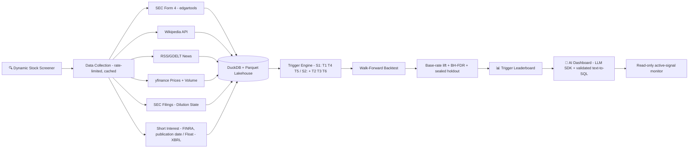

# 🚀 ATTENTION-FLOW CATALYST (AFC) — Full Production Scope v9.2  (🧩 SUPPORTING · READ-ONLY RESEARCH + EVAL SPINE)

## AI-Powered Predictive Trigger Analysis for Small-Cap Stocks
## A Defensible Research System with Statistical Rigor

> 🆕 *(CORRECTION 47)* Title restored. **Under the hood:** rule-based triggers (T1–T6) decide *when* to look → an **ML meta-labeling model** predicts the *probability* each trigger event reaches +10% in 3 days → an LLM analyzes filings and is **measured for faithfulness** → everything is held to a base rate, walk-forward and false-discovery control.
## "Finance is the substrate; faithfulness measurement is the method — and every trigger decision is tested against history."

> **Companion:** `ATTENTION_FLOW_CATALYST_SCOPE_v9_1_STAGE1.md` — the **Stage-1 build sheet** (Phase 1: eval-first faithfulness benchmark; Phase 2: event-study backtest v1), with code-level detail, week-by-week tasks and the engineering reference (Appendix A). **This document is the end-state scope** for the full S1 → S3 arc: canonical **methodology** (§2–§8), the **dashboard and guardrail design** (§10–§11), and the **S2 lakehouse** (§7.4) and **S3 research-agent** (§16A) architectures. It is design-level; it does not duplicate the build sheet. Shared-primitives contract: `Shared_SignalCore_Boundary_Spec_v1_5.md`.

**Document Version:** 9.2 (🎯 **FULL-PRODUCTION PROMOTION** — the complete AFC scope v9.0 becomes AFC's Full-Production document, mirroring Crucible's split (`CRUCIBLE_SCOPE_v3_1_STAGE1.md` + `CRUCIBLE_SCOPE_v1_0_FULL_PRODUCTION.md`). Renamed with `git mv` from `ATTENTION_FLOW_CATALYST_SCOPE_v9_0.md` so history is preserved. **Section numbers §1–§19 are preserved** so every existing cross-reference ("v9.0 §5.4", "§10–§11", …) still resolves.)
**Last Updated:** October 2, 2026
**Status:** ✅ APPROVED — Full-Production role confirmed by owner (decision D-6, completed).
**Last aligned:** Roadmap v10.0 through **CORRECTION 51**.
**Author:** Manuel Reyes

---

## Changelog

| Version | Change |
|---|---|
| v8.0 | Complete methodology scope (Feb 14, 2026). |
| v9.0 | v10.0 realignment (Aug 10, 2026): Supporting role, 3-stage arc. |
| v9.0 + C45 | §2 Q8 + §5.6 failed-signal follow-through; Rule 201 via `signalcore.shortsale` (Oct 1, 2026). |
| v9.0 + C46 (+ addendum) | Backtest retained by decision; positioning amended; S1/S2 trigger split; knowledge time, survivorship, rolling walk-forward + sealed holdout, base-rate lift + BH-FDR; FActScore → protocol re-implementation; PandasAI → validated text-to-SQL; review batch (tree, Dockerfile, CI tiering, thresholds, naming) (Oct 2, 2026). |
| **v9.2 (this file)** | **Promoted to Full-Production.** Added §1A Vision, §1B Integrity Spine, §1C Platform Architecture, §7.4 S2 knowledge-time lakehouse, §16A S3 read-only research agent, §16B Development Phases, stage-by-stage Tech Stack (§12) and Success Metrics (§17), Approval Checklist. **Build-level content moved, not deleted:** §9 deliverables/weeks → build sheet §7B.8 / §15; §13 pre-commit config → build sheet **Appendix A.1**; §14 logging module → **Appendix A.2**; §15 S1 tree → build sheet §12; §18B dashboard Dockerfile → **Appendix A.3**; §19 weekly timeline → build sheet §15. Each moved section keeps its number here as a design-level summary + pointer. |
| **v9.2 + C47** (October 3, 2026) | **AI-powered predictive.** Title restored. New **§5.7 AI Predictive Layer — ML meta-labeling** (baseline in S1 Phase 2, scaled in S2, LLM filing features in S3), with purged walk-forward, calibration, beat-the-best-rule test and LLM look-ahead controls. Propagated to §1, §1A–§1C, §2, §12, §16, §16A–§16B, §17, §18, quick reference and skills. |
| **v9.2 + C48** (October 4, 2026) | ML learning resources for §5.7: full ML Specialization (Courses 1–2 required, Course 3 optional) and the owned Jansen book added to the take-order table (rows 12a–12b). |
| **v9.2 + C51** (October 5, 2026) | Take-order 12b: Jansen 3rd edition (2026) committed; 12c: Chan & Medina added as Stage 3 optional. |

---


## 🎯 v10.0 ROADMAP ALIGNMENT & STAGE-EVOLUTION ARC — AUTHORITATIVE

> **This block governs.** Where anything below it conflicts (old stage numbers, retired titles, pre-v10.0 portfolio lists), **this block wins.**

**Aligned to:** Career Roadmap **v10.0 (2026 Market Realignment)**.

**Governing model:** **3 stages, not 5.** The retired 14-month "ML Engineer" stage is now an **embedded ML-literacy module inside Stage 3** (earned-overlay — ships only if it beats the baseline). The destination title is **Applied AI Engineer → Forward Deployed Engineer (FDE)**; the retired "Senior LLM Engineer" title is dropped. **This project is ONE system that evolves across stages — never rebuilt per stage.**

**Portfolio role:** 🧩 **Supporting** (production-grade; size ≠ tier) — read-only **GraphRAG financial-research** + **faithfulness ≥ 0.9** eval showcase. **Corrects the prior "flagship" self-label.** In v10.0, **flagship vs supporting = size & emphasis, not a quality tier — every project is production-grade.** Lead projects get new tooling first and are updated continuously as skills grow.

> 🆕 **Document role (v9.2):** this is AFC's **Full-Production** scope — end-state architecture and canonical methodology. **Stage 1 is built from** `ATTENTION_FLOW_CATALYST_SCOPE_v9_1_STAGE1.md`.

**Stage-evolution arc:**

| Stage | Theme | This project's layer |
|---|---|---|
| **S1** | Foundation (GenAI-first core) | Eval-first core (the **AFC Eval-First slice** — 🆕 *(C46 addendum)* superseded by the Stage-1 build sheet `ATTENTION_FLOW_CATALYST_SCOPE_v9_1_STAGE1.md`, D-6) — SEC-grounded faithfulness benchmark: filing retrieval + LLM analyst + three-method eval + controlled-perturbation catalog, as a portable benchmark repo. 🆕 *(CORRECTION 46)* **Phase 2 — event-study backtest v1** on the triggers that are point-in-time clean with free data: **T1** (insider `P` purchases), **T5** (dilution state) from EDGAR acceptance times, **T4** (volume) from prices — with base-rate lift, false-discovery control and walk-forward from day one. Build sheet: `ATTENTION_FLOW_CATALYST_SCOPE_v9_1_STAGE1.md`. |
| **S2** | DE/AE hardening | Financial-data lakehouse — EDGAR ingestion + PIT data + **signalcore** primitives + **dbt models** over filings/short-interest + contracts + orchestration (the DE/AE layer beneath the research system). 🆕 *(CORRECTION 46)* Adds **T2** (Wikipedia), **T3** (news) and **T6** (short interest) once the lakehouse stores each source with its **knowledge time**; the **full combination matrix** runs by the end of S2. |
| **S3** | Applied AI (RAG/agentic + eval) | **GraphRAG financial-KG hybrid** (Neo4j + ChromaDB) + read-only agentic research loop + eval-suite verifier + faithfulness ≥ 0.9 + Phoenix observability. |

- **Every project's S2 adds:** ingestion → **dbt-tested models (CI-gated)** → **data contracts** (Great Expectations) → warehouse/lakehouse → **Airflow** (idempotent runs) → Docker/**ECS** → monitoring + written **postmortem** → **semantic/metrics layer**.
- **Every project's S3 adds:** RAG/GraphRAG/agentic layer + **three-layer eval** (per-query metrics · trajectory tracing · drift vs frozen golden set) + **observability (Arize Phoenix, OTel-native, free)** + MCP + **HITL** on irreversible actions.

> 🆕 **Positioning & backtest ruling (roadmap v10.0 CORRECTION 46, October 2026).** AFC **keeps a read-only historical event-study backtest** so any combination of triggers can be tested and trigger decisions are data-driven. The roadmap's positioning line was amended to match: AFC is financial NLP/RAG with an eval spine **plus** a read-only event study that reports **hit-rate lift over a base rate under statistical controls**. It makes **no alpha, Sharpe or return claim** and is still **not a quant project** — résumé bullets and the README describe the methodology (point-in-time data, walk-forward, false-discovery control), never a return figure. **Mandatory controls that come with keeping it:** per-source knowledge time (§6.3); survivorship-aware universe and as-traded screening (§6.1–6.2); a true rolling walk-forward (§5.4); base-rate lift + Benjamini–Hochberg FDR across the combination matrix (§5.5) — with ~155 combinations tested at 5% significance and no real effect anywhere, about 8 would still look like winners by chance. **Stage split:** S1 Phase 2 = T1/T4/T5; S2 adds T2/T3/T6. **S1 primitives** (volume, validation, calendar, Rule 201) are written as a local, **`signalcore`-shaped** module (same signatures as Boundary Spec §2) so the S2 extraction is a move, not a rewrite.

**Production standard (non-negotiable, ALL projects):** business-outcome headline · Mermaid diagram · **C4 Context diagram (+ Container view on lead flagships)** 🆕 · **`docs/adr/` — numbered, immutable Architecture Decision Records (context → decision → consequences)** 🆕 · Dockerfile · eval-metrics table · 15–30s demo GIF · "What I Learned" · **synthetic data only in public repos** · `pyproject.toml` + `uv.lock` + `src/` + `py.typed` + ruff + mypy · **structured logging (`structlog` over stdlib via `ProcessorFormatter`) + PII redaction processor · typed config (`pydantic-settings`, `SecretStr` credentials) · capped jittered retries (`stamina`)** · Conventional Commits · **🆕 `.pre-commit-config.yaml` — pinned hook set, enforced locally (v10.0 CORRECTION 21)**. *(🆕 C4 + ADR added per roadmap v10.0 CORRECTION 8, July 2026 — additive documentation discipline: the decision-and-defense artifacts Applied-AI/FDE interviews probe; same doc version, no structural change.)* **🆕 Toolchain (v10.0 CORRECTION 14, July 2026):** the C4 diagram and the Mermaid diagram come from **one source** — the architecture is modeled once in **Structurizr DSL** (`docs/architecture.dsl`, version-controlled) and the C4 Context/Container views are exported to **Mermaid** via `structurizr-cli` for the README, so the two never drift. Structurizr Lite is free and self-hosts in Docker (already required); model in Structurizr, render out to Mermaid. Additive; same doc version.* **🆕 Dual agentic harness (July 2026; CORRECTION 42):** every repo carries **both** harnesses — **`.opencode/`** and **`.claude/`** — generated from one shared prompt layer and governed by a single portable **`AGENTS.md`** contract, plus a **`hooks/guard.py`** `PreToolUse` guard that blocks `git commit`/`push` so every commit is human by construction. Concretely, `.opencode/` carries (`agents/` — subagent definitions where the filename becomes the agent name; `commands/` — `/`-invoked slash commands), plus **`AGENTS.md`** and **`opencode.jsonc`** at the root. This mirrors the existing `.cursor/rules/` setup rather than replacing it — OpenCode's `instructions[]` field can load `.cursor/rules/*.md` directly and combines them with `AGENTS.md`, so **one set of standards drives both harnesses** and neither drifts. Tooling discipline, not a portfolio artifact.*

> **🆕 Pre-commit standard (roadmap v10.0 CORRECTION 21, August 2026).** This repo carries a pinned `.pre-commit-config.yaml`. **Governing rule: the hook set is a strict *subset* of the CI gate — CI stays authoritative, and no check exists locally that does not also run in CI.** Hooks are pinned by `rev:`, never floating. **Tier A (this repo):** `pre-commit/pre-commit-hooks` (`trailing-whitespace`, `end-of-file-fixer`, `check-yaml`, `check-toml`, `check-added-large-files`, `check-merge-conflict`, `detect-private-key`) · `astral-sh/ruff-pre-commit` → **`ruff-check` (with `--fix`) placed *before* `ruff-format`**, because the linter's fix behaviour can emit changes that then need reformatting (note: the linter hook id is `ruff-check`; the retired bare `ruff` id is not used) · `astral-sh/uv-pre-commit` → **`uv-lock`**, which is what turns the CORRECTION 13 reproducible-build claim from an assertion into an enforced invariant · **`gitleaks`** for secret scanning. **Tier C (`commit-msg` stage):** `conventional-pre-commit` — the Conventional Commits standard above is now **enforced, not merely declared**; install with `pre-commit install --hook-type commit-msg`. **Tier B (this repo handles notebooks):** **`nbstripout`** — strips notebook output before Git sees it. This extends the CORRECTION 16 PII choke point from the *logging* boundary to the *git* boundary; combined with `detect-private-key` and `gitleaks` it is the commit-time enforcement of the **synthetic-data-only-in-public-repos** rule, which otherwise depends on remembering to clear output every single time.
>
> **`mypy` is deliberately excluded from the hook set — CI-only.** The `mirrors-mypy` hook passes `--ignore-missing-imports` by default, which silently degrades third-party types to `Any` and produces different results than running mypy directly. If a local hook is ever wanted, it must be a `local` hook with `language: system` running `uv run mypy` with `pass_filenames: false`. **This exclusion is recorded as an ADR** — it is a decision with a tradeoff, not an omission.
>
> **Known risk — version drift (ADR-worthy).** `.pre-commit-config.yaml` pins tool versions *independently* of `uv.lock`, so upgrading ruff via uv leaves the hook on the old pin and local checks diverge from CI. Mitigation: `sync-with-uv` (or `sync-pre-commit-deps`) plus a scheduled `pre-commit autoupdate --freeze`.
>
> **`prek` — evaluated, not selected (falsifier recorded).** `prek` is a Rust drop-in alternative that reads this same config file and uses uv natively (adopted by CPython, FastAPI, Airflow, Ruff). It is *not* adopted now: `.pre-commit-config.yaml` is the artifact a reviewer recognises, and because prek reads that identical file the migration stays free and reversible. **Falsifier:** adopt if hook install/run time becomes a measured friction point against the 25 hrs/week schedule.
>
> **🆕 Python version — pinned (roadmap v10.0 CORRECTIONS 27–28, August 2026).** **Python 3.14 is the official floor for every project in this portfolio (`3.14+`).** It is pinned in one place per repo — `requires-python = ">=3.14"` in `pyproject.toml` — and every downstream tool reads from that single declaration: `[tool.ruff] target-version = "py314"`, `[tool.mypy] python_version = "3.14"`, the Dockerfile base image, and the CI matrix. **One source, no second place to drift.** ⚠️ **Enforcement:** a mismatch between any of those four and `requires-python` is a CI failure, not a lint warning — the same discipline `uv.lock` gets from the `uv-lock` hook under CORRECTION 21.
>
> ⚙️ **Two binding constraints on the pin.** **(a) Standard GIL build only — the free-threaded build (`python3.14t`) is explicitly NOT used.** Free-threading is where the C-extension wheel compatibility problems live, this portfolio has no CPU-bound multicore workload that would benefit, and debugging wheel availability is pure schedule tax against a 25 hrs/week budget with zero portfolio value. **(b) Airflow constraint-file caveat:** Airflow 3.2.0+ officially supports Python 3.14, but a known open issue reports the 3.14 constraint files being out of sync between the published Docker image and `pip`/`uv` install. **Documented workaround: fall back to the `constraints-3.13.txt` file for the Airflow service only** — this is a constraint-file selection, *not* a second Python version, and the interpreter stays 3.14. ⚠️ **Falsifier:** raise the floor only when a named dependency in a committed lockfile requires it, or when 3.14 leaves security support — **never to chase a release**; 3.15 ships October 2026 and is explicitly not adopted on release.
> **🆕 Language & AI last-mile standard (roadmap v10.0 CORRECTIONS 22–23, August 2026).** **Python and SQL are confirmed as the correct and sufficient primary languages** for this portfolio. **SQL is the single highest-signal language in DE postings**, and **PySpark is the capturable differentiator — reached through Python, not adopted as a separate language.** **Rust, Go, Java, Scala and standalone JavaScript were each evaluated and declined with recorded falsifiers**; JavaScript specifically as *redundant*, since TypeScript is a superset of it and the Stage-2 TypeScript sprint already covers that ground. **TypeScript is retained for the last mile only** — MCP protocol tooling and the AI application/UI layer. **This project stays Python-primary:** agent cores, retrieval, orchestration, evaluation and any long-horizon planning remain Python. ⚠️ **Falsifier:** revisit only if a target employer posts a JD naming a different primary language for the role being applied to. **No TypeScript layer scoped for this project at present.** ⚠️ **Falsifier:** revisit only if a UI deliverable is added to this project's scope by approval.
>
> ⚠️ **Evidence note — guardrail independently corroborated (August 2026).** The last-mile guardrail no longer rests solely on the sources that recommended the SDK. An independent practitioner review of the **AI SDK 7** release (June 2026) draws the same boundary unprompted: the SDK is strongest as a **TypeScript-first application layer**, and weaker where the core problem is multi-hour orchestration, language-agnostic workflows or deeply stateful agent planning — with the explicit note that teams deploying agents across **Python services, queues and data pipelines** should treat it as *an SDK layer, not an orchestration standard*. That is this portfolio's exact shape. Convergent and independently sourced; recorded as **directional**, per the CORRECTIONS 18–19 evidence standard.

---


## 📋 Table of Contents

1. [Executive Summary](#1-executive-summary) · **1A** Vision · **1B** Integrity Spine · **1C** Platform Architecture *(new in v9.2)*
2. [Research Question](#2-research-question)
3. [Stock Screening Criteria](#3-stock-screening-criteria)
4. [Trigger Framework](#4-trigger-framework)
5. [Backtest Methodology](#5-backtest-methodology)
6. [Data Integrity & Bias Controls](#6-data-integrity--bias-controls)
7. [Data Architecture: Lakehouse Design](#7-data-architecture-lakehouse-design) · **7.4** S2 knowledge-time lakehouse *(new)*
8. [Market Data Modes](#8-market-data-modes)
9. [Phase 1A Scope — Backtest Engine](#9-phase-1a-scope--backtest-engine) *(→ build sheet §7B)*
10. [Research Dashboard — design](#10-research-dashboard--design)
11. [AI Guardrails](#11-ai-guardrails)
12. [Tech Stack: Production (by stage)](#12-tech-stack-production-by-stage)
13. [CI/CD & Pre-commit — standard](#13-cicd--pre-commit--standard) *(code → build sheet Appendix A.1)*
14. [Logging & Debugging — standard](#14-logging--debugging--standard) *(code → Appendix A.2)*
15. [Project Structure — end state](#15-project-structure--end-state)
16. [Project Evolution (3 Stages)](#16-project-evolution-3-stages) · **16A** S3 Research Agent · **16B** Development Phases *(new)*
17. [Success Metrics (process, not P&L)](#17-success-metrics-process-not-pl)
18. [Risk Mitigation](#18-risk-mitigation) · 18A. AI Evaluation Layer · 18B. Containers
19. [Timeline (stage-level)](#19-timeline-stage-level)

---


## 1. Executive Summary

**Attention-Flow Catalyst** is a **Supporting** project (production-grade — size, not quality, distinguishes it from the lead flagships) that evolves through the **3 stages** toward **Applied AI Engineer → FDE**. 🆕 *(CORRECTION 47)* It is **AI-powered predictive**: an ML meta-labeling layer on top of the trigger rules outputs a calibrated probability for each trigger event (§5.7). It is designed as a **defensible research system**—not just a dashboard—with proper statistical methodology, bias controls, and reproducibility.

### What Makes This Project Different

| Dimension | Typical Tutorial Project | Attention-Flow Catalyst |
|-----------|-------------------------|-------------------------|
| **Data Selection** | Manual stock list | Dynamic screener with survivorship bias controls |
| **Backtest Method** | Naive "if signal, check return" | Walk-forward validation, de-clustering, confidence intervals |
| **Storage** | SQLite or CSV | Lakehouse (partitioned Parquet + DuckDB) |
| **API Calls** | Sequential requests | Rate-limited, cached collectors — EDGAR via `edgartools` behind an adapter (SEC fair access caps clients at 10 req/s, so concurrency buys nothing there); async `httpx` only for sources that allow it 🆕 *(C46 addendum)* |
| **AI Architecture** | Single provider, raw text | Provider-agnostic SDK (**Anthropic Claude primary**, Gemini/OpenAI fallback) |
| **AI Outputs** | Unstructured text responses | Pydantic-validated structured outputs |
| **AI Features** | Gimmicky chatbot | LLM SDK + **validated text-to-SQL** (sqlglot whitelist, read-only DuckDB), SQL-first, guardrails & observability 🆕 *(CORRECTION 46)* |
| **Triggers** | News + Volume only | SEC Form 4, Wiki, News, Volume, **Dilution state**, **Squeeze context (short interest + float)** |
| **Reproducibility** | None | Audit tables, pipeline run logs, version control |
| **CI/CD** | None | GitHub Actions on every PR |

### Core Capabilities

- **Statistical Rigor:** Walk-forward backtesting, bootstrap confidence intervals, multiple testing controls
- **Alternative Data:** SEC Form 4 insider filings, dilution/offering state (S-1, 424B5, 8-K), Wikipedia attention, news mentions, volume patterns
- **Bias Controls:** Survivorship bias handling via historical universe snapshots, corporate actions adjustment
- **Modern Data Stack:** DuckDB for analytics, Parquet lakehouse, rate-limited cached collectors (`edgartools` adapter for EDGAR; `httpx` elsewhere) 🆕 *(C46 addendum)*
- **AI Integration:** Natural language queries via LLM SDK (**Anthropic Claude primary** — financial reasoning quality matters most for AFC's 0.9 faithfulness threshold) + **validated text-to-SQL** (the model writes SQL; `sqlglot` parses it and rejects anything outside the §11.3 whitelist; executed on a read-only DuckDB connection) with guardrails and SQL transparency 🆕 *(CORRECTION 46)*
- **Structured Outputs:** Pydantic-validated AI responses with type-safe schemas
- **AI Observability:** Token usage, cost tracking, latency monitoring, guardrail activation logs
- **Production Practices:** GitHub Actions CI, type hints, comprehensive testing, audit logging
- **Domain Expertise:** 5+ years of independent trading knowledge codified into algorithms 🆕 *(C46 addendum)*

---

> 🔁 **Agentic Loop Spec (roadmap v8.8):**
> - **Loop type:** *read-only research / goal-loop* — screen → trigger-detect (T1–T6) → label (+10%-in-3-days) → score → leaderboard; S3 wraps this as a **read-only research agent** 🆕 *(C46 addendum)* *(renamed from "Agentic Trading Assistant" — AFC never trades; the S1 detectors become its verifier)*.
> - **Verifier:** the eval suite — **DeepEval ≥0.9 faithfulness**, SelfCheckGPT / FActScore on SEC-grounded claims; PIT / leakage tests gate the backtest.
> - **Autonomy:** safe to run **unattended** because the system is **read-only** (no orders, no execution). The **"behind the Wall"** rule (LLM sees only aggregated in-sample stats) is the governance that keeps the loop honest. Layered exits: verifier pass + max-iteration cap + token budget.


## 1A. Vision: From Benchmark + Event Study to a Governed Read-Only Research Platform 🆕 *(v9.2)*

| Dimension | S1 (build sheet) | S2 | S3 (end state) |
|---|---|---|---|
| **Corpus** | Sampled SEC filings (≥ 60 human-verified bases) + EDGAR-derived triggers | EDGAR at scale (500+ tickers), FINRA short interest, Wikipedia pageviews, news history | Knowledge graph (issuers · filings · insiders · transactions · offerings) + vector index |
| **Research engine** | Faithfulness benchmark + backtest v1 (T1/T4/T5, 28 scenarios) | Full trigger matrix (~155 scenarios) incl. T2/T3/T6 | Research agent answering questions over the KG and the backtest marts |
| **AI prediction** 🆕 *(CORRECTION 47)* | ML meta-labeling **baseline** (logistic regression + gradient boosting) on T1/T4/T5 features | Scaled on the full matrix and 500+ tickers; MLflow tracking | + LLM-extracted filing features; agent explains each prediction |
| **Storage** | Parquet + DuckDB | Bitemporal medallion lakehouse, dbt-modelled | + Neo4j + vector store |
| **Orchestration** | CLI + Makefile | Airflow, idempotent partitions | + LangGraph read-only loop |
| **AI** | Analyst + three detectors; text-to-SQL dashboard | Golden-set drift gate on every model/parser change | Agent; **S1 detectors become the verifier**; MCP tools |
| **Observability** | structlog + run manifests | + freshness/volume monitors, written postmortem | + Arize Phoenix trajectories |
| **Safety** | Read-only by construction; budget caps | + data contracts | + verifier gate (faithfulness ≥ 0.9 blocking), no write tools anywhere |

> **Positioning (roadmap, as amended by CORRECTION 46):** financial NLP/RAG with an eval spine **plus** a read-only historical event study reporting **lift over a base rate** under statistical controls. **No alpha, Sharpe or return claim; not a quant project.**

---

## 1B. The Integrity Spine (S1 — carried through every stage) 🆕 *(v9.2)*

| Control | What it does | Where |
|---|---|---|
| **Knowledge time** | Every record carries `available_at`; an event can drive an entry at session *S* only if known before 09:30 ET on *S* | §6.3 · build sheet §7B.2 |
| **Survivorship-aware universe** | Historical as-of universes, delisted issuers included (Form 25/15-seeded), as-traded screening, survivorship gap reported | §6.1–6.2 · §7B.3 |
| **Rolling walk-forward + embargo + sealed holdout** | Selection on train windows only; the final 12 months scored **once** | §5.4 · §7B.5 |
| **Base-rate lift** | No hit rate without its unconditional base rate | §5.5 |
| **False-discovery control** | Benjamini–Hochberg over **every** scenario × configuration tested | §5.5 |
| **Pre-registration** | Criteria committed before the holdout (backtest) or test split (benchmark) is scored | build sheet §6.5, §7B.5 |
| **Sealed benchmark test split** | Detector thresholds frozen on a calibration split | build sheet §6.5 |
| **Judge independence** | Judge provider ≠ analyst provider; cross-judge κ | §18A · build sheet §6.7 |
| **Reproducibility** | Content-addressed LLM response cache + run manifests (git SHA, lock/config/data hashes, model IDs, seeds) | build sheet §6.7, §7 #13 |
| **Frozen golden set** | Drift baseline that gates every later parser, model or prompt change | build sheet §7 #17 · §18A |
| **Read-only by construction** | No orders, no write tools, no execution — ever | §11 · §16A |
| **Purging + embargo for ML** 🆕 *(CORRECTION 47)* | Training events whose 3-day label window overlaps a test window are purged; same embargo as §5.4 | §5.7 |
| **Beat-the-best-rule test** 🆕 *(CORRECTION 47)* | The ML model ships only if it beats the best rule-based combination, not just the base rate | §5.7 |
| **LLM look-ahead control** 🆕 *(CORRECTION 47)* | Names/tickers stripped before LLM feature extraction; post-training-cutoff results reported separately; extracted features verified by the S1 detectors | §5.7 |

---

## 1C. Platform Architecture (end state) 🆕 *(v9.2)*

```mermaid
flowchart TB
    subgraph SRC[Sources - retrieval-stamped]
      E[SEC EDGAR<br/>acceptance datetime]
      P[Daily OHLCV<br/>as-traded + adjusted]
      F[FINRA short interest<br/>publication date]
      W[Wikipedia pageviews<br/>UTC day + lag]
      N[GDELT news history]
    end
    subgraph LH[S2 Knowledge-time lakehouse]
      B[(Bronze: raw + available_at)] --> S[(Silver: parsed, typed, bitemporal)] --> G[(Gold: dbt marts)]
    end
    SC[[signalcore primitives]]
    SRC --> B
    SC -.used by.-> G
    G --> BT[Event-study engine<br/>walk-forward · base rate · BH-FDR]
    G --> ML[ML meta-labeling model<br/>calibrated P(hit) per trigger event]
    AN -.S3 LLM filing features.-> ML
    ML --> DB
    G --> KG[(Neo4j KG + vector index)]
    E --> AN[LLM analyst]
    AN --> DET[Detectors: DeepEval · FActScore protocol · SelfCheck]
    BT --> DB[Research dashboard<br/>validated text-to-SQL]
    KG --> AG[S3 read-only research agent<br/>LangGraph · MCP read-only tools]
    AG --> DET
    DET -->|faithfulness ≥ 0.9 or block| OUT[Cited answer / report]
    PH[Arize Phoenix] -.traces.- AG
```

---


## 2. Research Question

> **Primary Question:** Which trigger or combination of triggers best predicts +10% price moves within 3 trading days for small-cap stocks?
>
> 🆕 *(CORRECTION 46)* **Operational form:** which triggers or combinations **raise the probability of a ≥ +10% move (net of costs) within 3 trading days above the base rate** for the same universe and period — reported as lift with a 95% CI, after false-discovery control, and stable across walk-forward windows. A hit rate without its base rate is not reported.

**Secondary Questions:**
1. Does sector strength context improve trigger hit rates?
2. Does index trend context (bullish vs bearish market) affect performance?
3. Do multi-trigger combinations outperform single triggers?
4. Which volume patterns precede significant moves?
5. Does post-dilution-close create higher probability setups?
6. Are results stable across train vs test periods (walk-forward)?
7. **Does a loaded short-squeeze context (high short-%-of-float + low float + high days-to-cover) lift the hit rate of catalysts T1–T5?** ⭐ NEW
8. **When a top-ranked catalyst *fails*, does price keep going the wrong way (follow-through) or snap back (reversion)?** 🆕 *(CORRECTION 45 — descriptive and read-only; see §5.6)*
9. **Can an ML model predict *which* trigger events reach +10% better than the best rule-based combination?** 🆕 *(CORRECTION 47)* *(see §5.7)*

**Hypothesis:** Combining multiple alternative data signals (insider buying + attention spike + volume accumulation + dilution-clear state) will produce higher hit rates than any single signal alone, and these results will be stable out-of-sample.

---

## 3. Stock Screening Criteria

The system dynamically screens for stocks meeting ALL criteria:

| Criterion | Requirement | Rationale |
|-----------|-------------|-----------|
| **Price** | < $5.00 | Bigger percentage move potential |
| **Exchange** | NYSE, NASDAQ, AMEX only | NO OTC/Pink Sheets — better data quality |
| **Float** | Small (bottom 30% of screened universe) | Limited supply = faster moves |
| **Sector** | Strong (top 3 sectors by 20-day performance) | Sector tailwinds increase probability |
| **Volume** | Minimum avg daily volume > 100K | Ensures liquidity for entry/exit |
| **Market Cap** | < $500M (micro/small cap) | Focus on overlooked opportunities |

**Output:** ~50 stocks refreshed weekly that meet all criteria *(dashboard view)*. 🆕 *(D-9, locked)* For **research runs** the ~50 cap is dropped whenever the power estimate shows most scenarios below the 30-signal floor; every other screen is kept, and screens use **as-traded** prices (§6.2).

---

## 4. Trigger Framework

### 4.1 Overview

| ID | Trigger Name | Data Source | Signal Type |
|----|--------------|-------------|-------------|
| **T1** | SEC Form 4 Insider Buy | edgartools | Smart Money |
| **T2** | Wikipedia Attention Spike | Wikipedia API | Public Attention |
| **T3** | News Mention Spike | RSS/GDELT | Media Coverage |
| **T4** | Volume Accumulation (5 sub-signals) | yfinance | Institutional Activity |
| **T5** | Dilution/Offering State | edgartools | Capital Structure ⭐ NEW |
| **T6** | Squeeze Context (short interest + float) | yfinance / FINRA | Supply Pressure ⭐ NEW |

---

### 4.2 T1: SEC Form 4 Insider Buy

```yaml
t1_insider_buy:
  transaction_types:
    - P: "Open market or private purchase"   # 🆕 CORRECTION 46: P ONLY
    # Removed (CORRECTION 46, review A-11): A "Grant/Award" — compensation, not a purchase.
    # A, M (option exercise) and F (tax withholding) are stored as their own event types, never as T1.
  minimum_value: $10,000
  knowledge_time: "EDGAR acceptance datetime (not filing date) — see §6.3"   # 🆕 CORRECTION 46
  stage: "S1 Phase 2"
  insider_types:
    - CEO, CFO, COO, President
    - Director
    - 10% Owner
  lookback_window: 30 days
  signal_fires_when: "Any qualifying purchase detected"
```

---

### 4.3 T2: Wikipedia Attention Spike

```yaml
t2_wiki_attention:
  baseline_period: 30 days rolling average
  spike_threshold: 2.0 standard deviations above baseline
  minimum_daily_views: 100  # filter noise
  lookback_window: 7 days
  signal_fires_when: "Daily views > baseline + (2 × std_dev)"
```

---

### 4.4 T3: News Mention Spike

```yaml
t3_news_spike:
  baseline_period: 14 days rolling average
  spike_threshold: 2.0 standard deviations above baseline
  minimum_mentions: 3 per day  # filter noise
  sentiment_filter: null  # Phase 1 = volume only
  lookback_window: 7 days
  signal_fires_when: "Daily mentions > baseline + (2 × std_dev)"
```

---

### 4.5 T4: Volume Accumulation (5 Sub-Signals)

| ID | Signal | Calculation | Threshold |
|----|--------|-------------|-----------|
| **T4a** | RVOL | Today's volume / 20-day avg | ≥ 1.5 |
| **T4b** | Accumulation Score | (Close-Low)/(High-Low) × Volume | Rising over 5 days |
| **T4c** | OBV Breakout | Cumulative volume | 20-day high |
| **T4d** | Quiet Accumulation | Price flat + OBV rising | Price < 2% / 10 days, OBV up |
| **T4e** | Volume Dry-Up | Volume < 50% avg for 3+ days | Tight range < 3% |

---

### 4.6 T5: Dilution / Offering State (NEW)

**What It Detects:** Capital structure changes that affect supply/demand dynamics.

**Forms Tracked:**
- **S-1, S-3:** Shelf registration filed
- **424B5:** Prospectus supplement — offering PRICED
- **8-K:** Material event — offering CLOSED
- **EFFECT:** Registration statement effective

**State Machine:**
```yaml
t5_state_machine:
  states:
    CLEAR: "No recent dilution (> 90 days since last event)"
    OVERHANG: "Shelf registration filed, no active deal"
    ACTIVE_DEAL: "Offering priced, shares being sold"
    CLOSED: "Offering completed within 30 days"
    
  transitions:
    CLEAR → OVERHANG: "S-3/S-1 filed"
    OVERHANG → ACTIVE_DEAL: "424B5 filed"
    ACTIVE_DEAL → CLOSED: "8-K announcing completion"
    CLOSED → CLEAR: "30 days elapsed"
```

**Combination Hypotheses:**
- `T5_CLOSED + T1 (insider buy)` = Strong bullish conviction
- `T5_CLOSED + T2 (attention) + T4 (volume)` = Post-dilution reversal
- `T5_OVERHANG + ANY trigger` = Reduce expected hit rate

---

### 4.7 T6: Squeeze Context (NEW)

**What It Detects:** a *loaded* short-squeeze state — a large block of obligated future buying (short interest) trapped against a small tradable supply (float). Conceptual reference: `Short_Squeeze_Context_Reference.md`.

> **Role — read this first.** T6 is **fuel, not a spark.** Short interest is a reservoir of forced future buying; it does *nothing* until a catalyst ignites it. So T6's **primary** use is as a **context filter** (the 5th context in §4.8), answering "does a loaded squeeze state lift the hit rate of catalysts T1–T5?" — **not** as a standalone leg blown out across the full trigger-combination matrix. Treating fuel as a catalyst would be mechanically wrong and would explode the multiple-testing surface (63 combos × contexts) for setups that are already rare.

**Metrics** (computed from `signalcore` primitives — short interest + float; see Boundary Spec):

| Metric | Formula | Covers |
|---|---|---|
| `pct_float_short` | `shares_short / float` | Supply pressure — the fuel |
| `days_to_cover` (≡ short interest ratio) | `shares_short / avg_daily_volume` | Time-to-exit — congested cover |
| `float_turnover` | `daily_volume / float` | Velocity — real-time ignition tell |

```yaml
t6_squeeze_context:
  role: "CONTEXT (loaded state). Fuel, not spark. Primary use = 5th context filter (§4.8)."
  data_source:
    short_interest: "FINRA consolidated short-interest files (exchange-listed coverage from June 2021); knowledge time = FINRA PUBLICATION date, never settlement date"   # 🆕 CORRECTION 46 (review A-04, SC-01)
    float: "shares outstanding from XBRL cover-page facts (dei:EntityCommonStockSharesOutstanding), knowledge time = filing acceptance; re-derived on dilution events (T5)"   # 🆕 CORRECTION 46
    # Replaced (CORRECTION 46): yfinance sharesShort / floatShares are CURRENT snapshots, not history — using them on past dates is look-ahead.
    stage: "S2 (needs the knowledge-time lakehouse)"
    volume / avg_daily_volume: "yfinance daily / 20-day"
  loaded_state_when:                 # the CONTEXT (potential) — a-priori, to be tuned in-sample only
    pct_float_short: ">= 0.20"       # test 0.15–0.30
    days_to_cover:   ">= 5"          # test 3–10
    float:           "bottom 30% of universe (already screened in §3)"
  ignition_tell:                     # optional live confirmation
    float_turnover_spike: ">= 2.0x its 20-day median"
  fires_when: "loaded_state AND paired with a catalyst (T1–T5) — NEVER standalone"
  squeeze_combination_hypotheses:
    - "T6_loaded + T1 (insider buy)   = smart money buying into trapped shorts (highest conviction)"
    - "T6_loaded + T2/T3 (attention)  = retail-driven ignition"
    - "T6_loaded + T4 (RVOL/accum)    = squeeze likely already underway"
    - "T6_loaded + T5_CLOSED          = post-dilution squeeze (float fixed, shorts offside)"
  caveats:
    - "Short interest is bi-monthly / lagged ~2 weeks — a real weakness vs the 3-day horizon; measure it, don't assume it away."
    - "High short interest is often justified (deteriorating fundamentals) — fuel is NOT bullish alone."
    - "Squeeze setups are RARE — the 30-signal minimum (§5.5) will exclude many squeeze-context scenarios; report honest n."
    - "Float is not static — re-derive from the T5 dilution state on offerings/lockups; do not cache."
```

---

### 4.8 Combination Testing Matrix

**Individual Triggers (5):** T1, T2, T3, T4, T5_CLOSED

**2-Trigger Combinations (10)**
**3-Trigger Combinations (10)**
**4-Trigger Combinations (5)**
**5-Trigger Combination (1)**

**With Context Filters (×5):**
- No filter
- Sector strength filter
- Index trend filter
- Dilution state filter
- **Squeeze-context filter (T6 loaded state)** ⭐ NEW

**Total Potential Scenarios:** 31 combinations × 5 contexts = **~155 scenarios**

> **Why T6 is a context, not a 6th combinatorial trigger:** squeeze fuel is not a catalyst, so it is tested as an overlay that either lifts or doesn't lift the existing catalysts — not as another standalone leg. This keeps the scenario count at 155 rather than exploding to 63 combos × 5 = 315, which matters under the §5.5 multiple-testing controls and the 30-signal floor (squeeze setups are rare).

---

## 5. Backtest Methodology

> **This section defines the rules that make results trustworthy.**

### 5.1 Signal Anchor Definition

```yaml
signal_anchor:
  rule: "Signal confirmed at market close"
  measurement_start: "Next trading day open"
  measurement_period: "3 trading days (close-to-close)"
  # 🆕 CORRECTION 46 — label fixed precisely (review A-21):
  label: "HIT if max(high over days 1..3) >= entry_open x 1.115 (net +10% after the §5.3 round-trip cost); also report close-at-day-3 return as a secondary label"
  entry: "next session OPEN after the signal (the example below measures open-to-close, not close-to-close)"
  
  example:
    signal_date: "2025-01-15 (Wednesday close)"
    entry_price: "2025-01-16 open (Thursday)"
    exit_price: "2025-01-21 close (Tuesday)"
    return: "(exit - entry) / entry"
```

### 5.2 De-Clustering Rule

```yaml
de_clustering:
  rule: "One active signal per ticker per 5 trading days"
  
  example:
    day_1: "ABCD fires T1 → COUNTED"
    day_2: "ABCD fires T1 → IGNORED (within 5-day window)"
    day_3: "ABCD fires T4 → COUNTED (different trigger type)"
    day_6: "ABCD fires T1 → COUNTED (new window)"
    
  rationale: "Prevents inflated hit rates from consecutive signals"
```

### 5.3 Transaction Cost Model

```yaml
transaction_costs:
  slippage_bps: 25      # 0.25% for small-cap entry
  spread_proxy_bps: 50  # typical bid-ask spread
  commission: 0         # most brokers commission-free
  
  total_round_trip: 150 bps (1.5%)
  
  hit_threshold:
    gross: "+10% raw return"
    net: "+11.5% raw return (to net +10% after costs)"
```

### 5.4 Walk-Forward Validation

```yaml
walk_forward:
  training_period: "Year 1 - Year 2 (24 months)"
  testing_period: "Year 3 (12 months)"
  
  rules:
    - "Tune thresholds on training period ONLY"
    - "Leaderboard rankings based on TEST period ONLY"
    - "NO re-tuning after seeing test results"
    
  process:
    1: "Run backtest on training period"
    2: "Identify top 10 trigger combinations"
    3: "Run SAME combinations on test period (no changes)"
    4: "Report test period metrics as final"
```

> 🆕 **CORRECTION 46 (review A-08) — this is a single holdout, not a walk-forward.** Crucible's standard forbids publishing single-split results, and so does this one now:

```yaml
walk_forward_v2:            # 🆕 CORRECTION 46 — supersedes the single split above for anything published
  scheme: "anchored, expanding train window; rolling 6-month test windows"
  example: "train 2021-07..2022-12 -> test 2023H1; train ..2023-06 -> test 2023H2; ... (each test window used once)"
  embargo: "5 trading days between train end and test start (3-day label horizon + de-clustering)"
  selection: "combinations and thresholds chosen on each train window only"
  reported: "per-window lift + pooled out-of-sample lift; a combination is STABLE only if lift > 0 in a pre-registered share of windows"
  final_holdout: "the most recent 12 months sealed and scored ONCE at the end (same discipline as Crucible's OOS vault)"
```

### 5.5 Multiple Testing Controls

```yaml
multiple_testing_controls:
  minimum_signal_count:
    threshold: 30 signals minimum per scenario
    action: "Exclude scenarios with < 30 signals"
    
  confidence_intervals:
    method: "Bootstrap 95% CI on hit rate"
    iterations: 1000
    reporting: "Hit rate [CI_low - CI_high]"
    
  stability_check:
    method: "Compare train vs test rankings"
    metric: "Spearman rank correlation"
    threshold: "> 0.5 correlation = stable"

  # 🆕 CORRECTION 46 (review A-09) — mandatory for "test any combination"
  base_rate:
    definition: "unconditional P(HIT) for the same universe, same dates, same label"
    reported: "lift = P(HIT | combo) - base_rate, with 95% CI; ratio also shown"
  false_discovery_control:
    method: "Benjamini-Hochberg across ALL combinations tested in a run (not just the top 10)"
    target_fdr: 0.10          # pre-registered; changing it is a new run
    why: "~155 combinations at alpha 0.05 with no real effect -> ~8 false winners by chance"
  power_note: "state expected n per scenario BEFORE running (review A-22); scenarios below the 30-signal floor are listed, not hidden"
  overlap_rule: "de-clustering applies per TICKER across trigger types inside a combination scenario, so overlapping windows cannot inflate n"
```

### 5.6 Failed-Signal Follow-Through (descriptive, read-only) 🆕 *(roadmap v10.0 CORRECTION 45, October 2026)*

> **Why this exists.** CORRECTION 45 evaluated a stop-and-reverse "safeguard" and placed it in **Crucible** as a backlog strategy hypothesis (`SAR-on-stop`, Crucible Stage-1 §4.1) — AFC never executes (see the read-only note under *Skills Required*). AFC's contribution is the cheapest honest evidence: *what happens after a catalyst fails?* If failed small-cap catalysts mostly **revert**, a reversal is a losing idea before any execution work is spent on it.

```yaml
failed_signal_follow_through:
  status: "descriptive analysis — NOT a trigger, NOT a scenario, NOT in the leaderboard"
  scope: "the top-10 combinations selected on the TRAINING period (§5.4) — no new scenarios"
  failure_definition:
    rule: "close-to-close return from entry <= -F% inside the 3-day window, before +10% is reached"
    F: "fixed in config BEFORE the run; logged; never tuned after results"
  measurement:
    anchor: "next trading day open after the failure close (same convention as §5.1)"
    horizon: "3 trading days, close-to-close"
    reported: "mean / median forward return, % continuing beyond -F%, bootstrap 95% CI"
    period: "TEST period only (§5.4 rules apply)"
  split_reported:
    - "T6 loaded vs not loaded (squeeze fuel — where a short reversal is most dangerous)"
    # 🆕 CORRECTION 46: the T6 split arrives in S2 with T6 itself; in S1 the Rule 201 flag comes from the local signalcore-shaped module, replaced by signalcore.shortsale at S2 extraction
  executability_flags:
    - "Rule 201 restricted: signalcore.shortsale.rule201_state(...).restricted (low <= 0.90 x prior close -> that day + next session); unknown reported as its own bucket"
    - "borrow availability: UNKNOWN historically for sub-$5 names — stated, never assumed"
  output_label: "gross, descriptive — not an executable short return"
  multiple_testing: "no new scenarios; the ~155-scenario surface (§4.8) is unchanged"
```

**How the result is used.** It is **directional input only** to Crucible's `SAR-on-stop` hypothesis. AFC's universe (sub-$5, illiquid) is not Crucible's (liquid, ADV ≥ 1M), so a finding here never transfers as a verdict — Crucible tests on its own universe. **The LLM analyst may summarize this table; it never turns it into a trade recommendation** (§11 guardrails). *Falsifier: if the failure threshold `F` cannot be fixed before the run without looking at test-period data, drop §5.6 rather than weaken §5.4.*

---

### 5.7 AI Predictive Layer — ML Meta-Labeling 🆕 *(roadmap v10.0 CORRECTION 47, October 2026)*

> **Why this section exists.** The project's name promises **AI-powered prediction**. The trigger rules (§4) and statistics (§5.1–5.5) find *which combinations* beat the base rate; this layer adds an AI model that predicts the **probability that each individual trigger event** reaches +10% within 3 trading days. The design is **meta-labeling** (López de Prado, *Advances in Financial Machine Learning*, 2018): a primary rule decides *when* to look; a secondary classifier learns *which* of those signals are likely to work.

```yaml
ai_predictive_layer:
  primary_model: "trigger rules T1-T6 and their combinations (§4) — unchanged"
  meta_label: "1 if the trigger event's §5.1 label is HIT, else 0 (same label, same entry, same costs)"
  secondary_model:
    s1_baseline: ["logistic regression (interpretable floor)", "gradient boosting (LightGBM)"]
    s2: "same models on the full trigger matrix and 500+ tickers; MLflow experiment tracking + model registry"
    s3: "+ LLM-extracted filing features (below); the research agent explains each prediction"
  features:
    s1: ["trigger flags + T4 sub-signal values", "T5 dilution state", "T1 insider role / value / count", "sector strength", "index trend", "price & volume context (as-traded)"]
    s2: ["+ T2 attention", "+ T3 news intensity", "+ T6 short-interest context (publication-date knowledge time)"]
    s3_llm: ["offering terms (best-efforts, warrants, discount)", "going-concern language", "Rule 10b5-1 status", "use-of-proceeds category"]
    knowledge_time: "every feature carries available_at; a feature is usable only if available_at < entry open (§6.3)"
  validation:
    splits: "the §5.4 rolling walk-forward windows — NOT random k-fold"
    purging: "drop training events whose 3-day label window overlaps the test window"
    embargo_days: 5
    calibration: "isotonic or Platt, fit on an inner split of each TRAIN window only"
    holdout: "the §5.4 sealed final 12 months, scored ONCE"
  metrics: ["AUC-PR", "Brier score", "calibration curve", "precision at top-k events", "lift over base rate", "lift over the BEST rule-based combination"]
  false_discovery: "every model x feature-set x hyperparameter configuration evaluated joins the §5.5 BH-FDR family"
  ships_only_if: "holdout lift over the best rule-based combination has a 95% CI excluding 0; otherwise rule verdicts stand and the ML result is published as REJECTED"
  output: "calibrated probability per trigger event + lift — never position sizes, never returns"
  llm_lookahead_controls:
    anonymize: "strip company names, tickers and identifying details before LLM feature extraction"
    post_cutoff_slice: "report results separately for events after the LLM's training cutoff"
    verify: "extracted features checked against the filing by the S1 detectors (faithfulness gate)"
    cache: "LLM extractions cached by content hash; deterministic re-runs"
```

**Why the extra controls matter.** Meta-labeling is not a free lunch — practitioners note that a good meta-model is as hard to build as a good primary signal — so the model must earn its place against the best rule, not just the base rate. LLM features add a second risk: a model trained on years of text can carry knowledge of what happened after a filing (look-ahead) or be swayed by general knowledge of the company (distraction; Glasserman & Lin, 2023). Anonymization, a post-cutoff slice and faithfulness verification address both.

**Read-only boundary.** The model outputs a probability for research and display. It never sizes or places a position — execution, and any use of probabilities for sizing, belongs to Crucible (Boundary Spec §4).

---

## 6. Data Integrity & Bias Controls

### 6.1 Survivorship Bias Policy

```yaml
survivorship_bias:
  problem: "Screening TODAY's stocks and backtesting 3 years = bias"
  
  solution: "Historical universe snapshots"
  
  implementation:
    frequency: "Weekly (every Monday)"   # forward-looking only — cannot reconstruct the past (review A-06)
    historical_reconstruction: "🆕 CORRECTION 46 — rebuild past universes from as-traded prices + XBRL shares outstanding, seeded with delisted issuers from EDGAR (Form 25 / Form 15); where a delisted name has no free price history, keep it in a flagged exclusion list and report the survivorship gap"
    data_source_spike: "OPEN — a free source of delisted small-cap price history is not yet verified; spike before Phase 2 starts; fallback = scoped-and-flagged universe (Crucible §5.1 pattern)"
    storage: "data/processed/universes/universe_{YYYY}_{WW}.parquet"
    
    backtest_rule: |
      For each historical signal date, use the universe snapshot
      that was active at that time. A stock must have been in
      the universe BEFORE the signal to be included.
```

### 6.2 Corporate Actions Handling

```yaml
corporate_actions:
  splits:
    handling: "Use adjusted close for all return calculations"
    screening: "🆕 CORRECTION 46 — apply the < $5, market-cap and volume screens to AS-TRADED (unadjusted) prices; adjusted prices are for returns only (reverse splits otherwise misclassify sub-$5 names)"
    
  reverse_splits:
    handling: "Flag, use adjusted prices, exclude 5 days post-split"
    
  ticker_changes:
    storage: "ticker_history table with old → new mapping"
    
  delistings:
    policy: "Include in backtest up to delist date"
    bankruptcy: "Return = -100% (total loss)"
```

### 6.3 Calendar & Timezone

```yaml
calendar:
  timezone: "US/Eastern"
  source: "pandas_market_calendars (NYSE)"
  
  data_availability_rule: |
    Signal on date D can only use data available by market close on D.
  # 🆕 CORRECTION 46 (review A-10) — replaced by a per-source knowledge-time rule:
  knowledge_time_rule: |
    Every record carries available_at (when the market could know it).
    An event may drive an entry at the OPEN of session S only if available_at < 09:30 ET on S.
  available_at_by_source:
    edgar: "acceptance datetime (Form 4s accepted 17:30-22:00 ET keep that day's filing date - after the close)"
    prices_volume: "session close"
    wikipedia_pageviews: "end of the UTC day + measured publication lag (S2)"
    news: "article timestamp; history via GDELT timeline modes or GKG files - RSS has no history (S2)"
    finra_short_interest: "FINRA publication date, never settlement date (S2)"
    xbrl_shares_outstanding: "filing acceptance datetime"
```

---

## 7. Data Architecture: Lakehouse Design

### 7.1 Parquet Partitioning

```yaml
parquet_structure:
  raw_prices: "data/raw/prices/{source}/year={YYYY}/month={MM}/{ticker}.parquet"
  raw_events: "data/raw/events/{source}/year={YYYY}/month={MM}/events.parquet"
  processed_triggers: "data/processed/triggers/year={YYYY}/triggers.parquet"
  processed_universes: "data/processed/universes/universe_{YYYY}_{WW}.parquet"
```

### 7.2 Persistent DuckDB Schema

```yaml
duckdb_file: "data/db/afc.duckdb"

dimension_tables:
  - dim_company: "ticker, name, sector, exchange, dates"
  - dim_calendar: "date, is_trading_day, week_id, month_id"
  - dim_trigger_type: "trigger_id, name, category, description"

fact_tables:
  - fact_signals: "signal_id, ticker, date, trigger, return, hit"
  - fact_backtest_results: "scenario, period, signals, hit_rate, CI"

audit_tables:
  - audit_pipeline_runs: "run_id, pipeline, status, rows, timestamp"
  - audit_data_quality: "issue_id, table, check, passed, details"
```

### 7.3 DuckDB Views (Query Parquet)

```sql
CREATE VIEW v_prices AS
SELECT * FROM read_parquet('data/raw/prices/**/*.parquet');

CREATE VIEW v_active_signals AS
SELECT * FROM fact_signals 
WHERE signal_date >= CURRENT_DATE - 7;

CREATE VIEW v_leaderboard AS
SELECT trigger_combination, hit_rate_net, hit_rate_ci_low, hit_rate_ci_high
FROM fact_backtest_results
WHERE period = 'test' AND signal_count >= 30
ORDER BY hit_rate_net DESC;
```

---


### 7.4 S2 End State — the Knowledge-Time Lakehouse 🆕 *(v9.2)*

> §7.1–7.3 describe the S1 storage layout (Parquet + DuckDB). In S2 the same data moves into a **bitemporal medallion lakehouse** — the DE/AE evidence beneath the research system.

| Layer | Contents | Rules |
|---|---|---|
| **Bronze** | Raw EDGAR documents, price files, FINRA files, pageview dumps, GDELT extracts — each stamped with `retrieved_at` and the source's **knowledge time** (`available_at`) | Append-only; byte-hashed; re-fetchable from manifest |
| **Silver** | Parsed, typed records with **valid time** (when it was true) and **transaction time** (when it became knowable) | **Restatements append, never overwrite**; Polars-first transforms (CORRECTION 35) |
| **Gold (dbt)** | `dim_issuer`, `dim_universe_asof`, `fct_insider_transactions`, `fct_dilution_state`, `fct_trigger_events`, `fct_labels`, `mart_scenario_results`, `mart_base_rates` | Every model has blocking tests |

**dbt blocking tests (CI-gated):** unique / not-null / relationships; accepted values for Form 4 transaction codes; custom tests `no_future_knowledge` (`available_at ≤ as_of` on every join), `universe_asof_no_future_listing`, and a **restatement-replay** test (inject a restatement, re-run a historical as-of query, assert bit-identical results).
**Contracts:** Great Expectations on parsed fields (positive share counts, valid dates, code sets) — a contract failure stops the DAG, not the report.
**Orchestration (Airflow, idempotent by partition):** `edgar_daily`, `prices_eod`, `finra_on_publication` (scheduled from FINRA's publication calendar, not the settlement date), `pageviews_daily`, `gdelt_daily`, `backtest_weekly`. Airflow on Python 3.14 uses the `constraints-3.13.txt` workaround noted in the alignment block.
**Semantic/metrics layer:** `base_rate`, `hit_rate`, `lift`, `signal_count` defined once in the dbt semantic layer so the dashboard, the agent and the reports cannot compute them differently.
**`signalcore` extraction:** `src/afc/primitives/` is replaced by a pinned `signalcore` release (volume, shortinterest, shortsale, dilution, validation, calendar); golden-value tests must pass unchanged; ADR records the move.
**Operations:** freshness SLA per source, row-count anomaly checks, one written **postmortem** on a real incident; Docker locally, ECS + Terraform for the deploy target (per the S2 standard).


---

## 8. Market Data Modes

### 8.1 Mode A: Intraday (Future)

```yaml
mode_a_intraday:
  providers: "Polygon.io ($29-199/mo), Alpaca ($0-99/mo)"
  resolution: "1-minute bars"
  features: "True VWAP, intraday volume profile, T4f VWAP Hold"
  when: "Stage 2+ when budget allows"
```

### 8.2 Mode B: Daily Only (former Phase 1A = Stage-1 Phase 2)

```yaml
mode_b_daily:
  provider: "yfinance (FREE)"
  resolution: "Daily OHLCV"
  
  features_enabled:
    - All T1 (insider) ✅
    - All T2 (wiki) ✅
    - All T3 (news) ✅
    - T4a-e (all volume signals) ✅
    - All T5 (dilution) ✅
    - T6 (squeeze context) ✅  # short interest is bi-monthly anyway → daily mode sufficient (lag noted)
    # 🆕 CORRECTION 46: T6 data comes from FINRA files (publication-date knowledge time), not yfinance — and moves to S2
    
  features_disabled:
    - True VWAP (no intraday)
    - T4f VWAP Hold
```

### 8.3 Phase 1A Decision

```yaml
phase_1a_decision:
  selected: "Mode B (daily-only)"
  rationale:
    - "FREE — no budget required"
    - "Sufficient for validating core hypothesis"
    - "All primary triggers work with daily data"
```

---

## 9. Phase 1A Scope — Backtest Engine

> **Moved to the Stage-1 build sheet (v9.2).** The backtest's build plan now lives in `ATTENTION_FLOW_CATALYST_SCOPE_v9_1_STAGE1.md` **§7B (Phase 2 — Event-Study Backtest v1)**, which supersedes the former Phase 1A deliverables and week plan. The methodology it implements remains canonical **here** (§4–§6).

| Former Phase 1A item | Now |
|---|---|
| #1 Project setup · #13 Data quality · #14 Docs · #15 Tests | Build sheet §7 (Phase 1) #1–#3, #18 and §7B.8 B2 |
| #2 Screener · #3 Universe snapshots · #4 Sector strength | §7B.8 B4–B5 (historical as-of reconstruction, D-9) |
| #5 Collectors · #6 Price pipeline | Phase 1 EDGAR adapter (D-2) + §7B.8 B2–B3 |
| #7 T1–T6 detectors | §7B.8 B7 — **S1: T1, T4, T5**; **S2: T2, T3, T6** (§7.4) |
| #8 DuckDB schema · #9 Backtest engine · #10 Bootstrap CI · #11 Leaderboard | §7B.8 B9–B14 (walk-forward + embargo, base rate, BH-FDR, verdicts) |
| #12 Signal generator | Read-only **active-signal monitor** in the dashboard (§10) — never an order path |
| #16 Failed-signal follow-through | §7B.6 |

---


## 10. Research Dashboard — design

> 🆕 *(v9.2)* Formerly "Phase 1B Scope — AI-Powered Dashboard (Weeks 7-10)". Built in S1 **after** the backtest (build sheet Phase 2b); reads backtest outputs only. The 13 deliverables below remain the dashboard's acceptance list; its container is in build sheet Appendix A.3.

### 10.1 Deliverables

| # | Deliverable | Acceptance Criteria |
|---|-------------|---------------------|
| 1 | Streamlit Shell | Multi-page, responsive |
| 2 | Home Page | Quick stats, AI insights |
| 3 | Leaderboard Page | Sortable, with CI |
| 4 | Screener Page | Current universe |
| 5 | Active Signals | Today's watchlist |
| 6 | Backtest Explorer | Historical signals |
| 7 | LLM SDK Integration | Provider-agnostic AI layer (**Anthropic Claude primary**, Gemini fallback) |
| 8 | Pydantic Response Models | Structured outputs for all AI responses |
| 9 | ~~PandasAI~~ → **Validated text-to-SQL** 🆕 *(CORRECTION 46)* | LLM writes SQL → `sqlglot` parse + whitelist check (§11.3) → read-only DuckDB → SQL shown with every answer. PandasAI removed: requires Python < 3.12 (portfolio floor is 3.14) and carries CVE-2024-12366 (prompt-injection RCE, CVSS 9.8) |
| 10 | AI Guardrails | Read-only, governance as code, disclaimers |
| 11 | AI Observability | Token/cost/latency tracking per query |
| 12 | Deployment | Streamlit Cloud live |
| 13 | Demo Video | 60 seconds |

### 10.2 Dashboard Wireframe

```
┌─────────────────────────────────────────────────────────────┐
│  🚀 ATTENTION-FLOW CATALYST                                 │
├─────────────────────────────────────────────────────────────┤
│  📊 Quick Stats                                             │
│  │ 50 Stocks │ 12 Signals │ 62.5% Hit │ T1+T4+T5_CLOSED │  │
├─────────────────────────────────────────────────────────────┤
│  🤖 AI Insights (LLM SDK — Anthropic Claude primary)        │
│  "T1+T4+T5_CLOSED shows 62.5% hit rate [55-70% CI]..."     │
│  📝 Query: SELECT ... FROM v_leaderboard LIMIT 5            │
│  📊 Tokens: 342 input / 128 output | Cost: $0.0003          │
│  ⚠️ AI insights are explanatory, not financial advice.     │
├─────────────────────────────────────────────────────────────┤
│  💬 Ask a Question: [________________________] [Ask]        │
└─────────────────────────────────────────────────────────────┘
```

---

## 11. AI Guardrails

### 11.1 Access Control

```yaml
ai_access:
  mode: "Read-only"
  allowed: "SELECT, aggregations, joins"
  prohibited: "INSERT, UPDATE, DELETE, file access"
```

### 11.2 Governance as Code

```python
# src/afc/ai/guardrails.py — Testable guardrail logic
class AIGuardrail:
    """Validates AI queries before execution.
    
    Unlike config-only guardrails, this approach is testable
    with pytest and enforced at runtime.
    """
    def validate_query(self, query: str) -> GuardrailResult:
        """Check query against security rules."""
        # Check for modification attempts (INSERT, UPDATE, DELETE)
        # Check against blocked tables (v_prices, audit_*)
        # Check row scan limits (max 10,000)
        # Check token budget (4000 max)
        # Return validated or rejected with reason
        
    def validate_table_access(self, sql: str) -> bool:
        """Ensure query only touches allowed tables."""
        # Parse SQL for table references
        # Compare against allowed_tables whitelist
        
    def sanitize_response(self, response: BaseModel) -> BaseModel:
        """Ensure AI response contains no inappropriate content."""
        # Verify no financial advice language
        # Confirm disclaimer attached
        # Log guardrail activation if triggered
```

### 11.3 Table Restrictions

```yaml
allowed_tables:
  - v_leaderboard
  - v_active_signals
  - dim_company
  - fact_backtest_results

blocked_tables:
  - v_prices (too large)
  - audit_* (internal)

row_limits:
  max_scan: 10000
  max_return: 1000
```

### 11.4 Transparency

```yaml
transparency:
  show_sql: "Every response shows the SQL query used"
  show_source: "Display source table and row count"
  show_limitations: "Acknowledge when data insufficient"
```

### 11.5 Cost Controls

```yaml
cost_controls:
  caching: "1 hour TTL for identical queries"
  token_limits: "4000 total tokens per request"
  rate_limits: "100 queries/day"
```

### 11.6 Disclaimers

```yaml
disclaimers:
  text: "⚠️ AI insights are explanatory, not financial advice."
  location: "Footer of every AI response"
```

---

## 12. Tech Stack: Production (by stage)

| Concern | S1 (build sheet) | S2 | S3 |
|---|---|---|---|
| Language | Python 3.14 (GIL build), SQL | same | same (TypeScript not scoped) |
| Packaging | uv + committed `uv.lock` | same | same |
| EDGAR | `edgartools` behind `afc.edgar` adapter (D-2) | scheduled ingestion | MCP read-only EDGAR tools |
| Market data | Free daily OHLCV (yfinance, Mode B), XBRL shares outstanding, SPDR sector ETFs | + FINRA files, Wikipedia pageviews, GDELT history | — |
| Storage / query | Parquet + DuckDB | Bitemporal medallion lakehouse; **Polars**-first transforms | + **Neo4j** KG + vector index (ChromaDB) |
| Modelling / quality | pytest data-quality checks | **dbt** + blocking tests · **Great Expectations** contracts · semantic layer | same |
| Orchestration | CLI + Makefile | **Airflow** (idempotent) | + **LangGraph** read-only loop |
| Statistics | scipy · numpy · statsmodels (Wilson, McNemar, AUROC, κ, BH-FDR) | same | same |
| **AI prediction** 🆕 *(CORRECTION 47)* | scikit-learn · LightGBM (meta-labeling baseline, calibration) | + **MLflow** tracking & registry | + LLM-extracted filing features |
| LLM | Anthropic Claude primary · Gemini fallback & independent judge (provider-agnostic) | same | same + **MCP** |
| Eval | DeepEval · FActScore protocol (in-house) · SelfCheck-Prompt (D-4) | golden-set drift gate | three-layer eval + **Arize Phoenix** |
| UI | Streamlit dashboard + **validated text-to-SQL** (`sqlglot`, read-only DuckDB) | reads gold marts | + agent chat with citations |
| Logging / config / retries | structlog · pydantic-settings · stamina | same | + OpenTelemetry traces (Phoenix) |
| CI | GitHub Actions, tiered (D-7) | + dbt build/test in CI | + agent eval gates |
| Containers / infra | Docker (CLI image; dashboard image) | Docker Compose; **ECS + Terraform** | + Neo4j service |
| **Removed** | PandasAI (Python < 3.12; CVE-2024-12366) · `factscore` package (uninstallable on 3.14; original models retired) · python-json-logger | — | — |

> Exact versions are pinned in `uv.lock` at build time; the build sheet §11 records what PyPI served on 2026-10-02.

---

## 13. CI/CD & Pre-commit — standard

- **Tiered CI (D-7):** **Tier 0** on every push/PR — ruff, ruff-format check, mypy, pytest with recorded HTTP/LLM fixtures (**zero network calls**), coverage ≥ 80%, Python-pin consistency, `uv lock --check`. **Tier 1** nightly on `main` + PR label `run-eval` — live golden-set run, budget-capped, fails on verdict drift. **Tier 2** manual — published benchmark or backtest runs, gated on their pre-registration commit. **S2 adds** `dbt build` + tests and contract checks; **S3 adds** agent eval gates (faithfulness ≥ 0.9, Tool Correctness = 1.0).
- **Pre-commit (CORRECTION 21):** pinned `rev:`s; the hook set is a **strict subset** of CI; `ruff-check --fix` before `ruff-format`; `uv-lock`; `gitleaks`; `nbstripout`; `conventional-pre-commit` on `commit-msg`; **mypy CI-only** (ADR). Pins move with `uv.lock` (`sync-with-uv` + scheduled `pre-commit autoupdate --freeze`).
- **Code:** the full `.pre-commit-config.yaml` and the CI workflow sketch live in the build sheet — **Appendix A.1** and **§12.2**.

---

## 14. Logging & Debugging — standard

- `structlog` over stdlib via `ProcessorFormatter`; JSON when not a TTY; `run_id` bound once per run and inherited by library logs (edgartools, httpx, DuckDB, Neo4j).
- PII-redaction processor on every handler; secrets are `SecretStr` and never logged.
- **stdout is primary**; `logs/` files are opt-in and gitignored. Durable evidence lives in `runs/` (manifests) and `reports/`, never in logs.
- `stamina` retries are logged automatically; never retry a non-429 4xx; never retry a write without an idempotency key.
- Library code never configures logging (same rule as `signalcore` §7).
- **Code:** the logging module, usage examples, log-level guide, error-tracking pattern and logs `.gitignore` live in the build sheet **Appendix A.2**.

---

## 15. Project Structure — end state

The **Stage-1 tree** (corrected: `src/afc/` package, single logging module, harness under `.opencode/`) is in the build sheet **§12**. Stages 2–3 add top-level areas without moving S1 code:

```
attention-flow-catalyst/
├── src/afc/               # S1: edgar · analyst · eval · primitives · market · triggers · backtest · ai · observability
│                          # S3 adds: graph/ (KG ingest, parameterized read-only Cypher) · agents/ (LangGraph loop) · mcp/ (read-only tools)
├── app/                   # S1 dashboard (after Phase 2); S3 adds agent chat with citations
├── dbt/                   # S2: models (bronze→silver→gold), tests incl. no_future_knowledge, semantic layer
├── contracts/             # S2: Great Expectations suites
├── airflow/dags/          # S2: edgar_daily · prices_eod · finra_on_publication · pageviews_daily · gdelt_daily · backtest_weekly
├── infra/terraform/       # S2: ECS deploy target
├── eval/golden/           # S1 frozen golden set — extended, never rewritten, in S2/S3
├── reports/ · runs/       # pre-registrations, published reports, run manifests
├── docs/                  # architecture.dsl (C4 → Mermaid), adr/
└── .opencode/ · .claude/ · hooks/guard.py · AGENTS.md · opencode.jsonc   # dual harness (CORRECTION 42)
```

---


## 16. Project Evolution (3 Stages)

| Stage | Role | Enhancements |
|-------|------|--------------|
| S1 | Foundation (GenAI-first core) | Backtest engine + AI dashboard + **eval-first faithfulness core** — 🆕 *(CORRECTION 46)* order: **Phase 1 eval-first core → Phase 2 event-study backtest v1 (T1/T4/T5)**; dashboard follows the backtest |
| S2 | DE/AE hardening | 🆕 *(CORRECTION 46)* **T2/T3/T6 added on knowledge-time data; full combination matrix.** EDGAR ingestion, Airflow, 500+ tickers, **signalcore** primitives, **dbt models + contracts**. 🆕 **Financial Knowledge Graph + Vector DB (GraphRAG capstone):** SEC filings → **Neo4j KG** (companies, filings, insiders, holdings, dates) + vector index, served via a **hybrid retriever** for multi-hop explainable reasoning. Vector stays the backbone (~80%); the graph adds relationship reasoning. |
| S3 | Applied AI (GraphRAG + agentic + eval) | ML triggers (XGBoost/LSTM/MLflow — **earned-overlay**) — 🆕 *(CORRECTION 47)* **moved earlier: meta-labeling baseline in S1, scaled in S2, LLM filing features in S3 (§5.7)**. GraphRAG financial-KG hybrid + **read-only agentic research loop** (orchestrator-workers → Analyst workers; Risk-Manager gate; evaluator-optimizer self-correction) calling SEC/market APIs via **MCP**; **faithfulness ≥ 0.9** + **Phoenix**. *Optional beyond-portfolio: multi-tenant SaaS, A2A.* |

---


### 16A. S3 — The Read-Only Research Agent (end state) 🆕 *(v9.2)*

**Knowledge graph (Neo4j):** `(:Issuer)-[:FILED]->(:Filing {accession, form, acceptance_dt})` · `(:Insider)-[:REPORTED]->(:Transaction {code, shares, price, rule_10b5_1})` · `(:Filing)-[:DISCLOSES]->(:Offering {type, shares, price, best_efforts})` · `(:Issuer)-[:IN_SECTOR]->(:Sector)` · `(:TriggerEvent {type, available_at})-[:ON]->(:Issuer)`. Every node and edge carries its knowledge time; the graph is built from gold marts, never from un-timestamped sources. Vector index over bounded filing sections; a **hybrid retriever** combines multi-hop graph paths with vector recall (vector ~80% backbone, graph for relationships — per §16 S2 row).

**Agent loop (LangGraph, Anthropic "Building Effective Agents" vocabulary):**

```
Question → Orchestrator ─┬─> Filing analyst      (KG + vector retrieval; EDGAR via MCP read-only)
                         ├─> Insider analyst      (KG paths; Form 4 facts)
                         └─> Event-study analyst  (gold marts via whitelisted SQL; AGGREGATES ONLY —
                                                   never the sealed holdout, never raw ticker-date outcomes)
           → Compliance gate (no advice language; disclaimer; citations required)
           → VERIFIER = S1 detectors (DeepEval faithfulness · FActScore protocol vs EDGAR)
                 faithfulness ≥ 0.9 → answer with accession-number citations
                 < 0.9 → evaluator-optimizer retry (max 2) → else refuse with reason
```

**Tool policy:** allowlist only — EDGAR search/fetch (read-only), lakehouse query (sqlglot-validated, read-only role), graph query (parameterized Cypher, read-only Neo4j user). **No tool can write, send, trade or execute code.** Filing text is untrusted input; injected instructions are tested against.
**HITL:** the roadmap's HITL rule applies to irreversible actions — **AFC has none by construction**; the verifier gate is the control. Published reports still pass a human review.
**Three-layer eval:** per-query (faithfulness, answer relevancy, citation precision) · trajectory (Phoenix: Tool Correctness = 1.0, step budget) · drift (frozen S1 golden set + an agent golden set; regression blocks merge).
**AI prediction in S3** 🆕 *(CORRECTION 47)*: the §5.7 meta-labeling model gains **LLM-extracted filing features**, and the agent explains each prediction (top features, the filing passages behind them, verified by the detectors). Deeper models (e.g. LSTM) are allowed only if they beat the gradient-boosting model under §5.7's rules. *Optional beyond-portfolio:* multi-tenant SaaS, A2A.

### 16B. Development Phases 🆕 *(v9.2)*

| Phase | Stage | Deliverable | Exit criteria |
|---|---|---|---|
| **1** | S1 | Eval-first faithfulness benchmark | Pre-registration commit precedes test scoring; report with CIs; golden set v1; release `v1.0.0` |
| **2** | S1 | Event-study backtest v1 (T1/T4/T5) | `test_knowledge_time` green; survivorship gap reported; BH-FDR over full family; holdout scored once; release `v1.1.0` |
| **2a** 🆕 *(CORRECTION 47)* | S1 | ML meta-labeling baseline (T1/T4/T5 features) | Purged walk-forward; calibration on train windows; holdout once; verdict vs best rule published either way |
| **2b** | S1 | Research dashboard (validated text-to-SQL) | 100% SQL shown; guardrail coverage ≥ 90%; injection fixtures pass |
| **3** | S2 | Knowledge-time lakehouse + T2/T3/T6 + full matrix + `signalcore` extraction | dbt tests blocking incl. `no_future_knowledge`; contracts; idempotent DAGs; restatement-replay green; postmortem written |
| **4** | S3 | GraphRAG read-only research agent | Faithfulness ≥ 0.9 blocking; Tool Correctness = 1.0; 100% trajectories traced; golden-set drift gate green |

> Durations are gates, not deadlines. Build order follows the roadmap: AFC Phase 1 can publish early; S2/S3 follow PolicyPulse's GraphRAG work.

---


## 17. Success Metrics (process, not P&L)

| Stage / phase | Metric | Target |
|---|---|---|
| S1 · Phase 1 | Detector recall by error type & tier, FPR, AUROC | Reported with Wilson CIs; McNemar + κ; H1–H4 verdicts |
| S1 · Phase 1 | Reproducibility | Every README number regenerates from cache + manifest |
| S1 · Phase 2 | Knowledge-time leakage | `test_knowledge_time` green, always |
| S1 · Phase 2 | Survivorship | Gap reported as a number |
| S1 · Phase 2 | Verdict hygiene | Every scenario listed with n, base rate, lift CI, verdict; BH-FDR over the full family |
| S1 · Phase 2 | Holdout | Scored **once**, after the pre-registration commit |
| S1 · Phase 2 | Failed-signal follow-through | Reported with CI; `F` fixed pre-run; never in the leaderboard |
| S1 · 2a 🆕 *(CORRECTION 47)* | ML meta-labeling | AUC-PR, Brier, calibration curve, precision@k, lift vs base rate **and** vs best rule — all on the sealed holdout; verdict published either way |
| S1 · 2b | Dashboard | 100% SQL shown · 100% Pydantic-validated · guardrail coverage ≥ 90% · Anthropic ↔ Gemini switch via config · load < 5 s |
| S1 · all | Engineering | Coverage ≥ 80% · CI green · Tier 0 makes zero network calls |
| S2 | Data | dbt tests blocking · contracts enforced · restatement-replay green · freshness SLAs met · postmortem written |
| S3 | Agent | Faithfulness ≥ 0.9 (blocking) · Tool Correctness = 1.0 · 100% trajectories traced · golden-set drift gate green |

> **Explicitly NOT a success metric:** returns, Sharpe, or any P&L figure. AFC claims **process integrity** and **measured faithfulness**.

---


## 18. Risk Mitigation

| Risk | Mitigation |
|------|------------|
| Survivorship bias | Historical universe snapshots — 🆕 *(CORRECTION 46)* plus reconstruction from as-traded prices + EDGAR-seeded delisted issuers; gap reported (§6.1) |
| Overfitting | Walk-forward validation — 🆕 *(CORRECTION 46)* rolling windows + embargo + sealed final holdout (§5.4) |
| Multiple testing | Bootstrap CI, min 30 signals — 🆕 *(CORRECTION 46)* + base-rate lift + Benjamini–Hochberg FDR across every combination tested (§5.5) |
| API limits | Caching, async batching |
| AI hallucinations | SQL transparency, Pydantic structured outputs, governance as code |
| Provider lock-in | Provider-agnostic abstraction layer (swap via config) |
| AI cost overruns | Token/cost observability, rate limits, caching |
| Look-ahead from data timing 🆕 | Per-source knowledge time; entry only if `available_at` < open of the entry session (§6.3 — CORRECTION 46) |
| Data leakage via knowledge-time joins (S2) 🆕 *(v9.2)* | dbt `no_future_knowledge` test on every join; restatement-replay test (§7.4) |
| Agent hallucination or uncited claims (S3) 🆕 *(v9.2)* | Verifier gate (faithfulness ≥ 0.9 or refuse); citations by accession number; three-layer eval (§16A) |
| Agent tool misuse / prompt injection (S3) 🆕 *(v9.2)* | Read-only allowlist; parameterized Cypher; sqlglot-validated SQL; filing text untrusted; injection fixtures |
| Public dashboard cost / data-terms exposure 🆕 *(v9.2)* | Per-visitor rate limit, hard LLM budget cap, provider redistribution terms checked before deploy (§18B) |
| ML overfitting / leakage 🆕 *(CORRECTION 47)* | Purged walk-forward + embargo; calibration on train windows only; all configs in the FDR family; beat-the-best-rule test (§5.7) |
| LLM look-ahead / distraction in features 🆕 *(CORRECTION 47)* | Anonymize before extraction; post-cutoff slice; faithfulness check on extracted features (§5.7) |
| ML read as a trading signal 🆕 *(CORRECTION 47)* | Output is a probability for research only; sizing and execution belong to Crucible |
| Follow-through table read as a short signal 🆕 | Labeled descriptive/gross; Rule 201 + borrow flags; universe-mismatch note; execution lives only in Crucible (§5.6 — CORRECTION 45) |

---


## 18A. AI Evaluation Layer (Financial Data — Higher Threshold) 🆕 *(C46 addendum)*

AFC uses DeepEval with **elevated thresholds** because incorrect financial analysis
can mislead trading decisions. Faithfulness is set to 0.9 (vs 0.85 standard).

**v8.3 Enhancement:** Beyond DeepEval, AFC adds **SelfCheckGPT** (consistency-based) 
and **FActScore** (atomic-fact decomposition with SEC retrieval verification) — 
🆕 *(CORRECTION 46)* implemented as a **protocol re-implementation** (atomic fact generation → atomic fact validation against the filing, following Min et al. 2023): the `factscore` package pins `torch<2.0` and `openai<0.28`, cannot install on Python 3.14, and its original InstructGPT-era models were shut down by OpenAI on 4 January 2024. Absolute scores are AFC's own and are never compared with published FActScore numbers — 
financial-grade rigor justified by trading decision risk.

**Frameworks:** DeepEval + SelfCheckGPT + FActScore (all pytest-compatible, open-source) — 🆕 *(CORRECTION 46)* FActScore = in-house protocol implementation; see Stage-1 build sheet §6.2

| Metric | Target | Why Higher |
|--------|--------|-----------|
| Answer Relevancy | > 0.8 | Standard threshold |
| Faithfulness | ≥ 0.9 🆕 *(C46 addendum)* | Financial data must be accurate — higher than standard 0.85 |
| Hallucination | ≤ 0.10 🆕 *(C46 addendum)* (lower is better) | Lower tolerance — fabricated financial data is dangerous |
| **SelfCheckGPT inconsistency** | ≤ 0.15 🆕 *(C46 addendum)* (lower is better; i.e. consistency ≥ 0.85) | Consistency-based — sample N=5 responses, score divergence as hallucination signal. Catches subtle fabrications DeepEval misses. No external KB needed. |
| **FActScore (atomic, protocol)** | ≥ 0.80 🆕 *(C46 addendum)* | Decomposes claims into atomic facts → verifies each against SEC EDGAR (sole knowledge source). Gold standard for SEC-grounded analysis. |

**Implementation:**
- Evaluation test cases in `tests/test_eval.py` (DeepEval)
- **NEW v8.3:** `tests/test_selfcheckgpt.py` (consistency sampling, ~3-5 LOC per test using `selfcheckgpt` library)
- **NEW v8.3:** `tests/test_factscore.py` (atomic-fact decomposition; ~~uses SEC EDGAR + cached Wikipedia as KB~~ 🆕 *(CORRECTION 46)* **SEC EDGAR only** as the knowledge source — Wikipedia is not authoritative for filing claims)
- Financial accuracy test cases in `tests/eval_dataset.json` (30+ cases covering filings, earnings, technicals)
- ~~CI pipeline includes evaluation gate (all three frameworks must pass)~~ 🆕 *(C46 addendum)* **Tiered CI (D-7):** Tier 0 on every PR — deterministic tests with recorded LLM/HTTP fixtures, $0; Tier 1 nightly on `main` + PR label `run-eval` — live run on the frozen golden set, budget-capped, fails on drift; Tier 2 manual — the full published benchmark. Every detector is normalized to `p_unfaithful` so direction is never ambiguous.
- 🆕 *(v9.2)* **Three-layer eval (S3):** per-query metrics (faithfulness, relevancy, citation precision) · trajectory tracing in Arize Phoenix (Tool Correctness = 1.0) · drift against the frozen S1 golden set plus an agent golden set — a regression blocks merge.
- 🆕 *(C46 addendum)* **Judge independence (D-8):** the judge model's provider differs from the analyst's; a 20% subset is re-judged by the other provider and cross-judge κ is reported.


## 18B. Containers (by stage)

| Stage | Image / service | Notes |
|---|---|---|
| S1 · Phases 1–2 | `afc` CLI image | Hardened Dockerfile in build sheet **§12.3** (pinned uv, dependency/project layers, non-root) |
| S1 · 2b | Dashboard image (Streamlit) | Dockerfile + `.dockerignore` in build sheet **Appendix A.3** (same hardening, README kept) |
| S2 | Docker Compose: Airflow + Postgres metadata + workers; ECS + Terraform for deploy | Airflow pinned to the `constraints-3.13.txt` workaround |
| S3 | + Neo4j service; Phoenix collector | Neo4j read-only user for the agent |

> Public dashboard deployment (Streamlit Cloud) requires a per-visitor rate limit, a hard LLM budget cap, and a check of each market-data provider's redistribution terms **before** going public.

---

## 19. Timeline (stage-level)

| Stage | Indicative duration @ 25 h/week | Detailed plan |
|---|---|---|
| S1 · Phase 1 (benchmark) | ~6 weeks | Build sheet §15, weeks 1–6 |
| S1 · Phase 2 (backtest v1 + ML meta-labeling baseline) | ~10 weeks 🆕 *(C47: +2)* | Build sheet §15, weeks 7–16 |
| S1 · 2b (dashboard) | when hours allow, after Phase 2 | §10–§11 design |
| S2 | Per roadmap Build Progression (DataVault-led DE/AE hardening) | §7.4 |
| S3 | After PolicyPulse establishes GraphRAG | §16A |

> Treat durations as gates, not deadlines.

---

## ✅ Approval Checklist

- [x] Full-Production role confirmed (D-6); Stage-1 build sheet is the build authority for S1
- [x] Positioning matches the amended roadmap line — lift over base rate, no return claims
- [x] Integrity spine (§1B) is structural, not procedural
- [x] Knowledge-time rule applied to every source (§6.3, §7.4)
- [x] Walk-forward + embargo + sealed holdout; base-rate lift + BH-FDR (§5.4–5.5)
- [x] Read-only by construction at every stage; no write tools in S3 (§16A)
- [x] Verifier gate (faithfulness ≥ 0.9) on every S3 answer
- [x] `signalcore` boundary consistent with `Shared_SignalCore_Boundary_Spec_v1_5.md` (incl. short-interest publication-date knowledge time)
- [x] No dependency that cannot install on the Python 3.14 floor
- [ ] Falsification List entry in `MARKET_ANALYSIS_v9_3.md` aligned (open — file not yet provided)

**APPROVED** — February 14, 2026 (v8.0) · realigned v9.0 August 10, 2026 · CORRECTIONS 45–46 October 2026 · **promoted to Full-Production v9.2 October 2, 2026.**

---

## Quick Reference: What Makes This Defensible + Production-Grade

```
┌─────────────────────────────────────────────────────────────┐
│     ATTENTION-FLOW CATALYST — Full Production v9.2          │
│     Faithfulness benchmark + read-only event study          │
├─────────────────────────────────────────────────────────────┤
│  ✅ METHODOLOGY                                             │
│     • Rolling walk-forward + embargo + sealed holdout       │
│     • Base-rate lift + Benjamini–Hochberg FDR               │
│     • De-clustering (5-day rule per ticker)                 │
│     • Transaction costs (1.5% round-trip + spread check)    │
│     • Minimum 30 signals per scenario; power stated first   │
├─────────────────────────────────────────────────────────────┤
│  ✅ BIAS CONTROLS                                           │
│     • Knowledge time on every record (available_at)         │
│     • Historical as-of universe incl. delisted issuers      │
│     • As-traded screening; adjusted returns                 │
├─────────────────────────────────────────────────────────────┤
│  ✅ EVAL SPINE                                              │
│     • E1–E10 perturbation benchmark, labels by construction │
│     • Calibration/test split; independent judge; cache      │
│     • Frozen golden set gates every later change            │
├─────────────────────────────────────────────────────────────┤
│  ✅ AI PREDICTION (C47)                                     │
│     • ML meta-labeling: calibrated P(hit) per trigger event │
│     • Must beat the best rule, not just the base rate       │
│     • LLM filing features in S3, look-ahead controlled      │
├─────────────────────────────────────────────────────────────┤
│  ✅ STACK BY STAGE                                          │
│     • S1 DuckDB + Parquet · S2 dbt + Airflow + contracts    │
│     • S3 Neo4j + vector · LangGraph · MCP · Phoenix         │
├─────────────────────────────────────────────────────────────┤
│  ✅ AI WITH GUARDRAILS                                      │
│     • Claude primary, provider-agnostic                     │
│     • Validated text-to-SQL; read-only everywhere           │
│     • Verifier gate: faithfulness ≥ 0.9 or refuse           │
└─────────────────────────────────────────────────────────────┘
```

---


## Production README Standard

> **v8.2 Cross-Project Standard:** Every project README must include these elements to meet production-grade portfolio quality.

### README Presentation Order — ① Production · ② Cost · ③ Architecture

> **🆕 Roadmap v10.0 CORRECTION 18.** The README **leads with these three headings, in this order**, and every résumé bullet written beneath this project answers one of the three. Anything answering none is cut. **This adds no artifact and removes none** — every element in the standard above still ships; only the order they are met in, and the language on top, changes. Cost to adopt: **$0**.

| # | Heading | What goes under it | What does *not* |
|---|---------|--------------------|-----------------|
| **①** | **Production** | Supporting-tier scope: deploy path and — given this project's eval-first premise — the **blocking eval gates stated as merge conditions**. Name what fails the build. | A stack list is not a production claim. If nothing depends on it and nothing watches it, it is not in production — say so and move the content to Architecture. |
| **②** | **Cost** | ⚪ **Optional — do not manufacture a Cost section.** Where it applies: cost-per-screen-run, embedding/re-index cost, and compute per backtest sweep. Mechanism or nothing. | A number with no mechanism. And never a speed/cost win without its reliability disclosure — state the SLA the change held to. A win that hides a regression is the bait-and-switch reviewers watch for. |
| **③** | **Architecture** | Full ADR set + C4 Context; the `signalcore` boundary (primitives in, thresholds and strategy logic out — see the Shared SignalCore Boundary Spec). | Diagrams shown without the decision behind them. The ADR is what turns a diagram into evidence of judgement. |

**Everything else in the standard follows these three** — evaluation-metrics table, 15–30s demo GIF, "What I Learned", Conventional Commit history. Order changes; content does not.

**Résumé bullets beneath this project:** `Action + What + Outcome + Proof`, carrying the three senior components — *a named metric against a baseline · the method · the scope*. Cap at **4–6 bullets**; if a bullet cannot answer *"so what?"* quickly, cut it.

> **Honesty discipline (binds above the formula).** Use numbers **only when they can be defended in an interview**. Where a metric cannot be shared, substitute scale and reliability outcomes — tables, jobs, refresh cadence, incidents, users. **Never invent a figure to fill the shape**; a fabricated metric is a failed technical screen with extra steps.

> **📄 Diagrams stay in the repo.** The Mermaid and C4 diagrams render natively on GitHub and belong in this README. They must **never** be pasted onto a résumé — ATS parsers skip images entirely, which is a documented failure mode on data-engineering résumés. The résumé carries the *text* of the architecture (named components, deploy path, contracts) and a link here.

| Element | Description | Format |
|---------|-------------|--------|
| **Mermaid Architecture Diagram** | System flow rendered inline on GitHub — no external images needed | ```` ```mermaid ```` code block |
| **Dockerfile** | Containerized local setup for reproducibility | `Dockerfile` in project root |
| **Evaluation Metrics Table** | DeepEval + pytest results summary showing AI quality measurements | Markdown table in README |
| **Demo GIF** | 15-30 second walkthrough of key functionality | Embedded GIF in README hero section |
| **"What I Learned" Section** | Key technical takeaways, patterns discovered, and challenges overcome | README section before footer |
| **C4 Diagrams** 🆕 | Context (Level 1) on every project; Container (Level 2) on lead flagships — generated from one Structurizr DSL source | `docs/architecture.dsl` + exported image |
| **Architecture Decision Records (ADR)** 🆕 | Numbered, immutable log: context → decision → consequences, with rejected alternatives | `docs/adr/` (MADR or Nygard — pick ONE) |

### Architecture Diagram (Mermaid)



> **Why Mermaid?** Renders directly in GitHub README — no PNG files to maintain, stays in sync with code, signals architectural thinking to recruiters. Recruiters see the diagram without clicking external links.

---

**Last aligned:** October 2, 2026 (Full-Production v9.2)

*"Defensible methodology + Modern stack + SDK-first AI with structured outputs & guardrails = Research system, not just a dashboard"* 🚀
---

## Skills Required (Roadmap Alignment — v10.0)

*Maps roadmap **v10.0** skills to how **this specific project** uses them. ✅ = already in hand / built at this stage. Skills escalate **within** the project (S1→S2→S3) — the system is never rebuilt.*

| Skill | Stage | How this project uses it |
|-------|-------|--------------------------|
| Python 3.14+, pandas, numpy | S1 ✅ | Trigger framework, backtest engine |
| **Polars** | ⬆️ S2 | Default engine for EDGAR/filings ingestion and bulk scans *(pandas retained **only** at the named boundaries: `openpyxl` template writes, the matplotlib/plotting hand-off; the former PandasAI surface was removed at CORRECTION 46)* — CORRECTION 35 |
| SEC EDGAR retrieval | S1 ✅ | Filing ingestion — the grounding corpus |
| DuckDB + partitioned Parquet lakehouse | S1 ✅ | Data spine (shared with Crucible) |
| **PIT data + bias controls** | **S1 ✅** | **Survivorship/look-ahead defenses — the statistical-rigor story** |
| **ML meta-labeling** (scikit-learn, LightGBM, probability calibration, purged walk-forward) 🆕 *(CORRECTION 47)* | **S1 ✅ → S2 (MLflow) → S3 (LLM features)** | **The AI-powered predictive layer — calibrated P(hit) per trigger event, held to the beat-the-best-rule test** |
| LLM SDK (provider-agnostic) | S1 ✅ | The LLM analyst under evaluation |
| **DeepEval + FActScore protocol + SelfCheckGPT (three-method eval)** 🆕 *(C46 addendum)* | **S1 ✅** | **Faithfulness ≥ 0.9 on financial claims — the signature showcase** |
| **Controlled-perturbation catalog** | **S1 ✅** | **Proves the eval detects injected errors — rare, high-signal evidence** |
| Pydantic v2 | S1 ✅ | Structured analyst outputs |
| Streamlit | S1 ✅ | Research dashboard |
| Docker, pytest, ruff, mypy, GitHub Actions | S1 ✅ | Production standard |
| **dbt + tests** | **S2** | **Models over filings / short-interest / attention data** |
| **Data contracts (Great Expectations)** | **S2** | **Quality gates on EDGAR + market feeds** |
| **Airflow** | **S2** | **Scheduled EDGAR ingestion (500+ tickers)** |
| **`signalcore` primitives library** | **S2** | **Shared tested spine with Crucible — the DE/AE layer** |
| **Neo4j + ChromaDB (GraphRAG hybrid)** | **S2 → S3** | **Financial KG (companies, filings, insiders, holdings) + vector index; multi-hop explainable retrieval** |
| **LangGraph (read-only research loop)** | **S3** | **Orchestrator → Analyst workers; Risk-Manager gate; evaluator-optimizer self-correction** |
| **MCP** | **S3** | **SEC/market API tools exposed to the research agent** |
| XGBoost / LSTM / MLflow | S3 | ML triggers — **earned-overlay only** |
| **Arize Phoenix** | **S3** | **Trajectory tracing + drift vs frozen golden set** |


> **Read-only by design:** AFC never executes trades (that's Crucible's job). The safety story here is *epistemic* — faithfulness and non-hallucination — not execution risk.

---

## 📚 Courses & Certifications — take-order table (v10.0 reference)

*Synced to roadmap **v10.0** (through CORRECTION 43). **The table is ordered: take them top to bottom.** Numbering is continuous across all three stages — #1 is the next thing to start, not the first item of an unordered list. Names match the roadmap's stage tables. 🎖️ = committed certification; ⏸️ = conditional, taken only on a named trigger and **never stacked**. **All certifications are self-funded** — the prior employer track ended, and CORRECTION 37 moved AB-620 to conditional: **eight committed ≈ $1,029**, ≈ **$1,594** if every conditional is taken. The shipped production-grade project is the primary hiring signal — certs are tiebreakers.*

### 🎓 Take-order — AFC (eval-first research, supporting)

| # | Course / Certification | Source | Cost | Stage | Why here, in this position |
|---|---|---|---|---|---|
| 1 | uv — Python Packaging & Environments | Astral docs + Sweigart quickstart | Free | S1 | Before the first commit. |
| 2 | Pre-Commit Hooks — Molin four-part series | Blog series | Free | S1 | Hooks before history. |
| 3 | Introduction to Git and GitHub | Coursera · Google | Free (audit) | S1 | Branch → PR → self-review. |
| 4 | Architecture Documentation: C4 + ADR | c4model.com + AWS Prescriptive Guidance | Free | S1 | Before the `signalcore` boundary ADRs. |
| 5 | Building with the Claude API | Anthropic Academy | Free | S1 | Structured outputs for the analyst loop. |
| 6 | Building & Evaluating Advanced RAG | DeepLearning.AI | Free | S1 | The RAG Triad — the faithfulness vocabulary. |
| 7 | Improving Accuracy of LLM Applications | DeepLearning.AI | Free | S1 | **Eval-from-scratch — the whole premise of this project.** Take first among the AI courses. |
| 8 | IBM Generative AI Engineering PC (16 courses) | Coursera · IBM | Coursera Plus | S1 | RAG modules; long-running. |
| 9 | Pre-processing Unstructured Data for LLM Apps | DeepLearning.AI | Free | S1 | Filing pre-processing. |
| 10 | Docker for Beginners with Hands-on Labs | KodeKloud | Free | S1 | Reproducible research environment. |
| 11 | 🎖️ **AI-901** Azure AI Fundamentals | Microsoft · Pearson VUE | **$99** ✅ | S1 | Take once S1 build work is underway. |
| 12 | ⏸️ **AB-620** AI Agent Builder Associate | Microsoft | ~$165 — **CONDITIONAL** | S1–S2 | **Not by default.** |
| 12a | 🆕 **Machine Learning Specialization (Andrew Ng)** — full *(CORRECTION 48)* | Coursera · DeepLearning.AI / Stanford Online | Coursera Plus | S1 (Phase 2) | **Courses 1–2 before the §5.7 ML weeks; Course 3 optional.** The ML foundation behind the AI predictive layer. |
| 12b | 📗 *Machine Learning for Trading* (Jansen, **3rd ed., 2026**) — **committed buy** *(CORRECTION 51)*; owned 2nd ed. as backup | Packt | price at purchase | S1 (Phase 2) | Primary ML-for-trading reference for §5.7: leak-proof CV, gradient boosting, MLOps; calibration from the scikit-learn user guide. |
| 12c | ⏸️ 📕 *Generative AI for Trading and Asset Management* (Chan & Medina) — **optional** *(CORRECTION 51)* | Wiley, 2025 | price at purchase | S3 | Generative-AI companion for §5.7's Stage 3 LLM-extracted filing features; buy only if that work needs it. |
| 13 | PostgreSQL for Everybody + use-the-index-luke.com | Coursera · U. Michigan + web | Free (audit) | S2 | Opens S2 — the EDGAR/filings lakehouse. |
| 14 | ⚡ Dataframe Engine Boundary — Polars-first pipelines | Polars User Guide (roadmap S2 row 6.5) | Free | S2 | **Before the lakehouse work** — filing-scale scans and Parquet IO are its first job. |
| 15 | 🆕 IBM AI-Native Data Engineering PC | Coursera · IBM (CORRECTION 43) | Coursera Plus | S2 | ***Reproducible Training Data*** (point-in-time correctness, leakage/contamination — what the golden set and `signalcore` depend on) and ***Vector DBs & Retrieval DE*** (retrieval governance, recall/latency/drift) both land on the GraphRAG financial-KG. |
| 16 | dbt Fundamentals | dbt Labs | Free | S2 | Modelling the filings lakehouse. |
| 17 | dbt Advanced Learning Paths (Analytics Engineering) | dbt Labs | Free | S2 | AE depth. |
| 18 | Astronomer Academy — Airflow 101 + DAG Authoring | Astronomer | Free | S2 | Scheduled EDGAR ingestion. |
| 19 | Terraform Fundamentals | HashiCorp Developer | Free | S2 | Infrastructure. |
| 20 | 🎖️ **DP-700** Fabric Data Engineer | Microsoft | **$165** ✅ | S2 | After the S2 lakehouse exists. |
| 21 | 🎖️ **AWS DEA-C01** Data Engineer Associate | AWS | **$150** ✅ | S2 | Deploy-target credential. |
| 22 | Knowledge Graphs for RAG | DeepLearning.AI × Neo4j | Free | S2 | Opens S3 — the GraphRAG on-ramp. |
| 23 | Neo4j GraphAcademy — Knowledge Graphs & GraphRAG | Neo4j | Free | S3 | Straight after the on-ramp. |
| 24 | HuggingFace LLM Course (formerly the NLP Course) | HuggingFace | Free | S3 | Restored to core in v10.0 — embeddings depth for the KG retriever. |
| 25 | NVIDIA DLI: Building RAG Agents with LLMs | NVIDIA | Free | S3 | RAG agents. |
| 26 | LangChain Academy (LangGraph + LangSmith) | LangChain | Free | S3 | Tracing and evaluation. |
| 27 | Automated Testing for LLMOps | DeepLearning.AI | Free | S3 | Faithfulness ≥ 0.9 as a blocking gate. |
| 28 | 🎖️ **Neo4j Certified Professional** | Neo4j | **Free** ✅ | S3 | Free — take as soon as GraphAcademy is done. |
| 29 | 🎖️ **NVIDIA NCA-GENL** | NVIDIA | **$125** ✅ | S3 | GenAI credential. |
| 30 | ⏸️ 🎖️ **Anthropic Claude exam — CONDITIONAL** *(CORRECTION 50)* | Anthropic · Pearson VUE | **~$125 each** ⚠️ | S3 | Every Claude exam requires Claude Partner Network access. If it arrives (incl. an employer joining): **CCDV-F first**, **CCA-F** after — the natural pick when working at an Anthropic partner. |
| 31 | 🎖️ **Databricks GenAI Engineer Associate** | Databricks | **$200** ✅ | S3 | Optional. |

> **🎯 Stage 3 deliverable (CORRECTION 8):** ADR set + C4 diagram + **architecture-defense rehearsal** — present and defend the design against a reviewer, mirroring the FDE panel format.

**Focus thread:** EDGAR filing retrieval → LLM analyst → faithfulness eval + perturbation catalog → GraphRAG financial-KG read-only research loop.

> **Honest gap:** trading/backtesting methodology has no matching roadmap certification — the benchmark repo and the published eval results are the signal.