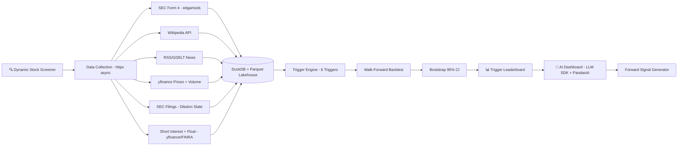

# 🚀 ATTENTION-FLOW CATALYST — Complete Project Scope v8.6

## AI-Powered Predictive Trigger Analysis for Small-Cap Stocks
## A Defensible Research System with Statistical Rigor

**Document Version:** 8.6 (Synced to roadmap v8.6 — added **GraphRAG / Financial Knowledge-Graph (Neo4j)** to §16 Stage 2 evolution: a hybrid retriever over SEC filings, plus 2 graph courses to §Courses. Also reconciles the prior version/filename drift — v8.5 added **T6 — Squeeze Context** §4.7 + `signalcore` short-interest primitives; both carried forward unchanged. Additive only.)  
**Last Updated:** June 16, 2026  
**Status:** ✅ APPROVED  
**Author:** Manuel Reyes  

---

## 📋 Table of Contents

1. [Executive Summary](#1-executive-summary)
2. [Research Question](#2-research-question)
3. [Stock Screening Criteria](#3-stock-screening-criteria)
4. [Trigger Framework](#4-trigger-framework)
5. [Backtest Methodology](#5-backtest-methodology) ⭐ NEW
6. [Data Integrity & Bias Controls](#6-data-integrity--bias-controls) ⭐ NEW
7. [Data Architecture: Lakehouse Design](#7-data-architecture-lakehouse-design) ⭐ ENHANCED
8. [Market Data Modes](#8-market-data-modes) ⭐ NEW
9. [Phase 1A Scope — Backtest Engine](#9-phase-1a-scope--backtest-engine-weeks-1-6)
10. [Phase 1B Scope — AI-Powered Dashboard](#10-phase-1b-scope--ai-powered-dashboard-weeks-7-10)
11. [AI Guardrails](#11-ai-guardrails) ⭐ NEW
12. [Tech Stack](#12-tech-stack)
13. [CI/CD Pipeline](#13-cicd-pipeline)
14. [Logging & Debugging](#14-logging--debugging) ⭐ NEW
15. [Project Structure](#15-project-structure)
16. [Project Evolution (5 Stages)](#16-project-evolution-5-stages)
17. [Success Metrics](#17-success-metrics)
18. [Risk Mitigation](#18-risk-mitigation)
19. [Timeline Summary](#19-timeline-summary)

---

## 1. Executive Summary

**Attention-Flow Catalyst** is a flagship project that evolves through all 5 stages of my career transition from Data Analyst to Senior LLM Engineer. It is designed as a **defensible research system**—not just a dashboard—with proper statistical methodology, bias controls, and reproducibility.

### What Makes This Project Different

| Dimension | Typical Tutorial Project | Attention-Flow Catalyst |
|-----------|-------------------------|-------------------------|
| **Data Selection** | Manual stock list | Dynamic screener with survivorship bias controls |
| **Backtest Method** | Naive "if signal, check return" | Walk-forward validation, de-clustering, confidence intervals |
| **Storage** | SQLite or CSV | Lakehouse (partitioned Parquet + DuckDB) |
| **API Calls** | Sequential requests | Async httpx (10-50x faster) |
| **AI Architecture** | Single provider, raw text | Provider-agnostic SDK (**Anthropic Claude primary**, Gemini/OpenAI fallback) |
| **AI Outputs** | Unstructured text responses | Pydantic-validated structured outputs |
| **AI Features** | Gimmicky chatbot | LLM SDK + PandasAI, SQL-first, guardrails & observability |
| **Triggers** | News + Volume only | SEC Form 4, Wiki, News, Volume, **Dilution state**, **Squeeze context (short interest + float)** |
| **Reproducibility** | None | Audit tables, pipeline run logs, version control |
| **CI/CD** | None | GitHub Actions on every PR |

### Core Capabilities

- **Statistical Rigor:** Walk-forward backtesting, bootstrap confidence intervals, multiple testing controls
- **Alternative Data:** SEC Form 4 insider filings, dilution/offering state (S-1, 424B5, 8-K), Wikipedia attention, news mentions, volume patterns
- **Bias Controls:** Survivorship bias handling via historical universe snapshots, corporate actions adjustment
- **Modern Data Stack:** DuckDB for analytics, Parquet lakehouse, httpx for async API calls
- **AI Integration:** Natural language queries via LLM SDK (**Anthropic Claude primary** — financial reasoning quality matters most for AFC's 0.9 faithfulness threshold) + PandasAI with guardrails and SQL transparency
- **Structured Outputs:** Pydantic-validated AI responses with type-safe schemas
- **AI Observability:** Token usage, cost tracking, latency monitoring, guardrail activation logs
- **Production Practices:** GitHub Actions CI, type hints, comprehensive testing, audit logging
- **Domain Expertise:** 6 years of trading knowledge codified into algorithms

---

## 2. Research Question

> **Primary Question:** Which trigger or combination of triggers best predicts +10% price moves within 3 trading days for small-cap stocks?

**Secondary Questions:**
1. Does sector strength context improve trigger hit rates?
2. Does index trend context (bullish vs bearish market) affect performance?
3. Do multi-trigger combinations outperform single triggers?
4. Which volume patterns precede significant moves?
5. Does post-dilution-close create higher probability setups?
6. Are results stable across train vs test periods (walk-forward)?
7. **Does a loaded short-squeeze context (high short-%-of-float + low float + high days-to-cover) lift the hit rate of catalysts T1–T5?** ⭐ NEW

**Hypothesis:** Combining multiple alternative data signals (insider buying + attention spike + volume accumulation + dilution-clear state) will produce higher hit rates than any single signal alone, and these results will be stable out-of-sample.

---

## 3. Stock Screening Criteria

The system dynamically screens for stocks meeting ALL criteria:

| Criterion | Requirement | Rationale |
|-----------|-------------|-----------|
| **Price** | < $5.00 | Bigger percentage move potential |
| **Exchange** | NYSE, NASDAQ, AMEX only | NO OTC/Pink Sheets — better data quality |
| **Float** | Small (bottom 30% of screened universe) | Limited supply = faster moves |
| **Sector** | Strong (top 3 sectors by 20-day performance) | Sector tailwinds increase probability |
| **Volume** | Minimum avg daily volume > 100K | Ensures liquidity for entry/exit |
| **Market Cap** | < $500M (micro/small cap) | Focus on overlooked opportunities |

**Output:** ~50 stocks refreshed weekly that meet all criteria

---

## 4. Trigger Framework

### 4.1 Overview

| ID | Trigger Name | Data Source | Signal Type |
|----|--------------|-------------|-------------|
| **T1** | SEC Form 4 Insider Buy | edgartools | Smart Money |
| **T2** | Wikipedia Attention Spike | Wikipedia API | Public Attention |
| **T3** | News Mention Spike | RSS/GDELT | Media Coverage |
| **T4** | Volume Accumulation (5 sub-signals) | yfinance | Institutional Activity |
| **T5** | Dilution/Offering State | edgartools | Capital Structure ⭐ NEW |
| **T6** | Squeeze Context (short interest + float) | yfinance / FINRA | Supply Pressure ⭐ NEW |

---

### 4.2 T1: SEC Form 4 Insider Buy

```yaml
t1_insider_buy:
  transaction_types:
    - P: "Open market purchase"
    - A: "Grant/Award (if acquisition)"
  minimum_value: $10,000
  insider_types:
    - CEO, CFO, COO, President
    - Director
    - 10% Owner
  lookback_window: 30 days
  signal_fires_when: "Any qualifying purchase detected"
```

---

### 4.3 T2: Wikipedia Attention Spike

```yaml
t2_wiki_attention:
  baseline_period: 30 days rolling average
  spike_threshold: 2.0 standard deviations above baseline
  minimum_daily_views: 100  # filter noise
  lookback_window: 7 days
  signal_fires_when: "Daily views > baseline + (2 × std_dev)"
```

---

### 4.4 T3: News Mention Spike

```yaml
t3_news_spike:
  baseline_period: 14 days rolling average
  spike_threshold: 2.0 standard deviations above baseline
  minimum_mentions: 3 per day  # filter noise
  sentiment_filter: null  # Phase 1 = volume only
  lookback_window: 7 days
  signal_fires_when: "Daily mentions > baseline + (2 × std_dev)"
```

---

### 4.5 T4: Volume Accumulation (5 Sub-Signals)

| ID | Signal | Calculation | Threshold |
|----|--------|-------------|-----------|
| **T4a** | RVOL | Today's volume / 20-day avg | ≥ 1.5 |
| **T4b** | Accumulation Score | (Close-Low)/(High-Low) × Volume | Rising over 5 days |
| **T4c** | OBV Breakout | Cumulative volume | 20-day high |
| **T4d** | Quiet Accumulation | Price flat + OBV rising | Price < 2% / 10 days, OBV up |
| **T4e** | Volume Dry-Up | Volume < 50% avg for 3+ days | Tight range < 3% |

---

### 4.6 T5: Dilution / Offering State (NEW)

**What It Detects:** Capital structure changes that affect supply/demand dynamics.

**Forms Tracked:**
- **S-1, S-3:** Shelf registration filed
- **424B5:** Prospectus supplement — offering PRICED
- **8-K:** Material event — offering CLOSED
- **EFFECT:** Registration statement effective

**State Machine:**
```yaml
t5_state_machine:
  states:
    CLEAR: "No recent dilution (> 90 days since last event)"
    OVERHANG: "Shelf registration filed, no active deal"
    ACTIVE_DEAL: "Offering priced, shares being sold"
    CLOSED: "Offering completed within 30 days"
    
  transitions:
    CLEAR → OVERHANG: "S-3/S-1 filed"
    OVERHANG → ACTIVE_DEAL: "424B5 filed"
    ACTIVE_DEAL → CLOSED: "8-K announcing completion"
    CLOSED → CLEAR: "30 days elapsed"
```

**Combination Hypotheses:**
- `T5_CLOSED + T1 (insider buy)` = Strong bullish conviction
- `T5_CLOSED + T2 (attention) + T4 (volume)` = Post-dilution reversal
- `T5_OVERHANG + ANY trigger` = Reduce expected hit rate

---

### 4.7 T6: Squeeze Context (NEW)

**What It Detects:** a *loaded* short-squeeze state — a large block of obligated future buying (short interest) trapped against a small tradable supply (float). Conceptual reference: `Short_Squeeze_Context_Reference.md`.

> **Role — read this first.** T6 is **fuel, not a spark.** Short interest is a reservoir of forced future buying; it does *nothing* until a catalyst ignites it. So T6's **primary** use is as a **context filter** (the 5th context in §4.8), answering "does a loaded squeeze state lift the hit rate of catalysts T1–T5?" — **not** as a standalone leg blown out across the full trigger-combination matrix. Treating fuel as a catalyst would be mechanically wrong and would explode the multiple-testing surface (63 combos × contexts) for setups that are already rare.

**Metrics** (computed from `signalcore` primitives — short interest + float; see Boundary Spec):

| Metric | Formula | Covers |
|---|---|---|
| `pct_float_short` | `shares_short / float` | Supply pressure — the fuel |
| `days_to_cover` (≡ short interest ratio) | `shares_short / avg_daily_volume` | Time-to-exit — congested cover |
| `float_turnover` | `daily_volume / float` | Velocity — real-time ignition tell |

```yaml
t6_squeeze_context:
  role: "CONTEXT (loaded state). Fuel, not spark. Primary use = 5th context filter (§4.8)."
  data_source:
    short_interest: "FINRA bi-monthly (via yfinance sharesShort) — LAGGED ~2 weeks"
    float: "yfinance floatShares (re-derive on dilution events; see T5)"
    volume / avg_daily_volume: "yfinance daily / 20-day"
  loaded_state_when:                 # the CONTEXT (potential) — a-priori, to be tuned in-sample only
    pct_float_short: ">= 0.20"       # test 0.15–0.30
    days_to_cover:   ">= 5"          # test 3–10
    float:           "bottom 30% of universe (already screened in §3)"
  ignition_tell:                     # optional live confirmation
    float_turnover_spike: ">= 2.0x its 20-day median"
  fires_when: "loaded_state AND paired with a catalyst (T1–T5) — NEVER standalone"
  squeeze_combination_hypotheses:
    - "T6_loaded + T1 (insider buy)   = smart money buying into trapped shorts (highest conviction)"
    - "T6_loaded + T2/T3 (attention)  = retail-driven ignition"
    - "T6_loaded + T4 (RVOL/accum)    = squeeze likely already underway"
    - "T6_loaded + T5_CLOSED          = post-dilution squeeze (float fixed, shorts offside)"
  caveats:
    - "Short interest is bi-monthly / lagged ~2 weeks — a real weakness vs the 3-day horizon; measure it, don't assume it away."
    - "High short interest is often justified (deteriorating fundamentals) — fuel is NOT bullish alone."
    - "Squeeze setups are RARE — the 30-signal minimum (§5.5) will exclude many squeeze-context scenarios; report honest n."
    - "Float is not static — re-derive from the T5 dilution state on offerings/lockups; do not cache."
```

---

### 4.8 Combination Testing Matrix

**Individual Triggers (5):** T1, T2, T3, T4, T5_CLOSED

**2-Trigger Combinations (10)**
**3-Trigger Combinations (10)**
**4-Trigger Combinations (5)**
**5-Trigger Combination (1)**

**With Context Filters (×5):**
- No filter
- Sector strength filter
- Index trend filter
- Dilution state filter
- **Squeeze-context filter (T6 loaded state)** ⭐ NEW

**Total Potential Scenarios:** 31 combinations × 5 contexts = **~155 scenarios**

> **Why T6 is a context, not a 6th combinatorial trigger:** squeeze fuel is not a catalyst, so it is tested as an overlay that either lifts or doesn't lift the existing catalysts — not as another standalone leg. This keeps the scenario count at 155 rather than exploding to 63 combos × 5 = 315, which matters under the §5.5 multiple-testing controls and the 30-signal floor (squeeze setups are rare).

---

## 5. Backtest Methodology

> **This section defines the rules that make results trustworthy.**

### 5.1 Signal Anchor Definition

```yaml
signal_anchor:
  rule: "Signal confirmed at market close"
  measurement_start: "Next trading day open"
  measurement_period: "3 trading days (close-to-close)"
  
  example:
    signal_date: "2025-01-15 (Wednesday close)"
    entry_price: "2025-01-16 open (Thursday)"
    exit_price: "2025-01-21 close (Tuesday)"
    return: "(exit - entry) / entry"
```

### 5.2 De-Clustering Rule

```yaml
de_clustering:
  rule: "One active signal per ticker per 5 trading days"
  
  example:
    day_1: "ABCD fires T1 → COUNTED"
    day_2: "ABCD fires T1 → IGNORED (within 5-day window)"
    day_3: "ABCD fires T4 → COUNTED (different trigger type)"
    day_6: "ABCD fires T1 → COUNTED (new window)"
    
  rationale: "Prevents inflated hit rates from consecutive signals"
```

### 5.3 Transaction Cost Model

```yaml
transaction_costs:
  slippage_bps: 25      # 0.25% for small-cap entry
  spread_proxy_bps: 50  # typical bid-ask spread
  commission: 0         # most brokers commission-free
  
  total_round_trip: 150 bps (1.5%)
  
  hit_threshold:
    gross: "+10% raw return"
    net: "+11.5% raw return (to net +10% after costs)"
```

### 5.4 Walk-Forward Validation

```yaml
walk_forward:
  training_period: "Year 1 - Year 2 (24 months)"
  testing_period: "Year 3 (12 months)"
  
  rules:
    - "Tune thresholds on training period ONLY"
    - "Leaderboard rankings based on TEST period ONLY"
    - "NO re-tuning after seeing test results"
    
  process:
    1: "Run backtest on training period"
    2: "Identify top 10 trigger combinations"
    3: "Run SAME combinations on test period (no changes)"
    4: "Report test period metrics as final"
```

### 5.5 Multiple Testing Controls

```yaml
multiple_testing_controls:
  minimum_signal_count:
    threshold: 30 signals minimum per scenario
    action: "Exclude scenarios with < 30 signals"
    
  confidence_intervals:
    method: "Bootstrap 95% CI on hit rate"
    iterations: 1000
    reporting: "Hit rate [CI_low - CI_high]"
    
  stability_check:
    method: "Compare train vs test rankings"
    metric: "Spearman rank correlation"
    threshold: "> 0.5 correlation = stable"
```

---

## 6. Data Integrity & Bias Controls

### 6.1 Survivorship Bias Policy

```yaml
survivorship_bias:
  problem: "Screening TODAY's stocks and backtesting 3 years = bias"
  
  solution: "Historical universe snapshots"
  
  implementation:
    frequency: "Weekly (every Monday)"
    storage: "data/processed/universes/universe_{YYYY}_{WW}.parquet"
    
    backtest_rule: |
      For each historical signal date, use the universe snapshot
      that was active at that time. A stock must have been in
      the universe BEFORE the signal to be included.
```

### 6.2 Corporate Actions Handling

```yaml
corporate_actions:
  splits:
    handling: "Use adjusted close for all return calculations"
    
  reverse_splits:
    handling: "Flag, use adjusted prices, exclude 5 days post-split"
    
  ticker_changes:
    storage: "ticker_history table with old → new mapping"
    
  delistings:
    policy: "Include in backtest up to delist date"
    bankruptcy: "Return = -100% (total loss)"
```

### 6.3 Calendar & Timezone

```yaml
calendar:
  timezone: "US/Eastern"
  source: "pandas_market_calendars (NYSE)"
  
  data_availability_rule: |
    Signal on date D can only use data available by market close on D.
```

---

## 7. Data Architecture: Lakehouse Design

### 7.1 Parquet Partitioning

```yaml
parquet_structure:
  raw_prices: "data/raw/prices/{source}/year={YYYY}/month={MM}/{ticker}.parquet"
  raw_events: "data/raw/events/{source}/year={YYYY}/month={MM}/events.parquet"
  processed_triggers: "data/processed/triggers/year={YYYY}/triggers.parquet"
  processed_universes: "data/processed/universes/universe_{YYYY}_{WW}.parquet"
```

### 7.2 Persistent DuckDB Schema

```yaml
duckdb_file: "data/db/afc.duckdb"

dimension_tables:
  - dim_company: "ticker, name, sector, exchange, dates"
  - dim_calendar: "date, is_trading_day, week_id, month_id"
  - dim_trigger_type: "trigger_id, name, category, description"

fact_tables:
  - fact_signals: "signal_id, ticker, date, trigger, return, hit"
  - fact_backtest_results: "scenario, period, signals, hit_rate, CI"

audit_tables:
  - audit_pipeline_runs: "run_id, pipeline, status, rows, timestamp"
  - audit_data_quality: "issue_id, table, check, passed, details"
```

### 7.3 DuckDB Views (Query Parquet)

```sql
CREATE VIEW v_prices AS
SELECT * FROM read_parquet('data/raw/prices/**/*.parquet');

CREATE VIEW v_active_signals AS
SELECT * FROM fact_signals 
WHERE signal_date >= CURRENT_DATE - 7;

CREATE VIEW v_leaderboard AS
SELECT trigger_combination, hit_rate_net, hit_rate_ci_low, hit_rate_ci_high
FROM fact_backtest_results
WHERE period = 'test' AND signal_count >= 30
ORDER BY hit_rate_net DESC;
```

---

## 8. Market Data Modes

### 8.1 Mode A: Intraday (Future)

```yaml
mode_a_intraday:
  providers: "Polygon.io ($29-199/mo), Alpaca ($0-99/mo)"
  resolution: "1-minute bars"
  features: "True VWAP, intraday volume profile, T4f VWAP Hold"
  when: "Stage 2+ when budget allows"
```

### 8.2 Mode B: Daily Only (Phase 1A)

```yaml
mode_b_daily:
  provider: "yfinance (FREE)"
  resolution: "Daily OHLCV"
  
  features_enabled:
    - All T1 (insider) ✅
    - All T2 (wiki) ✅
    - All T3 (news) ✅
    - T4a-e (all volume signals) ✅
    - All T5 (dilution) ✅
    - T6 (squeeze context) ✅  # short interest is bi-monthly anyway → daily mode sufficient (lag noted)
    
  features_disabled:
    - True VWAP (no intraday)
    - T4f VWAP Hold
```

### 8.3 Phase 1A Decision

```yaml
phase_1a_decision:
  selected: "Mode B (daily-only)"
  rationale:
    - "FREE — no budget required"
    - "Sufficient for validating core hypothesis"
    - "All primary triggers work with daily data"
```

---

## 9. Phase 1A Scope — Backtest Engine (Weeks 1-6)

### 9.1 Deliverables

| # | Deliverable | Acceptance Criteria |
|---|-------------|---------------------|
| 1 | Project Setup | CI green, pre-commit working |
| 2 | Stock Screener | ~50 stocks, proper filters |
| 3 | Universe Snapshots | Weekly Parquet files |
| 4 | Sector Strength | 11 ETFs tracked |
| 5 | Async Collectors | httpx parallel calls |
| 6 | Price Pipeline | 3+ years, adjusted prices |
| 7 | T1-T6 Detectors | All triggers working |
| 8 | DuckDB Schema | All tables created |
| 9 | Backtest Engine | Walk-forward, de-clustering |
| 10 | Bootstrap CI | 95% CI on all hit rates |
| 11 | Leaderboard | Test period metrics |
| 12 | Signal Generator | Daily active signals |
| 13 | Data Quality | Automated checks |
| 14 | Documentation | README, .cursor/rules/ |
| 15 | Test Suite | >80% coverage |

### 9.2 Week-by-Week

| Week | Focus |
|------|-------|
| 1 | Setup, CI, screener, universe builder |
| 2 | Collectors (httpx), Parquet, corporate actions |
| 3 | T1-T6 triggers, state machine |
| 4 | DuckDB schema, backtest core, de-clustering |
| 5 | Walk-forward, bootstrap CI, combinations |
| 6 | Signal generator, quality checks, docs |

---

## 10. Phase 1B Scope — AI-Powered Dashboard (Weeks 7-10)

### 10.1 Deliverables

| # | Deliverable | Acceptance Criteria |
|---|-------------|---------------------|
| 1 | Streamlit Shell | Multi-page, responsive |
| 2 | Home Page | Quick stats, AI insights |
| 3 | Leaderboard Page | Sortable, with CI |
| 4 | Screener Page | Current universe |
| 5 | Active Signals | Today's watchlist |
| 6 | Backtest Explorer | Historical signals |
| 7 | LLM SDK Integration | Provider-agnostic AI layer (**Anthropic Claude primary**, Gemini fallback) |
| 8 | Pydantic Response Models | Structured outputs for all AI responses |
| 9 | PandasAI | Supplementary chat + SQL transparency |
| 10 | AI Guardrails | Read-only, governance as code, disclaimers |
| 11 | AI Observability | Token/cost/latency tracking per query |
| 12 | Deployment | Streamlit Cloud live |
| 13 | Demo Video | 60 seconds |

### 10.2 Dashboard Wireframe

```
┌─────────────────────────────────────────────────────────────┐
│  🚀 ATTENTION-FLOW CATALYST                                 │
├─────────────────────────────────────────────────────────────┤
│  📊 Quick Stats                                             │
│  │ 50 Stocks │ 12 Signals │ 62.5% Hit │ T1+T4+T5_CLOSED │  │
├─────────────────────────────────────────────────────────────┤
│  🤖 AI Insights (LLM SDK — Anthropic Claude primary)        │
│  "T1+T4+T5_CLOSED shows 62.5% hit rate [55-70% CI]..."     │
│  📝 Query: SELECT ... FROM v_leaderboard LIMIT 5            │
│  📊 Tokens: 342 input / 128 output | Cost: $0.0003          │
│  ⚠️ AI insights are explanatory, not financial advice.     │
├─────────────────────────────────────────────────────────────┤
│  💬 Ask a Question: [________________________] [Ask]        │
└─────────────────────────────────────────────────────────────┘
```

---

## 11. AI Guardrails

### 11.1 Access Control

```yaml
ai_access:
  mode: "Read-only"
  allowed: "SELECT, aggregations, joins"
  prohibited: "INSERT, UPDATE, DELETE, file access"
```

### 11.2 Governance as Code

```python
# src/ai/guardrails.py — Testable guardrail logic
class AIGuardrail:
    """Validates AI queries before execution.
    
    Unlike config-only guardrails, this approach is testable
    with pytest and enforced at runtime.
    """
    def validate_query(self, query: str) -> GuardrailResult:
        """Check query against security rules."""
        # Check for modification attempts (INSERT, UPDATE, DELETE)
        # Check against blocked tables (v_prices, audit_*)
        # Check row scan limits (max 10,000)
        # Check token budget (4000 max)
        # Return validated or rejected with reason
        
    def validate_table_access(self, sql: str) -> bool:
        """Ensure query only touches allowed tables."""
        # Parse SQL for table references
        # Compare against allowed_tables whitelist
        
    def sanitize_response(self, response: BaseModel) -> BaseModel:
        """Ensure AI response contains no inappropriate content."""
        # Verify no financial advice language
        # Confirm disclaimer attached
        # Log guardrail activation if triggered
```

### 11.3 Table Restrictions

```yaml
allowed_tables:
  - v_leaderboard
  - v_active_signals
  - dim_company
  - fact_backtest_results

blocked_tables:
  - v_prices (too large)
  - audit_* (internal)

row_limits:
  max_scan: 10000
  max_return: 1000
```

### 11.4 Transparency

```yaml
transparency:
  show_sql: "Every response shows the SQL query used"
  show_source: "Display source table and row count"
  show_limitations: "Acknowledge when data insufficient"
```

### 11.5 Cost Controls

```yaml
cost_controls:
  caching: "1 hour TTL for identical queries"
  token_limits: "4000 total tokens per request"
  rate_limits: "100 queries/day"
```

### 11.6 Disclaimers

```yaml
disclaimers:
  text: "⚠️ AI insights are explanatory, not financial advice."
  location: "Footer of every AI response"
```

---

## 12. Tech Stack

### Phase 1A: Backtest Engine

| Category | Technology |
|----------|------------|
| Language | Python 3.11+ |
| Storage | Parquet (partitioned) |
| Query | DuckDB |
| HTTP | httpx (async) |
| SEC Data | edgartools |
| Market Data | yfinance |
| Wiki | Wikipedia API |
| News | feedparser, GDELT |
| Statistics | scipy, numpy |
| **Logging** | **logging (stdlib) + python-json-logger** |
| Testing | pytest, pytest-asyncio |
| Linting | Ruff, mypy |
| CI/CD | GitHub Actions |

### Phase 1B: Dashboard

| Category | Technology |
|----------|------------|
| Web | Streamlit |
| Charts | Plotly |
| **AI (Primary)** | **LLM SDK (Anthropic Claude primary, Gemini/OpenAI fallback) — prompt caching reduces costs ~90% on repeated SEC filing context** |
| **AI (Supplementary)** | **PandasAI (natural language data querying)** |
| **Structured Outputs** | **Pydantic v2 (response validation)** |
| **AI Observability** | **Python logging + token/cost tracking** |
| Hosting | Streamlit Cloud (FREE) |
| **AI Evaluation** | **DeepEval (answer relevancy, faithfulness > 0.9 for financial data accuracy)** |
| **Containerization** | **Docker (Dockerfile for app + DuckDB deployment)** |

---

## 13. CI/CD Pipeline

### GitHub Actions

```yaml
# .github/workflows/ci.yml
on: [push, pull_request]
jobs:
  test:
    steps:
      - Checkout
      - Setup Python 3.11/3.12
      - Install dependencies
      - Ruff lint
      - mypy type check
      - pytest with coverage
      - Upload to Codecov
```

### Pre-commit

```yaml
# .pre-commit-config.yaml
- ruff (lint + format)
- trailing-whitespace
- end-of-file-fixer
- check-yaml
- mypy
```

---

## 14. Logging & Debugging

### 14.1 Logging Directory Structure

```
logs/
├── app/                          # Streamlit dashboard logs
│   ├── app.log                   # Current log
│   └── app.log.{date}            # Rotated logs
├── pipeline/                     # Data pipeline logs
│   ├── pipeline.log              # Current log
│   ├── pipeline.log.{date}       # Rotated logs
│   └── runs/                     # Per-run detailed logs
│       ├── run_2026-01-29_083000.log
│       └── run_2026-01-29_120000.log
├── collectors/                   # API collector logs
│   ├── collectors.log
│   └── errors/                   # Error-specific logs
│       ├── sec_errors.log
│       ├── wiki_errors.log
│       └── news_errors.log
├── backtest/                     # Backtest engine logs
│   ├── backtest.log
│   └── runs/
│       └── backtest_{scenario_id}.log
├── ai/                           # ⭐ AI observability logs
│   ├── queries.log               # LLM queries, tokens, cost, latency
│   └── guardrails.log            # Guardrail activations with reason
└── debug/                        # Debug logs (verbose, gitignored)
    └── debug.log
```

### 14.2 Logging Configuration

**config/logging.yaml**
```yaml
version: 1
disable_existing_loggers: false

formatters:
  standard:
    format: "%(asctime)s | %(levelname)-8s | %(name)s | %(message)s"
    datefmt: "%Y-%m-%d %H:%M:%S"
  
  detailed:
    format: "%(asctime)s | %(levelname)-8s | %(name)s | %(funcName)s:%(lineno)d | %(message)s"
    datefmt: "%Y-%m-%d %H:%M:%S"
  
  json:
    class: pythonjsonlogger.jsonlogger.JsonFormatter
    format: "%(asctime)s %(levelname)s %(name)s %(funcName)s %(lineno)d %(message)s"

handlers:
  console:
    class: logging.StreamHandler
    level: INFO
    formatter: standard
    stream: ext://sys.stdout
  
  file_pipeline:
    class: logging.handlers.TimedRotatingFileHandler
    level: INFO
    formatter: detailed
    filename: logs/pipeline/pipeline.log
    when: midnight
    interval: 1
    backupCount: 30  # Keep 30 days
    encoding: utf-8
  
  file_collectors:
    class: logging.handlers.TimedRotatingFileHandler
    level: INFO
    formatter: detailed
    filename: logs/collectors/collectors.log
    when: midnight
    interval: 1
    backupCount: 30
    encoding: utf-8
  
  file_backtest:
    class: logging.handlers.TimedRotatingFileHandler
    level: INFO
    formatter: detailed
    filename: logs/backtest/backtest.log
    when: midnight
    interval: 1
    backupCount: 30
    encoding: utf-8
  
  file_app:
    class: logging.handlers.TimedRotatingFileHandler
    level: INFO
    formatter: detailed
    filename: logs/app/app.log
    when: midnight
    interval: 1
    backupCount: 14  # Keep 14 days for app
    encoding: utf-8
  
  file_ai:
    class: logging.handlers.TimedRotatingFileHandler
    level: INFO
    formatter: json  # JSON format for AI observability (structured parsing)
    filename: logs/ai/queries.log
    when: midnight
    interval: 1
    backupCount: 30
    encoding: utf-8
  
  file_ai_guardrails:
    class: logging.handlers.RotatingFileHandler
    level: WARNING
    formatter: detailed
    filename: logs/ai/guardrails.log
    maxBytes: 10485760  # 10MB
    backupCount: 5
    encoding: utf-8
  
  file_errors:
    class: logging.handlers.RotatingFileHandler
    level: ERROR
    formatter: detailed
    filename: logs/errors.log
    maxBytes: 10485760  # 10MB
    backupCount: 5
    encoding: utf-8
  
  file_debug:
    class: logging.handlers.RotatingFileHandler
    level: DEBUG
    formatter: detailed
    filename: logs/debug/debug.log
    maxBytes: 52428800  # 50MB
    backupCount: 3
    encoding: utf-8

loggers:
  # Root logger
  afc:
    level: INFO
    handlers: [console, file_pipeline, file_errors]
    propagate: false
  
  # Module-specific loggers
  afc.screener:
    level: INFO
    handlers: [console, file_pipeline]
    propagate: false
  
  afc.collectors:
    level: INFO
    handlers: [console, file_collectors, file_errors]
    propagate: false
  
  afc.collectors.sec:
    level: INFO
    handlers: [file_collectors]
    propagate: true
  
  afc.collectors.wiki:
    level: INFO
    handlers: [file_collectors]
    propagate: true
  
  afc.triggers:
    level: INFO
    handlers: [console, file_pipeline]
    propagate: false
  
  afc.backtest:
    level: INFO
    handlers: [console, file_backtest]
    propagate: false
  
  afc.database:
    level: INFO
    handlers: [console, file_pipeline]
    propagate: false
  
  afc.app:
    level: INFO
    handlers: [console, file_app]
    propagate: false
  
  # AI observability loggers
  afc.ai:
    level: INFO
    handlers: [console, file_ai, file_errors]
    propagate: false
  
  afc.ai.guardrails:
    level: WARNING
    handlers: [file_ai_guardrails, file_errors]
    propagate: true

root:
  level: WARNING
  handlers: [console, file_errors]
```

### 14.3 Logging Utility Module

**src/utils/logging.py**
```python
import logging
import logging.config
from pathlib import Path
from datetime import datetime
from typing import Optional
import yaml

def setup_logging(
    config_path: str = "config/logging.yaml",
    default_level: int = logging.INFO,
    env_key: str = "LOG_CFG"
) -> None:
    """
    Setup logging configuration.
    
    Args:
        config_path: Path to logging config YAML
        default_level: Default logging level if config not found
        env_key: Environment variable to override config path
    """
    import os
    
    # Create logs directories
    log_dirs = [
        "logs/app",
        "logs/pipeline/runs",
        "logs/collectors/errors",
        "logs/backtest/runs",
        "logs/debug"
    ]
    for log_dir in log_dirs:
        Path(log_dir).mkdir(parents=True, exist_ok=True)
    
    # Load config
    path = os.getenv(env_key, config_path)
    if Path(path).exists():
        with open(path, "r") as f:
            config = yaml.safe_load(f)
        logging.config.dictConfig(config)
    else:
        logging.basicConfig(level=default_level)
        logging.warning(f"Logging config not found at {path}, using defaults")

def get_logger(name: str) -> logging.Logger:
    """
    Get a logger with the afc namespace.
    
    Args:
        name: Logger name (will be prefixed with 'afc.')
        
    Returns:
        Configured logger instance
        
    Example:
        logger = get_logger("collectors.sec")
        logger.info("Fetching Form 4 filings...")
    """
    if not name.startswith("afc."):
        name = f"afc.{name}"
    return logging.getLogger(name)

def get_run_logger(
    run_type: str,
    run_id: Optional[str] = None
) -> logging.Logger:
    """
    Get a logger for a specific pipeline run with dedicated file.
    
    Args:
        run_type: Type of run ('pipeline', 'backtest', 'collector')
        run_id: Optional run identifier (defaults to timestamp)
        
    Returns:
        Logger with file handler for this specific run
    """
    if run_id is None:
        run_id = datetime.now().strftime("%Y-%m-%d_%H%M%S")
    
    logger_name = f"afc.{run_type}.run_{run_id}"
    logger = logging.getLogger(logger_name)
    
    # Add run-specific file handler
    log_path = Path(f"logs/{run_type}/runs/run_{run_id}.log")
    log_path.parent.mkdir(parents=True, exist_ok=True)
    
    handler = logging.FileHandler(log_path, encoding="utf-8")
    handler.setLevel(logging.DEBUG)
    handler.setFormatter(logging.Formatter(
        "%(asctime)s | %(levelname)-8s | %(name)s | %(funcName)s:%(lineno)d | %(message)s"
    ))
    logger.addHandler(handler)
    
    return logger

class LogContext:
    """Context manager for logging operation blocks."""
    
    def __init__(
        self,
        logger: logging.Logger,
        operation: str,
        level: int = logging.INFO
    ):
        self.logger = logger
        self.operation = operation
        self.level = level
        self.start_time = None
    
    def __enter__(self):
        self.start_time = datetime.now()
        self.logger.log(self.level, f"Starting: {self.operation}")
        return self
    
    def __exit__(self, exc_type, exc_val, exc_tb):
        duration = (datetime.now() - self.start_time).total_seconds()
        if exc_type is None:
            self.logger.log(
                self.level,
                f"Completed: {self.operation} ({duration:.2f}s)"
            )
        else:
            self.logger.error(
                f"Failed: {self.operation} ({duration:.2f}s) - {exc_type.__name__}: {exc_val}"
            )
        return False  # Don't suppress exceptions
```

### 14.4 Usage Examples

```python
# Basic usage
from src.utils.logging import setup_logging, get_logger, LogContext

# Initialize logging (call once at startup)
setup_logging()

# Get module-specific logger
logger = get_logger("collectors.sec")

# Standard logging
logger.info("Starting SEC Form 4 collection")
logger.debug(f"Processing ticker: {ticker}")
logger.warning(f"Rate limit approaching: {remaining} requests left")
logger.error(f"Failed to fetch filing: {error}", exc_info=True)

# Context manager for operations
with LogContext(logger, f"Collecting {len(tickers)} tickers"):
    for ticker in tickers:
        collect_insider_filings(ticker)

# Pipeline run with dedicated log file
from src.utils.logging import get_run_logger

run_logger = get_run_logger("backtest", run_id="scenario_T1_T4")
run_logger.info("Starting backtest for T1+T4 combination")
```

### 14.5 Log Levels Guide

| Level | When to Use | Example |
|-------|-------------|---------|
| **DEBUG** | Detailed diagnostic info | `logger.debug(f"Query returned {len(rows)} rows")` |
| **INFO** | General operational events | `logger.info("Backtest completed successfully")` |
| **WARNING** | Something unexpected but handled | `logger.warning("Missing data for AAPL, using interpolation")` |
| **ERROR** | Error occurred, operation failed | `logger.error("API request failed", exc_info=True)` |
| **CRITICAL** | Severe error, program may crash | `logger.critical("Database connection lost")` |

### 14.6 Error Tracking Pattern

```python
# Collector error tracking with context
async def collect_wiki_pageviews(ticker: str) -> Optional[pd.DataFrame]:
    logger = get_logger("collectors.wiki")
    
    try:
        logger.debug(f"Fetching pageviews for {ticker}")
        async with httpx.AsyncClient() as client:
            response = await client.get(url)
            response.raise_for_status()
            
        logger.info(f"Successfully collected {ticker}: {len(data)} days")
        return pd.DataFrame(data)
        
    except httpx.HTTPStatusError as e:
        logger.error(
            f"HTTP error for {ticker}: {e.response.status_code}",
            extra={"ticker": ticker, "status": e.response.status_code}
        )
        return None
        
    except httpx.RequestError as e:
        logger.error(
            f"Request failed for {ticker}: {str(e)}",
            extra={"ticker": ticker, "error_type": type(e).__name__}
        )
        return None
        
    except Exception as e:
        logger.exception(f"Unexpected error for {ticker}")  # Includes traceback
        return None
```

### 14.7 Gitignore for Logs

```gitignore
# Logs
logs/
*.log

# Keep directory structure
!logs/.gitkeep
!logs/*/
!logs/*/.gitkeep
```

---

## 15. Project Structure

```
attention-flow-catalyst/
├── .cursor/
│   ├── rules/                    # Production standards (version-controlled)
│   │   ├── git-workflow.mdc      # alwaysApply: true — branch, commit, PR conventions
│   │   ├── learning-mode.mdc     # alwaysApply: true — learning patterns, skill progression
│   │   ├── python-production-standards.mdc  # alwaysApply: true — code style, types, testing
│   │   ├── streamlit-patterns.mdc    # Auto-attached: app/**/*.py
│   │   ├── ai-sdk-patterns.mdc       # Auto-attached: src/ai/**/*.py
│   │   └── evaluation.mdc           # Auto-attached: tests/test_eval.py
│   ├── commands/                 # Repeatable agent workflows (/command-name)
│   │   ├── draft-issue.md        # /draft-issue <goal>
│   │   ├── task-brief.md         # /task-brief <issue#>
│   │   ├── pr-prep.md            # /pr-prep
│   │   ├── review.md             # /review
│   │   ├── test.md               # /test
│   │   ├── eval.md               # /eval
│   │   └── commit-msg.md         # /commit-msg
│   ├── hooks/                    # Auto-run scripts
│   │   └── format.sh             # Auto-format (black + ruff) after agent edits
│   ├── hooks.json                # Hook configuration
│   └── plans/                    # Saved task briefs per Issue
│       └── issue-XX-task-brief.md
├── .cursorignore                 # Excludes data/logs/venv from Cursor indexing
├── .github/
│   ├── templates/                # Production workflow templates
│   │   ├── issue_template.md     # GitHub Issue format
│   │   ├── project_labels.md     # Approved labels + definitions
│   │   ├── pull_request_template.md  # PR body format
│   │   └── cursor_task_brief.md  # Agent execution contract
│   └── workflows/ci.yml
├── config/
│   ├── thresholds.yaml
│   └── logging.yaml              # ⭐ Logging configuration
├── data/
│   ├── raw/prices/, events/
│   ├── processed/triggers/, universes/
│   ├── db/afc.duckdb
│   └── outputs/
├── logs/                         # ⭐ Logging directory
│   ├── app/                      # Dashboard logs
│   ├── pipeline/                 # Pipeline logs
│   │   └── runs/                 # Per-run logs
│   ├── collectors/               # API collector logs
│   │   └── errors/               # Error-specific logs
│   ├── backtest/                 # Backtest logs
│   │   └── runs/                 # Per-scenario logs
│   ├── ai/                       # ⭐ AI observability logs
│   │   ├── queries.log           # LLM queries, tokens, cost, latency
│   │   └── guardrails.log        # Guardrail activations
│   ├── evaluation/               # ⭐ DeepEval evaluation results
│   ├── debug/                    # Verbose debug logs
│   └── errors.log                # Aggregated errors
├── src/
│   ├── __init__.py
│   ├── py.typed                  # PEP 561 — type hint support marker
│   ├── screener/
│   ├── collectors/
│   ├── triggers/
│   ├── backtest/
│   ├── signals/
│   ├── database/
│   ├── ai/                       # ⭐ AI integration layer (2026 patterns)
│   │   ├── __init__.py
│   │   ├── provider.py           # Provider-agnostic LLM abstraction
│   │   ├── schemas.py            # Pydantic response models (structured outputs)
│   │   ├── guardrails.py         # Governance as code (testable)
│   │   └── observability.py      # Token/cost/latency tracking
│   └── utils/
│       ├── __init__.py
│       ├── config.py
│       ├── logging.py            # ⭐ Logging utilities
│       ├── calendar.py
│       └── async_utils.py
├── app/
│   ├── pages/
│   ├── components/
│   └── utils/
├── tests/
│   ├── conftest.py               # Shared fixtures, mock APIs, test DuckDB, sample data
│   ├── ...
│   ├── test_ai_guardrails.py     # ⭐ AI guardrails unit tests
│   ├── test_eval.py              # ⭐ DeepEval AI quality evaluation tests
│   └── eval_dataset.json         # ⭐ 30+ analytics query-response pairs for evaluation
├── notebooks/
├── scripts/
├── Dockerfile                    # Container definition
├── .dockerignore                 # Excludes .git, logs, data/raw, tests, notebooks from image
├── .env.example                  # Required environment variables template
├── .gitignore
├── CONTRIBUTING.md               # Branch naming, commit style, PR process
├── LICENSE                       # MIT License
├── Makefile                      # make test, make lint, make eval, make docker-build
├── pyproject.toml                # Project metadata, dependencies, tool config (PEP 621)
└── README.md
```

---

## 16. Project Evolution (5 Stages)

| Stage | Role | Enhancements |
|-------|------|--------------|
| 1 | Data Analyst | Backtest engine + AI dashboard |
| 2 | Data Engineer | AWS S3, Airflow, 500+ tickers. 🆕 **Financial Knowledge Graph + Vector DB (GraphRAG capstone):** ingest SEC filings (PDFs) → extract entities into a **Neo4j knowledge graph** (companies, filings, officers/insiders, holdings, dates → typed relationships) + a **vector index** (Pinecone/Qdrant) for semantic breadth, served via a **hybrid retriever** for multi-hop, explainable reasoning. Makes the "knowledge graph" real (not just SQL tables) and directly targets multi-hop hallucination — reinforcing the 0.9 faithfulness standard. Honest caveat: vector stays the backbone (~80%); the graph is weeks of ontology work added for relationship reasoning, not trend. |
| 3 | ML Engineer | XGBoost, LSTM, MLflow |
| 4 | LLM Specialist | RAG + **Multi-agent system** implementing Anthropic's "Building Effective Agents" patterns: **orchestrator-workers** (Researcher routes to specialized Analyst workers) + **sequential** (Risk Manager gates Executor) + **evaluator-optimizer** (self-correction loop). Each worker calls SEC/Yahoo/news APIs via **MCP servers**. Voice interface. |
| 5 | Senior LLM | Production deployment, monetization, **A2A protocol** for multi-tenant SaaS where institutional users' agents collaborate (Researcher-Agent ↔ Risk-Agent ↔ Compliance-Agent), LLMOps evaluation pipeline at scale |

---

## 17. Success Metrics

### Phase 1A

| Metric | Target |
|--------|--------|
| Price history | 3+ years, 50+ stocks |
| Universe snapshots | Weekly |
| Walk-forward | Y1-2 train, Y3 test |
| De-clustering | 5-day rule |
| Bootstrap CI | 95% on all |
| Test coverage | >80% |
| CI | All green |

### Phase 1B

| Metric | Target |
|--------|--------|
| Pages working | All 6 |
| AI transparency | 100% SQL shown |
| Structured outputs | 100% Pydantic-validated |
| Provider switching | Gemini ↔ OpenAI works via config |
| AI observability | Token/cost/latency logged per query |
| Guardrail test coverage | >90% |
| Deployment | Streamlit Cloud |
| Load time | <5 seconds |

---

## 18. Risk Mitigation

| Risk | Mitigation |
|------|------------|
| Survivorship bias | Historical universe snapshots |
| Overfitting | Walk-forward validation |
| Multiple testing | Bootstrap CI, min 30 signals |
| API limits | Caching, async batching |
| AI hallucinations | SQL transparency, Pydantic structured outputs, governance as code |
| Provider lock-in | Provider-agnostic abstraction layer (swap via config) |
| AI cost overruns | Token/cost observability, rate limits, caching |

---


### AI Evaluation Layer (Financial Data — Higher Threshold)

AFC uses DeepEval with **elevated thresholds** because incorrect financial analysis
can mislead trading decisions. Faithfulness is set to 0.9 (vs 0.85 standard).

**v8.3 Enhancement:** Beyond DeepEval, AFC adds **SelfCheckGPT** (consistency-based) 
and **FActScore** (atomic-fact decomposition with SEC retrieval verification) — 
financial-grade rigor justified by trading decision risk.

**Frameworks:** DeepEval + SelfCheckGPT + FActScore (all pytest-compatible, open-source)

| Metric | Target | Why Higher |
|--------|--------|-----------|
| Answer Relevancy | > 0.8 | Standard threshold |
| Faithfulness | > 0.9 | Financial data must be accurate — higher than standard 0.85 |
| Hallucination | < 0.10 | Lower tolerance — fabricated financial data is dangerous |
| **SelfCheckGPT Score** | > 0.85 | Consistency-based — sample N=5 responses, score divergence as hallucination signal. Catches subtle fabrications DeepEval misses. No external KB needed. |
| **FActScore (atomic)** | > 0.80 | Decomposes claims into atomic facts → verifies each against SEC EDGAR + financial sources. Gold standard for SEC-grounded analysis. |

**Implementation:**
- Evaluation test cases in `tests/test_eval.py` (DeepEval)
- **NEW v8.3:** `tests/test_selfcheckgpt.py` (consistency sampling, ~3-5 LOC per test using `selfcheckgpt` library)
- **NEW v8.3:** `tests/test_factscore.py` (atomic-fact decomposition; uses SEC EDGAR + cached Wikipedia as KB)
- Financial accuracy test cases in `tests/eval_dataset.json` (30+ cases covering filings, earnings, technicals)
- CI pipeline includes evaluation gate (all three frameworks must pass)


### Docker Support (Containerization)

**Dockerfile** provided for reproducible local development and deployment.

```dockerfile
# Dockerfile
FROM python:3.11-slim
WORKDIR /app
COPY pyproject.toml .
RUN pip install --no-cache-dir .
COPY . .
EXPOSE 8501
CMD ["streamlit", "run", "app/Home.py", "--server.port=8501"]
```

**`.dockerignore`** (keeps image small and secure):
```
.git
.gitignore
.github/
.cursor/
.env
.env.example
*.md
LICENSE
CONTRIBUTING.md
Makefile
tests/
notebooks/
logs/
data/raw/
__pycache__/
*.pyc
.pytest_cache/
.venv/
```

**Run locally:**
```bash
docker build -t attention-flow-catalyst .
docker run -p 8501:8501 --env-file .env attention-flow-catalyst
```

**Why This Matters for Portfolio:**
Docker appears in 60%+ of AI/ML job postings. Including a Dockerfile
shows deployment readiness — critical for Junior AI Engineer applications.


---

## 19. Timeline Summary

| Week | Phase | Focus |
|------|-------|-------|
| 1 | 1A | Setup, CI, screener |
| 2 | 1A | Collectors, Parquet |
| 3 | 1A | T1-T6 triggers |
| 4 | 1A | DuckDB, backtest core |
| 5 | 1A | Walk-forward, CI |
| 6 | 1A | Signals, quality, docs |
| 7 | 1B | Streamlit shell |
| 8 | 1B | Charts, leaderboard |
| 9 | 1B | LLM SDK + PandasAI, structured outputs, guardrails |
| 10 | 1B | AI observability, deploy, demo video |

---

## ✅ Approval Status

**APPROVED** — February 14, 2026

This document represents the complete, methodology-complete scope for Attention-Flow Catalyst v8.0 with SDK-first AI architecture and 2026 production patterns.

---

## Quick Reference: What Makes This Defensible + Production-Grade

```
┌─────────────────────────────────────────────────────────────┐
│           ATTENTION-FLOW CATALYST v8.0 (FINAL)             │
│           Defensible Research System + SDK-First AI          │
├─────────────────────────────────────────────────────────────┤
│  ✅ METHODOLOGY                                             │
│     • Walk-forward validation (train Y1-2, test Y3)        │
│     • De-clustering (5-day rule per ticker)                │
│     • Transaction costs (1.5% round-trip)                  │
│     • Bootstrap 95% confidence intervals                   │
│     • Minimum 30 signals per scenario                      │
├─────────────────────────────────────────────────────────────┤
│  ✅ BIAS CONTROLS                                           │
│     • Historical universe snapshots (survivorship)         │
│     • Corporate actions handling (splits, delistings)      │
│     • Point-in-time data only (no look-ahead)             │
├─────────────────────────────────────────────────────────────┤
│  ✅ MODERN STACK                                            │
│     • DuckDB + Parquet lakehouse                           │
│     • httpx async collectors                               │
│     • GitHub Actions CI                                    │
├─────────────────────────────────────────────────────────────┤
│  ✅ UNIQUE TRIGGERS                                         │
│     • T5 Dilution state machine (differentiator)           │
│     • T6 Squeeze context (short int. + float, as overlay)  │
│     • SEC Form 4 + offering tracking (S-1, 424B5, 8-K)    │
├─────────────────────────────────────────────────────────────┤
│  ✅ AI WITH GUARDRAILS (2026 Production Patterns)           │
│     • LLM SDK (Anthropic Claude primary, Gemini fallback)  │
│     • Provider-agnostic abstraction layer                   │
│     • Pydantic-validated structured outputs                 │
│     • SQL transparency (show every query)                  │
│     • Governance as code (testable guardrails)             │
│     • AI observability (tokens, cost, latency per query)   │
│     • Read-only access + disclaimers                       │
└─────────────────────────────────────────────────────────────┘
```

---


## Production README Standard

> **v8.2 Cross-Project Standard:** Every project README must include these elements to meet production-grade portfolio quality.

| Element | Description | Format |
|---------|-------------|--------|
| **Mermaid Architecture Diagram** | System flow rendered inline on GitHub — no external images needed | ```` ```mermaid ```` code block |
| **Dockerfile** | Containerized local setup for reproducibility | `Dockerfile` in project root |
| **Evaluation Metrics Table** | DeepEval + pytest results summary showing AI quality measurements | Markdown table in README |
| **Demo GIF** | 15-30 second walkthrough of key functionality | Embedded GIF in README hero section |
| **"What I Learned" Section** | Key technical takeaways, patterns discovered, and challenges overcome | README section before footer |

### Architecture Diagram (Mermaid)



> **Why Mermaid?** Renders directly in GitHub README — no PNG files to maintain, stays in sync with code, signals architectural thinking to recruiters. Recruiters see the diagram without clicking external links.

---

**Document Status:** ✅ UPDATED (v8.3 — Roadmap v8.3 alignment: Anthropic primary + agent patterns + advanced eval + A2A)  
**Date:** May 07, 2026

*"Defensible methodology + Modern stack + SDK-first AI with structured outputs & guardrails = Research system, not just a dashboard"* 🚀
---

## 📚 Courses & Certifications (take in this order)

*Quick reference, synced with roadmap v8.6. Same course names as the roadmap; listed top-to-bottom in the order to take them across AFC's multi-stage build. Focus notes are project-specific.*

| # | Course (roadmap name) | Stage | Focus for Attention-Flow Catalyst |
|---|---|---|---|
| 1 | AI Python for Beginners (Andrew Ng) | Stage 1 | Python + LLM control — foundation for the AI dashboard layer |
| 2 | Building with the Claude API (Anthropic Academy) | Stage 1 | Anthropic SDK (AFC's primary provider) + structured outputs |
| 3 | Improving Accuracy of LLM Applications (DeepLearning.AI) | Stage 1 | Eval framework + hallucination simulation — pairs with the eval-first slice |
| 4 | Building & Evaluating Advanced RAG (DeepLearning.AI) | Stage 1 | Faithfulness/groundedness for AI-generated trigger insights |
| 5 | 🆕 Knowledge Graphs for RAG (intro to GraphRAG) — DeepLearning.AI (w/ Neo4j) | Stage 2 | **Perfect domain fit** — builds a knowledge graph from SEC filings (AFC's exact domain) + a vector index into a hybrid retriever (Cypher + LangChain); the direct on-ramp to the §16 Stage 2 Financial-KG capstone |
| 6 | 🆕 Neo4j GraphAcademy: Knowledge Graphs & GraphRAG → Neo4j Certified Professional | Stage 3 | Deepen GraphRAG + recognized graph credential — KGs from unstructured filings, fuse vector + graph retrieval, end-to-end GraphRAG pipelines |
| 7 | Agentic AI (Andrew Ng) | Stage 4 | Design patterns for the Stage 4 Agentic Trading Assistant |
| 8 | MCP: Build Rich-Context AI Apps with Anthropic | Stage 4 | Agents call SEC/market-data sources via MCP tools |
| 9 | AI Agents in LangGraph | Stage 4 | Multi-agent architecture for the Stage 4 assistant |
| 10 | Evaluating AI Agents (DeepLearning.AI) | Stage 4 | Agent evaluation/observability |

**Focus thread:** read-only swing research → AI dashboard (Phase 1B) → ML triggers → Stage 4 agentic assistant; SEC/EDGAR-grounded, 0.9 faithfulness threshold.

> The **eval-first slice** (`AFC_EVAL_FIRST_CORE_SCOPE`) carries its own §15 course map for the SEC-grounded faithfulness benchmark sub-project — build that first.

**Honest gap (no roadmap cert):** trading/backtesting methodology (walk-forward, bootstrap CI, de-clustering) — hands-on + domain self-study; formal path is Georgia Tech / OMSCS later.