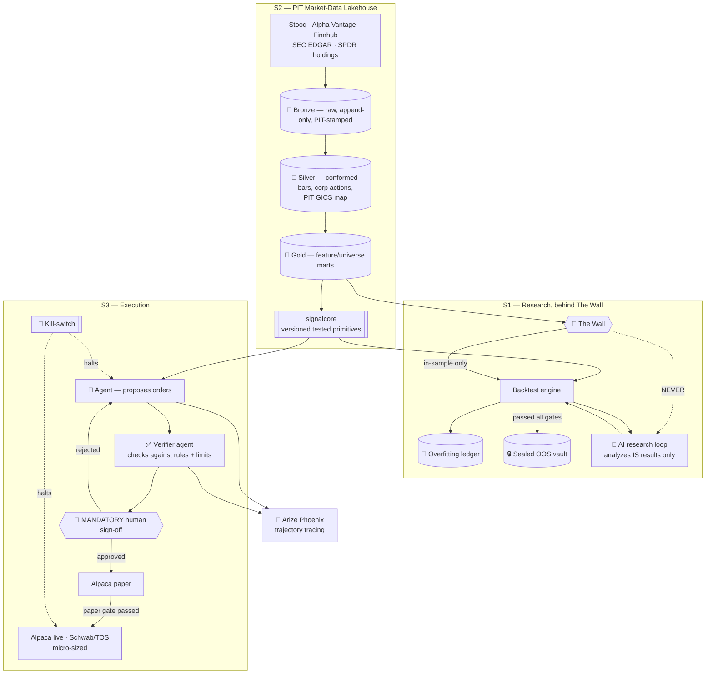

# 🔥 CRUCIBLE — Full Production Scope v1.0  (🏁 EXECUTION-SAFETY FLAGSHIP)

## Strategy-Agnostic Multi-Timeframe Research-to-Execution Platform
## "Strategies earn their way to real capital — and a human always holds the last switch"

> **Companion:** `CRUCIBLE_SCOPE_v3_1_STAGE1.md` — the Stage-1 build sheet (Phase 1: backtest engine + integrity spine, with code and week-by-week tasks). **This document is the end-state architecture** for the full S1 → S3 arc. It is design-level, not code-level, and is **authoritative for the S2 lakehouse and the S3 paper→live agent architecture**.

**Document Version:** 1.0 (new — created under roadmap v10.0.)
**Status:** 📋 DRAFT — v10.0-aligned. S2–S3 layers build progressively; the live-execution path is gated behind everything else.
**Last aligned:** v10.0 (2026 Market Realignment).

---

## 🎯 v10.0 ROADMAP ALIGNMENT & STAGE-EVOLUTION ARC — AUTHORITATIVE

> **This block governs.** Where anything below it conflicts, **this block wins.**

**Aligned to:** Career Roadmap **v10.0 (2026 Market Realignment)**.

**Governing model:** **3 stages, not 5.** The retired 14-month "ML Engineer" stage is now an **embedded ML-literacy module inside Stage 3** (earned-overlay — ships only if it beats the baseline). The destination title is **Applied AI Engineer → Forward Deployed Engineer (FDE)**; the retired "Senior LLM Engineer" title is dropped. **This project is ONE system that evolves across stages — never rebuilt per stage.**

**Portfolio role:** 🏁 **Flagship (lead)** — the **execution-safety flagship**, aimed at NY-fintech FDE demand. In v10.0, **flagship vs supporting = size & emphasis, not a quality tier — every project is production-grade.** **Build priority: DataVault → PolicyPulse → Crucible.** Crucible is a lead flagship, *not* the first build.

**Stage-evolution arc:**

| Stage | Theme | This project's layer |
|---|---|---|
| **S1** | Foundation (GenAI-first core) | Backtest engine + **integrity spine** — The Wall, sealed OOS vault, overfitting ledger, PIT data, walk-forward CV, engine-parity gate, 3-gate pipeline (swing-first on-ramp) + AI research loop behind The Wall. |
| **S2** | DE/AE hardening | **Market-data lakehouse** — PIT ingestion → medallion layers → feature/universe **dbt models with tests** + contracts + Airflow; **`signalcore`** as a versioned, tested primitives library (the DE/AE evidence beneath the trading system). |
| **S3** | Applied AI (agentic + eval) | **Paper → live agent** — mandatory **human sign-off + kill-switch**, "LLM behind the Wall", verifier agent before the HITL gate, published agentic evals (Tool Correctness = 1.0, Task Completion > 0.8) + Phoenix trajectory tracing. |

- **Every project's S2 adds:** ingestion → **dbt-tested models (CI-gated)** → **data contracts** (Great Expectations) → warehouse/lakehouse → **Airflow** (idempotent runs) → Docker/**ECS** → monitoring + written **postmortem** → **semantic/metrics layer**.
- **Every project's S3 adds:** RAG/agentic layer + **three-layer eval** (per-query metrics · trajectory tracing · drift vs frozen golden set) + **observability (Arize Phoenix, OTel-native, free)** + MCP + **HITL** on irreversible actions.

**Production standard (non-negotiable, ALL projects):** business-outcome headline · Mermaid diagram · **C4 Context diagram (+ Container view on lead flagships)** 🆕 · **`docs/adr/` — numbered, immutable Architecture Decision Records (context → decision → consequences)** 🆕 · Dockerfile · eval-metrics table · 15–30s demo GIF · "What I Learned" · **synthetic data only in public repos** · `pyproject.toml` + `src/` + `py.typed` + ruff + mypy · Conventional Commits. *(🆕 C4 + ADR added per roadmap v10.0 CORRECTION 8, July 2026 — additive documentation discipline: the decision-and-defense artifacts Applied-AI/FDE interviews probe; same doc version, no structural change.)*

**Identity note (v10.0):** roadmap v10.0 labels Crucible an *intraday* execution platform; this scope's **multi-timeframe, swing-first** on-ramp is retained as the lower-risk Phase-1 path, with intraday plugins as later phases. Recommend reconciling the roadmap wording to **"multi-timeframe (swing → intraday)"**.

**Relationship to AFC:** AFC = **read-only** small-cap swing *research* (epistemic safety — faithfulness). Crucible = liquid *execution* (consequential safety — money moves). ~70% shared engineering spine via **`signalcore`**; see `Shared_SignalCore_Boundary_Spec_v1_3.md`.

---

## 1. Executive Summary

Crucible is the portfolio's answer to the hardest question an Applied-AI/FDE interviewer can ask: **"What happens when your agent is wrong and the action can't be undone?"**

Every other project in the portfolio has a reversible failure mode. A bad RAG answer gets corrected. A bad extraction gets re-run. A bad reconciliation gets quarantined. **Crucible's live path spends real money in a market that will not give it back.** That asymmetry is the entire point of the project: it exists to demonstrate that the builder knows the difference between an agentic *workflow* and an autonomous agent with consequences — and engineers accordingly.

**The one-sentence claim:** *"I built an autonomous trading system where the agent can do everything except the one thing that matters — and I can prove, with published evals and a trace, that the human sign-off and the kill-switch actually hold."*

### What the End State Proves

| Capability | Evidence a reviewer can check |
|---|---|
| **Trade-off awareness** | Own harness (S1) → NautilusTrader (S2/S3) with the migration rationale written down; swing-before-intraday sequencing justified by risk, not preference |
| **Failure handling** | Kill-switch tested under adversarial conditions; engine-parity gate; sealed OOS vault opened exactly once |
| **Intellectual honesty** | **Overfitting ledger** — a public record of every strategy that *failed* its gates. Rare, and the most credible artifact in the repo |
| **Safety engineering** | Mandatory HITL on the live path; verifier agent; "LLM behind the Wall" (the model never sees OOS data) |
| **Data engineering** | PIT market-data lakehouse + `signalcore` as a tested, versioned library |

> **The counter-intuitive selling point:** a portfolio trading project that reports **losses honestly and documents rejected strategies** is far more credible than one showing a suspiciously smooth equity curve. Success here is measured in **process, not P&L**.

---

## 2. Vision: From Backtest Harness to Governed Execution Platform

| | **Stage 1 (build sheet)** | **End state (this document)** |
|---|---|---|
| **Engine** | Own harness — you own fill/look-ahead logic | **NautilusTrader** — event-driven, backtest→live with no code change |
| **Data** | Parquet + DuckDB, free-first sources | **PIT medallion lakehouse**, contract-tested, Airflow-orchestrated |
| **Primitives** | Functions in the repo | **`signalcore`** — versioned, tested, semver'd library shared with AFC |
| **Strategies** | Swing (SW-A/SW-B) | Strategy-agnostic plugins; **intraday added only after swing clears all gates** |
| **AI** | Research loop behind The Wall | **Agent proposes → verifier checks → human signs → execution**, fully traced |
| **Execution** | None | Paper (Alpaca) → **live, micro-sized, kill-switched** |
| **Safety** | The Wall + OOS vault | **Defense in depth**: verifier + HITL + kill-switch + position/loss limits |

---

## 3. The Integrity Spine (S1 — carried through every stage)

This is the part most portfolio trading projects skip, and it is the reason this one is credible.

| Control | What it does | Why it matters |
|---|---|---|
| **The Wall** | Strict separation between research data and out-of-sample data. **The LLM never sees OOS data** — not in a prompt, not in a summary, not in a metric | An LLM that has seen the test set has invalidated the test. This is the single most common silent failure in AI-assisted trading research |
| **Sealed OOS vault** | Out-of-sample period is cryptographically sealed and opened **exactly once**, at the end, on the record | Prevents the "just one more look" iteration that turns OOS into in-sample |
| **Overfitting ledger** | Public, append-only record of every strategy tested — **including the failures** — with the gate it died at | Turns survivorship bias into a published artifact. This is the anti-cherry-picking control |
| **PIT (point-in-time) data** | Every input as it was known *at that moment* — self-built PIT GICS sector map, restated fundamentals handled | Look-ahead bias is the default failure of naive backtests |
| **Walk-forward CV** | Rolling train/validate windows, never a single split | Single-split results are noise |
| **Engine-parity gate** | Own harness and NautilusTrader must agree on the same strategy within tolerance before migration | Proves the migration didn't silently change semantics |
| **3-gate pipeline** | Backtest gate → paper gate → live gate; each has explicit, pre-registered pass criteria | Strategies **earn** their way to capital; nothing is promoted on vibes |

> **Pre-registration discipline:** gate criteria are written down **before** the test runs. Moving the goalposts after seeing results is the failure mode this controls for.

---

## 4. Platform Architecture (end state)



---

## 5. S2 — The Market-Data Lakehouse (the DE/AE evidence)

This layer is what makes Crucible legible to a **data-engineering** interviewer, not just a quant one.

### 5.1 Medallion Layers

| Layer | Contents | Guarantee |
|---|---|---|
| **Bronze** | Raw vendor payloads exactly as received, **stamped with the wall-clock time they were retrieved**. Append-only. | Replayable: any historical research run can be reproduced from raw |
| **Silver** | Conformed OHLCV bars, corporate-action adjustments, **self-built PIT GICS sector map** from SPDR holdings snapshots, restated-fundamental handling | One clean, PIT-correct view — "as known on date T" |
| **Gold** | Feature marts, universe-membership marts, cross-sectional rankings as of `ctx.t` | Business-ready for strategies; no look-ahead by construction |

> **PIT is the whole point of the bronze layer here.** A vendor that silently restates history will destroy a backtest. Retrieval-time stamping plus append-only bronze means you can always answer *"what did we actually know on that date?"* — which is exactly the question a look-ahead-bias audit asks.

### 5.2 dbt Models & Blocking Tests

| Test | Why it exists |
|---|---|
| No bar timestamped after its retrieval stamp | **The look-ahead assertion** — the most important test in the lakehouse |
| Universe membership is PIT-correct (no future constituents) | Survivorship-bias control, enforced in CI |
| Corporate actions applied exactly once (no double-adjustment) | Silent double-adjustment is a classic returns-inflation bug |
| Bar continuity / gap detection per symbol | Missing bars silently change signals |
| `accepted_values` on sector codes | PIT GICS map integrity |

### 5.3 `signalcore` — Primitives as a Library

The shared spine with AFC (~70% overlap). Treated as a **real library**, not a folder:

- Semantic versioning; breaking changes are breaking releases
- Its own test suite, `py.typed`, ruff/mypy, published changelog
- **Boundary contract** defined in `Shared_SignalCore_Boundary_Spec_v1_3.md` — status-neutral, ownership-explicit
- Consumers (AFC, Crucible) pin versions; neither reaches into the other's internals

> **Why this reads as senior:** extracting shared primitives into a versioned, tested library — rather than copy-pasting between two projects — is exactly the "system design + trade-off awareness" signal that separates a portfolio from a pile of scripts.

### 5.4 Orchestration & Contracts

| Concern | Design |
|---|---|
| **Airflow** | Idempotent daily ingest; bounded-concurrency backfills; replay from bronze |
| **Great Expectations** | Contracts at bronze-in (schema, freshness, sane ranges) and silver-out (PIT invariants) |
| **Failure policy** | Contract violation → **fail the DAG, do not publish to gold**. A silently-wrong bar poisons every downstream backtest |
| **Monitoring** | Data freshness alerts, gap alerts, cost tracking; written postmortem on ≥1 real incident |

---

## 6. S3 — The Execution Agent & Safety Architecture

### 6.1 The Layered Safety Model (defense in depth)

```
Agent proposes  →  Verifier checks  →  👤 HUMAN SIGN-OFF  →  Broker adapter  →  Market
                        ↓                     ↓                    ↓
                   rules + limits        can always say no     🛑 kill-switch
                                                                (halts everything)
```

| Layer | Control | Failure it catches |
|---|---|---|
| **1. Deterministic pre-checks** | Position limits, max daily loss, universe membership, market-hours check, duplicate-order guard | Agent proposes something structurally invalid |
| **2. Verifier agent** | Independent check of the proposal against the strategy's stated rules **before** the human sees it | Agent hallucinates a rationale or drifts from the strategy |
| **3. 👤 Human sign-off** | **MANDATORY on the live path. No exceptions, no "auto-approve if confidence > X."** | Everything the machine layers missed |
| **4. Kill-switch** | Single control that halts proposals and flattens/blocks execution. **Tested, not assumed** | The situation nobody modeled |
| **5. Micro-sizing** | Live starts at a size where being wrong is tuition, not damage | Bounds the blast radius of the unknown-unknown |

> **Why HITL is not negotiable here:** the roadmap's own taxonomy (per Anthropic's *Building Effective Agents*) distinguishes agentic **workflows** — control flow in predefined code — from **autonomous agents** with consequences. FormSense and AFC are workflows. **Crucible's live path is the one genuinely irreversible path in the entire portfolio.** Treating it identically to the others would be the single most damaging judgment error the portfolio could display.

### 6.2 The Kill-Switch (design detail — because "we have one" is not evidence)

| Property | Requirement |
|---|---|
| **Reachability** | Triggerable without the agent's cooperation — the agent cannot veto or intercept it |
| **Scope** | Halts new proposals **and** blocks the broker adapter; optional flatten-all |
| **Persistence** | Survives process restart — a crash-loop must not reset it to "armed" |
| **Testing** | **Adversarial test suite**: kill during proposal, during human review, mid-order-submit, during a broker timeout |
| **Auditability** | Every activation logged with actor, timestamp, state at halt |
| **Default** | Fail-safe: on ambiguity, halt. Never fail-open |

### 6.3 "LLM Behind The Wall"

The agent uses an LLM for reasoning and explanation, **never** for unsupervised discovery on unseen data:

- The model analyzes **in-sample results only**; OOS is sealed from it
- Local **Ollama** by default — trading data and positions never leave the machine
- Provider-agnostic; cloud APIs only for public/synthetic scaffolding
- All outputs Pydantic-validated; no free-text order instructions ever reach a broker adapter

### 6.4 Broker Adapters

| Adapter | Use | Rationale |
|---|---|---|
| `AlpacaPaperBroker` | **Paper gate (mandatory)** | API paper and live share one interface → true parity |
| `AlpacaLiveBroker` | Live | Same code path as its own paper |
| `SchwabLiveBroker` (TOS) | Live | Existing account; live-only (TOS paperMoney is desktop-only), inherits parity from Alpaca paper |
| `LocalSimBroker` | Fallback/testing | Replays data through the engine's fill model |

---

## 7. Agentic Evaluation (published, not claimed)

| Metric | Target | What it proves |
|---|---|---|
| **Tool Correctness** | **1.0** | The agent never called a tool it shouldn't have. On an execution path, anything below 1.0 is a defect, not a score |
| **Task Completion** | **> 0.8** | The agent reliably does the job it was given |
| **Verifier catch rate** | Measured on injected faults | The verifier layer actually earns its place |
| **Kill-switch latency** | Measured, adversarially | The safety claim is tested, not asserted |
| **HITL rejection rate** | Tracked over time | Honest signal about agent quality; a *rising* rate is information, not embarrassment |
| **Trajectory tracing** | **Arize Phoenix** (OTel-native, free) | Every decision inspectable end to end — no black-box execution |
| **Drift vs. frozen golden set** | Regression blocks merge | Prompt/model changes cannot silently degrade behavior |

> **Publishing the evals is the artifact.** Anyone can claim their agent is safe. Showing Tool Correctness = 1.0 with a Phoenix trace and an adversarial kill-switch suite is what a fintech FDE interviewer actually wants to see.

---

## 8. ML Overlay (S3 — earned-overlay, may never ship)

| Component | Baseline it must beat | Rule |
|---|---|---|
| Calibrated classifier (scikit-learn / statsmodels) | **Base-rate cohort performance** | If it doesn't beat base rates out-of-sample, **it does not ship** |
| SHAP factor importance | — | Explanation only; never a trading signal on its own |
| Sentiment/attention features (Wikimedia Pageviews, Google Trends; Reddit/X forward-capture) | Strategy without them | **Confirmation-only, promotion-gated** — never a primary entry trigger |

> **The discipline:** ML here is deterministic and auditable, and the LLM **analyzes only** — it never generates signals. "We tried ML, it didn't beat the base rate, so we cut it" is a stronger portfolio sentence than a fragile model that survives only in-sample.

---

## 9. Tech Stack: Production

| Layer | Technology |
|---|---|
| Language | Python 3.11+, SQL |
| Engine — S1 | Own harness (you own fill/look-ahead logic) |
| Engine — S2/S3 | **NautilusTrader** (LGPL-3.0) — event-driven; backtest→live, no code change |
| Param sweeps | VectorBT (exploration only), Optuna (walk-forward wrapper) |
| Storage | DuckDB + partitioned Parquet (medallion); S3 for bronze archive |
| Transformation | **dbt** (feature/universe models, tests, lineage) |
| Contracts | **Great Expectations** (PIT invariants) |
| Orchestration | **Airflow** (idempotent, backfillable) |
| Primitives | **`signalcore`** (semver'd, tested, shared with AFC) |
| Data sources | Stooq (bulk), Alpha Vantage, Finnhub, **SEC EDGAR** (dilution + 8-K), SPDR holdings (PIT GICS) — all free-first |
| ML (earned-overlay) | scikit-learn, statsmodels, SHAP |
| Agents | **LangGraph** (Phases 2–3) |
| AI providers | **Ollama/Qwen3 (default, local)** → Gemini → Anthropic → OpenAI (config-selected) |
| Brokers | **Alpaca** (paper + live), **Schwab Trader API** (live) |
| Validation | Pydantic v2 (structured outputs + config) |
| Eval | DeepEval + pytest (CI gate); agentic evals published |
| Observability | **Arize Phoenix** (OTel-native, free) |
| Infra | Docker, **Terraform**, GitHub Actions CI |
| Dashboard | Streamlit (research + live monitor) |

---

## 10. Success Metrics (process, not P&L)

| Stage | Metric | Target |
|---|---|---|
| **S1** | Look-ahead assertion | Green, always |
| **S1** | OOS vault openings | **Exactly one**, at the end, on the record |
| **S1** | Overfitting ledger | **Every** tested strategy logged, including failures |
| **S1** | Walk-forward CV | No single-split results published, ever |
| **S2** | PIT invariants in CI | 100% pass; violations block merge |
| **S2** | Engine-parity gate | Own harness vs. NautilusTrader agree within tolerance |
| **S2** | `signalcore` | Semver'd, tested, changelog published; consumers pin versions |
| **S2** | Postmortem | ≥1 written, on a real incident |
| **S3** | **Tool Correctness** | **1.0** |
| **S3** | Task Completion | > 0.8 |
| **S3** | Kill-switch adversarial suite | 100% pass, latency measured |
| **S3** | **Unsigned live orders** | **Zero. Ever.** |
| **S3** | Live sizing | Micro — bounded blast radius |
| **S3** | Trajectory coverage | 100% of decisions traced in Phoenix |

> **Explicitly NOT a success metric: profit.** A portfolio project that claims alpha invites the interviewer to disbelieve everything else. This project claims **process integrity**, and process integrity is measurable.

---

## 11. Risk Mitigation

| Risk | Severity | Mitigation |
|---|---|---|
| **Agent executes an unintended order** | 🔴 Critical | Deterministic pre-checks + verifier + **mandatory HITL** + kill-switch + micro-sizing |
| **Kill-switch doesn't work when needed** | 🔴 Critical | Adversarial test suite; persists across restart; fail-safe default; agent cannot intercept it |
| **LLM contaminated by OOS data** | 🔴 Critical | **The Wall** — architectural, not procedural; sealed vault; the model sees in-sample only |
| **Look-ahead bias inflates results** | 🔴 High | PIT lakehouse + retrieval-stamped bronze + the look-ahead assertion in CI |
| **Overfitting via iteration** | 🔴 High | Pre-registered gate criteria + overfitting ledger + one-shot OOS |
| **Broker API change breaks execution** | 🟡 Med | Pluggable adapter layer; parity tests; `LocalSimBroker` fallback |
| **Real capital loss** | 🟡 Med | Micro-sizing; max-daily-loss limit; kill-switch; **paper gate mandatory before live** |
| **Scope creep into intraday too early** | 🟡 Med | Swing-first on-ramp; intraday only after swing clears all three gates |
| **Project reads as "trading hobby"** | 🟡 Med | Lead with **safety engineering + DE evidence**, never with returns |

---

## 12. Development Phases

| Phase | Stage | Deliverable | Exit criteria |
|---|---|---|---|
| **1** | S1 | Backtest engine + integrity spine + AI research loop behind The Wall | Look-ahead assertion green; ledger populated; ≥1 strategy through the backtest gate |
| **2** | S2 | PIT market-data lakehouse + dbt/contracts/Airflow + `signalcore` library + NautilusTrader migration | PIT invariants in CI; engine-parity gate passed; `signalcore` semver'd + published; postmortem written |
| **3a** | S3 | Paper-trading agent + verifier + Phoenix tracing + published agentic evals | Tool Correctness = 1.0; Task Completion > 0.8; paper gate passed |
| **3b** | S3 | Live agent, micro-sized, **HITL + kill-switch** | Adversarial kill-switch suite green; **zero unsigned orders**; live gate criteria pre-registered and met |

> **Phase 3b is the last thing built in the entire portfolio.** It requires skills from every prior project and is the only path with irreversible consequences.

---

## 13. Project Evolution (3 Stages — v10.0)

| Stage | Role (v10.0) | Layer & production deliverables | Exit criteria |
|---|---|---|---|
| **S1** | Foundation (GenAI-first core) | Backtest engine + integrity spine (The Wall, sealed OOS vault, overfitting ledger, PIT data, walk-forward CV, 3-gate pipeline) + AI research loop; swing-first. | Look-ahead assertion green; ledger public incl. failures; OOS unopened. |
| **S2** | DE/AE hardening | PIT medallion lakehouse; feature/universe **dbt models + blocking tests**; Great Expectations contracts; idempotent Airflow; **`signalcore`** semver'd tested library; NautilusTrader + engine-parity gate; Docker/Terraform; monitoring + postmortem. | PIT invariants CI-enforced; parity gate passed; `signalcore` published; postmortem written. |
| **S3** | Applied AI (agentic + eval) | Paper → live agent; deterministic pre-checks + **verifier agent** + **mandatory HITL** + **tested kill-switch** + micro-sizing; "LLM behind the Wall"; published agentic evals + **Arize Phoenix** trajectory tracing. | Tool Correctness = 1.0; Task Completion > 0.8; adversarial kill-switch suite green; **zero unsigned live orders**. |

> **Optional beyond-portfolio extensions (earned-overlay gated, not required):** intraday strategy plugins (only after swing clears all gates); additional venues; multi-strategy capital allocation. **Not planned:** anything that weakens the HITL gate.

---

## Skills Required (Roadmap Alignment — v10.0)

*Maps roadmap **v10.0** skills to how **this specific project** uses them. ✅ = built at Stage 1. Skills escalate **within** the project (S1→S3) — the system is never rebuilt.*

| Skill | Stage | How this project uses it |
|-------|-------|--------------------------|
| Python 3.11+, SQL | S1 ✅ | Core engine + research queries |
| pandas, numpy | S1 ✅ | Bar data, signal computation |
| **Own backtest harness** | **S1 ✅** | **You own fill/look-ahead logic — the integrity story you can defend under questioning** |
| **PIT data discipline, walk-forward CV** | **S1 ✅** | **The Wall, sealed OOS vault, overfitting ledger — the anti-overfitting spine** |
| DuckDB + partitioned Parquet | S1 ✅ | Data spine (shared with AFC) |
| Free-first data sourcing (Stooq, AV, Finnhub, SEC EDGAR, SPDR) | S1 ✅ | Price, fundamentals, dilution/8-K, PIT GICS map |
| Pydantic v2 | S1 ✅ | Config + structured LLM outputs; no free-text ever reaches a broker |
| Ollama / local open-weight LLM | S1 ✅ | **Privacy routing — trading data never leaves the machine** |
| Streamlit | S1 ✅ | Research dashboard + live monitor |
| DeepEval + pytest | S1 ✅ | CI eval gate |
| Docker, ruff, mypy, GitHub Actions | S1 ✅ | Production standard |
| **dbt + blocking tests** | **S2** | **Feature/universe models; the look-ahead assertion; PIT invariants** |
| **Data contracts (Great Expectations)** | **S2** | **Bronze-in schema/freshness; silver-out PIT invariants; violations fail the DAG** |
| **Medallion lakehouse (retrieval-stamped bronze)** | **S2** | **"What did we know on date T?" — replayable research** |
| **Airflow** | **S2** | **Idempotent daily ingest; bounded backfills; replay from bronze** |
| **`signalcore` semver'd tested library** | **S2** | **Shared spine with AFC — the DE/AE evidence beneath the trading system** |
| **Terraform + AWS** | **S2** | **Reproducible infra** |
| **NautilusTrader** | **S2 → S3** | **Event-driven engine; backtest→live parity; migration proven by the engine-parity gate** |
| scikit-learn, statsmodels, SHAP | S3 | Calibrated classifier / factor importance — **earned-overlay; must beat base-rate or be cut** |
| Alpaca (paper → live), Schwab/TOS | S3 | Execution adapters; paper and live share one API |
| **LangGraph** | **S3** | **Agent orchestration + verifier agent before the HITL gate** |
| **HITL sign-off + tested kill-switch** | **S3** | **MANDATORY — the one genuinely irreversible path in the portfolio** |
| **Agentic evals + Arize Phoenix** | **S3** | **Tool Correctness = 1.0, Task Completion > 0.8, published trajectory traces** |
| MCP | S3 | Market/broker tools exposed under the verifier + HITL boundary |

> **Honest gap:** trading/backtesting infrastructure has **no matching roadmap certification** — the defensible artifact (integrity spine + published evals + tested kill-switch) *is* the signal. Build it; don't look for a cert.

> **Positioning note:** lead with **safety engineering and data engineering**, never with returns. The interview story is *"here's how I made an irreversible system safe"* — not *"here's my Sharpe ratio."*

---

## ✅ Approval Checklist

- [ ] End-state architecture matches the v10.0 execution-safety flagship claim
- [ ] Integrity spine (Wall, vault, ledger, PIT, walk-forward, parity gate) is structural
- [ ] Gate criteria pre-registered before tests run
- [ ] `signalcore` boundary consistent with `Shared_SignalCore_Boundary_Spec_v1_3.md`
- [ ] **HITL mandatory on the live path — no confidence-threshold auto-approve anywhere**
- [ ] Kill-switch adversarially tested, persists across restart, fail-safe default
- [ ] LLM never sees OOS data (architectural, not procedural)
- [ ] Earned-overlay applied to the ML layer (beat base-rate or cut)
- [ ] Success metrics are process-based; **P&L is not a claim**
- [ ] Build priority respected: **DataVault → PolicyPulse → Crucible**; Phase 3b last in the portfolio
- [ ] Stage-1 companion (`v3_1_STAGE1`) remains the build sheet; no duplication of code-level detail here
- [ ] Roadmap reconciliation pending: "intraday" → **"multi-timeframe (swing → intraday)"**

---

## 📚 Courses & Certifications — per Stage (v10.0 reference)

*Synced to roadmap **v10.0**. ✅ = committed canon; conditional/platform certs are **take-ONE-only**. Employer-reimbursable certs noted. The shipped production-grade project is the primary hiring signal — certs are tiebreakers.*

### 🎓 Stage 1 — Foundation (GenAI-first core)
- **Courses:** Python for Everybody · AI Python for Beginners · Building with the Claude API (Anthropic Academy — structured outputs) · Improving the Accuracy of LLM Applications (eval) · Docker for Beginners
- **Certifications:** **AI-901** Azure AI Fundamentals (employer-reimbursed) · **AB-620** AI Agent Builder Associate (employer-reimbursed)

### 🎓 Stage 2 — DE/AE hardening
- **Courses:** PostgreSQL for Everybody · **dbt Fundamentals + dbt Advanced Learning Paths** · **Astronomer Academy (Airflow 101 + DAG Authoring)** · Terraform Fundamentals (HashiCorp) · Databricks Academy (Spark) — for the PIT market-data lakehouse + `signalcore`
- **Certifications:** **DP-700** Fabric Data Engineer (✅ committed · employer-reimbursed) · **AWS DEA-C01** Data Engineer Associate (✅ committed)

### 🎓 Stage 3 — Applied AI (agentic + eval)
- **Courses:** AI Agents in LangGraph (**HITL pattern** behind the mandatory sign-off gate) · LangChain Academy (LangGraph + LangSmith) · Agent Skills with Anthropic · Automated Testing for LLMOps · MCP: Build Rich-Context AI Apps
- **Certifications:** **Anthropic CCA-F** ($125 — agentic orchestration source-of-truth; **Domain 1 maps directly to the workflow-vs-agent distinction this project embodies**) · **Databricks GenAI Engineer Associate** ($200 — optional)

**Focus thread:** PIT lakehouse → `signalcore` tested library → backtest behind The Wall → pre-registered gates → paper → live agent with verifier + human sign-off + tested kill-switch.

> **Cert discipline (v10.0):** committed canon = **DP-700 + AWS DEA-C01** (S2) and the S3 GenAI set. Platform certs are a **conditional menu — take exactly ONE**. Keyword-density is a negative signal.

---

**Document Status:** 📋 DRAFT — v10.0-aligned Full-Production companion. Stages: S1 (built first) → S2 (DE/AE) → S3 (Applied AI → FDE). One evolving system.
**Last aligned:** v10.0 (2026 Market Realignment).