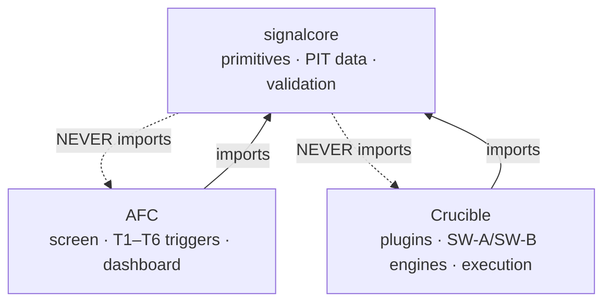

# SHARED SIGNAL-PRIMITIVES LIBRARY — BOUNDARY SPEC v1.5

*The dependency contract between **AFC** (Attention-Flow Catalyst) and **Crucible**. Defines exactly which code is shared, which stays project-specific, and the rules that keep the boundary from rotting.*

> **Working name:** `signalcore` (plain) — thematic alternatives: `bedrock` / `substrate` (the common foundation both projects stand on). Pick one; this doc uses `signalcore`.
>
> **Why this exists:** AFC and Crucible are locked as **siblings, no merge** (Crucible §20, Decision #2 — split on *liquidity + execution*, not timeframe). They share a thin layer of accumulation/dilution/data primitives and nothing else. This doc draws that line so the same VDU/OBV/dilution math is written **once**, without dragging the two projects toward a merge they explicitly rejected.
>
> **v1.1 change:** added `signalcore.shortinterest` (float / short-interest primitives) to support AFC's **T6 Squeeze Context** trigger. Primitives only — the squeeze *thresholds* and *trigger logic* stay in AFC.
>
> **v1.2 change:** added a §7 anti-pattern guarding the GraphRAG boundary — the **knowledge-graph / Neo4j entity model** (introduced in roadmap v8.6 as AFC's Stage 2 Financial-KG capstone) is project logic, never a `signalcore` primitive. Clarification only; no code-ownership changes.
>
> **v1.4 change (July 2026 — roadmap v10.0 CORRECTION 15, additive):** the **market-infrastructure layer** added to Crucible's S2 (FIX protocol · a dedicated time-series database · bitemporal point-in-time storage · event-driven design with measured latency budgets) forced a boundary ruling, because two of the four touch data access. The ruling: **the bitemporal PIT contract belongs to `signalcore.data` and is now specified there (§2); the time-series database is a swappable *backend behind* that accessor, never a dependency of it; FIX, event loops, and latency budgets are execution concerns that stay in Crucible (§4).** Two new anti-patterns added (§7) to keep wire protocols and schedulers out of a pure-computation library. **Filename intentionally unchanged** — per the standing convention, the version lives in this header. No code-ownership changes beyond the explicit rulings above.
>
>
> **v1.5 change (August 2026 — roadmap v10.0 CORRECTION 35, additive):** the **dataframe-engine boundary** is now specified. Both consumers named Polars in their Stage-2 scopes (Crucible for PIT-safe joins and Parquet IO, AFC for filing-scale scans), which meant the engine ruling lived in two consumer documents but **not in the contract they both depend on** — precisely the condition §7 calls boundary rot. The ruling: **`signalcore.data` accessors return Polars DataFrames, and that return type is part of the contract**; the storage backend stays injected and swappable exactly as v1.4 specified; **pure array math (`indicators`, ratio functions in `volume` / `shortinterest` / `relative`) keeps its numpy-array signatures and is untouched** — this is a ruling about the *tabular I/O boundary*, not a rewrite of the computation layer. Any conversion to pandas happens **in the consuming project, at that project's own named boundary** (plotting, `openpyxl` writes, PandasAI), never inside the library. Two anti-patterns added (§7) and an ADR obligation recorded (§6). **Filename intentionally unchanged** — per the standing convention, the version lives in this header.
>
> **v1.3 addendum (July 2026 — same version, additive):** recorded an **ADR log** for `signalcore` in §6 Governance, aligning the library with roadmap **v10.0 CORRECTION 8** (ADR + C4 added to the production standard). Primitive/boundary changes are already deliberate, semver'd events — this only formalizes *where the reasoning is written down*. The §5 dependency diagram already serves as the library's **C4 context-level view**; no README/demo-GIF standard applies (this is a pure-computation library, not a portfolio project). No code-ownership changes. **Roadmap v10.0 CORRECTION 18 (Production / Cost / Architecture README order) was reviewed and does *not* apply here** — for the same reason recorded in §6: `signalcore` is a pure-computation library, not a stage-evolution portfolio project, and carries no README / demo-GIF / Mermaid-export standard. The ADR log and the §5 dependency diagram (serving as C4 Context) remain the library's full documentation obligation. Recorded here so the exclusion is deliberate and auditable rather than an oversight.

---


## 🎯 v10.0 ROADMAP ALIGNMENT — AUTHORITATIVE

> **This block governs** where anything below conflicts.

**Aligned to:** Career Roadmap **v10.0 (2026 Market Realignment)**. Underpins **AFC (Supporting)** and **Crucible (lead Flagship)**; boundary contract unchanged.

This is a **shared, versioned primitives library** — the tested data-library layer beneath **AFC** and **Crucible**'s Stage-2 DE/AE work. It is not a stage-evolution project of its own; it has no flagship/supporting tier. The boundary contract below is **status-neutral and already v10.0-consistent** (it defines code ownership, not portfolio rank), so no functional change is required beyond this alignment note. AFC is now **Supporting** and Crucible a **lead Flagship** in v10.0 — the boundary is unaffected.

---

## 1. The boundary in one rule

> **`signalcore` holds parameterized, point-in-time-safe PRIMITIVES (pure computation + as-of data access + validation stats). It holds NO universe definitions, NO trigger/strategy logic, NO thresholds, NO execution, NO AI. Each project owns those.**

A primitive is a stateless function: *data in → value out*, computing only from what it's passed. The **function** is shared; the **parameter values** that turn it into a signal are project-specific. `vdu_present(df, pct, window)` lives in `signalcore`; AFC's `pct=0.50` and Crucible's SW-B `vdu_pct=0.50` (as a *gate*) live in each project's config. Likewise `pct_float_short(...)` lives in `signalcore`; AFC's "loaded when ≥ 0.20" lives in AFC.

---

## 2. What lives in `signalcore` (shared)

| Module | Functions / contents | Consumed by |
|---|---|---|
| `signalcore.volume` | `obv`, `vdu_present`, `distribution_days`, `accumulation_days`, `ud_volume_ratio`, `rvol`, `accumulation_score` (close-location-value × volume / ADL), `quiet_accumulation` (price-flat + OBV-rising) | AFC T4a–e · Crucible §9A footprint |
| `signalcore.shortinterest` ⭐ NEW | `pct_float_short(shares_short, float)`, `days_to_cover(shares_short, adv)`, `float_turnover(volume, float)` — pure ratios, no thresholds | **AFC T6** (squeeze context) · Crucible: unused by default (liquid universe) |
| `signalcore.dilution` | EDGAR fetch + parse (S-1/S-3/424B5/8-K/EFFECT) → structured filing records; `dilution_state(ticker, asof)` → {CLEAR, OVERHANG, ACTIVE_DEAL, CLOSED} + `days_since_last_event` | AFC T5 (state = setup) · Crucible dilution gate (recent filing = exclude) |
| `signalcore.relative` | `rs_line(close, bench)`, `relative_return(series, bench, lookback)`, `cross_sectional_rank(returns)`, `rs_line_new_high`, generic `rank_series_by(metric)` | AFC sector screen · Crucible RS percentile + sector ranking |
| `signalcore.indicators` | `sma`, `ema`, `atr`, `rsi`, `macd` — vanilla TA, no strategy semantics | both |
| `signalcore.data` | **as-of accessor** (returns only rows ≤ `t`) — 🆕 **v1.4: the as-of contract is now explicitly BITEMPORAL.** Every record carries both a **valid time** (when the fact was true in the market) and a **transaction time** (when we learned it). A vendor restatement **appends a new row; it never overwrites**, so `as_of(t)` answers *"what did we know on date `t`"* rather than *"what is true now."* This makes look-ahead a property of the **schema**, not a convention the caller must remember to respect. 🆕 **Backend-agnostic:** the accessor is an interface — DuckDB + Parquet, QuestDB, TimescaleDB or ClickHouse may sit behind it. **The engine choice is the consuming project's configuration and an ADR in that project, never a `signalcore` dependency.** 🆕 **v1.5: the *frame type* is the opposite case — it belongs to the contract.** Backend is injected; **return type is fixed at Polars** (`DataFrame`, or `LazyFrame` where the accessor composes a scan), so both consumers get identical null semantics, dtype coercion and join behaviour from the same primitive. Consumers convert at their own named boundary, never here., corporate-actions adjustment (splits/divs), **PIT sector membership** (built from SPDR holdings snapshots), **historical universe snapshots** (survivorship), **short-interest + float accessors** ⭐ NEW (as-of, **bi-monthly-lag-aware** — never returns a value dated `> t`, and carries the report's effective date) | both (identical PIT discipline) |
| `signalcore.validation` | walk-forward splitter, **purged k-fold + embargo** (López de Prado), `bootstrap_ci`, `de_cluster` (per-ticker N-day rule), calibration (Brier/reliability) | AFC backtest methodology · Crucible walk-forward CV |
| `signalcore.calendar` | exchange calendar, session bounds, half-days | both |

**Design constraints on every `signalcore` function:**
- **PIT-safe by construction.** Pure functions; no hidden I/O, no global state, no future access. The *only* module that does I/O is `signalcore.data`, and it **enforces as-of semantics** — a function asked for date `t` cannot return a row dated `> t`. (The short-interest accessor additionally exposes the FINRA *effective/settlement date* so consumers can model the bi-monthly lag honestly rather than treating it as fresh.)
- **Parameterized, not configured.** Defaults are arguments, never baked-in constants a project would have to fork.
- **Deterministic.** Same inputs → same output, always (this is what makes both projects' backtests reproducible).
- 🆕 **One frame type at the boundary (v1.5 — CORRECTION 35).** Every **tabular** return from `signalcore.data` is a **Polars DataFrame** (or `LazyFrame` where the accessor composes a scan). This is a *contract*, not a preference: if AFC received pandas and Crucible received Polars, the two consumers would drift into different null semantics, different dtype coercion and different join behaviour on the same primitive — and the shared-math guarantee this library exists to provide would quietly stop holding. **Pure array math is out of scope for this rule** — `indicators`, and the ratio functions in `volume` / `shortinterest` / `relative`, keep their numpy-array signatures. The library declares Polars in `pyproject.toml`; it does **not** depend on pandas at all. *Falsifier: if a future consumer cannot accept a Polars return without an unavoidable conversion at every call site, reopen this and consider Arrow tables as the neutral interchange type instead.*
- 🆕 **Money and precision cross the boundary intact.** Any monetary or ratio field that must not lose precision is returned as `Decimal128` or as a string the consumer parses to `Decimal` — **never silently widened to `Float64` for convenience.** Float coercion inside a PIT accessor is the same class of bug as look-ahead: invisible at the call site, and only detectable once the numbers have already been reported.

---

## 3. What stays in AFC (never in `signalcore`)

| Stays in AFC | Why |
|---|---|
| Universe screen (`< $5`, micro-cap `< $500M`, small float, top-3 sector by 20-day return) | AFC's universe definition — config, not primitive |
| **T1 insider-buy trigger** (Form-4 *interpretation*) | `signalcore` fetches/parses filings; deciding "this fires T1" is AFC's signal logic |
| **T2 Wikipedia / T3 news** collectors + spike triggers | Attention-as-trigger is AFC's entire thesis; Crucible never triggers on attention |
| **T6 squeeze-context trigger** ⭐ NEW (loaded-state thresholds `pct_float_short ≥ 0.20`, `days_to_cover ≥ 5`; the ignition tell; the "pair with a catalyst, never standalone" rule; the 5th-context test design) | `signalcore` supplies the *ratios*; deciding when squeeze fuel is "loaded" and how it pairs with T1–T5 is AFC's signal logic |
| +10%-in-3-days labeling, trigger leaderboard, hit-rate research | AFC's research question and outputs |
| AI dashboard, PandasAI, DeepEval/SelfCheckGPT/FActScore | AFC's product + eval layer |

## 4. What stays in Crucible (never in `signalcore`)

| Stays in Crucible | Why |
|---|---|
| Strategy plugin abstraction (Protocol/ABC/registry, `on_bar`, `CrossSection`, `holding_model`) | Crucible's core engine |
| **SW-A v3 / SW-B logic** (archetype detection, VCP detector, confirmation stacks, sizing tiers) | The engines — they *consume* `signalcore` primitives but assemble them into strategies |
| Execution / paper / live (NautilusTrader, brokers, two-speed loop) | Crucible executes; AFC is read-only |
| 🆕 **FIX protocol — sessions, sequence numbers, gap-fill, NewOrderSingle / ExecutionReport, the `FixBroker` adapter** | A **wire protocol is execution, not computation.** AFC never sends an order, so it can never consume this. `signalcore` has no I/O outside `signalcore.data` and no concept of a venue |
| 🆕 **Event loop, backpressure policy, latency budgets, replay determinism, idempotent order handling** | `signalcore` functions are **stateless and deterministic by construction** — the moment the library owns a clock, a queue, or a retry policy, it is no longer a primitive. Scheduling and delivery semantics belong to the engine |
| 🆕 **Time-series database selection, tuning and benchmarking** | The *choice* of storage engine is a project trade-off with a project ADR. `signalcore.data` defines the **as-of/bitemporal contract**; which engine satisfies it is Crucible's (or AFC's) call, made independently |
| The Wall, sealed OOS vault, overfitting-budget ledger, engine-parity gate, 3-gate pipeline | Crucible governance / audit artifacts |
| Prediction Engine (§6.5), ML overlay policy (§6.9), forecasting wing (§19) | Crucible research wings |

> **Note the asymmetry that proves the boundary is real:** dilution and volume-accumulation primitives are *shared*, but AFC trades the post-dilution micro-cap *as a setup* while Crucible *excludes* any liquid name with a recent filing. Same `signalcore.dilution` call, opposite decision. The short-interest primitives are the sharpest example yet: `signalcore` ships the ratios, but only **AFC** consumes them (squeeze is a micro-cap phenomenon) — Crucible's liquid leaders don't squeeze, so it imports nothing from `signalcore.shortinterest`. A shared module with one consumer is still correct: the math is generic; the *use* is not.

---

## 5. Dependency direction (acyclic — hard rule)


```mermaid
flowchart TD
    SC[signalcore<br/>primitives · PIT data · validation]
    AFC[AFC<br/>screen · T1–T6 triggers · dashboard]
    CRU[Crucible<br/>plugins · SW-A/SW-B engines · execution]
    AFC -->|imports| SC
    CRU -->|imports| SC
    SC -.->|NEVER imports| AFC
    SC -.->|NEVER imports| CRU
```

`signalcore` depends on **nothing** project-specific. If you ever feel the urge to `import afc` or `import crucible` inside `signalcore`, the thing you're writing is not a primitive — it's project logic in the wrong place. Stop.

---

## 6. Governance (so one definition doesn't silently break two projects)

- **`signalcore` is its own versioned package** with its own test suite. Both projects pin a version.
- **A change to a primitive is a deliberate, semver'd event.** Redefining `vdu_present` propagates to *both* consumers by design — that's the benefit — so breaking changes get a major bump and a note in both projects' changelogs. This is the same "change the canonical definition first, then propagate" discipline already in your swing docs.
- **🆕 Decisions are logged as ADRs (roadmap v10.0 CORRECTION 8).** `signalcore` keeps a numbered, immutable `docs/adr/` log — every primitive redefinition, boundary ruling (e.g. "short-interest ratios are shared but only AFC consumes them"), and semver break is recorded as *context → decision → consequences*. Because a `signalcore` change propagates to **both** AFC and Crucible, the ADR is the single place the two projects' maintainers read to understand *why* a shared definition moved — superseded ADRs are marked, never deleted (same additive-only discipline as the anti-pattern list in §7). C4 **Context** for the library is the §5 dependency diagram; no Container/README/demo-GIF standard applies — this is a pure-computation library, not a stage-evolution portfolio project.
- 🆕 **The bitemporal contract is a CI gate (v1.4).** Beyond the existing leakage tests, `signalcore.data` ships a **restatement-replay test**: inject a vendor restatement into the store, re-run a historical as-of query, and assert the original result is **bit-identical**. Because a `signalcore` change propagates to both consumers, this single test protects every backtest in both projects at once. The boundary ruling behind it ("the bitemporal contract is the library's; the storage engine is the project's") is recorded as an ADR.
- **Determinism + PIT are tested, not assumed.** `signalcore` ships leakage tests (assert no function returns data dated `> t`) and golden-value tests (assert stable outputs). The short-interest accessor gets an extra test: assert it never returns a position whose FINRA effective date is `> t` (the bi-monthly-lag trap). Both are CI gates — they protect *both* projects at once.
- 🆕 **The hook set is Tier A only (roadmap v10.0 CORRECTION 21).** `signalcore` carries a pinned `.pre-commit-config.yaml`: `pre-commit-hooks` basics + `detect-private-key`, `ruff-check --fix` **before** `ruff-format`, `uv-lock`, and `gitleaks`; `conventional-pre-commit` on the `commit-msg` stage, because a semver'd shared library is exactly the case where commit type drives the version bump. **No `nbstripout`** — a pure-computation library holds no notebooks. **No `mypy` hook** — it runs in CI only (the `mirrors-mypy` default `--ignore-missing-imports` would degrade third-party types to `Any`, which is intolerable in the one package *both* consumers pin). The hook set is a strict subset of the CI gate; the leakage, golden-value and restatement-replay gates above stay CI-side and are **never** mirrored locally, since a hook that runs a backtest is a hook that gets bypassed with `--no-verify`.
- 🆕 **Version drift is a boundary risk here, not just a nuisance.** Because both AFC and Crucible pin this package, a ruff version pinned in `.pre-commit-config.yaml` that diverges from `uv.lock` produces formatting churn that propagates into two repos. Mitigation (`sync-with-uv` + scheduled `pre-commit autoupdate --freeze`) is recorded as an ADR under the §6 rule above.
- **Governance artifacts do NOT move into `signalcore`.** The validation *algorithms* (walk-forward, bootstrap) are shared; the *sealed OOS vault*, *overfitting ledger*, and *who is allowed to touch test data* stay in each project — they're audit trails, not computation.

---

> 🆕 **v1.5 ADR obligation (CORRECTION 35).** The dataframe-engine ruling is a **semver-visible contract change** — it alters the declared return type of every `signalcore.data` accessor — so it requires its own numbered ADR in `docs/adr/`, recording: the rejected alternative (returning pandas, or returning Arrow tables as a neutral interchange type), the consequence (Polars becomes a hard dependency of a pure-computation library, and both consumers must convert at their own edge), and the falsifier stated in §2. Consumers each carry their **own** engine ADR for their own boundaries — those are separate documents and do not substitute for this one.

---

## 7. Anti-patterns (the boundary rotting)

- ❌ A threshold constant (`0.50`, `1.5`, `RS ≥ 80`, **`pct_float_short ≥ 0.20`**, **`days_to_cover ≥ 5`**) hard-coded in `signalcore`. → It's a default argument or it lives in the project's config.
- ❌ A strategy decision (`if vcp.valid and breakout: enter`, **`if loaded_squeeze and catalyst: fire_T6`**) in `signalcore`. → Triggers/engines stay in the projects.
- ❌ AFC's `< $5` screen or Crucible's `ADV ≥ 1M` screen in `signalcore`. → Universe is project-specific.
- ❌ `signalcore` importing either project, or reaching into a project's lakehouse path. → Inverts the dependency; forbidden.
- 🆕 ❌ **A wire protocol in `signalcore`** — FIX session state, sequence-number handling, `ExecutionReport` parsing, or any broker/venue adapter. → Execution is Crucible's, always. A primitive cannot know what an order is.
- 🆕 ❌ **An event loop, scheduler, queue, retry policy or latency budget in `signalcore`.** → These introduce time and state into a library whose entire guarantee is that it has neither. If a function's output depends on *when* it ran, it is not a primitive.
- 🆕 ❌ **Hard-coding a storage engine** (a QuestDB/ClickHouse/Timescale client, a connection string, a vendor-specific query) inside `signalcore.data`. → The accessor is an *interface* honouring the bitemporal as-of contract; the backend is injected and chosen per project.
- 🆕 ❌ **Treating a restatement as an update.** → Overwriting a row destroys transaction time and silently reintroduces look-ahead into every historical run that touches it. Restatements **append**; the leakage tests assert it.
- 🆕 ❌ **Returning pandas from `signalcore.data`, or importing pandas anywhere in the library** — including "just for this one consumer's convenience." → The frame type is part of the contract (§2). A convenience conversion inside the library is how two consumers end up silently running different dtype and null semantics on the same primitive. **Consumers convert at their own boundary; the library has no pandas dependency to convert with.**
- 🆕 ❌ **Widening `Decimal` to `Float64` inside an accessor.** → Precision loss in a PIT accessor is the same failure class as look-ahead: invisible where it happens, discovered after the results are published. Money is `Decimal128` or a parsed string; the leakage tests assert dtype, not just row bounds.
- ❌ Attention/insider *trigger logic* in `signalcore`. → Only the *filing fetch/parse* is shared; interpretation is AFC's.
- ❌ Treating the short-interest accessor's value as fresh-as-of-`t`. → It is bi-monthly and lagged; the accessor exposes the effective date so AFC can model that honestly.
- ❌ **Calling `configure_logging()`, `logging.basicConfig()`, or `structlog.configure()` anywhere in `signalcore`.** → A library *emits* logs; only an application *configures* them. `signalcore` modules call `structlog.stdlib.get_logger(__name__)` and nothing else — AFC and Crucible each own their own configuration, and whichever one imports the library at runtime supplies it. A library that configures logging silently hijacks the handlers of every consumer that imports it, and the last import wins. Likewise `signalcore` reads **no** environment variables and instantiates **no** `Settings` object: configuration is passed in as typed arguments, never discovered from the ambient environment.
- ❌ A **knowledge graph / Neo4j entity model** (companies · filings · officers · holdings → typed relationships), Cypher, or any GraphRAG hybrid-retriever logic in `signalcore`. → The entity ontology *is* project logic — it lives in **AFC** (the Stage 2 Financial-KG capstone), never in `signalcore`. The library may supply the *primitives* a graph ingest consumes (dilution filing records, short-interest ratios, PIT data accessors), but the graph schema, Cypher, and retriever stay in the project.

---

## 8. Suggested repo layout

```
signalcore/                      # shared package (its own repo or monorepo pkg)
  signalcore/
    volume.py  shortinterest.py  dilution.py  relative.py  indicators.py
    data.py    validation.py     calendar.py
  tests/   (leakage tests · golden-value tests · short-interest lag test)
  .opencode/       # dual agentic harness — agents/ + commands/ (+ .gitignore, package.json, package-lock.json)
  .claude/         # Claude Code side of the same harness, generated from the shared prompt layer
  AGENTS.md        # ONE portable contract driving both harnesses; note the §1 boundary rule and the §7
                   # anti-patterns here so neither harness puts thresholds, strategy logic, a wire
                   # protocol, a scheduler or a pandas import into a primitive
  opencode.jsonc   # harness config; instructions[] can also load ../.cursor/rules/*.md
  hooks/guard.py   # PreToolUse — blocks git commit/push; every commit is human, by construction
  .pre-commit-config.yaml   # Tier A hooks + conventional-pre-commit; strict subset of CI (CORRECTION 21)
  pyproject.toml   # versioned, semver'd (uv-managed)
  uv.lock          # committed lockfile — deterministic installs; pinned by both consumers
  # NOTE: no logging.py / settings.py here by design — see §7. The library binds loggers via
  #       structlog.stdlib.get_logger(__name__); consumers own configuration and redaction.
  # NOTE: pandas is NOT a dependency by design (v1.5, §2). data.py returns Polars frames; any
  #       pandas conversion happens in AFC or Crucible at that project's own named boundary.
  docs/adr/        # numbered, immutable ADRs (the §6 governance log)
  # (optional) docs/architecture.dsl — the §5 dependency diagram already serves as the C4 Context
  #            view; a Structurizr DSL source is only worth adding if this library ever grows a
  #            Container-level view. Per §6, no README / demo-GIF / Mermaid-export standard applies —
  #            this is a pure-computation library, not a stage-evolution portfolio project.

afc/                 # imports signalcore
  screen/  triggers/ (T1..T6)  backtest/  dashboard/  ...

crucible/            # imports signalcore  (does NOT import signalcore.shortinterest)
  strategies/ (sw_a_v3, sw_b)  engine/  execution/  vault/  ...
```

---

*Boundary spec only. Defines code ownership and dependency direction; makes no claim about either project's edge. Keep `signalcore` thin — the moment it knows what a "trade" is, what "loaded" means, **what a FIX session is, what time it is, or how logs should be formatted**, the boundary has failed.*