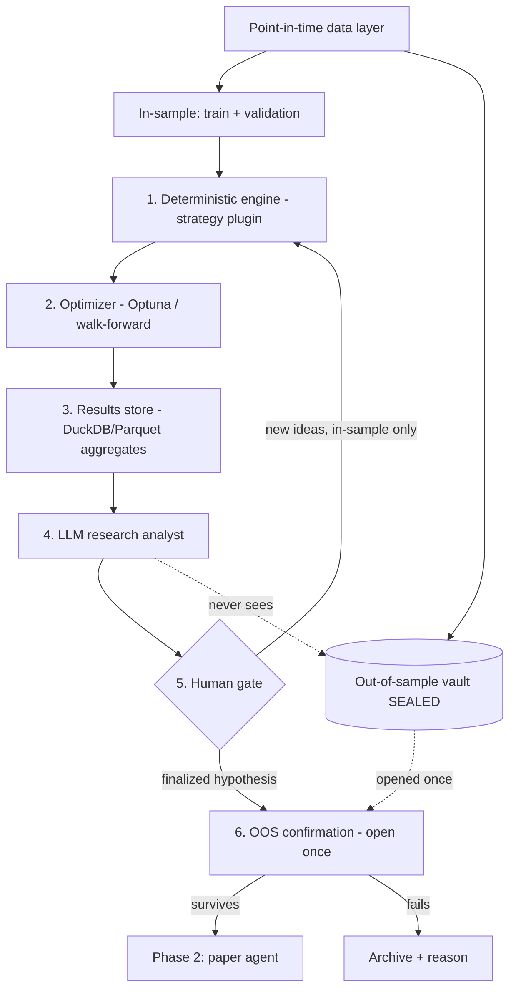

# 🔥 CRUCIBLE — Complete Project Scope v1.0 (OFFICIAL)

## Strategy-Agnostic Intraday Research-to-Execution Platform
## AI-Assisted backtest → paper → live, where strategies earn their way to real capital

**Document Version:** 1.0 (OFFICIAL — six open decisions resolved and locked)
**Last Updated:** May 31, 2026
**Status:** ✅ APPROVED
**Author:** Manuel Reyes
**Codename:** **Crucible** — the vessel where raw material is subjected to extreme heat until only what's pure survives. Every strategy must survive the crucible of backtest → paper → live before it touches real money.

---

## 0. How to Read This Document

This scope describes **one flagship project with three build phases**:

| Build Phase | What it produces | Real money? |
|---|---|---|
| **Phase 1 — Backtest Engine** | Strategy-agnostic backtesting + AI research loop. IT-1 + VWAP Reclaim as the first two strategies. | No |
| **Phase 2 — Paper Agent** | Autonomous multi-agent system trading an *approved* strategy on a paper account. | No |
| **Phase 3 — Live Agent** | The same agent system trading live at micro size, autonomously. | Yes (small) |

> ⚠️ **Terminology guard.** "Phase 1/2/3" here are *build phases of this project*. They are **not** the same as your career-roadmap **Stages 1–5**. Section 16 maps the two so they don't collide.

> 🧭 **Coaching note (read once, then move on).** You've decided to make this your first project and learn the supporting courses alongside it. That's your call and I respect it. This document is written to *support* that decision while protecting you from the two ways it can go wrong: (1) building something fragile because the fundamentals aren't in place yet, and (2) being fooled by an overfit backtest. The architecture below is designed specifically to de-risk both. Section 16 tells you which roadmap courses to pull forward so you understand what you're building as you build it.

---

## 1. Executive Summary

**Crucible** is a platform — not a single strategy. Its job is to answer one question, repeatedly and honestly, for *any* intraday strategy you give it:

> *"Does this strategy, with these parameters, have a real edge that survives out-of-sample validation in the current market regime — and if so, can an autonomous agent trade it without me babysitting it?"*

IT-1 (Opening Range Breakout) is **strategy #1** and **VWAP Reclaim** is **strategy #2**, both loaded as plugins in Phase 1 — chosen together specifically to prove the plugin abstraction works before more strategies are added. VWAP Rejection, Failed-Breakout (Trap), and Anchored-VWAP playbooks from your v2 system become strategies #3–#5 later, **without touching the engine**. The platform then ranks them against each other on validated metrics to surface the best approach for current conditions.

### What Makes This Project Different

| Dimension | Typical "AI trading bot" repo | Crucible |
|---|---|---|
| **Strategy coupling** | Hard-coded to one strategy | Plugin architecture (Protocol + ABC + registry); strategies are swappable |
| **Role of the LLM** | In the trade loop (slow, non-deterministic, leakage-prone) | *Around* the engine — research analyst whose ideas are validated by deterministic backtests |
| **Backtest honesty** | Optimize and report on the same data | Sealed out-of-sample vault + logged overfitting budget |
| **Backtest ↔ live gap** | Rewritten for live; silent skew | Phase 1 own harness, Phase 2–3 NautilusTrader (same strategy code runs backtest, paper, and live) |
| **Execution model** | LLM decides trades in real time | Two-speed: deterministic fast loop trades; agentic slow loop oversees |
| **Validation path** | Backtest → live (skips reality check) | Backtest → paper-parity → live micro-sizing, each a gate |
| **Headline claim** | "It made X%" (unverifiable, overfit-suspect) | "Validated process with documented controls" (defensible) |

### Core Capabilities
- **Strategy-agnostic backtesting** with point-in-time data, walk-forward CV, transaction costs, and bias controls.
- **AI research loop** where an LLM analyst reads aggregated results, proposes hypotheses, diagnoses where edges live and die, and translates winning configs into human-readable rules — never touching the out-of-sample vault.
- **Strategy comparison engine** that ranks plugins on out-of-sample, regime-aware expectancy.
- **Multi-agent execution oversight** (analyst → researcher → risk manager → trader → fund-manager review), modeled on the TradingAgents pattern, operating at a *slow* cadence around a *deterministic* execution core.
- **One strategy code path** from backtest to paper to live, minimizing the implementation gap that secretly inflates backtests.
- **Financial-grade evaluation and observability** for every AI component.

---

## 2. Design Principles (Non-Negotiable)

These are the spine. Everything else is plumbing.

1. **The Wall.** The LLM and the optimizer touch *only* in-sample data. The out-of-sample vault is opened **once** per finalized hypothesis and never re-tuned against.
2. **Deterministic owns the trade.** The strategy engine generates every entry/exit signal, in backtest and live. The LLM never places or times a trade.
3. **Aggregates, not rows.** The LLM sees derived statistics (hit-rate by VWAP-slope bucket, expectancy by time-of-day, MAE/MFE distributions), never raw "TICKER on DATE returned X." This keeps it in analysis mode and shrinks the leakage surface.
4. **The overfitting budget is a logged artifact.** Every out-of-sample peek is recorded with a run ID; significance is discounted for the number of looks. The ledger ships in the repo.
5. **No vibe coding.** Every line is intentionally written, understood, and reviewed before merge — including AI-suggested code. The deterministic engine is built from your IT-1 machine spec, line by line.

---

## 3. Architecture — The AI-Assisted Research Loop (Phase 1)

This is the approved loop. It governs how a strategy goes from "idea" to "validated."

```
┌──────────────────────────────────────────────────────────────────┐
│                    POINT-IN-TIME DATA LAYER                        │
│   1m + daily OHLCV, QQQ, survivorship-correct (incl. delisted)     │
│   Split ONCE, by date, deterministically:                          │
└───────────────────────────┬──────────────────────┬────────────────┘
                            │                      │
              IN-SAMPLE (train + validation)   OUT-OF-SAMPLE
              walk-forward CV lives here        (SEALED VAULT)
              ── iterate freely ──              ── opened once ──
                            │                      │
                            ▼                      │
         ┌──────────────────────────────────┐     │   ║ THE WALL ║
    ┌───▶│  ① DETERMINISTIC ENGINE          │     │   LLM never
    │    │     strategy plugin (IT-1, VWAP)  │     │   sees the
    │    │     no look-ahead · reproducible  │     │   vault. Ever.
    │    └──────────────┬───────────────────┘     │
    │                   │ trade logs + equity      │
    │                   ▼                          │
    │    ┌──────────────────────────────────┐     │
    │    │  ② OPTIMIZER (deterministic)      │     │
    │    │     Optuna / walk-forward grid    │     │
    │    │     numeric param search ONLY     │     │
    │    └──────────────┬───────────────────┘     │
    │                   ▼                          │
    │    ┌──────────────────────────────────┐     │
    │    │  ③ RESULTS STORE (DuckDB/Parquet) │     │
    │    │     AGGREGATED stats only         │     │
    │    └──────────────┬───────────────────┘     │
    │                   │ aggregated stats          │
    │                   ▼                          │
    │    ┌──────────────────────────────────┐     │
    │    │  ④ LLM RESEARCH ANALYST          │     │
    │    │     hypotheses · diagnosis ·      │     │
    │    │     rule translation · report     │     │
    │    │     Pydantic out · guardrails ·   │     │
    │    │     tokens/cost/latency logged     │     │
    │    └──────────────┬───────────────────┘     │
    │                   │ ranked hypotheses + why   │
    │                   ▼                          │
    │    ┌──────────────────────────────────┐     │
    │    │  ⑤ HUMAN GATE (you)              │     │
    │    └──────────────┬───────────────────┘     │
    │   new ideas       │ finalized hypothesis      │
    └───────────────────┤                          ▼
       (in-sample only) │       ┌──────────────────────────────────┐
                        └──────▶│  ⑥ OOS CONFIRMATION (open ONCE)  │
                                │     log it in the OVERFITTING     │
                                │     BUDGET ledger                 │
                                └──────────────┬───────────────────┘
                                               │ survives?
                                       ┌───────┴────────┐
                                     YES                NO
                                       ▼                 ▼
                              → PHASE 2 (paper)    archive + reason
                                                   (still costs budget)
```

> 🔑 **Walk-forward CV ≠ the OOS vault.** Walk-forward lives inside in-sample and is how you iterate robustly. The vault is a separate, later, contiguous holdout you never touch during iteration. Conflating the two is the most common way "rigorous-looking" setups quietly leak.

**Mermaid version (for the repo README — your production standard requires one):**



---

## 4. The Strategy Abstraction (why this isn't "the IT-1 project")

Strategies are **plugins**, using the same Protocol + ABC + registry pattern you built in the CS50 Speller reimplementation (your pattern library). Adding a strategy means writing one class and registering it — the engine, optimizer, data layer, results store, and AI loop are untouched.

```python
# src/crucible/strategies/base.py
from typing import Protocol, runtime_checkable
from crucible.types import Bar, Signal, StrategyContext, ParamSpace

@runtime_checkable
class Strategy(Protocol):
    """A strategy emits deterministic signals from data available at `ctx.t`."""
    name: str
    def param_space(self) -> ParamSpace: ...
    def on_bar(self, bar: Bar, ctx: StrategyContext) -> Signal | None: ...
    # No look-ahead: ctx exposes only data through ctx.t.

class _BaseStrategy:
    """Shared plumbing: session constants, indicator handles, no-look-ahead guards."""
    # ... ABC with template methods, mirroring _BaseDictionary ...

# src/crucible/strategies/registry.py
_REGISTRY: dict[str, type] = {}
def register(cls): _REGISTRY[cls.name] = cls; return cls
def get(name: str): return _REGISTRY[name]

# src/crucible/strategies/it1_orb.py
@register
class IT1OpeningRangeBreakout(_BaseStrategy):
    name = "it1_orb"
    # Implements your machine spec §4–§14, long + short mirror (Appendix B).

# src/crucible/strategies/vwap_reclaim.py
@register
class VWAPReclaim(_BaseStrategy):
    name = "vwap_reclaim"
    # Second strategy — proves the abstraction: added with ZERO engine changes.
```

**Why two strategies in Phase 1:** building IT-1 *and* VWAP Reclaim together is the test that the plugin architecture is real. If adding strategy #2 requires touching the engine, the abstraction failed and we fix it now — not after five strategies are entangled. This is the cheapest possible proof that "this isn't the IT-1 project."

**Strategy roadmap (plugins, not engine changes):**

| # | Strategy | Source | When |
|---|---|---|---|
| 1 | IT-1 Opening Range Breakout | Your machine spec (ready) | **Phase 1 first build** |
| 2 | VWAP Reclaim | System v2 playbook | **Phase 1 first build (proves abstraction)** |
| 3 | VWAP Rejection | System v2 playbook | After Phase 1 validated |
| 4 | Failed Breakout (Trap) | System v2 playbook (4/5 confirmations) | "" |
| 5 | Anchored-VWAP (Earnings-gap) | System v2 pilot | Later |

The **comparison engine** runs all registered strategies through the identical backtest harness and ranks them on out-of-sample, regime-tagged expectancy — this is the "define the best one for the current market" capability you asked for. Each strategy must clear the crucible **independently** (echoing your own hard rule: a playbook doesn't go live just because another one did).

---

## 5. Data Architecture

| Concern | Decision |
|---|---|
| **Resolution** | 1-minute incl. premarket (04:00–09:30 ET) + daily; QQQ aligned. Per your machine spec §1. |
| **Source** | **Alpaca** market data — because it *also* becomes your paper + live broker, so backtest and execution share one data lineage (minimizes implementation gap). |
| **Source (higher fidelity, optional)** | Polygon.io (~$29–199/mo) or Databento for deeper historical 1m + corporate actions. |
| **Storage** | Partitioned Parquet lakehouse + DuckDB (same spine as AFC; reuse the pattern). |
| **Point-in-time** | RVOL baseline, indicators, RS — all recomputed per timestamp, strictly past data only (machine spec §15 audit). |
| **Survivorship** | Universe screen must include delisted tickers as of each historical date (machine spec §3). |
| **Splits** | One deterministic date split: in-sample (train+validation, walk-forward inside) / out-of-sample vault. |

> 💲 **Honest dependency.** Free `yfinance` is daily-only and unreliable for premarket/1m, so Phase 1 has a **real data cost** (Alpaca has usable free tiers; Polygon/Databento are paid). Budget for it before starting; it's the one place "free" doesn't stretch.

---

## 6. Phase 1 — Backtesting Engine + AI Research Loop

**Goal:** A strategy-agnostic engine that produces *trustworthy* out-of-sample verdicts, with IT-1 **and** VWAP Reclaim as the first two validated (or rejected) strategies, proving the plugin abstraction.

**Engine for Phase 1: your own harness**, built line-by-line from the IT-1 machine spec (§14 fills, §12 exits, §15 look-ahead audit, §17 pseudocode). This is the highest-learning, lowest-risk part of the whole project and the single best portfolio artifact — it proves you understand the machinery, not just an API. NautilusTrader enters in Phase 2 (§7).

### Deliverables
| # | Deliverable | Acceptance criteria |
|---|---|---|
| 1 | Project setup | `src/` layout, `pyproject.toml` only (no requirements.txt), `py.typed`, pre-commit, CI green |
| 2 | Data layer | Point-in-time loaders, survivorship-correct universe screen, Parquet/DuckDB |
| 3 | Strategy abstraction | Protocol + `_BaseStrategy` ABC + registry; **IT-1 and VWAP Reclaim both registered** |
| 4 | IT-1 implementation | Faithful to machine spec §2–§14, long + short; look-ahead audit passes |
| 5 | VWAP Reclaim implementation | Added with **zero engine changes** — the abstraction proof |
| 6 | Backtest harness (own) | Event-driven; next-bar fills; cost/slippage model (§14); EOD flatten |
| 7 | Walk-forward CV | In-sample only; rolling train→validate |
| 8 | Optimizer | Optuna/grid over the machine-spec open-parameter table (§16) |
| 9 | Results store | Aggregated stats tables; per-trade log schema (machine spec §18) |
| 10 | LLM research analyst | Pydantic structured outputs; reads aggregates only; guardrails; observability |
| 11 | Overfitting budget ledger | Every OOS peek logged with run ID + look-count discount |
| 12 | OOS confirmation harness | Sealed; one-shot per finalized hypothesis |
| 13 | Strategy comparison/leaderboard | OOS, regime-tagged, ≥30 trades/scenario, bootstrap CI; ranks IT-1 vs VWAP Reclaim |
| 14 | Eval suite | DeepEval + pytest on the analyst (faithfulness ≥ 0.9, financial-grade) |
| 15 | Docs + demo | README w/ Mermaid diagram, "What I Learned", 60s demo GIF |

### What "validated" means (the per-strategy verdict)
- ≥30 trades per scenario; bootstrap 95% CI reported; transaction costs applied.
- Train→test rank stability (Spearman > 0.5) before a config is even eligible.
- Expectancy ≥ +0.20R **on the out-of-sample vault** after costs (mirrors your paper-test decision gate, applied first to backtest).
- A documented overfitting budget showing how many looks it took.

> A perfectly legitimate Phase 1 outcome is **"IT-1 and/or VWAP Reclaim do not show a validated edge."** That is a *successful* project result, not a failure — and it's exactly the kind of honest negative result that signals maturity to a hiring manager.

---

## 7. Phase 2 — Autonomous Paper-Trading Agent

**Goal:** An autonomous multi-agent system trades an *approved* strategy on a **paper account**, and we confirm paper results match backtest within tolerance before any real money is discussed.

**Engine for Phase 2: migrate to NautilusTrader** (LGPL-3.0, free, commercial use allowed). Its headline feature is exactly the hardest problem here — backtest and live run the *same* strategy code with no rewrite, giving research-to-live parity. Your strategy plugins port over because they sit behind the `Strategy` Protocol; the engine underneath changes, not the strategy logic.

> 🔁 **Engine-parity gate (required before trusting Phase 2).** Before relying on Nautilus, re-run a fixed historical window through **both** your Phase 1 harness and NautilusTrader and confirm the trade logs and equity curves match within a defined tolerance. Any divergence is a bug in one of them — find it before paper trading. This cross-check is itself a strong portfolio artifact (it shows you validate your tools, not just trust them).

### The Two-Speed Architecture (important)
Intraday execution can't wait on an LLM. So the system runs at two speeds:

- **Fast loop (deterministic, sub-second/per-bar):** the strategy plugin generates signals; a rules-based risk gate sizes and brackets the order (your §5 hard gates, §10 sizing, §12 exits, §13 limits). **No LLM here.**
- **Slow loop (agentic, minutes–daily):** an LLM agent crew operates *around* the fast loop:

| Agent | Cadence | Job (never overrides risk limits) |
|---|---|---|
| **Regime / Strategy-Selector** | Pre-market | Reads market context; picks which approved strategy/params fit today's regime |
| **Risk Manager** | Per-trade (fast model or rules) | Veto only — can block or downsize, never upsize beyond limits |
| **Trade Journalist** | Post-trade | Logs MAE/MFE, confirmations, mistake/insight (your v2 journal schema) |
| **Fund-Manager Review** | Daily/weekly | Compares paper-vs-backtest expectancy; flags drift; writes the report |

This mirrors the **TradingAgents** pattern (analyst → researcher → risk → trader → fund manager) but keeps agents in oversight/analysis roles, with the deterministic engine owning execution.

### Deliverables & Gates
- **Alpaca paper** integration (API paper = true live parity); same strategy code path via Nautilus.
- Engine-parity gate passed (Phase 1 harness vs. Nautilus).
- **Parity check:** paper expectancy vs. backtest expectancy within a defined tolerance after the 25% haircut from your paper protocol.
- Agent crew (LangGraph) with structured outputs, guardrails, full observability, and DeepEval gates in CI.
- Minimum 50 paper trades per strategy before any promotion decision (your Phase 2 decision gate).
- **Kill switch** + daily-max-loss + max-trades/day enforced in code, not prompts.

---

## 8. Phase 3 — Autonomous Live Agent (Micro-Sizing)

**Goal:** The *same* agent system trades live at **micro size**, autonomously, as a final real-world validation step — explicitly **not** an income plan.

**Engine: NautilusTrader** (continued from Phase 2). **Live venues: Alpaca live and/or your Schwab/TOS account** (see §10.2 for the broker adapter design).

### Promotion rule
Live status is earned per strategy, independently, only after Phase 2 parity holds. Go live at **25% of normal risk** (e.g., 0.125% instead of 0.5%), run 30–50 live trades, compare live vs. paper expectancy after the haircut, and only then consider scaling tiers — straight from your own Phase 3 protocol.

### Live-specific engineering
- Hard, code-enforced guardrails: daily max loss, max trades/day, two-loss rule, per-position cap, global kill switch, EOD flatten.
- Real-time monitoring dashboard + alerting (fills, slippage vs. modeled, drift, agent-cost).
- Reconciliation: live fills vs. modeled fills, logged daily (slippage truth-check).
- Idempotent order management; crash-safe state; no duplicate orders on restart.

### ⚠️ Regulatory & Risk Notes (verify before Phase 3 — not legal/financial advice)
- **Pattern Day Trader rule is changing.** The SEC approved elimination of the $25,000 PDT minimum-equity requirement on April 14, 2026, effective June 4, 2026, replacing the PDT framework with a risk-based intraday margin standard. Not all brokers will be ready on June 4 — firms have until October 20, 2027 as the final compliance deadline — and the new framework applies only to U.S. equities/equity options in margin accounts at FINRA member broker-dealers. **Verify your specific broker's status and the current rules before going live.**
- **Real capital can be lost.** Most retail intraday traders lose money; this project makes **no claim of positive expectancy** (echoing your machine spec). Treat Phase 3 as a research validation, sized so a total loss is tolerable.
- **Personal capital only.** Trading your own money is fine; managing *others'* money would likely trigger investment-adviser registration. Keep it personal.
- **Broker API terms.** Confirm automated trading is permitted under both Alpaca's and Schwab's API ToS.
- **Leakage caveat carries through.** A clean backtest that wasn't reproducible live is the #1 sign of hidden look-ahead — the parity gates exist precisely to catch this.

---

## 9. AI Integration Summary (all phases "powered by AI")

| Phase | AI role | Pattern | Why it's safe |
|---|---|---|---|
| 1 | Research analyst | Single agent, structured outputs | Reads in-sample aggregates only; behind the Wall |
| 2 | Oversight crew | Multi-agent (LangGraph), slow loop | Agents advise/veto; deterministic engine executes |
| 3 | Same crew, hardened | Multi-agent + code guardrails | Limits enforced in code, not prompts |

**Cross-cutting AI standards:** **provider-agnostic abstraction with local-first default and a cloud fallback chain** (see §10.1). Pydantic v2 structured outputs; governance-as-code guardrails; token/cost/latency observability per call; DeepEval + pytest with **faithfulness ≥ 0.9** and hallucination < 0.10 (financial-grade, matching AFC).

**Provider policy (decided):**
- **Default: local Qwen3 via Ollama** — no per-token fee, data stays on your machine. Handles the analyst's aggregate-stats work well.
- **Cloud fallback chain when frontier reasoning is wanted:** **Gemini (primary cloud — largest free capacity) → Anthropic → OpenAI.** All behind the same interface, selected by config.
- This also advances your roadmap **Stage 3 "Local LLM Specialist"** skills (Ollama, quantization), so the local-first choice does double duty.

> Note: this intentionally differs from AFC's Anthropic-primary policy. Different project, different constraint (here you're optimizing for zero/low cost and data locality), and the provider-agnostic layer makes it a config flag, not a rewrite.

---

## 10. Tech Stack

| Layer | Choice | Notes |
|---|---|---|
| Language | Python 3.11+, SQL | Your primary stack |
| Backtest engine — **Phase 1** | **Your own harness** | Built from IT-1 machine spec; max learning, you own the fill/look-ahead logic |
| Backtest+live engine — **Phase 2–3** | **NautilusTrader** (LGPL-3.0, **free**) | Event-driven; backtest→live, no code change; research-to-live parity |
| Param sweeps (optional) | VectorBT | Fast vectorized exploration across tickers |
| Optimizer | Optuna | Walk-forward grid wrapper |
| Storage | DuckDB + partitioned Parquet | Reuse AFC spine |
| Broker (paper) | **Alpaca** (API paper) | Paper and live share one API — true parity |
| Broker (live) | **Alpaca live + Schwab Trader API (TOS)** | Both wired as live targets; see §10.2 |
| Market data | Alpaca; Polygon/Databento optional | Higher fidelity if budget allows |
| Agents | LangGraph | Phases 2–3 |
| AI providers | **Ollama/Qwen3 (default) → Gemini → Anthropic → OpenAI** | Provider-agnostic; config-selected |
| Local LLM runtime | **Ollama** (primary), LM Studio / vLLM (alts) | Open-weight models, no API fee |
| Validation | Pydantic v2 | Structured outputs + config |
| Eval | DeepEval + pytest | CI gate |
| Infra | Docker, GitHub Actions CI | Production standard |
| Dashboard | Streamlit | Research + live monitor |

### 10.1 Local & Open-Source LLM Option (decided: local-first)

You run this on local, open-weight models by default — no per-token fee, data never leaves your machine. The provider abstraction makes this a config choice; `ai/provider.py` exposes one interface with multiple backends:

```python
# .env  →  AI_PROVIDER=ollama   (default)
#          cloud chain when enabled: gemini → anthropic → openai
# src/crucible/ai/provider.py
class LLMProvider(Protocol):
    def complete(self, messages: list[Message], schema: type[BaseModel]) -> BaseModel: ...

# Backends: OllamaProvider (default) | GeminiProvider | AnthropicProvider | OpenAIProvider
# All return Pydantic-validated structured outputs, so the rest of the
# system doesn't know or care which model produced them.
```

**Why local fits this project well:** the LLM's job here is *analysis and reporting over aggregated stats* (§2 principle #3), not frontier reasoning in a trade loop. That's well within reach of a mid-size local model — and keeping financial/strategy data local is a genuine privacy win for your README.

**Recommended models (current landscape — verify versions when you build, this moves monthly):**

| Tier | Model | Why | Rough hardware |
|---|---|---|---|
| **Default pick** | **Qwen3** (8B / 14B / 30B, Apache 2.0) | The de-facto "what do I run locally" choice in 2026: strong reasoning + coding, clean Apache-2.0, great tool-calling | 14B comfortable on 16–24GB VRAM or a 32–64GB Mac |
| **Agents / tool-calling** | **Gemma 4** (Google) | Most-cited for reliable tool-calling + structured output | Mid-range GPU / Apple Silicon |
| **Best reasoning** | **DeepSeek-R1** (distilled variants) | Strongest open reasoning for harder analyst steps | Larger; use distilled/quantized variants |
| **Lightweight / fast** | **Mistral** (7B) | Most efficient on modest hardware; fine for journaling/reporting | Runs on most laptops |
| **Top-tier (if you have the GPU)** | Kimi K2.6 / GLM-5.1 / Qwen3-Coder 32B | Lead agentic-coding benchmarks, need serious VRAM | Enterprise / multi-GPU |

> 💡 **Quantization tip:** use 4-bit (Q4_K_M) to roughly halve VRAM with minimal quality loss — often the difference between a 14B model fitting your machine or not. One-line Ollama pull.

**Decided policy:** default **Qwen3 14B (or 30B if hardware allows) via Ollama**; when frontier reasoning is wanted, fall back to **Gemini (primary cloud, large free tier) → Anthropic → OpenAI**, all behind the same interface. No mandatory fee, data stays local, cloud available on demand.

> "Open source" caveat: most of these are *open-weight*, not OSI-strict open source (training data isn't released). Doesn't affect you practically; word it carefully in the README.

### 10.2 Broker Options — Alpaca + Schwab/TOS (decided)

**Decision: Alpaca for the Phase 2 paper gate and as a Phase 3 live venue; Schwab/TOS also wired as a Phase 3 live venue.**

Background: after the Schwab–TD Ameritrade merger, the old TDA API was retired and replaced by the **Schwab Trader API** (developer.schwab.com): RESTful/OAuth2, supporting equities, options, real-time data, and order placement on individual accounts, with maintained unofficial Python wrappers (`schwab-py`, `pythonic-schwab-api`). **Critical limitation:** Schwab's developer API is **live-only** — TOS paperMoney is desktop-only and not API-accessible. So the *automated* paper gate must run on Alpaca (whose API paper mirrors live), and Schwab/TOS joins at the live stage.

Because `execution/` is a pluggable adapter layer (same philosophy as the strategy plugins):

| Adapter | Use | Why |
|---|---|---|
| `AlpacaPaperBroker` | **Phase 2 (paper gate)** | API paper + live share one interface → true parity; free |
| `AlpacaLiveBroker` | **Phase 3 live** | Same code path as its own paper → cleanest validation |
| `SchwabLiveBroker` (TOS) | **Phase 3 live** | Your existing account; live-only, inherits parity from Alpaca paper |
| `LocalSimBroker` | Fallback | Replays live data through the engine's fill model; modeled fills |

> Net: Alpaca is the paper backbone that makes the safety gates real; both Alpaca and your TOS account are first-class **live** targets in Phase 3. Your existing account plugs in at Phase 3, not Phase 2.

---

## 11. Project Structure

```
crucible/
├── .cursor/
│   └── rules/                     # ⭐ Cursor AI rules (your AFC standard)
│       ├── git-workflow.mdc           # always-on: 8-step Issue→PR→Cleanup, manual commits
│       ├── learning-mode.mdc          # always-on: no-vibe-coding; explain before generating
│       ├── python-production-standards.mdc  # always-on: src/, py.typed, pyproject, type hints
│       ├── strategy-plugin.mdc        # auto-attach: Protocol+ABC+registry rules for strategies/
│       ├── backtest-integrity.mdc     # auto-attach: no look-ahead, the Wall, OOS vault rules
│       ├── ai-sdk-patterns.mdc        # auto-attach: provider-agnostic, Pydantic, guardrails
│       └── evaluation.mdc             # auto-attach: DeepEval thresholds, pytest gates
├── .github/
│   └── workflows/
│       └── ci.yml                 # lint, type-check, test, eval gate on every PR
├── .env.example                   # API keys / broker keys placeholders (never commit .env)
├── .gitignore
├── .pre-commit-config.yaml        # ruff, pyright, end-of-file-fixer, etc.
├── pyproject.toml                 # single source of config (NO requirements.txt)
├── Dockerfile                     # containerized run (reproducible local + deploy)
├── docker-compose.yml             # optional: app + local LLM (Ollama) + DuckDB volume
├── LICENSE
├── CHANGELOG.md
├── README.md                      # Mermaid diagram + metrics table + What I Learned + demo GIF
├── docs/
│   ├── architecture.md            # the research-loop + two-speed execution
│   ├── strategies/IT1_ORB_spec.md # your machine spec, version-controlled in-repo
│   ├── strategies/vwap_reclaim_spec.md
│   ├── overfitting_budget.md      # how the peek-ledger works + policy
│   ├── engine_parity.md           # Phase 1 harness vs. Nautilus cross-check method
│   └── runbook.md                 # ops: start/stop, kill switch, recovery (Phase 2-3)
├── src/crucible/
│   ├── __init__.py
│   ├── py.typed                   # PEP 561 marker
│   ├── types.py                   # Bar, Signal, StrategyContext, ParamSpace (shared types)
│   ├── config.py                  # Pydantic v2 settings (SecretStr for keys)
│   ├── data/                      # point-in-time loaders, universe screen, lakehouse
│   ├── strategies/                # base.py (Protocol+ABC), registry.py, it1_orb.py, vwap_reclaim.py
│   ├── engine/                    # Phase 1 own harness: event loop, fills, costs, exits
│   ├── engine_nautilus/           # Phase 2-3 adapter to NautilusTrader
│   ├── optimize/                  # Optuna + walk-forward CV
│   ├── validation/                # OOS vault gate, overfitting budget ledger, lookahead audit
│   ├── results/                   # DuckDB schema, aggregation, leaderboard
│   ├── ai/                        # provider.py (ollama/gemini/anthropic/openai), schemas.py, guardrails.py, observability.py
│   ├── agents/                    # Phase 2-3: regime, risk, journalist, fund-manager
│   ├── execution/                 # broker adapters: AlpacaPaper/Live, SchwabLive (TOS), LocalSim; order mgmt, kill switch
│   └── utils/                     # logging, calendar, async
├── app/                           # Streamlit research dashboard + live monitor
│   ├── Home.py
│   ├── pages/
│   └── components/
├── tests/
│   ├── test_lookahead_audit.py    # ⭐ determinism / no-future-data audit (machine spec §15)
│   ├── test_strategy_registry.py
│   ├── test_it1_orb.py            # signal-level unit tests vs. hand-worked examples
│   ├── test_vwap_reclaim.py
│   ├── test_backtest_engine.py
│   ├── test_engine_parity.py      # ⭐ own harness vs. Nautilus agree on fixed window
│   ├── test_oos_vault.py          # vault can only be opened once per hypothesis
│   ├── test_ai_guardrails.py
│   ├── test_eval.py               # DeepEval cases (faithfulness ≥ 0.9)
│   └── eval_dataset.json          # financial-accuracy eval fixtures
├── notebooks/                     # exploration only (Jupyter); never the source of truth
└── scripts/                       # one-off runners (backfill data, build universe snapshots)
```

**Production-grade checklist (your AFC standard, carried over):** Mermaid architecture diagram ✅ · Dockerfile ✅ · evaluation metrics table ✅ · demo GIF ✅ · "What I Learned" section ✅ · GitHub Actions CI ✅ · `pyproject.toml`-only (zero `requirements.txt`) ✅ · `src/` layout + `py.typed` ✅ · `.cursor/rules/` (3 always-on + 4 auto-attached) ✅.

---

## 12. Risk Mitigation

| Risk | Mitigation |
|---|---|
| Overfitting / data-snooping | The Wall + sealed OOS vault + logged overfitting budget |
| Look-ahead bias | Per-timestamp recomputation + automated look-ahead audit test (machine spec §15) |
| Survivorship bias | Delisted tickers in historical universe |
| LLM leakage (temporal memory) | Aggregates not rows; LLM behind the Wall; deterministic signals |
| Backtest↔live skew | Phase 1 own harness → Phase 2–3 NautilusTrader (same strategy code); **engine-parity gate** (§7); Alpaca API-paper parity; live-vs-modeled reconciliation. Schwab/TOS is live-only, so it inherits parity from Alpaca paper. |
| Engine migration error | `test_engine_parity.py` — harness and Nautilus must agree on a fixed window before Phase 2 |
| Capital loss (Phase 3) | Micro-sizing, code-enforced limits, kill switch, tolerable-loss budget |
| Scope creep (first-project risk) | Strict phase gates; Phase 1 must fully clear before Phase 2 |
| Building above current skill | Section 16 front-loads supporting courses per phase |
| AI cost overruns | Local-first (Qwen3) default; slow-loop cadence; caching; token/cost observability |

---

## 13. Success Metrics (process, not P&L)

> The headline metric is **a trustworthy verdict**, not a return number. A repo that says "I built a rigorous platform and IT-1 failed OOS" is more hireable than "my bot made 40%."

**Phase 1:** look-ahead audit passes; ≥80% test coverage; CI green; every leaderboard entry has ≥30 trades + bootstrap CI; overfitting budget ledger present; **both IT-1 and VWAP Reclaim carried to a documented OOS verdict** (proving the plugin abstraction).
**Phase 2:** engine-parity gate passed; paper-vs-backtest parity within tolerance over ≥50 trades; agent crew passes DeepEval gates; kill switch + limits demonstrably enforced.
**Phase 3:** live-vs-paper parity over 30–50 micro trades; reconciliation clean; zero limit breaches; full observability; works against both Alpaca and TOS live adapters.

---

## 14. Timeline (indicative, 25 hrs/week)

| Phase | Rough duration | Notes |
|---|---|---|
| Phase 1 — Backtest + AI loop | ~10–14 weeks | Heaviest; own harness + Wall + IT-1 & VWAP Reclaim verdicts |
| Phase 2 — Paper agent | ~6–8 weeks | Nautilus migration + engine-parity gate + multi-agent + paper parity |
| Phase 3 — Live micro | ~4–6 weeks + live runtime | Gated on Phase 2 parity; Alpaca + TOS live |

Phase 1 is a touch longer than the single-strategy estimate because it ships two strategies to prove the abstraction. Treat durations as gates, not deadlines.

---

## 15. Relationship to AFC (decided: sequence)

**Decision: sequence as siblings.** AFC stays scoped exactly as-is; Crucible is a distinct flagship. No merge. Cleaner identities — AFC targets illiquid sub-$5 swing research (read-only); Crucible targets liquid intraday execution (autonomous).

They share ~70% of an engineering spine (point-in-time data, lakehouse, walk-forward backtest, bias controls, eval, Docker/CI, eventual agents). To avoid rebuilding it twice, a reasonable future move is to extract the shared infrastructure into a small internal library both repos import — but that's an optimization for later, not a Phase 1 concern. No decision memo needed; this is settled.

---

## 16. Career-Roadmap Alignment (your "learn alongside" plan)

You're starting this first and pulling roadmap courses to understand it as you build. Here's the honest mapping — which skills each phase *uses* and which roadmap courses to **front-load**.

| This project | Skills it exercises | Roadmap courses to pull forward |
|---|---|---|
| Phase 1 engine | Production Python, OOP/Protocols, pandas, SQL/DuckDB, testing, CI, Docker | CS50 (in progress), IBM Data Analyst, **Docker for Beginners** (Month 5 → pull early), Statistics w/ Python |
| Phase 1 AI loop | LLM SDK, structured outputs, evaluation, guardrails | IBM GenAI Engineering, **Building & Evaluating Advanced RAG** (free), DeepEval docs |
| Phase 1 stats rigor | Walk-forward, bootstrap CI, multiple-comparisons | Statistics with Python Specialization (Michigan) |
| Phase 1 local LLM | Ollama, quantization, running Qwen3 locally | **Stage 3 "Local LLM Specialist" material — pulled forward (bonus alignment)** |
| Phase 2 agents | Multi-agent orchestration, LangGraph | Stage 4 agentic courses (pulled *way* forward — the hardest stretch) |
| Phase 2 engine | Event-driven systems, NautilusTrader | Mostly self-driven + Nautilus docs |
| Phase 2–3 infra | Orchestration, monitoring, reliability | Stage 2 DE material, Docker/K8s |
| Phase 3 live | Real-time systems, reconciliation | Mostly self-driven |

> **Where this maps:** Phase 1 ≈ Stage 1–2 skills (reasonable to front-load) plus a slice of Stage 3 (local LLM). Phase 2's multi-agent layer ≈ **Stage 4** skill — pulling it first means learning LangGraph and agent patterns long before the roadmap schedules them. That's the single biggest "learning above current level" stretch. **Honest recommendation: fully complete and ship Phase 1 first** (squarely Stage 1–2 + a Stage-3 taste, genuinely high-value alone), then decide whether to push into the agentic phases or let them wait until your Stage 3–4 skills catch up. That lets you "start this first" *and* protects you from stalling on the hardest part before fundamentals land.

---

## 17. Codename (decided)

**Selected: Crucible.** The vessel where heat burns away everything impure — mapping directly to the three-gate survival pipeline (backtest → paper → live) where only strategies with a real edge make it through. One word, evocative, serious, and the metaphor carries the project's whole thesis. Repo and package: `crucible`.

*Alternatives considered:* Forge, Gauntlet, Assay (ore-purity test), Proving Ground. Rejected the aggressive/stealth names (Bloodhound, Nightshade) — they read "gambler bot," the opposite of the disciplined signal this project is meant to send.

---

## 18. Approval & Locked Decisions

**Status:** ✅ APPROVED — v1.0.

| # | Decision | Locked choice |
|---|---|---|
| 1 | Codename | **Crucible** |
| 2 | AFC relationship | **Sequence** (siblings; no merge) |
| 3 | AI providers | **Local Qwen3/Ollama default**; cloud chain **Gemini → Anthropic → OpenAI** |
| 4 | Brokers | **Alpaca** paper + live; **Schwab/TOS** also live |
| 5 | Engine | **Own harness Phase 1**; **NautilusTrader Phase 2–3** (with engine-parity gate) |
| 6 | Phase 1 strategies | **IT-1 + VWAP Reclaim** (proves the plugin abstraction) |

Nothing in your roadmap or AFC scope has been modified by this document. README skeleton and `.cursor/rules/` files are deferred to a later session per your instruction.

---

*Educational/operational specification only. Not investment, financial, or legal advice. This document defines process and execution logic; it makes no claim that any strategy has positive expectancy — that is what the crucible is for.*
