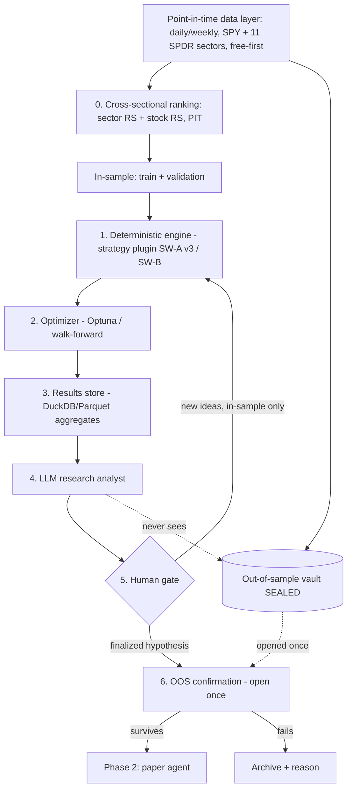

# 🔥 CRUCIBLE — Complete Project Scope v2.0 (OFFICIAL)

## Strategy-Agnostic Multi-Timeframe Research-to-Execution Platform
## AI-Assisted backtest → paper → live, where strategies earn their way to real capital

**Document Version:** 2.2 (OFFICIAL — adds the logging & observability standard and a per-workflow `logs/` layout)
**Last Updated:** June 3, 2026
**Status:** ✅ APPROVED
**Author:** Manuel Reyes
**Codename:** **Crucible** — the vessel where raw material is subjected to extreme heat until only what's pure survives. Every strategy must survive the crucible of backtest → paper → live before it touches real money.

---

## Changelog — v1.0 → v2.0

This version reorients Crucible from intraday-first to **multi-timeframe (swing + intraday), starting with swing**, locks the Phase 1 data layer to a **free-first** stack, adds the **cross-sectional/universe stage** the swing strategies require, and adds a **sequenced sentiment/attention research feature**.

| Area | v1.0 | v2.0 |
|---|---|---|
| Platform identity | Intraday platform | **Multi-timeframe** (swing + intraday) |
| Phase 1 strategies | IT-1 ORB + VWAP Reclaim (intraday) | **SW-A v3 + SW-B (swing pair)**; intraday becomes later plugins *(reopens locked Decision #6)* |
| Strategy abstraction | Per-symbol `on_bar` | + **cross-sectional `CrossSection` context** and optional `universe_filter()`; `timeframe` + `holding_model` fields |
| Primary data resolution | 1-minute, QQQ-aligned | **Daily/weekly-primary, SPY-benchmarked**; 1m deferred to intraday plugins |
| Data sources / cost | Alpaca/Polygon (paid) | **Free-first, $0 Phase 1**: Stooq/Alpha Vantage/Finnhub (prices+earnings), SEC EDGAR (dilution), self-built PIT GICS from SPDR holdings |
| Sentiment | none | **New research feature** — Wikipedia/Trends in backtest (confirmation-only); social forward-captured in paper; promotion-gated; never a trigger |
| AFC differentiator | timeframe (AFC swing / Crucible intraday) | **liquidity + execution** (AFC illiquid sub-$5 read-only / Crucible liquid, executes, swing+intraday) |
| Execution cadence | sub-second fast loop + EOD flatten | + **swing mode**: EOD decision cadence, multi-day holds, no flatten; PDT largely moot |

> The v1.0 integrity spine is unchanged and remains the foundation: The Wall, sealed OOS vault, logged overfitting budget, point-in-time data, walk-forward CV, engine-parity gate, and the three-gate backtest→paper→live pipeline.

**v2.0 → v2.1 (prior revision):** adds (1) **factor-importance ranking** as an explicit analyst output (which factors carry the OOS edge); (2) an explicit **deterministic-scores-and-executes / LLM-analyzes-and-improves** split for live factor monitoring (§9); and (3) a **Prediction Engine** (§6.5) — a *deterministic* conditional base-rate / calibrated-probability research metric (LLM analyzes, does not predict), promotion-gated like every other signal. None of these move the LLM into the trade loop; Principle #2 stands.

**v2.1 → v2.2 (this revision):** adds a **logging & observability standard** (§12.1) and a per-workflow `logs/` layout — separating *operational logs* (gitignored, structured, for debugging) from *audit/provenance artifacts* (durable, for proving reproducibility and no-leakage).

---

## 0. How to Read This Document

This scope describes **one flagship project with three build phases**:

| Build Phase | What it produces | Real money? |
|---|---|---|
| **Phase 1 — Backtest Engine** | Strategy-agnostic backtesting + AI research loop. **SW-A v3 + SW-B** as the first two strategies (swing). | No |
| **Phase 2 — Paper Agent** | Autonomous multi-agent system trading an *approved* strategy on a paper account. | No |
| **Phase 3 — Live Agent** | The same agent system trading live at micro size, autonomously. | Yes (small) |

> ⚠️ **Terminology guard.** "Phase 1/2/3" here are *build phases of this project*. They are **not** the same as your career-roadmap **Stages 1–5**. Section 17 maps the two so they don't collide.

> 🧭 **Coaching note (read once, then move on).** You've decided to make this your first project and learn the supporting courses alongside it. That's your call and I respect it. This document is written to *support* that decision while protecting you from the two ways it can go wrong: (1) building something fragile because the fundamentals aren't in place yet, and (2) being fooled by an overfit backtest. The architecture below is designed specifically to de-risk both. Starting with **swing** lowers the Phase 1 engineering burden (daily data, EOD cadence, no sub-second loop, PDT moot) — your instinct to start there is the lower-risk on-ramp. Section 17 tells you which roadmap courses to pull forward.

---

## 1. Executive Summary

**Crucible** is a platform — not a single strategy. Its job is to answer one question, repeatedly and honestly, for *any* rules-based strategy (swing or intraday) you give it:

> *"Does this strategy, with these parameters, have a real edge that survives out-of-sample validation in the current market regime — and if so, can an autonomous agent trade it without me babysitting it?"*

**SW-A v3 (Trend Pullback & Base Breakout)** is **strategy #1** and **SW-B (Trend Continuation / VCP)** is **strategy #2**, both loaded as plugins in Phase 1 — chosen together specifically to prove the plugin abstraction works *and* to exercise the new cross-sectional stage (both rely on sector ranking and RS percentile). They share that cross-sectional spine but differ in entry mechanic — SW-A v3 buys the **pullback reclaim**, SW-B buys the **VCP pivot breakout** — so registering both is the cleanest proof the abstraction is real. The intraday playbooks (IT-1 ORB, VWAP Reclaim/Rejection, Trap, Anchored-VWAP) become strategies #3+ later, **without touching the engine**. The platform then ranks all strategies against each other on validated metrics to surface the best approach for current conditions.

### What Makes This Project Different

| Dimension | Typical "AI trading bot" repo | Crucible |
|---|---|---|
| **Strategy coupling** | Hard-coded to one strategy | Plugin architecture (Protocol + ABC + registry); strategies are swappable |
| **Timeframe coupling** | One timeframe | Multi-timeframe: same abstraction runs swing (daily) and intraday (1m) |
| **Role of the LLM** | In the trade loop (slow, non-deterministic, leakage-prone) | *Around* the engine — research analyst whose ideas are validated by deterministic backtests |
| **Backtest honesty** | Optimize and report on the same data | Sealed out-of-sample vault + logged overfitting budget |
| **Backtest ↔ live gap** | Rewritten for live; silent skew | Phase 1 own harness, Phase 2–3 NautilusTrader (same strategy code runs backtest, paper, and live) |
| **Execution model** | LLM decides trades in real time | Two-speed: deterministic core trades; agentic slow loop oversees |
| **Validation path** | Backtest → live (skips reality check) | Backtest → paper-parity → live micro-sizing, each a gate |
| **Headline claim** | "It made X%" (unverifiable, overfit-suspect) | "Validated process with documented controls" (defensible) |

### Core Capabilities
- **Strategy-agnostic, multi-timeframe backtesting** with point-in-time data, walk-forward CV, transaction costs, and bias controls.
- **Cross-sectional universe stage** — per-timestamp, past-only ranking of sectors and stock relative strength, enabling top-down swing strategies (sector → stock → setup).
- **AI research loop** where an LLM analyst reads aggregated results, proposes hypotheses, diagnoses where edges live and die, and translates winning configs into human-readable rules — never touching the out-of-sample vault.
- **Strategy comparison engine** that ranks plugins on out-of-sample, regime-aware expectancy.
- **Sentiment/attention research feature** (sequenced, opt-in, confirmation-only) — Wikipedia/Trends attention in backtest; social platforms forward-captured in paper.
- **Multi-agent execution oversight** (analyst → researcher → risk manager → trader → fund-manager review), modeled on the TradingAgents pattern, around a *deterministic* execution core.
- **One strategy code path** from backtest to paper to live, minimizing the implementation gap that secretly inflates backtests.
- **Financial-grade evaluation and observability** for every AI component.

---

## 2. Design Principles (Non-Negotiable)

These are the spine. Everything else is plumbing.

1. **The Wall.** The LLM and the optimizer touch *only* in-sample data. The out-of-sample vault is opened **once** per finalized hypothesis and never re-tuned against.
2. **Deterministic owns the trade.** The strategy engine generates every entry/exit signal, in backtest and live. The LLM never places or times a trade.
3. **Aggregates, not rows.** The LLM sees derived statistics (hit-rate by sector tier, expectancy by RS bucket, MAE/MFE distributions), never raw "TICKER on DATE returned X." This keeps it in analysis mode and shrinks the leakage surface.
4. **The overfitting budget is a logged artifact.** Every out-of-sample peek is recorded with a run ID; significance is discounted for the number of looks. The ledger ships in the repo.
5. **No vibe coding.** Every line is intentionally written, understood, and reviewed before merge — including AI-suggested code.
6. **Structure first, indicators last; signals earn their place.** Trend/sector/RS structure gates before momentum confirmation. RSI, MACD, **and sentiment** are confirmation-only inputs — **never triggers** — and every added signal (sector gate, sentiment) is *tagged and measured* before it is trusted, then dropped if it doesn't add out-of-sample expectancy.

---

## 3. Architecture — The AI-Assisted Research Loop (Phase 1)

This is the approved loop. It governs how a strategy goes from "idea" to "validated."

```
┌──────────────────────────────────────────────────────────────────┐
│                    POINT-IN-TIME DATA LAYER                        │
│  Daily/weekly OHLCV · SPY + 11 SPDR sectors · free-first sources    │
│  survivorship-aware · earnings + dilution (EDGAR) · PIT GICS        │
│  (optional) PIT attention tag: Wikipedia pageviews / Google Trends  │
│  Split ONCE, by date, deterministically:                           │
└───────────────────────────┬──────────────────────┬────────────────┘
                            │                      │
              IN-SAMPLE (train + validation)   OUT-OF-SAMPLE
              walk-forward CV lives here        (SEALED VAULT)
              ── iterate freely ──              ── opened once ──
                            │                      │
                            ▼                      │
         ┌──────────────────────────────────┐     │   ║ THE WALL ║
    ┌───▶│ ⓪ CROSS-SECTIONAL RANKING        │     │   LLM never
    │    │    sector RS + stock RS, per t    │     │   sees the
    │    │    past-only · PIT GICS           │     │   vault. Ever.
    │    └──────────────┬───────────────────┘     │
    │                   ▼                          │
    │    ┌──────────────────────────────────┐     │
    │    │ ① DETERMINISTIC ENGINE           │     │
    │    │    strategy plugin (SW-A v3, SW-B)│     │
    │    │    no look-ahead · reproducible   │     │
    │    └──────────────┬───────────────────┘     │
    │                   │ trade logs + equity      │
    │                   ▼                          │
    │    ┌──────────────────────────────────┐     │
    │    │ ② OPTIMIZER (deterministic)      │     │
    │    │    Optuna / walk-forward grid     │     │
    │    └──────────────┬───────────────────┘     │
    │                   ▼                          │
    │    ┌──────────────────────────────────┐     │
    │    │ ③ RESULTS STORE (DuckDB/Parquet) │     │
    │    │    AGGREGATED stats only          │     │
    │    └──────────────┬───────────────────┘     │
    │                   │ aggregated stats          │
    │                   ▼                          │
    │    ┌──────────────────────────────────┐     │
    │    │ ④ LLM RESEARCH ANALYST           │     │
    │    │    hypotheses · diagnosis ·       │     │
    │    │    rule translation · report      │     │
    │    └──────────────┬───────────────────┘     │
    │                   │ ranked hypotheses + why   │
    │                   ▼                          │
    │    ┌──────────────────────────────────┐     │
    │    │ ⑤ HUMAN GATE (you)               │     │
    │    └──────────────┬───────────────────┘     │
    │   new ideas       │ finalized hypothesis      │
    └───────────────────┤                          ▼
       (in-sample only) │       ┌──────────────────────────────────┐
                        └──────▶│ ⑥ OOS CONFIRMATION (open ONCE)   │
                                │    log it in the OVERFITTING      │
                                │    BUDGET ledger                  │
                                └──────────────┬───────────────────┘
                                               │ survives?
                                       ┌───────┴────────┐
                                     YES                NO
                                       ▼                 ▼
                              → PHASE 2 (paper)    archive + reason
```

> 🔑 **Walk-forward CV ≠ the OOS vault.** Walk-forward lives inside in-sample and is how you iterate robustly. The vault is a separate, later, contiguous holdout you never touch during iteration.



---

## 4. The Strategy Abstraction (why this isn't "the SW-A v3 project")

Strategies are **plugins**, using the same Protocol + ABC + registry pattern from your CS50 Speller reimplementation. Adding a strategy means writing one class and registering it — the engine, optimizer, data layer, results store, and AI loop are untouched.

v2.0 extends the Protocol so it can express **cross-sectional** strategies (rank a stock against the universe — sector RS, stock RS percentile), which the per-symbol v1.0 abstraction could not. Both additions are **optional**, so intraday plugins are unaffected.

```python
# src/crucible/strategies/base.py
from typing import Protocol, runtime_checkable
from crucible.types import Bar, Signal, StrategyContext, ParamSpace

@runtime_checkable
class Strategy(Protocol):
    """A strategy emits deterministic signals from data available at `ctx.t`."""
    name: str
    timeframe: str               # "1d" | "1w" | "1m"  — drives data + fill model
    holding_model: str           # "multiday_hold" (swing) | "intraday_flat"
    def param_space(self) -> ParamSpace: ...
    def universe_filter(self, ctx: StrategyContext) -> set[str] | None:
        """Top-down funnel Stages 1-2 (regime + sector rank + stock RS).
        Return None to consider the full universe (intraday plugins do this)."""
        ...
    def on_bar(self, bar: Bar, ctx: StrategyContext) -> Signal | None: ...
    # No look-ahead: ctx (incl. ctx.cross_section) exposes only data through ctx.t.

# ctx.cross_section: universe-wide, point-in-time rankings as of ctx.t
#   .sector_rank(symbol) -> int (1..11, PIT GICS-mapped)
#   .sector_rs_rising(symbol) -> bool
#   .rs_percentile(symbol) -> float (vs SPY, 0..100)

# src/crucible/strategies/swa_v3.py
@register
class SWA_v3_TrendPullback(_BaseStrategy):
    name = "swa_v3"; timeframe = "1d"; holding_model = "multiday_hold"
    # universe_filter: regime + top-third sector + RS>=70 ; on_bar: pullback reclaim / base breakout

# src/crucible/strategies/swb.py
@register
class SWB_TrendContinuation(_BaseStrategy):
    name = "swb"; timeframe = "1d"; holding_model = "multiday_hold"
    # Second strategy — proves the abstraction: shared cross-sectional spine, VCP pivot-breakout entry
```

**Why these two strategies in Phase 1:** building SW-A v3 *and* SW-B together is the test that the plugin architecture (and the new cross-sectional stage) is real. They share the funnel — regime → sector rank → RS percentile — but enter differently (pullback reclaim vs. VCP breakout). If adding strategy #2 requires touching the engine, the abstraction failed and we fix it now.

**Strategy roadmap (plugins, not engine changes):**

| # | Strategy | Source | When |
|---|---|---|---|
| 1 | SW-A v3 — Trend Pullback & Base Breakout | SW-A v3 doc (ready) | **Phase 1 first build** |
| 2 | SW-B — Trend Continuation (VCP) | SW-B v2 playbook | **Phase 1 first build (proves abstraction)** |
| 3 | IT-1 Opening Range Breakout | IT-1 machine spec | After Phase 1 validated (intraday) |
| 4 | VWAP Reclaim / Rejection | System v2 playbooks | Later (intraday) |
| 5 | Failed Breakout (Trap) | System v2 (4/5 confirmations) | Later (intraday) |
| 6 | Anchored-VWAP (Earnings-gap) | System v2 pilot | Later (intraday) |

The **comparison engine** runs all registered strategies through the identical harness and ranks them on out-of-sample, regime-tagged expectancy. Each strategy must clear the crucible **independently** (a playbook doesn't go live just because another one did).

> **Anti-drift bright line (carried from the SW-A v3 / SW-B docs):** one ticker = one playbook per trade. A mandatory-VCP + RS ≥ 80 pivot breakout logs as **SW-B**; a pullback-to-MA reclaim or non-VCP base breakout with RS 70–79 logs as **SW-A v3**. The leaderboard must not double-count the same chart in both.

---

## 5. Data Architecture (free-first, daily-primary)

Phase 1 runs entirely on **free-tier APIs + self-built pipelines — $0 subscription cost.** The cost is engineering labor, which doubles as roadmap-relevant data-engineering work.

| Data need | Source (confirmed) | Cost | Build / Buy | Point-in-time handling |
|---|---|---|---|---|
| Daily OHLCV — stocks, **SPY**, 11 SPDR sector ETFs | Stooq bulk CSV (backfill) + Alpha Vantage `TIME_SERIES_DAILY_ADJUSTED` / Finnhub (top-ups) | Free | Buy (free API) | Adjusted; store as-of; **survivorship caveat below** |
| Weekly bars | Resampled from daily | Free | Build | Derived |
| Forward earnings calendar (live gate) | Finnhub `/calendar/earnings` | Free | Buy (free) | Naturally PIT (announcement dates) |
| Historical earnings dates (backtest) | Alpha Vantage `EARNINGS` (`reportedDate`) | Free | Buy (free) | Naturally PIT; cache once |
| Earnings cross-check | SEC EDGAR 8-K (Item 2.02) | Free | Build | PIT by filing date |
| Dilution filings (424B5 / S-3 / S-1) | SEC EDGAR full-text + submissions API | Free | Build | PIT by filing date |
| Sector membership (PIT GICS proxy) | SPDR 11 sector ETF daily holdings (State Street) | Free | **Build** | Forward-snapshot + hard-coded reclassification discontinuities (§5.2) |
| RS percentile, RVOL, MAs, slopes | Computed from daily OHLCV | Free | Build | Recompute as-of, past-only (The Wall) |
| (Optional) attention tag | Wikimedia Pageviews API; Google Trends | Free | Build | PIT-clean, reproducible — see §6 |

| Concern | Decision |
|---|---|
| **Resolution** | **Daily primary + weekly** for swing. 1-minute deferred to the intraday plugins (Phase 3+). |
| **Benchmark** | **SPY** for RS and sector ranking (common yardstick). QQQ retained as the intraday tech proxy only. |
| **Storage** | Partitioned Parquet lakehouse + DuckDB (same spine as AFC; reuse the pattern). |
| **Splits** | One deterministic date split: in-sample (walk-forward inside) / out-of-sample vault. |
| **Caching** | All raw pulls land once; never re-pulled. Free-tier rate limits only bite on initial backfill. |

### 5.1 ⚠️ The survivorship landmine (top integrity risk of going all-free)
Most free price sources serve **currently-listed** tickers only — delisted/merged names silently vanish, which can reintroduce the exact survivorship bias the OOS discipline exists to prevent. **Mitigation:** seed a delisted-ticker list from the EDGAR pipeline (filer coverage is survivorship-free), **or** explicitly scope Phase 1 backtests to a survivorship-limited universe and **flag it in results metadata**. Do not let "free daily" smuggle the bias back in unannounced.

### 5.2 PIT GICS — built from SPDR holdings (confirmed: Built)
You are not licensing GICS (proprietary to S&P/MSCI). You build **point-in-time sector membership consistent with how you trade it** — the 11 Select Sector SPDR ETFs *are* the investable sectors, so their holdings are ground truth. Pipeline: (1) snapshot the 11 ETF holdings daily, accumulating a true PIT history from project start; (2) for the pre-snapshot backtest window, approximate with coarse periodic membership and **hard-code the known reclassification discontinuities** (2015 Real Estate split; 2018 Communication Services; 2023 payments/retail moves); (3) validate a sample against current holdings. Forward snapshots are PIT-perfect; the historical window is a documented approximation — tolerable because the sector gate is judged at **tier level** (top/middle/bottom-third), robust to minor membership noise.

### 5.3 When to revisit paid data
Stay free until one trigger fires: (a) free historical depth too thin for the backtest window; (b) the survivorship gap materially distorts results and a clean delisted universe isn't reconstructable for free; (c) you need **deep fundamentals** (margins, cash-vs-burn) for SW-A v3's fundamental gate — a separate, genuinely-buy need from earnings dates. A single ~$30/mo tier (e.g., Tiingo, which offers point-in-time fundamentals) would collapse several of these at once. Let the crucible's own results tell you when free is the binding constraint.

---

## 6. Derived Research Signals — Sentiment, Attention & Prediction (sequenced, confirmation-only, promotion-gated)

Sentiment is added the disciplined way: **the order is backtest-clean-sources-only → forward-capture-the-rest → promote only what earns it**, and it is **always confirmation-only, never a trigger** (Principle #6). This protects the system from the single least-reproducible data in the stack.

### 6.1 Why the obvious approach is wrong
Scraped **Reddit** and **X/Twitter** history cannot be backtested honestly: Reddit's public historical archive (Pushshift) closed in 2023 and its commercial API is ~$12,000/mo; X moved to pay-per-use with no real free tier and enterprise pricing for history, and scraping violates ToS. Beyond cost, scraped social history is **not point-in-time** (deleted/edited posts, banned accounts), **not reproducible** (violates The Wall), survivorship-biased, regime-contaminated (meme-stock era dominates), and the documented edge is strongest on small/illiquid/meme names over **short, mean-reverting** horizons — the opposite of SW-A v3's liquid, near-52-week-high, multi-day-continuation universe.

### 6.2 What goes where

| Source | Phase | Role | Rationale |
|---|---|---|---|
| **Wikipedia pageviews** (+ optional Google Trends) | **Backtest → paper → live** | Confirmation-only attention tag | Free, historical, **PIT-clean & reproducible** via Wikimedia Pageviews API. *Carried into paper and live only if it improves OOS expectancy in backtest.* |
| **Reddit / X / StockTwits** sentiment | **Paper (forward-capture) → live** | Confirmation-only tag, then optional overlay | Cannot be backtested honestly. Capture in real time (PIT-by-construction), tag every paper trade, promote to live only if it earns expectancy. |

### 6.3 Promotion ladder (how a sentiment signal earns its place)
1. **Backtest (Wikipedia/Trends only):** include as a tagged, confirmation-only feature using the **parallel-tag** method (run the strategy with sentiment recorded but not gating; compare expectancy across sentiment buckets). **If it improves OOS expectancy after the overfitting-budget discount → it is promoted into paper and live as a confirmation-only input. If not → dropped.**
2. **Paper (social forward-capture):** begin logging Reddit/X/StockTwits in real time, building your own PIT dataset; tag every paper trade. No live use yet.
3. **Live (promotion-gated):** a social signal goes live **only** if the forward-captured paper data shows it adds expectancy over a meaningful sample — and even then **confirmation-only, never a trigger**. Most defensible role: a **contrarian exhaustion guard** (euphoric attention spike = "don't chase"), reinforcing the existing climax-volume / no-chase rules.

### 6.4 Integrity rules for sentiment
- Sentiment never gates entry alone and never overrides a structural NO-TRADE.
- Backtest uses **only** PIT-clean sources (Wikipedia/Trends); scraped social is **never** backtested.
- Forward-captured social data is stored immutably with capture timestamps (PIT-by-construction).
- Every sentiment input is logged in the overfitting budget like any other peek; it is dropped if it doesn't pay for itself out-of-sample.

> **Net:** Wikipedia/Trends can flow backtest→paper→live if the backtest says it matters; social rides along as a forward-captured tag and only reaches live if it earns it. Sentiment is the *last* and *lightest* input, not a foundation.

### 6.5 Prediction Engine (conditional base-rate / calibrated probability — research metric)

A **separate, deterministic module** that takes the deterministic engine's factor vector + PIT history and outputs, for each A+/A setup, a **probability and forward-return distribution** for the next move in the trade's direction (P(up)/P(down) **and expected R**), shown as a **metric** beside the setup. The question it answers: *does a data-driven probability add information over the rules alone?*

> **Critical — the LLM is NOT the predictor.** "This factor profile has occurred N times and X% went up" is a *statistical computation*, not an LLM task. An LLM producing a price-move probability from numbers would hallucinate, be non-reproducible, and carry no calibration. The predictor is **deterministic stats/ML**; the **LLM analyzes** the predictor's calibration and where it works or fails — the same division of labor as everywhere else (deterministic predicts; LLM diagnoses).

### 6.6 Two implementations (start simple, earn complexity)

- **(a) Conditional base-rate / analogue cohort (start here).** Encode each setup as its factor vector; find historical analogues (k-NN or binned cohort) using **only past, PIT data**; compute the empirical forward-return distribution, hit rate, **sample size, and confidence interval**. Transparent and directly testable. **Pool cross-sectionally across the universe for statistical power** — per-ticker counts are far too small.
- **(b) Calibrated classifier (later).** Logistic regression first (interpretable baseline), then gradient-boosted trees; output a **calibrated** P(up) (Platt/isotonic); SHAP for factor importance (ties directly to the "most important factor" question). Walk-forward trained; never sees the OOS vault.

### 6.7 The traps this must survive (blunt)

- **"90% in this ticker" is almost always noise.** A narrow per-ticker slice has n ≈ 3–8; 9-of-10 is sampling noise, not edge. **Require a minimum sample (e.g., n ≥ 30) and report the CI**; pool across the universe to get there.
- **Win-rate ≠ edge.** 90% up with tiny wins and rare large losses is negative expectancy. The prediction must be tied to the **R-distribution / expectancy**, not bare direction — otherwise it builds a high-win-rate, money-losing trap.
- **Point-in-time analogue search.** The cohort must use only data available as of each historical date, or it leaks.
- **Calibration, not just accuracy.** Measure Brier score + reliability curves: when it says 70%, it must happen ~70% of the time.
- **Multiple comparisons.** Scanning many factor cohorts for high-probability slices is data dredging — every prediction run is logged in the overfitting budget like any other peek.
- **Regime dependence.** Report base rates by regime; a pre-2022 cohort may not hold.

### 6.8 Promotion ladder (same discipline as sentiment)

1. **Backtest:** compute the prediction as a **tag only** (non-binding); measure calibration and whether conditioning on it improves OOS expectancy (parallel-tag).
2. **Promote** to influence trades **only if validated** — and then as a **sizing modifier / confirmation input** (scale toward the tier cap when probability + expectancy are high; stand down when the cohort says the edge has decayed), **never the sole trigger**. The deterministic factor stack still gates entry.
3. The LLM reports on the predictor's health and factor importance; it never produces or overrides the number live.

> **Net:** the prediction engine answers "what has this factor profile done historically, and how confident/expectant should we be?" as a *measured, validated metric* — deterministic to compute, LLM to analyze, promotion-gated like every other signal, and always subordinate to "deterministic owns the trade."

---

## 7. Phase 1 — Backtesting Engine + AI Research Loop

**Goal:** A strategy-agnostic, multi-timeframe engine producing *trustworthy* out-of-sample verdicts, with **SW-A v3 and SW-B** as the first two validated (or rejected) strategies, proving the plugin abstraction and exercising the cross-sectional stage.

**Engine for Phase 1: your own harness**, built line-by-line. Highest-learning, lowest-risk, best portfolio artifact. NautilusTrader enters in Phase 2.

### Deliverables
| # | Deliverable | Acceptance criteria |
|---|---|---|
| 1 | Project setup | `src/` layout, `pyproject.toml` only, `py.typed`, pre-commit, CI green |
| 2 | Data layer (free-first) | Stooq/AV/Finnhub daily loaders; SPY + 11 SPDR ETFs; Parquet/DuckDB; survivorship handling + metadata flag |
| 3 | EDGAR pipeline | Dilution filings (424B5/S-3/S-1) + 8-K earnings cross-check, PIT by filing date |
| 4 | Earnings dates | Finnhub forward calendar + Alpha Vantage historical `reportedDate`, cached |
| 5 | PIT GICS builder | SPDR holdings snapshotter + historical approximation + discontinuity hard-codes (§5.2) |
| 6 | Cross-sectional ranking | Per-timestamp, past-only sector RS + stock RS percentile exposed via `ctx.cross_section` |
| 7 | Strategy abstraction | Protocol + `_BaseStrategy` ABC + registry; **SW-A v3 and SW-B both registered** |
| 8 | SW-A v3 implementation | Funnel (regime→sector→RS→setup); pullback reclaim + base breakout; look-ahead audit passes |
| 9 | SW-B implementation | Added with **zero engine changes** — the abstraction proof; VCP + RS≥80 pivot breakout |
| 10 | Backtest harness (own) | Event-driven; next-bar (or next-open) fills; cost/slippage model; `multiday_hold` (no EOD flatten) |
| 11 | Walk-forward CV | In-sample only; rolling train→validate |
| 12 | Optimizer | Optuna/grid over each strategy's open-parameter table |
| 13 | Results store | Aggregated stats; per-trade log schema; **sector-tier + sentiment-bucket tags** for attribution |
| 14 | Sentiment attention tag | Wikipedia/Trends ingested PIT; parallel-tag attribution wired (§6) |
| 15 | LLM research analyst | Pydantic structured outputs; reads aggregates only; guardrails; observability; **factor-importance ranking** (which factors carry the OOS edge) |
| 16 | Overfitting budget ledger | Every OOS peek logged with run ID + look-count discount |
| 17 | OOS confirmation harness | Sealed; one-shot per finalized hypothesis |
| 18 | Strategy comparison/leaderboard | OOS, regime-tagged, ≥30 trades/scenario, bootstrap CI; ranks SW-A v3 vs SW-B |
| 19 | Eval suite | DeepEval + pytest on the analyst (faithfulness ≥ 0.9) |
| 20 | Docs + demo | README w/ Mermaid diagram, "What I Learned", 60s demo GIF |
| 21 | Prediction engine (base-rate) | Conditional base-rate cohort over the factor vector (PIT, cross-sectional, min sample + CI); calibration test (Brier/reliability); **metric-only**, parallel-tag for OOS lift |

### What "validated" means (the per-strategy verdict)
- ≥30 trades per scenario; bootstrap 95% CI; transaction costs applied.
- Train→test rank stability (Spearman > 0.5) before a config is eligible.
- Expectancy ≥ **+0.20R** on the out-of-sample vault after costs.
- A documented overfitting budget showing how many looks it took.
- **Sector gate and sentiment tag judged by parallel-tag attribution** — kept only if they improve OOS expectancy, dropped if they merely cut trade count.

> A perfectly legitimate Phase 1 outcome is **"SW-A v3 and/or SW-B do not show a validated edge."** That is a *successful, honest* project result — exactly the kind of negative result that signals maturity to a hiring manager.

---

## 8. Phase 2 — Autonomous Paper-Trading Agent

**Goal:** An autonomous multi-agent system trades an *approved* strategy on a **paper account**; confirm paper results match backtest within tolerance before any real money.

**Engine: migrate to NautilusTrader** (LGPL-3.0, free). Backtest and live run the *same* strategy code — research-to-live parity. Plugins port because they sit behind the `Strategy` Protocol.

> 🔁 **Engine-parity gate.** Re-run a fixed historical window through **both** the Phase 1 harness and NautilusTrader; confirm trade logs + equity curves match within tolerance before trusting Phase 2. A strong portfolio artifact in itself.

### Two-Speed Architecture — swing cadence
For swing, the deterministic core runs **once per day on the close**, not sub-second:

- **Decision loop (deterministic, EOD):** the cross-sectional stage re-ranks sectors/RS; the strategy plugin generates signals; a rules-based risk gate sizes and brackets orders. **No LLM here.** Positions are held multi-day (`multiday_hold`) — **no EOD flatten**; overnight/weekend gap risk is part of the risk gate.
- **Slow loop (agentic, daily/weekly):** the LLM crew operates around it:

| Agent | Cadence | Job (never overrides risk limits) |
|---|---|---|
| **Regime / Sector-Rank** | Weekend + daily | Reads market context; refreshes the sector ranking and which approved strategy fits the regime |
| **Risk Manager** | Per-decision (rules) | Veto only — block or downsize, never upsize beyond limits |
| **Trade Journalist** | Post-trade | Logs MAE/MFE, confirmations, sector tier, **sentiment tag**, mistake/insight |
| **Fund-Manager Review** | Weekly | Compares paper-vs-backtest expectancy; flags drift; writes the report |

This mirrors the **TradingAgents** pattern, with agents in oversight roles and the deterministic engine owning execution. (The sub-second fast loop returns later for intraday plugins.)

### Factor monitoring — who decides what (the line that must not blur)

The live behavior of "monitor A+/A setups by factor, drop the decayed ones, execute the ready ones" is **deterministic** — it is rules, re-scored each EOD, and it must match the backtest exactly. The LLM **analyzes** that process; it never decides entries. Putting the LLM in the drop/execute decision would make live results non-deterministic and break the engine-parity gates (Principle #2).

| Action | Owner |
|---|---|
| Compute each setup's total factor score (the 4-of-6 stack + any validated prediction/sentiment modifier) | **Deterministic engine** |
| Drop setups whose factor score decayed (sector left top-third, RS < 70, structure broke) | **Deterministic engine** (re-scored each EOD) |
| Execute setups still valid + trigger-ready; manage exits | **Deterministic engine** + rules-based risk gate |
| Watch which factors hold vs. decay; flag live-vs-backtest drift; rank factor importance; write the review; propose adjustments → human gate → research loop | **LLM / agent crew** |

> Factor *weights and importance* are established in backtest/research and applied deterministically live. The LLM tells you when it is *time to re-establish them in research* — it does not re-decide them on the fly (that would chase noise).

### Deliverables & Gates
- **Alpaca paper** integration (API paper = live parity); same strategy code path via Nautilus.
- Engine-parity gate passed.
- **Parity check:** paper expectancy vs. backtest expectancy within tolerance after the 25% haircut.
- **Sentiment forward-capture begins** — log Reddit/X/StockTwits + Wikipedia/Trends in real time; tag every paper trade (§6).
- Agent crew (LangGraph) with structured outputs, guardrails, observability, DeepEval gates in CI.
- Minimum 50 paper trades per strategy before any promotion decision.
- **Kill switch** + daily-max-loss + max-trades enforced in code, not prompts.

---

## 9. Phase 3 — Autonomous Live Agent (Micro-Sizing)

**Goal:** The *same* agent system trades live at **micro size**, autonomously — a final real-world validation, explicitly **not** an income plan.

**Engine: NautilusTrader. Live venues: Alpaca live and/or Schwab/TOS** (§11.2).

### Promotion rule
Live status is earned per strategy, independently, after Phase 2 parity holds. Go live at **25% of normal risk**, run 30–50 live trades, compare live vs. paper expectancy after the haircut, then consider scaling. **Sentiment promotion:** Wikipedia/Trends carries to live if it earned OOS edge in backtest; social goes live only if forward-captured paper data earned it — confirmation-only, never a trigger. **Prediction-engine promotion:** the probability/expectancy metric influences trades (as a sizing/confirmation modifier) only after it passes calibration + OOS-lift validation — never as the sole trigger.

### Live-specific engineering
- Hard, code-enforced guardrails: daily max loss, max trades, two-loss rule, per-position cap, global kill switch.
- Real-time monitoring dashboard + alerting (fills, slippage vs. modeled, drift, agent-cost).
- Reconciliation: live fills vs. modeled fills, logged daily.
- Idempotent order management; crash-safe state; no duplicate orders on restart.

### ⚠️ Regulatory & Risk Notes (verify before Phase 3 — not legal/financial advice)
- **PDT is largely moot for swing.** Swing trades are not day trades, so the Pattern Day Trader framework rarely binds the Phase 1 swing strategies. (Separately, the SEC approved eliminating the $25k PDT minimum effective June 4, 2026, replaced by a risk-based intraday margin standard, with broker compliance phasing through Oct 20, 2027 — relevant later for the intraday plugins. Verify your broker's status before any intraday live trading.)
- **Real capital can be lost.** This project makes **no claim of positive expectancy**; size so a total loss is tolerable.
- **Personal capital only.** Managing others' money would likely trigger investment-adviser registration. Keep it personal.
- **Broker API terms.** Confirm automated trading is permitted under Alpaca's and Schwab's API ToS.
- **Social-data ToS.** Forward-capture must respect each platform's API terms; do not build live execution on ToS-violating scraped data.
- **Leakage caveat carries through.** A clean backtest that wasn't reproducible live is the #1 sign of hidden look-ahead — the parity gates exist to catch this.

---

## 10. AI Integration Summary (all phases "powered by AI")

| Phase | AI role | Pattern | Why it's safe |
|---|---|---|---|
| 1 | Research analyst | Single agent, structured outputs | Reads in-sample aggregates only; behind the Wall |
| 2 | Oversight crew | Multi-agent (LangGraph), slow loop | Agents advise/veto; deterministic engine executes |
| 3 | Same crew, hardened | Multi-agent + code guardrails | Limits enforced in code, not prompts |

**Cross-cutting AI standards:** provider-agnostic abstraction with local-first default and a cloud fallback chain (§11.1). Pydantic v2 structured outputs; governance-as-code guardrails; token/cost/latency observability per call; DeepEval + pytest with **faithfulness ≥ 0.9** and hallucination < 0.10.

**Provider policy (decided):**
- **Default: local Qwen3 via Ollama** — no per-token fee, data stays local. Handles aggregate-stats analysis well.
- **Cloud fallback when frontier reasoning is wanted:** **Gemini (largest free tier) → Anthropic → OpenAI**, all behind one interface, config-selected.
- Advances roadmap Stage 3 "Local LLM Specialist" skills (double duty).

---

## 11. Tech Stack

| Layer | Choice | Notes |
|---|---|---|
| Language | Python 3.11+, SQL | Your primary stack |
| Backtest engine — **Phase 1** | **Your own harness** | + cross-sectional stage + `holding_model`; you own fill/look-ahead logic |
| Backtest+live engine — **Phase 2–3** | **NautilusTrader** (LGPL-3.0, free) | Event-driven; backtest→live, no code change; supports daily bars + multi-day holds |
| Param sweeps (optional) | VectorBT | Fast vectorized exploration |
| Optimizer | Optuna | Walk-forward grid wrapper |
| Storage | DuckDB + partitioned Parquet | Reuse AFC spine |
| Price data | **Stooq (bulk) + Alpha Vantage + Finnhub** (all free) | Daily/weekly; SPY + 11 SPDR ETFs |
| Fundamentals/events | **SEC EDGAR** (dilution + 8-K) + Finnhub/AV earnings (free) | Paid tier deferred (§5.3) |
| Sector map | **SPDR ETF holdings snapshots** (self-built PIT GICS) | Free |
| Sentiment/attention | **Wikimedia Pageviews API + Google Trends** (backtest); Reddit/X/StockTwits (paper forward-capture) | Free; sequenced per §6 |
| Prediction / ML | **scikit-learn, statsmodels** (+ SHAP for factor importance) | Base-rate cohort → calibrated classifier; deterministic; LLM analyzes only (§6.5) |
| Broker (paper) | **Alpaca** (API paper) | Paper and live share one API — true parity |
| Broker (live) | **Alpaca live + Schwab Trader API (TOS)** | Both wired as live targets; §11.2 |
| Agents | LangGraph | Phases 2–3 |
| AI providers | **Ollama/Qwen3 (default) → Gemini → Anthropic → OpenAI** | Provider-agnostic; config-selected |
| Validation | Pydantic v2 | Structured outputs + config |
| Eval | DeepEval + pytest | CI gate |
| Infra | Docker, GitHub Actions CI | Production standard |
| Dashboard | Streamlit | Research + live monitor |

### 11.1 Local & Open-Source LLM Option (decided: local-first)
Run on local, open-weight models by default — no per-token fee, data never leaves your machine. The provider abstraction makes this a config choice; `ai/provider.py` exposes one interface with multiple backends (Ollama default | Gemini | Anthropic | OpenAI), all returning Pydantic-validated outputs. Default pick **Qwen3 14B/30B via Ollama**; use 4-bit (Q4_K_M) quantization to fit VRAM. Verify model versions at build time — the local landscape moves monthly.

### 11.2 Broker Options — Alpaca + Schwab/TOS (decided)
Alpaca for the Phase 2 paper gate and a Phase 3 live venue; Schwab/TOS also a Phase 3 live venue. The **Schwab Trader API** is live-only (TOS paperMoney is desktop-only, not API-accessible), so the automated paper gate runs on Alpaca (API paper mirrors live) and Schwab/TOS joins at the live stage. `execution/` is a pluggable adapter layer:

| Adapter | Use | Why |
|---|---|---|
| `AlpacaPaperBroker` | **Phase 2 (paper gate)** | API paper + live share one interface → true parity; free |
| `AlpacaLiveBroker` | **Phase 3 live** | Same code path as its own paper |
| `SchwabLiveBroker` (TOS) | **Phase 3 live** | Your existing account; live-only, inherits parity from Alpaca paper |
| `LocalSimBroker` | Fallback | Replays data through the engine's fill model |

> Swing makes the TOS live target more natural (slower cadence, PDT moot).

---

## 12. Project Structure

```
crucible/
├── .cursor/rules/                  # git-workflow, learning-mode, python-production-standards (always-on);
│                                   # strategy-plugin, backtest-integrity, ai-sdk-patterns, evaluation (auto-attach)
├── .github/workflows/ci.yml        # lint, type-check, test, eval gate on every PR
├── .env.example                    # API/broker key placeholders (never commit .env)
├── .gitignore                      # ignores .env, logs/*, data caches, __pycache__, etc.
├── .pre-commit-config.yaml
├── pyproject.toml                  # single source of config (NO requirements.txt)
├── Dockerfile · docker-compose.yml # reproducible run (+ optional Ollama + DuckDB volume)
├── LICENSE · CHANGELOG.md
├── README.md                       # Mermaid diagram + metrics table + What I Learned + demo GIF
├── docs/
│   ├── architecture.md             # research-loop + cross-sectional stage + two-speed execution
│   ├── strategies/SWA_v3_spec.md   # version-controlled in-repo
│   ├── strategies/SWB_spec.md
│   ├── data_layer.md               # free-first sources, PIT GICS build, survivorship policy
│   ├── sentiment.md                # the §6 promotion ladder + integrity rules
│   ├── overfitting_budget.md
│   ├── observability.md            # the §12.1 logging standard + audit-vs-operational split
│   ├── engine_parity.md
│   └── runbook.md
├── src/crucible/
│   ├── py.typed · types.py         # Bar, Signal, StrategyContext (+CrossSection), ParamSpace
│   ├── config.py                   # Pydantic v2 settings (SecretStr)
│   ├── data/                       # free-first loaders, universe screen, EDGAR, SPDR snapshots, lakehouse
│   ├── crosssection/               # ⭐ sector RS + stock RS percentile, PIT, per-timestamp
│   ├── sentiment/                  # Wikipedia/Trends ingest (backtest); social forward-capture (paper)
│   ├── predict/                    # ⭐ base-rate cohort + calibrated classifier; calibration tests; deterministic
│   ├── strategies/                 # base.py (Protocol+ABC), registry.py, swa_v3.py, swb.py
│   ├── engine/                     # Phase 1 harness: event loop, fills, costs, holding_model
│   ├── engine_nautilus/            # Phase 2-3 adapter
│   ├── optimize/ · validation/ · results/
│   ├── ai/ · agents/ · execution/
│   ├── obs/                        # ⭐ structured logging, per-workflow loggers, run_id, run-manifests, reconciliation
│   └── utils/                      # calendar, async, io helpers
├── app/                            # Streamlit research dashboard + live monitor
├── tests/                          # ⭐ test_lookahead_audit, test_crosssection_pit, test_engine_parity,
│                                   #    test_oos_vault, test_swa_v3, test_swb, test_prediction_calibration,
│                                   #    test_prediction_pit, test_logging_no_secrets, test_ai_guardrails, test_eval
├── logs/                           # ⭐ runtime logs — GITIGNORED (.gitkeep only); per-workflow JSON streams:
│   ├── .gitkeep                    #   data/ · backtest/ · optimize/ · crosssection/ · predict/ · ai/ · agents/ · live/
├── runs/                           # ⭐ run-manifests (run_id, git SHA, config hash, data version, seeds) — provenance
├── notebooks/                      # exploration only; never source of truth
└── scripts/                        # backfill data, build SPDR/universe snapshots
```

**Production-grade checklist (carried over):** Mermaid diagram ✅ · Dockerfile ✅ · eval metrics table ✅ · demo GIF ✅ · "What I Learned" ✅ · CI ✅ · `pyproject.toml`-only ✅ · `src/` + `py.typed` ✅ · `.cursor/rules/` ✅ · structured logging + run-manifests ✅.

### 12.1 Logging & Observability Standard

Every engine and workflow logs — but two streams are deliberately kept separate, because in a research-integrity system they serve different masters.

**(A) Operational logs — `logs/`, gitignored, rotated.** For debugging and ops. Each workflow gets a **named, structured (JSON) logger** threaded with a `run_id`, so a single backtest, optimizer sweep, ranking pass, agent session, or live session is traceable end-to-end. One stream per workflow:

| Stream | Captures |
|---|---|
| `logs/data/` | ingestion, EDGAR pulls, SPDR snapshots, universe build, cache hits/misses |
| `logs/crosssection/` | sector + stock-RS ranking per timestamp |
| `logs/backtest/` | engine run: signals, fills, costs, exits (per `run_id`) |
| `logs/optimize/` | Optuna trials, params, scores |
| `logs/predict/` | base-rate cohort / calibration runs |
| `logs/ai/` | analyst + agent calls — tokens, cost, latency, guardrail hits |
| `logs/live/` | order lifecycle, fills, slippage-vs-modeled, kill-switch events (Phase 3) |

Standard: stdlib `logging` + JSON formatter (or `structlog`); levels DEBUG/INFO/WARN/ERROR; size/time rotation; **UTC timestamps**; **never log secrets** (config uses `SecretStr`; a `test_logging_no_secrets` test enforces it).

**(B) Audit / provenance artifacts — durable, NOT throwaway logs.** These are *evidence*, not debug output, and they persist (some version-controlled):
- **Overfitting-budget ledger** — every OOS peek with `run_id` + look-count discount (ships in repo).
- **Run manifests** (`runs/`) — `run_id`, git SHA, config/params hash, **data-snapshot version**, random seeds, timestamps. This is what makes a run *reproducible* and ties a result back to the exact code+data that produced it.
- **Live reconciliation record** — modeled vs. actual fills, logged daily (the slippage truth-check from §9).

> **Why the split matters:** operational logs help you *debug what happened*; provenance artifacts *prove the science* (reproducibility, no-leakage, parity). Conflating them — e.g., putting the overfitting ledger in gitignored `logs/` — would quietly destroy the audit trail that is the entire point of Crucible. Keep `logs/` disposable and `runs/` + the ledger durable.

---

## 13. Risk Mitigation

| Risk | Mitigation |
|---|---|
| Overfitting / data-snooping | The Wall + sealed OOS vault + logged overfitting budget |
| Look-ahead bias | Per-timestamp recomputation + automated look-ahead audit test |
| **Survivorship bias (free data)** | EDGAR-seeded delisted list **or** scoped-and-flagged universe (§5.1) |
| **PIT sector leakage** | Built PIT GICS + hard-coded reclassification discontinuities (§5.2) |
| LLM leakage | Aggregates not rows; LLM behind the Wall; deterministic signals |
| **Sentiment leakage / irreproducibility** | Backtest only PIT-clean attention; social forward-captured; never a trigger; logged in overfitting budget (§6) |
| **Prediction-engine overfitting / tiny-sample base rates** | Minimum sample + CI; cross-sectional pooling; PIT cohort; calibration test (Brier/reliability); tied to R/expectancy not bare win-rate; metric-first, promotion-gated, never sole trigger (§6.5) |
| Backtest↔live skew | Own harness → Nautilus (same code); engine-parity gate; Alpaca API-paper parity; live-vs-modeled reconciliation |
| Capital loss (Phase 3) | Micro-sizing, code-enforced limits, kill switch, tolerable-loss budget |
| Scope creep (first-project risk) | Strict phase gates; Phase 1 must fully clear before Phase 2 |
| Building above current skill | Section 17 front-loads supporting courses per phase |
| AI cost overruns | Local-first (Qwen3) default; slow-loop cadence; caching; observability |
| Silent failure / no provenance | Per-workflow structured logs + run manifests (git SHA, config + data-version hash, seeds); reconciliation record; secrets never logged (§12.1) |

---

## 14. Success Metrics (process, not P&L)

> The headline metric is **a trustworthy verdict**, not a return number.

**Phase 1:** look-ahead + cross-sectional-PIT audits pass; ≥80% test coverage; CI green; every leaderboard entry ≥30 trades + bootstrap CI; overfitting budget present; **both SW-A v3 and SW-B carried to a documented OOS verdict**; sector gate and sentiment tag judged by parallel-tag attribution.
**Phase 2:** engine-parity gate passed; paper-vs-backtest parity within tolerance over ≥50 trades; sentiment forward-capture running; agent crew passes DeepEval gates; kill switch + limits enforced.
**Phase 3:** live-vs-paper parity over 30–50 micro trades; reconciliation clean; zero limit breaches; full observability; works against both Alpaca and TOS live adapters.

---

## 15. Timeline (indicative, 25 hrs/week)

| Phase | Rough duration | Notes |
|---|---|---|
| Phase 1 — Backtest + AI loop | ~10–14 weeks | Own harness + Wall + cross-sectional stage + SW-A v3 & SW-B verdicts. (Daily data + EOD cadence offset the new cross-sectional work vs. the intraday-first plan.) |
| Phase 2 — Paper agent | ~6–8 weeks | Nautilus migration + parity gate + multi-agent + paper parity + sentiment forward-capture |
| Phase 3 — Live micro | ~4–6 weeks + runtime | Gated on Phase 2 parity; Alpaca + TOS live |

Treat durations as gates, not deadlines.

---

## 16. Relationship to AFC (decided: sequence; liquidity/execution split)

**Sequence as siblings — no merge.** With Crucible now multi-timeframe, the differentiator is **liquidity + execution, not timeframe**: **AFC** = illiquid, sub-$5, **research-only/read-only**; **Crucible** = liquid (ADV ≥ 1M), **executes** (paper→live), swing + intraday. They still share ~70% of an engineering spine (point-in-time data, lakehouse, walk-forward backtest, bias controls, eval, Docker/CI, agents); extracting a shared internal library remains a reasonable later optimization, not a Phase 1 concern.

---

## 17. Career-Roadmap Alignment (your "learn alongside" plan)

| This project | Skills it exercises | Roadmap courses to pull forward |
|---|---|---|
| Phase 1 engine + data | Production Python, OOP/Protocols, pandas, SQL/DuckDB, **API ingestion (EDGAR, SPDR, free APIs)**, testing, CI, Docker | CS50 (in progress), IBM Data Analyst, **Docker for Beginners** (pull early), Statistics w/ Python |
| Phase 1 cross-sectional + stats | Cross-sectional ranking, walk-forward, bootstrap CI, multiple-comparisons, **parallel-tag attribution** | Statistics with Python Specialization (Michigan) |
| Phase 1 AI loop | LLM SDK, structured outputs, evaluation, guardrails | IBM GenAI Engineering, Building & Evaluating Advanced RAG, DeepEval docs |
| Phase 1 local LLM | Ollama, quantization, running Qwen3 locally | Stage 3 "Local LLM Specialist" (pulled forward — bonus) |
| Phase 2 agents | Multi-agent orchestration, LangGraph | Stage 4 agentic courses (pulled way forward — hardest stretch) |
| Phase 2 engine | Event-driven systems, NautilusTrader | Self-driven + Nautilus docs |
| Phase 2–3 infra / live | Orchestration, monitoring, reconciliation, real-time systems | Stage 2 DE material, Docker/K8s; self-driven |

> **Honest recommendation: fully complete and ship Phase 1 first** (squarely Stage 1–2 + a Stage-3 taste, genuinely high-value alone, and now lighter because swing-first removes the sub-second engineering), then decide whether to push into the agentic phases or let them wait until your Stage 3–4 skills catch up.

---

## 18. Codename (decided)

**Crucible.** The vessel where heat burns away everything impure — mapping directly to the three-gate survival pipeline (backtest → paper → live) where only strategies with a real edge make it through. Repo and package: `crucible`.

---

## 19. Approval & Locked Decisions

**Status:** ✅ APPROVED — v2.0.

| # | Decision | Locked choice |
|---|---|---|
| 1 | Codename | **Crucible** |
| 2 | AFC relationship | **Sequence** (siblings; no merge); **liquidity/execution split**, not timeframe |
| 3 | AI providers | **Local Qwen3/Ollama default**; cloud chain **Gemini → Anthropic → OpenAI** |
| 4 | Brokers | **Alpaca** paper + live; **Schwab/TOS** also live (PDT moot for swing) |
| 5 | Engine | **Own harness Phase 1** (+ cross-sectional stage + `holding_model`); **NautilusTrader Phase 2–3** (with engine-parity gate) |
| 6 | **Phase 1 strategies** | **SW-A v3 + SW-B** (swing pair; proves the abstraction) — *reopened from v1.0's IT-1 + VWAP Reclaim* |
| 7 | **Platform identity** | **Multi-timeframe** (swing + intraday); **swing first** |
| 8 | **Primary data resolution** | **Daily/weekly-primary**; 1m deferred to intraday plugins |
| 9 | **Data layer cost** | **$0 free-tier + self-built** for Phase 1 (paid deferred per §5.3) |
| 10 | **PIT GICS** | **Built** from SPDR ETF holdings snapshots |
| 11 | **Sentiment/attention** | **Wikipedia/Trends** backtested (confirmation-only; promote to paper/live if it earns OOS edge); **social** forward-captured in paper, promote to live if earned; **never a trigger** |
| 12 | **Prediction engine** | Deterministic conditional base-rate / calibrated ML as a **research metric**; LLM **analyzes, does not predict**; promotion-gated; sizing/confirmation only, **never the sole trigger** |
| 13 | **Live factor monitoring** | Deterministic engine **scores, drops, and executes**; LLM **analyzes and proposes** — LLM is never in the trade loop (Principle #2) |

Intraday strategies (IT-1, VWAP, Trap, AVWAP) remain in scope as later plugins. Nothing in your roadmap or AFC scope is modified by this document.

---

*Educational/operational specification only. Not investment, financial, or legal advice. This document defines process and execution logic; it makes no claim that any strategy has positive expectancy — that is what the crucible is for.*