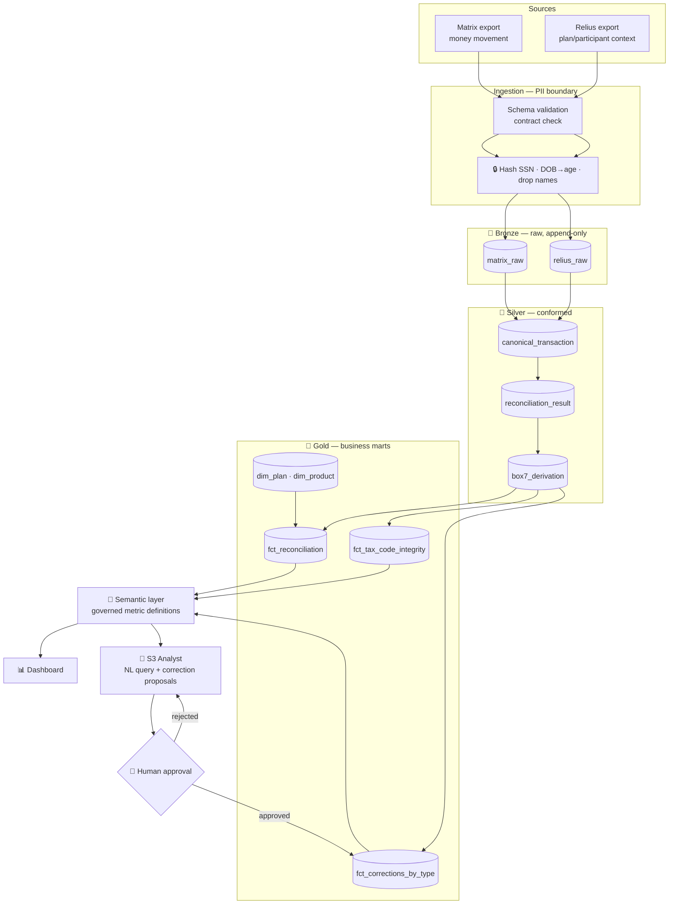

# 🔐 DATAVAULT / 1099 DATA PLATFORM — Full Production Scope v1.0  (🏁 DE/AE FLAGSHIP)

## From Reconciliation Script to Governed Financial Data Platform
## "Every distribution accounted for, every tax code defensible, every correction trending down"

> **Companion:** `DATAVAULT_1099_DATA_PLATFORM_SCOPE_v2_1_STAGE1.md` — the Stage-1 build sheet (what you build first, with code and week-by-week tasks). **This document is the end-state architecture** for the full S1 → S3 arc. It is design-level, not code-level.

**Document Version:** 1.0 (new — created under roadmap v10.0. Absorbs the retired standalone "DataVault Analyst" as the **Stage-3 Applied-AI layer**.)
**Status:** 📋 DRAFT — v10.0-aligned. S2–S3 layers build progressively; nothing here is speculative beyond the earned-overlay rule.
**Last aligned:** v10.0 (2026 Market Realignment).

---

## 🎯 v10.0 ROADMAP ALIGNMENT & STAGE-EVOLUTION ARC — AUTHORITATIVE

> **This block governs.** Where anything below it conflicts, **this block wins.**

**Aligned to:** Career Roadmap **v10.0 (2026 Market Realignment)**.

**Governing model:** **3 stages, not 5.** The retired 14-month "ML Engineer" stage is now an **embedded ML-literacy module inside Stage 3** (earned-overlay — ships only if it beats the baseline). The destination title is **Applied AI Engineer → Forward Deployed Engineer (FDE)**; the retired "Senior LLM Engineer" title is dropped. **This project is ONE system that evolves across stages — never rebuilt per stage.**

**Portfolio role:** 🏁 **Flagship (lead)** — the **Data Engineering / Analytics Engineering flagship**; retains scheduling priority (it feeds the first external move at Months 12–14). In v10.0, **flagship vs supporting = size & emphasis, not a quality tier — every project is production-grade.**

**Stage-evolution arc:**

| Stage | Theme | This project's layer |
|---|---|---|
| **S1** | Foundation (GenAI-first core) | Reconciliation core — Matrix + Relius ingest → canonical model → reconcile → **1099-R Box-7 derivation & validation** → corrections analytics + narrow evaluated GenAI explanation layer. |
| **S2** | DE/AE hardening | **Governed data platform** — medallion bronze/silver/gold, dbt models with tests, data contracts, idempotent Airflow orchestration, warehouse, **semantic/metrics layer**, ECS/Terraform, monitoring + postmortem. |
| **S3** | Applied AI (RAG/agentic + eval) | **The DataVault *Analyst*** — natural-language querying + AI-assisted correction proposals over the marts (text-to-SQL / RAG, PII-safe, structured outputs, **HITL on every write**) + three-layer eval + Arize Phoenix. |

- **Every project's S2 adds:** ingestion → **dbt-tested models (CI-gated)** → **data contracts** (Great Expectations) → warehouse/lakehouse → **Airflow** (idempotent runs) → Docker/**ECS** → monitoring + written **postmortem** → **semantic/metrics layer**.
- **Every project's S3 adds:** RAG/agentic layer + **three-layer eval** (per-query metrics · trajectory tracing · drift vs frozen golden set) + **observability (Arize Phoenix, OTel-native, free)** + MCP + **HITL** on irreversible actions.

**Production standard (non-negotiable, ALL projects):** business-outcome headline · Mermaid diagram · **C4 Context diagram (+ Container view on lead flagships)** 🆕 · **`docs/adr/` — numbered, immutable Architecture Decision Records (context → decision → consequences)** 🆕 · Dockerfile · eval-metrics table · 15–30s demo GIF · "What I Learned" · **synthetic data only in public repos** · `pyproject.toml` + `src/` + `py.typed` + ruff + mypy · Conventional Commits. *(🆕 C4 + ADR added per roadmap v10.0 CORRECTION 8, July 2026 — additive documentation discipline: the decision-and-defense artifacts Applied-AI/FDE interviews probe; same doc version, no structural change.)*

**Fold-in note:** the former standalone *DataVault Analyst* (PandasAI "chat with your data") is the **S3 layer of this platform**, not a separate project. **Public repo = synthetic-data reconstruction**; the deployed Daybright system (real 450+ bad-tax-code catch, ~$15K/yr, ~95% manual-time reduction) is the résumé line and stays private.

---

## 1. Executive Summary

The end state is a **governed financial data platform** that a reviewer can audit end to end: two disagreeing systems of record land in an immutable raw layer, get conformed into a trustworthy canonical layer, and surface as reconciliation and tax-integrity marts with **governed metric definitions** — orchestrated idempotently, contract-tested in CI, deployed on containers, monitored, and finally queryable in natural language by an AI layer that **cannot act without a human**.

**The one-sentence claim:** *"I built the platform that makes year-end 1099-R filing defensible — and then put an evaluated AI layer on top of it that proposes corrections without ever taking the decision away from a human."*

### What the End State Proves

| Capability | Evidence a reviewer can check |
|---|---|
| **System design under constraint** | Medallion layering with explicit ownership boundaries; raw layer is append-only and replayable |
| **Trade-off awareness** | Documented choices: DuckDB→Snowflake trigger, batch vs. streaming, tolerance thresholds, when the graph/ML overlay is *rejected* |
| **Failure handling** | Quarantine-not-drop; balance assertions; contract violations block the run; written postmortem on a real incident |
| **Clarity of communication** | Mermaid architecture, README business headline, metric definitions in a semantic layer instead of buried in SQL |
| **Regulated-domain judgment** | Tax-year-pinned Box-7 rules with IRS provenance; PII hashed at the ingestion boundary, not guarded at the output |

---

## 2. Vision: From Reconciliation Script to Governed Platform

| | **Stage 1 (build sheet)** | **End state (this document)** |
|---|---|---|
| **Storage** | Parquet files | **Medallion bronze/silver/gold** on object storage + warehouse |
| **Transformation** | Python functions | **dbt models with tests + lineage**, layer-scoped references |
| **Quality** | pytest assertions | **Data contracts** at every layer boundary, CI-blocking |
| **Scheduling** | Run it manually | **Airflow, idempotent, backfillable**, replay from bronze |
| **Definitions** | Metrics in code | **Semantic/metrics layer** — one governed definition of "correction" |
| **Deployment** | Local Docker | **ECS/Fargate via Terraform**, monitored |
| **AI** | Exception explanations | **NL querying + AI-proposed corrections, HITL-gated, three-layer eval** |

---

## 3. Why This Architecture (grounded, not fashionable)

The medallion pattern is the default organization for lakehouse implementations across Databricks, Microsoft Fabric, and Azure. Two properties make it the right call *here* specifically — and both are about the reconciliation problem, not about following a trend:

1. **Bronze is an audit trail.** Raw data is configured append-only with no in-place updates, because overwriting removes the ability to reprocess history when a transformation bug surfaces months later. For a system whose output is an **IRS filing**, replayability is not a nicety — if a Box-7 rule is found wrong in March, every prior run must be reproducible from raw.
2. **The layers are an ownership contract, not a folder convention.** The failure mode is treating medallion as a storage convention when it is actually a shared agreement about who is responsible for data quality at each stage — engineers own bronze→silver (ingestion, dedup, schema enforcement), analytics engineers own silver→gold (aggregations, dimensional models). Most medallion failures happen before a single pipeline runs, from skipping layer-boundary design.

**The honest trade-off:** this platform is **operational-scale, not big-data-scale**. Delta/Iceberg table formats buy ACID, time travel, and schema evolution; plain Parquet works for read-heavy archives but lacks the transaction log needed for reliable incremental loads. At this volume, DuckDB + Parquet is genuinely sufficient — and **saying so, with the migration trigger written down, is a stronger engineering signal than over-building**.

---

## 4. Platform Architecture



### 4.1 Layer Responsibilities & Ownership

| Layer | Contents | Owner lens | Guarantee to the next layer |
|---|---|---|---|
| **Bronze** | Matrix + Relius exports exactly as received, plus provenance columns (`_source_file`, `_ingested_at`, `_batch_id`). **Append-only. No transformations.** | Data Engineer | "Nothing was lost or altered; you can replay any historical run." |
| **Silver** | Canonical transaction model, deduped, typed, conformed. Reconciliation results. Box-7 derivations. | Data Engineer | "One clean, non-duplicated version of each transaction, keyed deterministically." |
| **Gold** | Reconciliation facts, tax-integrity facts, corrections-by-type facts, conformed plan/product dimensions. | Analytics Engineer | "Business-ready, definition-stable, safe to put in front of an ops lead or an auditor." |

> **Boundary rule (enforced in dbt):** models reference only their own layer or the one below. Bronze reads sources; silver reads bronze; gold reads silver. Violations fail CI.

> **PII exception to the append-only rule:** bronze holds hashed SSN only — hashing happens **before** the bronze write, at the ingestion boundary. This deliberately trades a small amount of replay fidelity (you cannot re-derive a raw SSN) for the guarantee that **no downstream layer can leak what it never received**. That trade is correct for this domain and is documented as such.

---

## 5. dbt Project Design

```
models/
├── bronze/          # source definitions + light standardization
│   ├── _sources.yml            # freshness + schema contracts on raw
│   ├── br_matrix_transactions.sql
│   └── br_relius_distributions.sql
├── silver/
│   ├── _silver__models.yml     # contracts, tests, docs
│   ├── sv_canonical_transaction.sql    # union + normalize both sources
│   ├── sv_reconciliation.sql           # matched | mismatch | missing | orphan
│   └── sv_box7_derivation.sql          # rules-engine output, tax-year pinned
├── gold/
│   ├── _gold__models.yml
│   ├── dim_plan.sql
│   ├── dim_product.sql
│   ├── fct_reconciliation.sql
│   ├── fct_tax_code_integrity.sql
│   └── fct_corrections_by_type.sql
└── metrics/
    └── metrics.yml             # semantic layer: the governed definitions
```

### 5.1 The Tests That Matter (blocking, not decorative)

| Test | Layer | Why it exists |
|---|---|---|
| `dbt_utils.expression_is_true`: `matched + quarantined = total_ingested` | silver | **The balance assertion.** Nothing silently dropped — the single most important test in the project |
| `unique` + `not_null` on `transaction_key` | silver | Deterministic keying holds; dedup worked |
| `relationships`: every fact → `dim_plan` | gold | No orphan facts in the marts |
| `accepted_values` on `derived_box7` | silver | Rules engine can only emit codes from the pinned tax-year set |
| `not_null` on `break_reason` where `recon_status != 'matched'` | silver | Every quarantined row has a documented cause |
| Freshness on `_sources.yml` | bronze | Stale export detected **before** it silently under-reports |

### 5.2 Semantic / Metrics Layer (the AE story)

The point of the metrics layer is that **"correction rate" means exactly one thing** across the dashboard, the AI layer, and any ad-hoc question — and that the definition is version-controlled and reviewable rather than re-derived in each query.

| Metric | Definition (governed) |
|---|---|
| `match_rate` | `matched / total_ingested`, by period |
| `break_rate_by_type` | `quarantined / total_ingested`, sliced by `break_reason` |
| `box7_disagreement_rate` | `count(derived_box7 != reported_box7) / count(box7_evaluated)` |
| `corrections_by_type` | corrections grouped by transaction type × week/month — **the metric the real system exists to produce** |
| `unresolved_exceptions` | open breaks with no disposition, aged against the filing deadline |

---

## 6. Orchestration (Airflow)

| Property | Design |
|---|---|
| **Cadence** | Weekly reconciliation; monthly corrections roll-up; ad-hoc backfill on demand |
| **Idempotency** | Every task keyed by `logical_date` + `batch_id`; re-running a date produces identical output — **no double-counting** |
| **Replay** | Any historical run reproducible from bronze (this is why bronze is append-only) |
| **Failure policy** | Contract violation or balance-assertion failure → **fail the DAG, alert, do not publish to gold**. A wrong number that reaches an ops lead is worse than a late one |
| **Dependency shape** | ingest → contracts → dbt silver → balance assert → dbt gold → freshness check → publish |
| **Backfill discipline** | Bounded concurrency; backfills never race the scheduled run |

---

## 7. Data Contracts (Great Expectations)

Validation checks at each layer boundary — Great Expectations at bronze-in and silver-out.

| Boundary | Expectations |
|---|---|
| **Bronze in** | Expected columns present; dtypes correct; row count within a sane band vs. trailing weeks; no unexpected nulls in join keys; **schema drift fails loudly** |
| **Silver out** | `transaction_key` unique; amounts non-negative; `distribution_date` within the tax year; `participant_age_at_distribution` plausible (0–120); `derived_box7` ∈ pinned set |
| **Gold out** | Referential integrity to dims; no nulls in metric inputs; period totals tie to silver |

> **Contract violations block the run.** They do not warn. For an IRS-filing input, "publish anyway and flag it" is the wrong default.

---

## 8. The Stage-3 Applied-AI Layer (the DataVault *Analyst*)

This is where the retired standalone project lives now — as a layer on top of governed marts, **not** a chat wrapper over a raw DataFrame. That distinction is the entire point: the AI answers from **modeled, tested, definition-stable data**.

### 8.1 Capabilities

| Capability | Design |
|---|---|
| **Natural-language querying** | Text-to-SQL **against the semantic layer**, not raw tables — so "correction rate" resolves to the governed definition |
| **Retrieval grounding** | RAG over metric definitions, break-reason taxonomy, and tax-year rule provenance — the model retrieves *what the terms mean* before answering |
| **AI-assisted correction proposals** | For a flagged Box-7 disagreement: propose the corrected code **with the rule citation and the evidence** that supports it |
| **Structured outputs** | Frozen Pydantic schemas; no free-text blobs |
| **PII safety** | The marts contain no raw PII (hashed at ingestion). The AI layer physically cannot surface an SSN |
| **Provider routing** | Local Ollama for any sensitive run; cloud APIs for public/synthetic work only |

### 8.2 The HITL Boundary (non-negotiable)

```
AI proposes  →  human reviews (evidence + rule citation shown)  →  human approves/rejects  →  write
```

- The AI **never writes a correction**. It drafts one.
- Every proposal renders **the derived code, the reported code, the rule that fired, and the participant-age/reason inputs** — enough for a human to disagree.
- Rejections are captured as **eval signal**, not discarded.
- **Rationale:** a wrong 1099-R correction is a regulatory event affecting a real person's taxes. This is an irreversible-consequence path in the human sense even though the database write is technically reversible.

### 8.3 Three-Layer Eval + Observability

| Layer | Implementation | Gate |
|---|---|---|
| **Per-query metrics** | RAGAS / DeepEval — faithfulness, answer relevancy, context precision | **faithfulness ≥ 0.9** (financial answers), answer-relevancy ≥ 0.85 |
| **Trajectory tracing** | **Arize Phoenix** (OTel-native, open-source, free) — full call trace, retrieved context, tool calls | Every trace inspectable; no black-box answers |
| **Drift vs. frozen golden set** | Frozen Q&A set built at S1; re-run on every model/prompt change | Regression blocks merge |

Plus a **correction-proposal accuracy** metric: of proposals a human approved, what share exactly matched the expert-labeled correct code? This is the number that decides whether the layer ships at all.

> **Earned-overlay applies.** If the AI layer's proposals are not measurably better than the deterministic rules engine alone, **it does not ship**. The rules engine is the baseline it must beat.

---

## 9. Infrastructure & DevOps

| Concern | Choice | Rationale |
|---|---|---|
| **Compute** | Docker → **ECS/Fargate** | No servers to patch; matches the roadmap's committed AWS DEA-C01 surface |
| **IaC** | **Terraform** | Reviewable, reproducible; "it works on my laptop" is not evidence |
| **Storage** | S3 (bronze/silver Parquet) + **DuckDB → Snowflake** (gold) | Start cheap; migration trigger documented below |
| **Secrets** | AWS Secrets Manager; **never** in env files committed anywhere | |
| **CI** | GitHub Actions — ruff, mypy, pytest, **dbt build + tests**, GE contracts, eval gate | Every gate that matters runs on every PR |
| **Monitoring** | Structured logs → CloudWatch; DAG SLA alerts; freshness alerts; **cost tracking** | |

### 9.1 The Snowflake Migration Trigger (written down in advance)

Move gold to Snowflake when **any** of: (a) concurrent readers exceed what DuckDB serves comfortably, (b) the semantic layer needs to serve BI tools directly, (c) a target employer's stack makes it the demonstration that matters. **Until one fires, DuckDB is the correct answer and the trade-off is documented** — Snowflake pairs canonically with dbt and is the AE-primary "one warehouse deep" choice when it's time.

---

## 10. Security, Compliance & Governance

| Control | Implementation |
|---|---|
| **PII minimization** | SSN hashed at ingestion boundary; names dropped; DOB → age then dropped. Downstream layers never receive raw PII |
| **Public-repo safety** | 100% Faker-generated synthetic data; generator tuned to exercise every break type and Box-7 branch |
| **Audit trail** | Bronze append-only + provenance columns; every correction proposal + human decision logged with actor and timestamp |
| **Rule provenance** | Each Box-7 rule cites the IRS instruction it encodes; **rule set version-pinned per tax year** |
| **Lineage** | dbt-generated lineage — any gold number traceable to the raw rows that produced it |
| **Access** | Least-privilege IAM; marts readable, raw restricted |

> ⚠️ **Tax-rule staleness is the top compliance risk.** Box-7 rules change between tax years. The mitigation is structural: rules live in `config/box7_rules_{tax_year}.yaml`, the tax year is an explicit pipeline parameter, and **an unpinned or unknown tax year fails the run** rather than defaulting to last year's rules.

---

## 11. Tech Stack: Production

| Layer | Technology |
|---|---|
| Language | Python 3.11+, SQL |
| Ingestion | pandas, openpyxl, Pydantic v2 (frozen contracts) |
| Storage | S3 + Parquet (bronze/silver), DuckDB → Snowflake (gold) |
| Transformation | **dbt** (models, tests, docs, lineage) |
| Contracts | **Great Expectations** |
| Orchestration | **Apache Airflow** (idempotent, backfillable) |
| Semantic layer | dbt metrics |
| Infra | **Docker → ECS/Fargate**, **Terraform**, GitHub Actions |
| Dashboard | Streamlit + Plotly |
| AI (S3) | Provider-agnostic LLM SDK (local **Ollama** for sensitive; cloud for synthetic), text-to-SQL over the semantic layer, RAG over definitions |
| Structured outputs | Pydantic v2 (frozen schemas) |
| Eval | RAGAS, DeepEval — CI-blocking |
| Observability | **Arize Phoenix** (OTel-native, free), CloudWatch, token/cost/latency tracking |

---

## 12. Project Structure (end state)

```
datavault-1099-platform/
├── src/
│   ├── ingest/        # matrix.py, relius.py, pii.py, contracts.py
│   ├── models/        # transaction.py (frozen canonical contract)
│   ├── recon/         # keys.py, match.py, classify.py, quarantine.py
│   ├── tax/           # box7.py, validate.py
│   ├── analytics/     # corrections.py
│   └── ai/            # provider.py, explain.py (S1), analyst.py (S3),
│                      # schemas.py, guardrails.py, telemetry.py
├── dbt/               # models/{bronze,silver,gold}, metrics/, tests/
├── airflow/dags/      # reconciliation_weekly.py, corrections_monthly.py
├── great_expectations/
├── terraform/         # ecs, s3, iam, secrets
├── config/            # box7_rules_2025.yaml, box7_rules_2026.yaml, tolerances.yaml
├── scripts/           # generate_synthetic_data.py
├── tests/             # unit, contracts, eval, fixtures/ (golden set)
├── docs/              # architecture.md (Mermaid), postmortem.md, what-i-learned.md
├── Dockerfile
└── pyproject.toml
```

---

## 13. Success Metrics

| Stage | Metric | Target |
|---|---|---|
| **S1** | Balance assertion | `matched + quarantined == total_ingested`, always |
| **S1** | Box-7 branch coverage | 100% of branches tested, **both sides of 59½** |
| **S1** | Silent drops | **Zero** |
| **S2** | dbt test pass rate in CI | 100% — failures block merge |
| **S2** | Contract violations reaching gold | **Zero** |
| **S2** | Pipeline idempotency | Re-run of any `logical_date` → byte-identical gold |
| **S2** | Replay | Any historical run reproducible from bronze |
| **S2** | Postmortem | ≥1 written, on a real failure, with the fix |
| **S3** | Faithfulness (financial answers) | **≥ 0.9** |
| **S3** | Answer relevancy | ≥ 0.85 |
| **S3** | Correction-proposal accuracy vs. expert labels | Must **beat the rules-engine baseline** or the layer does not ship |
| **S3** | Autonomous writes | **Zero** — 100% HITL-gated |
| **S3** | PII in generated output | **Zero** (structurally impossible + guardrail-tested) |

---

## 14. Risk Mitigation

| Risk | Severity | Mitigation |
|---|---|---|
| **Tax rules go stale between years** | 🔴 High | Rule set pinned per tax year with IRS provenance; unknown tax year **fails the run** |
| **Silent data loss in reconciliation** | 🔴 High | Balance assertion as a blocking dbt test; quarantine-not-drop |
| **PII leakage** | 🔴 High | Hash at ingestion boundary — downstream cannot leak what it never received; plus output guardrails as defense in depth |
| **AI proposes a wrong correction** | 🔴 High | **HITL on every write**; evidence + rule citation shown; earned-overlay (must beat the rules baseline) |
| **Schema drift from source exports** | 🟡 Med | Contracts at bronze-in fail loudly; freshness checks catch stale exports |
| **Over-engineering for scale that isn't there** | 🟡 Med | Documented migration triggers; DuckDB until a trigger fires — and the reasoning is the signal |
| **Real data leaking into the public repo** | 🔴 High | Synthetic-only generator; CI check rejects any file matching PII patterns; real system stays private |
| **Scope creep from the Analyst layer** | 🟡 Med | S3 is explicitly gated behind S2 completion; S1 ships without it |

---

## 15. Development Phases

| Phase | Stage | Deliverable | Exit criteria |
|---|---|---|---|
| **1** | S1 | Reconciliation core + Box-7 engine + corrections analytics + narrow GenAI explanations | Balance assertion green; Box-7 branches tested; eval gate passed or layer disabled |
| **2** | S2 | Medallion + dbt + contracts + Airflow + warehouse + semantic layer + ECS/Terraform | Contracts enforced in CI; idempotent re-runs; replay from bronze; postmortem written |
| **3** | S3 | Analyst layer — NL query + correction proposals, HITL-gated, three-layer eval + Phoenix | Faithfulness ≥ 0.9; proposals beat the rules baseline; zero autonomous writes |

---

## 16. Project Evolution (3 Stages — v10.0)

| Stage | Role (v10.0) | Layer & production deliverables | Exit criteria |
|---|---|---|---|
| **S1** | Foundation (GenAI-first core) | Matrix + Relius ingest → PII boundary → canonical model → reconcile → Box-7 derivation/validation → corrections analytics → narrow evaluated GenAI explanations. Synthetic data only. | Balance assertion green; every Box-7 branch tested incl. 59½; zero silent drops; eval gate green or layer off. |
| **S2** | DE/AE hardening | Medallion bronze/silver/gold; dbt models + blocking tests; Great Expectations contracts; idempotent Airflow; DuckDB→Snowflake; **semantic/metrics layer**; Docker→ECS via Terraform; monitoring + written postmortem. | Contracts block bad runs; re-runs idempotent; replay from bronze works; postmortem published. |
| **S3** | Applied AI (RAG/agentic + eval) | The **Analyst**: text-to-SQL over the semantic layer + RAG over definitions/rule provenance + AI-proposed corrections, **HITL on every write** + three-layer eval + Arize Phoenix + privacy-routed providers. | Faithfulness ≥ 0.9; correction proposals beat the rules-engine baseline; zero autonomous writes; zero PII in output. |

> **Optional beyond-portfolio extensions (earned-overlay gated, not required):** anomaly detection on break patterns (must beat a rules baseline); multi-recordkeeper support beyond Matrix/Relius; a graph layer over plan/participant relationships (**currently rejected** — the problem is tabular, not graph-shaped; GraphRAG belongs to PolicyPulse/AFC).

---

## Skills Required (Roadmap Alignment — v10.0)

*Maps roadmap **v10.0** skills to how **this specific project** uses them. ✅ = built at Stage 1. Skills escalate **within** the project (S1→S3) — the system is never rebuilt.*

| Skill | Stage | How this project uses it |
|-------|-------|--------------------------|
| Python 3.11+, pandas, numpy, openpyxl | S1 ✅ | Matrix + Relius ingestion; normalization to the canonical model |
| SQL | S1 ✅ | Reconciliation logic; tax-code derivation queries |
| Pydantic v2 | S1 ✅ | **Frozen canonical transaction contract** — what S2/S3 build on without a rewrite |
| Faker / synthetic-data generation | S1 ✅ | Public-repo reconstruction that **exercises every break type and Box-7 branch** |
| Parquet / DuckDB | S1 ✅ | Processed storage |
| **Regulated business-rule engineering** | **S1 ✅** | **IRS 1099-R Box-7 derivation, tax-year-pinned, IRS-cited — the domain edge** |
| **PII boundary engineering** | **S1 ✅** | **Hash-at-ingestion; downstream cannot leak what it never received** |
| Streamlit + Plotly | S1 ✅ | Reconciliation health, tax integrity, corrections trend, exception queue |
| LLM SDK (provider-agnostic) + Pydantic structured outputs | S1 ✅ | Narrow exception-explanation layer (not conversational) |
| DeepEval | S1 ✅ | Blocking gate on the explanation layer |
| Docker, pytest, ruff, mypy, GitHub Actions | S1 ✅ | Production standard |
| **dbt + tests** | **S2** | **Bronze/silver/gold models; the balance assertion as a blocking test; lineage** |
| **Data contracts (Great Expectations)** | **S2** | **Layer-boundary validation; contract violations fail the run** |
| **Medallion lakehouse design** | **S2** | **Append-only replayable bronze; conformed silver; business-ready gold** |
| **Airflow** | **S2** | **Idempotent, backfillable weekly/monthly runs; replay from bronze** |
| **Warehouse (DuckDB → Snowflake)** | **S2** | **Gold marts; migration trigger documented in advance** |
| **Semantic / metrics layer** | **S2** | **One governed definition of "correction rate" — the AE story** |
| **Terraform + AWS (S3, ECS/Fargate, Secrets Manager)** | **S2** | **Reproducible, containerized deployment** |
| **Monitoring + written postmortem** | **S2** | **Failure-handling evidence — what broke, what changed** |
| **Text-to-SQL over a semantic layer** | **S3** | **NL querying that resolves to governed definitions, not raw tables** |
| **RAG** | **S3** | **Grounding over metric definitions + break taxonomy + rule provenance** |
| **HITL approval workflow** | **S3** | **AI drafts corrections; a human decides. Zero autonomous writes** |
| **Three-layer eval + Arize Phoenix** | **S3** | **Per-query (faithfulness ≥ 0.9) · trajectory tracing · drift vs frozen golden set** |
| MCP | S3 | Expose reconciliation/query tools to the agent |
| Anomaly detection (ML) | S3 | Break-pattern detection — **earned-overlay only**; must beat the rules baseline |

> **Domain edge:** these are ordinary DE/AE skills applied to a domain most candidates cannot speak to. The differentiator is not the tooling — it is that the output is an **IRS filing**, and the engineering reflects that.

> **Honest gap:** 1099-R domain rules have **no matching roadmap certification**. The tested rules engine with IRS provenance *is* the evidence.

---

## ✅ Approval Checklist

- [ ] End-state architecture matches the v10.0 DE/AE flagship claim
- [ ] Medallion layering + ownership boundaries are explicit
- [ ] Balance assertion is the headline blocking test
- [ ] Tax-year pinning + IRS provenance is structural, not aspirational
- [ ] PII is minimized at the boundary, not guarded at the output
- [ ] S3 Analyst is HITL-gated with zero autonomous writes
- [ ] Earned-overlay applied: AI layer must beat the rules baseline or not ship
- [ ] Migration/over-engineering trade-offs documented rather than hand-waved
- [ ] Stage-1 companion (`v2_1_STAGE1`) remains the build sheet; no duplication of code-level detail here

---

## 📚 Courses & Certifications — per Stage (v10.0 reference)

*Synced to roadmap **v10.0**. ✅ = committed canon; conditional/platform certs are **take-ONE-only**, matched to a concrete apply-list. Employer-reimbursable certs noted. The shipped production-grade project is the primary hiring signal — certs are tiebreakers.*

### 🎓 Stage 1 — Foundation (GenAI-first core)
- **Courses:** Python for Everybody · AI Python for Beginners · Building with the Claude API (Anthropic Academy — structured outputs) · Mode SQL Tutorial · Docker for Beginners · 30 Days of Streamlit · **CS50P** (Harvard — Python + unit tests/debugging) · **MITx 6.00.1x** (MIT — CS foundations; IBM Applied SWE Fundamentals as secondary)
- **Certifications:** **AI-901** Azure AI Fundamentals (employer-reimbursed) · **AB-620** AI Agent Builder Associate (employer-reimbursed)

### 🎓 Stage 2 — DE/AE hardening
- **Courses:** PostgreSQL for Everybody + use-the-index-luke.com · **dbt Fundamentals + dbt Advanced Learning Paths** · **Astronomer Academy (Airflow 101 + DAG Authoring)** · Terraform Fundamentals (HashiCorp) · Snowflake Data Engineering Professional Certificate · Databricks Academy (Spark) · Apache Kafka 101 (Confluent)
- **Certifications:** **DP-700** Fabric Data Engineer (✅ committed · employer-reimbursed) · **AWS DEA-C01** Data Engineer Associate (✅ committed) · *conditional — take ONE only if the apply-list demands:* SnowPro Core (COF-C03) / DP-750 Azure Databricks / dbt Analytics Engineering

### 🎓 Stage 3 — Applied AI (RAG / agentic + eval)
- **Courses:** AI Agents in LangGraph · LangChain Academy (LangGraph + LangSmith) · Automated Testing for LLMOps · MCP: Build Rich-Context AI Apps (full) · Improving the Accuracy of LLM Applications
- **Certifications:** **Anthropic CCA-F** ($125) · **AI-103** Azure AI Apps & Agents Developer (employer-reimbursed) · **Databricks GenAI Engineer Associate** ($200 — optional; also reads as a DE cert)
- **🆕 Stage 3 deliverable — architecture-defense (v10.0 CORRECTION 8):** ADR set + C4 diagram + **architecture-defense rehearsal** — present and defend the design against a reviewer, mirroring the FDE panel format.

**Focus thread:** Matrix + Relius ingest → PII boundary → canonical contract → reconcile (balance-asserted) → Box-7 derivation (tax-year-pinned) → dbt marts + contracts + semantic layer → NL query + HITL-gated AI corrections.

> **Cert discipline (v10.0):** committed canon = **DP-700 + AWS DEA-C01** (S2) and the S3 GenAI set. Platform certs are a **conditional menu — take exactly ONE**. Keyword-density is a negative signal.

---

**Document Status:** 📋 DRAFT — v10.0-aligned Full-Production companion. Stages: S1 (built first) → S2 (DE/AE) → S3 (Applied AI → FDE). One evolving system.
**Last aligned:** v10.0 (2026 Market Realignment).