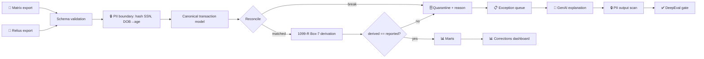

# 🔐 DATAVAULT / 1099 DATA PLATFORM — Stage 1 Project Scope v2.1  (🏁 DE/AE FLAGSHIP)

> **Companion:** `DATAVAULT_1099_DATA_PLATFORM_SCOPE_v1_0_FULL_PRODUCTION.md` — the S1→S3 end-state architecture. **This document is the Stage-1 build sheet.**

## AI-Powered PII-Safe Data Intelligence for Retirement Plan Operations
## "Chat With Your Data" — Production-Grade Natural Language Analytics

**Document Version:** 2.1 (🎯 **v10.0 REALIGNMENT + STAGE-1 REFOCUS** — §1–7 rewritten from the retired "DataVault Analyst / chat-with-Excel" framing to the **1099 reconciliation core** (Matrix + Relius → normalize → reconcile → Box-7 derivation → corrections analytics). The conversational Analyst moved to **S3** in the Full-Production companion. Prior v2.0 note follows.) — v2.0 note: (🎯 **v10.0 REALIGNMENT** — reframed as the **DataVault / 1099 Data Platform**, the DE/AE flagship. The reconciliation core (Matrix + Relius → normalize → reconcile → 1099-R tax codes) is S1–S2; the PandasAI "chat with your data" Analyst is folded in as the **S3 Applied-AI layer** over the marts. 3-stage model; destination Applied AI Engineer → FDE. Prior v1.5 note archived below.)
**Last Updated:** June 16, 2026  
**Status:** 📋 DRAFT — Awaiting Approval  
**Author:** Manuel Reyes  
**Strategic Priority:** 🏁 DE/AE FLAGSHIP — production financial **reconciliation** platform (deployed at Daybright); dual-labeled Data Engineer / Analytics Engineer for keyword coverage.

---


## 🎯 v10.0 ROADMAP ALIGNMENT & STAGE-EVOLUTION ARC — AUTHORITATIVE

> **This block governs.** Where anything below it conflicts (old stage numbers, retired titles, pre-v10.0 portfolio lists), **this block wins.**

**Aligned to:** Career Roadmap **v10.0 (2026 Market Realignment)**.

**Governing model:** **3 stages, not 5.** The retired 14-month "ML Engineer" stage is now an **embedded ML-literacy module inside Stage 3** (earned-overlay — ships only if it beats the baseline). The destination title is **Applied AI Engineer → Forward Deployed Engineer (FDE)**; the retired "Senior LLM Engineer" title is dropped. **This project is ONE system that evolves across stages — never rebuilt per stage.**

**Portfolio role:** 🏁 **Flagship (lead)** — the **Data Engineering / Analytics Engineering flagship**; retains scheduling priority (feeds the first external move). In v10.0, **flagship vs supporting = size & emphasis, not a quality tier — every project is production-grade.** Lead projects get new tooling first and are updated continuously as skills grow.

**Stage-evolution arc:**

| Stage | Theme | This project's layer |
|---|---|---|
| **S1** | Foundation (GenAI-first core) | Reconciliation core — ingest distribution-transaction reports from **Matrix + Relius**, normalize to one transaction model, reconcile across sources, derive & validate **1099-R tax codes**, flag corrections by transaction type × week/month. |
| **S2** | DE/AE hardening | Full DE/AE platform — staging + reconciliation + tax-rule **dbt models with tests** (assert totals reconcile; quarantine unmatched) · warehouse (Postgres/DuckDB → Snowflake) · Airflow (idempotent weekly/monthly) · Docker/ECS · monitoring + postmortem · **semantic/metrics layer** (the AE story). |
| **S3** | Applied AI (RAG/agentic + eval) | Applied-AI layer — the **folded-in DataVault *Analyst***: natural-language querying + AI-assisted corrections/exception explanation over the reconciliation marts (text-to-SQL / RAG, PII-safe, structured outputs, HITL); faithfulness ≥ 0.9 on financial answers + Phoenix tracing. |

- **Every project's S2 adds:** ingestion → **dbt-tested models (CI-gated)** → **data contracts** (Great Expectations) → warehouse/lakehouse → **Airflow** (idempotent runs) → Docker/**ECS** → monitoring + written **postmortem** → **semantic/metrics layer**.
- **Every project's S3 adds:** RAG/GraphRAG/agentic layer + **three-layer eval** (per-query metrics · trajectory tracing · drift vs frozen golden set) + **observability (Arize Phoenix, OTel-native, free)** + MCP + **HITL** on irreversible actions.

**Production standard (non-negotiable, ALL projects):** business-outcome headline · Mermaid diagram · **C4 Context diagram (+ Container view on lead flagships)** 🆕 · **`docs/adr/` — numbered, immutable Architecture Decision Records (context → decision → consequences)** 🆕 · Dockerfile · eval-metrics table · 15–30s demo GIF · "What I Learned" · **synthetic data only in public repos** · `pyproject.toml` + `uv.lock` + `src/` + `py.typed` + ruff + mypy · Conventional Commits. *(🆕 C4 + ADR added per roadmap v10.0 CORRECTION 8, July 2026 — additive documentation discipline: the decision-and-defense artifacts Applied-AI/FDE interviews probe; same doc version, no structural change.)*

**Fold-in note:** the former standalone *DataVault Analyst* (PandasAI "chat with your data") is now the **Stage-3 Applied-AI layer of this platform**, not a separate project — one coherent flagship arc (reconciliation → DE/AE platform → AI query/agentic layer). **Public repo = synthetic-data reconstruction**; the deployed Daybright system (real 450+ bad-tax-code catch) is the résumé line and stays private.

---

## 📋 Table of Contents

1. [Executive Summary](#1-executive-summary)
2. [Strategic Positioning](#2-strategic-positioning)
3. [Business Problem](#3-business-problem)
4. [Data Architecture](#4-data-architecture)
5. [Feature Framework](#5-feature-framework)
6. [Phase 1: Data Pipeline & Traditional Analytics](#6-phase-1-data-pipeline--traditional-analytics-weeks-1-2)
7. [Stage 1 — Phase 2: Tax-Code Validation, Analytics & GenAI Explanations](#7-stage-1--phase-2-tax-code-validation-analytics--genai-explanations-weeks-3-4)
8. [AI Guardrails](#8-ai-guardrails)
9. [Tech Stack](#9-tech-stack)
10. [Project Structure](#10-project-structure)
11. [Synthetic Data Strategy](#11-synthetic-data-strategy)
12. [Success Metrics](#12-success-metrics)
13. [Timeline Summary](#13-timeline-summary)

---

## 1. Executive Summary

**The DataVault / 1099 Data Platform** is the portfolio's **Data Engineering / Analytics Engineering flagship**. It reconstructs — on synthetic data — a **distribution-transaction reconciliation platform** that runs in production at a retirement-plan recordkeeper: two independent systems of record (**Matrix** and **Relius**) are ingested, normalized to a single transaction model, reconciled against each other, and used to **derive and validate IRS Form 1099-R distribution codes**, flagging corrections by transaction type across week and month.

### Why This Is the DE/AE Flagship

| Factor | Why it earns flagship status |
|---|---|
| **Real deployed system behind it** | The production version runs at Daybright: **~$15K annual savings, ~95% reduction in manual reconciliation time**, and a **Dec-2025 catch of 450+ incorrect tax codes** before filing |
| **Genuinely messy, multi-source data** | Two recordkeeping systems that disagree — not a clean Kaggle CSV |
| **Regulated-finance domain edge** | ERISA / IRS 1099-R correctness is a compliance obligation, not a nice-to-have |
| **Full DE/AE surface** | Ingestion → normalization → reconciliation → dbt models + tests → contracts → orchestration → warehouse → semantic layer |
| **Feeds the first external move** | Stage 2 of this project *is* the evidence for the Months 12–14 DE/AE application window |

> **Public vs. private split (non-negotiable):** this repo is a **synthetic-data reconstruction**. Real participant data never leaves Daybright. The deployed system is a **résumé line and interview story**, not a public artifact.

### What Makes This Different From a Tutorial Pipeline

| Dimension | Typical portfolio ETL | This platform |
|---|---|---|
| **Source data** | One clean CSV | **Two disagreeing systems of record** (Matrix + Relius) that must be reconciled |
| **Correctness bar** | "It loaded" | **Reconciliation must balance**; unmatched rows are quarantined, never silently dropped |
| **Business rules** | None | **IRS 1099-R Box-7 distribution-code derivation** validated against participant age, distribution reason, and rollover status |
| **Failure handling** | Job fails, someone notices | **Exception queue + corrections analytics by type × week/month** — the operational feedback loop |
| **PII** | Ignored | Full PII in the production model; **synthetic in public**; guardrails block leakage into any generated output |
| **Evidence** | Screenshot | Business-outcome headline + Mermaid diagram + eval table + demo GIF + "What I Learned" |

### Stage-1 Core Capabilities (THIS SCOPE)

- **Dual-source ingestion:** Matrix + Relius distribution-transaction exports, schema-validated on read
- **Normalization:** both sources mapped to one canonical transaction model (Pydantic-frozen)
- **Reconciliation engine:** match on transaction identity; classify **matched / amount-mismatch / missing-in-source / orphan**; quarantine rather than drop
- **1099-R tax-code derivation & validation:** rules engine derives the expected Box-7 code and flags disagreements with the source system
- **Corrections analytics:** corrections by transaction type × week/month — the metric the real system exists to produce
- **Narrow GenAI layer:** LLM-generated **exception explanations** ("why did this row fail?") with Pydantic structured outputs, PII guardrails, and a blocking DeepEval gate
- **Production practices:** synthetic-data generator, Docker, GitHub Actions CI, ruff/mypy, `pyproject.toml` + `uv.lock` + `src/` + `py.typed`

> **Scope boundary:** the conversational **DataVault *Analyst*** (natural-language querying, PandasAI, chat memory, text-to-SQL over marts) is **not built here** — it is the **Stage-3 Applied-AI layer**. See the Full-Production scope. Stage 1 ships the reconciliation core plus a narrow, evaluated GenAI explanation layer.

---

## 2. Strategic Positioning

### 2.1 Portfolio Role

🏁 **Flagship (lead)** — the **DE/AE flagship**, first in build priority (**DataVault → PolicyPulse → Crucible**). It is the project that must be interview-ready by the **Months 12–14** external application window.

### 2.2 What Each Stage Proves

| Stage | The claim a reviewer can verify |
|---|---|
| **S1** | "I can take two disagreeing financial systems and produce a reconciliation that balances, with regulated tax-code rules encoded and tested." |
| **S2** | "I can turn that into a governed data platform — dbt models with tests, data contracts, idempotent orchestration, a warehouse, and a semantic layer." |
| **S3** | "I can put an evaluated AI layer on top of it that answers questions and proposes corrections **without a human losing control**." |

### 2.3 Dual-Labeling (keyword coverage)

Labeled **Data Engineer / Analytics Engineer** in the README and "Open to" fields for searchability. The AE lean is deliberate: reconciliation + tax-rule modeling + a semantic/metrics layer is analytics-engineering work, and it is where the regulated-finance domain edge is worth the most.

### 2.4 Honest Limitation

Volume here is **operational-scale, not big-data-scale**. This project does not claim Spark-scale throughput; it claims **correctness under regulatory constraint**, which is the harder and rarer signal in financial data engineering. Streaming/scale skills are demonstrated elsewhere (Crucible's market-data lakehouse).

---

## 3. Business Problem

### 3.1 Context

Retirement-plan distributions are recorded in **two systems that do not agree by default**:

- **Matrix** — the trust/custodial platform; authoritative for **money movement** (what was actually paid, when, by what method)
- **Relius** — the recordkeeping platform; authoritative for **plan/participant context** (distribution reason, vesting, loan status)

Year-end **Form 1099-R** reporting requires a single, correct view of each distribution — including the **Box-7 distribution code**, which determines the participant's tax treatment. When the two systems disagree, or when a Box-7 code is derived from stale context, the result is a **corrected 1099-R (Form 1099-R with the CORRECTED box checked)** — costly, reputationally damaging, and painful for the participant.

### 3.2 The Manual Process Being Replaced

- Export both systems to Excel; eyeball them side by side
- Sort/filter to find mismatches; no systematic quarantine
- Tax codes spot-checked, not systematically validated
- No trend view — nobody knows whether corrections are getting better or worse
- Findings live in someone's inbox; no audit trail

### 3.3 What the Platform Delivers

1. **Ingest** both exports on a schedule, schema-validated
2. **Normalize** to one canonical transaction model
3. **Reconcile** — every transaction lands in exactly one bucket: matched, amount-mismatch, missing-in-source, or orphan
4. **Derive & validate** the expected 1099-R Box-7 code; flag disagreements with the source
5. **Quantify** corrections by transaction type × week/month — so the operation can see whether it is improving
6. **Explain** exceptions in plain language (GenAI layer, structured + evaluated + PII-guarded)

### 3.4 Business Questions the Platform Answers

| Category | Example question |
|---|---|
| **Reconciliation health** | "How many transactions failed to match between Matrix and Relius last week?" |
| **Break classification** | "What share of breaks are amount mismatches vs. missing records?" |
| **Tax-code integrity** | "Which distributions have a Box-7 code that disagrees with the derived expectation?" |
| **Corrections trend** | "Are corrections by transaction type trending down month over month?" |
| **Root-cause slice** | "Which product types and payment methods generate the most breaks?" |
| **Filing readiness** | "How many unresolved exceptions remain before the 1099-R filing deadline?" |

### 3.5 Success Definition

The platform succeeds when **every transaction is accounted for** (matched or explicitly quarantined with a reason), **every Box-7 code is either confirmed or flagged**, and the **corrections trend is visible** — before the filing deadline, not after.

---

## 4. Data Architecture

### 4.1 Source A — Matrix Distribution Export (money movement)

| Column | Type | PII? | Sample | Role |
|---|---|---|---|---|
| `Transaction ID` | string | No | MTX-2025-004417 | Source key |
| `Plan ID` | string | Quasi | PLN-001 | Join key |
| `SSN` | string | ⚠️ **YES** | 123-45-6789 | Participant join key |
| `Distribution Date` | date | No | 2025-06-15 | Event date |
| `Gross Amount` | decimal | No | 25000.00 | **Reconciliation field** |
| `Federal Withholding` | decimal | No | 5000.00 | **Reconciliation field** |
| `Net Amount` | decimal | No | 20000.00 | **Reconciliation field** |
| `Payment Method` | string | No | ACH, Wire, Check | Analytics dimension |
| `Status` | string | No | Settled, Pending, Void | Filter |

### 4.2 Source B — Relius Distribution Export (plan/participant context)

| Column | Type | PII? | Sample | Role |
|---|---|---|---|---|
| `Distribution ID` | string | No | REL-2025-118842 | Source key |
| `Plan ID` | string | Quasi | PLN-001 | Join key |
| `SSN` | string | ⚠️ **YES** | 123-45-6789 | Participant join key |
| `Date of Birth` | date | ⚠️ **YES** | 1975-03-22 | **Drives age-based Box-7 logic** |
| `Distribution Reason` | string | No | Termination, Hardship, Death, Disability, RMD | **Drives Box-7 logic** |
| `Rollover Indicator` | bool | No | true / false | **Drives Box-7 logic** |
| `Loan Offset Indicator` | bool | No | true / false | **Drives Box-7 logic** |
| `Roth Indicator` | bool | No | true / false | **Drives Box-7 logic** |
| `Gross Amount` | decimal | No | 25000.00 | **Reconciliation field** |
| `Reported Box 7 Code` | string | No | 1, 2, 3, 4, 7, G, L, M | **The value under validation** |
| `Product Type` | string | No | MBDI, MBDII, PLAT | Analytics dimension |

### 4.3 Canonical Transaction Model (Pydantic — frozen contract)

Both sources map to one model. **The contract is frozen at Stage 1** — this is what lets Stage 2's dbt models and Stage 3's AI layer build on top without a rewrite.

```
CanonicalTransaction
  transaction_key      # deterministic: hash(plan_id, ssn_hash, distribution_date, gross_amount)
  plan_id
  ssn_hash             # salted hash — raw SSN never leaves the ingestion boundary
  distribution_date
  gross_amount, federal_withholding, net_amount
  distribution_reason, rollover_flag, loan_offset_flag, roth_flag
  participant_age_at_distribution   # derived from DOB; drives the 59½ rule
  reported_box7                      # from Relius
  derived_box7                       # computed by the rules engine
  source_system_present              # {matrix, relius, both}
  recon_status                       # matched | amount_mismatch | missing_in_source | orphan
  break_reason                       # populated when recon_status != matched
```

### 4.4 The 1099-R Box-7 Rules Engine

Box 7 tells the IRS how a distribution is taxed. The engine derives the **expected** code from participant age and distribution context, then compares it to what Relius reported.

| Derived code | Condition (illustrative — the engine encodes the authoritative rule set) |
|---|---|
| `7` — Normal distribution | Participant **age ≥ 59½** at distribution date, no rollover/offset |
| `1` — Early distribution, no known exception | Age **< 59½**, no qualifying exception |
| `2` — Early distribution, exception applies | Age **< 59½**, qualifying exception present |
| `3` — Disability | Distribution reason = Disability |
| `4` — Death | Distribution reason = Death (beneficiary distribution) |
| `G` — Direct rollover | Rollover indicator true |
| `L` — Loan treated as distribution | Deemed-distribution loan |
| `M` — Qualified plan loan offset | Loan offset indicator true |

> ⚠️ **Correctness discipline:** the code table above is **illustrative of the pattern, not a substitute for the IRS instructions**. The engine's rule set must be sourced from the **current-year IRS Instructions for Forms 1099-R and 5498** and **version-pinned per tax year** — Box-7 rules change. Every rule carries a test with a worked example, and the **59½ boundary is tested explicitly** (the single highest-value edge case, and the source of the real system's Dec-2025 catch).

### 4.5 Reconciliation Rules

| Bucket | Condition | Disposition |
|---|---|---|
| **matched** | Present in both; all reconciliation fields within tolerance | Pass through to marts |
| **amount_mismatch** | Present in both; gross/withholding/net differ beyond tolerance | **Quarantine** + break_reason |
| **missing_in_source** | Present in one system only, expected in both | **Quarantine** + break_reason |
| **orphan** | Cannot be keyed to a plan/participant | **Quarantine** + break_reason |

**Non-negotiable:** quarantined rows are **never dropped**. Totals must reconcile: `matched + quarantined == total ingested`. This assertion is a **blocking test**.

### 4.6 PII Classification & Handling

```yaml
pii_handling:
  ingestion_boundary:              # raw PII exists only here
    - SSN                          # hashed with a per-environment salt immediately on read
    - First Name / Last Name       # dropped — not needed downstream
    - Date of Birth                # converted to participant_age_at_distribution, then dropped

  never_downstream:                # nothing past ingestion sees raw PII
    - raw SSN, names, DOB

  genai_guardrails:                # exception-explanation layer
    - SSN pattern  -> BLOCKED from any generated output (regex scan pre-display)
    - Names        -> BLOCKED (known-values scan)
    - DOB pattern  -> BLOCKED (date pattern scan)
    - Explanations reference transaction_key + break_reason ONLY

  public_repo:                     # GitHub / demo
    - 100% Faker-generated; realistic distributions, zero real records
    - Age/reason/rollover mixes tuned to exercise every Box-7 branch

  safe_columns:
    - transaction_key, plan_id (anonymized), amounts, dates, product type, payment method
```

> **Design note:** hashing SSN at the ingestion boundary — rather than carrying PII through and guarding it at the output — is the stronger pattern. Downstream layers **cannot** leak what they never received.

### 4.7 Synthetic Data Strategy

The generator must produce data that **exercises the failure modes**, not just happy paths: deliberate amount mismatches, records missing from one system, orphans, participants on both sides of the 59½ boundary, and every Box-7 branch. A pipeline that only ever sees clean data proves nothing.

---

## 5. Feature Framework

### 5.1 Reconciliation Engine (core — no API key required)

| Feature | Implementation | Why it matters |
|---|---|---|
| **Dual-source ingestion** | Schema-validated readers for Matrix + Relius exports | Fails loudly on schema drift instead of corrupting downstream |
| **Canonical normalization** | Both sources → frozen Pydantic model; SSN hashed at boundary | The contract Stage 2/3 build on |
| **Deterministic matching** | `transaction_key` hash; tolerance-based amount comparison | Reproducible — same inputs, same buckets |
| **Break classification** | matched / amount_mismatch / missing_in_source / orphan + reason | The operational output |
| **Balance assertion** | `matched + quarantined == total ingested` — blocking test | Proves nothing is silently dropped |

### 5.2 Tax-Code Validation

| Feature | Implementation | Why it matters |
|---|---|---|
| **Box-7 derivation** | Rules engine over age + reason + rollover/offset/Roth flags | Encodes the regulated logic as tested code |
| **Disagreement flagging** | `derived_box7 != reported_box7` → exception | **This is the 450+ catch, reproduced** |
| **Tax-year pinning** | Rule set versioned per tax year | Box-7 rules change; silent staleness is the failure mode |
| **59½ boundary tests** | Explicit worked examples either side of the threshold | Highest-value edge case in the domain |

### 5.3 Corrections Analytics Dashboard

| Page | Visualizations | Filters |
|---|---|---|
| **📊 Reconciliation Health** | KPI cards (total ingested, matched %, open breaks), match-rate trend | Date range, source system |
| **🧾 Tax-Code Integrity** | Box-7 disagreements by code, derived-vs-reported confusion matrix | Date range, product type |
| **📈 Corrections Trend** | Corrections by transaction type × week/month, direction-of-travel | Transaction type, date range |
| **🔍 Exception Queue** | Break list with reason, drill-through to the transaction, explanation | Break reason, status |

### 5.4 GenAI Exception-Explanation Layer (narrow, evaluated)

| Feature | Implementation | Why it matters |
|---|---|---|
| **Plain-language break explanation** | LLM SDK (provider-agnostic) → Pydantic-validated `ExceptionExplanation` | Turns a break code into something an ops lead can act on |
| **Structured outputs only** | Frozen response schema; no free-text blobs | Testable, renderable, non-hallucinatory by construction |
| **PII guardrails** | Output scanned before display; inputs never contain raw PII | Defense in depth |
| **Blocking eval gate** | DeepEval faithfulness + answer-relevancy on a frozen golden set | **Ships only if it passes — eval-first** |
| **Graceful degradation** | Everything above works with no API key; explanations are additive | The platform is never AI-dependent |

> **Deliberately NOT in Stage 1:** conversational chat, PandasAI, chat memory, chart generation from prompts, text-to-SQL. Those are the **Stage-3 Analyst layer**.

### 5.5 User Flow

```
Matrix export ─┐
               ├─→ validate → normalize (hash SSN) → reconcile → derive Box-7 → classify
Relius export ─┘                                          │
                                                          ├─→ matched   → marts → dashboard
                                                          └─→ breaks    → exception queue
                                                                              └─→ GenAI explanation (evaluated, PII-guarded)
```

---

## 6. Stage 1 — Phase 1: Ingestion, Normalization & Reconciliation (Weeks 1-2)

### 6.1 Week 1: Scaffold, Dual-Source Ingestion & Synthetic Data

| Task | Details | Output |
|---|---|---|
| **Project scaffold** | Repo, CI/CD, README, `pyproject.toml` + `uv.lock` + `src/` + `py.typed`, ruff, mypy, LICENSE, Makefile | Green CI pipeline |
| **Matrix reader** | Schema-validated loader (expected columns, types, row counts) | `src/ingest/matrix.py` |
| **Relius reader** | Schema-validated loader | `src/ingest/relius.py` |
| **PII boundary** | Salted SSN hashing, DOB → age derivation, name drop — **at read time** | `src/ingest/pii.py` |
| **Canonical model** | Frozen Pydantic `CanonicalTransaction` + normalizers from both sources | `src/models/transaction.py` |
| **Synthetic generator** | Faker-based; **injects breaks and spans every Box-7 branch** | `scripts/generate_synthetic_data.py` |
| **Schema-drift tests** | Missing column / renamed column / wrong dtype → fails loudly | `tests/test_ingest.py` |

### 6.2 Week 2: Reconciliation Engine & Balance Assertions

| Task | Details | Output |
|---|---|---|
| **Transaction keying** | Deterministic `transaction_key` hash | `src/recon/keys.py` |
| **Matching + tolerance** | Amount comparison with configured tolerance | `src/recon/match.py` |
| **Break classification** | matched / amount_mismatch / missing_in_source / orphan + reason | `src/recon/classify.py` |
| **Balance assertion** | `matched + quarantined == total ingested` — **blocking** | `tests/test_balance.py` |
| **Quarantine store** | Breaks persisted with reason + provenance; never dropped | `src/recon/quarantine.py` |
| **Golden-set fixtures** | Hand-built cases per break type — the regression spine | `tests/fixtures/` |

---

## 7. Stage 1 — Phase 2: Tax-Code Validation, Analytics & GenAI Explanations (Weeks 3-4)

### 7.1 Week 3: Box-7 Rules Engine & Corrections Analytics

| Task | Details | Output |
|---|---|---|
| **Box-7 rules engine** | Derive expected code from age + reason + flags; **tax-year-pinned rule set** | `src/tax/box7.py` |
| **Rule provenance** | Each rule cites the IRS instruction it encodes; version-pinned per tax year | `config/box7_rules_{tax_year}.yaml` |
| **59½ boundary tests** | Worked examples either side of the threshold | `tests/test_box7.py` |
| **Disagreement flagging** | `derived != reported` → exception with both values | `src/tax/validate.py` |
| **Corrections analytics** | Corrections by transaction type × week/month | `src/analytics/corrections.py` |
| **Dashboard** | Reconciliation Health, Tax-Code Integrity, Corrections Trend, Exception Queue | `app/` (Streamlit + Plotly) |

### 7.2 Week 4: GenAI Explanation Layer, Eval Gate & Ship

| Task | Details | Output |
|---|---|---|
| **Provider abstraction** | Provider-agnostic LLM layer (config-selected; local Ollama option for sensitive runs) | `src/ai/provider.py` |
| **Structured outputs** | Frozen `ExceptionExplanation` Pydantic schema | `src/ai/schemas.py` |
| **Explanation generator** | Break → plain-language cause + suggested next action | `src/ai/explain.py` |
| **PII guardrails** | Output scan (SSN/name/DOB patterns) before display | `src/ai/guardrails.py` |
| **Eval gate (blocking)** | DeepEval faithfulness + answer-relevancy vs. **frozen golden set**; CI-blocking | `tests/test_eval.py` |
| **Observability** | Token/cost/latency per call, structured logging | `src/ai/telemetry.py` |
| **Ship evidence** | Business-outcome README headline, **Mermaid diagram**, Dockerfile, eval-metrics table, **15–30s demo GIF**, "What I Learned" | Repo root |

### 7.3 Stage-1 Exit Criteria

- [ ] Balance assertion green: `matched + quarantined == total ingested`
- [ ] Every Box-7 branch covered by a test, including **both sides of 59½**
- [ ] Rule set **version-pinned to a tax year** with IRS-instruction provenance per rule
- [ ] Breaks quarantined with reasons — **zero silent drops**
- [ ] Corrections-by-type × week/month reproduced on synthetic data
- [ ] GenAI explanations pass the **blocking** DeepEval gate, or the layer ships disabled
- [ ] Zero PII in any generated output (guardrail tests green)
- [ ] Production standard complete (Mermaid, Dockerfile, eval table, GIF, "What I Learned")

---

## 8. AI Guardrails

### 8.1 PII Leak Prevention (Critical)

```yaml
pii_scan:
  patterns:
    - ssn: "\\b\\d{3}-\\d{2}-\\d{4}\\b"
    - phone: "\\b\\d{3}[-.]?\\d{3}[-.]?\\d{4}\\b"
    - email: "\\b[\\w.-]+@[\\w.-]+\\.\\w+\\b"
    - dob_pattern: "\\b(0[1-9]|1[0-2])/(0[1-9]|[12]\\d|3[01])/(19|20)\\d{2}\\b"

  action: "BLOCK response, return safe error message"
  logging: "Log blocked query + reason (no PII in logs)"
  test_coverage: ">90% on guardrail functions"
```

### 8.2 Query Scope Validation

```yaml
scope_validation:
  allowed_operations:
    - SELECT (read queries only)
    - Aggregations (count, sum, mean, max, min)
    - Filtering and grouping
    - Visualization generation

  blocked_operations:
    - Data modification (INSERT, UPDATE, DELETE)
    - File system access
    - Network requests
    - Code execution outside pandas scope

  action: "Return friendly message explaining limitation"
```

### 8.3 AI Response Validation

```yaml
response_validation:
  schema: "Pydantic v2 model — every response validated"
  fallback: "If validation fails, return raw text with warning"
  code_review: "Generated code displayed for user inspection"
```

### 8.4 Cost Controls

```yaml
cost_controls:
  caching: "1 hour TTL for identical queries"
  token_limits: "4000 tokens per request"
  rate_limits: "50 queries per session"
  provider_fallback: "If primary fails, try secondary provider"
```

### 8.5 Disclaimer

```yaml
disclaimer:
  text: |
    ⚠️ AI insights are generated responses — verify important findings manually.
    PII columns (SSN, names, DOB) are present in the dataset but blocked from AI responses.
    Generated code is shown for transparency and reproducibility.
  location: "Footer of every AI response"
```

---

## 9. Tech Stack

### Data Pipeline

| Category | Technology |
|----------|------------|
| Language | Python 3.11+ |
| Data Processing | pandas, numpy |
| Excel Handling | openpyxl |
| Storage | Parquet (processed), CSV (synthetic) |
| Synthetic Data | Faker |
| Validation | Pydantic v2 |
| Testing | pytest |
| Linting | Ruff, mypy |
| CI/CD | GitHub Actions |

### Dashboard

| Category | Technology |
|----------|------------|
| Web Framework | Streamlit |
| Charts | Plotly |
| **AI (Primary)** | **LLM SDK — provider-agnostic (config-selected; local Ollama option for sensitive runs)** |
| **AI Scope (S1)** | **Exception explanations only — structured, evaluated, PII-guarded. Conversational/PandasAI querying is the S3 Analyst layer (see Full-Production scope)** |
| **Structured Outputs** | **Pydantic v2 (response validation)** |
| **AI Observability** | **Python logging + token/cost/latency tracking** |
| Hosting | Streamlit Cloud (FREE) |
| **AI Evaluation** | **DeepEval (answer relevancy, faithfulness, hallucination metrics)** |
| **Containerization** | **Docker (Dockerfile + reproducible deployment)** |

---

## 10. Project Structure

```
datavault-analyst/
├── .cursor/
│   ├── rules/                    # Production standards (version-controlled)
│   │   ├── git-workflow.mdc      # alwaysApply: true — branch, commit, PR conventions
│   │   ├── learning-mode.mdc     # alwaysApply: true — learning patterns, skill progression
│   │   ├── python-production-standards.mdc  # alwaysApply: true — code style, types, testing
│   │   ├── streamlit-patterns.mdc    # Auto-attached: app/**/*.py
│   │   ├── ai-sdk-patterns.mdc       # Auto-attached: src/ai/**/*.py
│   │   └── evaluation.mdc           # Auto-attached: tests/test_eval.py
│   ├── commands/                 # Repeatable agent workflows (/command-name)
│   │   ├── draft-issue.md        # /draft-issue <goal>
│   │   ├── task-brief.md         # /task-brief <issue#>
│   │   ├── pr-prep.md            # /pr-prep
│   │   ├── review.md             # /review
│   │   ├── test.md               # /test
│   │   ├── eval.md               # /eval
│   │   └── commit-msg.md         # /commit-msg
│   ├── hooks/                    # Auto-run scripts
│   │   └── format.sh             # Auto-format (black + ruff) after agent edits
│   ├── hooks.json                # Hook configuration
│   └── plans/                    # Saved task briefs per Issue
│       └── issue-XX-task-brief.md
├── .cursorignore                 # Excludes data/logs/venv from Cursor indexing
├── .github/
│   ├── templates/                # Production workflow templates
│   │   ├── issue_template.md     # GitHub Issue format
│   │   ├── project_labels.md     # Approved labels + definitions
│   │   ├── pull_request_template.md  # PR body format
│   │   └── cursor_task_brief.md  # Agent execution contract
│   └── workflows/ci.yml          # GitHub Actions CI
├── config/
│   ├── settings.yaml             # App configuration
│   └── logging.yaml              # Logging configuration
├── data/
│   ├── raw/                      # gitignored — user uploads
│   ├── processed/                # gitignored — production data (contains PII)
│   ├── synthetic/                # ✅ In Git — demo data
│   │   └── sample_operations.csv
│   └── outputs/                  # gitignored — exports
├── logs/                         # gitignored — application logs
│   ├── evaluation/               # ⭐ DeepEval evaluation results
│   ├── pipeline.log              # Data ingestion logs
│   ├── ai.log                    # ⭐ AI observability (tokens, cost, latency)
│   └── app.log                   # Streamlit app logs
├── src/
│   ├── __init__.py
│   ├── py.typed                  # PEP 561 — type hint support marker
│   ├── ingest/
│   │   ├── __init__.py
│   │   ├── loader.py             # Excel loading + validation
│   │   ├── anonymizer.py         # Demo-mode PII replacement (synthetic swap)
│   │   └── validator.py          # Schema validation + PII column detection
│   ├── models/
│   │   ├── __init__.py
│   │   └── transaction.py        # Frozen canonical Pydantic contract
│   ├── recon/                    # ⭐ Reconciliation engine (the S1 core)
│   │   ├── __init__.py
│   │   ├── keys.py               # Deterministic transaction_key hashing
│   │   ├── match.py              # Tolerance-based amount matching
│   │   ├── classify.py           # matched | amount_mismatch | missing | orphan
│   │   └── quarantine.py         # Break persistence — never drop
│   ├── tax/                      # ⭐ 1099-R Box-7 rules engine
│   │   ├── __init__.py
│   │   ├── box7.py               # Tax-year-pinned derivation rules
│   │   └── validate.py           # derived vs reported disagreement flagging
│   ├── analytics/
│   │   ├── __init__.py
│   │   └── corrections.py        # Corrections by type x week/month
│   ├── ai/                       # Narrow GenAI layer (S1: explanations only)
│   │   ├── __init__.py
│   │   ├── provider.py           # Provider-agnostic LLM abstraction
│   │   ├── explain.py            # Break -> plain-language cause + next action
│   │   ├── schemas.py            # Frozen ExceptionExplanation schema
│   │   ├── guardrails.py         # PII leak prevention (output scan)
│   │   └── telemetry.py          # Token/cost/latency tracking
│   └── utils/
│       ├── __init__.py
│       ├── helpers.py            # Shared utilities
│       └── logger.py             # Logging configuration
├── app/
│   ├── main.py                   # Streamlit entry point
│   ├── pages/
│   │   ├── 1_📊_Overview.py      # KPIs + volume summary
│   │   ├── 2_📈_Trends.py        # Time series analysis
│   │   ├── 3_🔄_Breakdown.py     # Product/payment/plan drill-down
│   │   ├── 4_💰_Amounts.py       # Amount distribution analysis
│   │   └── 5_🤖_AI_Chat.py       # Natural language chat interface
│   └── components/
│       ├── filters.py            # Shared filter widgets
│       ├── charts.py             # Reusable Plotly chart builders
│       └── upload.py             # File upload + PII processing widget
├── scripts/
│   └── generate_synthetic_data.py  # Faker-based synthetic generator
├── tests/
│   ├── conftest.py               # Shared fixtures, mock LLM providers, test data
│   ├── test_ingest.py            # Loader, anonymizer, validator tests
│   ├── test_analytics.py         # Metrics calculation tests
│   ├── test_ai_guardrails.py     # ⭐ PII leak + scope guardrail tests
│   ├── test_eval.py              # ⭐ DeepEval AI quality evaluation tests
│   ├── test_synthetic.py         # Synthetic data quality tests
│   └── eval_dataset.json         # ⭐ 30+ query-response pairs for evaluation
├── Dockerfile                    # Container definition for deployment
├── .dockerignore                 # Excludes .git, logs, data/raw, tests from image
├── .env.example                  # Required environment variables template
├── .gitignore
├── LICENSE                       # MIT License
├── Makefile                      # make test, make lint, make eval, make docker-build
├── pyproject.toml                # Project metadata, dependencies, tool config (PEP 621)
└── README.md                     # Professional README with GIF demo
```

---

## 11. Synthetic Data Strategy

### 11.1 Generation Approach

```python
# scripts/generate_synthetic_data.py (simplified preview)

from faker import Faker
import pandas as pd
import random

fake = Faker()

def generate_synthetic_dataset(n_rows: int = 5000) -> pd.DataFrame:
    """Generate realistic retirement plan operations data."""

    plan_names = [f"Plan {chr(65+i)}" for i in range(20)]  # Plan A through Plan T
    product_types = ["MBDI", "MBDII", "PLAT"]
    payment_methods = ["ACH", "Wire", "Check"]
    document_types = ["Distribution", "Loan"]
    statuses = ["Completed", "Pending", "In Review"]

    records = []
    for i in range(n_rows):
        doc_date = fake.date_between(start_date="-8M", end_date="today")
        records.append({
            "Document Handle": f"DH-{doc_date.year}-{i+1:05d}",
            "Document Type": random.choices(document_types, weights=[75, 25])[0],
            "Document Date": doc_date,
            "Date Stored": doc_date,
            "Time Stored": fake.time(),
            "Plan ID": f"PLN-{random.randint(1, 20):03d}",
            "Plan Name": random.choice(plan_names),
            "Product Type": random.choices(product_types, weights=[50, 35, 15])[0],
            "SSN": fake.ssn(),                    # Fake PII for demo mode
            "First Name": fake.first_name(),      # Fake PII for demo mode
            "Last Name": fake.last_name(),        # Fake PII for demo mode
            "Date of Birth": fake.date_of_birth(minimum_age=25, maximum_age=75),
            "Amount": round(random.lognormvariate(9.5, 1.2), 2),  # Realistic distribution
            "Payment Method": random.choices(payment_methods, weights=[60, 25, 15])[0],
            "Status": random.choices(statuses, weights=[80, 15, 5])[0],
        })

    return pd.DataFrame(records)
```

### 11.2 Why Synthetic Data Matters for Portfolio

| Aspect | Benefit |
|--------|---------|
| **Privacy compliance** | Zero risk of real PII on GitHub |
| **Demonstrates skill** | Shows understanding of data governance best practices |
| **Realistic for demos** | Distributions match real-world patterns |
| **Full demo experience** | Fake PII columns let demo mode showcase the complete app including guardrails |
| **Reproducible** | Seeded random generation for consistent demo experience |

---

## 12. Success Metrics

### Phase 1 (Pipeline + Dashboard)

| Metric | Target |
|--------|--------|
| Excel file loads correctly | ✅ Any valid Excel with expected columns |
| PII columns loaded | ✅ SSN, names, DOB available in production DataFrame |
| Validation pass rate | >98% |
| All pre-built metrics working | DV01-DV10 |
| Dashboard pages rendering | 4/4 |
| Test coverage | >80% |
| CI pipeline | Green |

### Phase 2 (AI Chat)

| Metric | Target |
|--------|--------|
| AI chat page working | ✅ |
| Code transparency | 100% — every answer shows generated code |
| Structured outputs | 100% Pydantic-validated |
| Provider switching | Gemini ↔ OpenAI works via config |
| AI observability | Token/cost/latency logged per query |
| PII leak guardrails | >90% test coverage |
| Graceful degradation | Dashboard works without API key |
| Deployment | Live on Streamlit Cloud |
| Page load time | <3 seconds |
| Demo GIF | In README |
| Demo video | 3-5 minutes |


### AI Evaluation Metrics

| Metric | Target |
|--------|--------|
| DeepEval test suite passing | ✅ All evaluation tests green |
| Answer Relevancy score | > 0.8 |
| Faithfulness score | > 0.85 |
| Hallucination rate | < 0.15 |
| Dockerfile builds successfully | ✅ |

### Portfolio Impact

| Platform | Goal |
|----------|------|
| GitHub | Professional README with GIF, live demo link, architecture diagram |
| LinkedIn | Project launch post with screenshots, demo link |
| Streamlit Cloud | Live public demo (synthetic data) |
| Resume | "Built AI-powered PII-safe data analysis tool with natural language interface" |

---


### AI Evaluation Layer (2026 Production Requirement)

Every AI-powered feature includes measurable quality evaluation using DeepEval.

**Framework:** DeepEval (pytest-compatible, open-source)  
**Install:** `uv add deepeval`

| Metric | What It Measures | Target Score |
|--------|-----------------|-------------|
| Answer Relevancy | Does the AI response address the user's question? | > 0.8 |
| Faithfulness | Is the response grounded in provided context? | > 0.85 |
| Hallucination | Does the output contain fabricated info? | < 0.15 |

**Implementation:**
- Evaluation test cases live in `tests/test_eval.py`
- Run with: `deepeval test run tests/test_eval.py`
- Results logged to `logs/evaluation/` for README metrics
- CI pipeline includes evaluation gate (fail build if scores drop)

**Why This Matters for Portfolio:**
Hiring managers in 2026 specifically scan for evaluation-driven development.
Adding measurable AI quality metrics signals production maturity beyond typical junior portfolios.


### Docker Support (Containerization)

**Dockerfile** provided for reproducible local development and deployment.

```dockerfile
# Dockerfile
FROM python:3.11-slim
WORKDIR /app
# uv (Astral) — pinned binary from the official image; lockfile-strict install
COPY --from=ghcr.io/astral-sh/uv:latest /uv /uvx /bin/
COPY pyproject.toml uv.lock ./
RUN uv sync --frozen --no-dev
COPY . .
EXPOSE 8501
CMD ["uv", "run", "streamlit", "run", "app/Home.py", "--server.port=8501"]
```

**`.dockerignore`** (keeps image small and secure):
```
.git
.gitignore
.github/
.cursor/
.env
.env.example
*.md
LICENSE
Makefile
tests/
notebooks/
logs/
data/raw/
data/processed/
data/outputs/
__pycache__/
*.pyc
.pytest_cache/
.venv/
```

**Run locally:**
```bash
docker build -t datavault-analyst .
docker run -p 8501:8501 --env-file .env datavault-analyst
```

**Why This Matters for Portfolio:**
Docker appears in 60%+ of AI/ML job postings. Including a Dockerfile
shows deployment readiness — critical for Junior AI Engineer applications.


---

## 13. Timeline Summary

```
Week 1 ──────── Week 2 ──────── Week 3 ──────── Week 4
  │                │                │                │
  ▼                ▼                ▼                ▼
Scaffold         Reconcile        Box-7 Rules      GenAI + Ship
Matrix reader    Keying           Derivation       Explanations
Relius reader    Matching         59.5 tests       Eval gate
PII boundary     Classify         Disagreements    Guardrails
Canonical model  Balance assert   Corrections      Demo GIF
Synthetic gen    Quarantine       Dashboard        README

├──── Phase 1: Pipeline ────┼──── Phase 2: AI Chat ────┤
     + Traditional Analytics        + AI-Powered Interface
```

### Key Milestones

| Week | Milestone |
|------|-----------|
| **Week 1** | ✅ PII pipeline working, synthetic data generated, CI green |
| **Week 2** | ✅ All 4 dashboard pages rendering with charts and filters |
| **Week 3** | ✅ AI chat answering questions with code transparency |
| **Week 4** | ✅ Deployed to Streamlit Cloud, README with GIF, demo recorded |

---

## ✅ Approval Checklist

- [ ] Data schema correctly defined (15 columns)
- [ ] PII handling strategy approved (SSN/names/DOB loaded in production, AI guardrails block leakage)
- [ ] Two-mode data strategy confirmed (production vs demo)
- [ ] Dashboard pages scoped (4 analytics + 1 AI chat)
- [ ] AI architecture aligned with Operations-Demand-Intelligence and Attention-Flow Catalyst
- [ ] Timeline realistic (4 weeks at 25 hrs/week)
- [ ] Scope focused on Stage 1 (reconciliation core + narrow GenAI; Analyst layer deferred to S3)

---

## Quick Reference

```
┌─────────────────────────────────────────────────────────────┐
│            DATAVAULT ANALYST v1.0                            │
│     ⭐ FIRST AI PROJECT — GenAI Portfolio Launchpad          │
│     PII-Safe Natural Language Data Intelligence              │
├─────────────────────────────────────────────────────────────┤
│  🔐 PII HANDLING                                             │
│     • SSN, names, DOB loaded in production DataFrame         │
│     • AI guardrails block PII from AI responses              │
│     • Regex + known-value scanning before display            │
│     • Synthetic data for GitHub/deploy (Faker library)       │
├─────────────────────────────────────────────────────────────┤
│  📊 TRADITIONAL ANALYTICS (No API Key Required)              │
│     • 4 dashboard pages with Plotly charts                   │
│     • 10 pre-built metrics (DV01-DV10)                       │
│     • Filters: date range, workflow, product, payment        │
│     • Export capability                                       │
├─────────────────────────────────────────────────────────────┤
│  🤖 GENAI LAYER (S1 — narrow, evaluated, PII-guarded)        │
│     • LLM SDK, provider-agnostic (local Ollama option)        │
│     • Exception explanations ONLY (not conversational chat)   │
│     • Frozen Pydantic ExceptionExplanation schema             │
│     • Blocking DeepEval gate vs frozen golden set             │
│     • Governance as code (PII leak prevention guardrails)     │
│     • AI observability (tokens, cost, latency per call)       │
│     • Conversational/text-to-SQL querying -> S3 Analyst layer │
│     • Session-based conversation memory                       │
├─────────────────────────────────────────────────────────────┤
│  🔧 ENGINEERING                                              │
│     • Python logging for debugging + AI observability         │
│     • GitHub Actions CI                                       │
│     • Parquet storage (processed), CSV (synthetic)            │
│     • Streamlit Cloud deployment (FREE)                       │
│     • Test coverage >80%                                      │
├─────────────────────────────────────────────────────────────┤
│  ⏱️ TIMELINE                                                 │
│     • 4 weeks total (25 hrs/week)                            │
│     • Phase 1: Pipeline + Dashboard (Weeks 1-2)              │
│     • Phase 2: AI Chat + Deploy (Weeks 3-4)                  │
├─────────────────────────────────────────────────────────────┤
│  🎯 PORTFOLIO STRATEGY                                       │
│     • FIRST AI project published (before ODI and AFC)        │
│     • Establishes SDK patterns reused in all future projects │
│     • Live demo on Streamlit Cloud for recruiter access       │
│     • README with GIF demo (30-second recruiter test)         │
└─────────────────────────────────────────────────────────────┘
```

---


## Production README Standard

> **v8.2 Cross-Project Standard:** Every project README must include these elements to meet production-grade portfolio quality.

| Element | Description | Format |
|---------|-------------|--------|
| **Mermaid Architecture Diagram** | System flow rendered inline on GitHub — no external images needed | ```` ```mermaid ```` code block |
| **Dockerfile** | Containerized local setup for reproducibility | `Dockerfile` in project root |
| **Evaluation Metrics Table** | DeepEval + pytest results summary showing AI quality measurements | Markdown table in README |
| **Demo GIF** | 15-30 second walkthrough of key functionality | Embedded GIF in README hero section |
| **"What I Learned" Section** | Key technical takeaways, patterns discovered, and challenges overcome | README section before footer |

### Architecture Diagram (Mermaid)



> **Why Mermaid?** Renders directly in GitHub README — no PNG files to maintain, stays in sync with code, signals architectural thinking to recruiters. Recruiters see the diagram without clicking external links.

---

**Date:** May 07, 2026  
**Total Timeline:** 4 weeks  
**Strategic Role:** First AI project to publish — GenAI portfolio launchpad

*"PII-safe data access + SDK-first AI + Structured outputs + Code transparency = Production-grade 'Chat With Your Data' that recruiters actually remember"* 🚀 
---

## Skills Required (Roadmap Alignment — v10.0)

*Maps roadmap **v10.0** skills to how **this specific project** uses them. ✅ = already in hand / built at this stage. Skills escalate **within** the project (S1→S2→S3) — the system is never rebuilt.*

| Skill | Stage | How this project uses it |
|-------|-------|--------------------------|
| Python 3.11+, pandas, numpy, openpyxl | S1 ✅ | Ingest Matrix + Relius distribution reports (Excel/CSV); normalize to one transaction model |
| SQL | S1 ✅ | Reconciliation queries across sources; tax-code derivation logic |
| Pydantic v2 | S1 ✅ | Transaction + 1099-R tax-code schema validation (frozen contract) |
| Faker / synthetic-data generation | S1 ✅ | **Public-repo synthetic reconstruction** — real Daybright data never leaves private |
| Parquet / DuckDB | S1 ✅ | Processed storage layer |
| Streamlit + Plotly | S1 ✅ | Reconciliation + corrections-by-type dashboard |
| LLM SDK (provider-agnostic) | S1 ✅ | **S1: structured exception explanations only.** PandasAI / NL querying = the folded-in *Analyst*, built at **S3** |
| DeepEval | S1 ✅ | Faithfulness / answer-relevancy gates on financial answers |
| Docker, pytest, ruff, mypy, GitHub Actions | S1 ✅ | Production standard (non-negotiable) |
| **dbt + tests** | **S2** | **Staging + reconciliation + tax-rule models; assert totals reconcile; quarantine unmatched** |
| **Data contracts (Great Expectations)** | **S2** | **Quality gates on ingested reports — blocking in CI** |
| **Airflow** | **S2** | **Idempotent weekly/monthly reconciliation runs** |
| **Warehouse (PostgreSQL/DuckDB → Snowflake)** | **S2** | **Marts serving reconciliation + corrections analytics** |
| **Semantic / metrics layer** | **S2** | **The Analytics-Engineering story — governed definitions of "correction", "exception"** |
| **Terraform + AWS (S3, RDS, ECS/Fargate)** | **S2** | **Reproducibly-provisioned, containerized deployment** |
| **Monitoring + written postmortem** | **S2** | **Failure handling evidence — what broke, what you changed** |
| **Text-to-SQL / RAG over marts** | **S3** | **Natural-language querying of the reconciliation marts (PII-safe)** |
| **MCP** | **S3** | **Expose reconciliation/query tools to an agent** |
| **HITL approval** | **S3** | **AI-assisted corrections are advisory — a human approves every write** |
| **Three-layer eval + Arize Phoenix** | **S3** | **Per-query metrics · trajectory tracing · drift vs frozen golden set** |


> **Domain edge:** ERISA-regulated reconciliation is the differentiator — the skills above are ordinary DE/AE skills applied to a domain most candidates can't speak to.

---

## 📚 Courses & Certifications — per Stage (v10.0 reference)

*Synced to roadmap **v10.0**. Names match the roadmap's stage tables; ordered by the stage in which the 1099 / DataVault DE-AE flagship needs them. ✅ = committed canon; conditional/platform certs are **take-ONE-only**, matched to a concrete apply-list. Employer-reimbursable certs noted. The shipped production-grade project is the primary hiring signal — certs are tiebreakers.*

### 🎓 Stage 1 — Foundation (GenAI-first core)
- **Courses:** Python for Everybody · AI Python for Beginners · Building with the Claude API · Mode SQL Tutorial · Docker for Beginners · 30 Days of Streamlit · Pre-processing Unstructured Data (for exception-doc parsing) · **CS50P** (Harvard — Python + unit tests/debugging) · **MITx 6.00.1x** (MIT — CS foundations; IBM Applied SWE Fundamentals as secondary)
- **Certifications:** **AI-901** Azure AI Fundamentals (employer-reimbursed) · **AB-620** AI Agent Builder Associate (employer-reimbursed)

### 🎓 Stage 2 — DE/AE hardening
- **Courses:** PostgreSQL for Everybody + use-the-index-luke.com · dbt Fundamentals + dbt Advanced Learning Paths · Astronomer Academy (Airflow 101 + DAG Authoring) · Apache Kafka 101 (Confluent) · Terraform Fundamentals · Databricks Academy (Spark) · Snowflake Data Engineering Professional Certificate · BigQuery Basics
- **Certifications:** **DP-700** Fabric Data Engineer (✅ committed · employer-reimbursed) · **AWS DEA-C01** Data Engineer Associate (✅ committed) · *conditional — take ONE only if the apply-list demands:* SnowPro Core (COF-C03) / DP-750 Azure Databricks / dbt Analytics Engineering

### 🎓 Stage 3 — Applied AI (RAG / agentic + eval)
- **Courses:** AI Agents in LangGraph · LangChain Academy (LangGraph + LangSmith) · Automated Testing for LLMOps · MCP: Build Rich-Context AI Apps (full) — text-to-SQL / RAG-over-marts patterns
- **Certifications:** **Anthropic CCA-F** ($125) · **AI-103** Azure AI Apps & Agents Developer (employer-reimbursed) · **Databricks GenAI Engineer Associate** ($200 — optional; "also reads as a DE cert")
- **🆕 Stage 3 deliverable — architecture-defense (v10.0 CORRECTION 8):** ADR set + C4 diagram + **architecture-defense rehearsal** — present and defend the design against a reviewer, mirroring the FDE panel format.

**Focus thread:** Matrix + Relius ingest → dbt reconciliation + tax-code models (tests, contracts) → marts + semantic layer → NL query / AI-assisted corrections.