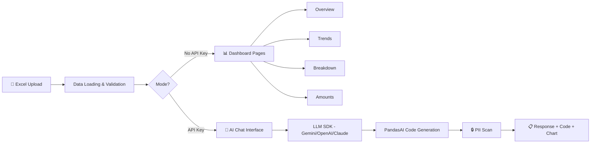

# 🔐 DATAVAULT ANALYST — Complete Project Scope v1.4

## AI-Powered PII-Safe Data Intelligence for Retirement Plan Operations
## "Chat With Your Data" — Production-Grade Natural Language Analytics

**Document Version:** 1.4 (Added §Courses & Certifications reference — ordered by attendance, synced to roadmap v8.4; no functional scope changes from v1.3)  
**Last Updated:** June 16, 2026  
**Status:** 📋 DRAFT — Awaiting Approval  
**Author:** Manuel Reyes  
**Strategic Priority:** ⭐ FIRST AI PROJECT TO PUBLISH — GenAI Portfolio Launchpad

---

## 📋 Table of Contents

1. [Executive Summary](#1-executive-summary)
2. [Strategic Positioning](#2-strategic-positioning)
3. [Business Problem](#3-business-problem)
4. [Data Architecture](#4-data-architecture)
5. [Feature Framework](#5-feature-framework)
6. [Phase 1: Data Pipeline & Traditional Analytics](#6-phase-1-data-pipeline--traditional-analytics-weeks-1-2)
7. [Phase 2: AI-Powered Chat Interface](#7-phase-2-ai-powered-chat-interface-weeks-3-4)
8. [AI Guardrails](#8-ai-guardrails)
9. [Tech Stack](#9-tech-stack)
10. [Project Structure](#10-project-structure)
11. [Synthetic Data Strategy](#11-synthetic-data-strategy)
12. [Success Metrics](#12-success-metrics)
13. [Timeline Summary](#13-timeline-summary)

---

## 1. Executive Summary

**DataVault Analyst** is the **first AI-powered project** in my portfolio — designed to be completed quickly and published before the Operations-Demand-Intelligence and Attention-Flow Catalyst projects. It demonstrates the core GenAI engineering pattern that recruiters care about most in 2026: **taking a single business data source (Excel) and making it queryable through natural language with production-grade PII protections.**

### Why This Project First

| Factor | Why It Wins as First AI Project |
|--------|-------------------------------|
| **Speed to publish** | 4 weeks vs 6-10 weeks for other projects |
| **Immediate AI signal** | Recruiters see GenAI skills in the first 30 seconds of scanning GitHub |
| **Recruiter-friendly demo** | "Upload Excel → Ask questions in English → Get answers" is instantly understood |
| **Shared patterns** | Same SDK architecture reused in Operations-Demand-Intelligence and Attention-Flow Catalyst |
| **PII handling showcase** | Shows data governance maturity beyond typical junior portfolios |

### What Makes This Project Different

| Dimension | Typical "Chat with CSV" Tutorial | DataVault Analyst |
|-----------|----------------------------------|-------------------|
| **Data Context** | Random Kaggle dataset | Retirement plan operations (domain expertise) |
| **PII Handling** | None — upload anything | Full PII in production DataFrame; AI guardrails block leakage; synthetic data for GitHub |
| **Analytics** | AI-only (no fallback) | Hybrid: pre-built dashboards + AI chat (works even without API key) |
| **AI Architecture** | Single provider, raw text | Provider-agnostic SDK (Gemini/OpenAI/Claude) |
| **AI Outputs** | Unstructured text responses | Pydantic-validated structured outputs |
| **Guardrails** | None | Governance as code: PII leak prevention, query validation, read-only |
| **Observability** | None | Token usage, cost tracking, latency monitoring per query |
| **Code Transparency** | Black-box answers | Show generated Pandas code for every AI answer |
| **Deployment** | Local only | Streamlit Cloud (FREE) with live demo |
| **CI/CD** | None | GitHub Actions on every PR |

### Core Capabilities

- **PII-Aware Pipeline:** Full PII (SSN, names, DOB) loaded for production use; AI guardrails prevent PII leakage in responses
- **Traditional Analytics:** Pre-built dashboard pages with filters, charts, and KPI cards (no API key required)
- **AI Chat Interface:** Natural language queries via LLM SDK (Gemini primary) + PandasAI with code transparency
- **Structured Outputs:** Pydantic-validated AI responses with type-safe schemas
- **AI Observability:** Token usage, cost tracking, latency monitoring per query
- **Guardrail System:** PII leak prevention in AI responses, query scope validation, read-only data access
- **Production Practices:** GitHub Actions CI, type hints, comprehensive testing, synthetic data generation

---

## 2. Strategic Positioning

### 2.1 Roadmap Alignment (Stage 1: GenAI-First Data Analyst & AI Engineer)

This project directly delivers on **3 critical roadmap objectives**:

| Roadmap Goal | How DataVault Analyst Delivers |
|-------------|-------------------------------|
| "Build AI-powered dashboards and chatbots" (Stage 1 Strategy) | ✅ Streamlit dashboard + LLM chat interface |
| "LLM SDKs (Gemini, OpenAI, Claude) + LangChain basics" (Month 3-5 Skills) | ✅ Provider-agnostic SDK with Gemini primary |
| "Natural language queries: 'What was revenue in March?' → auto-chart" (Flagship Features) | ✅ Core project feature |

### 2.2 Portfolio Ecosystem

```
PORTFOLIO PROJECT ECOSYSTEM (Stage 1)
═══════════════════════════════════════

1. 1099 Reconciliation Pipeline ✅ DEPLOYED
   └─ Skills: Python, Pandas, ETL, pytest, CI/CD
   └─ Impact: $15K/year savings, 95% time reduction

2. DataVault Analyst ⭐ FIRST AI PROJECT (THIS SCOPE)
   └─ Skills: LLM SDK, PandasAI, Streamlit, PII handling, structured outputs
   └─ Impact: Natural language data access for non-technical users
   └─ AI Pattern: Establishes SDK-first architecture for all future projects

3. Operations-Demand-Intelligence 📅 NEXT
   └─ Skills: Enterprise analytics, demand forecasting, AI insights
   └─ Reuses: AI layer from DataVault Analyst (same SDK patterns)

4. Attention-Flow Catalyst 📅 FLAGSHIP
   └─ Skills: Statistical backtesting, alternative data, trading domain
   └─ Reuses: AI layer from DataVault Analyst (same SDK patterns)
```

### 2.3 The "30-Second Rule" Optimization

Recruiters spend <30 seconds on initial portfolio scan. This project is designed to pass that filter:

- **README hero section:** GIF showing "type question → get answer with chart" in 5 seconds
- **Live demo link:** Streamlit Cloud deployment (click and try immediately)
- **Business impact:** "Enables non-technical staff to query sensitive data safely using natural language"
- **Tech badges:** Python, Streamlit, Gemini SDK, PandasAI, Pydantic, GitHub Actions

---

## 3. Business Problem

### 3.1 Context

In retirement plan operations, team leads and managers regularly need to extract insights from Excel-based operational data containing **sensitive PII** (Social Security Numbers, names, dates of birth). Current process:

- Manual Excel filtering (slow, error-prone)
- Ad-hoc pivot tables (requires Excel expertise)
- Copy-paste to share results (PII exposure risk)
- No audit trail of who queried what

### 3.2 Solution

**DataVault Analyst** provides a secure, AI-powered interface where users can:

1. **Upload** their operational Excel file
2. **Browse** pre-built analytics dashboards (no AI required)
3. **Ask questions** in natural language: *"Show me the top 5 plans by distribution volume this month"*
4. **Get answers** with charts, tables, and the generated Pandas code for transparency
5. **Trust** that PII is never exposed in AI responses or logs

### 3.3 Business Questions the System Answers

| Category | Example Questions |
|----------|------------------|
| **Volume Analysis** | "How many distributions were processed last week?" |
| **Plan Intelligence** | "Which plans have the highest loan volume?" |
| **Product Mix** | "What's the MBDI vs MBDII split for Q4?" |
| **Payment Trends** | "Show ACH vs Wire vs Check distribution over time" |
| **Temporal Patterns** | "Which days of the week have the most requests?" |
| **Amount Analysis** | "What's the average distribution amount by product type?" |
| **Custom Filters** | "Show all distributions over $50K from Plan ABC in December" |
| **Comparative** | "Compare this month's volume to last month by workflow type" |

---

## 4. Data Architecture

### 4.1 Source Data Schema (Excel)

The application processes a single Excel file representing retirement plan transaction data. The schema mirrors real OnBase exports:

| Column | Data Type | PII? | Sample Values | Analytics Use |
|--------|-----------|------|---------------|---------------|
| `Document Handle` | string | No | DH-2025-00001 | Primary key |
| `Document Type` | string | No | Distribution, Loan | Workflow category |
| `Document Date` | date | No | 2025-06-15 | Document creation |
| `Date Stored` | date | No | 2025-06-15 | **Intake date** |
| `Time Stored` | time | No | 14:30:22 | **Intake time** |
| `Plan ID` | string | Quasi | PLN-001 | Plan identifier |
| `Plan Name` | string | Quasi | Acme Corp 401(k) | Plan display name |
| `Product Type` | string | No | MBDI, MBDII, PLAT | **Product mix** |
| `SSN` | string | ⚠️ **YES** | 123-45-6789 | **Participant lookup** |
| `First Name` | string | ⚠️ **YES** | John | **Participant lookup** |
| `Last Name` | string | ⚠️ **YES** | Smith | **Participant lookup** |
| `Date of Birth` | date | ⚠️ **YES** | 1975-03-22 | **Age analysis** |
| `Amount` | decimal | No | 25000.00 | Amount analysis |
| `Payment Method` | string | No | ACH, Wire, Check | **Payment trends** |
| `Status` | string | No | Completed, Pending | Status tracking |

### 4.2 PII Classification & Handling

```yaml
pii_handling:
  loaded_in_production:           # Full PII available for operational use
    - SSN                         # Participant lookup & verification
    - First Name                  # Participant identification
    - Last Name                   # Participant identification
    - Date of Birth               # Age analysis & compliance checks

  ai_guardrails:                  # Prevent PII leakage through AI responses
    - SSN → BLOCKED from AI output (regex scan before display)
    - Names → BLOCKED from AI output (known-values scan)
    - DOB → BLOCKED from AI output (date pattern scan)

  demo_mode_only:                 # Synthetic data for GitHub / Streamlit Cloud
    - SSN → Faker-generated SSN
    - Names → Faker-generated names
    - DOB → Faker-generated DOB
    - Plan ID → anonymized (PLN-001, PLN-002)
    - Plan Name → anonymized ("Plan A", "Plan B")

  safe_columns:
    - Document Handle, Document Type, Document Date
    - Date Stored, Time Stored, Product Type
    - Amount, Payment Method, Status
```

### 4.3 Two-Mode Data Strategy

```
┌──────────────────────────────────────────────────────┐
│               DATA STRATEGY                           │
├──────────────────────────────────────────────────────┤
│                                                       │
│  MODE 1: PRODUCTION (Local Use)                       │
│  ─────────────────────────────                        │
│  • User uploads REAL Excel file                       │
│  • Full PII loaded into DataFrame (SSN, names, DOB)  │
│  • PII available for participant lookup & operations  │
│  • AI guardrails block PII from AI responses          │
│  • .gitignored — never touches GitHub                 │
│                                                       │
│  MODE 2: DEMO (GitHub + Streamlit Cloud)              │
│  ─────────────────────────────────                    │
│  • Pre-generated synthetic data (Faker library)       │
│  • Fake SSNs, names, DOBs — no real PII              │
│  • Realistic distributions matching production        │
│  • Bundled in repo for instant demo                   │
│  • Powers live Streamlit Cloud deployment             │
│                                                       │
└──────────────────────────────────────────────────────┘
```

### 4.4 Storage Structure

```
data/
├── raw/                      # gitignored — user uploads
│   └── uploaded_file.xlsx
├── processed/                # gitignored — production DataFrames (contains PII)
│   └── clean_data.parquet
├── synthetic/                # ✅ IN GIT — demo data
│   └── sample_operations.csv
└── outputs/                  # gitignored — exported reports
```

---

## 5. Feature Framework

### 5.1 Dashboard Pages (Traditional Analytics — No API Key Required)

| Page | Key Visualizations | Filters Available |
|------|--------------------|-------------------|
| **📊 Overview** | KPI cards (total volume, avg amount, unique plans), volume trend line | Date range, workflow type |
| **📈 Trends** | Weekly/monthly volume by workflow type, day-of-week heatmap | Date range, product type |
| **🔄 Breakdown** | Product mix pie chart, payment method distribution, top plans bar chart | Workflow type, date range |
| **💰 Amount Analysis** | Amount distribution histogram, average by product type, tier breakdown | All filters |

### 5.2 AI Chat Interface (Requires API Key)

| Feature | Implementation | Why It Matters |
|---------|----------------|----------------|
| **Natural Language Queries** | LLM SDK (Gemini primary) interprets question → generates Pandas code → executes → returns answer | Core "chat with your data" functionality |
| **Code Transparency** | Every AI answer shows the generated Pandas code in expandable section | Builds trust, shows reproducibility |
| **Chart Generation** | AI can produce Plotly charts as part of answers | Visual answers, not just text |
| **Conversation Memory** | Session-based chat history with context awareness | Follow-up questions work naturally |
| **PII Guardrails** | AI responses scanned for PII patterns before display | Prevents accidental data leakage |
| **Graceful Degradation** | Dashboard pages work fully without AI; chat shows "API key needed" message | Always useful, AI is enhancement layer |

### 5.3 User Flow

```
User uploads Excel file
        │
        ▼
┌─────────────────┐
│  Data Loading    │──→ All columns loaded (including PII)
│  & Validation    │──→ Schema + type validation
│  (Automatic)     │──→ Full DataFrame created
└─────────────────┘
        │
        ├──────────────────────────────┐
        ▼                              ▼
┌─────────────────┐          ┌─────────────────┐
│  📊 Dashboard    │          │  🤖 AI Chat      │
│  Pages           │          │  Interface       │
│                  │          │                  │
│  • Overview      │          │  "What plans had │
│  • Trends        │          │   the most loans │
│  • Breakdown     │          │   last quarter?" │
│  • Amounts       │          │                  │
│  (No API needed) │          │  (API key needed)│
└─────────────────┘          └─────────────────┘
                                      │
                                      ▼
                             ┌─────────────────┐
                             │  AI Response     │
                             │  + Pandas Code   │
                             │  + Chart (if any)│
                             │  + PII Scan ✅   │
                             └─────────────────┘
```

---

## 6. Phase 1: Data Pipeline & Traditional Analytics (Weeks 1-2)

### 6.1 Week 1: Setup, Ingestion & PII Pipeline

| Task | Details | Output |
|------|---------|--------|
| **Project scaffold** | Repo, CI/CD, README, .gitignore, pyproject.toml, LICENSE, Makefile | Green CI pipeline |
| **Excel loader** | `openpyxl` reader with validation (expected columns, types) | `src/ingest/loader.py` |
| **PII anonymizer** | Demo-mode only: replace real PII with synthetic values for GitHub/deploy | `src/ingest/anonymizer.py` |
| **Data validator** | Post-load checks (schema validation, row counts, PII column detection) | `src/ingest/validator.py` |
| **Synthetic data generator** | Faker-based generator matching real distributions | `scripts/generate_synthetic_data.py` |
| **Tests** | Unit tests for loader, anonymizer, validator | `tests/test_ingest.py` |

### 6.2 Week 2: Analytics Engine & Dashboard

| Task | Details | Output |
|------|---------|--------|
| **Metrics engine** | Reusable functions for all KPIs and aggregations | `src/analytics/metrics.py` |
| **Filter system** | Date range, workflow type, product type, payment method | `app/components/filters.py` |
| **Dashboard pages** | 4 Streamlit pages with Plotly charts | `app/pages/*.py` |
| **Chart components** | Reusable chart builders (line, bar, pie, heatmap) | `app/components/charts.py` |
| **Tests** | Unit tests for metrics calculations | `tests/test_analytics.py` |

### 6.3 Key Metrics (Pre-Built)

| ID | Metric | Calculation |
|----|--------|-------------|
| **DV01** | Total volume by workflow type | `df.groupby('Document Type').size()` |
| **DV02** | Weekly volume trend | `df.resample('W', on='Date Stored').size()` |
| **DV03** | Product type mix | `df.groupby('Product Type').size() / len(df)` |
| **DV04** | Payment method distribution | `df.groupby('Payment Method').size()` |
| **DV05** | Top N plans by volume | `df.groupby('Plan Name').size().nlargest(n)` |
| **DV06** | Average amount by product type | `df.groupby('Product Type')['Amount'].mean()` |
| **DV07** | Day-of-week distribution | `df['Date Stored'].dt.dayofweek.value_counts()` |
| **DV08** | Amount tier breakdown | Bins: <$5K, $5K-$25K, $25K-$50K, $50K-$100K, $100K+ |
| **DV09** | Month-over-month volume change | Period-over-period comparison |
| **DV10** | Age band distribution | `pd.cut(age_from_dob, bins=[18,30,45,55,65,100])` |

---

## 7. Phase 2: AI-Powered Chat Interface (Weeks 3-4)

### 7.1 Week 3: LLM SDK Integration & Structured Outputs

| Task | Details | Output |
|------|---------|--------|
| **Provider abstraction** | Provider-agnostic LLM layer (Gemini default, OpenAI/Claude via config) | `src/ai/provider.py` |
| **Pydantic schemas** | Response models for text answers, charts, tables, errors | `src/ai/schemas.py` |
| **PandasAI integration** | SmartDataframe setup with LLM SDK connection | `src/ai/pandas_chat.py` |
| **Code transparency** | Capture and display generated Pandas code per query | Built into chat flow |
| **Guardrails** | PII leak detection in responses, query scope validation | `src/ai/guardrails.py` |
| **Tests** | Unit tests for guardrails, schema validation | `tests/test_ai_guardrails.py` |

### 7.2 Week 4: Chat UI, Observability & Deployment

| Task | Details | Output |
|------|---------|--------|
| **Chat interface** | Streamlit `st.chat_message` with history, input, streaming | `app/pages/5_🤖_AI_Chat.py` |
| **AI observability** | Token count, cost estimation, latency per query, logged to file | `src/ai/observability.py` |
| **Session management** | Conversation memory within session, clear history button | Part of chat page |
| **Export function** | Download filtered data / AI answer as CSV | Part of dashboard + chat |
| **Streamlit Cloud deploy** | Deploy with synthetic data, secrets management for API keys | Live URL |
| **README + demo** | Professional README with GIF, architecture diagram, usage | `README.md` |
| **Demo video** | 3-5 minute walkthrough for LinkedIn/YouTube | Recording |

### 7.3 AI Architecture (SDK-First, 2026 Patterns)

```python
# src/ai/provider.py — Provider-agnostic abstraction

from pydantic import BaseModel
from typing import Literal

class QueryResponse(BaseModel):
    """Structured output for every AI query."""
    answer: str
    generated_code: str          # Pandas code shown to user
    chart_type: str | None       # "bar", "line", "pie", or None
    confidence: Literal["high", "medium", "low"]
    tokens_used: int
    latency_ms: float

class AIProvider:
    """Swap providers via config — zero code changes."""

    def __init__(self, provider: str = "gemini"):
        self.provider = provider
        self._client = self._init_client()

    def query(self, question: str, df_context: str) -> QueryResponse:
        """Send natural language query, get structured response."""
        # 1. Build prompt with DataFrame schema + question
        # 2. Call LLM SDK with structured output schema
        # 3. Validate response with Pydantic
        # 4. Log tokens, cost, latency (observability)
        # 5. Scan response for PII (guardrails)
        # 6. Return validated QueryResponse
        ...
```

### 7.4 PandasAI Integration (Supplementary)

```python
# src/ai/pandas_chat.py — PandasAI for direct DataFrame queries

from pandasai import SmartDataframe

class DataFrameChat:
    """Natural language queries directly on DataFrame."""

    def __init__(self, df, llm_provider):
        self.smart_df = SmartDataframe(
            df,
            config={
                "llm": llm_provider,
                "enable_cache": True,
                "save_charts": True,
                "custom_whitelisted_dependencies": ["plotly"],
                "verbose": True,        # Show generated code
            }
        )

    def ask(self, question: str) -> dict:
        """Query DataFrame in natural language."""
        result = self.smart_df.chat(question)
        code = self.smart_df.last_code_generated
        return {"answer": result, "code": code}
```

---

## 8. AI Guardrails

### 8.1 PII Leak Prevention (Critical)

```yaml
pii_scan:
  patterns:
    - ssn: "\\b\\d{3}-\\d{2}-\\d{4}\\b"
    - phone: "\\b\\d{3}[-.]?\\d{3}[-.]?\\d{4}\\b"
    - email: "\\b[\\w.-]+@[\\w.-]+\\.\\w+\\b"
    - dob_pattern: "\\b(0[1-9]|1[0-2])/(0[1-9]|[12]\\d|3[01])/(19|20)\\d{2}\\b"

  action: "BLOCK response, return safe error message"
  logging: "Log blocked query + reason (no PII in logs)"
  test_coverage: ">90% on guardrail functions"
```

### 8.2 Query Scope Validation

```yaml
scope_validation:
  allowed_operations:
    - SELECT (read queries only)
    - Aggregations (count, sum, mean, max, min)
    - Filtering and grouping
    - Visualization generation

  blocked_operations:
    - Data modification (INSERT, UPDATE, DELETE)
    - File system access
    - Network requests
    - Code execution outside pandas scope

  action: "Return friendly message explaining limitation"
```

### 8.3 AI Response Validation

```yaml
response_validation:
  schema: "Pydantic v2 model — every response validated"
  fallback: "If validation fails, return raw text with warning"
  code_review: "Generated code displayed for user inspection"
```

### 8.4 Cost Controls

```yaml
cost_controls:
  caching: "1 hour TTL for identical queries"
  token_limits: "4000 tokens per request"
  rate_limits: "50 queries per session"
  provider_fallback: "If primary fails, try secondary provider"
```

### 8.5 Disclaimer

```yaml
disclaimer:
  text: |
    ⚠️ AI insights are generated responses — verify important findings manually.
    PII columns (SSN, names, DOB) are present in the dataset but blocked from AI responses.
    Generated code is shown for transparency and reproducibility.
  location: "Footer of every AI response"
```

---

## 9. Tech Stack

### Data Pipeline

| Category | Technology |
|----------|------------|
| Language | Python 3.11+ |
| Data Processing | pandas, numpy |
| Excel Handling | openpyxl |
| Storage | Parquet (processed), CSV (synthetic) |
| Synthetic Data | Faker |
| Validation | Pydantic v2 |
| Testing | pytest |
| Linting | Ruff, mypy |
| CI/CD | GitHub Actions |

### Dashboard

| Category | Technology |
|----------|------------|
| Web Framework | Streamlit |
| Charts | Plotly |
| **AI (Primary)** | **LLM SDK (Gemini primary, OpenAI/Anthropic Claude supported as alternative providers via config swap)** |
| **AI (Supplementary)** | **PandasAI (natural language DataFrame queries)** |
| **Structured Outputs** | **Pydantic v2 (response validation)** |
| **AI Observability** | **Python logging + token/cost/latency tracking** |
| Hosting | Streamlit Cloud (FREE) |
| **AI Evaluation** | **DeepEval (answer relevancy, faithfulness, hallucination metrics)** |
| **Containerization** | **Docker (Dockerfile + reproducible deployment)** |

---

## 10. Project Structure

```
datavault-analyst/
├── .cursor/
│   ├── rules/                    # Production standards (version-controlled)
│   │   ├── git-workflow.mdc      # alwaysApply: true — branch, commit, PR conventions
│   │   ├── learning-mode.mdc     # alwaysApply: true — learning patterns, skill progression
│   │   ├── python-production-standards.mdc  # alwaysApply: true — code style, types, testing
│   │   ├── streamlit-patterns.mdc    # Auto-attached: app/**/*.py
│   │   ├── ai-sdk-patterns.mdc       # Auto-attached: src/ai/**/*.py
│   │   └── evaluation.mdc           # Auto-attached: tests/test_eval.py
│   ├── commands/                 # Repeatable agent workflows (/command-name)
│   │   ├── draft-issue.md        # /draft-issue <goal>
│   │   ├── task-brief.md         # /task-brief <issue#>
│   │   ├── pr-prep.md            # /pr-prep
│   │   ├── review.md             # /review
│   │   ├── test.md               # /test
│   │   ├── eval.md               # /eval
│   │   └── commit-msg.md         # /commit-msg
│   ├── hooks/                    # Auto-run scripts
│   │   └── format.sh             # Auto-format (black + ruff) after agent edits
│   ├── hooks.json                # Hook configuration
│   └── plans/                    # Saved task briefs per Issue
│       └── issue-XX-task-brief.md
├── .cursorignore                 # Excludes data/logs/venv from Cursor indexing
├── .github/
│   ├── templates/                # Production workflow templates
│   │   ├── issue_template.md     # GitHub Issue format
│   │   ├── project_labels.md     # Approved labels + definitions
│   │   ├── pull_request_template.md  # PR body format
│   │   └── cursor_task_brief.md  # Agent execution contract
│   └── workflows/ci.yml          # GitHub Actions CI
├── config/
│   ├── settings.yaml             # App configuration
│   └── logging.yaml              # Logging configuration
├── data/
│   ├── raw/                      # gitignored — user uploads
│   ├── processed/                # gitignored — production data (contains PII)
│   ├── synthetic/                # ✅ In Git — demo data
│   │   └── sample_operations.csv
│   └── outputs/                  # gitignored — exports
├── logs/                         # gitignored — application logs
│   ├── evaluation/               # ⭐ DeepEval evaluation results
│   ├── pipeline.log              # Data ingestion logs
│   ├── ai.log                    # ⭐ AI observability (tokens, cost, latency)
│   └── app.log                   # Streamlit app logs
├── src/
│   ├── __init__.py
│   ├── py.typed                  # PEP 561 — type hint support marker
│   ├── ingest/
│   │   ├── __init__.py
│   │   ├── loader.py             # Excel loading + validation
│   │   ├── anonymizer.py         # Demo-mode PII replacement (synthetic swap)
│   │   └── validator.py          # Schema validation + PII column detection
│   ├── analytics/
│   │   ├── __init__.py
│   │   └── metrics.py            # Pre-built metrics (DV01-DV10)
│   ├── ai/                       # ⭐ AI integration layer (2026 patterns)
│   │   ├── __init__.py
│   │   ├── provider.py           # Provider-agnostic LLM abstraction
│   │   ├── pandas_chat.py        # PandasAI integration
│   │   ├── schemas.py            # Pydantic response models (structured outputs)
│   │   ├── guardrails.py         # PII leak prevention + scope validation
│   │   └── observability.py      # Token/cost/latency tracking
│   └── utils/
│       ├── __init__.py
│       ├── helpers.py            # Shared utilities
│       └── logger.py             # Logging configuration
├── app/
│   ├── main.py                   # Streamlit entry point
│   ├── pages/
│   │   ├── 1_📊_Overview.py      # KPIs + volume summary
│   │   ├── 2_📈_Trends.py        # Time series analysis
│   │   ├── 3_🔄_Breakdown.py     # Product/payment/plan drill-down
│   │   ├── 4_💰_Amounts.py       # Amount distribution analysis
│   │   └── 5_🤖_AI_Chat.py       # Natural language chat interface
│   └── components/
│       ├── filters.py            # Shared filter widgets
│       ├── charts.py             # Reusable Plotly chart builders
│       └── upload.py             # File upload + PII processing widget
├── scripts/
│   └── generate_synthetic_data.py  # Faker-based synthetic generator
├── tests/
│   ├── conftest.py               # Shared fixtures, mock LLM providers, test data
│   ├── test_ingest.py            # Loader, anonymizer, validator tests
│   ├── test_analytics.py         # Metrics calculation tests
│   ├── test_ai_guardrails.py     # ⭐ PII leak + scope guardrail tests
│   ├── test_eval.py              # ⭐ DeepEval AI quality evaluation tests
│   ├── test_synthetic.py         # Synthetic data quality tests
│   └── eval_dataset.json         # ⭐ 30+ query-response pairs for evaluation
├── Dockerfile                    # Container definition for deployment
├── .dockerignore                 # Excludes .git, logs, data/raw, tests from image
├── .env.example                  # Required environment variables template
├── .gitignore
├── LICENSE                       # MIT License
├── Makefile                      # make test, make lint, make eval, make docker-build
├── pyproject.toml                # Project metadata, dependencies, tool config (PEP 621)
└── README.md                     # Professional README with GIF demo
```

---

## 11. Synthetic Data Strategy

### 11.1 Generation Approach

```python
# scripts/generate_synthetic_data.py (simplified preview)

from faker import Faker
import pandas as pd
import random

fake = Faker()

def generate_synthetic_dataset(n_rows: int = 5000) -> pd.DataFrame:
    """Generate realistic retirement plan operations data."""

    plan_names = [f"Plan {chr(65+i)}" for i in range(20)]  # Plan A through Plan T
    product_types = ["MBDI", "MBDII", "PLAT"]
    payment_methods = ["ACH", "Wire", "Check"]
    document_types = ["Distribution", "Loan"]
    statuses = ["Completed", "Pending", "In Review"]

    records = []
    for i in range(n_rows):
        doc_date = fake.date_between(start_date="-8M", end_date="today")
        records.append({
            "Document Handle": f"DH-{doc_date.year}-{i+1:05d}",
            "Document Type": random.choices(document_types, weights=[75, 25])[0],
            "Document Date": doc_date,
            "Date Stored": doc_date,
            "Time Stored": fake.time(),
            "Plan ID": f"PLN-{random.randint(1, 20):03d}",
            "Plan Name": random.choice(plan_names),
            "Product Type": random.choices(product_types, weights=[50, 35, 15])[0],
            "SSN": fake.ssn(),                    # Fake PII for demo mode
            "First Name": fake.first_name(),      # Fake PII for demo mode
            "Last Name": fake.last_name(),        # Fake PII for demo mode
            "Date of Birth": fake.date_of_birth(minimum_age=25, maximum_age=75),
            "Amount": round(random.lognormvariate(9.5, 1.2), 2),  # Realistic distribution
            "Payment Method": random.choices(payment_methods, weights=[60, 25, 15])[0],
            "Status": random.choices(statuses, weights=[80, 15, 5])[0],
        })

    return pd.DataFrame(records)
```

### 11.2 Why Synthetic Data Matters for Portfolio

| Aspect | Benefit |
|--------|---------|
| **Privacy compliance** | Zero risk of real PII on GitHub |
| **Demonstrates skill** | Shows understanding of data governance best practices |
| **Realistic for demos** | Distributions match real-world patterns |
| **Full demo experience** | Fake PII columns let demo mode showcase the complete app including guardrails |
| **Reproducible** | Seeded random generation for consistent demo experience |

---

## 12. Success Metrics

### Phase 1 (Pipeline + Dashboard)

| Metric | Target |
|--------|--------|
| Excel file loads correctly | ✅ Any valid Excel with expected columns |
| PII columns loaded | ✅ SSN, names, DOB available in production DataFrame |
| Validation pass rate | >98% |
| All pre-built metrics working | DV01-DV10 |
| Dashboard pages rendering | 4/4 |
| Test coverage | >80% |
| CI pipeline | Green |

### Phase 2 (AI Chat)

| Metric | Target |
|--------|--------|
| AI chat page working | ✅ |
| Code transparency | 100% — every answer shows generated code |
| Structured outputs | 100% Pydantic-validated |
| Provider switching | Gemini ↔ OpenAI works via config |
| AI observability | Token/cost/latency logged per query |
| PII leak guardrails | >90% test coverage |
| Graceful degradation | Dashboard works without API key |
| Deployment | Live on Streamlit Cloud |
| Page load time | <3 seconds |
| Demo GIF | In README |
| Demo video | 3-5 minutes |


### AI Evaluation Metrics

| Metric | Target |
|--------|--------|
| DeepEval test suite passing | ✅ All evaluation tests green |
| Answer Relevancy score | > 0.8 |
| Faithfulness score | > 0.85 |
| Hallucination rate | < 0.15 |
| Dockerfile builds successfully | ✅ |

### Portfolio Impact

| Platform | Goal |
|----------|------|
| GitHub | Professional README with GIF, live demo link, architecture diagram |
| LinkedIn | Project launch post with screenshots, demo link |
| Streamlit Cloud | Live public demo (synthetic data) |
| Resume | "Built AI-powered PII-safe data analysis tool with natural language interface" |

---


### AI Evaluation Layer (2026 Production Requirement)

Every AI-powered feature includes measurable quality evaluation using DeepEval.

**Framework:** DeepEval (pytest-compatible, open-source)  
**Install:** `pip install deepeval`

| Metric | What It Measures | Target Score |
|--------|-----------------|-------------|
| Answer Relevancy | Does the AI response address the user's question? | > 0.8 |
| Faithfulness | Is the response grounded in provided context? | > 0.85 |
| Hallucination | Does the output contain fabricated info? | < 0.15 |

**Implementation:**
- Evaluation test cases live in `tests/test_eval.py`
- Run with: `deepeval test run tests/test_eval.py`
- Results logged to `logs/evaluation/` for README metrics
- CI pipeline includes evaluation gate (fail build if scores drop)

**Why This Matters for Portfolio:**
Hiring managers in 2026 specifically scan for evaluation-driven development.
Adding measurable AI quality metrics signals production maturity beyond typical junior portfolios.


### Docker Support (Containerization)

**Dockerfile** provided for reproducible local development and deployment.

```dockerfile
# Dockerfile
FROM python:3.11-slim
WORKDIR /app
COPY pyproject.toml .
RUN pip install --no-cache-dir .
COPY . .
EXPOSE 8501
CMD ["streamlit", "run", "app/Home.py", "--server.port=8501"]
```

**`.dockerignore`** (keeps image small and secure):
```
.git
.gitignore
.github/
.cursor/
.env
.env.example
*.md
LICENSE
Makefile
tests/
notebooks/
logs/
data/raw/
data/processed/
data/outputs/
__pycache__/
*.pyc
.pytest_cache/
.venv/
```

**Run locally:**
```bash
docker build -t datavault-analyst .
docker run -p 8501:8501 --env-file .env datavault-analyst
```

**Why This Matters for Portfolio:**
Docker appears in 60%+ of AI/ML job postings. Including a Dockerfile
shows deployment readiness — critical for Junior AI Engineer applications.


---

## 13. Timeline Summary

```
Week 1 ──────── Week 2 ──────── Week 3 ──────── Week 4
  │                │                │                │
  ▼                ▼                ▼                ▼
Setup            Dashboard        AI Layer         Deploy
Ingest           Pages            LLM SDK          Polish
PII Pipeline     Charts           PandasAI         Demo
Synthetic Data   Filters          Guardrails       README
Tests            Metrics          Structured       Video
                                  Outputs

├──── Phase 1: Pipeline ────┼──── Phase 2: AI Chat ────┤
     + Traditional Analytics        + AI-Powered Interface
```

### Key Milestones

| Week | Milestone |
|------|-----------|
| **Week 1** | ✅ PII pipeline working, synthetic data generated, CI green |
| **Week 2** | ✅ All 4 dashboard pages rendering with charts and filters |
| **Week 3** | ✅ AI chat answering questions with code transparency |
| **Week 4** | ✅ Deployed to Streamlit Cloud, README with GIF, demo recorded |

---

## ✅ Approval Checklist

- [ ] Data schema correctly defined (15 columns)
- [ ] PII handling strategy approved (SSN/names/DOB loaded in production, AI guardrails block leakage)
- [ ] Two-mode data strategy confirmed (production vs demo)
- [ ] Dashboard pages scoped (4 analytics + 1 AI chat)
- [ ] AI architecture aligned with Operations-Demand-Intelligence and Attention-Flow Catalyst
- [ ] Timeline realistic (4 weeks at 25 hrs/week)
- [ ] Scope appropriately focused (not too broad for first AI project)

---

## Quick Reference

```
┌─────────────────────────────────────────────────────────────┐
│            DATAVAULT ANALYST v1.0                            │
│     ⭐ FIRST AI PROJECT — GenAI Portfolio Launchpad          │
│     PII-Safe Natural Language Data Intelligence              │
├─────────────────────────────────────────────────────────────┤
│  🔐 PII HANDLING                                             │
│     • SSN, names, DOB loaded in production DataFrame         │
│     • AI guardrails block PII from AI responses              │
│     • Regex + known-value scanning before display            │
│     • Synthetic data for GitHub/deploy (Faker library)       │
├─────────────────────────────────────────────────────────────┤
│  📊 TRADITIONAL ANALYTICS (No API Key Required)              │
│     • 4 dashboard pages with Plotly charts                   │
│     • 10 pre-built metrics (DV01-DV10)                       │
│     • Filters: date range, workflow, product, payment        │
│     • Export capability                                       │
├─────────────────────────────────────────────────────────────┤
│  🤖 AI FEATURES (2026 Production Patterns)                   │
│     • LLM SDK (Gemini primary, OpenAI/Claude supported)      │
│     • Provider-agnostic abstraction layer                     │
│     • PandasAI natural language DataFrame queries             │
│     • Pydantic-validated structured outputs                   │
│     • Code transparency (show Pandas code per query)          │
│     • Governance as code (PII leak prevention guardrails)     │
│     • AI observability (tokens, cost, latency per query)      │
│     • Session-based conversation memory                       │
├─────────────────────────────────────────────────────────────┤
│  🔧 ENGINEERING                                              │
│     • Python logging for debugging + AI observability         │
│     • GitHub Actions CI                                       │
│     • Parquet storage (processed), CSV (synthetic)            │
│     • Streamlit Cloud deployment (FREE)                       │
│     • Test coverage >80%                                      │
├─────────────────────────────────────────────────────────────┤
│  ⏱️ TIMELINE                                                 │
│     • 4 weeks total (25 hrs/week)                            │
│     • Phase 1: Pipeline + Dashboard (Weeks 1-2)              │
│     • Phase 2: AI Chat + Deploy (Weeks 3-4)                  │
├─────────────────────────────────────────────────────────────┤
│  🎯 PORTFOLIO STRATEGY                                       │
│     • FIRST AI project published (before ODI and AFC)        │
│     • Establishes SDK patterns reused in all future projects │
│     • Live demo on Streamlit Cloud for recruiter access       │
│     • README with GIF demo (30-second recruiter test)         │
└─────────────────────────────────────────────────────────────┘
```

---


## Production README Standard

> **v8.2 Cross-Project Standard:** Every project README must include these elements to meet production-grade portfolio quality.

| Element | Description | Format |
|---------|-------------|--------|
| **Mermaid Architecture Diagram** | System flow rendered inline on GitHub — no external images needed | ```` ```mermaid ```` code block |
| **Dockerfile** | Containerized local setup for reproducibility | `Dockerfile` in project root |
| **Evaluation Metrics Table** | DeepEval + pytest results summary showing AI quality measurements | Markdown table in README |
| **Demo GIF** | 15-30 second walkthrough of key functionality | Embedded GIF in README hero section |
| **"What I Learned" Section** | Key technical takeaways, patterns discovered, and challenges overcome | README section before footer |

### Architecture Diagram (Mermaid)



> **Why Mermaid?** Renders directly in GitHub README — no PNG files to maintain, stays in sync with code, signals architectural thinking to recruiters. Recruiters see the diagram without clicking external links.

---

**Document Status:** 📋 DRAFT (v1.3 — Roadmap v8.3 alignment confirmed; provider-agnostic architecture supports Anthropic/Gemini/OpenAI swap via config)  
**Date:** May 07, 2026  
**Total Timeline:** 4 weeks  
**Strategic Role:** First AI project to publish — GenAI portfolio launchpad

*"PII-safe data access + SDK-first AI + Structured outputs + Code transparency = Production-grade 'Chat With Your Data' that recruiters actually remember"* 🚀 
---

## 📚 Courses & Certifications (take in this order)

*Quick reference, synced with roadmap v8.4. Same course names as the roadmap; listed top-to-bottom in the order to take them for DataVault. Focus notes are project-specific.*

| # | Course (roadmap name) | Stage | Focus for DataVault |
|---|---|---|---|
| 1 | AI Python for Beginners (Andrew Ng) | Stage 1 | Python used to call and control LLMs — the foundation for the AI chat layer |
| 2 | IBM Generative AI Engineering Professional Certificate | Stage 1 | Building GenAI-powered apps with Python; provider-agnostic SDK basics |
| 3 | Building with the Claude API (Anthropic Academy) | Stage 1 | Structured outputs + tool use — the SDK pattern behind "chat with your data" |

**Hands-on, no roadmap cert (build & document instead):** PandasAI code-transparency, governance-as-code PII guardrails, DeepEval on the chat layer.