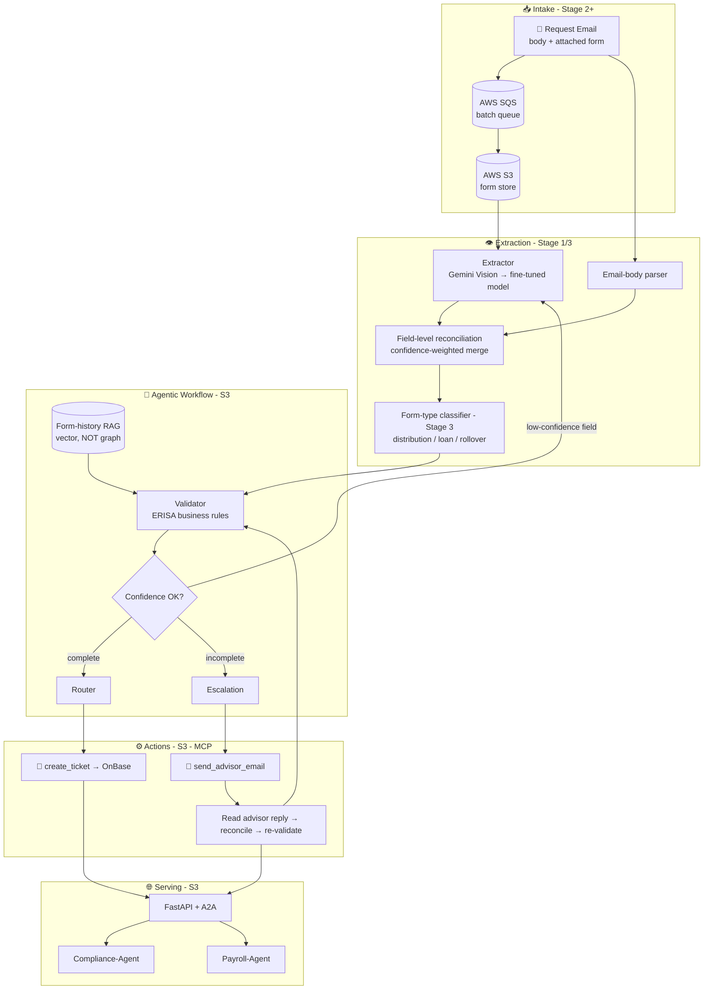

## 📄 FORMSENSE — Full Production Scope v2.0

## AI-Powered Autonomous Document-Operations Platform for Retirement Plan Distribution Processing
## "From Paper to Processing" — From Multimodal Form Reader to an Agentic Document-Operations Workflow

**Document Version:** 2.0 (🎯 **v10.0 REALIGNMENT** — 5-stage model collapsed to the 3-stage arc; Supporting (production-grade); destination Applied AI Engineer → FDE. Excellent v1.8 Anthropic-taxonomy vocabulary (agentic *workflow* not multi-agent; layered exits) retained. Adds three-layer eval + Phoenix. Prior v1.8 note archived below.)

> **📝 v1.8 changelog — architecture vocabulary reconciled (no scope/behavior change).** S3 is now named precisely: an **agentic workflow** — i.e. an *agentic system* in Anthropic's parent-term sense, orchestrated through predefined code paths — **not** a "multi-agent" system or an autonomous agent. Three corrections, all grounded in Anthropic's *Building Effective Agents* taxonomy and the roadmap's v8.8 goal-loop / layered-exits note: (1) "multi-agent" and "agents" (for the Extractor/Validator/Router steps) → **agentic-workflow steps**; (2) the mislabeled Stage-4 "parallelization of Extractor‖Validator‖Router" (they are *sequential* dependencies) → parallelism relocated to where it actually exists — **multi-source concurrent extraction** (email body ‖ form image) and **batch-level concurrency** (SQS workers); (3) the evaluator-optimizer re-extraction loop given **layered exits** (primary stop = verifier, with a max-iteration cap as a *safety backstop*, not the primary stopping mechanism). Adds a new **§6.0 "Agentic Workflow, not Autonomous Agent"** callout that doubles as CCA-F Domain-1 revision material. The `FormExtraction`/`ValidationResult`/`EscalationEmail`/`ProcessingTicket` contract is untouched.
**Last Updated:** July 6, 2026
**Status:** 📋 DRAFT — v10.0-aligned; S2–S3 layers build progressively across the 3-stage model.
**Author:** Manuel Reyes
**Stages Covered (v10.0):** S1 (foundation, built first) → S2 (DE/AE hardening) → S3 (Applied AI → FDE). One evolving system — ML is an embedded literacy module inside S3.
**Predecessor:** FormSense Stage 1 (Multimodal extract → validate → route — `..._v1_6_STAGE1.md`)
**Strategic Priority:** 📄 DOCUMENT INTELLIGENCE → ⚙️ BATCH PIPELINE → 🤖 AUTONOMOUS DOCUMENT OPERATIONS

---


## 🎯 v10.0 ROADMAP ALIGNMENT & STAGE-EVOLUTION ARC — AUTHORITATIVE

> **This block governs.** Where anything below it conflicts (old stage numbers, retired titles, pre-v10.0 portfolio lists), **this block wins.**

**Aligned to:** Career Roadmap **v10.0 (2026 Market Realignment)**.

**Governing model:** **3 stages, not 5.** The retired 14-month "ML Engineer" stage is now an **embedded ML-literacy module inside Stage 3** (earned-overlay — ships only if it beats the baseline). The destination title is **Applied AI Engineer → Forward Deployed Engineer (FDE)**; the retired "Senior LLM Engineer" title is dropped. **This project is ONE system that evolves across stages — never rebuilt per stage.**

**Portfolio role:** 🧩 **Supporting** (production-grade; size ≠ tier) — Applied-AI **document-ops** evidence; partly reinforces the AI-focused-DE angle (unstructured-data ETL feeding downstream). In v10.0, **flagship vs supporting = size & emphasis, not a quality tier — every project is production-grade.** Lead projects get new tooling first and are updated continuously as skills grow.

**Stage-evolution arc:**

| Stage | Theme | This project's layer |
|---|---|---|
| **S1** | Foundation (GenAI-first core) | Multimodal extract → validate → route — concurrent **email-body ‖ form-image** extraction with field-level reconciliation; structured outputs (**GEval schema adherence ≥ 0.85**); synthetic ERISA forms. |
| **S2** | DE/AE hardening | Document-ops pipeline — batch extraction → structured outputs **landed + dbt models** (SLA/exception analytics) + contracts + SQS/Airflow concurrency + Docker/ECS + monitoring. |
| **S3** | Applied AI (RAG/agentic + eval) | **Agentic workflow** (Anthropic taxonomy — routing + evaluator-optimizer + HITL, layered exits) + MCP (email/ticket tools) + Form-History RAG + three-layer eval + Phoenix. (v1.8 taxonomy vocabulary retained.) |

- **Every project's S2 adds:** ingestion → **dbt-tested models (CI-gated)** → **data contracts** (Great Expectations) → warehouse/lakehouse → **Airflow** (idempotent runs) → Docker/**ECS** → monitoring + written **postmortem** → **semantic/metrics layer**.
- **Every project's S3 adds:** RAG/GraphRAG/agentic layer + **three-layer eval** (per-query metrics · trajectory tracing · drift vs frozen golden set) + **observability (Arize Phoenix, OTel-native, free)** + MCP + **HITL** on irreversible actions.

**Production standard (non-negotiable, ALL projects):** business-outcome headline · Mermaid diagram · **C4 Context diagram (+ Container view on lead flagships)** 🆕 · **`docs/adr/` — numbered, immutable Architecture Decision Records (context → decision → consequences)** 🆕 · Dockerfile · eval-metrics table · 15–30s demo GIF · "What I Learned" · **synthetic data only in public repos** · `pyproject.toml` + `src/` + `py.typed` + ruff + mypy · Conventional Commits. *(🆕 C4 + ADR added per roadmap v10.0 CORRECTION 8, July 2026 — additive documentation discipline: the decision-and-defense artifacts Applied-AI/FDE interviews probe; same doc version, no structural change.)*

---

## 📋 Table of Contents

1. [Executive Summary](#1-executive-summary)
2. [Vision: From Form Reader to Autonomous Document Operations](#2-vision-from-form-reader-to-autonomous-document-operations)
3. [Market Opportunity](#3-market-opportunity)
4. [Platform Architecture](#4-platform-architecture)
5. [The Multimodal Extraction Core (Signature Capability)](#5-the-multimodal-extraction-core-signature-capability)
6. [Agentic AI System Design](#6-agentic-ai-system-design)
7. [Feature Framework: Complete Product](#7-feature-framework-complete-product)
8. [MCP Server (Email + Ticket Tools)](#8-mcp-server-email--ticket-tools)
9. [Form-History RAG (Not GraphRAG)](#9-form-history-rag-not-graphrag)
10. [AI Guardrails & Safety](#10-ai-guardrails--safety)
11. [Tech Stack: Production SaaS](#11-tech-stack-production-saas)
12. [Infrastructure & DevOps](#12-infrastructure--devops)
13. [LLMOps & Evaluation](#13-llmops--evaluation)
14. [Data Architecture: Production Scale](#14-data-architecture-production-scale)
15. [Security & Compliance](#15-security--compliance)
16. [Project Structure](#16-project-structure)
17. [Development Phases](#17-development-phases)
18. [Project Evolution (3 Stages)](#18-project-evolution-5-stages)
19. [Success Metrics](#19-success-metrics)
20. [Risk Mitigation](#20-risk-mitigation)
21. [Skills Required (Roadmap Alignment)](#21-skills-required-roadmap-alignment)

---

## 1. Executive Summary

**FormSense (Full Production)** is the all-stages elaboration of the Stage-1 multimodal distribution-form validator. The Stage-1 system reads a distribution request that arrives as an **email body plus an attached PDF/image form**, extracts 15+ fields **concurrently from both sources** into one `FormExtraction` schema with field-level reconciliation, validates against ERISA-aware business rules, and routes: complete forms generate an operations `ProcessingTicket`; incomplete forms generate an `EscalationEmail` to the advisor; low-confidence fields flag for human review. This document carries that foundation through four more stages into an **autonomous (unattended-capable) document-operations platform** — a batch pipeline, a fine-tuned extraction model, an **agentic workflow** with a self-correcting validator loop, and a production SaaS that integrates directly with OnBase and coordinates across compliance/payroll agents via A2A.

The signature technical arc is **single-form, single-pass extraction → an agentic workflow (routing + evaluator-optimizer) with concurrent multi-source extraction**. At Stage 1 the work is sequential (read → reconcile → validate → route). At S3 the same chain gains a **self-correcting validator loop**: the Validator can **trigger re-extraction** on low-confidence fields before a human is ever involved — a measurable accuracy lift that keeps the human-review queue small. Throughput comes not from running the sequential Extractor→Validator→Router steps "in parallel" (they are dependent — you cannot validate before you extract), but from the two places genuine concurrency lives: **multi-source extraction** (email body and form image read concurrently into one `FormExtraction`) and **batch-level concurrency** (many forms processed at once by SQS workers).

### Stage 1 vs Full Production

| Dimension | Stage 1 (Document Intelligence) | Full Production (Autonomous Operations) |
|-----------|----------------------------------|------------------------------------------|
| **Extraction** | Off-the-shelf vision LLM (Gemini Vision), per-form | Fine-tuned domain extraction model + form-type classifier |
| **Processing mode** | One form at a time, interactive | Async batch via SQS queue; scheduled high-volume intake |
| **AI Role** | "Here's what I extracted and where it's missing" | "I re-extracted the low-confidence fields myself, then routed it" |
| **Loop** | Sequential extract → validate → route | Agentic workflow: chained extract→validate→route + **routing** + **evaluator-optimizer** re-extraction (parallelism at multi-source extract + batch level) |
| **Cross-referencing** | None | Form-history RAG (vector) — link to a participant's prior distributions |
| **Routing actions** | Email/ticket generated as objects | MCP tools actually send the advisor email + create the OnBase ticket (approval-gated) |
| **Form types** | Distribution forms | Distribution · Loan · Rollover · multi-form-type (classified) |
| **Integration** | Standalone Streamlit | OnBase integration, real-time processing, A2A cross-team |
| **Eval** | GEval extraction accuracy + DeepEval, manual | LLMOps CI pipeline, accuracy regression gates, per-field A/B |
| **Deploy** | Streamlit Cloud (free) | FastAPI + AWS ECS, SQS, PostgreSQL, S3, observability stack |

> **The Stage-1 extraction contract is never thrown away.** The `FormExtraction` / `ValidationResult` / `EscalationEmail` / `ProcessingTicket` schemas, the per-field confidence model, the multi-source reconciliation logic, and the complete→ticket / incomplete→email routing all carry forward unchanged in interface — each later stage adds throughput, accuracy, and autonomy *behind* that stable contract.

---

## 2. Vision: From Form Reader to Autonomous Document Operations

```
STAGE 1 (NOW):     "Read this form + email, tell me what's missing, route it."   (Sequential)
  │
  │   + AWS S3 + SQS batch + PostgreSQL ticket tracking (Stage 2)
  │   + fine-tuned extraction model + form-type classification (Stage 3)
  │   + agentic workflow (routing + evaluator-optimizer re-extraction) + MCP actions (S3)
  │   + OnBase integration, real-time, multi-form-type, A2A, LLMOps (S3)
  ▼
STAGE 3 (GOAL):    "Process the day's distribution intake end-to-end — extracted, validated,
                    cross-referenced, routed, audited — surfacing only what needs a human."  (Autonomous)
```

The product promise sharpens but never changes character: **accurate extraction, honest about confidence, a human on anything uncertain.** Stage 1 proves the extract-validate-route contract on single forms. S3 proves it holds at production volume, across form types, integrated into the system of record (OnBase) — the difference between "a form-OCR demo" and "document operations a retirement-plan recordkeeper runs on."

---

## 3. Market Opportunity

Intelligent Document Processing (IDP) is a large, growing market, and retirement-plan distribution processing is a high-value, compliance-sensitive corner of it that generic tools don't serve. The full-production thesis adds three 2026-relevant differentiators on top of the Stage-1 base:

| Driver | Why it matters for the full build |
|--------|-----------------------------------|
| **Throughput** | Real intake is bursty and high-volume; async batch (SQS) + scheduled processing is what makes it operational, not a toy. |
| **Domain accuracy** | A fine-tuned extraction model + form-type classifier beats a generic vision LLM on the exact forms processed daily — accuracy *is* the product. |
| **Action, not advice** | MCP tools that actually send the advisor email and create the OnBase ticket (approval-gated) turn extraction into end-to-end automation. |
| **System-of-record integration** | OnBase integration + A2A coordination with compliance/payroll is the difference between a side tool and operations infrastructure. |

---

## 4. Platform Architecture



Each stage slots in behind a stable interface: the **batch queue** (Stage 2) feeds an unchanged extractor; the **classifier + fine-tuned model** (Stage 3) swap in behind the same `FormExtraction` output; the **agentic-workflow steps + evaluator-optimizer loop** (S3) wrap validation without changing the routing contract; the **MCP action tools + A2A** (S3) turn generated objects into real, audited actions.

---

## 5. The Multimodal Extraction Core (Signature Capability)

This is FormSense's defining differentiator — and the reason no tutorial replicates it: it requires genuine retirement-plan operations domain expertise plus multimodal AI.

### 5.1 Multi-source concurrent extraction + reconciliation (Stage 1, carried forward)

A distribution request arrives as an **email body + attached PDF/image form**, and the transaction details may live in either or both. FormSense extracts both sources **concurrently** into the *same* `FormExtraction` schema and **reconciles field-by-field**: the higher-confidence value wins on overlap, agreement across sources raises confidence, and unresolved conflicts flag for human review. The identical mechanism later handles an advisor's escalation reply. This is **structured extraction over known sources — not retrieval, not a graph.**

### 5.2 The schema contract (frozen across all stages)

```python
ExtractedField(field_name, field_value, confidence, location_description,
               extraction_method, requires_review)   # requires_review = confidence < 0.8
FormExtraction(...)        # 15+ fields: participant · plan · distribution · payment · tax · authorization
ValidationResult(...)      # critical/warning/info rule results; is_complete gate
EscalationEmail(...)       # advisor email with explicit missing_items list
ProcessingTicket(...)      # operations ticket → assigned_queue (distributions/rollovers/hardship)
ProcessingMetrics(...)     # per-form observability: latency, tokens, cost, confidence, routing_decision
```

### 5.3 Fine-tuned extraction + classification (Stage 3)

Stage 3 swaps the generic vision LLM for a **fine-tuned domain extraction model** and adds a **form-type classifier** (distribution vs loan vs rollover) so the right field schema and validation rule set are selected automatically. Accuracy is measured against a labeled set; the fine-tuned model must beat the off-the-shelf baseline to earn its place — the same "prove the upgrade" discipline used across the portfolio.

---

## 6. Agentic Workflow Design (Not an Autonomous Agent)

### 6.0 Architecture stance: agentic *workflow*, not autonomous agent

> 🧭 **The one-sentence framing (interview- and CCA-F-defensible):** FormSense is an **agentic workflow** — an *agentic system* in Anthropic's parent-term sense, but one where **the control flow lives in predefined code, not in the model.** It is deliberately **not** a fully autonomous agent, because the task structure is fully known and the domain (ERISA distribution processing) demands auditability and reproducibility.
>
> **Who owns the control flow?** In FormSense, *we do*: `if confidence < 0.8 → review`, `if incomplete → escalate`, `if complete → ticket` are branches written in code. The LLM reasons *inside* each step (reading the form, judging a rule) but never decides *what to do next*. That is the textbook definition of a **workflow**. A true **agent** would be the model dynamically choosing its next tool call from environment feedback ("I'll check history, then maybe re-read the form, then perhaps email the rep"). FormSense doesn't need that — and shouldn't have it.
>
> **Why the label matters (CCA-F Domain 1 — Agentic Architecture & Orchestration, ~27%).** The exam's central discriminator is exactly this: *model-driven decision-making vs. pre-configured decision trees / tool sequences*, and *prompt chaining (predictable task) vs. dynamic adaptive decomposition (unpredictable task)*. FormSense's distribution intake is the **predictable** case, so a workflow is the *correct* answer, not a compromise. Naming the three steps "agents" would be the precise over-claim the exam (and Anthropic's guidance) flags.
>
> **This is the deliberate autonomy contrast with Crucible.** FormSense runs unattended because its actions are verifiable and reversible; Crucible's live-trade path is irreversible and therefore keeps a mandatory human sign-off gate + kill-switch. Same portfolio, two correctly-different autonomy postures — a senior-level judgment signal.

### 6.1 The agentic workflow: chaining, routing, and the self-correcting validator loop

The Stage-4 upgrade composes three of Anthropic's *Building Effective Agents* **workflow** patterns: **prompt chaining** (extract → validate → route), **routing** (the confidence/completeness branch directs each case to ticket / escalation / human review), and **evaluator-optimizer** (the Validator triggers targeted re-extraction). Concurrency is *not* one of these patterns applied to the sequential core — it lives at the multi-source and batch levels (see §6.1.1).

```
extract → validate → route   (a chained, dependent sequence — NOT run in parallel)
   Validator detects a low-confidence or rule-failing field
      → triggers re-extraction of just that field (evaluator-optimizer inner loop)
      → re-validates
         ├─ now complete            → Router → create_ticket (OnBase)
         ├─ genuinely incomplete    → send_advisor_email → read reply → reconcile → re-validate
         └─ still low-confidence    → human-review queue
```

#### 6.1.1 Where the real parallelism is

Extractor→Validator→Router are **sequential dependencies** and cannot be parallelized (you can't validate before you extract, or route before you validate). Genuine concurrency — the actual throughput lever — lives in two places, and the scope names them explicitly so the "parallelization" claim is accurate: (1) **multi-source extraction** — the email body and the attached form image are read *concurrently* into one `FormExtraction` (this is Anthropic's *sectioning* form of parallelization, and it is already the Stage-1 signature move); (2) **batch-level concurrency** — many independent forms processed at once by SQS workers on ECS/Fargate (Stage 2).

> 🔁 **Agentic-Workflow Loop Spec (roadmap v8.8 goal-loop + layered exits):**
> - **Loop type:** *goal-loop, workflow-controlled* — intake → reconcile → validate → route → (if incomplete) escalate → read advisor reply → reconcile → re-validate, until the case is complete or a stop condition fires; plus an inner evaluator-optimizer re-extraction loop on low-confidence fields. The loop is driven by **code branching on the verifier's output**, not by the model choosing its own next step.
> - **Verifier (the primary stop):** ERISA business-rule validation + per-field **confidence threshold** (the loop's "can say no"); cross-source agreement raises confidence. The loop terminates because the **verifier is satisfied**, not because a counter ran out.
> - **Layered exits (roadmap v8.8):** primary exit = **verifier goal met**; safety backstops = **max-escalation-round cap** (prevents advisor-email ping-pong) + **max re-extraction-iteration cap** on the inner loop + **no-progress detection** (confidence not improving across iterations → stop). ⚠️ Per CCA-F Domain-1 guidance, the iteration cap is a *backstop*, **not** the primary stopping mechanism — never the main way the loop decides it's "done."
> - **Autonomy:** runs **unattended** — extraction, validation, and routing are verifiable and non-irreversible. A **human-review gate on low-confidence fields** and the layered exits above are the only brakes. **No financial/irreversible action → no live sign-off gate** (the key autonomy difference from Crucible's live-trade path). The MCP action tools (send email, create ticket) are reversible and approval-gated.

### 6.2 A2A cross-team coordination (S3) — the one genuinely agentic tier

> ✅ **This is the *one* place in FormSense where a true agent legitimately belongs.** The Stage-4 core stays a deterministic agentic workflow (the reliable, auditable spine). At the **cross-team boundary**, dynamic model-driven decisions actually earn their keep: a hardship distribution *might* need a compliance check before a payroll action, and *which* peers to involve can depend on the case. That kind of open-ended, "the path isn't knowable in advance" coordination is where agent autonomy pays off.

At production scale, the **FormSense coordinator** discovers and coordinates with peers over A2A: `FormSense ↔ Compliance-Agent ↔ OnBase-Agent ↔ Payroll-Agent`. Each peer owns its domain; FormSense assembles the verified result with per-step provenance. Per the portfolio's **earned-overlay rule**, this agentic coordination layer ships only if it demonstrably beats a fixed, hard-coded coordination path on a labeled set — autonomy is added because it's *justified*, not by default. This gives the defensible senior narrative: *"deterministic workflow for the regulated core, a bounded agent only at the coordination boundary — and I can tell you exactly why each is where it is."*

---

## 7. Feature Framework: Complete Product

| Capability | Stage introduced | Description |
|-----------|------------------|-------------|
| Multimodal multi-source extraction + reconciliation | 1 | Email body + form read concurrently → one `FormExtraction`; per-field confidence |
| ERISA business-rule validation | 1 | 12+ YAML-configured rules (critical/warning/info), conditional + cross-field |
| Smart routing | 1 | complete → ticket · incomplete → advisor email · low-confidence → human review |
| Advisor-reply reconciliation | 1 | Read the reply, reconcile new fields, re-validate to completion |
| AWS S3 + SQS batch + PostgreSQL | 2 | Async high-volume intake; scheduled batch; durable ticket tracking |
| Fine-tuned extraction model + form-type classifier | 3 | Domain accuracy lift; distribution/loan/rollover auto-routing |
| Agentic workflow (chaining + routing + evaluator-optimizer) | 4 | Chained extract→validate→route; validator triggers re-extraction; concurrency at multi-source extract + batch level |
| MCP action tools | 4 | `send_advisor_email`, `create_ticket` (approval-gated, reversible) |
| Form-history RAG (vector) | 4 | Cross-reference a participant's prior distributions for context/consistency |
| OnBase integration + real-time | 5 | System-of-record integration; live intake processing |
| Multi-form-type support | 5 | Beyond distributions — loans, rollovers, hardship, more |
| A2A cross-team coordination | 5 | FormSense ↔ Compliance ↔ OnBase ↔ Payroll |
| LLMOps evaluation pipeline | 5 | CI accuracy gates, per-field A/B, regression tracking |

---

## 8. MCP Server (Email + Ticket Tools)

Stage 1 generates the `EscalationEmail` and `ProcessingTicket` as objects. S3 exposes the *actions* as MCP tools so the routing actually happens — each write tool reversible and approval-gated.

| Tool | Stage | Type | Notes |
|------|-------|------|-------|
| `extract_form(source)` | 4 | read | Run extraction on a form/email pair; returns `FormExtraction` |
| `validate_form(extraction)` | 4 | read | Returns `ValidationResult` against the form-type rule set |
| `send_advisor_email(escalation)` | 4 | write (reversible, approval-gated) | Actually dispatches the missing-items email |
| `create_ticket(extraction)` | 4 | write (approval-gated) | Creates the OnBase operations ticket |
| `lookup_form_history(participant)` | 4 | read | Form-history RAG over prior distributions (vector, not graph) |

> **Write tools are approval-gated, mirroring the cross-portfolio rule.** Because no action here moves money or is irreversible, FormSense needs *no live sign-off gate* — only the approval gate on the email/ticket dispatch and the low-confidence human-review queue. This is the deliberate autonomy contrast with Crucible (live trades = mandatory human sign-off + kill-switch).

---

## 9. Form-History RAG (Not GraphRAG)

> 🚫 **GraphRAG is explicitly N/A for FormSense.** FormSense is a **structured-extraction** problem, not a corpus-retrieval problem — there is no policy/entity ontology to traverse. The Stage-4 "form-history RAG" is **plain vector retrieval** for cross-referencing a participant's prior distributions (e.g., "does this routing number match what we've seen before; is this the third hardship this year"). It is a consistency/context aid, not a knowledge graph, and it does **not** import any Neo4j/knowledge-graph layer. (This mirrors the SignalCore boundary discipline: the knowledge-graph entity model lives only where the problem actually is graph-shaped — AFC — never spread by default.)

---

## 10. AI Guardrails & Safety

The Stage-1 guardrail set (10 guardrails — confidence, PII, financial validation) carries forward and is extended:

| Guardrail | Stage | What it enforces |
|-----------|-------|------------------|
| Per-field confidence gate | 1 | `requires_review` when confidence < 0.8; nothing auto-routed on a shaky field |
| Cross-source agreement | 1 | Email/form conflicts flag for human review, never silently merged |
| PII protection | 1 | SSN reduced to last-4; no PII in logs; synthetic forms for the public repo |
| Financial-field validation | 1 | Routing/account numbers, withholding %, amounts range-checked |
| ERISA completeness rules | 1 | Required fields per distribution type enforced (critical severity) |
| Max-escalation-round cap | 4 | Prevents advisor-email ping-pong; routes to human after N rounds |
| Re-extraction loop layered exits | 4 | Inner evaluator-optimizer loop stops on **verifier satisfied (primary)**; **max-iteration cap** + **no-progress detection** are safety backstops, never the primary stop (per CCA-F Domain-1 guidance) |
| MCP action approval | 4 | Email send / ticket create require approval; reversible |
| Form-type rule-set match | 3/5 | Validation uses the rule set for the *classified* form type |
| Cross-agent provenance | 5 | A2A-assembled outcomes carry per-step source attribution |

---

## 11. Tech Stack: Production SaaS

| Layer | Stage 1 | Full Production |
|-------|---------|-----------------|
| Vision / extraction | Gemini Vision (primary); Claude/GPT-4o Vision fallback | Fine-tuned domain extraction model + form-type classifier |
| LLM SDK | Provider-agnostic (multimodal abstraction) | Same abstraction; routing by confidence/cost |
| Orchestration | Sequential | Agentic workflow: chaining + routing + evaluator-optimizer (LangGraph) |
| Tool protocol | — (objects generated) | MCP (read + approval-gated write actions) |
| Cross-reference | — | Form-history RAG (vector store) |
| Queue / batch | — | AWS SQS async batch; scheduled processing |
| API / UI | Streamlit | FastAPI backend + ops dashboard |
| Storage | Local | AWS S3 (forms) + PostgreSQL (tickets/audit) |
| Integration | Standalone | OnBase (system of record); A2A peers |
| Eval | GEval + DeepEval, manual | LLMOps CI pipeline, accuracy regression gates, per-field A/B |
| Deploy | Streamlit Cloud (free) | AWS ECS (Fargate), auto-scaling |
| Observability | Python logging + `ProcessingMetrics` | LangSmith traces + Prometheus/Grafana/Sentry |

> All roadmap Python standards hold across every stage: `pyproject.toml`, `src/` layout, `py.typed`, `from __future__ import annotations`, NumPy-style docstrings, Pydantic validation, logging (no `print()`), GitHub Actions CI.

---

## 12. Infrastructure & DevOps

```yaml
environments:
  development:
    - Local Docker Compose (FastAPI + worker + Postgres)
    - Local MCP server testable from Cursor / Claude Desktop
  staging:
    - AWS ECS (Fargate) — mirrors production
    - Separate SQS queue + S3 bucket + Postgres instance
  production:
    - AWS ECS (Fargate) — auto-scaling workers
    - SQS (batch intake) · S3 (form store) · RDS PostgreSQL (Multi-AZ) · OnBase integration
  ci_cd:
    on_push:
      - Lint (Ruff) + type check (mypy)
      - Unit tests (pytest)
      - Extraction-accuracy eval (GEval on a fixed labeled form set)
    on_merge_to_main:
      - Build Docker images
      - Deploy to staging → accuracy regression gate → deploy to production
```

---

## 13. LLMOps & Evaluation

Evaluation is the spine — accuracy is the product, so it is gated, not hoped for.

| Metric | Tool | Gate |
|--------|------|------|
| Field extraction accuracy | GEval (per-field, vs labeled set) | CI regression gate; no release below baseline |
| Reconciliation correctness | Custom labeled conflicts | Right value wins on email/form disagreement |
| Validation precision/recall | Labeled complete/incomplete forms | Critical-rule failures never missed |
| Form-type classification | Labeled set (dist/loan/rollover) | Above threshold before auto-routing by type |
| Routing correctness | End-to-end labeled cases | complete→ticket / incomplete→email decisions correct |
| Re-extraction lift | A/B (loop on vs off) | Evaluator-optimizer must reduce human-review rate |

The **fine-tuned-model and re-extraction-loop payoffs are proven, not asserted** — each must beat its baseline on the labeled set to justify the added complexity.

---

## 14. Data Architecture: Production Scale

```yaml
intake:
  source: request emails (body + attached form) → AWS SQS batch queue
  store: AWS S3 (versioned form images/PDFs)
stores:
  relational: PostgreSQL (tickets, validation results, audit, escalation tracking)
  vectors: form-history index (prior distributions per participant) — vector, not graph
provenance:
  every_form_logs: [extraction_method per field, confidences, source-of-record per field,
                    rule results, routing_decision, model, prompt_version, scope_version]
privacy:
  ssn: stored/displayed as last-4 only; full PII never embedded or logged
  public_repo: synthetic forms only (Faker-generated)
```

---

## 15. Security & Compliance

| Concern | Control |
|---------|---------|
| PII | SSN last-4 only; no PII in answers/logs; synthetic forms for public GitHub |
| Financial data | Routing/account numbers validated and access-controlled; never in URLs/logs |
| ERISA | Distribution completeness rules enforced as critical-severity gates |
| Auditability | Per-form provenance (which source supplied each field, why it routed where) |
| Action safety | MCP write tools reversible + approval-gated; round-cap on escalations |
| Integration | OnBase access scoped and logged; A2A outcomes carry per-step attribution |

---

## 16. Project Structure

```
formsense/
  src/formsense/
    extract/       # vision client · email-body parser · multi-source reconciliation
    classify/      # form-type classifier (Stage 3)
    model/         # fine-tuned extraction model + training (Stage 3)
    validate/      # ERISA rule engine (YAML rules · severity)
    workflow/      # agentic workflow: chaining + routing + evaluator-optimizer loop · LangGraph (S3)
    history/       # form-history RAG (vector; NOT graph) (S3)
    mcp_server/    # MCP — read tools + approval-gated email/ticket actions (S3)
    integrations/  # OnBase · A2A peers (S3)
    eval/          # GEval accuracy · labeled sets · regression gates
    guardrails/
    schemas/       # FormExtraction · ValidationResult · EscalationEmail · ProcessingTicket · ProcessingMetrics
  tests/
  pyproject.toml   # py.typed · src layout · semver
  Dockerfile
```

---

## 17. Development Phases

| Phase | Stage | Build focus | Exit criteria |
|-------|-------|-------------|---------------|
| Foundation | 1 | Multimodal multi-source extraction + reconciliation + ERISA validation + routing | Live Streamlit demo; GEval accuracy measured; advisor-reply reconciliation working |
| Pipeline | 2 | AWS S3 + SQS batch + PostgreSQL ticket tracking; scheduled processing; **containerize + deploy to AWS ECS/Fargate** (Streamlit Cloud → ECS handoff) | High-volume async intake working; durable ticket tracking; app + workers running on ECS/Fargate |
| Intelligence | 3 | Fine-tuned extraction model + form-type classifier | Fine-tuned model beats off-the-shelf baseline; classifier above threshold |
| Agentic Workflow | 4 | Agentic workflow (chaining + routing + evaluator-optimizer re-extraction); MCP actions; form-history RAG | Re-extraction loop measurably cuts human-review rate; layered exits enforced (verifier primary, caps as backstop); write actions approval-gated |
| Platform | 5 | OnBase integration, real-time, multi-form-type, A2A, LLMOps CI | OnBase round-trip working; A2A outcome with provenance; accuracy regression gates green |

---

## 18. Project Evolution (3 Stages — v10.0)

*One evolving system across the roadmap's 3 stages. The retired v9.2 "ML Engineer / Senior LLM Engineer" tiers collapse into **Stage 3**; the fine-tuned extractor/classifier is an embedded literacy module governed by the earned-overlay rule (ships only if it beats the off-the-shelf baseline).*

| Stage | Role (v10.0) | FormSense layer & production deliverables | Exit criteria |
|---|---|---|---|
| **S1** | Foundation (GenAI-first core) | Multimodal extract → validate → route — **email-body ‖ form-image** concurrent extraction + field-level reconciliation + ERISA YAML rule engine + advisor-reply reconciliation. **GEval schema adherence ≥ 0.85**. Synthetic ERISA forms; **frozen schema contract** (`FormExtraction`/`ValidationResult`/`EscalationEmail`/`ProcessingTicket`). | GEval baseline measured; routing correctness; schema contract frozen. |
| **S2** | DE/AE hardening | Document-ops pipeline — landed structured outputs + **dbt models** (SLA/exception analytics) + **data contracts** (Great Expectations) + AWS S3/**SQS** batch + PostgreSQL audit + **Docker → ECS/Fargate** (app + async workers, Terraform) + monitoring + postmortem. | Batch SLA met (SQS auto-scaling); contracts enforced in CI; ECS deploy live. |
| **S3** | Applied AI (agentic workflow + eval) | **Agentic workflow** (Anthropic taxonomy — prompt-chaining + routing + evaluator-optimizer with **layered exits**; verifier primary, max-iteration cap = backstop) + **MCP** (email/ticket action tools — reversible + **approval-gated**) + Form-History **vector RAG** (not GraphRAG) + optional fine-tuned extractor/classifier (**earned-overlay**) + **three-layer eval** + **Arize Phoenix** trajectory tracing. | Re-extraction loop lowers human-review rate; fine-tune beats baseline **or is dropped**; MCP tools audited reversible + approval-gated. |

> **Optional beyond-portfolio extension (S3 stretch, earned-overlay gated):** OnBase integration + A2A cross-system coordination (formerly the v9.2 "S3"). Build only if a real integration need justifies it.

> 🚫 **No-GraphRAG note:** FormSense is structured extraction, not corpus retrieval — no entity ontology to traverse. Form-history RAG stays plain vector. (GraphRAG belongs to AFC/PolicyPulse, where the problem is genuinely graph-shaped.)


## 19. Success Metrics

| Metric | Stage 1 target | Full-production target |
|--------|----------------|------------------------|
| Field extraction accuracy (GEval) | Measured + reported | CI regression gate; no release below baseline |
| Human-review rate | Low-confidence correctly flagged | Reduced by the evaluator-optimizer re-extraction loop |
| Routing correctness | complete/incomplete decisions correct | Held under batch volume + multi-form-type |
| Form-type classification | n/a | Above threshold before auto-routing by type |
| Throughput | Single-form interactive | Batch SLA met (SQS workers, auto-scaling) |
| Escalation efficiency | Advisor email lists exact missing items | Round-cap respected; reply reconciliation closes cases |

---

## 20. Risk Mitigation

| Risk | Mitigation |
|------|-----------|
| Over-trusting extraction | Per-field confidence + `requires_review` < 0.8; human gate on uncertainty |
| Email ping-pong | Max-escalation-round cap → human after N rounds |
| Accuracy theater | GEval on fixed labeled sets + regression gates; fine-tuned model must beat baseline |
| Scope creep into GraphRAG | Explicit N/A — form-history RAG stays vector-only |
| Action risk | MCP email/ticket tools reversible + approval-gated; no money moves |
| Stage drift | Each stage has explicit exit criteria (§17); Stage-1 schema contract frozen |

---

## 21. Skills Required (Roadmap Alignment — v10.0)

| Skill | Stage | How FormSense Uses It |
|-------|-------|------------------------|
| Python, pandas, Pydantic | S1 ✅ | Schemas, structured outputs, reconciliation |
| Multimodal LLM SDK (Gemini Vision; Claude/GPT-4o fallback) | S1 ✅ | Form reading (checkboxes, handwriting, layout) |
| Business-rule / validation engineering | S1 ✅ | ERISA-aware YAML rule engine |
| GEval, DeepEval | S1 ✅ | Extraction-accuracy evaluation |
| **dbt + data contracts (Great Expectations)** | **S2** | **SLA/exception analytics models; quality gates on landed extractions** |
| **Airflow, Terraform** | **S2** | **Scheduled batch; reproducibly-provisioned infra** |
| AWS (S3, SQS, RDS, ECS/Fargate), Docker | S2 | Form storage, async batch queue, containerized app + worker deployment |
| PostgreSQL | S2 | Production data + audit layer |
| **LangGraph agentic-workflow (chaining + routing + evaluator-optimizer, layered exits)** | **S3** | **The extract → validate → route loop with verifier-primary exits** |
| **MCP (email-send + ticket-create action tools)** | **S3** | **Reversible, approval-gated actions** |
| RAG (vector) | S3 | Form-history cross-referencing (not GraphRAG) |
| Pre-processing Unstructured Data; Document AI | S3 | Messy scans/PDFs → clean LLM-ready inputs → structured JSON |
| Fine-tuning / classification (earned-overlay) | S3 | Domain extractor + form-type classifier — only if it beats baseline |
| **Three-layer eval + Arize Phoenix observability** | **S3** | **Per-field accuracy + trajectory tracing + drift vs frozen set** |
| FastAPI, System Design, Production Monitoring | S3 | Backend, architecture, observability |


---

## ✅ Approval Checklist

- [ ] Stage-1 schema contract confirmed frozen (`FormExtraction`/`ValidationResult`/`EscalationEmail`/`ProcessingTicket`)
- [ ] Multi-source concurrent extraction + reconciliation preserved across stages
- [ ] Agentic-workflow framing confirmed (chaining + routing + evaluator-optimizer; NOT "multi-agent"/autonomous agent)
- [ ] Concurrency correctly located (multi-source extract + batch level; sequential core not "parallelized")
- [ ] Evaluator-optimizer loop layered exits approved (verifier primary; caps as backstop; no-progress detection)
- [ ] A2A (S3) as the single genuinely-agentic tier, earned-overlay gated
- [ ] GraphRAG confirmed N/A; form-history RAG is vector-only
- [ ] MCP write tools confirmed reversible + approval-gated; no live sign-off gate (no money moves)
- [ ] Fine-tuned model + classifier must beat labeled baselines before adoption
- [ ] OnBase integration + A2A provenance scoped
- [ ] LLMOps accuracy regression gates defined
- [ ] All roadmap v8.9 skills mapped to product features
- [ ] v8.9 course alignment reflected (MCP primer available from Stage 1; Document AI deep-dives at S3)

---

## Quick Reference

```
┌─────────────────────────────────────────────────────────────────┐
│      FORMSENSE — FULL PRODUCTION v1.7                            │
│      📄 Document Intelligence → ⚙️ Batch → 🤖 Autonomous Ops     │
│      "From Paper to Processing" — extract · validate · route     │
├─────────────────────────────────────────────────────────────────┤
│  👁️ MULTIMODAL EXTRACTION (frozen contract)                     │
│     • Email body + form read concurrently → one FormExtraction   │
│     • Field-level reconciliation; per-field confidence (<0.8 →   │
│       review); Gemini Vision → fine-tuned model (Stage 3)        │
├─────────────────────────────────────────────────────────────────┤
│  🤖 AGENTIC WORKFLOW (S3) — NOT multi-agent                  │
│     • Chained extract→validate→route + routing                   │
│     • Evaluator-optimizer: Validator re-extracts                 │
│     • Concurrency: multi-source extract + batch level            │
│     • Layered exits: verifier primary; caps = backstop           │
│     • Unattended; low-confidence→human; NO sign-off gate         │
├─────────────────────────────────────────────────────────────────┤
│  ⚙️ MCP ACTIONS (S3)                                        │
│     • send_advisor_email · create_ticket (reversible, approval)  │
│     • lookup_form_history (vector RAG — NOT GraphRAG)            │
├─────────────────────────────────────────────────────────────────┤
│  🌐 PLATFORM (S3)                                           │
│     • OnBase integration · real-time · multi-form-type           │
│     • A2A: FormSense ↔ Compliance ↔ OnBase ↔ Payroll            │
│     • FastAPI + AWS ECS · SQS · S3 · PostgreSQL                 │
├─────────────────────────────────────────────────────────────────┤
│  🧪 LLMOPS & EVAL (spine, all stages)                            │
│     • GEval extraction accuracy · regression gates               │
│     • Fine-tuned model + re-extraction loop must beat baselines  │
└─────────────────────────────────────────────────────────────────┘
```

---

## Production README Standard

> **Cross-Project Standard:** Every project README includes a Mermaid architecture diagram, a Dockerfile, an evaluation-metrics table (GEval/DeepEval results), a 15–30s demo GIF, and a "What I Learned" section.

---

## 📚 Courses & Certifications — per Stage (v10.0 reference)

*Synced to roadmap **v10.0**. Course/cert names match the roadmap's stage tables; ordered by the stage in which FormSense needs them. Certs follow the roadmap's **replace-not-stack** rule — committed certs are marked ✅; conditional/platform certs are **take-ONE-only**. Employer-reimbursable certs are noted.*

### 🎓 Stage 1 — Foundation (GenAI-first core)
- **Courses:** AI Python for Beginners (Andrew Ng) · Building with the Claude API (Anthropic Academy — structured outputs + multimodal) · Pre-processing Unstructured Data for LLM Applications · Document AI: From OCR to Agentic Doc Extraction (finance-critical core) · MCP primer (DeepLearning.AI) · Docker for Beginners · 30 Days of Streamlit
- **Certifications:** **AI-901** Azure AI Fundamentals (employer-reimbursed) · **AB-620** AI Agent Builder Associate (employer-reimbursed)

### 🎓 Stage 2 — DE/AE hardening
- **Courses:** PostgreSQL for Everybody · dbt Fundamentals + dbt Advanced Learning Paths · Astronomer Academy (Airflow 101 + DAG Authoring) · Terraform Fundamentals (HashiCorp) — AWS SQS/batch patterns absorbed via AWS DEA-C01 prep
- **Certifications:** **DP-700** Fabric Data Engineer (✅ committed · employer-reimbursed) · **AWS DEA-C01** Data Engineer Associate (✅ committed)

### 🎓 Stage 3 — Applied AI (RAG / agentic + eval)
- **Courses:** Document AI: From OCR to Agentic Doc Extraction (deep) · AI Agents in LangGraph · LangChain Academy (LangGraph + LangSmith) · Agent Skills with Anthropic · Automated Testing for LLMOps · MCP: Build Rich-Context AI Apps (full)
- **Certifications:** **Anthropic CCA-F** ($125 — agentic orchestration / MCP source-of-truth) · **AI-103** Azure AI Apps & Agents Developer (employer-reimbursed) · **Databricks Certified GenAI Engineer Associate** ($200 — optional, for the agentic-workflow signal)

**Focus thread:** multimodal multi-source extraction (handwriting, checkboxes, email body) · field-level confidence + reconciliation · ERISA business-rule routing (complete→ticket / incomplete→advisor email) · GEval accuracy · MCP action tools · form-history vector RAG.

> **Cert discipline (v10.0):** the shipped, production-grade project is the primary hiring signal; certs are tiebreakers. Committed canon = **DP-700 + AWS DEA-C01** (S2) and the S3 GenAI set. Platform certs (SnowPro Core / DP-750 / Databricks DE / dbt AE) are a **conditional menu — take exactly ONE**, matched to a concrete apply-list's stack. Keyword-density is a negative signal.

---

**Document Status:** 📋 DRAFT — v10.0-aligned Full-Production companion. Stages: S1 (built first) → S2 (DE/AE) → S3 (Applied AI → FDE). One evolving system.
**Last aligned:** v10.0 (2026 Market Realignment).