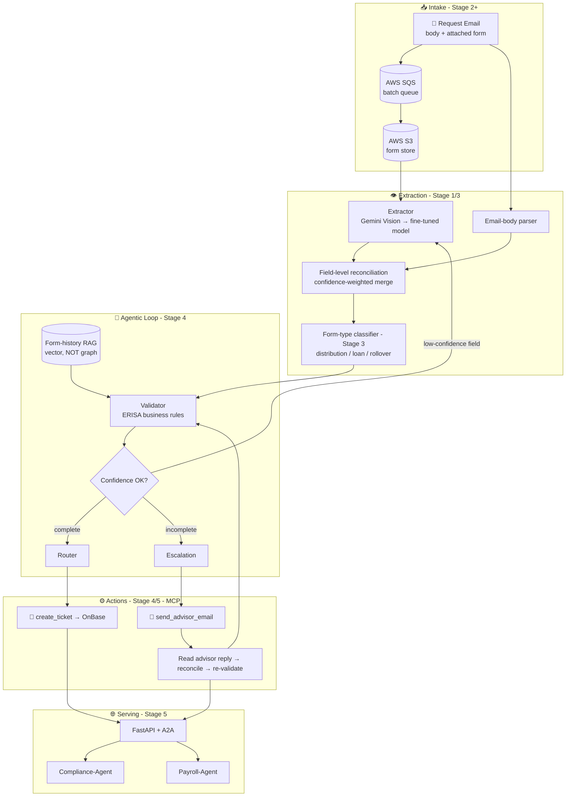

# 📄 FORMSENSE — Full Production Scope v1.7

## AI-Powered Autonomous Document-Operations Platform for Retirement Plan Distribution Processing
## "From Paper to Processing" — From Multimodal Form Reader to Multi-Agent Document Operations

**Document Version:** 1.7 (Full-Production companion to the Stage-1 scope `FORMSENSE_DISTRIBUTION_SCOPE_v1_6_STAGE1.md`. Version reconciled to **v1.7** to match FormSense's current revision — the Stage-1 title already reads v1.7 (Agentic Loop Spec added per roadmap v8.8); the "1.6" in its version field was stale drift. **Synced to roadmap v8.9.** Details all 5 stages — the Stage-1 multimodal extract→validate→route engine evolves into a **batch pipeline**, a **fine-tuned extraction model**, a **multi-agent parallelized + evaluator-optimizer** system, and a **production SaaS** with OnBase integration and A2A. Additive — Stage-1 build scope unchanged.)
**Last Updated:** June 30, 2026
**Status:** 📋 DRAFT — Future Vision (Stages 2–5 require progressive skill acquisition)
**Author:** Manuel Reyes
**Stages Covered:** 1 (foundation, built first) → 2 (Data Engineer) → 3 (ML Engineer) → 4 (Agentic AI Engineer) → 5 (Senior LLM Engineer)
**Predecessor:** FormSense Stage 1 (Multimodal extract → validate → route — `..._v1_6_STAGE1.md`)
**Strategic Priority:** 📄 DOCUMENT INTELLIGENCE → ⚙️ BATCH PIPELINE → 🤖 AUTONOMOUS DOCUMENT OPERATIONS

---

## 📋 Table of Contents

1. [Executive Summary](#1-executive-summary)
2. [Vision: From Form Reader to Autonomous Document Operations](#2-vision-from-form-reader-to-autonomous-document-operations)
3. [Market Opportunity](#3-market-opportunity)
4. [Platform Architecture](#4-platform-architecture)
5. [The Multimodal Extraction Core (Signature Capability)](#5-the-multimodal-extraction-core-signature-capability)
6. [Agentic AI System Design](#6-agentic-ai-system-design)
7. [Feature Framework: Complete Product](#7-feature-framework-complete-product)
8. [MCP Server (Email + Ticket Tools)](#8-mcp-server-email--ticket-tools)
9. [Form-History RAG (Not GraphRAG)](#9-form-history-rag-not-graphrag)
10. [AI Guardrails & Safety](#10-ai-guardrails--safety)
11. [Tech Stack: Production SaaS](#11-tech-stack-production-saas)
12. [Infrastructure & DevOps](#12-infrastructure--devops)
13. [LLMOps & Evaluation](#13-llmops--evaluation)
14. [Data Architecture: Production Scale](#14-data-architecture-production-scale)
15. [Security & Compliance](#15-security--compliance)
16. [Project Structure](#16-project-structure)
17. [Development Phases](#17-development-phases)
18. [Project Evolution (5 Stages)](#18-project-evolution-5-stages)
19. [Success Metrics](#19-success-metrics)
20. [Risk Mitigation](#20-risk-mitigation)
21. [Skills Required (Roadmap Alignment)](#21-skills-required-roadmap-alignment)

---

## 1. Executive Summary

**FormSense (Full Production)** is the all-stages elaboration of the Stage-1 multimodal distribution-form validator. The Stage-1 system reads a distribution request that arrives as an **email body plus an attached PDF/image form**, extracts 15+ fields **concurrently from both sources** into one `FormExtraction` schema with field-level reconciliation, validates against ERISA-aware business rules, and routes: complete forms generate an operations `ProcessingTicket`; incomplete forms generate an `EscalationEmail` to the advisor; low-confidence fields flag for human review. This document carries that foundation through four more stages into an **autonomous document-operations platform** — a batch pipeline, a fine-tuned extraction model, a multi-agent parallelized system with a self-correcting validator loop, and a production SaaS that integrates directly with OnBase and coordinates across compliance/payroll agents via A2A.

The signature technical arc is **single-form, single-pass extraction → multi-agent parallelized extraction with an evaluator-optimizer validator loop**. At Stage 1 the work is sequential (read → reconcile → validate → route). At Stage 4 the Extractor, Validator, and Router run concurrently for throughput, and the Validator can **trigger re-extraction** on low-confidence fields before a human is ever involved — a measurable accuracy lift that keeps the human-review queue small.

### Stage 1 vs Full Production

| Dimension | Stage 1 (Document Intelligence) | Full Production (Autonomous Operations) |
|-----------|----------------------------------|------------------------------------------|
| **Extraction** | Off-the-shelf vision LLM (Gemini Vision), per-form | Fine-tuned domain extraction model + form-type classifier |
| **Processing mode** | One form at a time, interactive | Async batch via SQS queue; scheduled high-volume intake |
| **AI Role** | "Here's what I extracted and where it's missing" | "I re-extracted the low-confidence fields myself, then routed it" |
| **Loop** | Sequential extract → validate → route | Parallelized Extractor‖Validator‖Router + evaluator-optimizer re-extraction |
| **Cross-referencing** | None | Form-history RAG (vector) — link to a participant's prior distributions |
| **Routing actions** | Email/ticket generated as objects | MCP tools actually send the advisor email + create the OnBase ticket (approval-gated) |
| **Form types** | Distribution forms | Distribution · Loan · Rollover · multi-form-type (classified) |
| **Integration** | Standalone Streamlit | OnBase integration, real-time processing, A2A cross-team |
| **Eval** | GEval extraction accuracy + DeepEval, manual | LLMOps CI pipeline, accuracy regression gates, per-field A/B |
| **Deploy** | Streamlit Cloud (free) | FastAPI + AWS ECS, SQS, PostgreSQL, S3, observability stack |

> **The Stage-1 extraction contract is never thrown away.** The `FormExtraction` / `ValidationResult` / `EscalationEmail` / `ProcessingTicket` schemas, the per-field confidence model, the multi-source reconciliation logic, and the complete→ticket / incomplete→email routing all carry forward unchanged in interface — each later stage adds throughput, accuracy, and autonomy *behind* that stable contract.

---

## 2. Vision: From Form Reader to Autonomous Document Operations

```
STAGE 1 (NOW):     "Read this form + email, tell me what's missing, route it."   (Sequential)
  │
  │   + AWS S3 + SQS batch + PostgreSQL ticket tracking (Stage 2)
  │   + fine-tuned extraction model + form-type classification (Stage 3)
  │   + multi-agent parallelization + evaluator-optimizer re-extraction + MCP actions (Stage 4)
  │   + OnBase integration, real-time, multi-form-type, A2A, LLMOps (Stage 5)
  ▼
STAGE 5 (GOAL):    "Process the day's distribution intake end-to-end — extracted, validated,
                    cross-referenced, routed, audited — surfacing only what needs a human."  (Autonomous)
```

The product promise sharpens but never changes character: **accurate extraction, honest about confidence, a human on anything uncertain.** Stage 1 proves the extract-validate-route contract on single forms. Stage 5 proves it holds at production volume, across form types, integrated into the system of record (OnBase) — the difference between "a form-OCR demo" and "document operations a retirement-plan recordkeeper runs on."

---

## 3. Market Opportunity

Intelligent Document Processing (IDP) is a large, growing market, and retirement-plan distribution processing is a high-value, compliance-sensitive corner of it that generic tools don't serve. The full-production thesis adds three 2026-relevant differentiators on top of the Stage-1 base:

| Driver | Why it matters for the full build |
|--------|-----------------------------------|
| **Throughput** | Real intake is bursty and high-volume; async batch (SQS) + scheduled processing is what makes it operational, not a toy. |
| **Domain accuracy** | A fine-tuned extraction model + form-type classifier beats a generic vision LLM on the exact forms processed daily — accuracy *is* the product. |
| **Action, not advice** | MCP tools that actually send the advisor email and create the OnBase ticket (approval-gated) turn extraction into end-to-end automation. |
| **System-of-record integration** | OnBase integration + A2A coordination with compliance/payroll is the difference between a side tool and operations infrastructure. |

---

## 4. Platform Architecture



Each stage slots in behind a stable interface: the **batch queue** (Stage 2) feeds an unchanged extractor; the **classifier + fine-tuned model** (Stage 3) swap in behind the same `FormExtraction` output; the **parallelized agents + evaluator-optimizer loop** (Stage 4) wrap validation without changing the routing contract; the **MCP action tools + A2A** (Stage 4/5) turn generated objects into real, audited actions.

---

## 5. The Multimodal Extraction Core (Signature Capability)

This is FormSense's defining differentiator — and the reason no tutorial replicates it: it requires genuine retirement-plan operations domain expertise plus multimodal AI.

### 5.1 Multi-source concurrent extraction + reconciliation (Stage 1, carried forward)

A distribution request arrives as an **email body + attached PDF/image form**, and the transaction details may live in either or both. FormSense extracts both sources **concurrently** into the *same* `FormExtraction` schema and **reconciles field-by-field**: the higher-confidence value wins on overlap, agreement across sources raises confidence, and unresolved conflicts flag for human review. The identical mechanism later handles an advisor's escalation reply. This is **structured extraction over known sources — not retrieval, not a graph.**

### 5.2 The schema contract (frozen across all stages)

```python
ExtractedField(field_name, field_value, confidence, location_description,
               extraction_method, requires_review)   # requires_review = confidence < 0.8
FormExtraction(...)        # 15+ fields: participant · plan · distribution · payment · tax · authorization
ValidationResult(...)      # critical/warning/info rule results; is_complete gate
EscalationEmail(...)       # advisor email with explicit missing_items list
ProcessingTicket(...)      # operations ticket → assigned_queue (distributions/rollovers/hardship)
ProcessingMetrics(...)     # per-form observability: latency, tokens, cost, confidence, routing_decision
```

### 5.3 Fine-tuned extraction + classification (Stage 3)

Stage 3 swaps the generic vision LLM for a **fine-tuned domain extraction model** and adds a **form-type classifier** (distribution vs loan vs rollover) so the right field schema and validation rule set are selected automatically. Accuracy is measured against a labeled set; the fine-tuned model must beat the off-the-shelf baseline to earn its place — the same "prove the upgrade" discipline used across the portfolio.

---

## 6. Agentic AI System Design

The Stage-4 upgrade implements two of Anthropic's "Building Effective Agents" patterns — **parallelization** (for throughput) and **evaluator-optimizer** (for accuracy).

### 6.1 Parallelization + the self-correcting validator loop

```
Extractor ‖ Validator ‖ Router  (run concurrently for throughput)
   Validator detects a low-confidence or rule-failing field
      → triggers re-extraction of just that field (evaluator-optimizer)
      → re-validates
         ├─ now complete            → Router → create_ticket (OnBase)
         ├─ genuinely incomplete    → send_advisor_email → read reply → reconcile → re-validate
         └─ still low-confidence    → human-review queue
```

> 🔁 **Agentic Loop Spec (roadmap v8.8):**
> - **Loop type:** *goal-loop* — intake → reconcile → validate → route → (if incomplete) escalate → read advisor reply → reconcile → re-validate, until the case is complete or the round-cap is hit; plus an inner evaluator-optimizer re-extraction loop on low-confidence fields.
> - **Verifier:** ERISA business-rule validation + per-field **confidence threshold** (the loop's "can say no"); cross-source agreement raises confidence.
> - **Autonomy:** runs **unattended** — extraction, validation, and routing are verifiable and non-irreversible. A **human-review gate on low-confidence fields** and a **max-escalation-round cap** (to prevent email ping-pong) are the only brakes. **No financial/irreversible action → no live sign-off gate** (this is the key autonomy difference from Crucible's live-trade path). The MCP action tools (send email, create ticket) are reversible and approval-gated.

### 6.2 A2A cross-team coordination (Stage 5)

At production scale, FormSense's agent discovers and coordinates with peers over A2A: `FormSense-Agent ↔ Compliance-Agent ↔ OnBase-Agent ↔ Payroll-Agent`. A hardship distribution, for example, may need a compliance check and a payroll downstream action — each agent owns its domain; FormSense assembles the verified result with per-step provenance.

---

## 7. Feature Framework: Complete Product

| Capability | Stage introduced | Description |
|-----------|------------------|-------------|
| Multimodal multi-source extraction + reconciliation | 1 | Email body + form read concurrently → one `FormExtraction`; per-field confidence |
| ERISA business-rule validation | 1 | 12+ YAML-configured rules (critical/warning/info), conditional + cross-field |
| Smart routing | 1 | complete → ticket · incomplete → advisor email · low-confidence → human review |
| Advisor-reply reconciliation | 1 | Read the reply, reconcile new fields, re-validate to completion |
| AWS S3 + SQS batch + PostgreSQL | 2 | Async high-volume intake; scheduled batch; durable ticket tracking |
| Fine-tuned extraction model + form-type classifier | 3 | Domain accuracy lift; distribution/loan/rollover auto-routing |
| Parallelized agents + evaluator-optimizer | 4 | Concurrent Extractor‖Validator‖Router; validator triggers re-extraction |
| MCP action tools | 4 | `send_advisor_email`, `create_ticket` (approval-gated, reversible) |
| Form-history RAG (vector) | 4 | Cross-reference a participant's prior distributions for context/consistency |
| OnBase integration + real-time | 5 | System-of-record integration; live intake processing |
| Multi-form-type support | 5 | Beyond distributions — loans, rollovers, hardship, more |
| A2A cross-team coordination | 5 | FormSense ↔ Compliance ↔ OnBase ↔ Payroll |
| LLMOps evaluation pipeline | 5 | CI accuracy gates, per-field A/B, regression tracking |

---

## 8. MCP Server (Email + Ticket Tools)

Stage 1 generates the `EscalationEmail` and `ProcessingTicket` as objects. Stage 4 exposes the *actions* as MCP tools so the routing actually happens — each write tool reversible and approval-gated.

| Tool | Stage | Type | Notes |
|------|-------|------|-------|
| `extract_form(source)` | 4 | read | Run extraction on a form/email pair; returns `FormExtraction` |
| `validate_form(extraction)` | 4 | read | Returns `ValidationResult` against the form-type rule set |
| `send_advisor_email(escalation)` | 4 | write (reversible, approval-gated) | Actually dispatches the missing-items email |
| `create_ticket(extraction)` | 4 | write (approval-gated) | Creates the OnBase operations ticket |
| `lookup_form_history(participant)` | 4 | read | Form-history RAG over prior distributions (vector, not graph) |

> **Write tools are approval-gated, mirroring the cross-portfolio rule.** Because no action here moves money or is irreversible, FormSense needs *no live sign-off gate* — only the approval gate on the email/ticket dispatch and the low-confidence human-review queue. This is the deliberate autonomy contrast with Crucible (live trades = mandatory human sign-off + kill-switch).

---

## 9. Form-History RAG (Not GraphRAG)

> 🚫 **GraphRAG is explicitly N/A for FormSense.** FormSense is a **structured-extraction** problem, not a corpus-retrieval problem — there is no policy/entity ontology to traverse. The Stage-4 "form-history RAG" is **plain vector retrieval** for cross-referencing a participant's prior distributions (e.g., "does this routing number match what we've seen before; is this the third hardship this year"). It is a consistency/context aid, not a knowledge graph, and it does **not** import any Neo4j/knowledge-graph layer. (This mirrors the SignalCore boundary discipline: the knowledge-graph entity model lives only where the problem actually is graph-shaped — AFC — never spread by default.)

---

## 10. AI Guardrails & Safety

The Stage-1 guardrail set (10 guardrails — confidence, PII, financial validation) carries forward and is extended:

| Guardrail | Stage | What it enforces |
|-----------|-------|------------------|
| Per-field confidence gate | 1 | `requires_review` when confidence < 0.8; nothing auto-routed on a shaky field |
| Cross-source agreement | 1 | Email/form conflicts flag for human review, never silently merged |
| PII protection | 1 | SSN reduced to last-4; no PII in logs; synthetic forms for the public repo |
| Financial-field validation | 1 | Routing/account numbers, withholding %, amounts range-checked |
| ERISA completeness rules | 1 | Required fields per distribution type enforced (critical severity) |
| Max-escalation-round cap | 4 | Prevents advisor-email ping-pong; routes to human after N rounds |
| MCP action approval | 4 | Email send / ticket create require approval; reversible |
| Form-type rule-set match | 3/5 | Validation uses the rule set for the *classified* form type |
| Cross-agent provenance | 5 | A2A-assembled outcomes carry per-step source attribution |

---

## 11. Tech Stack: Production SaaS

| Layer | Stage 1 | Full Production |
|-------|---------|-----------------|
| Vision / extraction | Gemini Vision (primary); Claude/GPT-4o Vision fallback | Fine-tuned domain extraction model + form-type classifier |
| LLM SDK | Provider-agnostic (multimodal abstraction) | Same abstraction; routing by confidence/cost |
| Orchestration | Sequential | Multi-agent parallelization + evaluator-optimizer (LangGraph) |
| Tool protocol | — (objects generated) | MCP (read + approval-gated write actions) |
| Cross-reference | — | Form-history RAG (vector store) |
| Queue / batch | — | AWS SQS async batch; scheduled processing |
| API / UI | Streamlit | FastAPI backend + ops dashboard |
| Storage | Local | AWS S3 (forms) + PostgreSQL (tickets/audit) |
| Integration | Standalone | OnBase (system of record); A2A peers |
| Eval | GEval + DeepEval, manual | LLMOps CI pipeline, accuracy regression gates, per-field A/B |
| Deploy | Streamlit Cloud (free) | AWS ECS (Fargate), auto-scaling |
| Observability | Python logging + `ProcessingMetrics` | LangSmith traces + Prometheus/Grafana/Sentry |

> All roadmap Python standards hold across every stage: `pyproject.toml`, `src/` layout, `py.typed`, `from __future__ import annotations`, NumPy-style docstrings, Pydantic validation, logging (no `print()`), GitHub Actions CI.

---

## 12. Infrastructure & DevOps

```yaml
environments:
  development:
    - Local Docker Compose (FastAPI + worker + Postgres)
    - Local MCP server testable from Cursor / Claude Desktop
  staging:
    - AWS ECS (Fargate) — mirrors production
    - Separate SQS queue + S3 bucket + Postgres instance
  production:
    - AWS ECS (Fargate) — auto-scaling workers
    - SQS (batch intake) · S3 (form store) · RDS PostgreSQL (Multi-AZ) · OnBase integration
  ci_cd:
    on_push:
      - Lint (Ruff) + type check (mypy)
      - Unit tests (pytest)
      - Extraction-accuracy eval (GEval on a fixed labeled form set)
    on_merge_to_main:
      - Build Docker images
      - Deploy to staging → accuracy regression gate → deploy to production
```

---

## 13. LLMOps & Evaluation

Evaluation is the spine — accuracy is the product, so it is gated, not hoped for.

| Metric | Tool | Gate |
|--------|------|------|
| Field extraction accuracy | GEval (per-field, vs labeled set) | CI regression gate; no release below baseline |
| Reconciliation correctness | Custom labeled conflicts | Right value wins on email/form disagreement |
| Validation precision/recall | Labeled complete/incomplete forms | Critical-rule failures never missed |
| Form-type classification | Labeled set (dist/loan/rollover) | Above threshold before auto-routing by type |
| Routing correctness | End-to-end labeled cases | complete→ticket / incomplete→email decisions correct |
| Re-extraction lift | A/B (loop on vs off) | Evaluator-optimizer must reduce human-review rate |

The **fine-tuned-model and re-extraction-loop payoffs are proven, not asserted** — each must beat its baseline on the labeled set to justify the added complexity.

---

## 14. Data Architecture: Production Scale

```yaml
intake:
  source: request emails (body + attached form) → AWS SQS batch queue
  store: AWS S3 (versioned form images/PDFs)
stores:
  relational: PostgreSQL (tickets, validation results, audit, escalation tracking)
  vectors: form-history index (prior distributions per participant) — vector, not graph
provenance:
  every_form_logs: [extraction_method per field, confidences, source-of-record per field,
                    rule results, routing_decision, model, prompt_version, scope_version]
privacy:
  ssn: stored/displayed as last-4 only; full PII never embedded or logged
  public_repo: synthetic forms only (Faker-generated)
```

---

## 15. Security & Compliance

| Concern | Control |
|---------|---------|
| PII | SSN last-4 only; no PII in answers/logs; synthetic forms for public GitHub |
| Financial data | Routing/account numbers validated and access-controlled; never in URLs/logs |
| ERISA | Distribution completeness rules enforced as critical-severity gates |
| Auditability | Per-form provenance (which source supplied each field, why it routed where) |
| Action safety | MCP write tools reversible + approval-gated; round-cap on escalations |
| Integration | OnBase access scoped and logged; A2A outcomes carry per-step attribution |

---

## 16. Project Structure

```
formsense/
  src/formsense/
    extract/       # vision client · email-body parser · multi-source reconciliation
    classify/      # form-type classifier (Stage 3)
    model/         # fine-tuned extraction model + training (Stage 3)
    validate/      # ERISA rule engine (YAML rules · severity)
    agent/         # parallelization + evaluator-optimizer loop · LangGraph (Stage 4)
    history/       # form-history RAG (vector; NOT graph) (Stage 4)
    mcp_server/    # MCP — read tools + approval-gated email/ticket actions (Stage 4)
    integrations/  # OnBase · A2A peers (Stage 5)
    eval/          # GEval accuracy · labeled sets · regression gates
    guardrails/
    schemas/       # FormExtraction · ValidationResult · EscalationEmail · ProcessingTicket · ProcessingMetrics
  tests/
  pyproject.toml   # py.typed · src layout · semver
  Dockerfile
```

---

## 17. Development Phases

| Phase | Stage | Build focus | Exit criteria |
|-------|-------|-------------|---------------|
| Foundation | 1 | Multimodal multi-source extraction + reconciliation + ERISA validation + routing | Live Streamlit demo; GEval accuracy measured; advisor-reply reconciliation working |
| Pipeline | 2 | AWS S3 + SQS batch + PostgreSQL ticket tracking; scheduled processing | High-volume async intake working; durable ticket tracking |
| Intelligence | 3 | Fine-tuned extraction model + form-type classifier | Fine-tuned model beats off-the-shelf baseline; classifier above threshold |
| Agentic | 4 | Parallelized agents + evaluator-optimizer re-extraction; MCP actions; form-history RAG | Re-extraction loop measurably cuts human-review rate; write actions approval-gated |
| Platform | 5 | OnBase integration, real-time, multi-form-type, A2A, LLMOps CI | OnBase round-trip working; A2A outcome with provenance; accuracy regression gates green |

---

## 18. Project Evolution (5 Stages)

| Stage | Role | FormSense Enhancements |
|-------|------|------------------------|
| **1** | Data Analyst | ✅ Multimodal extraction (form **+ email body, read concurrently on intake**, field-level reconciliation) + ERISA validation + routing (complete→ticket / incomplete→advisor email) + advisor-reply reconciliation (FOUNDATION SCOPE) |
| **2** | Data Engineer | AWS S3 form storage, PostgreSQL ticket tracking, **SQS queue**, scheduled batch processing for high-volume intake. |
| **3** | ML Engineer | **Custom fine-tuned extraction model** + **form classification** (distribution vs loan vs rollover); accuracy improvement measured vs off-the-shelf baseline. |
| **4** | Agentic AI Engineer | Multi-agent system implementing the **parallelization pattern** (Extractor + Validator + Router run concurrently for throughput) + **evaluator-optimizer** (Validator triggers re-extraction on low confidence). **MCP integration** for email sending + ticket creation (approval-gated). **Form-history RAG** (vector, **not** GraphRAG) for cross-referencing previous distributions. |
| **5** | Senior LLM Engineer | Production SaaS: **OnBase integration**, real-time processing, multi-form-type support, LLMOps evaluation pipeline. **A2A protocol** for cross-system collaboration (FormSense-Agent ↔ Compliance-Agent ↔ OnBase-Agent ↔ Payroll-Agent) — agents from different teams discover and coordinate via the standard protocol. |

> 🚫 **No-GraphRAG note:** FormSense is structured extraction, not corpus retrieval — there is no entity ontology to traverse. The Stage-4 form-history RAG is plain vector retrieval for cross-referencing prior distributions, never a knowledge graph. (GraphRAG belongs to AFC/PolicyPulse, where the problem is genuinely graph-shaped.)

---

## 19. Success Metrics

| Metric | Stage 1 target | Full-production target |
|--------|----------------|------------------------|
| Field extraction accuracy (GEval) | Measured + reported | CI regression gate; no release below baseline |
| Human-review rate | Low-confidence correctly flagged | Reduced by the evaluator-optimizer re-extraction loop |
| Routing correctness | complete/incomplete decisions correct | Held under batch volume + multi-form-type |
| Form-type classification | n/a | Above threshold before auto-routing by type |
| Throughput | Single-form interactive | Batch SLA met (SQS workers, auto-scaling) |
| Escalation efficiency | Advisor email lists exact missing items | Round-cap respected; reply reconciliation closes cases |

---

## 20. Risk Mitigation

| Risk | Mitigation |
|------|-----------|
| Over-trusting extraction | Per-field confidence + `requires_review` < 0.8; human gate on uncertainty |
| Email ping-pong | Max-escalation-round cap → human after N rounds |
| Accuracy theater | GEval on fixed labeled sets + regression gates; fine-tuned model must beat baseline |
| Scope creep into GraphRAG | Explicit N/A — form-history RAG stays vector-only |
| Action risk | MCP email/ticket tools reversible + approval-gated; no money moves |
| Stage drift | Each stage has explicit exit criteria (§17); Stage-1 schema contract frozen |

---

## 21. Skills Required (Roadmap Alignment)

| Skill | Roadmap Stage | How FormSense Uses It |
|-------|---------------|------------------------|
| Python, pandas, Pydantic | Stage 1 ✅ | Schemas, structured outputs, reconciliation |
| Multimodal LLM SDK (Gemini Vision; Claude/GPT-4o fallback) | Stage 1 ✅ | Form reading (checkboxes, handwriting, layout) |
| Business-rule / validation engineering | Stage 1 ✅ | ERISA-aware YAML rule engine |
| GEval, DeepEval | Stage 1 ✅ | Extraction-accuracy evaluation |
| AWS (S3, SQS, RDS) | Stage 2 | Form storage, async batch queue, ticket tracking |
| PostgreSQL | Stage 2 | Production data + audit layer |
| Fine-tuning / model training | Stage 3 | Domain extraction model |
| Classification (scikit-learn / PyTorch) | Stage 3 | Form-type classifier |
| **LangGraph** | **Stage 4** | **Parallelization + evaluator-optimizer loop** |
| **MCP** | **Stage 4** | **Email-send + ticket-create action tools** |
| RAG (vector) | Stage 4 | Form-history cross-referencing (not GraphRAG) |
| Pre-processing Unstructured Data; Document AI | Stage 4 | Messy scans/PDFs → clean LLM-ready inputs → structured JSON |
| **LLMOps Evaluation** | **Stage 5** | **CI accuracy gates, per-field A/B, regression tracking** |
| **A2A protocol** | **Stage 5** | **FormSense ↔ Compliance ↔ OnBase ↔ Payroll** |
| FastAPI, System Design, Production Monitoring | Stage 5 | SaaS backend, OnBase integration, observability |

---

## ✅ Approval Checklist

- [ ] Stage-1 schema contract confirmed frozen (`FormExtraction`/`ValidationResult`/`EscalationEmail`/`ProcessingTicket`)
- [ ] Multi-source concurrent extraction + reconciliation preserved across stages
- [ ] Parallelization + evaluator-optimizer loop spec + autonomy/escalation gate approved
- [ ] GraphRAG confirmed N/A; form-history RAG is vector-only
- [ ] MCP write tools confirmed reversible + approval-gated; no live sign-off gate (no money moves)
- [ ] Fine-tuned model + classifier must beat labeled baselines before adoption
- [ ] OnBase integration + A2A provenance scoped
- [ ] LLMOps accuracy regression gates defined
- [ ] All roadmap v8.9 skills mapped to product features
- [ ] v8.9 course alignment reflected (MCP primer available from Stage 1; Document AI deep-dives at Stage 4)

---

## Quick Reference

```
┌─────────────────────────────────────────────────────────────────┐
│      FORMSENSE — FULL PRODUCTION v1.7                            │
│      📄 Document Intelligence → ⚙️ Batch → 🤖 Autonomous Ops     │
│      "From Paper to Processing" — extract · validate · route     │
├─────────────────────────────────────────────────────────────────┤
│  👁️ MULTIMODAL EXTRACTION (frozen contract)                     │
│     • Email body + form read concurrently → one FormExtraction   │
│     • Field-level reconciliation; per-field confidence (<0.8 →   │
│       review); Gemini Vision → fine-tuned model (Stage 3)        │
├─────────────────────────────────────────────────────────────────┤
│  🤖 AGENTIC LOOP (Stage 4)                                       │
│     • Parallelized Extractor ‖ Validator ‖ Router               │
│     • Evaluator-optimizer: Validator triggers re-extraction      │
│     • Unattended; low-confidence → human; NO live sign-off gate  │
├─────────────────────────────────────────────────────────────────┤
│  ⚙️ MCP ACTIONS (Stage 4)                                        │
│     • send_advisor_email · create_ticket (reversible, approval)  │
│     • lookup_form_history (vector RAG — NOT GraphRAG)            │
├─────────────────────────────────────────────────────────────────┤
│  🌐 PLATFORM (Stage 5)                                           │
│     • OnBase integration · real-time · multi-form-type           │
│     • A2A: FormSense ↔ Compliance ↔ OnBase ↔ Payroll            │
│     • FastAPI + AWS ECS · SQS · S3 · PostgreSQL                 │
├─────────────────────────────────────────────────────────────────┤
│  🧪 LLMOPS & EVAL (spine, all stages)                            │
│     • GEval extraction accuracy · regression gates               │
│     • Fine-tuned model + re-extraction loop must beat baselines  │
└─────────────────────────────────────────────────────────────────┘
```

---

## Production README Standard

> **Cross-Project Standard:** Every project README includes a Mermaid architecture diagram, a Dockerfile, an evaluation-metrics table (GEval/DeepEval results), a 15–30s demo GIF, and a "What I Learned" section.

---

## 📚 Courses & Certifications (take in this order)

*Quick reference, synced with roadmap **v8.9**. Same course names as the roadmap; listed top-to-bottom in the order to take them for FormSense (Full Production). Focus notes are project-specific.*

| # | Course (roadmap name) | Stage | Focus for FormSense |
|---|---|---|---|
| 1 | AI Python for Beginners (Andrew Ng) | Stage 1 | Python + LLM control — foundation for the vision/extraction layer |
| 2 | Building with the Claude API (Anthropic Academy) | Stage 1 | Structured (Pydantic) outputs + multimodal calls (provider-agnostic; project uses Gemini Vision) |
| 3 | 🆕 v8.9 — MCP: Build Rich-Context AI Apps with Anthropic (Elie Schoppik, free) | Stage 1 (primer) | Learn the MCP protocol early; it primes the Stage-4 email/ticket action tools |
| 4 | Pre-processing Unstructured Data for LLM Applications | Stage 4 | Getting messy scans/PDFs into clean, LLM-ready inputs |
| 5 | Document AI: From OCR to Agentic Doc Extraction | Stage 4 | The core: scanned forms/PDFs → structured JSON with field schemas |
| 6 | Evaluating AI Agents (DeepLearning.AI) | Stage 4 | Observability/traces + LLM-as-judge for the extract/validate loop |
| 7 | Automated Testing for LLMOps (DeepLearning.AI) | Stage 5 | CI accuracy gates / regression tests for the production pipeline |

**Focus thread:** multimodal multi-source extraction (handwriting, checkboxes, email body), field-level confidence + reconciliation, ERISA business-rule routing (complete→ticket / incomplete→advisor email), GEval accuracy, MCP action tools, form-history vector RAG.

> **MCP-primer placement (v8.9):** the primer is available from Stage 1 so the protocol is understood before FormSense's Stage-4 MCP action tools are built; the Document AI deep-dives stay at Stage 4 where extraction maturity is the focus.

---

**Document Status:** 📋 DRAFT — Full-Production companion to FormSense Stage 1 (`..._v1_6_STAGE1.md`)
**Date:** June 30, 2026
**Stages Covered:** 1 → 5
**Strategic Role:** Document Intelligence → Batch Pipeline → Autonomous Document Operations

*"Accurate extraction, honest about confidence, a human on anything uncertain — proven on single forms at Stage 1, and holding at production volume, across form types, integrated into OnBase at Stage 5."* 🚀
