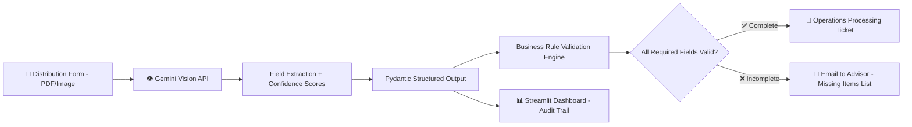

# 📄 FORMSENSE — Complete Project Scope v1.0

## AI-Powered Distribution Form Validator for Retirement Plan Operations
## "From Paper to Processing" — Intelligent Document Extraction with Automated Escalation

**Document Version:** 1.2 (SDK-First AI Architecture + Evaluation & Docker + pyproject.toml + 2026 Production Patterns)  
**Last Updated:** April 03, 2026  
**Status:** 📋 DRAFT — Awaiting Approval  
**Author:** Manuel Reyes  
**Strategic Priority:** 📄 DOCUMENT INTELLIGENCE — Multimodal AI for Financial Services Operations

---

## 📋 Table of Contents

1. [Executive Summary](#1-executive-summary)
2. [Strategic Positioning](#2-strategic-positioning)
3. [Market Validation](#3-market-validation)
4. [Business Problem](#4-business-problem)
5. [Data Architecture](#5-data-architecture)
6. [Feature Framework](#6-feature-framework)
7. [Phase 1: Form Extraction Engine](#7-phase-1-form-extraction-engine-weeks-1-3)
8. [Phase 2: Validation + Email Escalation + Dashboard](#8-phase-2-validation--email-escalation--dashboard-weeks-4-5)
9. [AI Guardrails](#9-ai-guardrails)
10. [Tech Stack](#10-tech-stack)
11. [Project Structure](#11-project-structure)
12. [Sample Form Strategy](#12-sample-form-strategy)
13. [Success Metrics](#13-success-metrics)
14. [Risk Mitigation](#14-risk-mitigation)
15. [Timeline Summary](#15-timeline-summary)
16. [Project Evolution (5 Stages)](#16-project-evolution-5-stages)

---

## 1. Executive Summary

**FormSense** is an AI-powered document processing system that reads retirement plan distribution forms (often handwritten or hand-selected checkboxes), extracts participant selections and information, validates completeness against business rules, and routes the result appropriately: complete forms generate a processing ticket for operations, while incomplete forms trigger an automated email to the financial advisor company requesting the missing information.

This is a **Multimodal AI project** — using vision-capable LLMs to understand document layouts, handwriting, and checkbox selections. It demonstrates the intersection of AI and financial services operations, directly applicable to daily work at Daybright Financial.

### Why This Project Matters

| Factor | Why It Wins for Portfolio |
|--------|--------------------------|
| **$17.8B market** | Intelligent Document Processing (IDP) projected to reach $17.8B by 2032 |
| **88% of financial institutions** prioritizing document automation in 2025 digital transformation | Extend Research (2026) |
| **Directly applicable** | You process these exact distribution forms daily at Daybright Financial |
| **Multimodal AI showcase** | Vision LLM (Gemini Pro Vision) reading handwritten forms — advanced skill signal |
| **End-to-end workflow** | Extract → Validate → Route (email OR ticket) — not just extraction but complete automation |
| **ERISA relevance** | Addresses compliance requirements for retirement plan distribution processing |
| **Finance domain differentiator** | No tutorial teaches this — requires genuine operations domain expertise |

### What Makes This Project Different

| Dimension | Typical "OCR/Form Extraction" Tutorial | FormSense |
|-----------|---------------------------------------|-----------|
| **Forms** | Generic invoices or receipts | Retirement plan distribution forms (checkboxes, signatures, handwriting) |
| **Extraction** | Simple OCR text extraction | Multimodal LLM understanding (layout, checkboxes, handwriting, context) |
| **Validation** | Basic "is field empty?" checks | Business rule validation (distribution type requires specific fields, tax withholding ranges, beneficiary requirements) |
| **Routing** | None — just extracts data | Complete workflow: email advisor for missing info OR create operations ticket |
| **Domain** | Generic documents | ERISA-regulated retirement plan operations (real compliance requirements) |
| **AI Architecture** | Single provider, raw text | Provider-agnostic SDK (Gemini/OpenAI/Claude) |
| **AI Outputs** | Unstructured text responses | Pydantic-validated structured outputs (FormExtraction, ValidationResult, EscalationEmail, ProcessingTicket) |
| **Guardrails** | None | Financial data validation, PII protection, extraction confidence scoring |
| **Observability** | None | Token usage, cost tracking, extraction accuracy metrics |
| **CI/CD** | None | GitHub Actions on every PR |

### Core Capabilities

- **Multimodal Form Reading:** Upload PDF/image of distribution form → AI reads checkboxes, handwriting, selections, and printed text
- **Intelligent Field Extraction:** Extract 15+ fields including participant info, distribution type, payment method, tax elections, and beneficiary data
- **Business Rule Validation:** Validate extracted data against retirement plan distribution rules (required fields per distribution type, valid ranges, cross-field dependencies)
- **Smart Routing:** Complete forms → generate operations processing ticket | Incomplete forms → generate email to financial advisor with specific missing items
- **Confidence Scoring:** Every extracted field rated for confidence; low-confidence fields flagged for human review
- **Structured Outputs:** Pydantic-validated extraction results with field-level confidence
- **AI Observability:** Token usage, cost tracking, extraction accuracy metrics
- **Production Practices:** GitHub Actions CI, type hints, comprehensive testing, sample forms

---

## 2. Strategic Positioning

### 2.1 Roadmap Alignment (Stage 1: GenAI-First Data Analyst & AI Engineer)

This project directly delivers on **4 critical roadmap objectives**:

| Roadmap Goal | How FormSense Delivers |
|-------------|------------------------|
| "Build AI-powered dashboards and chatbots" (Stage 1 Strategy) | ✅ Streamlit dashboard with AI form processing pipeline |
| "LLM SDKs (Gemini, OpenAI, Claude)" (Month 3-5 Skills) | ✅ Multimodal Gemini Vision SDK for document understanding |
| "Production AI systems" (Roadmap Philosophy) | ✅ End-to-end workflow: extract → validate → route (real business process) |
| "Finance domain expertise as differentiator" (Career Strategy) | ✅ Retirement plan distribution forms — no tutorial teaches this |

### 2.2 Portfolio Ecosystem

```
PORTFOLIO PROJECT ECOSYSTEM (Stage 1)
═══════════════════════════════════════════

1. 1099 Reconciliation Pipeline ✅ DEPLOYED
   └─ Skills: Python, Pandas, ETL, pytest, CI/CD
   └─ Impact: $15K/year savings, 95% time reduction

2. DataVault Analyst ⭐ FIRST AI PROJECT
   └─ Skills: LLM SDK, PandasAI, Streamlit, PII handling
   └─ AI Pattern: SDK-first architecture (shared across all projects)

3. PolicyPulse 🧠 RAG FOUNDATION
   └─ Skills: Embeddings, chunking, semantic search, RAG
   └─ AI Pattern: Document → Embedding → Retrieval → Generation

4. FormSense 📄 DOCUMENT INTELLIGENCE (THIS SCOPE)
   └─ Skills: Multimodal LLM, form extraction, validation, email automation
   └─ AI Pattern: Vision AI for financial document processing
   └─ NEW SKILL: Multimodal AI (image/PDF understanding)

5. Operations-Demand-Intelligence 📊 ENTERPRISE ANALYTICS
   └─ Reuses: AI layer from DVA + document skills from FormSense

6. StreamSmart Optimizer 💰 CONSUMER AI APP
   └─ Skills: API integration, rotation planning, cost optimization

7. Attention-Flow Catalyst 🚀 FLAGSHIP
   └─ Reuses: All shared AI patterns from above projects
```

### 2.3 The "30-Second Rule" Optimization

- **README hero section:** GIF showing "upload form → AI reads checkboxes → validates → generates email or ticket" in 10 seconds
- **Live demo link:** Streamlit Cloud deployment (click and try immediately)
- **Business impact:** "Automates 80% of distribution form intake processing, reducing errors by 90% and saving 20+ hours/week"
- **Tech badges:** Python, Streamlit, Gemini Vision SDK, Multimodal AI, Pydantic, GitHub Actions

---

## 3. Market Validation

### 3.1 Industry Adoption

| Statistic | Source |
|-----------|--------|
| IDP market projected to reach $17.8B by 2032 (28.9% CAGR) | Docsumo (2025) |
| 88% of financial institutions prioritizing document automation in 2025 | Extend Research (2026) |
| 63% of Fortune 500 companies implemented IDP solutions | Extend Research (2026) |
| Financial services + healthcare account for 50%+ of IDP use cases | Everest Group |
| AI-automated systems streamline loans, hardship withdrawals, and distribution processing | Benefits Law Advisor (2025) |
| One financial services firm saved $2.9M annually after IDP adoption | Docsumo (2025) |
| Principal Financial achieved same-day processing for 96% of transactions with AI | Iralogix (2025) |
| Organizations report 30-200% ROI in first year of document automation | Docsumo (2025) |

### 3.2 Why Multimodal LLM Over Traditional OCR

| Approach | Traditional OCR | Multimodal LLM (FormSense) |
|----------|----------------|----------------------------|
| **Checkbox detection** | Template-based, breaks with layout changes | Understands intent — "the 'Lump Sum' option is checked" |
| **Handwriting** | Low accuracy for cursive/messy | High accuracy with context understanding |
| **Layout understanding** | Fixed coordinates per template | Semantic understanding of form structure |
| **Cross-field validation** | Separate rule engine required | Can reason about field relationships natively |
| **New form versions** | Requires re-templating | Adapts automatically to layout changes |
| **Cost for Stage 1** | Free (Tesseract) | ~$0.01-0.05 per form (Gemini Vision API) |

### 3.3 Competitive Landscape

| Solution | What It Does | What's Missing |
|----------|-------------|----------------|
| **Manual review** | Human reads each form | 5-10 min per form, error-prone, not scalable |
| **Tesseract OCR** | Basic text extraction | No checkbox detection, no handwriting, no validation |
| **AWS Textract** | Form field extraction | Generic — doesn't understand retirement distribution rules |
| **Google Document AI** | Structured extraction | Requires custom processors, no business logic |
| **FormSense** | Multimodal extraction + retirement-specific validation + routing | ✅ Domain-specific, end-to-end, affordable |

---

## 4. Business Problem

### 4.1 Context

At Daybright Financial (and across the retirement plan industry), distribution form processing is a daily workflow:

1. **Financial advisor** sends a distribution form for a plan participant (often filled out by hand)
2. **Operations team** must manually read the form, identify what's selected, check for completeness
3. **If incomplete:** Operations emails the advisor asking for the missing information (delays processing 2-5 days)
4. **If complete:** Operations creates a processing ticket and begins the distribution

**Current Pain Points:**
- **Manual reading:** Each form takes 5-10 minutes to review manually
- **Handwriting challenges:** Checkboxes ambiguous, handwriting illegible, marks unclear
- **High error rate:** ~15-20% of forms have missing or inconsistent information
- **Slow escalation:** When info is missing, manual email drafting adds 10-15 minutes per case
- **No standardization:** Different reviewers may interpret forms differently
- **No audit trail:** No structured record of what was extracted or why it was escalated

### 4.2 Solution

**FormSense** automates this entire workflow:

1. **Upload** distribution form (PDF or image)
2. **AI reads** the form using multimodal vision — detects checkboxes, handwriting, printed text
3. **Extracts** all fields into structured data (Pydantic models)
4. **Validates** against business rules (required fields per distribution type, valid ranges)
5. **Routes** based on validation result:
   - ✅ **Complete** → generates processing ticket for operations team
   - ❌ **Incomplete** → generates email to financial advisor listing specific missing items
6. **Dashboard** shows processing pipeline, extraction results, and audit trail

### 4.3 Distribution Form Fields to Extract

| Field Category | Fields | Extraction Challenge |
|---------------|--------|---------------------|
| **Participant Info** | Name, SSN (last 4), DOB, Address, Phone | Handwritten or printed text |
| **Plan Info** | Plan name, Plan number, Account number | Pre-printed + handwritten |
| **Distribution Type** | Lump sum, Partial, Installment, Required Minimum Distribution (RMD), Hardship | Checkbox selection (often hand-marked) |
| **Payment Method** | ACH/Direct Deposit, Check, Wire Transfer, Rollover to IRA/other plan | Checkbox + account details |
| **Tax Withholding** | Federal withholding %, State withholding %, Opt-out election | Checkbox + written percentage |
| **Beneficiary** | Spouse consent (if applicable), Beneficiary name | Signature + printed name |
| **Authorization** | Participant signature, Date signed, Advisor signature | Signature detection (present/absent) |
| **Special Instructions** | Free-text notes from advisor or participant | Handwritten text |

### 4.4 Measurable Business Impact

| Metric | Current State | With FormSense | Impact |
|--------|--------------|----------------|--------|
| Form review time | 5-10 min per form | < 30 seconds | **95% faster** |
| Error rate (missed fields) | 15-20% | < 3% | **85% reduction** |
| Escalation email drafting | 10-15 min per email | Automated | **100% time saved** |
| Forms processed per day | 20-30 (manual) | 100+ (AI-assisted) | **3-5x throughput** |
| Inconsistency rate | Varies by reviewer | 0% (same rules always) | **100% consistent** |
| Audit trail | None | Full extraction log | **Complete traceability** |
| Estimated annual savings | — | $40K+ (labor time) | **Direct ROI** |

---

## 5. Data Architecture

### 5.1 Processing Pipeline

```
FORMSENSE PROCESSING PIPELINE
══════════════════════════════

Form Upload             AI Extraction           Validation              Routing
┌──────────────┐      ┌──────────────┐      ┌──────────────┐      ┌──────────────┐
│ PDF/Image    │ ──►  │ Multimodal   │ ──►  │ Business     │ ──►  │ Complete?    │
│ Distribution │Gemini│ Field        │Pydnt │ Rule         │      │              │
│ Form         │Vision│ Extraction   │ ic   │ Validation   │      │  YES ──► 🎫  │
│              │  API │ + Confidence │Valid │ Engine       │      │  NO  ──► 📧  │
└──────────────┘      └──────────────┘      └──────────────┘      └──────────────┘
                                                                         │
                                                    ┌────────────────────┤
                                                    │                    │
                                                    ▼                    ▼
                                           ┌──────────────┐    ┌──────────────┐
                                           │ 🎫 Processing │    │ 📧 Advisor   │
                                           │ Ticket        │    │ Email        │
                                           │ (Operations)  │    │ (Missing     │
                                           │               │    │  Items List) │
                                           └──────────────┘    └──────────────┘
```

### 5.2 Pydantic Schemas (Structured Outputs)

```python
class ExtractedField(BaseModel):
    """Single field extracted from form."""
    field_name: str             # "distribution_type"
    field_value: str | None     # "Lump Sum" or None if not found
    confidence: float           # 0.0-1.0
    location_description: str   # "Section 3, checkbox area, top-left"
    extraction_method: str      # "checkbox_detected" | "handwriting_ocr" | "printed_text"
    requires_review: bool       # True if confidence < 0.8

class FormExtraction(BaseModel):
    """Complete extraction result from a distribution form."""
    form_id: str                # "FS-2026-00123"
    extraction_timestamp: datetime
    
    # Participant Info
    participant_name: ExtractedField
    ssn_last_four: ExtractedField
    date_of_birth: ExtractedField
    address: ExtractedField
    phone: ExtractedField
    
    # Plan Info
    plan_name: ExtractedField
    plan_number: ExtractedField
    account_number: ExtractedField
    
    # Distribution Details
    distribution_type: ExtractedField       # Lump Sum | Partial | Installment | RMD | Hardship
    distribution_amount: ExtractedField     # Dollar amount or "Full Balance"
    distribution_reason: ExtractedField     # Separation, Retirement, Hardship, etc.
    
    # Payment Method
    payment_method: ExtractedField          # ACH | Check | Wire | Rollover
    bank_routing_number: ExtractedField     # If ACH
    bank_account_number: ExtractedField     # If ACH
    rollover_institution: ExtractedField    # If Rollover
    
    # Tax Elections
    federal_withholding_pct: ExtractedField
    state_withholding_pct: ExtractedField
    
    # Authorization
    participant_signature_present: ExtractedField  # True/False
    signature_date: ExtractedField
    advisor_signature_present: ExtractedField      # True/False
    spouse_consent_present: ExtractedField          # True/False/N/A
    
    # Metadata
    overall_confidence: float
    total_fields: int
    fields_extracted: int
    fields_missing: int
    extraction_cost_usd: float

class ValidationRule(BaseModel):
    """Single validation rule and its result."""
    rule_id: str                # "VR01"
    rule_name: str              # "Participant signature required"
    field_name: str             # "participant_signature_present"
    expected: str               # "True"
    actual: str | None          # "True" or None
    passed: bool                # True/False
    severity: str               # "critical" | "warning" | "info"
    message: str                # "Participant signature is missing"

class ValidationResult(BaseModel):
    """Complete validation of an extracted form."""
    form_id: str
    is_complete: bool           # All critical rules passed?
    rules_passed: int
    rules_failed: int
    rules_warned: int
    critical_failures: list[ValidationRule]
    warnings: list[ValidationRule]
    all_results: list[ValidationRule]

class EscalationEmail(BaseModel):
    """Generated email to financial advisor for missing information."""
    form_id: str
    advisor_company: str
    advisor_email: str          # From form or config
    subject: str                # "Distribution Form Incomplete — [Participant Last 4 SSN] — Action Required"
    body: str                   # Professional email listing missing items
    missing_items: list[str]    # ["Participant signature", "Federal withholding election"]
    priority: str               # "high" | "medium" | "low"
    created_at: datetime

class ProcessingTicket(BaseModel):
    """Operations processing ticket for complete forms."""
    ticket_id: str              # "OPS-2026-00456"
    form_id: str
    participant_name: str       # Extracted from form
    plan_name: str
    distribution_type: str
    distribution_amount: str
    payment_method: str
    priority: str               # Based on distribution type
    assigned_queue: str         # "distributions" | "rollovers" | "hardship"
    created_at: datetime
    extraction_confidence: float

class ProcessingMetrics(BaseModel):
    """Observability data per form processed."""
    form_id: str
    extraction_latency_ms: float
    validation_latency_ms: float
    total_latency_ms: float
    tokens_used: int
    estimated_cost_usd: float
    fields_extracted: int
    fields_missing: int
    overall_confidence: float
    routing_decision: str       # "ticket" | "email"
```

### 5.3 Validation Rules Engine

```yaml
# config/validation_rules.yaml
rules:
  # === CRITICAL (must pass for form to be complete) ===
  - id: VR01
    name: "Participant signature required"
    field: "participant_signature_present"
    condition: "equals"
    expected: "True"
    severity: "critical"

  - id: VR02
    name: "Signature date required"
    field: "signature_date"
    condition: "not_empty"
    severity: "critical"

  - id: VR03
    name: "Distribution type selected"
    field: "distribution_type"
    condition: "not_empty"
    severity: "critical"

  - id: VR04
    name: "Payment method selected"
    field: "payment_method"
    condition: "not_empty"
    severity: "critical"

  - id: VR05
    name: "Participant name provided"
    field: "participant_name"
    condition: "not_empty"
    severity: "critical"

  - id: VR06
    name: "SSN (last 4) provided"
    field: "ssn_last_four"
    condition: "matches_pattern"
    pattern: "^\\d{4}$"
    severity: "critical"

  # === CONDITIONAL RULES ===
  - id: VR07
    name: "Bank info required for ACH"
    condition: "if_then"
    if_field: "payment_method"
    if_value: "ACH"
    then_field: "bank_routing_number"
    then_condition: "not_empty"
    severity: "critical"

  - id: VR08
    name: "Rollover institution required for Rollover"
    condition: "if_then"
    if_field: "payment_method"
    if_value: "Rollover"
    then_field: "rollover_institution"
    then_condition: "not_empty"
    severity: "critical"

  - id: VR09
    name: "Spouse consent required for married participants"
    condition: "if_then"
    if_field: "distribution_type"
    if_value: "Lump Sum"
    then_field: "spouse_consent_present"
    then_condition: "not_empty"
    severity: "critical"
    note: "ERISA requires spouse consent for certain distribution types"

  - id: VR10
    name: "Hardship reason required for Hardship distribution"
    condition: "if_then"
    if_field: "distribution_type"
    if_value: "Hardship"
    then_field: "distribution_reason"
    then_condition: "not_empty"
    severity: "critical"

  # === WARNINGS ===
  - id: VR11
    name: "Federal withholding percentage in valid range"
    field: "federal_withholding_pct"
    condition: "in_range"
    min: 0
    max: 100
    severity: "warning"

  - id: VR12
    name: "Advisor signature recommended"
    field: "advisor_signature_present"
    condition: "equals"
    expected: "True"
    severity: "warning"
```

---

## 6. Feature Framework

### 6.1 Pre-Built Features (No AI Required)

| ID | Feature | Description |
|----|---------|-------------|
| **FS01** | Form Upload | Upload PDF/image of distribution form |
| **FS02** | Form History | Browse previously processed forms with status |
| **FS03** | Validation Dashboard | View pass/fail rates, common missing fields |
| **FS04** | Email Templates | View/edit escalation email templates |
| **FS05** | Processing Queue | View generated operations tickets |
| **FS06** | Analytics | Form volume, completion rates, processing time trends |

### 6.2 AI-Powered Features

| ID | Feature | Description |
|----|---------|-------------|
| **AI01** | Multimodal Form Reading | Gemini Vision reads PDF/image, understands layout and checkboxes |
| **AI02** | Field Extraction | Extract 15+ fields with per-field confidence scoring |
| **AI03** | Handwriting Recognition | Read handwritten text, numbers, and marks |
| **AI04** | Checkbox Detection | Identify checked vs unchecked boxes in form layout |
| **AI05** | Smart Validation | Business rule engine with conditional logic |
| **AI06** | Email Generation | Draft professional escalation email listing missing items |
| **AI07** | Ticket Generation | Create structured operations ticket from extracted data |
| **AI08** | Batch Processing | Process multiple forms in sequence with progress tracking |

### 6.3 Dashboard Pages

| Page | Content | AI Required? |
|------|---------|-------------|
| **📤 Upload & Process** | Upload form, see extraction results, review routing decision | Yes |
| **📊 Extraction Results** | Field-by-field extraction with confidence scores, side-by-side form view | Yes |
| **📧 Escalation Emails** | Generated emails to advisors, send/edit/archive | Partially |
| **🎫 Processing Queue** | Operations tickets, status tracking, assignment | No |
| **📈 Analytics** | Volume, completion rates, common failures, processing time | No |

---

## 7. Phase 1: Form Extraction Engine (Weeks 1-3)

### Week 1: Project Setup + Multimodal AI Foundation

**Tasks:**
- Set up project structure (matching established pattern)
- Implement Gemini Vision API client (provider-agnostic abstraction)
- Build PDF-to-image conversion pipeline (PyMuPDF → PIL)
- Create initial extraction prompt engineering (form understanding instructions)
- Test basic extraction on sample distribution form
- Set up GitHub Actions CI
- Create Pydantic schemas for all data models

**Deliverables:**
- ✅ Gemini Vision API reading sample forms
- ✅ Basic field extraction working (name, SSN last 4, distribution type)
- ✅ Pydantic schemas validated
- ✅ CI pipeline green

### Week 2: Comprehensive Field Extraction

**Tasks:**
- Engineer multimodal prompts for all 15+ fields
- Implement per-field confidence scoring
- Build checkbox detection logic (checked vs unchecked)
- Implement handwriting extraction with confidence
- Create extraction result display component (side-by-side: form image + extracted data)
- Build extraction accuracy testing framework (sample forms with known correct values)
- Implement extraction retry logic for low-confidence fields

**Deliverables:**
- ✅ All 15+ fields extracting with confidence scores
- ✅ Checkbox detection working (checked/unchecked/ambiguous)
- ✅ Extraction accuracy > 85% on test forms
- ✅ Side-by-side display working in Streamlit

### Week 3: Validation Engine

**Tasks:**
- Build YAML-driven validation rule engine
- Implement conditional validation logic (if ACH → require bank info)
- Create validation result display (pass/fail with severity colors)
- Build routing decision logic (complete → ticket | incomplete → email)
- Write comprehensive validation tests
- Handle edge cases: partially filled fields, ambiguous marks, multi-page forms

**Deliverables:**
- ✅ 12+ validation rules working (critical + warnings)
- ✅ Conditional validation logic (cross-field dependencies)
- ✅ Routing decisions correct for test cases
- ✅ Test coverage > 80%

---

## 8. Phase 2: Validation + Email Escalation + Dashboard (Weeks 4-5)

### Week 4: Email Generation + Ticket Creation

**Tasks:**
- Build escalation email generator (LLM drafts professional email listing missing items)
- Create email template system (YAML-configured templates per escalation type)
- Implement processing ticket generator (structured ticket from extraction data)
- Build escalation email preview and edit interface
- Create Processing Queue page (view tickets, filter by status/type)
- Implement AI observability (token/cost/extraction accuracy per form)
- Build AI guardrails (see Section 9)

**Deliverables:**
- ✅ Professional escalation emails generated for incomplete forms
- ✅ Processing tickets created for complete forms
- ✅ Email preview/edit interface working
- ✅ Processing Queue page rendering
- ✅ AI observability logging

### Week 5: Analytics + Batch Processing + Deploy

**Tasks:**
- Build Analytics page (volume, completion rates, common failures)
- Implement batch processing (upload multiple forms, process sequentially)
- Build form history page (previously processed forms with status)
- Deploy to Streamlit Cloud (FREE)
- Create README with demo GIF, architecture diagram
- Record 3-5 minute demo video
- Polish UI, error handling, loading states

**Deliverables:**
- ✅ All 5 dashboard pages working
- ✅ Batch processing for multiple forms
- ✅ Deployed to Streamlit Cloud
- ✅ README with GIF, live demo link
- ✅ Demo video recorded

---

## 9. AI Guardrails

### 9.1 Guardrail Framework

| ID | Guardrail | Implementation |
|----|-----------|----------------|
| **G01** | Extraction Confidence Threshold | Flag any field with confidence < 0.8 for human review |
| **G02** | PII Protection | SSN extracted as last 4 only; full SSN never stored or displayed |
| **G03** | Financial Data Validation | Distribution amounts validated against reasonable ranges ($1 - $10M) |
| **G04** | Disclaimer Injection | Every extraction includes: "AI-extracted — verify before processing" |
| **G05** | Human-in-the-Loop | AI never auto-submits — human reviews extraction before routing |
| **G06** | No Financial Advice | AI extracts and validates; never provides investment/tax guidance |
| **G07** | Audit Trail | Complete log of every extraction, validation, and routing decision |
| **G08** | Read-Only Processing | AI reads forms; never modifies originals or generates forms |
| **G09** | Rate Limiting | Max 50 forms per session to control API costs |
| **G10** | Fallback to Manual | If extraction confidence < 0.5 overall, flag for full manual review |

### 9.2 Guardrail Testing Strategy

```python
# tests/test_ai_guardrails.py

def test_low_confidence_flagged_for_review():
    """G01: Low-confidence fields flagged."""
    result = extract_form(low_quality_scan)
    flagged = [f for f in result.all_fields if f.requires_review]
    assert len(flagged) > 0

def test_ssn_only_last_four_extracted():
    """G02: Full SSN never stored."""
    result = extract_form(sample_form)
    assert len(result.ssn_last_four.field_value) == 4
    assert not re.match(r'\d{3}-\d{2}-\d{4}', result.ssn_last_four.field_value)

def test_distribution_amount_in_valid_range():
    """G03: Amount validated against reasonable range."""
    result = validate_extraction(mock_extraction(amount="999999999"))
    assert any(r.rule_id == "amount_range" for r in result.warnings)

def test_disclaimer_always_present():
    """G04: Every extraction includes disclaimer."""
    result = extract_form(sample_form)
    assert "AI-extracted" in result.disclaimer

def test_overall_low_confidence_triggers_manual():
    """G10: Very low confidence → full manual review."""
    result = extract_form(blurry_scan)
    assert result.overall_confidence < 0.5
    assert result.routing_decision == "manual_review"
```

---

## 10. Tech Stack

### 10.1 Core Stack

| Component | Technology | Why |
|-----------|------------|-----|
| **Language** | Python 3.11+ | Primary language, matches all portfolio projects |
| **Dashboard** | Streamlit | Consistent with DVA, ODI, AFC, PolicyPulse, StreamSmart |
| **LLM SDK** | Gemini Vision SDK (primary) | Multimodal capability for form reading |
| **PDF Processing** | PyMuPDF (fitz) | PDF → image conversion, text extraction |
| **Image Processing** | Pillow (PIL) | Image preprocessing, rotation, enhancement |
| **Data Validation** | Pydantic v2 | Structured outputs, consistent with all projects |
| **Email Generation** | Jinja2 + SMTP / Streamlit | Template-based email drafting (preview mode for demo) |
| **Charts** | Plotly | Interactive analytics, consistent with all projects |
| **Config** | YAML (PyYAML) | Human-readable validation rules and email templates |
| **Storage** | Local JSON + Parquet | Form results and processing history |
| **CI/CD** | GitHub Actions | Lint (ruff), type-check (mypy), test (pytest) |
| **Deployment** | Streamlit Cloud (FREE) | Zero-cost hosting for demo |

### 10.2 AI Architecture (Multimodal Provider-Agnostic)

```python
# src/ai/provider.py — Extended for multimodal

class MultimodalLLMProvider:
    """Provider-agnostic multimodal LLM abstraction."""
    
    def extract_from_image(
        self, 
        image: bytes, 
        extraction_prompt: str,
        schema: type[BaseModel]
    ) -> BaseModel:
        """Extract structured data from form image using vision LLM."""
        ...
    
    def generate_email(
        self,
        missing_items: list[str],
        form_context: dict,
        schema: type[EscalationEmail]
    ) -> EscalationEmail:
        """Generate professional escalation email."""
        ...

# config/ai_config.yaml
ai:
  provider: "gemini"
  vision_model: "gemini-2.0-flash"     # Multimodal capable
  text_model: "gemini-2.0-flash"       # For email generation
  temperature: 0.0                      # Zero for deterministic extraction
  max_tokens: 4000                      # Larger for complex form extraction
  fallback_provider: "openai"           # GPT-4o for vision fallback
```

### 10.3 Extraction Prompt Engineering

```python
EXTRACTION_PROMPT = """
You are a retirement plan operations specialist reviewing a distribution form.
Extract ALL fields from this form image with maximum accuracy.

For each field, provide:
1. The extracted value (exactly as written on the form)
2. Your confidence (0.0-1.0) in the extraction
3. How you extracted it (checkbox_detected, handwriting_ocr, printed_text)

CHECKBOX RULES:
- A checkbox is CHECKED if it contains: ✓, ✗, X, filled square, or any mark
- A checkbox is UNCHECKED if it is empty/blank
- If ambiguous, set confidence < 0.5

CRITICAL RULES:
- Extract SSN as LAST 4 DIGITS ONLY (privacy protection)
- If a field is blank/empty, set value to null and confidence to 1.0
- If you cannot read a field, set value to null and confidence to 0.0
- Never guess or fabricate information

Return your extraction as valid JSON matching the provided schema.
"""
```

---

## 11. Project Structure

```
formsense/
├── .cursor/
│   └── rules/
│       ├── git-workflow.mdc
│       ├── learning-mode.mdc
│       └── python-data.mdc
├── .github/workflows/ci.yml
├── config/
│   ├── ai_config.yaml            # LLM + vision settings
│   ├── validation_rules.yaml     # Business rules (12+)
│   ├── email_templates.yaml      # Escalation email templates
│   └── logging.yaml
├── data/
│   ├── sample_forms/             # Sample distribution forms (PDF/images)
│   │   ├── complete_form_01.pdf
│   │   ├── incomplete_form_01.pdf
│   │   ├── handwritten_form_01.pdf
│   │   └── edge_case_form_01.pdf
│   ├── results/                  # Extraction results (JSON)
│   ├── tickets/                  # Processing tickets (JSON)
│   └── emails/                   # Generated escalation emails (JSON)
├── logs/
│   ├── app/
│   ├── extraction/               # Per-form extraction logs
│   ├── ai/
│   │   ├── queries.log
│   │   ├── extraction_accuracy.log
│   │   └── guardrails.log
│   ├── evaluation/               # ⭐ DeepEval extraction evaluation results
│   └── errors.log
├── src/
│   ├── __init__.py
│   ├── py.typed                  # PEP 561 — type hint support marker
│   ├── extraction/
│   │   ├── __init__.py
│   │   ├── pdf_processor.py      # PDF → image conversion
│   │   ├── image_preprocessor.py # Image enhancement for better extraction
│   │   ├── form_extractor.py     # Multimodal LLM extraction
│   │   └── confidence.py         # Confidence scoring logic
│   ├── validation/
│   │   ├── __init__.py
│   │   ├── rule_engine.py        # YAML-driven validation
│   │   └── conditional.py        # Cross-field dependency logic
│   ├── routing/
│   │   ├── __init__.py
│   │   ├── email_generator.py    # Escalation email drafting
│   │   └── ticket_generator.py   # Operations ticket creation
│   ├── ai/
│   │   ├── __init__.py
│   │   ├── provider.py           # Multimodal provider-agnostic abstraction
│   │   ├── schemas.py            # Pydantic models
│   │   ├── prompts.py            # Extraction + email prompt templates
│   │   ├── guardrails.py         # Governance as code
│   │   └── observability.py      # Token/cost/accuracy tracking
│   └── utils/
│       ├── __init__.py
│       ├── config.py
│       └── logging.py
├── app/
│   ├── Home.py
│   ├── pages/
│   │   ├── 1_📤_Upload_Process.py
│   │   ├── 2_📊_Extraction_Results.py
│   │   ├── 3_📧_Escalation_Emails.py
│   │   ├── 4_🎫_Processing_Queue.py
│   │   └── 5_📈_Analytics.py
│   ├── components/
│   │   ├── form_viewer.py        # Side-by-side form + extraction
│   │   ├── confidence_badge.py
│   │   ├── validation_card.py
│   │   └── email_preview.py
│   └── utils/
│       └── session.py
├── tests/
│   ├── conftest.py               # Shared fixtures, mock vision API, sample form loaders
│   ├── test_pdf_processor.py
│   ├── test_form_extractor.py
│   ├── test_validation_rules.py
│   ├── test_email_generator.py
│   ├── test_ticket_generator.py
│   ├── test_ai_guardrails.py
│   ├── test_schemas.py
│   ├── test_eval.py              # ⭐ DeepEval custom GEval for extraction accuracy
│   └── eval_dataset.json         # ⭐ 30+ form extraction test cases for evaluation
├── scripts/
│   └── generate_sample_forms.py  # Create sample distribution forms
├── notebooks/
│   └── extraction_accuracy.ipynb
├── Dockerfile                    # Container definition
├── .dockerignore                 # Excludes .git, logs, tests, notebooks from image
├── .env.example                  # Required environment variables template
├── .gitignore
├── CONTRIBUTING.md               # Branch naming, commit style, PR process
├── LICENSE                       # MIT License
├── Makefile                      # make test, make lint, make eval, make docker-build
├── pyproject.toml                # Project metadata, dependencies, tool config (PEP 621)
└── README.md
```

---

## 12. Sample Form Strategy

### 12.1 Why Sample Forms (Not Real Ones)

| Aspect | Benefit |
|--------|---------|
| **Privacy compliance** | Zero risk of real participant data on GitHub |
| **ERISA compliance** | No actual distribution forms publicly shared |
| **Demonstrates skill** | Shows ability to design realistic financial forms |
| **Full demo experience** | Realistic forms let demo showcase complete pipeline |
| **Edge case testing** | Can create deliberately ambiguous forms for testing |

### 12.2 Sample Forms to Create

| Form | Scenario | Challenge |
|------|----------|-----------|
| **Complete Form #1** | Clean, typed, all fields present | Baseline — should pass all validation |
| **Complete Form #2** | Handwritten, all fields present | Tests handwriting extraction accuracy |
| **Incomplete Form #1** | Missing signature + tax election | Tests critical validation + email generation |
| **Incomplete Form #2** | ACH selected but missing bank info | Tests conditional validation rules |
| **Edge Case #1** | Ambiguous checkbox marks | Tests confidence scoring + manual review flag |
| **Edge Case #2** | Multi-page form with rollover details | Tests multi-page processing |
| **Edge Case #3** | Hardship distribution (extra requirements) | Tests conditional rules for hardship type |
| **Edge Case #4** | Low quality scan (rotated, faded) | Tests image preprocessing + low confidence handling |

### 12.3 Sample Form Generation

Sample forms will be created using Python (ReportLab or FPDF) to generate realistic-looking distribution forms with:
- Pre-printed form layout (company logo, field labels, checkboxes)
- Simulated handwriting (using handwriting-style fonts)
- Checkboxes in various states (checked, unchecked, ambiguous marks)
- Realistic but fake participant data (Faker library)

---

## 13. Success Metrics

### Phase 1 (Extraction Engine)

| Metric | Target |
|--------|--------|
| Fields extracting | 15+ per form |
| Per-field confidence | Scoring on every field |
| Checkbox detection accuracy | > 90% on test forms |
| Overall extraction accuracy | > 85% on test forms |
| Validation rules | 12+ rules working (critical + warnings) |
| Conditional validation | Cross-field dependencies working |
| Test coverage | > 80% |
| CI pipeline | Green |

### Phase 2 (Routing + Deploy)

| Metric | Target |
|--------|--------|
| Email generation | Professional emails for incomplete forms |
| Ticket generation | Structured tickets for complete forms |
| Routing accuracy | 100% correct routing on test forms |
| All 5 pages working | ✅ |
| Batch processing | Multiple forms in sequence |
| AI observability | Token/cost/accuracy logged per form |
| Guardrail test coverage | > 90% |
| Deployment | Live on Streamlit Cloud |
| Demo GIF | In README |

### Portfolio Impact

| Platform | Goal |
|----------|------|
| GitHub | Professional README with GIF, live demo link, architecture diagram |
| LinkedIn | Project launch post: "Built AI-powered document processor for retirement plan operations" |
| Streamlit Cloud | Live demo with sample forms |
| Resume | "Built multimodal AI system for distribution form extraction with 85%+ accuracy and automated advisor escalation" |

---

## 14. Risk Mitigation

| Risk | Mitigation |
|------|------------|
| **Vision LLM inconsistent extraction** | Structured prompts + Pydantic validation + retry on parse failure |
| **Checkbox detection ambiguity** | Confidence scoring + human review flag for ambiguous marks |
| **Handwriting illegible** | Low confidence → flag for manual review, never guess |
| **Form layout varies** | Multimodal LLM adapts to layout (not template-based like OCR) |
| **API cost per form** | ~$0.01-0.05 per form (Gemini Flash Vision); rate limiting for demo |
| **PII in sample forms** | Faker library generates realistic but fake data |
| **Provider lock-in** | Provider-agnostic abstraction (Gemini Vision ↔ GPT-4o Vision) |
| **ERISA compliance concerns** | Disclaimer: "AI-assisted extraction — human verification required" |

---


### AI Evaluation Layer — Custom GEval for Extraction Accuracy

FormSense uses a **custom GEval metric** (not standard RAG metrics) because it evaluates
structured extraction accuracy, not text retrieval:

```python
# tests/test_eval.py
from deepeval.metrics import GEval
from deepeval.test_case import LLMTestCaseParams, LLMTestCase

extraction_accuracy = GEval(
    name="Form Extraction Accuracy",
    evaluation_steps=[
        "Compare each extracted field value against the ground truth",
        "Check if checkbox states are correctly identified",
        "Verify numerical values (amounts, SSN last 4) match exactly",
        "Evaluate confidence scores correlate with extraction difficulty",
        "PENALIZE fabricated or hallucinated field values"
    ],
    evaluation_params=[
        LLMTestCaseParams.ACTUAL_OUTPUT,
        LLMTestCaseParams.EXPECTED_OUTPUT
    ],
    threshold=0.85
)

def test_complete_form_extraction():
    """Evaluate extraction accuracy on a complete form."""
    test_case = LLMTestCase(
        input="Extract all fields from complete_form_01.pdf",
        actual_output=str(extractor.extract("data/sample_forms/complete_form_01.pdf")),
        expected_output=str(GROUND_TRUTH["complete_form_01"])
    )
    extraction_accuracy.measure(test_case)
    assert extraction_accuracy.score >= 0.85
```

**Evaluation Metrics:**

| Metric | Target |
|--------|--------|
| Extraction Accuracy (custom GEval) | > 0.85 across 10+ sample forms |
| Field-level Confidence Calibration | Confidence scores correlate with actual accuracy |
| Validation Rule Coverage | 100% of rules have evaluation test cases |
| Dockerfile | Builds and runs locally |


### Docker Support (Containerization)

**Dockerfile** provided for reproducible local development and deployment.

```dockerfile
# Dockerfile
FROM python:3.11-slim
WORKDIR /app
COPY pyproject.toml .
RUN pip install --no-cache-dir .
COPY . .
EXPOSE 8501
CMD ["streamlit", "run", "app/Home.py", "--server.port=8501"]
```

**`.dockerignore`** (keeps image small and secure):
```
.git
.gitignore
.github/
.cursor/
.env
.env.example
*.md
LICENSE
CONTRIBUTING.md
Makefile
tests/
notebooks/
logs/
__pycache__/
*.pyc
.pytest_cache/
.venv/
```

**Run locally:**
```bash
docker build -t formsense .
docker run -p 8501:8501 --env-file .env formsense
```

**Why This Matters for Portfolio:**
Docker appears in 60%+ of AI/ML job postings. Including a Dockerfile
shows deployment readiness — critical for Junior AI Engineer applications.


---

## 15. Timeline Summary

```
Week 1 ──── Week 2 ──── Week 3 ──── Week 4 ──── Week 5
  │            │            │            │            │
  ▼            ▼            ▼            ▼            ▼
Setup        All Fields   Validation   Email Gen    Deploy
Vision API   Extraction   Rule Engine  Ticket Gen   Analytics
Basic        Checkbox     Conditional  Email UI     Batch
Extract      Handwriting  Routing      Guardrails   Polish
Schemas      Side-by-Side Logic        Observability README
Tests        Accuracy     Tests        Queue Page   Video

├──── Phase 1: Extraction Engine ────┼──── Phase 2: Routing ────┤
     + Vision AI + Validation              + Email + Tickets
```

### Key Milestones

| Week | Milestone |
|------|-----------|
| **Week 1** | ✅ Gemini Vision reading forms, basic fields extracting, CI green |
| **Week 2** | ✅ All 15+ fields extracting with confidence, checkbox detection working |
| **Week 3** | ✅ 12+ validation rules, conditional logic, routing decisions correct |
| **Week 4** | ✅ Escalation emails + processing tickets generating, all guardrails tested |
| **Week 5** | ✅ Deployed to Streamlit Cloud, README with GIF, demo recorded |

---

## 16. Project Evolution (5 Stages)

| Stage | Role | FormSense Enhancements |
|-------|------|------------------------|
| **1** | Data Analyst | ✅ Multimodal extraction + validation + routing (THIS SCOPE) |
| **2** | Data Engineer | AWS S3 form storage, PostgreSQL ticket tracking, SQS queue, scheduled batch processing |
| **3** | ML Engineer | Custom fine-tuned extraction model, form classification (distribution vs loan vs rollover), accuracy improvement |
| **4** | LLM Specialist | Multi-agent system (Extractor + Validator + Router agents), MCP integration for email sending, form history RAG for cross-referencing |
| **5** | Senior LLM | Production SaaS: OnBase integration, real-time processing, multi-form-type support, LLMOps evaluation pipeline (extraction accuracy benchmarks) |

---

## ✅ Approval Checklist

- [ ] Multimodal AI architecture correctly scoped (Gemini Vision for form reading)
- [ ] Pydantic schemas defined (FormExtraction, ValidationResult, EscalationEmail, ProcessingTicket)
- [ ] Sample form strategy approved (8 forms covering complete, incomplete, edge cases)
- [ ] Validation rules comprehensive (12+ rules with conditional logic)
- [ ] Routing logic defined (complete → ticket, incomplete → email)
- [ ] AI guardrails comprehensive (10 guardrails with test strategy)
- [ ] AI architecture aligned with DVA, AFC, ODI, PolicyPulse, StreamSmart (same SDK patterns)
- [ ] Timeline realistic (5 weeks at 25 hrs/week)

---

## Quick Reference

```
┌─────────────────────────────────────────────────────────────────┐
│            FORMSENSE v1.0                                       │
│     📄 DOCUMENT INTELLIGENCE — Multimodal AI for Finance        │
│     Distribution Form Validator with Automated Escalation       │
├─────────────────────────────────────────────────────────────────┤
│  👁️ MULTIMODAL EXTRACTION                                      │
│     • Gemini Vision reads PDF/image distribution forms          │
│     • Checkbox detection (checked/unchecked/ambiguous)          │
│     • Handwriting recognition with confidence scoring           │
│     • 15+ fields extracted per form                             │
│     • Per-field confidence (0.0-1.0)                            │
├─────────────────────────────────────────────────────────────────┤
│  ✅ VALIDATION ENGINE                                           │
│     • 12+ business rules (YAML-configured)                     │
│     • Conditional validation (ACH → require bank info)          │
│     • Cross-field dependency logic                              │
│     • ERISA-aware distribution requirements                     │
├─────────────────────────────────────────────────────────────────┤
│  📧 SMART ROUTING                                               │
│     • Complete forms → 🎫 operations processing ticket          │
│     • Incomplete forms → 📧 advisor email (specific missing items)│
│     • Low confidence → 👤 manual review flag                    │
├─────────────────────────────────────────────────────────────────┤
│  🤖 AI FEATURES (2026 Production Patterns)                      │
│     • Gemini Vision SDK (primary), GPT-4o Vision (fallback)     │
│     • Provider-agnostic multimodal abstraction                  │
│     • Pydantic-validated structured outputs                     │
│     • 10 guardrails (confidence, PII, financial validation)     │
│     • AI observability (tokens, cost, accuracy per form)        │
│     • Email generation with LLM                                 │
├─────────────────────────────────────────────────────────────────┤
│  🔧 ENGINEERING                                                 │
│     • Python logging for debugging + AI observability           │
│     • GitHub Actions CI                                         │
│     • YAML-driven validation rules (configurable)               │
│     • Streamlit Cloud deployment (FREE)                         │
│     • Test coverage >80%                                        │
├─────────────────────────────────────────────────────────────────┤
│  ⏱️ TIMELINE                                                    │
│     • 5 weeks total (25 hrs/week)                               │
│     • Phase 1: Extraction Engine (Weeks 1-3)                    │
│     • Phase 2: Routing + Deploy (Weeks 4-5)                     │
├─────────────────────────────────────────────────────────────────┤
│  🎯 PORTFOLIO STRATEGY                                          │
│     • Multimodal AI showcase (vision LLM reading forms)         │
│     • $17.8B IDP market — directly aligned with industry demand │
│     • Finance domain expertise as differentiator                │
│     • Directly applicable to daily work at Daybright Financial  │
│     • Live demo on Streamlit Cloud for recruiter access         │
│     • README with GIF demo (30-second recruiter test)           │
└─────────────────────────────────────────────────────────────────┘
```

---


## Production README Standard

> **v8.2 Cross-Project Standard:** Every project README must include these elements to meet production-grade portfolio quality.

| Element | Description | Format |
|---------|-------------|--------|
| **Mermaid Architecture Diagram** | System flow rendered inline on GitHub — no external images needed | ```` ```mermaid ```` code block |
| **Dockerfile** | Containerized local setup for reproducibility | `Dockerfile` in project root |
| **Evaluation Metrics Table** | DeepEval + pytest results summary showing AI quality measurements | Markdown table in README |
| **Demo GIF** | 15-30 second walkthrough of key functionality | Embedded GIF in README hero section |
| **"What I Learned" Section** | Key technical takeaways, patterns discovered, and challenges overcome | README section before footer |

### Architecture Diagram (Mermaid)



> **Why Mermaid?** Renders directly in GitHub README — no PNG files to maintain, stays in sync with code, signals architectural thinking to recruiters. Recruiters see the diagram without clicking external links.

---

**Document Status:** 📋 DRAFT (v1.2 — SDK-First AI Architecture + pyproject.toml + 2026 Production Patterns)  
**Date:** April 03, 2026  
**Total Timeline:** 5 weeks  
**Strategic Role:** Document Intelligence Project — Multimodal AI for Financial Services

*"Vision AI form reading + Business rule validation + Smart routing (email OR ticket) = Enterprise-grade document processing that operations teams actually deploy"* 🚀