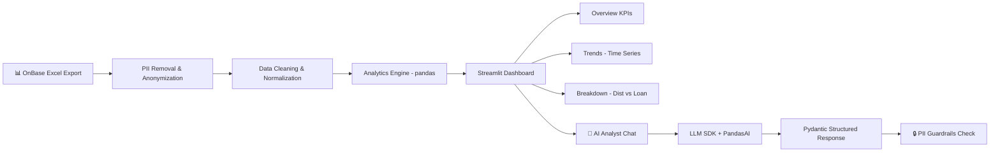

# 🚀 OPERATIONS-DEMAND-INTELLIGENCE — Project Scope v3.0

## AI-Powered Workflow Demand Analysis for Retirement Plan Operations

**Document Version:** 3.0 (🎯 **v10.0 REALIGNMENT** — Supporting (production-grade); 3-stage arc (S1 analytics → S2 demand-analytics platform → S3 AI insights); destination Applied AI Engineer → FDE. Consolidation overlap with DataVault/1099-S3 flagged. Prior v2.8 note archived below.)
**Last Updated:** August 10, 2026  
**Status:** 📋 DRAFT — Awaiting Approval  
**Author:** Manuel Reyes  
**Data Coverage:** June 02, 2025 — Present (~8 months)  

---


## 🎯 v10.0 ROADMAP ALIGNMENT & STAGE-EVOLUTION ARC — AUTHORITATIVE

> **This block governs.** Where anything below it conflicts (old stage numbers, retired titles, pre-v10.0 portfolio lists), **this block wins.**

**Aligned to:** Career Roadmap **v10.0 (2026 Market Realignment)**.

**Governing model:** **3 stages, not 5.** The retired 14-month "ML Engineer" stage is now an **embedded ML-literacy module inside Stage 3** (earned-overlay — ships only if it beats the baseline). The destination title is **Applied AI Engineer → Forward Deployed Engineer (FDE)**; the retired "Senior LLM Engineer" title is dropped. **This project is ONE system that evolves across stages — never rebuilt per stage.**

**Portfolio role:** 🧩 **Supporting** (production-grade; size ≠ tier) — internal enterprise **demand-analytics**. Overlaps the 1099-platform S3 Analyst layer & DataVault — candidate for consolidation (see note). In v10.0, **flagship vs supporting = size & emphasis, not a quality tier — every project is production-grade.** Lead projects get new tooling first and are updated continuously as skills grow.

**Stage-evolution arc:**

| Stage | Theme | This project's layer |
|---|---|---|
| **S1** | Foundation (GenAI-first core) | Demand analytics — workflow-demand pipeline + analytics dashboard over retirement-plan operations data (synthetic public repo). |
| **S2** | DE/AE hardening | Demand-analytics platform — **dbt models** over workflow data, time-series marts, Airflow, contracts, semantic/metrics layer, Docker/ECS. |
| **S3** | Applied AI (RAG/agentic + eval) | AI insights — NL querying + forecast-narrative generation over the demand marts (structured outputs, HITL, eval). |

- **Every project's S2 adds:** ingestion → **dbt-tested models (CI-gated)** → **data contracts** (Great Expectations) → warehouse/lakehouse → **Airflow** (idempotent runs) → Docker/**ECS** → monitoring + written **postmortem** → **semantic/metrics layer**.
- **Every project's S3 adds:** RAG/GraphRAG/agentic layer + **three-layer eval** (per-query metrics · trajectory tracing · drift vs frozen golden set) + **observability (Arize Phoenix, OTel-native, free)** + MCP + **HITL** on irreversible actions.

**Production standard (non-negotiable, ALL projects):** business-outcome headline · Mermaid diagram · **C4 Context diagram (+ Container view on lead flagships)** 🆕 · **`docs/adr/` — numbered, immutable Architecture Decision Records (context → decision → consequences)** 🆕 · Dockerfile · eval-metrics table · 15–30s demo GIF · "What I Learned" · **synthetic data only in public repos** · `pyproject.toml` + `uv.lock` + `src/` + `py.typed` + ruff + mypy · **structured logging (`structlog` over stdlib via `ProcessorFormatter`) + PII redaction processor · typed config (`pydantic-settings`, `SecretStr` credentials) · capped jittered retries (`stamina`)** · Conventional Commits · **🆕 `.pre-commit-config.yaml` — pinned hook set, enforced locally (v10.0 CORRECTION 21)**. *(🆕 C4 + ADR added per roadmap v10.0 CORRECTION 8, July 2026 — additive documentation discipline: the decision-and-defense artifacts Applied-AI/FDE interviews probe; same doc version, no structural change.)* **🆕 Toolchain (v10.0 CORRECTION 14, July 2026):** the C4 diagram and the Mermaid diagram come from **one source** — the architecture is modeled once in **Structurizr DSL** (`docs/architecture.dsl`, version-controlled) and the C4 Context/Container views are exported to **Mermaid** via `structurizr-cli` for the README, so the two never drift. Structurizr Lite is free and self-hosts in Docker (already required); model in Structurizr, render out to Mermaid. Additive; same doc version.* **🆕 Agentic harness (July 2026):** every repo also carries **`.opencode/`** (`agents/` — subagent definitions where the filename becomes the agent name; `commands/` — `/`-invoked slash commands), plus **`AGENTS.md`** and **`opencode.jsonc`** at the root. This mirrors the existing `.cursor/rules/` setup rather than replacing it — OpenCode's `instructions[]` field can load `.cursor/rules/*.md` directly and combines them with `AGENTS.md`, so **one set of standards drives both harnesses** and neither drifts. Tooling discipline, not a portfolio artifact.*

> **🆕 Pre-commit standard (roadmap v10.0 CORRECTION 21, August 2026).** This repo carries a pinned `.pre-commit-config.yaml`. **Governing rule: the hook set is a strict *subset* of the CI gate — CI stays authoritative, and no check exists locally that does not also run in CI.** Hooks are pinned by `rev:`, never floating. **Tier A (this repo):** `pre-commit/pre-commit-hooks` (`trailing-whitespace`, `end-of-file-fixer`, `check-yaml`, `check-toml`, `check-added-large-files`, `check-merge-conflict`, `detect-private-key`) · `astral-sh/ruff-pre-commit` → **`ruff-check` (with `--fix`) placed *before* `ruff-format`**, because the linter's fix behaviour can emit changes that then need reformatting (note: the linter hook id is `ruff-check`; the retired bare `ruff` id is not used) · `astral-sh/uv-pre-commit` → **`uv-lock`**, which is what turns the CORRECTION 13 reproducible-build claim from an assertion into an enforced invariant · **`gitleaks`** for secret scanning. **Tier C (`commit-msg` stage):** `conventional-pre-commit` — the Conventional Commits standard above is now **enforced, not merely declared**; install with `pre-commit install --hook-type commit-msg`. **Tier B (this repo handles notebooks):** **`nbstripout`** — strips notebook output before Git sees it. This extends the CORRECTION 16 PII choke point from the *logging* boundary to the *git* boundary; combined with `detect-private-key` and `gitleaks` it is the commit-time enforcement of the **synthetic-data-only-in-public-repos** rule, which otherwise depends on remembering to clear output every single time.
>
> **`mypy` is deliberately excluded from the hook set — CI-only.** The `mirrors-mypy` hook passes `--ignore-missing-imports` by default, which silently degrades third-party types to `Any` and produces different results than running mypy directly. If a local hook is ever wanted, it must be a `local` hook with `language: system` running `uv run mypy` with `pass_filenames: false`. **This exclusion is recorded as an ADR** — it is a decision with a tradeoff, not an omission.
>
> **Known risk — version drift (ADR-worthy).** `.pre-commit-config.yaml` pins tool versions *independently* of `uv.lock`, so upgrading ruff via uv leaves the hook on the old pin and local checks diverge from CI. Mitigation: `sync-with-uv` (or `sync-pre-commit-deps`) plus a scheduled `pre-commit autoupdate --freeze`.
>
> **`prek` — evaluated, not selected (falsifier recorded).** `prek` is a Rust drop-in alternative that reads this same config file and uses uv natively (adopted by CPython, FastAPI, Airflow, Ruff). It is *not* adopted now: `.pre-commit-config.yaml` is the artifact a reviewer recognises, and because prek reads that identical file the migration stays free and reversible. **Falsifier:** adopt if hook install/run time becomes a measured friction point against the 25 hrs/week schedule.
>
> **🆕 Python version — pinned (roadmap v10.0 CORRECTIONS 27–28, August 2026).** **Python 3.14 is the official floor for every project in this portfolio (`3.14+`).** It is pinned in one place per repo — `requires-python = ">=3.14"` in `pyproject.toml` — and every downstream tool reads from that single declaration: `[tool.ruff] target-version = "py314"`, `[tool.mypy] python_version = "3.14"`, the Dockerfile base image, and the CI matrix. **One source, no second place to drift.** ⚠️ **Enforcement:** a mismatch between any of those four and `requires-python` is a CI failure, not a lint warning — the same discipline `uv.lock` gets from the `uv-lock` hook under CORRECTION 21.
>
> ⚙️ **Two binding constraints on the pin.** **(a) Standard GIL build only — the free-threaded build (`python3.14t`) is explicitly NOT used.** Free-threading is where the C-extension wheel compatibility problems live, this portfolio has no CPU-bound multicore workload that would benefit, and debugging wheel availability is pure schedule tax against a 25 hrs/week budget with zero portfolio value. **(b) Airflow constraint-file caveat:** Airflow 3.2.0+ officially supports Python 3.14, but a known open issue reports the 3.14 constraint files being out of sync between the published Docker image and `pip`/`uv` install. **Documented workaround: fall back to the `constraints-3.13.txt` file for the Airflow service only** — this is a constraint-file selection, *not* a second Python version, and the interpreter stays 3.14. ⚠️ **Falsifier:** raise the floor only when a named dependency in a committed lockfile requires it, or when 3.14 leaves security support — **never to chase a release**; 3.15 ships October 2026 and is explicitly not adopted on release.
> **🆕 Language & AI last-mile standard (roadmap v10.0 CORRECTIONS 22–23, August 2026).** **Python and SQL are confirmed as the correct and sufficient primary languages** for this portfolio. **SQL is the single highest-signal language in DE postings**, and **PySpark is the capturable differentiator — reached through Python, not adopted as a separate language.** **Rust, Go, Java, Scala and standalone JavaScript were each evaluated and declined with recorded falsifiers**; JavaScript specifically as *redundant*, since TypeScript is a superset of it and the Stage-2 TypeScript sprint already covers that ground. **TypeScript is retained for the last mile only** — MCP protocol tooling and the AI application/UI layer. **This project stays Python-primary:** agent cores, retrieval, orchestration, evaluation and any long-horizon planning remain Python. ⚠️ **Falsifier:** revisit only if a target employer posts a JD naming a different primary language for the role being applied to. **No TypeScript layer in this project.** This is a Python/SQL data-platform project end to end; the last-mile TS layer belongs to PolicyPulse. Recorded so the absence is a decision, not an omission.
>
> ⚠️ **Evidence note — guardrail independently corroborated (August 2026).** The last-mile guardrail no longer rests solely on the sources that recommended the SDK. An independent practitioner review of the **AI SDK 7** release (June 2026) draws the same boundary unprompted: the SDK is strongest as a **TypeScript-first application layer**, and weaker where the core problem is multi-hour orchestration, language-agnostic workflows or deeply stateful agent planning — with the explicit note that teams deploying agents across **Python services, queues and data pipelines** should treat it as *an SDK layer, not an orchestration standard*. That is this portfolio's exact shape. Convergent and independently sourced; recorded as **directional**, per the CORRECTIONS 18–19 evidence standard.

**Consolidation note (v10.0):** ODI, the 1099-platform S3 Analyst layer, and DataVault all deliver internal NL analytics. Consider merging ODI's demand-analytics into the 1099 platform's mart/AI layer rather than maintaining a parallel project; keep ODI standalone only if the demand-forecasting angle is a distinct portfolio story.

---

## 📋 Table of Contents

1. [Executive Summary](#1-executive-summary)
2. [Business Problem](#2-business-problem)
3. [Data Architecture](#3-data-architecture)
4. [Demand Analysis Framework](#4-demand-analysis-framework)
5. [Phase 1: Data Pipeline & Analytics](#5-phase-1-data-pipeline--analytics-weeks-1-3)
6. [Phase 2: AI-Powered Dashboard](#6-phase-2-ai-powered-dashboard-weeks-4-6)
7. [AI Guardrails](#7-ai-guardrails)
8. [Tech Stack](#8-tech-stack)
9. [Project Structure](#9-project-structure)
10. [Success Metrics](#10-success-metrics)
11. [Timeline Summary](#11-timeline-summary)

---

## 1. Executive Summary

**Operations-Demand-Intelligence** is a portfolio project that analyzes workflow demand patterns from OnBase document processing at Daybright Financial. It enables data-driven staffing decisions and capacity planning through interactive dashboards with AI-powered natural language queries.

### What Makes This Project Stand Out

| Dimension | Typical Tutorial Project | Operations-Demand-Intelligence |
|-----------|-------------------------|-------------------------------|
| **Data Source** | Kaggle datasets | Real production workflow data |
| **Business Context** | Generic analysis | Finance domain expertise (10+ years) |
| **AI Architecture** | Single provider, raw text | Provider-agnostic SDK (Gemini/OpenAI/Claude) |
| **AI Outputs** | Unstructured text responses | Pydantic-validated structured outputs |
| **AI Features** | Basic chatbot | LLM SDK + PandasAI with guardrails & observability |
| **Data Privacy** | None needed | PII handling, synthetic data for GitHub |
| **CI/CD** | None | GitHub Actions on every PR |

### Core Capabilities

- **Demand Intelligence:** Volume analysis by workflow type, temporal patterns
- **Business Metrics:** Plan-level analytics, product mix, payment trends
- **AI Integration:** Natural language queries via LLM SDK (Gemini primary) + PandasAI + Streamlit
- **Structured Outputs:** Pydantic-validated AI responses with type safety
- **AI Observability:** Token usage, cost tracking, latency monitoring per query
- **Production Practices:** GitHub Actions CI, type hints, testing

### Project Scope Boundaries

```yaml
in_scope:
  - Weekly/monthly demand volume analysis
  - Workflow type distribution (Distribution vs Loan)
  - Temporal patterns (day of week, time of day, seasonality)
  - Plan and product mix analysis
  - AI chat interface for data exploration (LLM SDK + PandasAI)
  - Interactive Streamlit dashboard

out_of_scope:
  - Cycle time analysis (timestamps not available)
  - Real-time processing
  - Predictive ML models (future enhancement)
  - Multi-stage pipeline evolution
```

---

## 2. Business Problem

### 2.1 Current State

At Daybright Financial, retirement plan requests flow through OnBase document management. Data is exported **weekly** for analysis.

### 2.2 Data Availability

| Data Element | Available | Use Case |
|--------------|-----------|----------|
| Document intake date/time | ✅ Yes | Demand timing analysis |
| Workflow type | ✅ Yes | Distribution vs Loan segmentation |
| Plan information | ✅ Yes | Client-level analysis |
| Product type | ✅ Yes | MBDI/MBDII/PLAT mix |
| Payment method | ✅ Yes | ACH/Wire/Check trends |
| Transaction amount | ✅ Yes | Amount tier analysis |
| Cycle time per stage | ❌ No | Cannot calculate |

### 2.3 Business Questions to Answer

1. What is the weekly/monthly demand volume trend?
2. What is the Distribution vs Loan split over time?
3. Which days/times show peak processing demand?
4. Which plans generate the highest request volumes?
5. How does product type (MBDI/MBDII/PLAT) mix vary?
6. What are the payment method preferences?

---

## 3. Data Architecture

### 3.1 Source Data Schema

**OnBase Export Columns (15 total):**

| Column | Data Type | Sample Values | Analytics Use |
|--------|-----------|---------------|---------------|
| `Document Name` | string | — | Deduplication |
| `Document Handle` | string | — | Primary key |
| `Document Type` | string | Various | Workflow category |
| `Document Date` | date | — | Document creation |
| `Date Stored` | date | — | **Intake date** |
| `Time Stored` | time | — | **Intake time** |
| `KMC Plan ID` | string | — | Plan identifier |
| `Plan Name` | string | — | Plan display name |
| `KMC Product Type` | string | MBDI, MBDII, PLAT | **Product mix** |
| `KMC SSN` | string | — | ⚠️ PII - Remove |
| `First Name` | string | — | ⚠️ PII - Remove |
| `Last Name` | string | — | ⚠️ PII - Remove |
| `AmountKMC` | decimal | — | Amount analysis |
| `Payment Method` | string | ACH, Wire, Check | **Payment trends** |
| `Date of Birth` | date | — | ⚠️ PII - Age bands only |
| `Distribution/Loan` | string | Distribution, Loan | **Core segmentation** |

### 3.2 Data Classification

```yaml
pii_columns_remove:
  - KMC SSN           # Delete entirely
  - First Name        # Delete entirely
  - Last Name         # Delete entirely

pii_columns_transform:
  - Date of Birth     # Convert to age bands (18-30, 31-45, 46-55, 56-65, 65+)
  - KMC Plan ID       # Hash for GitHub version
  - Plan Name         # Anonymize for GitHub version

analytics_columns:
  - Document Type
  - Date Stored
  - Time Stored
  - KMC Product Type  # MBDI, MBDII, PLAT
  - Payment Method    # ACH, Wire, Check
  - AmountKMC
  - Distribution/Loan # Distribution or Loan
```

### 3.3 Data Volume

```yaml
current_data:
  distributions: ~5,300 rows (largest workflow)
  estimated_total: ~8,000-12,000 rows across all workflows
  refresh_frequency: Weekly
  
  history:
    start_date: "June 02, 2025"
    end_date: "January 29, 2026"
    duration: "~8 months"
    
  analysis_capabilities:
    - Week-over-week comparison: ✅ Yes
    - Month-over-month comparison: ✅ Yes (8 months)
    - Quarter-over-quarter: ✅ Yes (Q3 2025, Q4 2025, Q1 2026 partial)
    - Year-over-year: ❌ No (need 12+ months)
    - Seasonality detection: ⚠️ Limited (need full year)
```

### 3.4 Storage Structure

```
data/
├── raw/                      # Original exports (NOT in Git)
│   └── onbase_export_YYYYMMDD.xlsx
├── processed/                # Cleaned data (gitignored)
│   └── demand_facts.parquet
├── synthetic/                # Synthetic data for GitHub
│   └── sample_demand.csv
└── outputs/                  # Analysis results

logs/                         # Application logs (gitignored)
├── pipeline.log              # ETL processing logs
├── analytics.log             # Metrics calculation logs
└── app.log                   # Streamlit app logs
```

### 3.5 Logging Strategy

> **🆕 CORRECTION 16 (v10.0):** stdlib `logging` with `%`-format strings and per-domain
> rotating files is superseded by `structlog` over stdlib via `ProcessorFormatter`. The
> former "log files" are now *derived views* over one stdout stream, filtered by field.

```yaml
logging_config:
  library: "structlog over stdlib logging (structlog.stdlib.ProcessorFormatter)"
  configured_in: "src/observability/logging.py — configure_logging(), called once at entrypoint"

  log_levels:
    development: DEBUG
    production: INFO

  renderer:
    tty: "structlog.dev.ConsoleRenderer (colors)"
    container: "JSONRenderer + dict_tracebacks"

  destination: "stdout only (12-Factor) — rotation/shipping owned by Docker/aggregator"

  derived_views:               # replaces the former per-domain log files
    pipeline: 'logger startswith \"src.ingest\" or \"src.transform\"'
    analytics: 'logger startswith \"src.analytics\"'
    ai: 'event startswith \"ai_query\"'
    app: 'logger startswith \"src.app\"'      # Streamlit interactions
    guardrails: 'event == \"guardrail_blocked\"'   # (new — was not a separate file before)

  processors:
    - merge_contextvars           # run_id, request_id
    - add_logger_name
    - add_log_level
    - TimeStamper(iso, utc)
    - redact_pii                  # PII choke point — runs on third-party records too
    
  key_events_to_log:
    - File loaded (rows, columns, path)
    - PII removal completed
    - Validation results (pass/fail counts)
    - Metric calculation times
    - AI query requests and responses
    - AI token usage (input/output tokens per query)
    - AI cost tracking (cost per query, cumulative session cost)
    - AI latency (response time per LLM call)
    - AI provider used (Gemini/OpenAI/Claude per request)
    - Guardrail activations (blocked queries with reason)
    - Errors and exceptions with stack traces
```

**Example Logging Implementation:**

```python
# src/observability/logging.py — 🆕 CORRECTION 16
# Replaces the former per-module setup_logger() with ONE configuration that also
# captures third-party loggers (httpx, the LLM SDK, openpyxl) in the same format.
# Full module lives in .cursor/rules/python-production-standards.mdc.
from __future__ import annotations

import logging
import sys

import structlog


def configure_logging(level: int = logging.INFO, *, force_json: bool = False) -> None:
    """Configure structlog + stdlib once, at the entrypoint. Never per module."""
    json_mode = force_json or not sys.stderr.isatty()

    structlog.configure(
        processors=[
            *SHARED_PROCESSORS,                    # incl. redact_pii
            structlog.stdlib.PositionalArgumentsFormatter(),
            structlog.stdlib.ProcessorFormatter.wrap_for_formatter,   # MUST be last
        ],
        logger_factory=structlog.stdlib.LoggerFactory(),
        wrapper_class=structlog.stdlib.BoundLogger,
        cache_logger_on_first_use=True,            # False in tests
    )

    handler = logging.StreamHandler(sys.stdout)    # stdout only — 12-Factor
    handler.setFormatter(
        structlog.stdlib.ProcessorFormatter(
            foreign_pre_chain=[structlog.stdlib.ExtraAdder(), *SHARED_PROCESSORS],
            processors=[
                structlog.stdlib.ProcessorFormatter.remove_processors_meta,
                structlog.processors.JSONRenderer() if json_mode
                else structlog.dev.ConsoleRenderer(colors=True),
            ],
        )
    )
    root = logging.getLogger()
    root.handlers.clear()                          # idempotent across Streamlit reruns
    root.addHandler(handler)
    root.setLevel(level)


# Usage in modules:
# import structlog
# log = structlog.stdlib.get_logger(__name__)
# log.info("file_loaded", path=str(filepath), row_count=len(df), columns=len(df.columns))
```

> **Why this replaced `setup_logger()`:** the old helper attached a *new* pair of handlers
> every time it was called, so importing two modules produced duplicated lines; it captured
> nothing from third-party libraries; and its `%`-format strings made the output unqueryable.
> One `configure_logging()` at the entrypoint fixes all three.

---

## 4. Demand Analysis Framework

### 4.1 Core Segmentation

**Primary Segmentation: Distribution vs Loan**

```yaml
workflow_segmentation:
  distribution:
    column: "Distribution/Loan"
    value: "Distribution"
    expected_volume: "~5,300 rows (largest)"
    
  loan:
    column: "Distribution/Loan"
    value: "Loan"
    expected_volume: "TBD"
```

**Secondary Segmentation: Product Type**

```yaml
product_types:
  - MBDI
  - MBDII
  - PLAT
```

**Payment Methods:**

```yaml
payment_methods:
  - ACH
  - Wire
  - Check
```

### 4.2 Demand Metrics

| ID | Metric | Calculation | Granularity |
|----|--------|-------------|-------------|
| **DM01** | Total Volume | COUNT(documents) | Daily/Weekly/Monthly |
| **DM02** | Distribution vs Loan Mix | COUNT by Distribution/Loan | Weekly |
| **DM03** | Product Type Mix | COUNT by KMC Product Type | Weekly |
| **DM04** | Payment Method Mix | COUNT by Payment Method | Weekly |
| **DM05** | Day-of-Week Pattern | AVG volume by weekday | Weekly |
| **DM06** | Hour-of-Day Pattern | COUNT by hour | Daily |
| **DM07** | Top Plans | Top 10 plans by volume | Weekly |
| **DM08** | Amount Distribution | Percentiles, tiers | Weekly |
| **DM09** | Week-over-Week Change | % change vs prior week | Weekly |
| **DM10** | Month-over-Month Trend | % change vs prior month | Monthly |

### 4.3 Amount Tiers

```yaml
amount_tiers:
  tier_1: "$0 - $5,000"
  tier_2: "$5,001 - $25,000"
  tier_3: "$25,001 - $100,000"
  tier_4: "$100,001+"
```

### 4.4 Age Bands (from DOB)

```yaml
age_bands:
  - "18-30"
  - "31-45"
  - "46-55"
  - "56-65"
  - "65+"
```

---

## 5. Phase 1: Data Pipeline & Analytics (Weeks 1-3)

### Week 1: Foundation & Data Ingestion

| Task | Deliverable | Acceptance Criteria |
|------|-------------|---------------------|
| Project setup | Repo, CI, structure | pytest passes, Ruff clean |
| Excel loader | Read OnBase exports | Handles weekly files |
| PII processor | Remove/transform sensitive data | Zero PII in output |
| Schema validation | Validate columns | >98% pass rate |
| Synthetic data generator | Create fake data for GitHub | Realistic patterns |

**Key Code:**

```python
# src/ingest/loader.py
class OnBaseLoader:
    def load_excel(self, filepath: Path) -> pd.DataFrame: ...
    def validate_schema(self, df: pd.DataFrame) -> bool: ...
    def remove_pii(self, df: pd.DataFrame) -> pd.DataFrame: ...
    def transform_dob_to_age_band(self, dob: date) -> str: ...
```

### Week 2: Data Transformation

| Task | Deliverable | Acceptance Criteria |
|------|-------------|---------------------|
| Clean data pipeline | End-to-end ETL | Parquet output |
| Derived columns | Hour, day of week, amount tier, age band | All calculated |
| Aggregation functions | Flexible groupby | All metrics work |
| Data quality checks | Validation report | Documented |

**Key Code:**

```python
# src/transform/processor.py
class DemandProcessor:
    def add_time_dimensions(self, df: pd.DataFrame) -> pd.DataFrame: ...
    def add_amount_tier(self, df: pd.DataFrame) -> pd.DataFrame: ...
    def add_age_band(self, df: pd.DataFrame) -> pd.DataFrame: ...
    def to_parquet(self, df: pd.DataFrame, path: Path) -> None: ...
```

### Week 3: Analytics Engine

| Task | Deliverable | Acceptance Criteria |
|------|-------------|---------------------|
| Metric calculators | DM01-DM10 | All metrics accurate |
| Aggregation views | Pre-built summaries | Query-ready |
| Export functions | CSV/Parquet outputs | Automated reports |
| Documentation | README, docstrings | Complete |

**Key Code:**

```python
# src/analytics/metrics.py
class DemandMetrics:
    def total_volume(self, df: pd.DataFrame, period: str) -> pd.Series: ...
    def workflow_mix(self, df: pd.DataFrame) -> pd.DataFrame: ...
    def product_mix(self, df: pd.DataFrame) -> pd.DataFrame: ...
    def payment_mix(self, df: pd.DataFrame) -> pd.DataFrame: ...
    def top_plans(self, df: pd.DataFrame, n: int = 10) -> pd.DataFrame: ...
    def time_patterns(self, df: pd.DataFrame) -> pd.DataFrame: ...
```

---

## 6. Phase 2: AI-Powered Dashboard (Weeks 4-6)

### 6.1 Dashboard Architecture

```
┌─────────────────────────────────────────────────────────────┐
│                    STREAMLIT APP                            │
├─────────────────────────────────────────────────────────────┤
│  SIDEBAR                    │  MAIN CONTENT                 │
│  • Date Range               │  Page 1: Overview (KPIs)      │
│  • Distribution/Loan Filter │  Page 2: Trends (Time Series) │
│  • Product Type Filter      │  Page 3: Breakdown (Mix)      │
│  • Plan Filter              │  Page 4: AI Analyst (Chat)    │
└─────────────────────────────────────────────────────────────┘
```

### 6.2 Page Specifications

#### Page 1: Overview

```yaml
page_1_overview:
  kpi_cards:
    - "This Week Volume"
    - "Distribution vs Loan Split"
    - "Week-over-Week Change"
    - "Top Product Type"
    
  charts:
    - type: "Line"
      title: "Weekly Volume Trend"
    - type: "Donut"
      title: "Distribution vs Loan Mix"
```

#### Page 2: Trends

```yaml
page_2_trends:
  charts:
    - type: "Time series"
      title: "Daily/Weekly Volume Over Time"
    - type: "Heatmap"
      title: "Hour × Day of Week Pattern"
    - type: "Bar"
      title: "Monthly Comparison"
```

#### Page 3: Breakdown

```yaml
page_3_breakdown:
  charts:
    - type: "Stacked bar"
      title: "Product Type Mix (MBDI/MBDII/PLAT)"
    - type: "Pie"
      title: "Payment Method Mix (ACH/Wire/Check)"
    - type: "Bar"
      title: "Top 10 Plans by Volume"
    - type: "Histogram"
      title: "Amount Distribution"
```

#### Page 4: AI Analyst

```yaml
page_4_ai_analyst:
  interface: "Chat"
  ai_architecture: "LLM SDK (Gemini primary) + PandasAI (supplementary)"
  
  example_queries:
    - "What was our busiest week last month?"
    - "Show the Distribution vs Loan trend"
    - "Which product type grew the most?"
    - "Compare ACH vs Wire vs Check usage"
    - "What's the average transaction amount for MBDI?"
    
  features:
    - Natural language queries via LLM SDK
    - Pydantic-validated structured responses
    - Auto-generated visualizations
    - SQL/pandas transparency (code shown for every response)
    - Provider-agnostic (swap Gemini → OpenAI → Claude via config)
    - Token/cost tracking per query (AI observability)
    - Export results
    
  structured_output_example:
    model: "DemandInsight"
    fields:
      answer: "str — natural language response"
      metric_value: "float — the calculated number"
      time_period: "str — date range analyzed"
      confidence: "str — high/medium/low"
      sql_query: "str — transparency (code that produced the result)"
      rows_analyzed: "int — data scope"
```

### 6.3 Week-by-Week Dashboard Development

#### Week 4: Streamlit Foundation

| Task | Deliverable |
|------|-------------|
| App structure | Multi-page layout |
| Data loading | Cached Parquet reads |
| Sidebar filters | Date, workflow, product, plan |
| Page 1: Overview | KPIs + basic charts |

#### Week 5: Visualizations & AI

| Task | Deliverable |
|------|-------------|
| Page 2: Trends | Time series, heatmap |
| Page 3: Breakdown | Mix charts, top plans |
| LLM SDK integration | Provider-agnostic AI layer (Gemini primary) |
| Pydantic response models | Structured outputs for all AI responses |
| PandasAI integration | Supplementary chat interface |
| AI guardrails | Read-only, transparency, governance as code |

#### Week 6: Polish & Deploy

| Task | Deliverable |
|------|-------------|
| Page 4: AI Analyst | Polished chat with structured outputs |
| AI observability | Token/cost dashboard in sidebar |
| UI/UX polish | Consistent styling |
| Streamlit Cloud deploy | Public URL |
| Demo recording | 3-5 min video |
| README finalize | Portfolio-ready |

---

## 7. AI Guardrails

### 7.1 Access Control

```yaml
ai_access:
  mode: "Read-only"
  allowed: "SELECT, aggregations, groupby"
  prohibited: "Modifications, file access, PII queries"
```

### 7.2 Governance as Code

```python
# src/ai/guardrails.py — Testable guardrail logic
class AIGuardrail:
    """Validates AI queries before execution.
    
    Unlike config-only guardrails, this approach is testable
    with pytest and enforced at runtime.
    """
    def validate_query(self, query: str) -> GuardrailResult:
        """Check query against security rules."""
        # Check for PII patterns (SSN, names, DOB)
        # Check for modification attempts (UPDATE, DELETE, DROP)
        # Check token limits (4000 max)
        # Return validated or rejected with reason
        
    def sanitize_response(self, response: BaseModel) -> BaseModel:
        """Ensure AI response contains no leaked PII."""
        # Scan structured output fields for PII patterns
        # Redact if found, log guardrail activation
```

### 7.3 Transparency

```yaml
transparency:
  show_code: "Display pandas/SQL code for every response"
  show_row_count: "Display number of rows analyzed"
  acknowledge_limits: "State when data insufficient"
```

### 7.4 Cost Controls

```yaml
cost_controls:
  caching: "1 hour TTL for identical queries"
  token_limits: "4000 tokens per request"
  rate_limits: "50 queries/session"
```

### 7.5 Disclaimer

```yaml
disclaimer:
  text: |
    ⚠️ AI insights are for informational purposes only.
    Data reflects completed documents from OnBase exports.
  location: "Footer of every AI response"
```

---

## 8. Tech Stack

### Data Pipeline

| Category | Technology |
|----------|------------|
| Language | Python 3.14+ |
| Data Processing | pandas, numpy |
| Excel Handling | openpyxl |
| Storage | Parquet |
| Synthetic Data | Faker |
| Testing | pytest |
| Linting | Ruff, mypy |
| CI/CD | GitHub Actions |

### Dashboard

| Category | Technology |
|----------|------------|
| Web Framework | Streamlit |
| Charts | Plotly |
| **AI (Primary)** | **LLM SDK (Gemini primary, OpenAI/Claude supported)** |
| **AI (Supplementary)** | **PandasAI (natural language data querying)** |
| **Structured Outputs** | **Pydantic v2 (response validation)** |
| **AI Observability** | **Python logging + token/cost tracking** |
| Hosting | Streamlit Cloud (FREE) |
| **AI Evaluation** | **DeepEval (answer relevancy for PandasAI analytics queries)** |
| **Containerization** | **Docker (Dockerfile for deployment)** |

---

## 9. Project Structure

```
operations-demand-intelligence/
├── .cursor/
│   ├── rules/                    # Production standards (version-controlled)
│   │   ├── git-workflow.mdc      # alwaysApply: true — branch, commit, PR conventions
│   │   ├── learning-mode.mdc     # alwaysApply: true — learning patterns, skill progression
│   │   ├── python-production-standards.mdc  # alwaysApply: true — code style, types, testing
│   │   ├── streamlit-patterns.mdc    # Auto-attached: app/**/*.py
│   │   ├── ai-sdk-patterns.mdc       # Auto-attached: src/ai/**/*.py
│   │   └── evaluation.mdc           # Auto-attached: tests/test_eval.py
│   ├── commands/                 # Repeatable agent workflows (/command-name)
│   │   ├── draft-issue.md        # /draft-issue <goal>
│   │   ├── task-brief.md         # /task-brief <issue#>
│   │   ├── pr-prep.md            # /pr-prep
│   │   ├── review.md             # /review
│   │   ├── test.md               # /test
│   │   ├── eval.md               # /eval
│   │   └── commit-msg.md         # /commit-msg
│   ├── hooks/                    # Auto-run scripts
│   │   └── format.sh             # Auto-format (`ruff format` + `ruff check --fix`) after agent edits — black retired per CORRECTION 21
│   ├── hooks.json                # Hook configuration
│   └── plans/                    # Saved task briefs per Issue
│       └── issue-XX-task-brief.md
├── .cursorignore                 # Excludes data/logs/venv from Cursor indexing
├── .opencode/                    # OpenCode agentic harness (mirrors .cursor/; portable across editors)
│   ├── agents/                   # subagent defs — filename = agent name (per OpenCode spec)
│   │   ├── docs-fix.md           # repairs drift in README / scope docs
│   │   ├── docs-sync.md          # keeps the 3 public docs aligned to the roadmap
│   │   ├── eval-guardian.md      # guards the eval-first blocking gates
│   │   ├── learn.md              # explain-before-merge; enforces "no vibe coding"
│   │   ├── pattern-scout.md      # finds prior art in-repo before new code
│   │   └── security-auditor.md   # secrets / dependency / config audit
│   ├── commands/                 # slash commands — /review, /test, /commit-msg, ...
│   │   ├── commit-msg.md
│   │   ├── draft-issue.md
│   │   ├── eval.md
│   │   ├── labels.md
│   │   ├── pr-prep.md
│   │   ├── readme.md
│   │   ├── review.md
│   │   ├── task-brief.md
│   │   └── test.md
│   ├── .gitignore                # ignores node_modules/ (harness deps are installed, not committed)
│   ├── package.json              # pinned OpenCode plugin dependencies
│   └── package-lock.json         # committed — reproducible harness
├── AGENTS.md                     # standing instructions; combined with opencode.jsonc instructions[]
├── opencode.jsonc                # harness config — model routing, permissions, instructions[]
├── .github/
│   ├── templates/                # Production workflow templates
│   │   ├── issue_template.md     # GitHub Issue format
│   │   ├── project_labels.md     # Approved labels + definitions
│   │   ├── pull_request_template.md  # PR body format
│   │   └── cursor_task_brief.md  # Agent execution contract
│   └── workflows/ci.yml
├── config/
│   ├── settings.yaml
│   └── # (no logging.yaml — 🆕 CORRECTION 16: logging is configured in
│                                 #  src/observability/logging.py, not YAML dictConfig)
├── data/
│   ├── raw/                    # gitignored
│   ├── processed/              # gitignored
│   └── synthetic/
│       └── sample_demand.csv
├── logs/                       # gitignored - application logs
│   ├── pipeline.log
│   ├── analytics.log
│   ├── ai.log                  # ⭐ AI observability (tokens, cost, latency)
│   ├── evaluation/             # ⭐ DeepEval evaluation results
│   └── app.log
├── src/
│   ├── __init__.py
│   ├── py.typed                # PEP 561 — type hint support marker
│   ├── observability/           # 🆕 CORRECTION 16
│   │   ├── __init__.py
│   │   └── logging.py          # configure_logging() + redact_pii processor
│   ├── ingest/
│   │   ├── loader.py           # Excel loading
│   │   └── anonymizer.py       # PII handling
│   ├── transform/
│   │   └── processor.py        # Data transformation
│   ├── analytics/
│   │   └── metrics.py          # Demand metrics
│   ├── ai/                     # ⭐ AI integration layer (2026 patterns)
│   │   ├── __init__.py
│   │   ├── provider.py         # Provider-agnostic LLM abstraction
│   │   ├── schemas.py          # Pydantic response models (structured outputs)
│   │   ├── guardrails.py       # Governance as code (testable)
│   │   └── observability.py    # Token/cost/latency tracking
│   └── utils/
│       ├── helpers.py
│       └── logger.py           # Logging configuration
├── app/
│   ├── main.py                 # Streamlit entry
│   ├── pages/
│   │   ├── 1_📊_Overview.py
│   │   ├── 2_📈_Trends.py
│   │   ├── 3_🔄_Breakdown.py
│   │   └── 4_🤖_AI_Analyst.py
│   └── components/
│       ├── filters.py
│       └── charts.py
├── tests/
│   ├── conftest.py             # Shared fixtures, mock LLM providers, test data
│   ├── test_ingest.py
│   ├── test_transform.py
│   ├── test_analytics.py
│   ├── test_ai_guardrails.py   # ⭐ AI guardrails unit tests
│   ├── test_eval.py            # ⭐ DeepEval AI quality evaluation tests
│   └── eval_dataset.json       # ⭐ 30+ analytics query-response pairs for evaluation
├── scripts/
│   └── generate_synthetic_data.py
├── Dockerfile                  # Container definition for deployment
├── .dockerignore               # Excludes .git, logs, data/raw, tests from image
├── .env.example                # Required environment variables template
├── .gitignore
├── LICENSE                     # MIT License
├── Makefile                    # make test, make lint, make eval, make docker-build
├── .pre-commit-config.yaml     # pinned hook set + nbstripout (CORRECTION 21)
├── pyproject.toml              # Project metadata, dependencies, tool config (PEP 621)
├── uv.lock                      # committed lockfile — deterministic installs; `uv sync --frozen` in CI/Docker
├── docs/                        # architecture + decision records (v10.0 CORRECTION 8/14)
│   ├── architecture.dsl         # Structurizr DSL — single C4 model source; exported to Mermaid via structurizr-cli
│   └── adr/                     # numbered, immutable ADRs (context → decision → consequences)
│       ├── 0001-record-architecture-decisions.md
│       └── 0002-....md          # one file per architecturally-significant decision
└── README.md
```

---

## 10. Success Metrics

### Phase 1 (Pipeline)

| Metric | Target |
|--------|--------|
| Data loaded | All weekly exports |
| PII removed | 100% |
| Validation pass rate | >98% |
| All metrics working | DM01-DM10 |
| Test coverage | >80% |
| CI pipeline | Green |

### Phase 2 (Dashboard)

| Metric | Target |
|--------|--------|
| All pages working | 4/4 |
| Page load time | <3 seconds |
| AI transparency | 100% code shown |
| Structured outputs | 100% Pydantic-validated |
| Provider switching | Gemini ↔ OpenAI works via config |
| AI observability | Token/cost/latency logged per query |
| Guardrail test coverage | >90% |
| Deployment | Live on Streamlit Cloud |
| Demo video | 3-5 minutes |

### Portfolio Impact

| Platform | Goal |
|----------|------|
| GitHub | Clean README, live demo link |
| LinkedIn | Project post with screenshots |

---


### AI Evaluation Layer (2026 Production Requirement)

Every AI-powered feature includes measurable quality evaluation using DeepEval.

**Framework:** DeepEval (pytest-compatible, open-source)  
**Install:** `uv add deepeval`

| Metric | What It Measures | Target Score |
|--------|-----------------|-------------|
| Answer Relevancy | Does the AI response address the user's question? | > 0.8 |
| Faithfulness | Is the response grounded in provided context? | > 0.85 |
| Hallucination | Does the output contain fabricated info? | < 0.15 |

**Implementation:**
- Evaluation test cases live in `tests/test_eval.py`
- Run with: `deepeval test run tests/test_eval.py`
- Results logged to `logs/evaluation/` for README metrics
- CI pipeline includes evaluation gate (fail build if scores drop)

**Why This Matters for Portfolio:**
Hiring managers in 2026 specifically scan for evaluation-driven development.
Adding measurable AI quality metrics signals production maturity beyond typical junior portfolios.


### Docker Support (Containerization)

**Dockerfile** provided for reproducible local development and deployment.

```dockerfile
# Dockerfile
FROM python:3.14-slim
WORKDIR /app
# uv (Astral) — pinned binary from the official image; lockfile-strict install
COPY --from=ghcr.io/astral-sh/uv:latest /uv /uvx /bin/
COPY pyproject.toml uv.lock ./
RUN uv sync --frozen --no-dev
COPY . .
EXPOSE 8501
CMD ["uv", "run", "streamlit", "run", "app/Home.py", "--server.port=8501"]
```

**`.dockerignore`** (keeps image small and secure):
```
.git
.gitignore
.github/
.cursor/
.env
.env.example
*.md
LICENSE
Makefile
tests/
logs/
data/raw/
data/processed/
__pycache__/
*.pyc
.pytest_cache/
.venv/
```

**Run locally:**
```bash
docker build -t operations-demand-intelligence .
docker run -p 8501:8501 --env-file .env operations-demand-intelligence
```

**Why This Matters for Portfolio:**
Docker appears in 60%+ of AI/ML job postings. Including a Dockerfile
shows deployment readiness — critical for Junior AI Engineer applications.


---

## 11. Timeline Summary

```
Week 1 ──── Week 2 ──── Week 3 ──── Week 4 ──── Week 5 ──── Week 6
  │           │           │           │           │           │
  ▼           ▼           ▼           ▼           ▼           ▼
Setup      Transform   Analytics   Dashboard   AI Layer   Deploy
Ingest       ETL       Metrics      Pages     LLM SDK    Polish
PII         Parquet    Reports     Filters   Structured  Demo
                                              Outputs

├─────────── Phase 1 ───────────┼─────────── Phase 2 ───────────┤
         Pipeline & Analytics            AI-Powered Dashboard
```

### Key Milestones

| Week | Milestone |
|------|-----------|
| **Week 3** | ✅ Pipeline complete, all metrics working |
| **Week 6** | ✅ Dashboard deployed, demo recorded |

---

## ✅ Approval Checklist

- [ ] Data columns correctly mapped
- [ ] Distribution/Loan segmentation confirmed
- [ ] Product types (MBDI/MBDII/PLAT) confirmed
- [ ] Payment methods (ACH/Wire/Check) confirmed
- [ ] Timeline realistic (6 weeks)
- [ ] Scope appropriately focused

---

## Quick Reference

```
┌─────────────────────────────────────────────────────────────┐
│         OPERATIONS-DEMAND-INTELLIGENCE v2.3                 │
│     Focused Demand Analysis + SDK-First AI Dashboard        │
├─────────────────────────────────────────────────────────────┤
│  📊 DATA                                                    │
│     • ~5,300+ distributions + loans weekly from OnBase      │
│     • History: June 2025 — January 2026 (~8 months)        │
│     • Distribution vs Loan segmentation                     │
│     • Product: MBDI, MBDII, PLAT                           │
│     • Payment: ACH, Wire, Check                            │
├─────────────────────────────────────────────────────────────┤
│  📈 ANALYTICS                                               │
│     • 10 demand metrics (DM01-DM10)                        │
│     • Week-over-week & month-over-month trends             │
│     • Time patterns (day, hour)                            │
│     • Plan and product mix                                  │
├─────────────────────────────────────────────────────────────┤
│  🤖 AI FEATURES                                             │
│     • LLM SDK (Gemini primary, OpenAI/Claude supported)     │
│     • Provider-agnostic abstraction layer                    │
│     • Pydantic-validated structured outputs                  │
│     • PandasAI supplementary chat interface                  │
│     • Natural language queries                               │
│     • Code transparency                                      │
│     • Governance as code (testable guardrails)               │
│     • AI observability (tokens, cost, latency)               │
├─────────────────────────────────────────────────────────────┤
│  🔧 ENGINEERING                                             │
│     • Python logging for debugging                          │
│     • AI observability logging (tokens, cost, latency)      │
│     • GitHub Actions CI                                     │
│     • Parquet storage                                       │
│     • Streamlit Cloud deployment                            │
├─────────────────────────────────────────────────────────────┤
│  ⏱️ TIMELINE                                                │
│     • 6 weeks total                                         │
│     • Phase 1: Pipeline (Weeks 1-3)                        │
│     • Phase 2: Dashboard (Weeks 4-6)                       │
└─────────────────────────────────────────────────────────────┘
```

---


## Production README Standard

> **v8.2 Cross-Project Standard:** Every project README must include these elements to meet production-grade portfolio quality.

### README Presentation Order — ① Production · ② Cost · ③ Architecture

> **🆕 Roadmap v10.0 CORRECTION 18.** The README **leads with these three headings, in this order**, and every résumé bullet written beneath this project answers one of the three. Anything answering none is cut. **This adds no artifact and removes none** — every element in the standard above still ships; only the order they are met in, and the language on top, changes. Cost to adopt: **$0**.

> 🔒 **Internal-systems rule:** synthetic data only in the public repo; no employer-identifying volumes, client names, or internal metrics.

| # | Heading | What goes under it | What does *not* |
|---|---------|--------------------|-----------------|
| **①** | **Production** | Where it runs, who consumes the output, refresh cadence, and the data-quality tests that gate a publish. If nothing depends on it yet, say so plainly and move the content under Architecture. | A stack list is not a production claim. If nothing depends on it and nothing watches it, it is not in production — say so and move the content to Architecture. |
| **②** | **Cost** | Runtime and warehouse discipline, plus **manual hours removed** — the most defensible Cost axis for an internal analytics system. | A number with no mechanism. And never a speed/cost win without its reliability disclosure — state the SLA the change held to. A win that hides a regression is the bait-and-switch reviewers watch for. |
| **③** | **Architecture** | ADR set + C4 Context, the source-contract boundary, and the modelling decisions with their rejected alternatives. | Diagrams shown without the decision behind them. The ADR is what turns a diagram into evidence of judgement. |

**Everything else in the standard follows these three** — evaluation-metrics table, 15–30s demo GIF, "What I Learned", Conventional Commit history. Order changes; content does not.

**Résumé bullets beneath this project:** `Action + What + Outcome + Proof`, carrying the three senior components — *a named metric against a baseline · the method · the scope*. Cap at **4–6 bullets**; if a bullet cannot answer *"so what?"* quickly, cut it.

> **Honesty discipline (binds above the formula).** Use numbers **only when they can be defended in an interview**. Where a metric cannot be shared, substitute scale and reliability outcomes — tables, jobs, refresh cadence, incidents, users. **Never invent a figure to fill the shape**; a fabricated metric is a failed technical screen with extra steps.

> **📄 Diagrams stay in the repo.** The Mermaid and C4 diagrams render natively on GitHub and belong in this README. They must **never** be pasted onto a résumé — ATS parsers skip images entirely, which is a documented failure mode on data-engineering résumés. The résumé carries the *text* of the architecture (named components, deploy path, contracts) and a link here.

| Element | Description | Format |
|---------|-------------|--------|
| **Mermaid Architecture Diagram** | System flow rendered inline on GitHub — no external images needed | ```` ```mermaid ```` code block |
| **Dockerfile** | Containerized local setup for reproducibility | `Dockerfile` in project root |
| **Evaluation Metrics Table** | DeepEval + pytest results summary showing AI quality measurements | Markdown table in README |
| **Demo GIF** | 15-30 second walkthrough of key functionality | Embedded GIF in README hero section |
| **"What I Learned" Section** | Key technical takeaways, patterns discovered, and challenges overcome | README section before footer |
| **C4 Diagrams** 🆕 | Context (Level 1) on every project; Container (Level 2) on lead flagships — generated from one Structurizr DSL source | `docs/architecture.dsl` + exported image |
| **Architecture Decision Records (ADR)** 🆕 | Numbered, immutable log: context → decision → consequences, with rejected alternatives | `docs/adr/` (MADR or Nygard — pick ONE) |

### Architecture Diagram (Mermaid)



> **Why Mermaid?** Renders directly in GitHub README — no PNG files to maintain, stays in sync with code, signals architectural thinking to recruiters. Recruiters see the diagram without clicking external links.

---

**Date:** May 07, 2026  
**Data Coverage:** June 2025 — January 2026 (~8 months)  
**Total Timeline:** 6 weeks

*"Real business data + SDK-first AI architecture + Structured outputs + Production guardrails = Portfolio-ready project"* 🚀
---

## Skills Required (Roadmap Alignment — v10.0)

*Maps roadmap **v10.0** skills to how **this specific project** uses them. ✅ = already in hand / built at this stage. Skills escalate **within** the project (S1→S2→S3) — the system is never rebuilt.*

| Skill | Stage | How this project uses it |
|-------|-------|--------------------------|
| Python 3.14+, pandas | S1 ✅ | Workflow-demand pipeline |
| SQL | S1 ✅ | Demand aggregation queries |
| Pydantic v2 | S1 ✅ | Schema validation |
| Synthetic data generation | S1 ✅ | Public-repo safety — real plan-operations data stays private |
| Streamlit + Plotly | S1 ✅ | Demand-analytics dashboard |
| LLM SDK (provider-agnostic) | S1 ✅ | Narrative insights over demand metrics |
| Structured logging | S1 ✅ | Pipeline observability |
| Docker, pytest, ruff, mypy, GitHub Actions | S1 ✅ | Production standard |
| **dbt + tests** | **S2** | **Models over workflow data; time-series demand marts** |
| **Data contracts (Great Expectations)** | **S2** | **Quality gates on operations feeds** |
| **Airflow** | **S2** | **Scheduled demand pipeline** |
| **PostgreSQL** | **S2** | **Production data layer** |
| **Semantic / metrics layer** | **S2** | **Governed definitions of "demand", "backlog", "capacity"** |
| **Terraform + AWS ECS** | **S2** | **Containerized deployment** |
| **NL querying over demand marts** | **S3** | **Ask-your-operations-data interface** |
| Time-series forecasting | S3 | Demand prediction — **earned-overlay only** (must beat a seasonal-naive baseline) |
| **HITL** | **S3** | **Forecast narratives are advisory; humans decide staffing** |
| **Eval + Arize Phoenix** | **S3** | **Per-query metrics + tracing** |


> **Consolidation caution:** ODI's S2/S3 skills overlap almost entirely with the DataVault/1099 platform. If you consolidate, this project's distinct value is the *demand-forecasting* angle — not the NL-analytics layer.

---

## 📚 Courses & Certifications — per Stage (v10.0 reference)

*Synced to roadmap **v10.0**. Names match the roadmap's stage tables; ordered by the stage in which ODI needs them. ✅ = committed canon; conditional/platform certs are **take-ONE-only**, matched to a concrete apply-list. Employer-reimbursable certs noted. The shipped production-grade project is the primary hiring signal — certs are tiebreakers.*

### 🎓 Stage 1 — Foundation (GenAI-first core)
- **Courses:** Python for Everybody · Building with the Claude API · Mode SQL Tutorial · 30 Days of Streamlit
- **Certifications:** **AI-901** Azure AI Fundamentals (employer-reimbursed) · **AB-620** AI Agent Builder Associate (employer-reimbursed)

### 🎓 Stage 2 — DE/AE hardening
- **Courses:** PostgreSQL for Everybody · dbt Fundamentals + dbt Advanced Learning Paths · Astronomer Academy (Airflow) · Terraform Fundamentals
- **Certifications:** **DP-700** Fabric Data Engineer (✅ committed · employer-reimbursed) · **AWS DEA-C01** Data Engineer Associate (✅ committed)

### 🎓 Stage 3 — Applied AI (RAG / agentic + eval)
- **Courses:** AI Agents in LangGraph · LangChain Academy (LangGraph + LangSmith) · Automated Testing for LLMOps
- **Certifications:** **Anthropic CCA-F** (optional; shared) · **AI-103** (employer-reimbursed; optional)
- **🆕 Stage 3 deliverable — architecture-defense (v10.0 CORRECTION 8):** ADR set + C4 diagram + **architecture-defense rehearsal** — present and defend the design against a reviewer, mirroring the FDE panel format.

**Focus thread:** workflow-demand pipeline → dbt time-series marts + semantic layer → NL query / forecast-narrative insights.