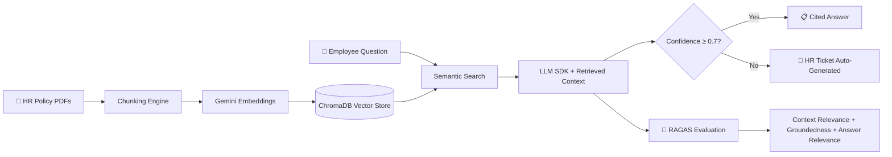

# 📋 POLICYPULSE — Stage 1 Project Scope v1.6

## AI-Powered HR Policy RAG Chatbot for Enterprise Workforce Self-Service
## "Ask Your Policies" — Natural Language Access to Company Knowledge

**Document Version:** 1.6 (🎯 **v10.0 ALIGNMENT** — Stage-1 foundation of the Applied-AI flagship; 3-stage model, destination Applied AI Engineer → FDE. "Gateway to S3" corrected to "Stage 3" [PROTECT] Prior v1.5 note archived below.)
**Last Updated:** August 10, 2026  
**Status:** 📋 DRAFT — Awaiting Approval  
**Author:** Manuel Reyes  
**Strategic Priority:** 🧠 RAG FOUNDATION (Stage 1 of the Applied-AI flagship) — evolves to GraphRAG + agentic + eval/observability in Stage 3.

---


## 🎯 v10.0 ROADMAP ALIGNMENT & STAGE-EVOLUTION ARC — AUTHORITATIVE

> **This block governs.** Where anything below it conflicts (old stage numbers, retired titles, pre-v10.0 portfolio lists), **this block wins.**

**Aligned to:** Career Roadmap **v10.0 (2026 Market Realignment)**.

**Governing model:** **3 stages, not 5.** The retired 14-month "ML Engineer" stage is now an **embedded ML-literacy module inside Stage 3** (earned-overlay — ships only if it beats the baseline). The destination title is **Applied AI Engineer → Forward Deployed Engineer (FDE)**; the retired "Senior LLM Engineer" title is dropped. **This project is ONE system that evolves across stages — never rebuilt per stage.**

**Portfolio role:** 🏁 **Flagship (lead)** — Stage 1 of the **Applied-AI flagship**. In v10.0, **flagship vs supporting = size & emphasis, not a quality tier — every project is production-grade.** Lead projects get new tooling first and are updated continuously as skills grow.

**Stage-evolution arc:**

| Stage | Theme | This project's layer |
|---|---|---|
| **S1** | Foundation (GenAI-first core) | RAG chatbot — ChromaDB + FastMCP + blocking eval gates (RAGAS/DeepEval); synthetic policy corpus. |
| **S2** | DE/AE hardening | Embedding/vector pipeline as **data infrastructure** — Airflow ingest, doc-metadata **dbt models** + contracts, Docker/ECS, monitoring. |
| **S3** | Applied AI (RAG/agentic + eval) | GraphRAG (Neo4j + ChromaDB) + agentic evaluator-optimizer + access-control retrieval + three-layer eval + Phoenix + MCP. |

- **Every project's S2 adds:** ingestion → **dbt-tested models (CI-gated)** → **data contracts** (Great Expectations) → warehouse/lakehouse → **Airflow** (idempotent runs) → Docker/**ECS** → monitoring + written **postmortem** → **semantic/metrics layer**.
- **Every project's S3 adds:** RAG/GraphRAG/agentic layer + **three-layer eval** (per-query metrics · trajectory tracing · drift vs frozen golden set) + **observability (Arize Phoenix, OTel-native, free)** + MCP + **HITL** on irreversible actions.

**Production standard (non-negotiable, ALL projects):** business-outcome headline · Mermaid diagram · **C4 Context diagram (+ Container view on lead flagships)** 🆕 · **`docs/adr/` — numbered, immutable Architecture Decision Records (context → decision → consequences)** 🆕 · Dockerfile · eval-metrics table · 15–30s demo GIF · "What I Learned" · **synthetic data only in public repos** · `pyproject.toml` + `uv.lock` + `src/` + `py.typed` + ruff + mypy · **structured logging (`structlog` over stdlib via `ProcessorFormatter`) + PII redaction processor · typed config (`pydantic-settings`, `SecretStr` credentials) · capped jittered retries (`stamina`)** · Conventional Commits · **🆕 `.pre-commit-config.yaml` — pinned hook set, enforced locally (v10.0 CORRECTION 21)**. *(🆕 C4 + ADR added per roadmap v10.0 CORRECTION 8, July 2026 — additive documentation discipline: the decision-and-defense artifacts Applied-AI/FDE interviews probe; same doc version, no structural change.)* **🆕 Toolchain (v10.0 CORRECTION 14, July 2026):** the C4 diagram and the Mermaid diagram come from **one source** — the architecture is modeled once in **Structurizr DSL** (`docs/architecture.dsl`, version-controlled) and the C4 Context/Container views are exported to **Mermaid** via `structurizr-cli` for the README, so the two never drift. Structurizr Lite is free and self-hosts in Docker (already required); model in Structurizr, render out to Mermaid. Additive; same doc version.* **🆕 Dual agentic harness (July 2026; CORRECTION 42):** every repo carries **both** harnesses — **`.opencode/`** and **`.claude/`** — generated from one shared prompt layer and governed by a single portable **`AGENTS.md`** contract, plus a **`hooks/guard.py`** `PreToolUse` guard that blocks `git commit`/`push` so every commit is human by construction. Concretely, `.opencode/` carries (`agents/` — subagent definitions where the filename becomes the agent name; `commands/` — `/`-invoked slash commands), plus **`AGENTS.md`** and **`opencode.jsonc`** at the root. This mirrors the existing `.cursor/rules/` setup rather than replacing it — OpenCode's `instructions[]` field can load `.cursor/rules/*.md` directly and combines them with `AGENTS.md`, so **one set of standards drives both harnesses** and neither drifts. Tooling discipline, not a portfolio artifact.*

> **🆕 Pre-commit standard (roadmap v10.0 CORRECTION 21, August 2026).** This repo carries a pinned `.pre-commit-config.yaml`. **Governing rule: the hook set is a strict *subset* of the CI gate — CI stays authoritative, and no check exists locally that does not also run in CI.** Hooks are pinned by `rev:`, never floating. **Tier A (this repo):** `pre-commit/pre-commit-hooks` (`trailing-whitespace`, `end-of-file-fixer`, `check-yaml`, `check-toml`, `check-added-large-files`, `check-merge-conflict`, `detect-private-key`) · `astral-sh/ruff-pre-commit` → **`ruff-check` (with `--fix`) placed *before* `ruff-format`**, because the linter's fix behaviour can emit changes that then need reformatting (note: the linter hook id is `ruff-check`; the retired bare `ruff` id is not used) · `astral-sh/uv-pre-commit` → **`uv-lock`**, which is what turns the CORRECTION 13 reproducible-build claim from an assertion into an enforced invariant · **`gitleaks`** for secret scanning. **Tier C (`commit-msg` stage):** `conventional-pre-commit` — the Conventional Commits standard above is now **enforced, not merely declared**; install with `pre-commit install --hook-type commit-msg`.
>
> **`mypy` is deliberately excluded from the hook set — CI-only.** The `mirrors-mypy` hook passes `--ignore-missing-imports` by default, which silently degrades third-party types to `Any` and produces different results than running mypy directly. If a local hook is ever wanted, it must be a `local` hook with `language: system` running `uv run mypy` with `pass_filenames: false`. **This exclusion is recorded as an ADR** — it is a decision with a tradeoff, not an omission.
>
> **Known risk — version drift (ADR-worthy).** `.pre-commit-config.yaml` pins tool versions *independently* of `uv.lock`, so upgrading ruff via uv leaves the hook on the old pin and local checks diverge from CI. Mitigation: `sync-with-uv` (or `sync-pre-commit-deps`) plus a scheduled `pre-commit autoupdate --freeze`.
>
> **`prek` — evaluated, not selected (falsifier recorded).** `prek` is a Rust drop-in alternative that reads this same config file and uses uv natively (adopted by CPython, FastAPI, Airflow, Ruff). It is *not* adopted now: `.pre-commit-config.yaml` is the artifact a reviewer recognises, and because prek reads that identical file the migration stays free and reversible. **Falsifier:** adopt if hook install/run time becomes a measured friction point against the 25 hrs/week schedule.
>
> **🆕 Python version — pinned (roadmap v10.0 CORRECTIONS 27–28, August 2026).** **Python 3.14 is the official floor for every project in this portfolio (`3.14+`).** It is pinned in one place per repo — `requires-python = ">=3.14"` in `pyproject.toml` — and every downstream tool reads from that single declaration: `[tool.ruff] target-version = "py314"`, `[tool.mypy] python_version = "3.14"`, the Dockerfile base image, and the CI matrix. **One source, no second place to drift.** ⚠️ **Enforcement:** a mismatch between any of those four and `requires-python` is a CI failure, not a lint warning — the same discipline `uv.lock` gets from the `uv-lock` hook under CORRECTION 21.
>
> ⚙️ **Two binding constraints on the pin.** **(a) Standard GIL build only — the free-threaded build (`python3.14t`) is explicitly NOT used.** Free-threading is where the C-extension wheel compatibility problems live, this portfolio has no CPU-bound multicore workload that would benefit, and debugging wheel availability is pure schedule tax against a 25 hrs/week budget with zero portfolio value. **(b) Airflow constraint-file caveat:** Airflow 3.2.0+ officially supports Python 3.14, but a known open issue reports the 3.14 constraint files being out of sync between the published Docker image and `pip`/`uv` install. **Documented workaround: fall back to the `constraints-3.13.txt` file for the Airflow service only** — this is a constraint-file selection, *not* a second Python version, and the interpreter stays 3.14. ⚠️ **Falsifier:** raise the floor only when a named dependency in a committed lockfile requires it, or when 3.14 leaves security support — **never to chase a release**; 3.15 ships October 2026 and is explicitly not adopted on release.
> **🆕 Language & AI last-mile standard (roadmap v10.0 CORRECTIONS 22–23, August 2026).** **Python and SQL are confirmed as the correct and sufficient primary languages** for this portfolio. **SQL is the single highest-signal language in DE postings**, and **PySpark is the capturable differentiator — reached through Python, not adopted as a separate language.** **Rust, Go, Java, Scala and standalone JavaScript were each evaluated and declined with recorded falsifiers**; JavaScript specifically as *redundant*, since TypeScript is a superset of it and the Stage-2 TypeScript sprint already covers that ground. **TypeScript is retained for the last mile only** — MCP protocol tooling and the AI application/UI layer. **This project stays Python-primary:** agent cores, retrieval, orchestration, evaluation and any long-horizon planning remain Python. ⚠️ **Falsifier:** revisit only if a target employer posts a JD naming a different primary language for the role being applied to.
>
> ⚠️ **Evidence note — guardrail independently corroborated (August 2026).** The last-mile guardrail no longer rests solely on the sources that recommended the SDK. An independent practitioner review of the **AI SDK 7** release (June 2026) draws the same boundary unprompted: the SDK is strongest as a **TypeScript-first application layer**, and weaker where the core problem is multi-hour orchestration, language-agnostic workflows or deeply stateful agent planning — with the explicit note that teams deploying agents across **Python services, queues and data pipelines** should treat it as *an SDK layer, not an orchestration standard*. That is this portfolio's exact shape. Convergent and independently sourced; recorded as **directional**, per the CORRECTIONS 18–19 evidence standard.
>
> **🆕 AI last-mile layer — Vercel AI SDK (roadmap v10.0 CORRECTIONS 22–24, August 2026).** PolicyPulse is the **named build target** for the roadmap's AI-application-layer deliverable: a **streaming Claude-powered UI over this project's existing retrieval**, built with the **Vercel AI SDK** (free, open-source, TypeScript). Selected on adoption evidence — **16M+ weekly downloads** (Vercel, primary source; a separate 2026 analysis puts it in **62% of TypeScript projects started that year**, recorded as directional), the named industry standard for streaming AI UIs, and **model-agnostic across 25+ providers**, matching this portfolio's provider-agnostic architecture and Anthropic-primary routing.
>
> 🧱 **It ships as a sibling package, not a rewrite.** `web/` sits alongside `src/policypulse/` and consumes the retrieval surface over HTTP. **The Python core is untouched** — ingestion, retrieval, fusion, the evaluator-optimizer loop, eval, and the FastMCP server all remain Python. **Produces the AI last-mile artifact a Python-only portfolio cannot show.**
>
> ⏱️ **Timing.** The sprint sits **immediately before the compressed Q1 2027 apply window** — re-timed from the retired "~Month 14" placement, which was set against the pre-resignation calendar — so the evidence is fresh at interview. It is **subordinate to DataVault S2 and never competes with the evidence gate.**
>
> ⚠️ **Privacy-routing amendment (CORRECTION 23) — binding.** The official Vercel starter repo ships **Vercel AI Gateway**, which routes prompts through Vercel. Under this portfolio's privacy-first model-routing rule that is **not acceptable for anything but synthetic data**. The gateway is **swapped for the direct `@ai-sdk/anthropic` provider** — a one-line change the SDK's provider-agnostic design makes trivial — and the build runs **synthetic policy corpus only**, the same constraint every public repo here already carries. **Recorded as an ADR in `docs/adr/` on two grounds, not one:** (a) *privacy* — prompts must not transit a third-party gateway; (b) 🆕 *architecture over platform* — an independent 2026 review of AI SDK 7 warns that when the best experience assumes AI Gateway, Vercel Workflows, Vercel Sandbox, Vercel Observability and Next.js together, teams **drift into a platform decision before making an architecture decision**. Declining the gateway is how this project keeps the SDK as a library rather than inheriting a platform.
>
> 🔭 **Observability — one trace backend, not two (🆕 AI SDK 7, June 2026).** AI SDK 7 ships **`@ai-sdk/otel`** with a single application-startup `registerTelemetry(new OpenTelemetry())` call and optional **OpenTelemetry GenAI semantic conventions**. Because this project's S3 observability standard is **Arize Phoenix (OTel-native)**, the TypeScript last-mile layer **emits into the same trace backend as the Python core**. **No second observability stack is introduced.** ⚠️ **PII constraint carries across the language boundary:** AI SDK 7 telemetry is **allowlist-based** (`includeRuntimeContext` / `includeToolsContext`), and anything not explicitly allowlisted must stay out of spans. The three-layer PII defence and the `redact_pii` posture apply to the TS layer exactly as they do to `structlog` on the Python side — **the boundary is a language boundary, not a policy boundary.**
>
> **🆕 Model-call ownership — the A/B ruling (roadmap v10.0 CORRECTION 28, August 2026).** With a TypeScript last mile in scope, **two designs were possible and the scope documents resolved neither**, which left the privacy amendment protecting an undefined surface. Both are now ruled on explicitly:
>
> - **Pattern A — Python owns the model call.** React → FastAPI → FastAPI calls the provider. The AI SDK renders the stream only.
> - **Pattern B — TypeScript owns the model call.** React → Next.js route handler → the route calls the provider *and* calls this project's retrieval API as a tool.
>
> 🎯 **Ruling: Pattern B for the single-turn chat; Pattern A for the agentic loop.** The **S3 evaluator-optimizer loop, the GraphRAG fusion, access-control retrieval, the three-layer eval and every long-horizon decision stay entirely in Python (Pattern A)** — nothing about this ruling moves an agent core across the language boundary. The **last-mile chat turn runs through the AI SDK route handler with retrieval exposed as a tool (Pattern B)**, which is what the Vercel Academy course teaches, so its patterns apply directly rather than needing translation.
>
> 🧭 **Why this line and not a simpler one.** A pure-Pattern-A build would force the last mile to re-implement streaming, tool-call normalisation and structured output on the Python side purely to keep a language rule — rebuilding what the SDK exists to provide, for no evidence gain. A pure-Pattern-B build would pull the evaluator-optimizer loop into TypeScript, which the CORRECTION 22 guardrail forbids and the AI SDK's own positioning advises against. **The split follows the guardrail's actual principle — the loop is Python, the turn is the last mile — rather than the language boundary as a blunt instrument.**
>
> ⚠️ **What this changes about the privacy amendment — it now protects a defined surface.** Under Pattern B the **route handler sees the full prompt**, which is precisely why the Vercel AI Gateway is declined in favour of the direct `@ai-sdk/anthropic` provider and why the build runs **synthetic corpus only**. Had the ruling landed on Pattern A, the gateway question would have been moot; under Pattern B it is load-bearing. **The retrieval API called as a tool remains behind this project's own auth and access-control layer — Pattern B does not expose the corpus to the browser**, only to the server-side route handler. ⚠️ **Falsifier:** revisit if a single chat turn ever needs more than one model round-trip plus tool calls — at that point it has become a loop, and a loop belongs in Python by the rule above, not in a route handler that has quietly grown one.

---

## 📋 Table of Contents

1. [Executive Summary](#1-executive-summary)
2. [Strategic Positioning](#2-strategic-positioning)
3. [Market Validation](#3-market-validation)
4. [Business Problem](#4-business-problem)
5. [Data Architecture](#5-data-architecture)
6. [Feature Framework](#6-feature-framework)
7. [Phase 1: Document Pipeline & Knowledge Base](#7-phase-1-document-pipeline--knowledge-base-weeks-1-2)
8. [Phase 2: RAG Chat Interface & Ticket Escalation](#8-phase-2-rag-chat-interface--ticket-escalation-weeks-3-4)
9. [AI Guardrails](#9-ai-guardrails)
10. [Tech Stack](#10-tech-stack)
11. [Project Structure](#11-project-structure)
12. [Sample Policy Documents Strategy](#12-sample-policy-documents-strategy)
13. [Success Metrics](#13-success-metrics)
14. [Risk Mitigation](#14-risk-mitigation)
15. [Timeline Summary](#15-timeline-summary)
16. [Project Evolution (3 Stages)](#16-project-evolution-3-stages)

---

## 1. Executive Summary

**PolicyPulse** is an AI-powered chatbot that enables employees to ask natural language questions about company policies (PTO, overtime, holidays, benefits, etc.) and receive accurate, cited answers grounded in the company's actual policy documents. When the AI cannot find the answer in the knowledge base, it automatically generates an escalation ticket routed to HR for human follow-up.

This is a **RAG (Retrieval-Augmented Generation) foundation project** — the most in-demand enterprise AI pattern in 2026. It introduces core concepts (document chunking, embeddings, semantic search, context injection) that directly prepare for S3 vector database and LangChain/LangGraph skills.

### Why This Project Matters

| Factor | Why It Wins for Portfolio |
|--------|--------------------------|
| **#1 enterprise AI use case** | HR policy RAG is the most validated enterprise GenAI pattern (DoorDash, LinkedIn, Harvard all built similar) |
| **RAG gateway** | Introduces embeddings, chunking, semantic search — S3 prerequisites |
| **Directly applicable** | Can be deployed at Daybright Financial for real HR policy access |
| **Simpler than AFC/ODI** | Focused scope: documents in → questions answered → tickets escalated |
| **Human-in-the-loop** | Ticket escalation shows mature AI design (not just "chatbot answers everything") |
| **Universally understood** | Every recruiter has dealt with HR policies — instant credibility |

### What Makes This Project Different

| Dimension | Typical "Chat with Docs" Tutorial | PolicyPulse |
|-----------|-----------------------------------|-------------|
| **Documents** | Random PDFs from internet | Realistic enterprise HR policies (PTO, overtime, holidays, benefits, compliance) |
| **Retrieval** | Basic string matching | Semantic search with embeddings + similarity scoring |
| **Citations** | None — "trust me" answers | Every answer cites specific policy section, paragraph, and document |
| **Confidence** | Always answers (even when wrong) | Confidence scoring + automatic HR ticket when confidence < threshold |
| **Escalation** | None — dead ends | Structured ticket generation with context for HR follow-up |
| **AI Architecture** | Single provider, raw text | Provider-agnostic SDK (Gemini/OpenAI/Claude) |
| **AI Outputs** | Unstructured text responses | Pydantic-validated structured outputs (answer, citations, confidence, ticket) |
| **Guardrails** | None | Scope validation, hallucination detection, PII prevention, disclaimer injection |
| **Observability** | None | Token usage, cost tracking, latency, retrieval quality metrics |
| **CI/CD** | None | GitHub Actions on every PR |

### Core Capabilities

- **Document Ingestion Pipeline:** PDF/Markdown/DOCX → text extraction → chunking → embeddings → searchable knowledge base
- **Semantic Search:** Embedding-based retrieval with similarity scoring to find the most relevant policy sections
- **RAG Chat Interface:** Natural language questions answered with citations to specific policy documents and sections
- **Confidence Scoring:** Every answer includes a confidence score; low-confidence answers trigger escalation
- **HR Ticket Escalation:** When the AI can't find the answer, it generates a structured ticket with the question, search context, and suggested HR contact
- **Structured Outputs:** Pydantic-validated AI responses with type-safe schemas (PolicyAnswer, Citation, EscalationTicket)
- **AI Observability:** Token usage, cost tracking, latency monitoring, retrieval quality metrics per query
- **Production Practices:** GitHub Actions CI, type hints, comprehensive testing, sample policy documents

---

## 2. Strategic Positioning

### 2.1 Roadmap Alignment (Stage 1: GenAI-First Core → Applied AI)

This project directly delivers on **4 critical roadmap objectives**:

| Roadmap Goal | How PolicyPulse Delivers |
|-------------|--------------------------|
| "Build AI-powered dashboards and chatbots" (Stage 1 Strategy) | ✅ Streamlit chatbot with RAG pipeline |
| "LLM SDKs (Gemini, OpenAI, Claude) + LangChain basics" (Month 3-5 Skills) | ✅ Provider-agnostic SDK with **Anthropic SDK as primary** (Claude excels at RAG synthesis with prompt caching) + Gemini fallback |
| "RAG System for Documentation" (Month 30 Portfolio Target) | ✅ **Early exposure** — builds RAG intuition 25 months ahead of schedule |
| "Natural language queries" (Flagship Features) | ✅ "What's the PTO policy for employees with 5+ years?" → cited answer |

### 2.2 Portfolio Ecosystem

```
PORTFOLIO PROJECT ECOSYSTEM (Stage 1)
═══════════════════════════════════════════

1. 1099 Reconciliation Pipeline ✅ DEPLOYED
   └─ Skills: Python, Pandas, ETL, pytest, CI/CD
   └─ Impact: $15K/year savings, 95% time reduction

2. DataVault Analyst ⭐ FIRST AI PROJECT
   └─ Skills: LLM SDK, PandasAI, Streamlit, PII handling
   └─ AI Pattern: SDK-first architecture (shared across all projects)

3. PolicyPulse 🧠 RAG FOUNDATION (THIS SCOPE)
   └─ Skills: Embeddings, chunking, semantic search, RAG, ticket workflows
   └─ AI Pattern: Document → Embedding → Retrieval → Generation pipeline
   └─ NEW SKILL: Introduces RAG concepts early (S3 prerequisite)

4. FormSense 📄 DOCUMENT INTELLIGENCE (NEXT)
   └─ Skills: Multimodal LLM, form extraction, validation, email automation
   └─ AI Pattern: Vision AI for financial document processing

5. Operations-Demand-Intelligence 📊 ENTERPRISE ANALYTICS
   └─ Reuses: AI layer from DataVault Analyst + RAG from PolicyPulse

6. Attention-Flow Catalyst 🧩 SUPPORTING (production-grade)
   └─ Reuses: All shared AI patterns from above projects
```

### 2.3 The "30-Second Rule" Optimization

Recruiters spend <30 seconds on initial portfolio scan. This project passes that filter:

- **README hero section:** GIF showing "ask policy question → get cited answer → see ticket when unsure" in 8 seconds
- **Live demo link:** Streamlit Cloud deployment (click and try immediately)
- **Business impact:** "Reduces HR inquiry volume by routing 70%+ of policy questions to AI with cited answers"
- **Tech badges:** Python, Streamlit, Anthropic SDK, Gemini Embeddings, RAG, FastMCP, Pydantic, GitHub Actions

---

## 3. Market Validation

### 3.1 Industry Adoption

| Statistic | Source |
|-----------|--------|
| RAG for HR policy is the #1 recommended "narrow, high-value workflow" for enterprise AI | Data Nucleus (2025) |
| Companies like DoorDash built RAG chatbot with guardrails + LLM judge for support automation | Evidently AI (2025) |
| LinkedIn combined RAG with knowledge graphs for customer service Q&A | Evidently AI (2025) |
| Harvard Business School built RAG chatbot (ChatLTV) for course Q&A with citation verification | Evidently AI (2025) |
| 63% of Fortune 500 companies have implemented intelligent document processing solutions | Extend Research (2026) |
| RAG is positioned as "strategic backbone of enterprise knowledge management" in 2026 | Squirro (2026) |

### 3.2 Why RAG Over Fine-Tuning for This Use Case

| Approach | RAG (PolicyPulse) | Fine-Tuning |
|----------|-------------------|-------------|
| **Data requirement** | ~20-50 policy docs | 10,000+ Q&A pairs |
| **Update speed** | Add new doc → instant | Retrain model → hours/days |
| **Citation ability** | ✅ Natural (retrieves source) | ❌ Cannot cite sources |
| **Hallucination control** | Grounded in retrieved text | Still hallucinates |
| **Cost** | Embedding once + per-query retrieval | GPU training costs |
| **Stage 1 feasible** | ✅ Yes | ❌ Requires Stage 3-4 skills |

### 3.3 Competitive Landscape (Internal Tools)

| Solution | What It Does | What's Missing |
|----------|-------------|----------------|
| **SharePoint search** | Keyword search in documents | No semantic understanding, no natural language, no citations |
| **Confluence wiki** | Browse policy pages | Requires knowing where to look, no Q&A interface |
| **HR email inbox** | Ask HR directly | 24-48 hour response time, HR overloaded with repetitive questions |
| **Generic chatbot (ChatGPT)** | Answers from training data | No access to company-specific policies, hallucinates policy details |
| **PolicyPulse** | RAG chatbot grounded in actual company docs | ✅ Fills the gap: accurate + cited + escalation when unsure |

---

## 4. Business Problem

### 4.1 Context

In large companies like Daybright Financial, employees constantly need answers to HR policy questions: "How many PTO days do I get after 3 years?", "What's the overtime policy for salaried employees?", "Can I carry over unused vacation days?" Currently:

- **HR team overloaded:** 60-70% of HR inbox is repetitive policy questions with answers already in existing documents
- **Slow response times:** 24-48 hours for email responses to simple policy questions
- **Inconsistent answers:** Different HR reps may interpret policies differently
- **Employee frustration:** Can't find answers in dense PDF documents, don't know which document to check
- **No audit trail:** No record of what employees asked or what guidance they received

### 4.2 Solution

**PolicyPulse** provides an AI-powered chatbot where employees can:

1. **Ask questions** in natural language: *"How many sick days do I get per year?"*
2. **Get cited answers** grounded in actual company policy documents with section references
3. **See confidence levels** so they know how reliable the answer is
4. **Auto-escalate** when the AI can't find the answer — generates an HR ticket with full context
5. **Browse policies** through a searchable document library as a fallback

### 4.3 Business Questions the System Answers

| Category | Example Questions |
|----------|------------------|
| **PTO & Leave** | "How many vacation days do I get after 5 years?" |
| **Overtime** | "Am I eligible for overtime pay as a salaried employee?" |
| **Holidays** | "What are the company holidays for 2026?" |
| **Benefits** | "When is open enrollment and what are my options?" |
| **Remote Work** | "What's the policy for working from home on Fridays?" |
| **Compensation** | "How does the annual review process work?" |
| **Compliance** | "What are the rules about accepting gifts from vendors?" |
| **Onboarding** | "What's the dress code policy?" |

### 4.4 Measurable Business Impact

| Metric | Current State | With PolicyPulse | Impact |
|--------|--------------|------------------|--------|
| HR inbox volume (repetitive questions) | ~100/week | ~30/week | **70% reduction** |
| Average response time | 24-48 hours | < 5 seconds | **99%+ faster** |
| Answer consistency | Varies by HR rep | Same source document always | **100% consistent** |
| Employee self-service rate | ~20% | ~70% | **3.5x improvement** |
| HR time on repetitive questions | ~15 hrs/week | ~5 hrs/week | **$25K+/year saved** |

---

## 5. Data Architecture

### 5.1 Document Pipeline

```
DOCUMENT INGESTION PIPELINE
════════════════════════════

PDF/DOCX/MD Files           Text Extraction          Chunking              Embeddings
┌──────────────┐          ┌──────────────┐       ┌──────────────┐       ┌──────────────┐
│ pto_policy.pdf│   ──►   │  Raw Text    │  ──►  │  Chunks      │  ──►  │  Vectors     │
│ overtime.pdf  │  PyMuPDF│  + Metadata  │ RecSpl│  ~500 tokens │Gemini │  768-dim     │
│ holidays.md   │  python │  (title,     │  itter│  with overlap│Embed  │  per chunk   │
│ benefits.docx │  -docx  │   section,   │       │  + metadata  │  API  │              │
│ compliance.pdf│         │   page)      │       │              │       │              │
└──────────────┘          └──────────────┘       └──────────────┘       └──────────────┘
                                                                              │
                                                                              ▼
                                                                    ┌──────────────┐
                                                                    │ ChromaDB     │
                                                                    │ (Local       │
                                                                    │  Vector DB)  │
                                                                    └──────────────┘
```

### 5.2 RAG Query Pipeline

```
RAG QUERY PIPELINE
══════════════════

Employee Question           Embedding              Semantic Search         LLM Generation
┌──────────────┐          ┌──────────────┐       ┌──────────────┐       ┌──────────────┐
│ "How many PTO│   ──►   │  Question    │  ──►  │  Top-K       │  ──►  │  Answer +    │
│  days after  │  Gemini │  Vector      │ChromaDB│  Relevant    │Gemini │  Citations + │
│  5 years?"   │  Embed  │  (768-dim)   │  sim  │  Chunks      │  SDK  │  Confidence  │
└──────────────┘          └──────────────┘  srch └──────────────┘       └──────────────┘
                                                                              │
                                                       ┌──────────────────────┤
                                                       │                      │
                                                       ▼                      ▼
                                              Confidence ≥ 0.7?      Confidence < 0.7?
                                              ┌──────────────┐       ┌──────────────┐
                                              │ ✅ Display    │       │ 🎫 Generate  │
                                              │ Answer with  │       │ HR Escalation│
                                              │ Citations    │       │ Ticket       │
                                              └──────────────┘       └──────────────┘
```

### 5.3 Pydantic Schemas (Structured Outputs)

```python
class Citation(BaseModel):
    """Source reference for an AI answer."""
    document_name: str          # "pto_policy.pdf"
    section_title: str          # "Section 3.2: Accrual Rates"
    page_number: int | None     # 5
    relevance_score: float      # 0.89
    excerpt: str                # "Employees with 5+ years accrue 20 days..."

class PolicyAnswer(BaseModel):
    """Structured response from RAG pipeline."""
    question: str               # Original question
    answer: str                 # Generated answer text
    citations: list[Citation]   # Source references (1-5)
    confidence: float           # 0.0-1.0 (aggregated from retrieval scores)
    category: str               # "PTO", "Overtime", "Benefits", etc.
    disclaimer: str             # Always present

class EscalationTicket(BaseModel):
    """HR ticket generated when AI confidence is below threshold."""
    ticket_id: str              # "PP-2026-00123"
    question: str               # Original question
    search_context: str         # What the AI found (partial matches)
    confidence: float           # Why it escalated (score < 0.7)
    suggested_category: str     # Best-guess routing
    suggested_contact: str      # HR contact for this category
    created_at: datetime        # Timestamp
    status: str                 # "open" | "pending" | "resolved"

class RetrievalResult(BaseModel):
    """Single chunk retrieved from vector search."""
    chunk_id: str
    document_name: str
    section_title: str
    content: str
    similarity_score: float
    metadata: dict

class QueryMetrics(BaseModel):
    """Observability data per query."""
    query_id: str
    embedding_latency_ms: float
    retrieval_latency_ms: float
    generation_latency_ms: float
    total_latency_ms: float
    tokens_used: int
    estimated_cost_usd: float
    chunks_retrieved: int
    top_similarity_score: float
    confidence_score: float
    escalated: bool
```

### 5.4 Document Metadata Schema

```yaml
# config/documents.yaml
documents:
  - name: "Paid Time Off Policy"
    filename: "pto_policy.pdf"
    category: "Leave & PTO"
    effective_date: "2026-01-01"
    version: "3.2"
    hr_contact: "benefits@company.com"
    
  - name: "Overtime & Compensation Policy"
    filename: "overtime_policy.pdf"
    category: "Compensation"
    effective_date: "2025-07-01"
    version: "2.0"
    hr_contact: "payroll@company.com"
    
  - name: "Company Holidays 2026"
    filename: "holidays_2026.md"
    category: "Holidays"
    effective_date: "2026-01-01"
    version: "1.0"
    hr_contact: "hr@company.com"

  - name: "Employee Benefits Guide"
    filename: "benefits_guide.pdf"
    category: "Benefits"
    effective_date: "2026-01-01"
    version: "4.1"
    hr_contact: "benefits@company.com"

  - name: "Remote Work Policy"
    filename: "remote_work_policy.pdf"
    category: "Workplace"
    effective_date: "2025-09-01"
    version: "2.0"
    hr_contact: "hr@company.com"

  - name: "Code of Conduct & Compliance"
    filename: "compliance_policy.pdf"
    category: "Compliance"
    effective_date: "2025-01-01"
    version: "5.0"
    hr_contact: "compliance@company.com"

chunking:
  strategy: "recursive_character"
  chunk_size: 500           # tokens
  chunk_overlap: 50         # tokens overlap between chunks
  separators:
    - "\n## "               # H2 headers (primary split)
    - "\n### "              # H3 headers
    - "\n\n"                # Paragraph breaks
    - "\n"                  # Line breaks
    - ". "                  # Sentences (last resort)

embedding:
  model: "models/text-embedding-004"  # Gemini Embedding
  dimensions: 768
  batch_size: 100

retrieval:
  top_k: 5                 # chunks to retrieve per query
  similarity_threshold: 0.5 # minimum score to include
  confidence_threshold: 0.7 # below this → escalate to HR
```

---

## 6. Feature Framework

### 6.1 Pre-Built Features (No AI Required)

| ID | Feature | Description |
|----|---------|-------------|
| **PP01** | Policy Library | Browse all available policy documents with search |
| **PP02** | Category Browser | Filter policies by category (PTO, Benefits, Compliance, etc.) |
| **PP03** | Document Viewer | Read full policy documents within the app |
| **PP04** | Recent Updates | Show recently updated policies with change highlights |
| **PP05** | FAQ Dashboard | Display most frequently asked questions with cached answers |

### 6.2 AI-Powered Features

| ID | Feature | Description |
|----|---------|-------------|
| **AI01** | RAG Policy Q&A | Ask any question → get cited answer from policy documents |
| **AI02** | Confidence Scoring | Every answer rated 0.0-1.0 with visual indicator |
| **AI03** | Citation Display | Show exact document, section, and page for each answer |
| **AI04** | Auto-Escalation | Generate HR ticket when confidence < 0.7 |
| **AI05** | Conversation Memory | Session-based memory for follow-up questions |
| **AI06** | Smart Suggestions | After answering, suggest related policy questions |

### 6.3 Dashboard Pages

| Page | Content | AI Required? |
|------|---------|-------------|
| **📚 Policy Library** | Browse/search all documents, view metadata | No |
| **💬 Ask PolicyPulse** | RAG chat interface with citations | Yes |
| **🎫 Escalation Tickets** | View generated tickets, status tracking | No |
| **📊 Usage Analytics** | Query volume, top categories, escalation rate | No |

---

## 7. Phase 1: Document Pipeline & Knowledge Base (Weeks 1-2)

### Week 1: Document Ingestion + Vector Store

**Tasks:**
- Set up project structure (matching established pattern: src/, config/, tests/, app/)
- Implement document extraction (PyMuPDF for PDF, python-docx for DOCX, markdown for MD)
- Build chunking engine (RecursiveCharacterTextSplitter with configurable overlap)
- Implement Gemini Embedding API client (provider-agnostic abstraction)
- Set up ChromaDB local vector store with persistent storage
- Create document metadata management (documents.yaml config)
- Write ingestion pipeline: extract → chunk → embed → store
- Build sample policy documents (see Section 12)
- Set up GitHub Actions CI (lint, type-check, pytest)

**Deliverables:**
- ✅ 6+ sample policy documents ingested
- ✅ ~100-200 chunks stored in ChromaDB with embeddings
- ✅ Metadata (document name, section, page) preserved per chunk
- ✅ CI pipeline green

### Week 2: Retrieval Engine + Policy Library

**Tasks:**
- Build semantic search function (query → embed → top-K retrieval)
- Implement similarity scoring and relevance filtering
- Build retrieval quality testing (known Q&A pairs → expected chunks)
- Create Streamlit Policy Library page (browse, search, view documents)
- Create FAQ Dashboard page with pre-seeded common questions
- Implement document viewer component

**Deliverables:**
- ✅ Semantic search returning relevant chunks for test queries
- ✅ Policy Library and FAQ Dashboard pages working
- ✅ Retrieval accuracy > 80% on test Q&A set
- ✅ Test coverage > 80%

---

## 8. Phase 2: RAG Chat Interface & Ticket Escalation (Weeks 3-4)

### Week 3: RAG Generation + Structured Outputs

**Tasks:**
- Build RAG generation pipeline: retrieval → context injection → LLM generation
- Implement provider-agnostic LLM abstraction (same pattern as DVA/AFC/ODI)
- Create Pydantic structured output schemas (PolicyAnswer, Citation, EscalationTicket)
- Build confidence scoring algorithm (weighted average of retrieval similarity scores)
- Implement citation extraction (map answer claims to source chunks)
- Build AI guardrails (see Section 9)
- Create "Ask PolicyPulse" chat page with citation display
- Implement session-based conversation memory for follow-up questions

**Deliverables:**
- ✅ RAG pipeline answering questions with cited sources
- ✅ 100% Pydantic-validated structured outputs
- ✅ Confidence scores displayed per answer
- ✅ Chat interface with conversation history

### Week 4: Escalation + Deploy + Polish

**Tasks:**
- Build escalation ticket generator (when confidence < 0.7)
- Create Escalation Tickets page (view, search, export)
- Build Usage Analytics page (query volume, categories, escalation rate)
- Implement AI observability (token/cost/latency per query)
- Add smart suggestions feature (related questions after answer)
- **Build FastMCP server** (~50 LOC) exposing retrieval as MCP tools — `query_policies(question)` + `list_policy_documents()` — testable from Cursor/Claude Desktop
- Deploy to Streamlit Cloud (FREE)
- Create README with demo GIF, architecture diagram
- Record 3-5 minute demo video

**Deliverables:**
- ✅ Escalation tickets generating for low-confidence answers
- ✅ All 4 dashboard pages rendering
- ✅ AI observability logging
- ✅ **FastMCP server running locally** — `mcp_server/server.py` connects to ChromaDB, exposes 2 tools, demonstrable in Cursor settings → MCP servers
- ✅ Deployed to Streamlit Cloud
- ✅ README with GIF, live demo link

---

## 9. AI Guardrails

### 9.1 Guardrail Framework

| ID | Guardrail | Implementation |
|----|-----------|----------------|
| **G01** | Scope Validation | Reject questions outside HR policy domain (e.g., "What's the stock price?") |
| **G02** | Hallucination Prevention | If no relevant chunks found (all scores < 0.5), refuse to answer + escalate |
| **G03** | Confidence Threshold | Answers with confidence < 0.7 auto-escalate to HR |
| **G04** | PII Prevention | Scan AI responses for PII patterns (SSN, phone, email) before display |
| **G05** | Disclaimer Injection | Every AI answer includes: "This is AI-generated guidance. For official interpretation, contact HR." |
| **G06** | Source Grounding | AI prompt explicitly instructs: "Only answer based on provided context. If the context doesn't contain the answer, say so." |
| **G07** | Read-Only Access | No write operations — AI cannot modify documents or policies |
| **G08** | Token Budget | Max 2,000 tokens per response to control costs |

### 9.2 Guardrail Testing Strategy

```python
# tests/test_ai_guardrails.py

def test_scope_validation_rejects_off_topic():
    """G01: Off-topic questions should be rejected."""
    result = guardrails.validate_scope("What's the weather today?")
    assert result.is_valid is False
    assert "outside HR policy scope" in result.reason

def test_hallucination_prevention_escalates_when_no_context():
    """G02: No relevant chunks → escalate, don't fabricate."""
    result = rag_pipeline.query("What's the policy on space travel?")
    assert result.confidence < 0.5
    assert result.escalated is True

def test_confidence_threshold_triggers_escalation():
    """G03: Low confidence → auto-escalate."""
    result = rag_pipeline.query("edge case ambiguous question")
    if result.confidence < 0.7:
        assert result.escalation_ticket is not None

def test_pii_prevention_blocks_ssn_in_response():
    """G04: PII should never appear in AI responses."""
    response = guardrails.scan_response("Your SSN 123-45-6789 shows...")
    assert "123-45-6789" not in response.cleaned_text

def test_disclaimer_always_present():
    """G05: Every answer must include disclaimer."""
    result = rag_pipeline.query("How many PTO days do I get?")
    assert "AI-generated" in result.answer.disclaimer

def test_source_grounding_refuses_without_context():
    """G06: AI should not answer without supporting context."""
    # Question with no matching policy docs
    result = rag_pipeline.query("What is the meaning of life?")
    assert result.escalated is True
```

---

## 10. Tech Stack

### 10.1 Core Stack

| Component | Technology | Why |
|-----------|------------|-----|
| **Language** | Python 3.14+ | Primary language, matches all portfolio projects |
| **Dashboard** | Streamlit | Consistent with DVA, ODI, AFC, StreamSmart |
| **LLM SDK (Generation)** | **Anthropic SDK (primary)**, Gemini (fallback), OpenAI (alternative) | Claude excels at RAG synthesis; prompt caching reduces costs ~90% on repeated context |
| **Embeddings** | Gemini Text Embedding API | Free tier, 768-dim, high quality |
| **Vector Store** | ChromaDB (local) | Lightweight, no server needed, Python-native, Stage 1 appropriate |
| **MCP Server** | FastMCP (Python) | Exposes retrieval tools to Cursor/Claude Desktop — 2026 hiring keyword |
| **PDF Extraction** | PyMuPDF (fitz) | Fast, reliable, preserves structure |
| **DOCX Extraction** | python-docx | Native Python DOCX reader |
| **Data Validation** | Pydantic v2 | Structured outputs, consistent with all projects |
| **Charts** | Plotly | Interactive analytics, consistent with all projects |
| **Config** | YAML (PyYAML) | Human-readable config, consistent pattern |
| **CI/CD** | GitHub Actions | Lint (ruff), type-check (mypy), test (pytest) |
| **Deployment** | Streamlit Cloud (FREE) | Zero-cost hosting for demo |

### 10.2 AI Architecture (Provider-Agnostic)

```python
# src/ai/provider.py — Same pattern as DVA, AFC, ODI, StreamSmart

class LLMProvider:
    """Provider-agnostic LLM abstraction."""
    
    def generate(self, prompt: str, context: list[str], schema: type[BaseModel]) -> BaseModel:
        """Generate structured response from RAG context."""
        ...
    
    def embed(self, text: str | list[str]) -> list[list[float]]:
        """Generate embeddings for text(s)."""
        ...

# config/ai_config.yaml
ai:
  provider: "anthropic"           # or "gemini", "openai" — Anthropic primary for RAG synthesis
  generation_model: "claude-sonnet-4-6"
  embedding_model: "models/text-embedding-004"
  temperature: 0.1                # Low for factual policy answers
  max_tokens: 2000
  fallback_provider: "gemini"
```

### 10.3 MCP Server (2026 Differentiator) ⭐ NEW v8.3

**Why MCP Matters in 2026:**

The Model Context Protocol (MCP), originally created by Anthropic and donated to the Linux Foundation Agentic AI Foundation in December 2025, is the de facto 2026 standard for agent ↔ tool integration. As of early 2026, the MCP ecosystem has surpassed 97 million monthly SDK downloads with 200+ server implementations across GitHub, Slack, Postgres, Notion, Jira, and Salesforce. PolicyPulse exposing its retrieval as an MCP server means Cursor, Claude Desktop, and any MCP-compatible client can query the HR knowledge base directly — turning the project from "another RAG demo" into "production-ready agent infrastructure."

**What Gets Exposed (2 tools, ~50 LOC total):**

| Tool | Signature | What It Does |
|------|-----------|--------------|
| `query_policies` | `(question: str, top_k: int = 5) -> PolicyAnswer` | Retrieve relevant chunks + return answer with citations |
| `list_policy_documents` | `() -> list[PolicyDocument]` | Return registered policy documents with metadata (title, last_updated, sections) |

**FastMCP Server Implementation:**

```python
# mcp_server/server.py
from fastmcp import FastMCP
from src.retrieval.search import semantic_search
from src.ai.rag_pipeline import answer_question
from src.ingestion.extractor import list_documents

mcp = FastMCP("policypulse")

@mcp.tool()
def query_policies(question: str, top_k: int = 5) -> dict:
    """Query HR policy knowledge base. Returns answer + citations + confidence."""
    result = answer_question(question, top_k=top_k)
    return {
        "answer": result.answer,
        "citations": [c.model_dump() for c in result.citations],
        "confidence": result.confidence,
        "escalated": result.escalated,
    }

@mcp.tool()
def list_policy_documents() -> list[dict]:
    """List all registered HR policy documents with metadata."""
    return [doc.model_dump() for doc in list_documents()]

if __name__ == "__main__":
    mcp.run()
```

**Cursor / Claude Desktop Integration:**

```json
// Cursor settings.json or Claude Desktop config
{
  "mcpServers": {
    "policypulse": {
      "command": "python",
      "args": ["-m", "mcp_server.server"],
      "cwd": "/absolute/path/to/policypulse"
    }
  }
}
```

**Testing Approach:**
- `tests/test_mcp_server.py` — unit tests for each tool function (uses test ChromaDB fixture from conftest)
- Manual integration test: launch Cursor → verify `policypulse` appears in MCP servers list → ask Cursor "what's our PTO policy?" → confirm tool invocation
- Document the integration with screenshots in `mcp_server/README.md` (recruiter-facing artifact)

**Resume Signal:**
"Exposed retrieval pipeline as a FastMCP server, enabling LLM-native clients (Cursor, Claude Desktop) to query the knowledge base via the Model Context Protocol — the 2026 industry standard for agent-tool integration."

---

## 11. Project Structure

```
policypulse/
├── .cursor/
│   ├── rules/                    # Production standards (version-controlled)
│   │   ├── git-workflow.mdc      # alwaysApply: true — branch, commit, PR conventions
│   │   ├── learning-mode.mdc     # alwaysApply: true — learning patterns, skill progression
│   │   ├── python-production-standards.mdc  # alwaysApply: true — code style, types, testing
│   │   ├── streamlit-patterns.mdc    # Auto-attached: app/**/*.py
│   │   ├── ai-sdk-patterns.mdc       # Auto-attached: src/ai/**/*.py
│   │   └── evaluation.mdc           # Auto-attached: tests/test_eval.py
│   ├── commands/                 # Repeatable agent workflows (/command-name)
│   │   ├── draft-issue.md        # /draft-issue <goal>
│   │   ├── task-brief.md         # /task-brief <issue#>
│   │   ├── pr-prep.md            # /pr-prep
│   │   ├── review.md             # /review
│   │   ├── test.md               # /test
│   │   ├── eval.md               # /eval
│   │   └── commit-msg.md         # /commit-msg
│   ├── hooks/                    # Auto-run scripts
│   │   └── format.sh             # Auto-format (`ruff format` + `ruff check --fix`) after agent edits — black retired per CORRECTION 21
│   ├── hooks.json                # Hook configuration
│   └── plans/                    # Saved task briefs per Issue
│       └── issue-XX-task-brief.md
├── .cursorignore                 # Excludes data/logs/venv from Cursor indexing
├── .opencode/                    # OpenCode side of the dual harness (mirrors .cursor/; portable across editors)
├── .claude/                      # Claude Code side — generated from the same shared prompt layer
├── hooks/guard.py                # PreToolUse — blocks git commit/push; commits stay human
│   ├── agents/                   # subagent defs — filename = agent name (per OpenCode spec)
│   │   ├── docs-fix.md           # repairs drift in README / scope docs
│   │   ├── docs-sync.md          # keeps the 3 public docs aligned to the roadmap
│   │   ├── eval-guardian.md      # guards the eval-first blocking gates
│   │   ├── learn.md              # explain-before-merge; enforces "no vibe coding"
│   │   ├── pattern-scout.md      # finds prior art in-repo before new code
│   │   └── security-auditor.md   # secrets / dependency / config audit
│   ├── commands/                 # slash commands — /review, /test, /commit-msg, ...
│   │   ├── commit-msg.md
│   │   ├── draft-issue.md
│   │   ├── eval.md
│   │   ├── labels.md
│   │   ├── pr-prep.md
│   │   ├── readme.md
│   │   ├── review.md
│   │   ├── task-brief.md
│   │   └── test.md
│   ├── .gitignore                # ignores node_modules/ (harness deps are installed, not committed)
│   ├── package.json              # pinned OpenCode plugin dependencies
│   └── package-lock.json         # committed — reproducible harness
├── AGENTS.md                     # standing instructions; combined with opencode.jsonc instructions[]
├── opencode.jsonc                # harness config — model routing, permissions, instructions[]
├── .github/
│   ├── templates/                # Production workflow templates
│   │   ├── issue_template.md     # GitHub Issue format
│   │   ├── project_labels.md     # Approved labels + definitions
│   │   ├── pull_request_template.md  # PR body format
│   │   └── cursor_task_brief.md  # Agent execution contract
│   └── workflows/ci.yml
├── config/
│   ├── ai_config.yaml            # LLM + embedding settings
│   ├── documents.yaml            # Policy document registry
│   └── # (no logging.yaml — 🆕 CORRECTION 16: logging is configured in
│                                 #  src/observability/logging.py, not YAML dictConfig)
├── data/
│   ├── policies/                 # Source policy documents (PDF/MD/DOCX)
│   │   ├── pto_policy.pdf
│   │   ├── overtime_policy.pdf
│   │   ├── holidays_2026.md
│   │   ├── benefits_guide.pdf
│   │   ├── remote_work_policy.pdf
│   │   └── compliance_policy.pdf
│   ├── vectorstore/              # ChromaDB persistent storage
│   └── tickets/                  # Generated escalation tickets (JSON)
├── logs/
│   ├── app/                      # Dashboard logs
│   ├── pipeline/                 # Ingestion pipeline logs
│   ├── ai/                       # AI observability logs
│   │   ├── queries.log           # LLM queries, tokens, cost, latency
│   │   ├── retrieval.log         # Retrieval scores, chunks returned
│   │   └── guardrails.log        # Guardrail activations
│   ├── evaluation/               # ⭐ DeepEval RAG evaluation results
│   └── errors.log
├── src/
│   ├── __init__.py
│   ├── py.typed                  # PEP 561 — type hint support marker
│   ├── observability/           # 🆕 CORRECTION 16
│   │   ├── __init__.py
│   │   └── logging.py          # configure_logging() + redact_pii processor
│   ├── ingestion/
│   │   ├── __init__.py
│   │   ├── extractor.py          # PDF/DOCX/MD text extraction
│   │   ├── chunker.py            # Text chunking with overlap
│   │   └── embedder.py           # Embedding generation
│   ├── retrieval/
│   │   ├── __init__.py
│   │   ├── vectorstore.py        # ChromaDB operations
│   │   └── search.py             # Semantic search + scoring
│   ├── ai/
│   │   ├── __init__.py
│   │   ├── provider.py           # Provider-agnostic LLM abstraction
│   │   ├── schemas.py            # Pydantic response models
│   │   ├── rag_pipeline.py       # Retrieval → Context → Generation
│   │   ├── guardrails.py         # Governance as code (testable)
│   │   └── observability.py      # Token/cost/latency tracking
│   ├── tickets/
│   │   ├── __init__.py
│   │   └── escalation.py         # Ticket generation + management
│   └── utils/
│       ├── __init__.py
│       ├── config.py
│       └── logging.py
├── mcp_server/                  # ⭐ v8.3 — FastMCP server (2026 differentiator)
│   ├── __init__.py
│   ├── server.py                # FastMCP server entry point (~50 LOC)
│   ├── tools.py                 # MCP tool definitions (query_policies, list_documents)
│   └── README.md                # MCP server setup + Cursor/Claude Desktop integration
├── web/                        # 🆕 TS last mile — Vercel AI SDK streaming UI over the retrieval API
│                               #    S2 sprint — NOT built at Stage 1; sibling package, not a rewrite
│                               #    direct @ai-sdk/anthropic provider (no gateway); synthetic corpus only
├── app/
│   ├── Home.py                   # Streamlit main page
│   ├── pages/
│   │   ├── 1_📚_Policy_Library.py
│   │   ├── 2_💬_Ask_PolicyPulse.py
│   │   ├── 3_🎫_Escalation_Tickets.py
│   │   └── 4_📊_Usage_Analytics.py
│   ├── components/
│   │   ├── citation_card.py      # Citation display component
│   │   ├── confidence_badge.py   # Confidence score visual
│   │   └── ticket_card.py        # Escalation ticket component
│   └── utils/
│       └── session.py            # Session state management
├── tests/
│   ├── conftest.py               # Shared fixtures, mock embeddings, test ChromaDB
│   ├── test_extractor.py
│   ├── test_chunker.py
│   ├── test_retrieval.py
│   ├── test_rag_pipeline.py
│   ├── test_escalation.py
│   ├── test_ai_guardrails.py
│   ├── test_schemas.py
│   ├── test_eval.py              # ⭐ DeepEval RAG evaluation tests (faithfulness, precision, recall)
│   └── eval_dataset.json         # 30+ question-answer pairs for evaluation
├── scripts/
│   ├── ingest_policies.py        # One-time ingestion script
│   └── generate_sample_policies.py
├── notebooks/
│   └── retrieval_quality.ipynb   # Retrieval accuracy analysis
├── Dockerfile                    # Container definition
├── docker-compose.yml            # Multi-service: Streamlit + ChromaDB
├── .dockerignore                 # Excludes .git, logs, tests, notebooks from image
├── .env.example                  # Required environment variables template
├── .gitignore
├── CONTRIBUTING.md               # Branch naming, commit style, PR process
├── LICENSE                       # MIT License
├── Makefile                      # make test, make lint, make eval, make docker-build
├── .pre-commit-config.yaml       # pinned hook set; strict subset of CI (CORRECTION 21)
├── pyproject.toml                # Project metadata, dependencies, tool config (PEP 621)
├── uv.lock                        # committed lockfile — deterministic installs; `uv sync --frozen` in CI/Docker
├── docs/                          # architecture + decision records (v10.0 CORRECTION 8/14)
│   ├── architecture.dsl           # Structurizr DSL — single C4 model source; exported to Mermaid via structurizr-cli
│   └── adr/                       # numbered, immutable ADRs (context → decision → consequences)
│       ├── 0001-record-architecture-decisions.md
│       └── 0002-....md            # one file per architecturally-significant decision
└── README.md
```

---

## 12. Sample Policy Documents Strategy

### 12.1 Why Sample Documents (Not Real Ones)

| Aspect | Benefit |
|--------|---------|
| **Privacy compliance** | Zero risk of real company policies on GitHub |
| **Demonstrates skill** | Shows ability to design realistic enterprise documents |
| **Full demo experience** | Realistic policies let demo mode showcase complete RAG pipeline |
| **Recruiter-friendly** | Anyone can try the demo without needing company docs |
| **Reproducible** | Consistent demo experience across all viewers |

### 12.2 Sample Policy Documents to Create

| Document | Pages | Sections | Key Content |
|----------|-------|----------|-------------|
| **PTO Policy** | 4 | 8 | Accrual rates by tenure, carryover limits, blackout dates, approval process |
| **Overtime Policy** | 3 | 6 | Exempt vs non-exempt, overtime rates, pre-approval requirements |
| **Holiday Schedule 2026** | 1 | 2 | Federal holidays, floating holidays, holiday pay rules |
| **Benefits Guide** | 6 | 12 | Health insurance, 401(k), dental, vision, open enrollment, life insurance |
| **Remote Work Policy** | 3 | 7 | Eligibility, equipment, schedules, expectations, VPN requirements |
| **Code of Conduct** | 5 | 10 | Ethics, conflicts of interest, gifts policy, reporting, consequences |

**Total:** ~22 pages → ~100-200 chunks → ~150 embeddings

### 12.3 Document Design Principles

- Written to mimic real enterprise HR documents (formal tone, section numbering, effective dates)
- Include deliberate edge cases for testing: overlapping policies, exceptions, "see section X" cross-references
- Include tables and lists that challenge chunking (benefits tiers, PTO accrual schedules)
- Version dates included so the system can identify most-current policy

---

## 13. Success Metrics

### Phase 1 (Pipeline + Knowledge Base)

| Metric | Target |
|--------|--------|
| Documents ingested | 6+ sample policies |
| Chunks created | 100-200 with metadata |
| Embeddings stored | All chunks in ChromaDB |
| Retrieval accuracy | >80% on 20+ test Q&A pairs |
| Policy Library page | Working with search |
| Test coverage | >80% |
| CI pipeline | Green |

### Phase 2 (RAG Chat + Escalation)

| Metric | Target |
|--------|--------|
| RAG answers with citations | ✅ Working for all test questions |
| Structured outputs | 100% Pydantic-validated |
| Confidence scoring | Displayed on every answer |
| Escalation tickets | Generated when confidence < 0.7 |
| Provider switching | Gemini ↔ OpenAI works via config |
| AI observability | Token/cost/latency logged per query |
| Guardrail test coverage | >90% |
| All 4 pages working | ✅ |
| Deployment | Live on Streamlit Cloud |
| Demo GIF | In README |


### RAG Evaluation Metrics (DeepEval + RAGAS)

| Metric | Target | Why |
|--------|--------|-----|
| RAG Faithfulness | > 0.85 | Answers grounded in policy docs, no hallucination |
| Contextual Precision | > 0.75 | Relevant chunks ranked higher in retrieval |
| Contextual Recall | > 0.80 | Retrieval covers all aspects of expected answer |
| Answer Relevancy | > 0.80 | AI response addresses the user's question |
| Hallucination Rate | < 0.10 | Critical for HR policy accuracy |
| **SelfCheckGPT Score** | > 0.80 | Consistency-based hallucination detection — sample N=5 responses, score divergence; works without external KB (catches subtle fabrications DeepEval misses) |
| DeepEval test suite | ✅ All green | 30+ eval test cases passing |
| Dockerfile + Compose | ✅ Running | Streamlit + ChromaDB containerized |

### Portfolio Impact

| Platform | Goal |
|----------|------|
| GitHub | Professional README with GIF, live demo link, architecture diagram |
| LinkedIn | Project launch post: "Built a RAG chatbot that answers HR policy questions with citations" |
| Streamlit Cloud | Live public demo with sample policies |
| Resume | "Built RAG-based policy chatbot with citation verification and automated HR ticket escalation" |

---

## 14. Risk Mitigation

| Risk | Mitigation |
|------|------------|
| **Chunking splits important context** | Overlapping chunks (50 tokens) + section-aware splitting |
| **Irrelevant chunks retrieved** | Similarity threshold filtering (< 0.5 excluded) + top-K limit |
| **AI hallucinates policy details** | Source grounding prompt + confidence scoring + escalation fallback |
| **Embedding API limits** | Batch embedding during ingestion (one-time cost), cache queries |
| **ChromaDB performance** | Lightweight for 200 chunks; upgrade path to Pinecone/Weaviate in S3 |
| **Provider lock-in** | Provider-agnostic abstraction layer (swap via config) |
| **AI cost overruns** | Token budget per response (2,000 max), caching frequent queries |

---


### Evaluation-Driven RAG Development (2026 Differentiator)

PolicyPulse implements evaluation-driven development — measuring retrieval
and generation quality at every iteration.

**Evaluation Dataset:**
- 30+ question-answer pairs covering all 6 policy documents
- Each test case includes: question, expected_answer, expected_source_doc
- Stored in `tests/eval_dataset.json`

**Evaluation Pipeline:**
1. Load eval dataset from `tests/eval_dataset.json`
2. Run each question through RAG pipeline
3. Measure with DeepEval: faithfulness, contextual precision/recall, answer relevancy
4. Log results to `logs/evaluation/`
5. Compare across iterations (chunking strategy A vs B, embedding model X vs Y)

**Example DeepEval Test:**
```python
# tests/test_eval.py
from deepeval import evaluate
from deepeval.metrics import (
    FaithfulnessMetric, 
    ContextualPrecisionMetric, 
    AnswerRelevancyMetric
)
from deepeval.test_case import LLMTestCase

def test_rag_faithfulness():
    """Verify RAG answers are grounded in policy documents."""
    test_case = LLMTestCase(
        input="What is the PTO policy for employees with 5+ years?",
        actual_output=rag_pipeline.query("What is the PTO policy for employees with 5+ years?"),
        retrieval_context=rag_pipeline.get_retrieved_chunks("What is the PTO policy for employees with 5+ years?")
    )
    metric = FaithfulnessMetric(threshold=0.85)
    metric.measure(test_case)
    assert metric.score >= 0.85, f"Faithfulness too low: {metric.score}"
```

**Why This Matters:**
This is the single most differentiating aspect of the project.
Most portfolios show "I built a RAG chatbot."
PolicyPulse shows "I built, MEASURED, and ITERATED on a RAG chatbot."

### Docker Support (Containerization)

**docker-compose.yml** for multi-service deployment (Streamlit + ChromaDB):

```yaml
# docker-compose.yml
version: "3.8"
services:
  app:
    build: .
    ports:
      - "8501:8501"
    volumes:
      - ./data:/app/data
      - chroma_data:/app/chroma_db
    env_file:
      - .env
    depends_on:
      - chromadb

  chromadb:
    image: chromadb/chroma:latest
    ports:
      - "8000:8000"
    volumes:
      - chroma_data:/chroma/chroma

volumes:
  chroma_data:
```

```dockerfile
# Dockerfile
FROM python:3.14-slim
WORKDIR /app
# uv (Astral) — pinned binary from the official image; lockfile-strict install
COPY --from=ghcr.io/astral-sh/uv:latest /uv /uvx /bin/
COPY pyproject.toml uv.lock ./
RUN uv sync --frozen --no-dev
COPY . .
EXPOSE 8501
CMD ["uv", "run", "streamlit", "run", "app/Home.py", "--server.port=8501"]
```

**`.dockerignore`** (keeps image small and secure):
```
.git
.gitignore
.github/
.cursor/
.env
.env.example
*.md
LICENSE
CONTRIBUTING.md
Makefile
tests/
notebooks/
logs/
__pycache__/
*.pyc
.pytest_cache/
.venv/
```

**Run locally:**
```bash
docker-compose up --build
```


---

## 15. Timeline Summary

```
Week 1 ──────── Week 2 ──────── Week 3 ──────── Week 4
  │                │                │                │
  ▼                ▼                ▼                ▼
Setup            Retrieval        RAG Pipeline     Deploy
Ingestion        Engine           LLM SDK          Polish
Chunking         Search           Structured       Demo
Embeddings       Policy Library   Outputs          README
ChromaDB         FAQ Page         Guardrails       Video
Tests            Quality Tests    Chat Page
                                  Escalation

├──── Phase 1: Pipeline ────┼──── Phase 2: RAG Chat ────┤
     + Knowledge Base              + Ticket Escalation
```

### Key Milestones

| Week | Milestone |
|------|-----------|
| **Week 1** | ✅ 6 policy documents ingested, 100+ chunks in ChromaDB, CI green |
| **Week 2** | ✅ Semantic search working, Policy Library page rendering, >80% retrieval accuracy |
| **Week 3** | ✅ RAG chat answering questions with citations, escalation tickets generating |
| **Week 4** | ✅ Deployed to Streamlit Cloud, README with GIF, demo recorded |

---

## 16. Project Evolution (3 Stages)

| Stage | Role | PolicyPulse Enhancements |
|-------|------|--------------------------|
| **S1** | Foundation (GenAI-first core) | ✅ RAG chatbot + ChromaDB + FastMCP read tools + Streamlit + blocking eval gates (THIS SCOPE) |
| **S2** | DE/AE hardening | AWS S3 storage, PostgreSQL, Airflow-scheduled re-ingestion, doc-metadata **dbt models + contracts**, Docker→ECS. 🆕 **GraphRAG on-ramp:** hybrid retriever — **Neo4j knowledge graph + ChromaDB vectors** — for multi-hop policy questions. Vector stays the backbone (~80%); graph additive (~15–20%). |
| **S3** | Applied AI (RAG/agentic + eval) | Fine-tuned HR embeddings + re-ranker (**earned-overlay**). Mature GraphRAG (entity extraction, graph-quality monitoring, dual-channel fusion). LangGraph **evaluator-optimizer** loop, expanded **approval-gated MCP** write tools, **per-document access-control retrieval**, three-layer eval + **Phoenix**. *Optional beyond-portfolio: multi-tenant SaaS, RBAC, A2A cross-team routing.* |

> 🕸️ **GraphRAG note (roadmap v8.6):** the knowledge-graph layer is an *additive* relationship-reasoning upgrade, not a replacement. A vector pipeline stands up in days; a knowledge graph is weeks of ontology work — so add it for multi-hop / relationship-heavy policy questions, not because it's trendy. Practitioner + peer-reviewed evidence (e.g. FinanceBench-style multi-hop tests) shows GraphRAG cutting hallucinations and token usage versus vector-only on connected-reasoning queries, at the cost of ~1.5–1.8× infra and entity-pipeline maintenance. The two on-ramp courses are listed in §Courses below.

---

## ✅ Approval Checklist

- [ ] RAG architecture correctly scoped (document → chunk → embed → retrieve → generate)
- [ ] Pydantic schemas defined (PolicyAnswer, Citation, EscalationTicket, QueryMetrics)
- [ ] Sample policy documents strategy approved (6 realistic HR policies)
- [ ] Escalation workflow defined (confidence < 0.7 → generate ticket)
- [ ] AI guardrails comprehensive (8 guardrails with test strategy)
- [ ] ChromaDB appropriate for Stage 1 (upgrade path to Pinecone in S3)
- [ ] **FastMCP server scoped (~50 LOC, 2 tools exposed)**
- [ ] **Anthropic SDK as primary provider confirmed (Gemini fallback via config)**
- [ ] **SelfCheckGPT integrated alongside DeepEval RAG metrics**
- [ ] AI architecture aligned with DVA, AFC, ODI, StreamSmart (same SDK patterns)
- [ ] Timeline realistic (4 weeks at 25 hrs/week)

---

## Quick Reference

```
┌─────────────────────────────────────────────────────────────────┐
│            POLICYPULSE v1.0                                     │
│     🧠 RAG FOUNDATION — Gateway to S3 Skills              │
│     AI-Powered HR Policy Chatbot with Ticket Escalation         │
├─────────────────────────────────────────────────────────────────┤
│  📚 DOCUMENT PIPELINE                                           │
│     • PDF/DOCX/MD → text extraction → chunking → embeddings    │
│     • ChromaDB local vector store (persistent)                  │
│     • 6 sample HR policy documents (realistic enterprise)       │
│     • Section-aware chunking with 50-token overlap              │
├─────────────────────────────────────────────────────────────────┤
│  🔍 RAG ENGINE                                                  │
│     • Semantic search with Gemini Embeddings (768-dim)          │
│     • Top-K retrieval with similarity scoring                   │
│     • Context injection → LLM generation → cited answer         │
│     • Confidence scoring per answer                             │
├─────────────────────────────────────────────────────────────────┤
│  🎫 ESCALATION SYSTEM                                           │
│     • Auto-escalate when confidence < 0.7                       │
│     • Structured ticket: question + context + suggested contact │
│     • Ticket tracking dashboard                                 │
├─────────────────────────────────────────────────────────────────┤
│  🤖 AI FEATURES (2026 Production Patterns)                      │
│     • LLM SDK (Anthropic Claude primary, Gemini/OpenAI fallback)│
│     • Provider-agnostic abstraction layer                       │
│     • FastMCP server (Cursor/Claude Desktop integration)        │
│     • Pydantic-validated structured outputs                     │
│     • 8 guardrails (scope, hallucination, PII, grounding)       │
│     • SelfCheckGPT consistency-based hallucination eval         │
│     • AI observability (tokens, cost, latency per query)        │
│     • Session-based conversation memory                         │
├─────────────────────────────────────────────────────────────────┤
│  🔧 ENGINEERING                                                 │
│     • Python logging for debugging + AI observability           │
│     • GitHub Actions CI                                         │
│     • ChromaDB persistent storage                               │
│     • Streamlit Cloud deployment (FREE)                         │
│     • Test coverage >80%                                        │
├─────────────────────────────────────────────────────────────────┤
│  ⏱️ TIMELINE                                                    │
│     • 4 weeks total (25 hrs/week)                               │
│     • Phase 1: Pipeline + Knowledge Base (Weeks 1-2)            │
│     • Phase 2: RAG Chat + Escalation (Weeks 3-4)               │
├─────────────────────────────────────────────────────────────────┤
│  🎯 PORTFOLIO STRATEGY                                          │
│     • RAG foundation project (S3 prerequisite)             │
│     • Introduces embeddings, chunking, semantic search early    │
│     • Reusable RAG patterns for all future projects             │
│     • Live demo on Streamlit Cloud for recruiter access         │
│     • README with GIF demo (30-second recruiter test)           │
└─────────────────────────────────────────────────────────────────┘
```

---


## Production README Standard

> **v8.2 Cross-Project Standard:** Every project README must include these elements to meet production-grade portfolio quality.

### README Presentation Order — ① Production · ② Cost · ③ Architecture

> **🆕 Roadmap v10.0 CORRECTION 18.** The README **leads with these three headings, in this order**, and every résumé bullet written beneath this project answers one of the three. Anything answering none is cut. **This adds no artifact and removes none** — every element in the standard above still ships; only the order they are met in, and the language on top, changes. Cost to adopt: **$0**.

| # | Heading | What goes under it | What does *not* |
|---|---------|--------------------|-----------------|
| **①** | **Production** | Containerised FastMCP + RAG service with a documented deploy path (Docker + CI) and structured logging. **Blocking eval gates are merge conditions, not reports** — RAG Triad (context relevance / groundedness / answer relevance), hallucination-injection results, confidence-based HR escalation behaviour. State retrieval freshness and failure/fallback behaviour. | A stack list is not a production claim. If nothing depends on it and nothing watches it, it is not in production — say so and move the content to Architecture. |
| **②** | **Cost** | **Strongest Cost story in the portfolio.** Cost-per-query and p95 latency across inference substrates — produced directly by the roadmap's *substrate benchmark* (one eval suite, one corpus, local quantised via Ollama · cloud API · full-precision open model). Plus token discipline, local-vs-cloud routing policy, and embedding/re-index cost. Always name the mechanism, never just the number. | A number with no mechanism. And never a speed/cost win without its reliability disclosure — state the SLA the change held to. A win that hides a regression is the bait-and-switch reviewers watch for. |
| **③** | **Architecture** | GraphRAG design (Neo4j + ChromaDB), retrieval-strategy ADRs **with the rejected alternatives recorded**, C4 Context + Container, and the MCP tool boundary (read → approval-gated write). | Diagrams shown without the decision behind them. The ADR is what turns a diagram into evidence of judgement. |

**Everything else in the standard follows these three** — evaluation-metrics table, 15–30s demo GIF, "What I Learned", Conventional Commit history. Order changes; content does not.

**Résumé bullets beneath this project:** `Action + What + Outcome + Proof`, carrying the three senior components — *a named metric against a baseline · the method · the scope*. Cap at **4–6 bullets**; if a bullet cannot answer *"so what?"* quickly, cut it.

> **Honesty discipline (binds above the formula).** Use numbers **only when they can be defended in an interview**. Where a metric cannot be shared, substitute scale and reliability outcomes — tables, jobs, refresh cadence, incidents, users. **Never invent a figure to fill the shape**; a fabricated metric is a failed technical screen with extra steps.

> **📄 Diagrams stay in the repo.** The Mermaid and C4 diagrams render natively on GitHub and belong in this README. They must **never** be pasted onto a résumé — ATS parsers skip images entirely, which is a documented failure mode on data-engineering résumés. The résumé carries the *text* of the architecture (named components, deploy path, contracts) and a link here.

| Element | Description | Format |
|---------|-------------|--------|
| **Mermaid Architecture Diagram** | System flow rendered inline on GitHub — no external images needed | ```` ```mermaid ```` code block |
| **Dockerfile** | Containerized local setup for reproducibility | `Dockerfile` in project root |
| **Evaluation Metrics Table** | DeepEval + pytest results summary showing AI quality measurements | Markdown table in README |
| **Demo GIF** | 15-30 second walkthrough of key functionality | Embedded GIF in README hero section |
| **"What I Learned" Section** | Key technical takeaways, patterns discovered, and challenges overcome | README section before footer |
| **C4 Diagrams** 🆕 | Context (Level 1) on every project; Container (Level 2) on lead flagships — generated from one Structurizr DSL source | `docs/architecture.dsl` + exported image |
| **Architecture Decision Records (ADR)** 🆕 | Numbered, immutable log: context → decision → consequences, with rejected alternatives | `docs/adr/` (MADR or Nygard — pick ONE) |

### Architecture Diagram (Mermaid)



> **Why Mermaid?** Renders directly in GitHub README — no PNG files to maintain, stays in sync with code, signals architectural thinking to recruiters. Recruiters see the diagram without clicking external links.

---

**Document Status:** 📋 DRAFT (v1.2 — SDK-First AI Architecture + pyproject.toml + 2026 Production Patterns)  
**Date:** April 03, 2026  
**Total Timeline:** 4 weeks  
**Strategic Role:** RAG Foundation Project — Gateway to S3 Vector DB + LangChain Skills

*"Document ingestion + Semantic search + RAG generation + Citation verification + Ticket escalation = Enterprise-grade AI policy assistant that HR teams actually trust"* 🚀
---

## Skills Required (Roadmap Alignment — v10.0)

*Maps roadmap **v10.0** skills to how **this specific project** uses them. ✅ = already in hand / built at this stage. Skills escalate **within** the project (S1→S2→S3) — the system is never rebuilt.*

| Skill | Stage | How this project uses it |
|-------|-------|--------------------------|
| Python, pandas, Pydantic v2 | S1 ✅ | Data models, structured cited answers |
| **Polars** | ⬆️ S2 | Default engine for corpus manifests, chunk/metadata tables and eval-result frames; pandas at the plotting hand-off (CORRECTION 35) |
| LLM SDK (Anthropic primary), Streamlit | S1 ✅ | RAG generation + chat UI |
| **RAG (chunking, embeddings, semantic search)** | **S1 ✅** | **The retrieval foundation — THIS SCOPE** |
| ChromaDB | S1 ✅ | Vector store |
| **FastMCP** | **S1 ✅** | **Read-tool MCP server** |
| **RAGAS, SelfCheckGPT, DeepEval** | **S1 ✅** | **Blocking groundedness gates** |
| Docker, pytest, ruff, mypy, GitHub Actions | S1 ✅ | Production standard |
| dbt + data contracts (Great Expectations) | S2 | Doc-metadata models — vector pipeline as **data infrastructure** |
| Airflow, Terraform | S2 | Scheduled re-ingestion; reproducible infra |
| AWS (S3, RDS, ECS/Fargate), PostgreSQL, Redis | S2 | Production storage + deployment |
| **GraphRAG / Neo4j** | **S2 → S3** | **Hybrid retriever — the signature differentiator** |
| LangGraph + evaluator-optimizer loop | S3 | Agentic retrieve → verify → re-retrieve (iteration-capped) |
| MCP (deep) + access-control retrieval | S3 | Approval-gated writes; per-document RBAC |
| Three-layer eval + Arize Phoenix | S3 | Per-query + trajectory + drift |


> **Stage-1 lens:** only the S1 ✅ rows are built in this scope. S2/S3 rows are shown so you know what this foundation must *support* — see the Full-Production scope for the end-state architecture.

---

## 📚 Courses & Certifications — take-order table (v10.0 reference)

*Synced to roadmap **v10.0** (through CORRECTION 43). **The table is ordered: take them top to bottom.** Numbering is continuous across all three stages — #1 is the next thing to start, not the first item of an unordered list. Names match the roadmap's stage tables. 🎖️ = committed certification; ⏸️ = conditional, taken only on a named trigger and **never stacked**. **All certifications are self-funded** — the prior employer track ended, and CORRECTION 37 moved AB-620 to conditional: **eight committed ≈ $1,029**, ≈ **$1,594** if every conditional is taken. The shipped production-grade project is the primary hiring signal — certs are tiebreakers.*

### 🎓 Take-order — PolicyPulse (Applied-AI flagship)

| # | Course / Certification | Source | Cost | Stage | Why here, in this position |
|---|---|---|---|---|---|
| 1 | uv — Python Packaging & Environments | Astral docs + Sweigart quickstart | Free | S1 | **Before the first commit** — the repo standard depends on it. |
| 2 | Pre-Commit Hooks — Molin four-part series | Blog series | Free | S1 | Hooks before history; `gitleaks` + `nbstripout` make *synthetic-only* mechanical. |
| 3 | Introduction to Git and GitHub | Coursera · Google | Free (audit) | S1 | Branch → PR → self-review. |
| 4 | Architecture Documentation: C4 + ADR | c4model.com + AWS Prescriptive Guidance | Free | S1 | Before the first retrieval-strategy ADR is written. |
| 5 | Building with the Claude API | Anthropic Academy | Free | S1 | The SDK source-of-truth; everything downstream calls through it. |
| 6 | IBM Generative AI Engineering PC (16 courses) | Coursera · IBM | Coursera Plus | S1 | The S1 spine — RAG, LangChain, fine-tuning, deployment. Long-running; start early. |
| 7 | Building & Evaluating Advanced RAG | DeepLearning.AI | Free | S1 | The RAG Triad — the vocabulary the eval gates are written in. |
| 8 | Improving Accuracy of LLM Applications | DeepLearning.AI | Free | S1 | Eval-from-scratch. **Take before building the gate, not after.** |
| 9 | MCP: Build Rich-Context AI Apps — primer | DeepLearning.AI / Anthropic Academy | Free | S1 | *Before* the FastMCP build, so the server is designed rather than discovered. |
| 10 | Docker for Beginners with Hands-on Labs | KodeKloud | Free | S1 | Containerize the retrieval service. |
| 11 | 30 Days of Streamlit | Streamlit | Free | S1 | The S1 answer surface. |
| 12 | CS50P — Introduction to Programming with Python | HarvardX | Free | S1 | Testing and debugging discipline. |
| 13 | MITx 6.00.1x — CS & Programming with Python | edX · MIT | Free (audit) | S1 | CS foundations; background track. |
| 14 | 🎖️ **AI-901** Azure AI Fundamentals | Microsoft · Pearson VUE | **$99** ✅ | S1 | Take once S1 build work is underway. |
| 15 | ⏸️ **AB-620** AI Agent Builder Associate | Microsoft | ~$165 — **CONDITIONAL** | S1–S2 | **Not by default** — trigger is a Microsoft-ecosystem specialization. |
| 16 | PostgreSQL for Everybody + use-the-index-luke.com | Coursera · U. Michigan + web | Free (audit) | S2 | Opens S2 — metadata and chunk tables live in a real database. |
| 17 | dbt Fundamentals | dbt Labs | Free | S2 | Corpus and eval-result modelling. |
| 18 | dbt Advanced Learning Paths (Analytics Engineering) | dbt Labs | Free | S2 | AE depth. |
| 19 | ⚡ Dataframe Engine Boundary — Polars-first pipelines | Polars User Guide (roadmap S2 row 6.5) | Free | S2 | Before rebuilding corpus manifests and eval frames. |
| 20 | Astronomer Academy — Airflow 101 + DAG Authoring | Astronomer | Free | S2 | Scheduled re-index and eval runs. |
| 21 | Terraform Fundamentals | HashiCorp Developer | Free | S2 | Infrastructure for the deployed service. |
| 22 | 🆕 IBM AI-Native Data Engineering PC | Coursera · IBM (CORRECTION 43) | Coursera Plus | S2 | **The two that fill PolicyPulse's real gaps:** *Vector DBs & Retrieval DE* (vector schemas + retrieval security/governance — the course behind access-control-aware retrieval, which had none) and *Unstructured Data Engineering* (PII-safe corpus prep, citation-grade chunking). |
| 23 | Vector Databases: from Embeddings to Applications | DeepLearning.AI | Free | S2 | Short; largely superseded by the AI-Native course above — skim if hours are tight. |
| 24 | Pre-processing Unstructured Data for LLM Apps | DeepLearning.AI | Free | S1 | Same — the 1-hour version of what AI-Native teaches in 24. |
| 25 | Knowledge Graphs for RAG | DeepLearning.AI × Neo4j | Free | S2 | The GraphRAG on-ramp before Neo4j work begins. |
| 26 | 🎖️ **DP-700** Fabric Data Engineer | Microsoft | **$165** ✅ | S2 | After the S2 data work exists. |
| 27 | 🎖️ **AWS DEA-C01** Data Engineer Associate | AWS | **$150** ✅ | S2 | Deploy-target credential. |
| 28 | ⏸️ Lakehouse slot — **take exactly ONE**: DP-750 / SnowPro Core / Databricks DE | Microsoft / Snowflake / Databricks | $165–200 — **CONDITIONAL** | S2 | Deferred — decided by the target employer's stack. |
| 29 | MCP — Advanced Topics (full) | Anthropic Academy | Free | S3 | Opens S3 — read → approval-gated write boundary. |
| 30 | AI Agents in LangGraph | DeepLearning.AI | Free | S3 | Agentic retrieval with a human gate. |
| 31 | LangChain Academy (LangGraph + LangSmith) | LangChain | Free | S3 | LangSmith tracing for the eval spine. |
| 32 | Agent Skills with Anthropic | Anthropic Academy | Free | S3 | Packaging reusable capability. |
| 33 | Automated Testing for LLMOps | DeepLearning.AI | Free | S3 | Regression gates as merge conditions. |
| 34 | HuggingFace LLM Course (formerly the NLP Course) | HuggingFace | Free | S3 | Restored to core in v10.0 — embeddings and tokenization depth. |
| 35 | Neo4j GraphAcademy — Knowledge Graphs & GraphRAG | Neo4j | Free | S3 | GraphRAG, straight after the KG on-ramp. |
| 36 | NVIDIA DLI: Building RAG Agents with LLMs | NVIDIA | Free | S3 | RAG agents; doubles as PolicyPulse evidence. |
| 37 | AI-103 Learning Path — Foundry & Azure AI Agents | Microsoft Learn | Free | S3 | Free path backing the AI-103 exam. |
| 38 | 🎖️ **Neo4j Certified Professional** | Neo4j | **Free** ✅ | S3 | Free — take as soon as GraphAcademy is done. |
| 39 | 🎖️ **NVIDIA NCA-GENL** | NVIDIA | **$125** ✅ | S3 | GenAI credential. |
| 40 | 🎖️ **AI-103** Azure AI Apps & Agents Developer | Microsoft | **$165** ✅ | S3 | Code-first Azure/Foundry. |
| 41 | 🎖️ **Anthropic CCA-F** | Anthropic · Pearson VUE | **~$125** ✅ ⚠️ | S3 | Primary-SDK source-of-truth. |
| 42 | 🎖️ **Databricks GenAI Engineer Associate** | Databricks | **$200** ✅ | S3 | Optional. |

> **🎯 Stage 3 deliverable (CORRECTION 8):** ADR set + C4 diagram + **architecture-defense rehearsal** — present and defend the design against a reviewer, mirroring the FDE panel format.

**Focus thread:** document → chunk → embed → retrieve (vector + graph) → verify → cited answer · access-control retrieval · RAGAS/SelfCheckGPT eval · MCP read → approval-gated write.

> **Cert discipline (v10.0):** the shipped, production-grade project is the primary hiring signal; certs are tiebreakers. Platform certs are a **conditional menu — take exactly ONE**, matched to a concrete apply-list's stack. Keyword-density is a negative signal.