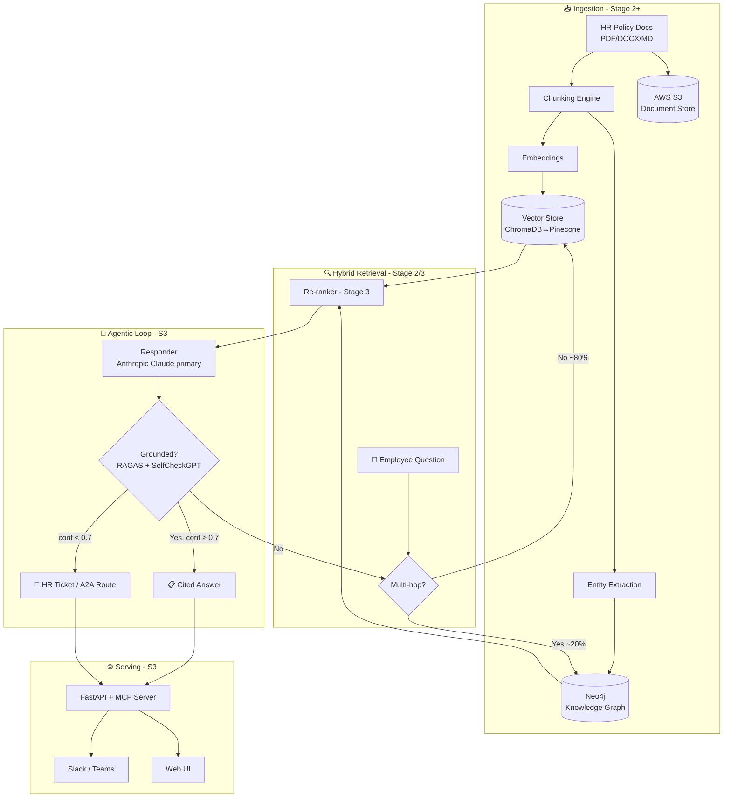

# 📋 POLICYPULSE — Full Production Scope v2.0

## AI-Powered Agentic Knowledge Platform for Enterprise Workforce Self-Service
## "Ask Your Policies" — From RAG Chatbot to Hybrid GraphRAG + Agentic Knowledge Operations

**Document Version:** 2.0 (🎯 **v10.0 REALIGNMENT** — 5-stage model collapsed to the 3-stage arc (S1 RAG → S2 embedding/vector as data infra → S3 GraphRAG + agentic + eval/observability); destination Applied AI Engineer → FDE. Adds the 2026 three-layer eval + Arize Phoenix observability. Prior v1.6 note archived below.)
**Last Updated:** August 10, 2026
**Status:** 📋 DRAFT — v10.0-aligned; S2–S3 layers build progressively across the 3-stage model.
**Author:** Manuel Reyes
**Stages Covered (v10.0):** S1 (foundation, built first) → S2 (DE/AE hardening) → S3 (Applied AI → FDE). One evolving system — ML is an embedded literacy module inside S3, not a separate stage.
**Predecessor:** PolicyPulse Stage 1 (RAG Chatbot + ChromaDB + FastMCP — `..._v1_STAGE1_5.md`)
**Strategic Priority:** 🧠 RAG FOUNDATION → 🕸️ GRAPHRAG HYBRID → 🤖 AGENTIC KNOWLEDGE PLATFORM

---


## 🎯 v10.0 ROADMAP ALIGNMENT & STAGE-EVOLUTION ARC — AUTHORITATIVE

> **This block governs.** Where anything below it conflicts (old stage numbers, retired titles, pre-v10.0 portfolio lists), **this block wins.**

**Aligned to:** Career Roadmap **v10.0 (2026 Market Realignment)**.

**Governing model:** **3 stages, not 5.** The retired 14-month "ML Engineer" stage is now an **embedded ML-literacy module inside Stage 3** (earned-overlay — ships only if it beats the baseline). The destination title is **Applied AI Engineer → Forward Deployed Engineer (FDE)**; the retired "Senior LLM Engineer" title is dropped. **This project is ONE system that evolves across stages — never rebuilt per stage.**

**Portfolio role:** 🏁 **Flagship (lead)** — the **Applied-AI flagship** (regulated-finance RAG differentiator). In v10.0, **flagship vs supporting = size & emphasis, not a quality tier — every project is production-grade.** Lead projects get new tooling first and are updated continuously as skills grow.

**Stage-evolution arc:**

| Stage | Theme | This project's layer |
|---|---|---|
| **S1** | Foundation (GenAI-first core) | RAG foundation — ChromaDB retrieval + **FastMCP** server exposure + eval gates (RAGAS/DeepEval, blocking); synthetic data only. |
| **S2** | DE/AE hardening | Embedding pipeline + vector store treated as **data infrastructure** — orchestrated ingest (Airflow), document-metadata **dbt models** + contracts, retrieval/usage analytics, Docker/ECS, monitoring (the AI-adjacent DE evidence). |
| **S3** | Applied AI (RAG/agentic + eval) | **GraphRAG (Neo4j + ChromaDB)** + agentic evaluator-optimizer retrieval (iteration cap = safety backstop) + **per-document access-control retrieval** + three-layer eval + Arize Phoenix observability + MCP + privacy-routed providers. |

- **Every project's S2 adds:** ingestion → **dbt-tested models (CI-gated)** → **data contracts** (Great Expectations) → warehouse/lakehouse → **Airflow** (idempotent runs) → Docker/**ECS** → monitoring + written **postmortem** → **semantic/metrics layer**.
- **Every project's S3 adds:** RAG/GraphRAG/agentic layer + **three-layer eval** (per-query metrics · trajectory tracing · drift vs frozen golden set) + **observability (Arize Phoenix, OTel-native, free)** + MCP + **HITL** on irreversible actions.

**Production standard (non-negotiable, ALL projects):** business-outcome headline · Mermaid diagram · **C4 Context diagram (+ Container view on lead flagships)** 🆕 · **`docs/adr/` — numbered, immutable Architecture Decision Records (context → decision → consequences)** 🆕 · Dockerfile · eval-metrics table · 15–30s demo GIF · "What I Learned" · **synthetic data only in public repos** · `pyproject.toml` + `uv.lock` + `src/` + `py.typed` + ruff + mypy · **structured logging (`structlog` over stdlib via `ProcessorFormatter`) + PII redaction processor · typed config (`pydantic-settings`, `SecretStr` credentials) · capped jittered retries (`stamina`)** · Conventional Commits · **🆕 `.pre-commit-config.yaml` — pinned hook set, enforced locally (v10.0 CORRECTION 21)**. *(🆕 C4 + ADR added per roadmap v10.0 CORRECTION 8, July 2026 — additive documentation discipline: the decision-and-defense artifacts Applied-AI/FDE interviews probe; same doc version, no structural change.)* **🆕 Toolchain (v10.0 CORRECTION 14, July 2026):** the C4 diagram and the Mermaid diagram come from **one source** — the architecture is modeled once in **Structurizr DSL** (`docs/architecture.dsl`, version-controlled) and the C4 Context/Container views are exported to **Mermaid** via `structurizr-cli` for the README, so the two never drift. Structurizr Lite is free and self-hosts in Docker (already required); model in Structurizr, render out to Mermaid. Additive; same doc version.* **🆕 Dual agentic harness (July 2026; CORRECTION 42):** every repo carries **both** harnesses — **`.opencode/`** and **`.claude/`** — generated from one shared prompt layer and governed by a single portable **`AGENTS.md`** contract, plus a **`hooks/guard.py`** `PreToolUse` guard that blocks `git commit`/`push` so every commit is human by construction. Concretely, `.opencode/` carries (`agents/` — subagent definitions where the filename becomes the agent name; `commands/` — `/`-invoked slash commands), plus **`AGENTS.md`** and **`opencode.jsonc`** at the root. This mirrors the existing `.cursor/rules/` setup rather than replacing it — OpenCode's `instructions[]` field can load `.cursor/rules/*.md` directly and combines them with `AGENTS.md`, so **one set of standards drives both harnesses** and neither drifts. Tooling discipline, not a portfolio artifact.*

> **🆕 Pre-commit standard (roadmap v10.0 CORRECTION 21, August 2026).** This repo carries a pinned `.pre-commit-config.yaml`. **Governing rule: the hook set is a strict *subset* of the CI gate — CI stays authoritative, and no check exists locally that does not also run in CI.** Hooks are pinned by `rev:`, never floating. **Tier A (this repo):** `pre-commit/pre-commit-hooks` (`trailing-whitespace`, `end-of-file-fixer`, `check-yaml`, `check-toml`, `check-added-large-files`, `check-merge-conflict`, `detect-private-key`) · `astral-sh/ruff-pre-commit` → **`ruff-check` (with `--fix`) placed *before* `ruff-format`**, because the linter's fix behaviour can emit changes that then need reformatting (note: the linter hook id is `ruff-check`; the retired bare `ruff` id is not used) · `astral-sh/uv-pre-commit` → **`uv-lock`**, which is what turns the CORRECTION 13 reproducible-build claim from an assertion into an enforced invariant · **`gitleaks`** for secret scanning. **Tier C (`commit-msg` stage):** `conventional-pre-commit` — the Conventional Commits standard above is now **enforced, not merely declared**; install with `pre-commit install --hook-type commit-msg`.
>
> **`mypy` is deliberately excluded from the hook set — CI-only.** The `mirrors-mypy` hook passes `--ignore-missing-imports` by default, which silently degrades third-party types to `Any` and produces different results than running mypy directly. If a local hook is ever wanted, it must be a `local` hook with `language: system` running `uv run mypy` with `pass_filenames: false`. **This exclusion is recorded as an ADR** — it is a decision with a tradeoff, not an omission.
>
> **Known risk — version drift (ADR-worthy).** `.pre-commit-config.yaml` pins tool versions *independently* of `uv.lock`, so upgrading ruff via uv leaves the hook on the old pin and local checks diverge from CI. Mitigation: `sync-with-uv` (or `sync-pre-commit-deps`) plus a scheduled `pre-commit autoupdate --freeze`.
>
> **`prek` — evaluated, not selected (falsifier recorded).** `prek` is a Rust drop-in alternative that reads this same config file and uses uv natively (adopted by CPython, FastAPI, Airflow, Ruff). It is *not* adopted now: `.pre-commit-config.yaml` is the artifact a reviewer recognises, and because prek reads that identical file the migration stays free and reversible. **Falsifier:** adopt if hook install/run time becomes a measured friction point against the 25 hrs/week schedule.
>
> **🆕 Python version — pinned (roadmap v10.0 CORRECTIONS 27–28, August 2026).** **Python 3.14 is the official floor for every project in this portfolio (`3.14+`).** It is pinned in one place per repo — `requires-python = ">=3.14"` in `pyproject.toml` — and every downstream tool reads from that single declaration: `[tool.ruff] target-version = "py314"`, `[tool.mypy] python_version = "3.14"`, the Dockerfile base image, and the CI matrix. **One source, no second place to drift.** ⚠️ **Enforcement:** a mismatch between any of those four and `requires-python` is a CI failure, not a lint warning — the same discipline `uv.lock` gets from the `uv-lock` hook under CORRECTION 21.
>
> ⚙️ **Two binding constraints on the pin.** **(a) Standard GIL build only — the free-threaded build (`python3.14t`) is explicitly NOT used.** Free-threading is where the C-extension wheel compatibility problems live, this portfolio has no CPU-bound multicore workload that would benefit, and debugging wheel availability is pure schedule tax against a 25 hrs/week budget with zero portfolio value. **(b) Airflow constraint-file caveat:** Airflow 3.2.0+ officially supports Python 3.14, but a known open issue reports the 3.14 constraint files being out of sync between the published Docker image and `pip`/`uv` install. **Documented workaround: fall back to the `constraints-3.13.txt` file for the Airflow service only** — this is a constraint-file selection, *not* a second Python version, and the interpreter stays 3.14. ⚠️ **Falsifier:** raise the floor only when a named dependency in a committed lockfile requires it, or when 3.14 leaves security support — **never to chase a release**; 3.15 ships October 2026 and is explicitly not adopted on release.
> **🆕 Language & AI last-mile standard (roadmap v10.0 CORRECTIONS 22–23, August 2026).** **Python and SQL are confirmed as the correct and sufficient primary languages** for this portfolio. **SQL is the single highest-signal language in DE postings**, and **PySpark is the capturable differentiator — reached through Python, not adopted as a separate language.** **Rust, Go, Java, Scala and standalone JavaScript were each evaluated and declined with recorded falsifiers**; JavaScript specifically as *redundant*, since TypeScript is a superset of it and the Stage-2 TypeScript sprint already covers that ground. **TypeScript is retained for the last mile only** — MCP protocol tooling and the AI application/UI layer. **This project stays Python-primary:** agent cores, retrieval, orchestration, evaluation and any long-horizon planning remain Python. ⚠️ **Falsifier:** revisit only if a target employer posts a JD naming a different primary language for the role being applied to.
>
> ⚠️ **Evidence note — guardrail independently corroborated (August 2026).** The last-mile guardrail no longer rests solely on the sources that recommended the SDK. An independent practitioner review of the **AI SDK 7** release (June 2026) draws the same boundary unprompted: the SDK is strongest as a **TypeScript-first application layer**, and weaker where the core problem is multi-hour orchestration, language-agnostic workflows or deeply stateful agent planning — with the explicit note that teams deploying agents across **Python services, queues and data pipelines** should treat it as *an SDK layer, not an orchestration standard*. That is this portfolio's exact shape. Convergent and independently sourced; recorded as **directional**, per the CORRECTIONS 18–19 evidence standard.
>
> **🆕 AI last-mile layer — Vercel AI SDK (roadmap v10.0 CORRECTIONS 22–24, August 2026).** PolicyPulse is the **named build target** for the roadmap's AI-application-layer deliverable: a **streaming Claude-powered UI over this project's existing retrieval**, built with the **Vercel AI SDK** (free, open-source, TypeScript). Selected on adoption evidence — **16M+ weekly downloads** (Vercel, primary source; a separate 2026 analysis puts it in **62% of TypeScript projects started that year**, recorded as directional), the named industry standard for streaming AI UIs, and **model-agnostic across 25+ providers**, matching this portfolio's provider-agnostic architecture and Anthropic-primary routing.
>
> 🧱 **It ships as a sibling package, not a rewrite.** `web/` sits alongside `src/policypulse/` and consumes the retrieval surface over HTTP. **The Python core is untouched** — ingestion, retrieval, fusion, the evaluator-optimizer loop, eval, and the FastMCP server all remain Python. **Produces the AI last-mile artifact a Python-only portfolio cannot show.**
>
> ⏱️ **Timing.** The sprint sits **immediately before the compressed Q1 2027 apply window** — re-timed from the retired "~Month 14" placement, which was set against the pre-resignation calendar — so the evidence is fresh at interview. It is **subordinate to DataVault S2 and never competes with the evidence gate.**
>
> ⚠️ **Privacy-routing amendment (CORRECTION 23) — binding.** The official Vercel starter repo ships **Vercel AI Gateway**, which routes prompts through Vercel. Under this portfolio's privacy-first model-routing rule that is **not acceptable for anything but synthetic data**. The gateway is **swapped for the direct `@ai-sdk/anthropic` provider** — a one-line change the SDK's provider-agnostic design makes trivial — and the build runs **synthetic policy corpus only**, the same constraint every public repo here already carries. **Recorded as an ADR in `docs/adr/` on two grounds, not one:** (a) *privacy* — prompts must not transit a third-party gateway; (b) 🆕 *architecture over platform* — an independent 2026 review of AI SDK 7 warns that when the best experience assumes AI Gateway, Vercel Workflows, Vercel Sandbox, Vercel Observability and Next.js together, teams **drift into a platform decision before making an architecture decision**. Declining the gateway is how this project keeps the SDK as a library rather than inheriting a platform.
>
> 🔭 **Observability — one trace backend, not two (🆕 AI SDK 7, June 2026).** AI SDK 7 ships **`@ai-sdk/otel`** with a single application-startup `registerTelemetry(new OpenTelemetry())` call and optional **OpenTelemetry GenAI semantic conventions**. Because this project's S3 observability standard is **Arize Phoenix (OTel-native)**, the TypeScript last-mile layer **emits into the same trace backend as the Python core**. **No second observability stack is introduced.** ⚠️ **PII constraint carries across the language boundary:** AI SDK 7 telemetry is **allowlist-based** (`includeRuntimeContext` / `includeToolsContext`), and anything not explicitly allowlisted must stay out of spans. The three-layer PII defence and the `redact_pii` posture apply to the TS layer exactly as they do to `structlog` on the Python side — **the boundary is a language boundary, not a policy boundary.**
>
> **🆕 Model-call ownership — the A/B ruling (roadmap v10.0 CORRECTION 28, August 2026).** With a TypeScript last mile in scope, **two designs were possible and the scope documents resolved neither**, which left the privacy amendment protecting an undefined surface. Both are now ruled on explicitly:
>
> - **Pattern A — Python owns the model call.** React → FastAPI → FastAPI calls the provider. The AI SDK renders the stream only.
> - **Pattern B — TypeScript owns the model call.** React → Next.js route handler → the route calls the provider *and* calls this project's retrieval API as a tool.
>
> 🎯 **Ruling: Pattern B for the single-turn chat; Pattern A for the agentic loop.** The **S3 evaluator-optimizer loop, the GraphRAG fusion, access-control retrieval, the three-layer eval and every long-horizon decision stay entirely in Python (Pattern A)** — nothing about this ruling moves an agent core across the language boundary. The **last-mile chat turn runs through the AI SDK route handler with retrieval exposed as a tool (Pattern B)**, which is what the Vercel Academy course teaches, so its patterns apply directly rather than needing translation.
>
> 🧭 **Why this line and not a simpler one.** A pure-Pattern-A build would force the last mile to re-implement streaming, tool-call normalisation and structured output on the Python side purely to keep a language rule — rebuilding what the SDK exists to provide, for no evidence gain. A pure-Pattern-B build would pull the evaluator-optimizer loop into TypeScript, which the CORRECTION 22 guardrail forbids and the AI SDK's own positioning advises against. **The split follows the guardrail's actual principle — the loop is Python, the turn is the last mile — rather than the language boundary as a blunt instrument.**
>
> ⚠️ **What this changes about the privacy amendment — it now protects a defined surface.** Under Pattern B the **route handler sees the full prompt**, which is precisely why the Vercel AI Gateway is declined in favour of the direct `@ai-sdk/anthropic` provider and why the build runs **synthetic corpus only**. Had the ruling landed on Pattern A, the gateway question would have been moot; under Pattern B it is load-bearing. **The retrieval API called as a tool remains behind this project's own auth and access-control layer — Pattern B does not expose the corpus to the browser**, only to the server-side route handler. ⚠️ **Falsifier:** revisit if a single chat turn ever needs more than one model round-trip plus tool calls — at that point it has become a loop, and a loop belongs in Python by the rule above, not in a route handler that has quietly grown one.

---

## 📋 Table of Contents

1. [Executive Summary](#1-executive-summary)
2. [Vision: From RAG Chatbot to Agentic Knowledge Platform](#2-vision-from-rag-chatbot-to-agentic-knowledge-platform)
3. [Market Opportunity](#3-market-opportunity)
4. [Platform Architecture](#4-platform-architecture)
5. [The GraphRAG Knowledge Layer (Signature Upgrade)](#5-the-graphrag-knowledge-layer-signature-upgrade)
6. [Agentic AI System Design](#6-agentic-ai-system-design)
7. [Feature Framework: Complete Product](#7-feature-framework-complete-product)
8. [MCP Server (Expanded)](#8-mcp-server-expanded)
9. [Multi-Tenancy & RBAC](#9-multi-tenancy--rbac)
10. [AI Guardrails & Safety](#10-ai-guardrails--safety)
11. [Tech Stack: Production SaaS](#11-tech-stack-production-saas)
12. [Infrastructure & DevOps](#12-infrastructure--devops)
13. [LLMOps & Evaluation](#13-llmops--evaluation)
14. [Data Architecture: Production Scale](#14-data-architecture-production-scale)
15. [Security & Compliance](#15-security--compliance)
16. [Project Structure](#16-project-structure)
17. [Development Phases](#17-development-phases)
18. [Project Evolution (3 Stages)](#18-project-evolution-3-stages--v100)
19. [Success Metrics](#19-success-metrics)
20. [Risk Mitigation](#20-risk-mitigation)
21. [Skills Required (Roadmap Alignment)](#21-skills-required-roadmap-alignment)

---

## 1. Executive Summary

**PolicyPulse (Full Production)** is the all-stages elaboration of the Stage-1 HR-policy RAG chatbot. The Stage-1 system answers natural-language policy questions with cited, grounded answers and auto-escalates low-confidence questions to HR. This document carries that foundation forward through four more stages into an **agentic enterprise knowledge platform** that reasons across *connected* policy structure (a Neo4j knowledge graph fused with vector retrieval), runs a **self-correcting retrieval loop** (retriever → verifier → responder), and serves multiple tenants with RBAC, Slack/Teams integration, and a full LLMOps evaluation pipeline.

The signature technical arc is **vector-only RAG → hybrid GraphRAG**. Vector search alone stitches together the *most similar* chunks, which is exactly the wrong behavior for multi-hop policy questions ("If I switch from full-time to part-time mid-year, how does that change my PTO accrual *and* my benefits eligibility?"). A knowledge graph that models policies, sections, roles, and effective-dates as typed relationships answers those questions by *traversal*, not similarity — and demonstrably cuts hallucinations on connected-reasoning queries. Vector stays the backbone (~80% of queries); the graph is the additive layer (~15–20%).

### Stage 1 vs Full Production

| Dimension | Stage 1 (RAG Foundation) | Full Production (Agentic GraphRAG) |
|-----------|--------------------------|------------------------------------|
| **Retrieval** | Vector-only (ChromaDB, top-K semantic) | Hybrid: vector backbone + Neo4j graph traversal for multi-hop |
| **AI Role** | "Here's the cited answer" | "Here's the verified answer — and I re-retrieved when my first draft wasn't grounded" |
| **Loop** | Single-pass retrieve → generate | Evaluator-optimizer: retrieve → verify groundedness → re-retrieve/respond |
| **Escalation** | Confidence < 0.7 → HR ticket | Same gate + agentic clarification + cross-team A2A routing |
| **Embeddings** | Off-the-shelf (Gemini, 768-dim) | Fine-tuned HR-domain embeddings + learned re-ranker |
| **Tool exposure** | FastMCP, 2 read tools | Expanded MCP: query, list, policy-update, ticket-create |
| **Tenancy** | Single workspace, local | Multi-tenant SaaS, RBAC, Slack/Teams |
| **Eval** | RAGAS RAG Triad + SelfCheckGPT, manual | LLMOps CI pipeline, A/B retrieval strategies, regression gates |
| **Deploy** | Streamlit Cloud (free) | FastAPI + AWS ECS, Pinecone, PostgreSQL, observability stack |

> **The Stage-1 RAG core is never thrown away.** Chunking, embeddings, the cited-answer contract, the confidence-based escalation gate, and the FastMCP tool surface all carry forward unchanged in interface — each later stage adds a layer behind that stable contract.

---

## 2. Vision: From RAG Chatbot to Agentic Knowledge Platform

```
STAGE 1 (NOW):        "Answer my policy question, with a citation."   (Single-pass RAG)
  │
  │   + AWS storage, scheduled re-ingestion, Neo4j knowledge graph (Stage 2)
  │   + fine-tuned embeddings, re-ranker, graph-quality monitoring (Stage 3)
  │   + LangGraph evaluator-optimizer loop, expanded MCP tools (S3)
  │   + multi-tenant SaaS, RBAC, A2A cross-team routing, LLMOps (S3)
  ▼
STAGE 3 (GOAL):       "Resolve my cross-functional question end-to-end — verified,
                       routed across HR/IT/Payroll agents, audited."   (Agentic platform)
```

The product promise sharpens at each stage but never changes character: **grounded, cited, honest about uncertainty.** Stage 1 proves the grounded-answer contract on a small corpus. S3 proves it holds under multi-tenant load, multi-hop questions, and cross-team handoffs — the difference between "a RAG demo" and "knowledge infrastructure a company runs on."

---

## 3. Market Opportunity

HR-policy self-service remains the most validated enterprise GenAI pattern — every employee has hit a policy dead-end, and every HR team is drowning in repeat questions. The full-production thesis adds two 2026-relevant differentiators on top of that base:

| Driver | Why it matters for the full build |
|--------|-----------------------------------|
| **Multi-hop policy questions** | Real employee questions chain across documents (eligibility → accrual → tax). Vector-only RAG fails these; GraphRAG is the defensible answer. |
| **MCP as agent infrastructure** | Exposing the knowledge base as MCP tools turns PolicyPulse into a component other agents (IT, Payroll) call — not a siloed chatbot. |
| **Groundedness as compliance** | In regulated workforces, an answer that cites the wrong policy section is a liability. The verifier loop + graph traceability is a compliance feature, not a nicety. |
| **Cross-functional routing (A2A)** | "Can I expense my home internet while on parental leave?" spans HR + Finance + IT. A2A lets specialist agents collaborate behind one employee-facing surface. |

---

## 4. Platform Architecture


```mermaid
flowchart TB
    subgraph Ingest[📥 Ingestion - Stage 2+]
        A[HR Policy Docs<br/>PDF/DOCX/MD] --> B[Chunking Engine]
        B --> C[Embeddings]
        B --> E[Entity Extraction]
        C --> D[(Vector Store<br/>ChromaDB→Pinecone)]
        E --> G[(Neo4j<br/>Knowledge Graph)]
        A --> S3[(AWS S3<br/>Document Store)]
    end

    subgraph Retrieve[🔍 Hybrid Retrieval - Stage 2/3]
        Q[👤 Employee Question] --> ROUTER{Multi-hop?}
        ROUTER -->|No ~80%| D
        ROUTER -->|Yes ~20%| G
        D --> RERANK[Re-ranker - Stage 3]
        G --> RERANK
    end

    subgraph Reason[🤖 Agentic Loop - S3]
        RERANK --> RESP[Responder<br/>Anthropic Claude primary]
        RESP --> VERIFY{Grounded?<br/>RAGAS + SelfCheckGPT}
        VERIFY -->|No| ROUTER
        VERIFY -->|Yes, conf ≥ 0.7| ANS[📋 Cited Answer]
        VERIFY -->|conf < 0.7| TICKET[🎫 HR Ticket / A2A Route]
    end

    subgraph Serve[🌐 Serving - S3]
        ANS --> API[FastAPI + MCP Server]
        TICKET --> API
        API --> SLACK[Slack / Teams]
        API --> WEB[Web UI]
    end
```

The architecture is deliberately layered so each stage slots in behind a stable interface: the **router** (Stage 2/3) sits in front of an unchanged retrieve-generate core; the **verifier loop** (S3) wraps the responder without changing the answer contract; the **serving layer** (S3) wraps everything behind FastAPI + MCP.

---

## 5. The GraphRAG Knowledge Layer (Signature Upgrade)

This is PolicyPulse's defining technical differentiator and maps directly to the roadmap's Stage-2 GraphRAG capstone (v8.6) and the AFC↔PolicyPulse shared GraphRAG learning path.

### 5.1 Why graph, and why *additive*

Vector retrieval answers "what text is most similar to this question." Graph retrieval answers "what is *connected* to this entity." Multi-hop policy questions need the second. The knowledge graph models the policy domain as typed nodes and relationships:

```
(Policy)-[:HAS_SECTION]->(Section)
(Section)-[:APPLIES_TO]->(Role {type: "full-time"|"part-time"|"contractor"})
(Policy)-[:EFFECTIVE_FROM]->(Date)
(Policy)-[:SUPERSEDES]->(Policy)
(Section)-[:DEPENDS_ON]->(Section)    // PTO accrual depends on employment-status section
(Role)-[:ELIGIBLE_FOR]->(Benefit)
```

A question like *"part-time PTO accrual after a mid-year status change"* becomes a **traversal**: find the employment-status section → follow `DEPENDS_ON` to the accrual rule → filter sections `APPLIES_TO` part-time → check `EFFECTIVE_FROM`. Vector similarity would never reliably assemble that chain.

### 5.2 Honest cost caveat (carried from roadmap v8.6)

A vector pipeline stands up in days; a knowledge graph is **weeks of ontology work** and ~1.5–1.8× infrastructure plus ongoing entity-pipeline maintenance. The graph is added **for multi-hop / relationship-heavy questions, not because it's trendy.** Practitioner and peer-reviewed evidence (FinanceBench-style multi-hop tests) shows GraphRAG cutting hallucinations and token usage versus vector-only on connected-reasoning queries — but only on those queries. Vector stays the backbone for the ~80% of single-fact lookups.

### 5.3 Hybrid fusion (Stage 3)

Stage 3 matures the layer into **dual-channel retrieval**: run the vector channel and the graph-path channel in parallel, then fuse and re-rank. Add an **entity-extraction pipeline** (LLM-assisted, human-reviewed) to build the graph from unstructured policy docs, plus **graph-quality monitoring** (orphan nodes, stale effective-dates, contradictory `SUPERSEDES` chains). This is where the roadmap's Neo4j GraphAcademy → Neo4j Certified Professional credential is earned by building, not studying.

---

## 6. Agentic AI System Design

The **S3** upgrade wraps the responder in an **evaluator-optimizer loop** — the pattern from Anthropic's "Building Effective Agents," and the same loop discipline AFC and FormSense use.

### 6.1 The retrieval loop

```
retrieve (vector + graph)
   → respond (draft cited answer)
   → verify (RAGAS groundedness + SelfCheckGPT consistency)
       ├─ grounded & conf ≥ 0.7  → emit cited answer
       ├─ ungrounded             → re-retrieve (broaden / switch channel) and retry, up to N rounds
       └─ conf < 0.7 after N     → escalate (HR ticket or A2A route)
```

> 🔁 **Agentic Loop Spec (roadmap v8.8):**
> - **Loop type:** *goal-loop* — retrieve → respond → verify → (if ungrounded) re-retrieve, until grounded-and-confident or the round-cap is hit.
> - **Verifier:** RAGAS RAG Triad (context relevance · groundedness · answer relevance) + SelfCheckGPT consistency, with the confidence threshold as the loop's "can say no."
> - **Autonomy:** runs **unattended** — answering is read-only and non-irreversible. The only state-changing actions (HR ticket creation, A2A routing) are themselves reversible and logged. A **max-retry cap** prevents loops; **low-confidence → human (HR)** is the hard fallback.

### 6.2 A2A cross-team routing (S3)

When a question spans domains, PolicyPulse's HR agent discovers and delegates to peer agents over the A2A protocol (Linux Foundation Agentic AI Foundation): `HR-Agent ↔ IT-Agent ↔ Payroll-Agent`. Each agent owns its corpus; the employee sees one answer assembled from verified contributions, with provenance per claim.

---

## 7. Feature Framework: Complete Product

| Capability | Stage introduced | Description |
|-----------|------------------|-------------|
| Cited grounded answers | S1 | Top-K vector retrieval → cited answer with section/paragraph provenance |
| Confidence-based HR escalation | S1 | conf < 0.7 → structured ticket (question + context + suggested contact) |
| FastMCP tool surface | S1 | `query_policies`, `list_policy_documents` exposed to Cursor/Claude Desktop |
| AWS document store + scheduled re-ingestion | S2 | S3 source-of-truth; nightly re-embed on policy change; PostgreSQL ticket tracking |
| GraphRAG hybrid retriever | S3 | Neo4j knowledge graph fused with vectors for multi-hop questions |
| Fine-tuned embeddings + re-ranker | S3 | HR-domain embedding model; learned re-ranking over fused candidates |
| Evaluator-optimizer loop | S3 | Self-correcting retrieve→verify→re-retrieve; LangGraph orchestration |
| Expanded MCP tools | S3 | + `propose_policy_update`, `create_ticket` (write tools behind approval) |
| Voice interface | S3 | Spoken policy Q&A for accessibility |
| Multi-tenant SaaS + RBAC | S3 | Per-tenant corpora, role-scoped retrieval, admin console |
| Slack / Teams integration | S3 | Answer in-channel where employees already work |
| A2A cross-team routing | S3 | HR ↔ IT ↔ Payroll agent collaboration for cross-functional questions |
| LLMOps evaluation pipeline | S3 | CI evals, A/B retrieval strategies, regression gates |


---

## 8. MCP Server (Expanded)

The Stage-1 FastMCP server exposes **read** tools. Each later stage extends the surface while keeping the read tools' signatures stable.

| Tool | Stage | Type | Notes |
|------|-------|------|-------|
| `query_policies(question)` | S1 | read | Returns cited answer + confidence |
| `list_policy_documents()` | S1 | read | Enumerates corpus with metadata |
| `get_policy_graph(entity)` | S3 | read | Returns the local graph neighborhood for an entity (multi-hop transparency) |
| `propose_policy_update(section, change)` | S3 | write (approval-gated) | Drafts a change for HR review — never auto-applies |
| `create_ticket(question, context)` | S3 | write (reversible) | Mirrors the Stage-1 escalation as a callable tool |


> 🆕 **MCP Apps (AI SDK 7, June 2026) — noted as a candidate, not scoped.** MCP servers can now separate **model-visible tools from app-only tools**, preserve app metadata, and render an app UI inside a **sandboxed iframe** via a JSON-RPC bridge. That maps cleanly onto this project's approval-gated write tools — `propose_policy_update` could surface a reviewable diff in an app pane rather than as raw text for HR. **Recorded as a candidate for the S3 MCP surface; not scoped, and not a prerequisite for the Week-2(b) build.** ⚠️ **Falsifier:** scope it only after the Week-2(b) UI lands and only if the approval-review UX is demonstrably worse without it.

> **Write tools are approval-gated by design.** `propose_policy_update` drafts; a human in HR commits. This mirrors the cross-portfolio rule that irreversible/material actions keep a human sign-off (the same principle as Crucible's live-trade gate, scaled to PolicyPulse's far lower stakes).

---

## 9. Multi-Tenancy & RBAC

| Concern | Approach |
|---------|----------|
| Corpus isolation | Per-tenant vector namespaces + per-tenant Neo4j database/label scoping |
| Role-scoped retrieval | Retrieval filtered by the asker's role (a contractor never retrieves manager-only policy sections) |
| Admin console | Per-tenant document management, eval dashboards, ticket queues |
| Audit | Every answer logs retrieved chunks/graph-paths + the model + the version that produced it |

---

## 10. AI Guardrails & Safety

The Stage-1 guardrail set (scope, hallucination, PII, grounding — 8 guardrails) carries forward and is extended:

| Guardrail | Stage | What it enforces |
|-----------|-------|------------------|
| Scope limiter | S1 | Answers only from the policy corpus; refuses out-of-scope questions |
| Grounding check | S1 | Every claim traceable to a retrieved chunk; ungrounded → escalate |
| PII protection | S1 | No personal data surfaced in answers or logs |
| Confidence gate | S1 | conf < 0.7 → HR ticket, never a confident guess |
| Citation integrity | S2 | Cited section must actually contain the claim (graph cross-check) |
| Effective-date check | S2 | Never cite a superseded policy version as current |
| Role-scope enforcement | S3 | Retrieval respects the asker's RBAC role |
| Cross-agent provenance | S3 | A2A-assembled answers carry per-claim source attribution |

---

## 11. Tech Stack: Production SaaS

| Layer | Stage 1 | Full Production |
|-------|---------|-----------------|
| Vector store | ChromaDB (local, persistent) | Pinecone (managed, multi-tenant) |
| Knowledge graph | — | Neo4j (typed policy ontology) |
| Embeddings | Gemini (768-dim) | Fine-tuned HR-domain model + learned re-ranker |
| LLM SDK | Anthropic Claude primary; Gemini/OpenAI fallback | Same provider-agnostic abstraction |
| Orchestration | Single-pass | LangGraph (evaluator-optimizer loop) |
| Tool protocol | FastMCP (2 read tools) | Expanded MCP (read + approval-gated write) |
| API / UI | Streamlit | FastAPI backend + web UI + Slack/Teams |
| Storage | Local | AWS S3 (docs) + PostgreSQL (tickets/metadata) + Redis (cache) |
| Eval | RAGAS + SelfCheckGPT + DeepEval, manual | LLMOps CI pipeline, A/B, regression gates |
| Deploy | Streamlit Cloud (free) | AWS ECS (Fargate), auto-scaling |
| Observability | Python logging | LangSmith traces + Prometheus/Grafana/Sentry |
| AI last-mile UI | — | 🆕 Vercel AI SDK (TS) — streaming Claude UI over retrieval; **Pattern B** (route handler owns the single-turn model call, retrieval as a tool); direct `@ai-sdk/anthropic` provider, gateway declined (ADR); synthetic data only |

> All Python standards from the roadmap hold across every stage: `pyproject.toml`, `src/` layout, `py.typed`, `from __future__ import annotations`, NumPy-style docstrings, Pydantic validation, logging (no `print()`), GitHub Actions CI.

---

## 12. Infrastructure & DevOps

```yaml
environments:
  development:
    - Local Docker Compose (ChromaDB + Neo4j + FastAPI hot reload)
    - Local MCP server testable from Cursor / Claude Desktop
  staging:
    - AWS ECS (Fargate) — mirrors production
    - Separate Pinecone index + Neo4j database
  production:
    - AWS ECS (Fargate) — auto-scaling
    - RDS PostgreSQL (Multi-AZ) · ElastiCache Redis · S3 document store
    - Pinecone (managed vectors) · Neo4j Aura (managed graph)
  ci_cd:
    on_push:
      - Lint (Ruff) + type check (mypy)
      - Unit tests (pytest)
      - RAG eval suite (RAGAS RAG Triad on a fixed question set)
    on_merge_to_main:
      - Build Docker images
      - Deploy to staging → groundedness regression gate → deploy to production
```

---

## 13. LLMOps & Evaluation

Evaluation is the spine, not an afterthought — consistent with the eval-first discipline across the portfolio.

| Metric | Tool | Gate |
|--------|------|------|
| Context relevance | RAGAS | Retrieved chunks actually relevant to the question |
| Groundedness / faithfulness | RAGAS + SelfCheckGPT | Answer supported by retrieved context (CI regression gate) |
| Answer relevance | RAGAS | Answer addresses the question asked |
| Multi-hop accuracy | Custom labeled set | Graph-path questions answered correctly vs vector-only baseline |
| Hallucination rate | SelfCheckGPT consistency | Below threshold; tracked per release |
| Retrieval A/B | LLMOps pipeline | Vector-only vs hybrid vs re-ranked — pick the winner on held-out questions |

The **GraphRAG payoff is proven, not asserted**: a labeled multi-hop question set establishes the vector-only baseline, and the hybrid retriever must beat it on connected-reasoning accuracy to justify its infra cost.

---

## 14. Data Architecture: Production Scale

```yaml
sources:
  documents: AWS S3 (versioned; source of truth)
  refresh: scheduled re-ingestion on policy change (nightly diff → re-embed changed chunks + update graph)
stores:
  vectors: Pinecone (per-tenant namespaces)
  graph: Neo4j (per-tenant scoping; typed policy ontology)
  relational: PostgreSQL (tickets, audit, tenant config)
  cache: Redis (hot-query answer cache)
provenance:
  every_answer_logs: [retrieved_chunk_ids, graph_paths, model, prompt_version, scope_version]
```

---

## 15. Security & Compliance

| Concern | Control |
|---------|---------|
| PII | Never embedded into answers/logs; guardrail-enforced; synthetic corpus for the public GitHub repo |
| Tenant isolation | Namespaced vectors + scoped graph; no cross-tenant retrieval |
| Access control | RBAC role-scoped retrieval; admin console audit |
| Auth | Auth0 / SSO at the serving layer |
| Data residency | S3 + managed services in a chosen region; documented for compliance review |
| Auditability | Per-answer provenance enables "why did it say that" reconstruction |

---

## 16. Project Structure

```
policypulse/
  src/policypulse/
    ingest/        # extraction · chunking · embeddings · entity extraction
    graph/         # Neo4j ontology · Cypher · graph-quality monitors (Stage 2/3)
    retrieve/      # vector channel · graph channel · fusion · re-ranker (Stage 3)
    agent/         # evaluator-optimizer loop · LangGraph (S3)
    eval/          # RAGAS · SelfCheckGPT · multi-hop labeled set
    mcp_server/    # FastMCP — read tools (S1) + approval-gated write tools (S3)
    api/           # FastAPI · Slack/Teams adapters (S3)
    a2a/           # cross-team agent protocol (S3)
    guardrails/
    observability/ # 🆕 structlog ProcessorFormatter chain + redact_pii processor (CORRECTION 16)
  web/             # 🆕 TS last mile — Vercel AI SDK streaming UI over the retrieval API
                   #    sibling package, NOT a rewrite; Python core untouched
                   #    Pattern B: route handler owns the single-turn model call,
                   #    calls retrieval as a tool. Agentic loop stays Python (Pattern A).
  tests/
  .pre-commit-config.yaml   # pinned hook set; strict subset of CI (CORRECTION 21)
  pyproject.toml   # py.typed · src layout · semver
  Dockerfile
```

---

## 17. Development Phases

| Phase | Stage | Build focus | Exit criteria |
|-------|-------|-------------|---------------|
| Foundation | **S1** | Vector RAG + cited answers + escalation + FastMCP | Live Streamlit demo; RAG Triad measured; MCP tools callable in Cursor |
| Cloud | **S2** | AWS S3 + PostgreSQL + scheduled re-ingestion; **containerize + deploy to AWS ECS/Fargate** (Streamlit Cloud → ECS handoff) | App running on ECS/Fargate; nightly re-ingest working |
| Intelligence | **S3** | **GraphRAG intro** (Neo4j) → **GraphRAG deepen** (dual-channel fusion, graph-quality monitoring); fine-tuned embeddings + re-ranker | Multi-hop questions answered by graph traversal; hybrid beats vector-only baseline on labeled multi-hop set; Neo4j credential earned by building |
| Agentic | **S3** | LangGraph evaluator-optimizer loop; Pinecone migration; expanded MCP write tools; voice | Self-correcting loop measurably lifts groundedness; write tools approval-gated |
| Platform | **S3** *(end-state product surface — beyond the portfolio evidence bar)* | Multi-tenant SaaS, RBAC, Slack/Teams, A2A, LLMOps CI | Multi-tenant isolation verified; A2A cross-team answer with provenance; regression gates green |


---


> ✅ **Stage columns above are on the governing 3-stage scale (S1 · S2 · S3)** — renumbered from the retired 5-stage scale in roadmap **v10.0 CORRECTION 27**. Mapping applied: old 1 → **S1**; old 2 → **S2**; old 2–3, 3, 4 and 5 → **S3**. **No capability, tool or guardrail was removed** — every row survives with its content intact; only the stage label changed. The five build phases in §17 are retained as *build sequencing within* the three stages, which is not duplication.

---

## 18. Project Evolution (3 Stages — v10.0)

*One evolving system across the roadmap's 3 stages — never rebuilt per stage. The retired v9.2 "ML Engineer / Senior LLM Engineer" tiers collapse into **Stage 3**, where ML work is an embedded literacy module governed by the earned-overlay rule.*

| Stage | Role (v10.0) | PolicyPulse layer & production deliverables | Exit criteria |
|---|---|---|---|
| **S1** | Foundation (GenAI-first core) | RAG chatbot — ChromaDB + Anthropic-primary SDK + **cited** answers + confidence-based HR escalation + **FastMCP** read tools + Streamlit. **Blocking eval gates** (RAGAS Triad + SelfCheckGPT). Synthetic policy corpus only. | Groundedness baseline measured; CI eval gate green; FastMCP read tools live. |
| **S2** | DE/AE hardening | Embedding pipeline + vector store treated as **data infrastructure** — Airflow-scheduled re-ingestion, doc-metadata **dbt models + tests + data contracts** (Great Expectations), retrieval/usage analytics marts, AWS S3 + PostgreSQL, **Docker → ECS/Fargate** (Terraform-provisioned), monitoring + written postmortem. GraphRAG on-ramp (Neo4j intro). | Pipeline reproducible via Terraform; contracts enforced in CI; ECS deploy live; re-ingestion scheduled. |
| **S3** | Applied AI (RAG/agentic + eval) | Hybrid **GraphRAG (Neo4j + ChromaDB)** + agentic **evaluator-optimizer** loop (retrieve → verify → re-retrieve; **iteration cap = safety backstop**) + **per-document access-control retrieval** + **MCP** expanded (approval-gated write tools) + **three-layer eval** (per-query RAGAS · trajectory tracing · drift vs frozen golden set) + **Arize Phoenix** observability + privacy-routed providers. | Hybrid beats vector-only on the labeled multi-hop set; **faithfulness ≥ 0.9**; zero cross-scope retrieval in the access-control audit. |

> **Optional beyond-portfolio extension (S3 stretch, earned-overlay gated):** multi-tenant SaaS + RBAC + A2A cross-team routing (formerly the v9.2 "S3"). Build only if it beats the single-tenant baseline on a real need — not required for the flagship.

> 🕸️ **GraphRAG note:** the knowledge-graph layer is an *additive* relationship-reasoning upgrade for multi-hop policy questions, not a replacement. Vector stays the ~80% backbone; the graph earns its place only by beating the multi-hop baseline. On-ramp courses are in §Courses (S2 Knowledge-Graphs-for-RAG → S3 Neo4j GraphAcademy).


## 19. Success Metrics

| Metric | Stage 1 target | Full-production target |
|--------|----------------|------------------------|
| Groundedness (RAGAS) | Measured + reported | CI regression gate; no release below baseline |
| Multi-hop accuracy | n/a (vector-only) | Hybrid beats vector-only baseline on labeled set |
| Hallucination rate (SelfCheckGPT) | Below threshold | Tracked per release; trend non-increasing |
| Escalation precision | Low-confidence correctly escalated | + correct A2A routing for cross-team questions |
| Answer latency | Acceptable for demo | P95 within SaaS SLA (Redis cache on hot queries) |
| Tenant isolation | n/a | Zero cross-tenant retrieval in audit |

---

## 20. Risk Mitigation

| Risk | Mitigation |
|------|-----------|
| Graph over-engineering | Vector stays the backbone; graph only earns its place by beating the multi-hop baseline |
| Entity-pipeline drift | Graph-quality monitors (orphans, stale dates, contradictory `SUPERSEDES`) as CI checks |
| Eval theater | Fixed labeled question sets + regression gates; A/B on held-out questions, not vibes |
| Write-tool risk | `propose_policy_update` drafts only; human commits |
| Scope creep across stages | Each stage has explicit exit criteria (§17); Stage-1 contract is frozen |

---

## 21. Skills Required (Roadmap Alignment — v10.0)

| Skill | Stage | How PolicyPulse Uses It |
|-------|-------|------------------------|
| Python, pandas, Pydantic | S1 ✅ | Data models, structured outputs |
| **Polars** | ⬆️ S2 | Corpus manifests, chunk/metadata tables, eval-result frames (CORRECTION 35) |
| LLM SDK (Anthropic primary), Streamlit | S1 ✅ | RAG generation + Stage-1 chat UI |
| RAG (chunking, embeddings, semantic search) | S1 ✅ | The retrieval foundation |
| FastMCP | S1 ✅ | Read-tool MCP server (primed by the MCP primer) |
| RAGAS, SelfCheckGPT, DeepEval | S1 ✅ | Groundedness / hallucination evaluation |
| **dbt + data contracts (Great Expectations)** | **S2** | **Doc-metadata models, tests, quality gates — vector/embedding pipeline as data infrastructure** |
| **Airflow, Terraform** | **S2** | **Scheduled re-ingestion; reproducibly-provisioned infra** |
| AWS (S3, RDS, ECS/Fargate), Docker | S2 | Document store, ticket tracking, containerized deployment |
| PostgreSQL, Redis | S2 | Production data + cache layer |
| Vector DBs (ChromaDB → Pinecone) | S2 | Semantic retrieval backbone → managed multi-tenant |
| **GraphRAG / Neo4j** | **S2 → S3** | **Hybrid retriever; the signature differentiator** |
| **LangGraph + evaluator-optimizer loop** | **S3** | **Agentic retrieve → verify → re-retrieve (iteration-capped)** |
| **MCP (deep dive) + access-control retrieval** | **S3** | **Approval-gated write tools; per-document RBAC at retrieval** |
| **Three-layer eval + Arize Phoenix observability** | **S3** | **Per-query + trajectory tracing + drift vs frozen golden set** |
| **LLMOps (CI evals, A/B, regression gates)** | **S3** | **Blocking groundedness gates; retrieval A/B** |
| TypeScript + Zod | S2 (sprint immediately before the Q1 2027 apply window) | TS MCP server variant; Zod = MCP SDK input validation — and carries directly into the AI SDK layer below, no new prerequisite |
| **Vercel AI SDK (TypeScript — last mile)** | **S2 sprint** | **Streaming Claude-powered UI over this project's retrieval; direct `@ai-sdk/anthropic` provider (no gateway); synthetic corpus only; `@ai-sdk/otel` → same Phoenix/OTel backend as the Python core** |
| **React / Next.js** *(named outcome, not a separate track)* | **S2 sprint** | **Produced by the row above, not studied separately — components, hooks, state, streaming UI, calling a typed API. Scoped to table-stakes competence; ships as a browser page at a URL, not an Electron desktop build.** |
| FastAPI, System Design, Production Monitoring | S3 | Backend, architecture, observability |


---

## ✅ Approval Checklist

- [ ] Stage-1 contract confirmed frozen (cited answers, confidence escalation, FastMCP read tools)
- [ ] GraphRAG positioned as additive (vector backbone ~80%), with the honest cost caveat intact
- [ ] Evaluator-optimizer loop spec + autonomy/escalation gate approved
- [ ] Expanded MCP write tools confirmed approval-gated (never auto-apply policy changes)
- [ ] Multi-tenant isolation + RBAC + A2A provenance scoped
- [ ] LLMOps regression gates defined (groundedness baseline, multi-hop labeled set)
- [ ] Stage-by-stage exit criteria realistic given the skill-acquisition schedule
- [ ] All roadmap v8.9 skills mapped to product features
- [ ] v8.9 course alignment reflected (MCP primer at Stage 1; TS+Zod at Month 14)

---

## Quick Reference

```
┌─────────────────────────────────────────────────────────────────┐
│      POLICYPULSE — FULL PRODUCTION v1.6                          │
│      🧠 RAG Foundation → 🕸️ GraphRAG Hybrid → 🤖 Agentic Platform│
│      "Ask Your Policies" — grounded, cited, honest about doubt    │
├─────────────────────────────────────────────────────────────────┤
│  🔍 HYBRID RETRIEVAL (Stage 2/3)                                 │
│     • Vector backbone (ChromaDB → Pinecone) ~80% of queries      │
│     • Neo4j knowledge graph for multi-hop ~15–20%                │
│     • Fine-tuned HR embeddings + learned re-ranker (Stage 3)     │
├─────────────────────────────────────────────────────────────────┤
│  🤖 AGENTIC LOOP (S3)                                       │
│     • retrieve → respond → verify → re-retrieve (LangGraph)      │
│     • Verifier: RAGAS Triad + SelfCheckGPT + confidence gate     │
│     • Unattended (read-only); low-confidence → human (HR)        │
├─────────────────────────────────────────────────────────────────┤
│  🔧 MCP TOOL SURFACE                                             │
│     • S1 read: query_policies · list_policy_documents            │
│     • S3 read: get_policy_graph (multi-hop transparency)         │
│     • S3 write (approval-gated): propose_policy_update · ticket  │
├─────────────────────────────────────────────────────────────────┤
│  🌐 PLATFORM (S3)                                           │
│     • Multi-tenant SaaS + RBAC + Slack/Teams                     │
│     • A2A: HR ↔ IT ↔ Payroll cross-team routing                 │
│     • FastAPI + AWS ECS · PostgreSQL · Redis · S3                │
├─────────────────────────────────────────────────────────────────┤
│  🧪 LLMOPS & EVAL (spine, all stages)                            │
│     • RAGAS RAG Triad · SelfCheckGPT · DeepEval                  │
│     • Multi-hop labeled set proves GraphRAG payoff               │
│     • CI groundedness regression gate · retrieval A/B            │
└─────────────────────────────────────────────────────────────────┘
```

---

## Production README Standard

> **Cross-Project Standard:** Every project README includes a Mermaid architecture diagram, a Dockerfile, an evaluation-metrics table (RAGAS/DeepEval results), a 15–30s demo GIF, and a "What I Learned" section.

### README Presentation Order — ① Production · ② Cost · ③ Architecture

> **🆕 Roadmap v10.0 CORRECTION 18.** The README **leads with these three headings, in this order**, and every résumé bullet written beneath this project answers one of the three. Anything answering none is cut. **This adds no artifact and removes none** — every element in the standard above still ships; only the order they are met in, and the language on top, changes. Cost to adopt: **$0**.

| # | Heading | What goes under it | What does *not* |
|---|---------|--------------------|-----------------|
| **①** | **Production** | Containerised FastMCP + RAG service with a documented deploy path (Docker + CI) and structured logging. **Blocking eval gates are merge conditions, not reports** — RAG Triad (context relevance / groundedness / answer relevance), hallucination-injection results, confidence-based HR escalation behaviour. State retrieval freshness and failure/fallback behaviour. | A stack list is not a production claim. If nothing depends on it and nothing watches it, it is not in production — say so and move the content to Architecture. |
| **②** | **Cost** | **Strongest Cost story in the portfolio.** Cost-per-query and p95 latency across inference substrates — produced directly by the roadmap's *substrate benchmark* (one eval suite, one corpus, local quantised via Ollama · cloud API · full-precision open model). Plus token discipline, local-vs-cloud routing policy, and embedding/re-index cost. Always name the mechanism, never just the number. | A number with no mechanism. And never a speed/cost win without its reliability disclosure — state the SLA the change held to. A win that hides a regression is the bait-and-switch reviewers watch for. |
| **③** | **Architecture** | GraphRAG design (Neo4j + ChromaDB), retrieval-strategy ADRs **with the rejected alternatives recorded**, C4 Context + Container, and the MCP tool boundary (read → approval-gated write). | Diagrams shown without the decision behind them. The ADR is what turns a diagram into evidence of judgement. |

**Everything else in the standard follows these three** — evaluation-metrics table, 15–30s demo GIF, "What I Learned", Conventional Commit history. Order changes; content does not.

**Résumé bullets beneath this project:** `Action + What + Outcome + Proof`, carrying the three senior components — *a named metric against a baseline · the method · the scope*. Cap at **4–6 bullets**; if a bullet cannot answer *"so what?"* quickly, cut it.

> **Honesty discipline (binds above the formula).** Use numbers **only when they can be defended in an interview**. Where a metric cannot be shared, substitute scale and reliability outcomes — tables, jobs, refresh cadence, incidents, users. **Never invent a figure to fill the shape**; a fabricated metric is a failed technical screen with extra steps.

> **📄 Diagrams stay in the repo.** The Mermaid and C4 diagrams render natively on GitHub and belong in this README. They must **never** be pasted onto a résumé — ATS parsers skip images entirely, which is a documented failure mode on data-engineering résumés. The résumé carries the *text* of the architecture (named components, deploy path, contracts) and a link here.

---

## 📚 Courses & Certifications — take-order table (v10.0 reference)

*Synced to roadmap **v10.0** (through CORRECTION 43). **The table is ordered: take them top to bottom.** Numbering is continuous across all three stages — #1 is the next thing to start, not the first item of an unordered list. Names match the roadmap's stage tables. 🎖️ = committed certification; ⏸️ = conditional, taken only on a named trigger and **never stacked**. **All certifications are self-funded** — the prior employer track ended, and CORRECTION 37 moved AB-620 to conditional: **eight committed ≈ $1,029**, ≈ **$1,594** if every conditional is taken. The shipped production-grade project is the primary hiring signal — certs are tiebreakers.*

### 🎓 Take-order — PolicyPulse (Applied-AI flagship)

| # | Course / Certification | Source | Cost | Stage | Why here, in this position |
|---|---|---|---|---|---|
| 1 | uv — Python Packaging & Environments | Astral docs + Sweigart quickstart | Free | S1 | **Before the first commit** — the repo standard depends on it. |
| 2 | Pre-Commit Hooks — Molin four-part series | Blog series | Free | S1 | Hooks before history; `gitleaks` + `nbstripout` make *synthetic-only* mechanical. |
| 3 | Introduction to Git and GitHub | Coursera · Google | Free (audit) | S1 | Branch → PR → self-review. |
| 4 | Architecture Documentation: C4 + ADR | c4model.com + AWS Prescriptive Guidance | Free | S1 | Before the first retrieval-strategy ADR is written. |
| 5 | Building with the Claude API | Anthropic Academy | Free | S1 | The SDK source-of-truth; everything downstream calls through it. |
| 6 | IBM Generative AI Engineering PC (16 courses) | Coursera · IBM | Coursera Plus | S1 | The S1 spine — RAG, LangChain, fine-tuning, deployment. Long-running; start early. |
| 7 | Building & Evaluating Advanced RAG | DeepLearning.AI | Free | S1 | The RAG Triad — the vocabulary the eval gates are written in. |
| 8 | Improving Accuracy of LLM Applications | DeepLearning.AI | Free | S1 | Eval-from-scratch. **Take before building the gate, not after.** |
| 9 | MCP: Build Rich-Context AI Apps — primer | DeepLearning.AI / Anthropic Academy | Free | S1 | *Before* the FastMCP build, so the server is designed rather than discovered. |
| 10 | Docker for Beginners with Hands-on Labs | KodeKloud | Free | S1 | Containerize the retrieval service. |
| 11 | 30 Days of Streamlit | Streamlit | Free | S1 | The S1 answer surface. |
| 12 | CS50P — Introduction to Programming with Python | HarvardX | Free | S1 | Testing and debugging discipline. |
| 13 | MITx 6.00.1x — CS & Programming with Python | edX · MIT | Free (audit) | S1 | CS foundations; background track. |
| 14 | 🎖️ **AI-901** Azure AI Fundamentals | Microsoft · Pearson VUE | **$99** ✅ | S1 | Take once S1 build work is underway. |
| 15 | ⏸️ **AB-620** AI Agent Builder Associate | Microsoft | ~$165 — **CONDITIONAL** | S1–S2 | **Not by default** — trigger is a Microsoft-ecosystem specialization. |
| 16 | PostgreSQL for Everybody + use-the-index-luke.com | Coursera · U. Michigan + web | Free (audit) | S2 | Opens S2 — metadata and chunk tables live in a real database. |
| 17 | dbt Fundamentals | dbt Labs | Free | S2 | Corpus and eval-result modelling. |
| 18 | dbt Advanced Learning Paths (Analytics Engineering) | dbt Labs | Free | S2 | AE depth. |
| 19 | ⚡ Dataframe Engine Boundary — Polars-first pipelines | Polars User Guide (roadmap S2 row 6.5) | Free | S2 | Before rebuilding corpus manifests and eval frames. |
| 20 | Astronomer Academy — Airflow 101 + DAG Authoring | Astronomer | Free | S2 | Scheduled re-index and eval runs. |
| 21 | Terraform Fundamentals | HashiCorp Developer | Free | S2 | Infrastructure for the deployed service. |
| 22 | 🆕 IBM AI-Native Data Engineering PC | Coursera · IBM (CORRECTION 43) | Coursera Plus | S2 | **The two that fill PolicyPulse's real gaps:** *Vector DBs & Retrieval DE* (vector schemas + retrieval security/governance — the course behind access-control-aware retrieval, which had none) and *Unstructured Data Engineering* (PII-safe corpus prep, citation-grade chunking). |
| 23 | Vector Databases: from Embeddings to Applications | DeepLearning.AI | Free | S2 | Short; largely superseded by the AI-Native course above — skim if hours are tight. |
| 24 | Pre-processing Unstructured Data for LLM Apps | DeepLearning.AI | Free | S1 | Same — the 1-hour version of what AI-Native teaches in 24. |
| 25 | Knowledge Graphs for RAG | DeepLearning.AI × Neo4j | Free | S2 | The GraphRAG on-ramp before Neo4j work begins. |
| 26 | 🎖️ **DP-700** Fabric Data Engineer | Microsoft | **$165** ✅ | S2 | After the S2 data work exists. |
| 27 | 🎖️ **AWS DEA-C01** Data Engineer Associate | AWS | **$150** ✅ | S2 | Deploy-target credential. |
| 28 | ⏸️ Lakehouse slot — **take exactly ONE**: DP-750 / SnowPro Core / Databricks DE | Microsoft / Snowflake / Databricks | $165–200 — **CONDITIONAL** | S2 | Deferred — decided by the target employer's stack. |
| 29 | MCP — Advanced Topics (full) | Anthropic Academy | Free | S3 | Opens S3 — read → approval-gated write boundary. |
| 30 | AI Agents in LangGraph | DeepLearning.AI | Free | S3 | Agentic retrieval with a human gate. |
| 31 | LangChain Academy (LangGraph + LangSmith) | LangChain | Free | S3 | LangSmith tracing for the eval spine. |
| 32 | Agent Skills with Anthropic | Anthropic Academy | Free | S3 | Packaging reusable capability. |
| 33 | Automated Testing for LLMOps | DeepLearning.AI | Free | S3 | Regression gates as merge conditions. |
| 34 | HuggingFace LLM Course (formerly the NLP Course) | HuggingFace | Free | S3 | Restored to core in v10.0 — embeddings and tokenization depth. |
| 35 | Neo4j GraphAcademy — Knowledge Graphs & GraphRAG | Neo4j | Free | S3 | GraphRAG, straight after the KG on-ramp. |
| 36 | NVIDIA DLI: Building RAG Agents with LLMs | NVIDIA | Free | S3 | RAG agents; doubles as PolicyPulse evidence. |
| 37 | AI-103 Learning Path — Foundry & Azure AI Agents | Microsoft Learn | Free | S3 | Free path backing the AI-103 exam. |
| 38 | 🎖️ **Neo4j Certified Professional** | Neo4j | **Free** ✅ | S3 | Free — take as soon as GraphAcademy is done. |
| 39 | 🎖️ **NVIDIA NCA-GENL** | NVIDIA | **$125** ✅ | S3 | GenAI credential. |
| 40 | 🎖️ **AI-103** Azure AI Apps & Agents Developer | Microsoft | **$165** ✅ | S3 | Code-first Azure/Foundry. |
| 41 | 🎖️ **Anthropic CCA-F** | Anthropic · Pearson VUE | **~$125** ✅ ⚠️ | S3 | Primary-SDK source-of-truth. |
| 42 | 🎖️ **Databricks GenAI Engineer Associate** | Databricks | **$200** ✅ | S3 | Optional. |

> **🎯 Stage 3 deliverable (CORRECTION 8):** ADR set + C4 diagram + **architecture-defense rehearsal** — present and defend the design against a reviewer, mirroring the FDE panel format.

**Focus thread:** document → chunk → embed → retrieve (vector + graph) → verify → cited answer · access-control retrieval · RAGAS/SelfCheckGPT eval · MCP read → approval-gated write.

> **Cert discipline (v10.0):** the shipped, production-grade project is the primary hiring signal; certs are tiebreakers. Platform certs are a **conditional menu — take exactly ONE**, matched to a concrete apply-list's stack. Keyword-density is a negative signal.

---

**Document Status:** 📋 DRAFT — v10.0-aligned Full-Production companion. Stages: S1 (built first) → S2 (DE/AE) → S3 (Applied AI → FDE). One evolving system.
**Last aligned:** v10.0 (2026 Market Realignment).