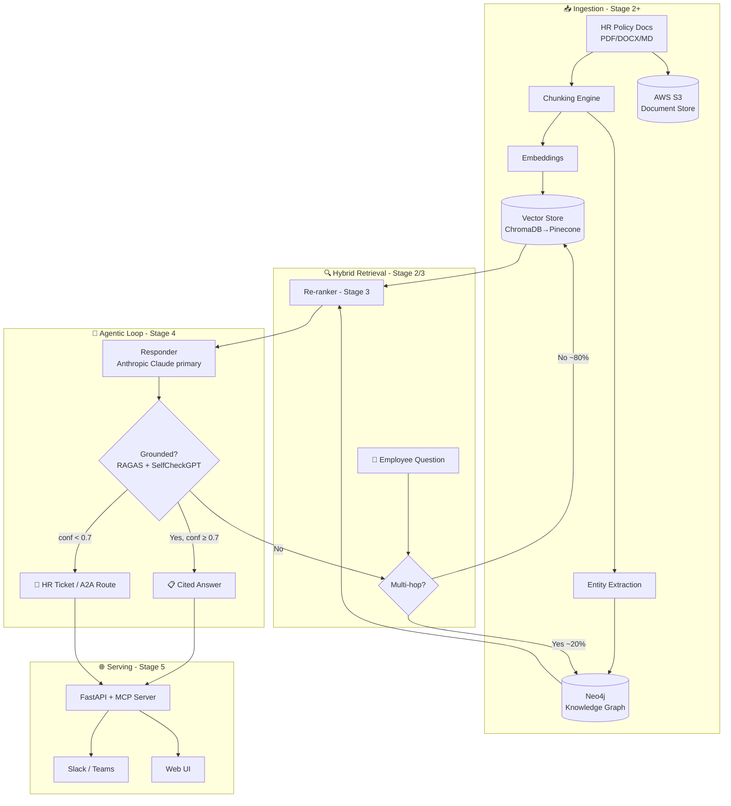

# 📋 POLICYPULSE — Full Production Scope v1.6

## AI-Powered Agentic Knowledge Platform for Enterprise Workforce Self-Service
## "Ask Your Policies" — From RAG Chatbot to Hybrid GraphRAG + Agentic Knowledge Operations

**Document Version:** 1.6 (Full-Production companion to the Stage-1 scope `POLICYPULSE_HR_RAG_SCOPE_v1_STAGE1_5.md` v1.5. **Synced to roadmap v8.9.** Details all 5 stages — the Stage-1 RAG foundation evolves into a hybrid **GraphRAG (Neo4j + vector)** retriever, an **agentic evaluator-optimizer** retrieval loop, and a **multi-tenant SaaS** with A2A. **v8.9 course alignment:** the **MCP primer** (DeepLearning.AI "MCP: Build Rich-Context AI Apps with Anthropic", Elie Schoppik, free) is pulled forward to **Stage 1**, taken *before* the FastMCP build, with the full MCP deep-dive retained at Stage 4; the **TypeScript sprint** resource is the Total TypeScript + Zod tutorials (Month 14). Additive — Stage-1 build scope is unchanged from the Stage-1 v1.5 document.)
**Last Updated:** June 30, 2026
**Status:** 📋 DRAFT — Future Vision (Stages 2–5 require progressive skill acquisition)
**Author:** Manuel Reyes
**Stages Covered:** 1 (foundation, built first) → 2 (Data Engineer) → 3 (ML Engineer) → 4 (Agentic AI Engineer) → 5 (Senior LLM Engineer)
**Predecessor:** PolicyPulse Stage 1 (RAG Chatbot + ChromaDB + FastMCP — `..._v1_STAGE1_5.md`)
**Strategic Priority:** 🧠 RAG FOUNDATION → 🕸️ GRAPHRAG HYBRID → 🤖 AGENTIC KNOWLEDGE PLATFORM

---

## 📋 Table of Contents

1. [Executive Summary](#1-executive-summary)
2. [Vision: From RAG Chatbot to Agentic Knowledge Platform](#2-vision-from-rag-chatbot-to-agentic-knowledge-platform)
3. [Market Opportunity](#3-market-opportunity)
4. [Platform Architecture](#4-platform-architecture)
5. [The GraphRAG Knowledge Layer (Signature Upgrade)](#5-the-graphrag-knowledge-layer-signature-upgrade)
6. [Agentic AI System Design](#6-agentic-ai-system-design)
7. [Feature Framework: Complete Product](#7-feature-framework-complete-product)
8. [MCP Server (Expanded)](#8-mcp-server-expanded)
9. [Multi-Tenancy & RBAC](#9-multi-tenancy--rbac)
10. [AI Guardrails & Safety](#10-ai-guardrails--safety)
11. [Tech Stack: Production SaaS](#11-tech-stack-production-saas)
12. [Infrastructure & DevOps](#12-infrastructure--devops)
13. [LLMOps & Evaluation](#13-llmops--evaluation)
14. [Data Architecture: Production Scale](#14-data-architecture-production-scale)
15. [Security & Compliance](#15-security--compliance)
16. [Project Structure](#16-project-structure)
17. [Development Phases](#17-development-phases)
18. [Project Evolution (5 Stages)](#18-project-evolution-5-stages)
19. [Success Metrics](#19-success-metrics)
20. [Risk Mitigation](#20-risk-mitigation)
21. [Skills Required (Roadmap Alignment)](#21-skills-required-roadmap-alignment)

---

## 1. Executive Summary

**PolicyPulse (Full Production)** is the all-stages elaboration of the Stage-1 HR-policy RAG chatbot. The Stage-1 system answers natural-language policy questions with cited, grounded answers and auto-escalates low-confidence questions to HR. This document carries that foundation forward through four more stages into an **agentic enterprise knowledge platform** that reasons across *connected* policy structure (a Neo4j knowledge graph fused with vector retrieval), runs a **self-correcting retrieval loop** (retriever → verifier → responder), and serves multiple tenants with RBAC, Slack/Teams integration, and a full LLMOps evaluation pipeline.

The signature technical arc is **vector-only RAG → hybrid GraphRAG**. Vector search alone stitches together the *most similar* chunks, which is exactly the wrong behavior for multi-hop policy questions ("If I switch from full-time to part-time mid-year, how does that change my PTO accrual *and* my benefits eligibility?"). A knowledge graph that models policies, sections, roles, and effective-dates as typed relationships answers those questions by *traversal*, not similarity — and demonstrably cuts hallucinations on connected-reasoning queries. Vector stays the backbone (~80% of queries); the graph is the additive layer (~15–20%).

### Stage 1 vs Full Production

| Dimension | Stage 1 (RAG Foundation) | Full Production (Agentic GraphRAG) |
|-----------|--------------------------|------------------------------------|
| **Retrieval** | Vector-only (ChromaDB, top-K semantic) | Hybrid: vector backbone + Neo4j graph traversal for multi-hop |
| **AI Role** | "Here's the cited answer" | "Here's the verified answer — and I re-retrieved when my first draft wasn't grounded" |
| **Loop** | Single-pass retrieve → generate | Evaluator-optimizer: retrieve → verify groundedness → re-retrieve/respond |
| **Escalation** | Confidence < 0.7 → HR ticket | Same gate + agentic clarification + cross-team A2A routing |
| **Embeddings** | Off-the-shelf (Gemini, 768-dim) | Fine-tuned HR-domain embeddings + learned re-ranker |
| **Tool exposure** | FastMCP, 2 read tools | Expanded MCP: query, list, policy-update, ticket-create |
| **Tenancy** | Single workspace, local | Multi-tenant SaaS, RBAC, Slack/Teams |
| **Eval** | RAGAS RAG Triad + SelfCheckGPT, manual | LLMOps CI pipeline, A/B retrieval strategies, regression gates |
| **Deploy** | Streamlit Cloud (free) | FastAPI + AWS ECS, Pinecone, PostgreSQL, observability stack |

> **The Stage-1 RAG core is never thrown away.** Chunking, embeddings, the cited-answer contract, the confidence-based escalation gate, and the FastMCP tool surface all carry forward unchanged in interface — each later stage adds a layer behind that stable contract.

---

## 2. Vision: From RAG Chatbot to Agentic Knowledge Platform

```
STAGE 1 (NOW):        "Answer my policy question, with a citation."   (Single-pass RAG)
  │
  │   + AWS storage, scheduled re-ingestion, Neo4j knowledge graph (Stage 2)
  │   + fine-tuned embeddings, re-ranker, graph-quality monitoring (Stage 3)
  │   + LangGraph evaluator-optimizer loop, expanded MCP tools (Stage 4)
  │   + multi-tenant SaaS, RBAC, A2A cross-team routing, LLMOps (Stage 5)
  ▼
STAGE 5 (GOAL):       "Resolve my cross-functional question end-to-end — verified,
                       routed across HR/IT/Payroll agents, audited."   (Agentic platform)
```

The product promise sharpens at each stage but never changes character: **grounded, cited, honest about uncertainty.** Stage 1 proves the grounded-answer contract on a small corpus. Stage 5 proves it holds under multi-tenant load, multi-hop questions, and cross-team handoffs — the difference between "a RAG demo" and "knowledge infrastructure a company runs on."

---

## 3. Market Opportunity

HR-policy self-service remains the most validated enterprise GenAI pattern — every employee has hit a policy dead-end, and every HR team is drowning in repeat questions. The full-production thesis adds two 2026-relevant differentiators on top of that base:

| Driver | Why it matters for the full build |
|--------|-----------------------------------|
| **Multi-hop policy questions** | Real employee questions chain across documents (eligibility → accrual → tax). Vector-only RAG fails these; GraphRAG is the defensible answer. |
| **MCP as agent infrastructure** | Exposing the knowledge base as MCP tools turns PolicyPulse into a component other agents (IT, Payroll) call — not a siloed chatbot. |
| **Groundedness as compliance** | In regulated workforces, an answer that cites the wrong policy section is a liability. The verifier loop + graph traceability is a compliance feature, not a nicety. |
| **Cross-functional routing (A2A)** | "Can I expense my home internet while on parental leave?" spans HR + Finance + IT. A2A lets specialist agents collaborate behind one employee-facing surface. |

---

## 4. Platform Architecture



The architecture is deliberately layered so each stage slots in behind a stable interface: the **router** (Stage 2/3) sits in front of an unchanged retrieve-generate core; the **verifier loop** (Stage 4) wraps the responder without changing the answer contract; the **serving layer** (Stage 5) wraps everything behind FastAPI + MCP.

---

## 5. The GraphRAG Knowledge Layer (Signature Upgrade)

This is PolicyPulse's defining technical differentiator and maps directly to the roadmap's Stage-2 GraphRAG capstone (v8.6) and the AFC↔PolicyPulse shared GraphRAG learning path.

### 5.1 Why graph, and why *additive*

Vector retrieval answers "what text is most similar to this question." Graph retrieval answers "what is *connected* to this entity." Multi-hop policy questions need the second. The knowledge graph models the policy domain as typed nodes and relationships:

```
(Policy)-[:HAS_SECTION]->(Section)
(Section)-[:APPLIES_TO]->(Role {type: "full-time"|"part-time"|"contractor"})
(Policy)-[:EFFECTIVE_FROM]->(Date)
(Policy)-[:SUPERSEDES]->(Policy)
(Section)-[:DEPENDS_ON]->(Section)    // PTO accrual depends on employment-status section
(Role)-[:ELIGIBLE_FOR]->(Benefit)
```

A question like *"part-time PTO accrual after a mid-year status change"* becomes a **traversal**: find the employment-status section → follow `DEPENDS_ON` to the accrual rule → filter sections `APPLIES_TO` part-time → check `EFFECTIVE_FROM`. Vector similarity would never reliably assemble that chain.

### 5.2 Honest cost caveat (carried from roadmap v8.6)

A vector pipeline stands up in days; a knowledge graph is **weeks of ontology work** and ~1.5–1.8× infrastructure plus ongoing entity-pipeline maintenance. The graph is added **for multi-hop / relationship-heavy questions, not because it's trendy.** Practitioner and peer-reviewed evidence (FinanceBench-style multi-hop tests) shows GraphRAG cutting hallucinations and token usage versus vector-only on connected-reasoning queries — but only on those queries. Vector stays the backbone for the ~80% of single-fact lookups.

### 5.3 Hybrid fusion (Stage 3)

Stage 3 matures the layer into **dual-channel retrieval**: run the vector channel and the graph-path channel in parallel, then fuse and re-rank. Add an **entity-extraction pipeline** (LLM-assisted, human-reviewed) to build the graph from unstructured policy docs, plus **graph-quality monitoring** (orphan nodes, stale effective-dates, contradictory `SUPERSEDES` chains). This is where the roadmap's Neo4j GraphAcademy → Neo4j Certified Professional credential is earned by building, not studying.

---

## 6. Agentic AI System Design

The Stage-4 upgrade wraps the responder in an **evaluator-optimizer loop** — the pattern from Anthropic's "Building Effective Agents," and the same loop discipline AFC and FormSense use.

### 6.1 The retrieval loop

```
retrieve (vector + graph)
   → respond (draft cited answer)
   → verify (RAGAS groundedness + SelfCheckGPT consistency)
       ├─ grounded & conf ≥ 0.7  → emit cited answer
       ├─ ungrounded             → re-retrieve (broaden / switch channel) and retry, up to N rounds
       └─ conf < 0.7 after N     → escalate (HR ticket or A2A route)
```

> 🔁 **Agentic Loop Spec (roadmap v8.8):**
> - **Loop type:** *goal-loop* — retrieve → respond → verify → (if ungrounded) re-retrieve, until grounded-and-confident or the round-cap is hit.
> - **Verifier:** RAGAS RAG Triad (context relevance · groundedness · answer relevance) + SelfCheckGPT consistency, with the confidence threshold as the loop's "can say no."
> - **Autonomy:** runs **unattended** — answering is read-only and non-irreversible. The only state-changing actions (HR ticket creation, A2A routing) are themselves reversible and logged. A **max-retry cap** prevents loops; **low-confidence → human (HR)** is the hard fallback.

### 6.2 A2A cross-team routing (Stage 5)

When a question spans domains, PolicyPulse's HR agent discovers and delegates to peer agents over the A2A protocol (Linux Foundation Agentic AI Foundation): `HR-Agent ↔ IT-Agent ↔ Payroll-Agent`. Each agent owns its corpus; the employee sees one answer assembled from verified contributions, with provenance per claim.

---

## 7. Feature Framework: Complete Product

| Capability | Stage introduced | Description |
|-----------|------------------|-------------|
| Cited grounded answers | 1 | Top-K vector retrieval → cited answer with section/paragraph provenance |
| Confidence-based HR escalation | 1 | conf < 0.7 → structured ticket (question + context + suggested contact) |
| FastMCP tool surface | 1 | `query_policies`, `list_policy_documents` exposed to Cursor/Claude Desktop |
| AWS document store + scheduled re-ingestion | 2 | S3 source-of-truth; nightly re-embed on policy change; PostgreSQL ticket tracking |
| GraphRAG hybrid retriever | 2→3 | Neo4j knowledge graph fused with vectors for multi-hop questions |
| Fine-tuned embeddings + re-ranker | 3 | HR-domain embedding model; learned re-ranking over fused candidates |
| Evaluator-optimizer loop | 4 | Self-correcting retrieve→verify→re-retrieve; LangGraph orchestration |
| Expanded MCP tools | 4 | + `propose_policy_update`, `create_ticket` (write tools behind approval) |
| Voice interface | 4 | Spoken policy Q&A for accessibility |
| Multi-tenant SaaS + RBAC | 5 | Per-tenant corpora, role-scoped retrieval, admin console |
| Slack / Teams integration | 5 | Answer in-channel where employees already work |
| A2A cross-team routing | 5 | HR ↔ IT ↔ Payroll agent collaboration for cross-functional questions |
| LLMOps evaluation pipeline | 5 | CI evals, A/B retrieval strategies, regression gates |

---

## 8. MCP Server (Expanded)

The Stage-1 FastMCP server exposes **read** tools. Each later stage extends the surface while keeping the read tools' signatures stable.

| Tool | Stage | Type | Notes |
|------|-------|------|-------|
| `query_policies(question)` | 1 | read | Returns cited answer + confidence |
| `list_policy_documents()` | 1 | read | Enumerates corpus with metadata |
| `get_policy_graph(entity)` | 3 | read | Returns the local graph neighborhood for an entity (multi-hop transparency) |
| `propose_policy_update(section, change)` | 4 | write (approval-gated) | Drafts a change for HR review — never auto-applies |
| `create_ticket(question, context)` | 4 | write (reversible) | Mirrors the Stage-1 escalation as a callable tool |

> **Write tools are approval-gated by design.** `propose_policy_update` drafts; a human in HR commits. This mirrors the cross-portfolio rule that irreversible/material actions keep a human sign-off (the same principle as Crucible's live-trade gate, scaled to PolicyPulse's far lower stakes).

---

## 9. Multi-Tenancy & RBAC

| Concern | Approach |
|---------|----------|
| Corpus isolation | Per-tenant vector namespaces + per-tenant Neo4j database/label scoping |
| Role-scoped retrieval | Retrieval filtered by the asker's role (a contractor never retrieves manager-only policy sections) |
| Admin console | Per-tenant document management, eval dashboards, ticket queues |
| Audit | Every answer logs retrieved chunks/graph-paths + the model + the version that produced it |

---

## 10. AI Guardrails & Safety

The Stage-1 guardrail set (scope, hallucination, PII, grounding — 8 guardrails) carries forward and is extended:

| Guardrail | Stage | What it enforces |
|-----------|-------|------------------|
| Scope limiter | 1 | Answers only from the policy corpus; refuses out-of-scope questions |
| Grounding check | 1 | Every claim traceable to a retrieved chunk; ungrounded → escalate |
| PII protection | 1 | No personal data surfaced in answers or logs |
| Confidence gate | 1 | conf < 0.7 → HR ticket, never a confident guess |
| Citation integrity | 2 | Cited section must actually contain the claim (graph cross-check) |
| Effective-date check | 2/3 | Never cite a superseded policy version as current |
| Role-scope enforcement | 5 | Retrieval respects the asker's RBAC role |
| Cross-agent provenance | 5 | A2A-assembled answers carry per-claim source attribution |

---

## 11. Tech Stack: Production SaaS

| Layer | Stage 1 | Full Production |
|-------|---------|-----------------|
| Vector store | ChromaDB (local, persistent) | Pinecone (managed, multi-tenant) |
| Knowledge graph | — | Neo4j (typed policy ontology) |
| Embeddings | Gemini (768-dim) | Fine-tuned HR-domain model + learned re-ranker |
| LLM SDK | Anthropic Claude primary; Gemini/OpenAI fallback | Same provider-agnostic abstraction |
| Orchestration | Single-pass | LangGraph (evaluator-optimizer loop) |
| Tool protocol | FastMCP (2 read tools) | Expanded MCP (read + approval-gated write) |
| API / UI | Streamlit | FastAPI backend + web UI + Slack/Teams |
| Storage | Local | AWS S3 (docs) + PostgreSQL (tickets/metadata) + Redis (cache) |
| Eval | RAGAS + SelfCheckGPT + DeepEval, manual | LLMOps CI pipeline, A/B, regression gates |
| Deploy | Streamlit Cloud (free) | AWS ECS (Fargate), auto-scaling |
| Observability | Python logging | LangSmith traces + Prometheus/Grafana/Sentry |

> All Python standards from the roadmap hold across every stage: `pyproject.toml`, `src/` layout, `py.typed`, `from __future__ import annotations`, NumPy-style docstrings, Pydantic validation, logging (no `print()`), GitHub Actions CI.

---

## 12. Infrastructure & DevOps

```yaml
environments:
  development:
    - Local Docker Compose (ChromaDB + Neo4j + FastAPI hot reload)
    - Local MCP server testable from Cursor / Claude Desktop
  staging:
    - AWS ECS (Fargate) — mirrors production
    - Separate Pinecone index + Neo4j database
  production:
    - AWS ECS (Fargate) — auto-scaling
    - RDS PostgreSQL (Multi-AZ) · ElastiCache Redis · S3 document store
    - Pinecone (managed vectors) · Neo4j Aura (managed graph)
  ci_cd:
    on_push:
      - Lint (Ruff) + type check (mypy)
      - Unit tests (pytest)
      - RAG eval suite (RAGAS RAG Triad on a fixed question set)
    on_merge_to_main:
      - Build Docker images
      - Deploy to staging → groundedness regression gate → deploy to production
```

---

## 13. LLMOps & Evaluation

Evaluation is the spine, not an afterthought — consistent with the eval-first discipline across the portfolio.

| Metric | Tool | Gate |
|--------|------|------|
| Context relevance | RAGAS | Retrieved chunks actually relevant to the question |
| Groundedness / faithfulness | RAGAS + SelfCheckGPT | Answer supported by retrieved context (CI regression gate) |
| Answer relevance | RAGAS | Answer addresses the question asked |
| Multi-hop accuracy | Custom labeled set | Graph-path questions answered correctly vs vector-only baseline |
| Hallucination rate | SelfCheckGPT consistency | Below threshold; tracked per release |
| Retrieval A/B | LLMOps pipeline | Vector-only vs hybrid vs re-ranked — pick the winner on held-out questions |

The **GraphRAG payoff is proven, not asserted**: a labeled multi-hop question set establishes the vector-only baseline, and the hybrid retriever must beat it on connected-reasoning accuracy to justify its infra cost.

---

## 14. Data Architecture: Production Scale

```yaml
sources:
  documents: AWS S3 (versioned; source of truth)
  refresh: scheduled re-ingestion on policy change (nightly diff → re-embed changed chunks + update graph)
stores:
  vectors: Pinecone (per-tenant namespaces)
  graph: Neo4j (per-tenant scoping; typed policy ontology)
  relational: PostgreSQL (tickets, audit, tenant config)
  cache: Redis (hot-query answer cache)
provenance:
  every_answer_logs: [retrieved_chunk_ids, graph_paths, model, prompt_version, scope_version]
```

---

## 15. Security & Compliance

| Concern | Control |
|---------|---------|
| PII | Never embedded into answers/logs; guardrail-enforced; synthetic corpus for the public GitHub repo |
| Tenant isolation | Namespaced vectors + scoped graph; no cross-tenant retrieval |
| Access control | RBAC role-scoped retrieval; admin console audit |
| Auth | Auth0 / SSO at the serving layer |
| Data residency | S3 + managed services in a chosen region; documented for compliance review |
| Auditability | Per-answer provenance enables "why did it say that" reconstruction |

---

## 16. Project Structure

```
policypulse/
  src/policypulse/
    ingest/        # extraction · chunking · embeddings · entity extraction
    graph/         # Neo4j ontology · Cypher · graph-quality monitors (Stage 2/3)
    retrieve/      # vector channel · graph channel · fusion · re-ranker (Stage 3)
    agent/         # evaluator-optimizer loop · LangGraph (Stage 4)
    eval/          # RAGAS · SelfCheckGPT · multi-hop labeled set
    mcp_server/    # FastMCP — read tools (S1) + approval-gated write tools (S4)
    api/           # FastAPI · Slack/Teams adapters (Stage 5)
    a2a/           # cross-team agent protocol (Stage 5)
    guardrails/
  tests/
  pyproject.toml   # py.typed · src layout · semver
  Dockerfile
```

---

## 17. Development Phases

| Phase | Stage | Build focus | Exit criteria |
|-------|-------|-------------|---------------|
| Foundation | 1 | Vector RAG + cited answers + escalation + FastMCP | Live Streamlit demo; RAG Triad measured; MCP tools callable in Cursor |
| Cloud | 2 | S3 + PostgreSQL + scheduled re-ingestion; **GraphRAG intro** (Neo4j) | Multi-hop questions answered by graph traversal; nightly re-ingest working |
| Intelligence | 3 | Fine-tuned embeddings + re-ranker; **GraphRAG deepen** (dual-channel fusion, graph-quality monitoring) | Hybrid beats vector-only baseline on labeled multi-hop set; Neo4j credential earned by building |
| Agentic | 4 | LangGraph evaluator-optimizer loop; Pinecone migration; expanded MCP write tools; voice | Self-correcting loop measurably lifts groundedness; write tools approval-gated |
| Platform | 5 | Multi-tenant SaaS, RBAC, Slack/Teams, A2A, LLMOps CI | Multi-tenant isolation verified; A2A cross-team answer with provenance; regression gates green |

---

## 18. Project Evolution (5 Stages)

| Stage | Role | PolicyPulse Enhancements |
|-------|------|--------------------------|
| **1** | Data Analyst | ✅ RAG chatbot + ChromaDB + Anthropic-primary SDK + cited answers + confidence-based HR escalation + FastMCP (2 read tools) + Streamlit (FOUNDATION SCOPE) |
| **2** | Data Engineer | AWS S3 document store, PostgreSQL ticket tracking, scheduled re-ingestion. 🕸️ **GraphRAG upgrade path (intro):** hybrid retriever — **Neo4j knowledge graph** (policies · sections · roles · effective-dates → typed relationships) **+ ChromaDB vectors** — for multi-hop questions vector-only retrieval can't assemble. Vector stays the backbone (~80%); graph is additive (~15–20%). |
| **3** | ML Engineer | Fine-tuned HR-domain embedding model + learned re-ranker. 🕸️ **GraphRAG (deepen):** entity-extraction pipeline, graph-quality monitoring, dual-channel (graph-path + vector) fusion; targets multi-hop hallucination and improves explainability/groundedness. Neo4j GraphAcademy → Certified Professional earned by building. |
| **4** | Agentic AI Engineer | LangGraph orchestration (**evaluator-optimizer pattern**: retrieve → verify → re-retrieve loop), Pinecone migration, voice interface, **MCP server expanded** with approval-gated policy-update + ticket-create tools. |
| **5** | Senior LLM Engineer | Production SaaS: multi-tenant, RBAC, Slack/Teams integration, LLMOps evaluation pipeline, A/B testing retrieval strategies, **A2A protocol** for HR-Agent ↔ IT-Agent ↔ Payroll-Agent collaboration on cross-functional employee questions. |

> 🕸️ **GraphRAG note (roadmap v8.6/v8.9):** the knowledge-graph layer is an *additive* relationship-reasoning upgrade, not a replacement. Add it for multi-hop / relationship-heavy policy questions, not because it's trendy. The vector pipeline stands up in days; the graph is weeks of ontology work at ~1.5–1.8× infra. The two on-ramp courses (DeepLearning.AI "Knowledge Graphs for RAG" → Neo4j GraphAcademy) are in §Courses.

---

## 19. Success Metrics

| Metric | Stage 1 target | Full-production target |
|--------|----------------|------------------------|
| Groundedness (RAGAS) | Measured + reported | CI regression gate; no release below baseline |
| Multi-hop accuracy | n/a (vector-only) | Hybrid beats vector-only baseline on labeled set |
| Hallucination rate (SelfCheckGPT) | Below threshold | Tracked per release; trend non-increasing |
| Escalation precision | Low-confidence correctly escalated | + correct A2A routing for cross-team questions |
| Answer latency | Acceptable for demo | P95 within SaaS SLA (Redis cache on hot queries) |
| Tenant isolation | n/a | Zero cross-tenant retrieval in audit |

---

## 20. Risk Mitigation

| Risk | Mitigation |
|------|-----------|
| Graph over-engineering | Vector stays the backbone; graph only earns its place by beating the multi-hop baseline |
| Entity-pipeline drift | Graph-quality monitors (orphans, stale dates, contradictory `SUPERSEDES`) as CI checks |
| Eval theater | Fixed labeled question sets + regression gates; A/B on held-out questions, not vibes |
| Write-tool risk | `propose_policy_update` drafts only; human commits |
| Scope creep across stages | Each stage has explicit exit criteria (§17); Stage-1 contract is frozen |

---

## 21. Skills Required (Roadmap Alignment)

| Skill | Roadmap Stage | How PolicyPulse Uses It |
|-------|---------------|------------------------|
| Python, pandas, Pydantic | Stage 1 ✅ | Data models, structured outputs |
| LLM SDK (Anthropic primary), Streamlit | Stage 1 ✅ | RAG generation + Stage-1 chat UI |
| RAG (chunking, embeddings, semantic search) | Stage 1 ✅ | The retrieval foundation |
| FastMCP | Stage 1 ✅ | Read-tool MCP server (primed by the v8.9 MCP primer) |
| RAGAS, SelfCheckGPT, DeepEval | Stage 1 ✅ | Groundedness / hallucination evaluation |
| AWS (S3, RDS) | Stage 2 | Document store, ticket tracking, scheduled re-ingestion |
| PostgreSQL, Redis | Stage 2 | Production data + cache layer |
| Vector DBs (ChromaDB → Pinecone) | Stage 2 | Semantic retrieval backbone → managed multi-tenant |
| **GraphRAG / Neo4j** | **Stage 2→3** | **Hybrid retriever; the signature differentiator** |
| Fine-tuning / embedding training, re-ranking | Stage 3 | HR-domain embeddings + learned re-ranker |
| **LangGraph** | **Stage 4** | **Evaluator-optimizer retrieval loop** |
| **MCP (deep dive)** | **Stage 4** | **Expanded approval-gated write tools** |
| TypeScript + Zod | Stage 2 (Month 14 sprint) | TS MCP server variant; Zod = MCP SDK input validation |
| **LLMOps Evaluation** | **Stage 5** | **CI evals, A/B retrieval, regression gates** |
| **A2A protocol** | **Stage 5** | **HR ↔ IT ↔ Payroll cross-team routing** |
| FastAPI, System Design, Production Monitoring | Stage 5 | SaaS backend, multi-tenant architecture, observability |

---

## ✅ Approval Checklist

- [ ] Stage-1 contract confirmed frozen (cited answers, confidence escalation, FastMCP read tools)
- [ ] GraphRAG positioned as additive (vector backbone ~80%), with the honest cost caveat intact
- [ ] Evaluator-optimizer loop spec + autonomy/escalation gate approved
- [ ] Expanded MCP write tools confirmed approval-gated (never auto-apply policy changes)
- [ ] Multi-tenant isolation + RBAC + A2A provenance scoped
- [ ] LLMOps regression gates defined (groundedness baseline, multi-hop labeled set)
- [ ] Stage-by-stage exit criteria realistic given the skill-acquisition schedule
- [ ] All roadmap v8.9 skills mapped to product features
- [ ] v8.9 course alignment reflected (MCP primer at Stage 1; TS+Zod at Month 14)

---

## Quick Reference

```
┌─────────────────────────────────────────────────────────────────┐
│      POLICYPULSE — FULL PRODUCTION v1.6                          │
│      🧠 RAG Foundation → 🕸️ GraphRAG Hybrid → 🤖 Agentic Platform│
│      "Ask Your Policies" — grounded, cited, honest about doubt    │
├─────────────────────────────────────────────────────────────────┤
│  🔍 HYBRID RETRIEVAL (Stage 2/3)                                 │
│     • Vector backbone (ChromaDB → Pinecone) ~80% of queries      │
│     • Neo4j knowledge graph for multi-hop ~15–20%                │
│     • Fine-tuned HR embeddings + learned re-ranker (Stage 3)     │
├─────────────────────────────────────────────────────────────────┤
│  🤖 AGENTIC LOOP (Stage 4)                                       │
│     • retrieve → respond → verify → re-retrieve (LangGraph)      │
│     • Verifier: RAGAS Triad + SelfCheckGPT + confidence gate     │
│     • Unattended (read-only); low-confidence → human (HR)        │
├─────────────────────────────────────────────────────────────────┤
│  🔧 MCP TOOL SURFACE                                             │
│     • S1 read: query_policies · list_policy_documents            │
│     • S3 read: get_policy_graph (multi-hop transparency)         │
│     • S4 write (approval-gated): propose_policy_update · ticket  │
├─────────────────────────────────────────────────────────────────┤
│  🌐 PLATFORM (Stage 5)                                           │
│     • Multi-tenant SaaS + RBAC + Slack/Teams                     │
│     • A2A: HR ↔ IT ↔ Payroll cross-team routing                 │
│     • FastAPI + AWS ECS · PostgreSQL · Redis · S3                │
├─────────────────────────────────────────────────────────────────┤
│  🧪 LLMOPS & EVAL (spine, all stages)                            │
│     • RAGAS RAG Triad · SelfCheckGPT · DeepEval                  │
│     • Multi-hop labeled set proves GraphRAG payoff               │
│     • CI groundedness regression gate · retrieval A/B            │
└─────────────────────────────────────────────────────────────────┘
```

---

## Production README Standard

> **Cross-Project Standard:** Every project README includes a Mermaid architecture diagram, a Dockerfile, an evaluation-metrics table (RAGAS/DeepEval results), a 15–30s demo GIF, and a "What I Learned" section.

---

## 📚 Courses & Certifications (take in this order)

*Quick reference, synced with roadmap **v8.9**. Same course names as the roadmap; listed top-to-bottom in the order to take them for PolicyPulse (Full Production). Focus notes are project-specific.*

| # | Course (roadmap name) | Stage | Focus for PolicyPulse |
|---|---|---|---|
| 1 | IBM Generative AI Engineering Professional Certificate | Stage 1 | RAG + LangChain fundamentals (chunking, embeddings, retrieval) |
| 2 | Building with the Claude API (Anthropic Academy) | Stage 1 | Anthropic SDK (primary) + prompt caching for RAG synthesis |
| 3 | Building & Evaluating Advanced RAG (DeepLearning.AI) | Stage 1 | RAG Triad — Context Relevance, Groundedness, Answer Relevance — the eval backbone |
| 4 | 🆕 v8.9 — MCP: Build Rich-Context AI Apps with Anthropic (Elie Schoppik, free) | **Stage 1 (primer)** | **Pulled forward:** learn the MCP protocol *before* building the FastMCP server, not after |
| 5 | Vector Databases: from Embeddings to Applications | Stage 2 | Embeddings + vector store (ChromaDB → Pinecone), semantic search, similarity scoring |
| 6 | 🕸️ Knowledge Graphs for RAG (intro to GraphRAG) — DeepLearning.AI (w/ Neo4j) | Stage 2 | GraphRAG on-ramp — fuse a knowledge graph + vector index into a hybrid retriever (Cypher + LangChain); maps to the §18 Stage-2 GraphRAG path |
| 7 | 🕸️ Neo4j GraphAcademy: Knowledge Graphs & GraphRAG → Neo4j Certified Professional | Stage 3 | Deepen GraphRAG + recognized graph credential — build KGs from unstructured policy docs, fuse vector + graph end-to-end |
| 8 | 📘 v8.9 — Total TypeScript (Beginner's + Zod) — Matt Pocock (free) | Stage 2 (Month 14 sprint) | TS MCP server variant; Zod is exactly the MCP TS SDK's input-validation layer |
| 9 | MCP: Build Rich-Context AI Apps with Anthropic (deep dive) | Stage 4 | Expanded MCP — approval-gated write tools in the agentic capstone |
| 10 | Evaluating AI Agents (DeepLearning.AI) | Stage 4 | Observability/traces + LLM-as-judge for the retrieval loop |
| 11 | Automated Testing for LLMOps (DeepLearning.AI) | Stage 5 | CI evals / regression gates for the production retrieval pipeline |

**Focus thread:** document → chunk → embed → retrieve (vector + graph) → verify → cited answer, confidence-based HR escalation, RAGAS/SelfCheckGPT evaluation, MCP tool exposure (read → approval-gated write), A2A cross-team routing.

> **MCP-primer placement (v8.9):** the primer now sits in Stage 1 *before* the FastMCP build (#4), and the full deep-dive stays in Stage 4 (#9). This is a resequencing, not a duplicate — you learn the protocol before you first build against it.

---

**Document Status:** 📋 DRAFT — Full-Production companion to PolicyPulse Stage 1 (`..._v1_STAGE1_5.md`)
**Date:** June 30, 2026
**Stages Covered:** 1 → 5
**Strategic Role:** RAG Foundation → Hybrid GraphRAG → Agentic Knowledge Platform

*"Grounded, cited, honest about uncertainty — proven on a small corpus at Stage 1, and holding under multi-tenant load, multi-hop questions, and cross-team handoffs at Stage 5."* 🚀
