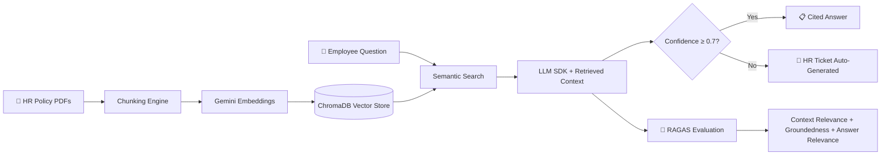

# 📋 POLICYPULSE — Complete Project Scope v1.4

## AI-Powered HR Policy RAG Chatbot for Enterprise Workforce Self-Service
## "Ask Your Policies" — Natural Language Access to Company Knowledge

**Document Version:** 1.4 (Added §Courses & Certifications reference — ordered by attendance, synced to roadmap v8.4; no functional scope changes from v1.3)  
**Last Updated:** June 16, 2026  
**Status:** 📋 DRAFT — Awaiting Approval  
**Author:** Manuel Reyes  
**Strategic Priority:** 🧠 RAG FOUNDATION PROJECT — Gateway to Stage 4 Vector DB + LangChain Skills

---

## 📋 Table of Contents

1. [Executive Summary](#1-executive-summary)
2. [Strategic Positioning](#2-strategic-positioning)
3. [Market Validation](#3-market-validation)
4. [Business Problem](#4-business-problem)
5. [Data Architecture](#5-data-architecture)
6. [Feature Framework](#6-feature-framework)
7. [Phase 1: Document Pipeline & Knowledge Base](#7-phase-1-document-pipeline--knowledge-base-weeks-1-2)
8. [Phase 2: RAG Chat Interface & Ticket Escalation](#8-phase-2-rag-chat-interface--ticket-escalation-weeks-3-4)
9. [AI Guardrails](#9-ai-guardrails)
10. [Tech Stack](#10-tech-stack)
11. [Project Structure](#11-project-structure)
12. [Sample Policy Documents Strategy](#12-sample-policy-documents-strategy)
13. [Success Metrics](#13-success-metrics)
14. [Risk Mitigation](#14-risk-mitigation)
15. [Timeline Summary](#15-timeline-summary)
16. [Project Evolution (5 Stages)](#16-project-evolution-5-stages)

---

## 1. Executive Summary

**PolicyPulse** is an AI-powered chatbot that enables employees to ask natural language questions about company policies (PTO, overtime, holidays, benefits, etc.) and receive accurate, cited answers grounded in the company's actual policy documents. When the AI cannot find the answer in the knowledge base, it automatically generates an escalation ticket routed to HR for human follow-up.

This is a **RAG (Retrieval-Augmented Generation) foundation project** — the most in-demand enterprise AI pattern in 2026. It introduces core concepts (document chunking, embeddings, semantic search, context injection) that directly prepare for Stage 4 vector database and LangChain/LangGraph skills.

### Why This Project Matters

| Factor | Why It Wins for Portfolio |
|--------|--------------------------|
| **#1 enterprise AI use case** | HR policy RAG is the most validated enterprise GenAI pattern (DoorDash, LinkedIn, Harvard all built similar) |
| **RAG gateway** | Introduces embeddings, chunking, semantic search — Stage 4 prerequisites |
| **Directly applicable** | Can be deployed at Daybright Financial for real HR policy access |
| **Simpler than AFC/ODI** | Focused scope: documents in → questions answered → tickets escalated |
| **Human-in-the-loop** | Ticket escalation shows mature AI design (not just "chatbot answers everything") |
| **Universally understood** | Every recruiter has dealt with HR policies — instant credibility |

### What Makes This Project Different

| Dimension | Typical "Chat with Docs" Tutorial | PolicyPulse |
|-----------|-----------------------------------|-------------|
| **Documents** | Random PDFs from internet | Realistic enterprise HR policies (PTO, overtime, holidays, benefits, compliance) |
| **Retrieval** | Basic string matching | Semantic search with embeddings + similarity scoring |
| **Citations** | None — "trust me" answers | Every answer cites specific policy section, paragraph, and document |
| **Confidence** | Always answers (even when wrong) | Confidence scoring + automatic HR ticket when confidence < threshold |
| **Escalation** | None — dead ends | Structured ticket generation with context for HR follow-up |
| **AI Architecture** | Single provider, raw text | Provider-agnostic SDK (Gemini/OpenAI/Claude) |
| **AI Outputs** | Unstructured text responses | Pydantic-validated structured outputs (answer, citations, confidence, ticket) |
| **Guardrails** | None | Scope validation, hallucination detection, PII prevention, disclaimer injection |
| **Observability** | None | Token usage, cost tracking, latency, retrieval quality metrics |
| **CI/CD** | None | GitHub Actions on every PR |

### Core Capabilities

- **Document Ingestion Pipeline:** PDF/Markdown/DOCX → text extraction → chunking → embeddings → searchable knowledge base
- **Semantic Search:** Embedding-based retrieval with similarity scoring to find the most relevant policy sections
- **RAG Chat Interface:** Natural language questions answered with citations to specific policy documents and sections
- **Confidence Scoring:** Every answer includes a confidence score; low-confidence answers trigger escalation
- **HR Ticket Escalation:** When the AI can't find the answer, it generates a structured ticket with the question, search context, and suggested HR contact
- **Structured Outputs:** Pydantic-validated AI responses with type-safe schemas (PolicyAnswer, Citation, EscalationTicket)
- **AI Observability:** Token usage, cost tracking, latency monitoring, retrieval quality metrics per query
- **Production Practices:** GitHub Actions CI, type hints, comprehensive testing, sample policy documents

---

## 2. Strategic Positioning

### 2.1 Roadmap Alignment (Stage 1: GenAI-First Data Analyst & AI Engineer)

This project directly delivers on **4 critical roadmap objectives**:

| Roadmap Goal | How PolicyPulse Delivers |
|-------------|--------------------------|
| "Build AI-powered dashboards and chatbots" (Stage 1 Strategy) | ✅ Streamlit chatbot with RAG pipeline |
| "LLM SDKs (Gemini, OpenAI, Claude) + LangChain basics" (Month 3-5 Skills) | ✅ Provider-agnostic SDK with **Anthropic SDK as primary** (Claude excels at RAG synthesis with prompt caching) + Gemini fallback |
| "RAG System for Documentation" (Month 30 Portfolio Target) | ✅ **Early exposure** — builds RAG intuition 25 months ahead of schedule |
| "Natural language queries" (Flagship Features) | ✅ "What's the PTO policy for employees with 5+ years?" → cited answer |

### 2.2 Portfolio Ecosystem

```
PORTFOLIO PROJECT ECOSYSTEM (Stage 1)
═══════════════════════════════════════════

1. 1099 Reconciliation Pipeline ✅ DEPLOYED
   └─ Skills: Python, Pandas, ETL, pytest, CI/CD
   └─ Impact: $15K/year savings, 95% time reduction

2. DataVault Analyst ⭐ FIRST AI PROJECT
   └─ Skills: LLM SDK, PandasAI, Streamlit, PII handling
   └─ AI Pattern: SDK-first architecture (shared across all projects)

3. PolicyPulse 🧠 RAG FOUNDATION (THIS SCOPE)
   └─ Skills: Embeddings, chunking, semantic search, RAG, ticket workflows
   └─ AI Pattern: Document → Embedding → Retrieval → Generation pipeline
   └─ NEW SKILL: Introduces RAG concepts early (Stage 4 prerequisite)

4. FormSense 📄 DOCUMENT INTELLIGENCE (NEXT)
   └─ Skills: Multimodal LLM, form extraction, validation, email automation
   └─ AI Pattern: Vision AI for financial document processing

5. Operations-Demand-Intelligence 📊 ENTERPRISE ANALYTICS
   └─ Reuses: AI layer from DataVault Analyst + RAG from PolicyPulse

6. Attention-Flow Catalyst 🚀 FLAGSHIP
   └─ Reuses: All shared AI patterns from above projects
```

### 2.3 The "30-Second Rule" Optimization

Recruiters spend <30 seconds on initial portfolio scan. This project passes that filter:

- **README hero section:** GIF showing "ask policy question → get cited answer → see ticket when unsure" in 8 seconds
- **Live demo link:** Streamlit Cloud deployment (click and try immediately)
- **Business impact:** "Reduces HR inquiry volume by routing 70%+ of policy questions to AI with cited answers"
- **Tech badges:** Python, Streamlit, Anthropic SDK, Gemini Embeddings, RAG, FastMCP, Pydantic, GitHub Actions

---

## 3. Market Validation

### 3.1 Industry Adoption

| Statistic | Source |
|-----------|--------|
| RAG for HR policy is the #1 recommended "narrow, high-value workflow" for enterprise AI | Data Nucleus (2025) |
| Companies like DoorDash built RAG chatbot with guardrails + LLM judge for support automation | Evidently AI (2025) |
| LinkedIn combined RAG with knowledge graphs for customer service Q&A | Evidently AI (2025) |
| Harvard Business School built RAG chatbot (ChatLTV) for course Q&A with citation verification | Evidently AI (2025) |
| 63% of Fortune 500 companies have implemented intelligent document processing solutions | Extend Research (2026) |
| RAG is positioned as "strategic backbone of enterprise knowledge management" in 2026 | Squirro (2026) |

### 3.2 Why RAG Over Fine-Tuning for This Use Case

| Approach | RAG (PolicyPulse) | Fine-Tuning |
|----------|-------------------|-------------|
| **Data requirement** | ~20-50 policy docs | 10,000+ Q&A pairs |
| **Update speed** | Add new doc → instant | Retrain model → hours/days |
| **Citation ability** | ✅ Natural (retrieves source) | ❌ Cannot cite sources |
| **Hallucination control** | Grounded in retrieved text | Still hallucinates |
| **Cost** | Embedding once + per-query retrieval | GPU training costs |
| **Stage 1 feasible** | ✅ Yes | ❌ Requires Stage 3-4 skills |

### 3.3 Competitive Landscape (Internal Tools)

| Solution | What It Does | What's Missing |
|----------|-------------|----------------|
| **SharePoint search** | Keyword search in documents | No semantic understanding, no natural language, no citations |
| **Confluence wiki** | Browse policy pages | Requires knowing where to look, no Q&A interface |
| **HR email inbox** | Ask HR directly | 24-48 hour response time, HR overloaded with repetitive questions |
| **Generic chatbot (ChatGPT)** | Answers from training data | No access to company-specific policies, hallucinates policy details |
| **PolicyPulse** | RAG chatbot grounded in actual company docs | ✅ Fills the gap: accurate + cited + escalation when unsure |

---

## 4. Business Problem

### 4.1 Context

In large companies like Daybright Financial, employees constantly need answers to HR policy questions: "How many PTO days do I get after 3 years?", "What's the overtime policy for salaried employees?", "Can I carry over unused vacation days?" Currently:

- **HR team overloaded:** 60-70% of HR inbox is repetitive policy questions with answers already in existing documents
- **Slow response times:** 24-48 hours for email responses to simple policy questions
- **Inconsistent answers:** Different HR reps may interpret policies differently
- **Employee frustration:** Can't find answers in dense PDF documents, don't know which document to check
- **No audit trail:** No record of what employees asked or what guidance they received

### 4.2 Solution

**PolicyPulse** provides an AI-powered chatbot where employees can:

1. **Ask questions** in natural language: *"How many sick days do I get per year?"*
2. **Get cited answers** grounded in actual company policy documents with section references
3. **See confidence levels** so they know how reliable the answer is
4. **Auto-escalate** when the AI can't find the answer — generates an HR ticket with full context
5. **Browse policies** through a searchable document library as a fallback

### 4.3 Business Questions the System Answers

| Category | Example Questions |
|----------|------------------|
| **PTO & Leave** | "How many vacation days do I get after 5 years?" |
| **Overtime** | "Am I eligible for overtime pay as a salaried employee?" |
| **Holidays** | "What are the company holidays for 2026?" |
| **Benefits** | "When is open enrollment and what are my options?" |
| **Remote Work** | "What's the policy for working from home on Fridays?" |
| **Compensation** | "How does the annual review process work?" |
| **Compliance** | "What are the rules about accepting gifts from vendors?" |
| **Onboarding** | "What's the dress code policy?" |

### 4.4 Measurable Business Impact

| Metric | Current State | With PolicyPulse | Impact |
|--------|--------------|------------------|--------|
| HR inbox volume (repetitive questions) | ~100/week | ~30/week | **70% reduction** |
| Average response time | 24-48 hours | < 5 seconds | **99%+ faster** |
| Answer consistency | Varies by HR rep | Same source document always | **100% consistent** |
| Employee self-service rate | ~20% | ~70% | **3.5x improvement** |
| HR time on repetitive questions | ~15 hrs/week | ~5 hrs/week | **$25K+/year saved** |

---

## 5. Data Architecture

### 5.1 Document Pipeline

```
DOCUMENT INGESTION PIPELINE
════════════════════════════

PDF/DOCX/MD Files           Text Extraction          Chunking              Embeddings
┌──────────────┐          ┌──────────────┐       ┌──────────────┐       ┌──────────────┐
│ pto_policy.pdf│   ──►   │  Raw Text    │  ──►  │  Chunks      │  ──►  │  Vectors     │
│ overtime.pdf  │  PyMuPDF│  + Metadata  │ RecSpl│  ~500 tokens │Gemini │  768-dim     │
│ holidays.md   │  python │  (title,     │  itter│  with overlap│Embed  │  per chunk   │
│ benefits.docx │  -docx  │   section,   │       │  + metadata  │  API  │              │
│ compliance.pdf│         │   page)      │       │              │       │              │
└──────────────┘          └──────────────┘       └──────────────┘       └──────────────┘
                                                                              │
                                                                              ▼
                                                                    ┌──────────────┐
                                                                    │ ChromaDB     │
                                                                    │ (Local       │
                                                                    │  Vector DB)  │
                                                                    └──────────────┘
```

### 5.2 RAG Query Pipeline

```
RAG QUERY PIPELINE
══════════════════

Employee Question           Embedding              Semantic Search         LLM Generation
┌──────────────┐          ┌──────────────┐       ┌──────────────┐       ┌──────────────┐
│ "How many PTO│   ──►   │  Question    │  ──►  │  Top-K       │  ──►  │  Answer +    │
│  days after  │  Gemini │  Vector      │ChromaDB│  Relevant    │Gemini │  Citations + │
│  5 years?"   │  Embed  │  (768-dim)   │  sim  │  Chunks      │  SDK  │  Confidence  │
└──────────────┘          └──────────────┘  srch └──────────────┘       └──────────────┘
                                                                              │
                                                       ┌──────────────────────┤
                                                       │                      │
                                                       ▼                      ▼
                                              Confidence ≥ 0.7?      Confidence < 0.7?
                                              ┌──────────────┐       ┌──────────────┐
                                              │ ✅ Display    │       │ 🎫 Generate  │
                                              │ Answer with  │       │ HR Escalation│
                                              │ Citations    │       │ Ticket       │
                                              └──────────────┘       └──────────────┘
```

### 5.3 Pydantic Schemas (Structured Outputs)

```python
class Citation(BaseModel):
    """Source reference for an AI answer."""
    document_name: str          # "pto_policy.pdf"
    section_title: str          # "Section 3.2: Accrual Rates"
    page_number: int | None     # 5
    relevance_score: float      # 0.89
    excerpt: str                # "Employees with 5+ years accrue 20 days..."

class PolicyAnswer(BaseModel):
    """Structured response from RAG pipeline."""
    question: str               # Original question
    answer: str                 # Generated answer text
    citations: list[Citation]   # Source references (1-5)
    confidence: float           # 0.0-1.0 (aggregated from retrieval scores)
    category: str               # "PTO", "Overtime", "Benefits", etc.
    disclaimer: str             # Always present

class EscalationTicket(BaseModel):
    """HR ticket generated when AI confidence is below threshold."""
    ticket_id: str              # "PP-2026-00123"
    question: str               # Original question
    search_context: str         # What the AI found (partial matches)
    confidence: float           # Why it escalated (score < 0.7)
    suggested_category: str     # Best-guess routing
    suggested_contact: str      # HR contact for this category
    created_at: datetime        # Timestamp
    status: str                 # "open" | "pending" | "resolved"

class RetrievalResult(BaseModel):
    """Single chunk retrieved from vector search."""
    chunk_id: str
    document_name: str
    section_title: str
    content: str
    similarity_score: float
    metadata: dict

class QueryMetrics(BaseModel):
    """Observability data per query."""
    query_id: str
    embedding_latency_ms: float
    retrieval_latency_ms: float
    generation_latency_ms: float
    total_latency_ms: float
    tokens_used: int
    estimated_cost_usd: float
    chunks_retrieved: int
    top_similarity_score: float
    confidence_score: float
    escalated: bool
```

### 5.4 Document Metadata Schema

```yaml
# config/documents.yaml
documents:
  - name: "Paid Time Off Policy"
    filename: "pto_policy.pdf"
    category: "Leave & PTO"
    effective_date: "2026-01-01"
    version: "3.2"
    hr_contact: "benefits@company.com"
    
  - name: "Overtime & Compensation Policy"
    filename: "overtime_policy.pdf"
    category: "Compensation"
    effective_date: "2025-07-01"
    version: "2.0"
    hr_contact: "payroll@company.com"
    
  - name: "Company Holidays 2026"
    filename: "holidays_2026.md"
    category: "Holidays"
    effective_date: "2026-01-01"
    version: "1.0"
    hr_contact: "hr@company.com"

  - name: "Employee Benefits Guide"
    filename: "benefits_guide.pdf"
    category: "Benefits"
    effective_date: "2026-01-01"
    version: "4.1"
    hr_contact: "benefits@company.com"

  - name: "Remote Work Policy"
    filename: "remote_work_policy.pdf"
    category: "Workplace"
    effective_date: "2025-09-01"
    version: "2.0"
    hr_contact: "hr@company.com"

  - name: "Code of Conduct & Compliance"
    filename: "compliance_policy.pdf"
    category: "Compliance"
    effective_date: "2025-01-01"
    version: "5.0"
    hr_contact: "compliance@company.com"

chunking:
  strategy: "recursive_character"
  chunk_size: 500           # tokens
  chunk_overlap: 50         # tokens overlap between chunks
  separators:
    - "\n## "               # H2 headers (primary split)
    - "\n### "              # H3 headers
    - "\n\n"                # Paragraph breaks
    - "\n"                  # Line breaks
    - ". "                  # Sentences (last resort)

embedding:
  model: "models/text-embedding-004"  # Gemini Embedding
  dimensions: 768
  batch_size: 100

retrieval:
  top_k: 5                 # chunks to retrieve per query
  similarity_threshold: 0.5 # minimum score to include
  confidence_threshold: 0.7 # below this → escalate to HR
```

---

## 6. Feature Framework

### 6.1 Pre-Built Features (No AI Required)

| ID | Feature | Description |
|----|---------|-------------|
| **PP01** | Policy Library | Browse all available policy documents with search |
| **PP02** | Category Browser | Filter policies by category (PTO, Benefits, Compliance, etc.) |
| **PP03** | Document Viewer | Read full policy documents within the app |
| **PP04** | Recent Updates | Show recently updated policies with change highlights |
| **PP05** | FAQ Dashboard | Display most frequently asked questions with cached answers |

### 6.2 AI-Powered Features

| ID | Feature | Description |
|----|---------|-------------|
| **AI01** | RAG Policy Q&A | Ask any question → get cited answer from policy documents |
| **AI02** | Confidence Scoring | Every answer rated 0.0-1.0 with visual indicator |
| **AI03** | Citation Display | Show exact document, section, and page for each answer |
| **AI04** | Auto-Escalation | Generate HR ticket when confidence < 0.7 |
| **AI05** | Conversation Memory | Session-based memory for follow-up questions |
| **AI06** | Smart Suggestions | After answering, suggest related policy questions |

### 6.3 Dashboard Pages

| Page | Content | AI Required? |
|------|---------|-------------|
| **📚 Policy Library** | Browse/search all documents, view metadata | No |
| **💬 Ask PolicyPulse** | RAG chat interface with citations | Yes |
| **🎫 Escalation Tickets** | View generated tickets, status tracking | No |
| **📊 Usage Analytics** | Query volume, top categories, escalation rate | No |

---

## 7. Phase 1: Document Pipeline & Knowledge Base (Weeks 1-2)

### Week 1: Document Ingestion + Vector Store

**Tasks:**
- Set up project structure (matching established pattern: src/, config/, tests/, app/)
- Implement document extraction (PyMuPDF for PDF, python-docx for DOCX, markdown for MD)
- Build chunking engine (RecursiveCharacterTextSplitter with configurable overlap)
- Implement Gemini Embedding API client (provider-agnostic abstraction)
- Set up ChromaDB local vector store with persistent storage
- Create document metadata management (documents.yaml config)
- Write ingestion pipeline: extract → chunk → embed → store
- Build sample policy documents (see Section 12)
- Set up GitHub Actions CI (lint, type-check, pytest)

**Deliverables:**
- ✅ 6+ sample policy documents ingested
- ✅ ~100-200 chunks stored in ChromaDB with embeddings
- ✅ Metadata (document name, section, page) preserved per chunk
- ✅ CI pipeline green

### Week 2: Retrieval Engine + Policy Library

**Tasks:**
- Build semantic search function (query → embed → top-K retrieval)
- Implement similarity scoring and relevance filtering
- Build retrieval quality testing (known Q&A pairs → expected chunks)
- Create Streamlit Policy Library page (browse, search, view documents)
- Create FAQ Dashboard page with pre-seeded common questions
- Implement document viewer component

**Deliverables:**
- ✅ Semantic search returning relevant chunks for test queries
- ✅ Policy Library and FAQ Dashboard pages working
- ✅ Retrieval accuracy > 80% on test Q&A set
- ✅ Test coverage > 80%

---

## 8. Phase 2: RAG Chat Interface & Ticket Escalation (Weeks 3-4)

### Week 3: RAG Generation + Structured Outputs

**Tasks:**
- Build RAG generation pipeline: retrieval → context injection → LLM generation
- Implement provider-agnostic LLM abstraction (same pattern as DVA/AFC/ODI)
- Create Pydantic structured output schemas (PolicyAnswer, Citation, EscalationTicket)
- Build confidence scoring algorithm (weighted average of retrieval similarity scores)
- Implement citation extraction (map answer claims to source chunks)
- Build AI guardrails (see Section 9)
- Create "Ask PolicyPulse" chat page with citation display
- Implement session-based conversation memory for follow-up questions

**Deliverables:**
- ✅ RAG pipeline answering questions with cited sources
- ✅ 100% Pydantic-validated structured outputs
- ✅ Confidence scores displayed per answer
- ✅ Chat interface with conversation history

### Week 4: Escalation + Deploy + Polish

**Tasks:**
- Build escalation ticket generator (when confidence < 0.7)
- Create Escalation Tickets page (view, search, export)
- Build Usage Analytics page (query volume, categories, escalation rate)
- Implement AI observability (token/cost/latency per query)
- Add smart suggestions feature (related questions after answer)
- **Build FastMCP server** (~50 LOC) exposing retrieval as MCP tools — `query_policies(question)` + `list_policy_documents()` — testable from Cursor/Claude Desktop
- Deploy to Streamlit Cloud (FREE)
- Create README with demo GIF, architecture diagram
- Record 3-5 minute demo video

**Deliverables:**
- ✅ Escalation tickets generating for low-confidence answers
- ✅ All 4 dashboard pages rendering
- ✅ AI observability logging
- ✅ **FastMCP server running locally** — `mcp_server/server.py` connects to ChromaDB, exposes 2 tools, demonstrable in Cursor settings → MCP servers
- ✅ Deployed to Streamlit Cloud
- ✅ README with GIF, live demo link

---

## 9. AI Guardrails

### 9.1 Guardrail Framework

| ID | Guardrail | Implementation |
|----|-----------|----------------|
| **G01** | Scope Validation | Reject questions outside HR policy domain (e.g., "What's the stock price?") |
| **G02** | Hallucination Prevention | If no relevant chunks found (all scores < 0.5), refuse to answer + escalate |
| **G03** | Confidence Threshold | Answers with confidence < 0.7 auto-escalate to HR |
| **G04** | PII Prevention | Scan AI responses for PII patterns (SSN, phone, email) before display |
| **G05** | Disclaimer Injection | Every AI answer includes: "This is AI-generated guidance. For official interpretation, contact HR." |
| **G06** | Source Grounding | AI prompt explicitly instructs: "Only answer based on provided context. If the context doesn't contain the answer, say so." |
| **G07** | Read-Only Access | No write operations — AI cannot modify documents or policies |
| **G08** | Token Budget | Max 2,000 tokens per response to control costs |

### 9.2 Guardrail Testing Strategy

```python
# tests/test_ai_guardrails.py

def test_scope_validation_rejects_off_topic():
    """G01: Off-topic questions should be rejected."""
    result = guardrails.validate_scope("What's the weather today?")
    assert result.is_valid is False
    assert "outside HR policy scope" in result.reason

def test_hallucination_prevention_escalates_when_no_context():
    """G02: No relevant chunks → escalate, don't fabricate."""
    result = rag_pipeline.query("What's the policy on space travel?")
    assert result.confidence < 0.5
    assert result.escalated is True

def test_confidence_threshold_triggers_escalation():
    """G03: Low confidence → auto-escalate."""
    result = rag_pipeline.query("edge case ambiguous question")
    if result.confidence < 0.7:
        assert result.escalation_ticket is not None

def test_pii_prevention_blocks_ssn_in_response():
    """G04: PII should never appear in AI responses."""
    response = guardrails.scan_response("Your SSN 123-45-6789 shows...")
    assert "123-45-6789" not in response.cleaned_text

def test_disclaimer_always_present():
    """G05: Every answer must include disclaimer."""
    result = rag_pipeline.query("How many PTO days do I get?")
    assert "AI-generated" in result.answer.disclaimer

def test_source_grounding_refuses_without_context():
    """G06: AI should not answer without supporting context."""
    # Question with no matching policy docs
    result = rag_pipeline.query("What is the meaning of life?")
    assert result.escalated is True
```

---

## 10. Tech Stack

### 10.1 Core Stack

| Component | Technology | Why |
|-----------|------------|-----|
| **Language** | Python 3.11+ | Primary language, matches all portfolio projects |
| **Dashboard** | Streamlit | Consistent with DVA, ODI, AFC, StreamSmart |
| **LLM SDK (Generation)** | **Anthropic SDK (primary)**, Gemini (fallback), OpenAI (alternative) | Claude excels at RAG synthesis; prompt caching reduces costs ~90% on repeated context |
| **Embeddings** | Gemini Text Embedding API | Free tier, 768-dim, high quality |
| **Vector Store** | ChromaDB (local) | Lightweight, no server needed, Python-native, Stage 1 appropriate |
| **MCP Server** | FastMCP (Python) | Exposes retrieval tools to Cursor/Claude Desktop — 2026 hiring keyword |
| **PDF Extraction** | PyMuPDF (fitz) | Fast, reliable, preserves structure |
| **DOCX Extraction** | python-docx | Native Python DOCX reader |
| **Data Validation** | Pydantic v2 | Structured outputs, consistent with all projects |
| **Charts** | Plotly | Interactive analytics, consistent with all projects |
| **Config** | YAML (PyYAML) | Human-readable config, consistent pattern |
| **CI/CD** | GitHub Actions | Lint (ruff), type-check (mypy), test (pytest) |
| **Deployment** | Streamlit Cloud (FREE) | Zero-cost hosting for demo |

### 10.2 AI Architecture (Provider-Agnostic)

```python
# src/ai/provider.py — Same pattern as DVA, AFC, ODI, StreamSmart

class LLMProvider:
    """Provider-agnostic LLM abstraction."""
    
    def generate(self, prompt: str, context: list[str], schema: type[BaseModel]) -> BaseModel:
        """Generate structured response from RAG context."""
        ...
    
    def embed(self, text: str | list[str]) -> list[list[float]]:
        """Generate embeddings for text(s)."""
        ...

# config/ai_config.yaml
ai:
  provider: "anthropic"           # or "gemini", "openai" — Anthropic primary for RAG synthesis
  generation_model: "claude-sonnet-4-6"
  embedding_model: "models/text-embedding-004"
  temperature: 0.1                # Low for factual policy answers
  max_tokens: 2000
  fallback_provider: "gemini"
```

### 10.3 MCP Server (2026 Differentiator) ⭐ NEW v8.3

**Why MCP Matters in 2026:**

The Model Context Protocol (MCP), originally created by Anthropic and donated to the Linux Foundation Agentic AI Foundation in December 2025, is the de facto 2026 standard for agent ↔ tool integration. As of early 2026, the MCP ecosystem has surpassed 97 million monthly SDK downloads with 200+ server implementations across GitHub, Slack, Postgres, Notion, Jira, and Salesforce. PolicyPulse exposing its retrieval as an MCP server means Cursor, Claude Desktop, and any MCP-compatible client can query the HR knowledge base directly — turning the project from "another RAG demo" into "production-ready agent infrastructure."

**What Gets Exposed (2 tools, ~50 LOC total):**

| Tool | Signature | What It Does |
|------|-----------|--------------|
| `query_policies` | `(question: str, top_k: int = 5) -> PolicyAnswer` | Retrieve relevant chunks + return answer with citations |
| `list_policy_documents` | `() -> list[PolicyDocument]` | Return registered policy documents with metadata (title, last_updated, sections) |

**FastMCP Server Implementation:**

```python
# mcp_server/server.py
from fastmcp import FastMCP
from src.retrieval.search import semantic_search
from src.ai.rag_pipeline import answer_question
from src.ingestion.extractor import list_documents

mcp = FastMCP("policypulse")

@mcp.tool()
def query_policies(question: str, top_k: int = 5) -> dict:
    """Query HR policy knowledge base. Returns answer + citations + confidence."""
    result = answer_question(question, top_k=top_k)
    return {
        "answer": result.answer,
        "citations": [c.model_dump() for c in result.citations],
        "confidence": result.confidence,
        "escalated": result.escalated,
    }

@mcp.tool()
def list_policy_documents() -> list[dict]:
    """List all registered HR policy documents with metadata."""
    return [doc.model_dump() for doc in list_documents()]

if __name__ == "__main__":
    mcp.run()
```

**Cursor / Claude Desktop Integration:**

```json
// Cursor settings.json or Claude Desktop config
{
  "mcpServers": {
    "policypulse": {
      "command": "python",
      "args": ["-m", "mcp_server.server"],
      "cwd": "/absolute/path/to/policypulse"
    }
  }
}
```

**Testing Approach:**
- `tests/test_mcp_server.py` — unit tests for each tool function (uses test ChromaDB fixture from conftest)
- Manual integration test: launch Cursor → verify `policypulse` appears in MCP servers list → ask Cursor "what's our PTO policy?" → confirm tool invocation
- Document the integration with screenshots in `mcp_server/README.md` (recruiter-facing artifact)

**Resume Signal:**
"Exposed retrieval pipeline as a FastMCP server, enabling LLM-native clients (Cursor, Claude Desktop) to query the knowledge base via the Model Context Protocol — the 2026 industry standard for agent-tool integration."

---

## 11. Project Structure

```
policypulse/
├── .cursor/
│   ├── rules/                    # Production standards (version-controlled)
│   │   ├── git-workflow.mdc      # alwaysApply: true — branch, commit, PR conventions
│   │   ├── learning-mode.mdc     # alwaysApply: true — learning patterns, skill progression
│   │   ├── python-production-standards.mdc  # alwaysApply: true — code style, types, testing
│   │   ├── streamlit-patterns.mdc    # Auto-attached: app/**/*.py
│   │   ├── ai-sdk-patterns.mdc       # Auto-attached: src/ai/**/*.py
│   │   └── evaluation.mdc           # Auto-attached: tests/test_eval.py
│   ├── commands/                 # Repeatable agent workflows (/command-name)
│   │   ├── draft-issue.md        # /draft-issue <goal>
│   │   ├── task-brief.md         # /task-brief <issue#>
│   │   ├── pr-prep.md            # /pr-prep
│   │   ├── review.md             # /review
│   │   ├── test.md               # /test
│   │   ├── eval.md               # /eval
│   │   └── commit-msg.md         # /commit-msg
│   ├── hooks/                    # Auto-run scripts
│   │   └── format.sh             # Auto-format (black + ruff) after agent edits
│   ├── hooks.json                # Hook configuration
│   └── plans/                    # Saved task briefs per Issue
│       └── issue-XX-task-brief.md
├── .cursorignore                 # Excludes data/logs/venv from Cursor indexing
├── .github/
│   ├── templates/                # Production workflow templates
│   │   ├── issue_template.md     # GitHub Issue format
│   │   ├── project_labels.md     # Approved labels + definitions
│   │   ├── pull_request_template.md  # PR body format
│   │   └── cursor_task_brief.md  # Agent execution contract
│   └── workflows/ci.yml
├── config/
│   ├── ai_config.yaml            # LLM + embedding settings
│   ├── documents.yaml            # Policy document registry
│   └── logging.yaml              # Logging configuration
├── data/
│   ├── policies/                 # Source policy documents (PDF/MD/DOCX)
│   │   ├── pto_policy.pdf
│   │   ├── overtime_policy.pdf
│   │   ├── holidays_2026.md
│   │   ├── benefits_guide.pdf
│   │   ├── remote_work_policy.pdf
│   │   └── compliance_policy.pdf
│   ├── vectorstore/              # ChromaDB persistent storage
│   └── tickets/                  # Generated escalation tickets (JSON)
├── logs/
│   ├── app/                      # Dashboard logs
│   ├── pipeline/                 # Ingestion pipeline logs
│   ├── ai/                       # AI observability logs
│   │   ├── queries.log           # LLM queries, tokens, cost, latency
│   │   ├── retrieval.log         # Retrieval scores, chunks returned
│   │   └── guardrails.log        # Guardrail activations
│   ├── evaluation/               # ⭐ DeepEval RAG evaluation results
│   └── errors.log
├── src/
│   ├── __init__.py
│   ├── py.typed                  # PEP 561 — type hint support marker
│   ├── ingestion/
│   │   ├── __init__.py
│   │   ├── extractor.py          # PDF/DOCX/MD text extraction
│   │   ├── chunker.py            # Text chunking with overlap
│   │   └── embedder.py           # Embedding generation
│   ├── retrieval/
│   │   ├── __init__.py
│   │   ├── vectorstore.py        # ChromaDB operations
│   │   └── search.py             # Semantic search + scoring
│   ├── ai/
│   │   ├── __init__.py
│   │   ├── provider.py           # Provider-agnostic LLM abstraction
│   │   ├── schemas.py            # Pydantic response models
│   │   ├── rag_pipeline.py       # Retrieval → Context → Generation
│   │   ├── guardrails.py         # Governance as code (testable)
│   │   └── observability.py      # Token/cost/latency tracking
│   ├── tickets/
│   │   ├── __init__.py
│   │   └── escalation.py         # Ticket generation + management
│   └── utils/
│       ├── __init__.py
│       ├── config.py
│       └── logging.py
├── mcp_server/                  # ⭐ v8.3 — FastMCP server (2026 differentiator)
│   ├── __init__.py
│   ├── server.py                # FastMCP server entry point (~50 LOC)
│   ├── tools.py                 # MCP tool definitions (query_policies, list_documents)
│   └── README.md                # MCP server setup + Cursor/Claude Desktop integration
├── app/
│   ├── Home.py                   # Streamlit main page
│   ├── pages/
│   │   ├── 1_📚_Policy_Library.py
│   │   ├── 2_💬_Ask_PolicyPulse.py
│   │   ├── 3_🎫_Escalation_Tickets.py
│   │   └── 4_📊_Usage_Analytics.py
│   ├── components/
│   │   ├── citation_card.py      # Citation display component
│   │   ├── confidence_badge.py   # Confidence score visual
│   │   └── ticket_card.py        # Escalation ticket component
│   └── utils/
│       └── session.py            # Session state management
├── tests/
│   ├── conftest.py               # Shared fixtures, mock embeddings, test ChromaDB
│   ├── test_extractor.py
│   ├── test_chunker.py
│   ├── test_retrieval.py
│   ├── test_rag_pipeline.py
│   ├── test_escalation.py
│   ├── test_ai_guardrails.py
│   ├── test_schemas.py
│   ├── test_eval.py              # ⭐ DeepEval RAG evaluation tests (faithfulness, precision, recall)
│   └── eval_dataset.json         # 30+ question-answer pairs for evaluation
├── scripts/
│   ├── ingest_policies.py        # One-time ingestion script
│   └── generate_sample_policies.py
├── notebooks/
│   └── retrieval_quality.ipynb   # Retrieval accuracy analysis
├── Dockerfile                    # Container definition
├── docker-compose.yml            # Multi-service: Streamlit + ChromaDB
├── .dockerignore                 # Excludes .git, logs, tests, notebooks from image
├── .env.example                  # Required environment variables template
├── .gitignore
├── CONTRIBUTING.md               # Branch naming, commit style, PR process
├── LICENSE                       # MIT License
├── Makefile                      # make test, make lint, make eval, make docker-build
├── pyproject.toml                # Project metadata, dependencies, tool config (PEP 621)
└── README.md
```

---

## 12. Sample Policy Documents Strategy

### 12.1 Why Sample Documents (Not Real Ones)

| Aspect | Benefit |
|--------|---------|
| **Privacy compliance** | Zero risk of real company policies on GitHub |
| **Demonstrates skill** | Shows ability to design realistic enterprise documents |
| **Full demo experience** | Realistic policies let demo mode showcase complete RAG pipeline |
| **Recruiter-friendly** | Anyone can try the demo without needing company docs |
| **Reproducible** | Consistent demo experience across all viewers |

### 12.2 Sample Policy Documents to Create

| Document | Pages | Sections | Key Content |
|----------|-------|----------|-------------|
| **PTO Policy** | 4 | 8 | Accrual rates by tenure, carryover limits, blackout dates, approval process |
| **Overtime Policy** | 3 | 6 | Exempt vs non-exempt, overtime rates, pre-approval requirements |
| **Holiday Schedule 2026** | 1 | 2 | Federal holidays, floating holidays, holiday pay rules |
| **Benefits Guide** | 6 | 12 | Health insurance, 401(k), dental, vision, open enrollment, life insurance |
| **Remote Work Policy** | 3 | 7 | Eligibility, equipment, schedules, expectations, VPN requirements |
| **Code of Conduct** | 5 | 10 | Ethics, conflicts of interest, gifts policy, reporting, consequences |

**Total:** ~22 pages → ~100-200 chunks → ~150 embeddings

### 12.3 Document Design Principles

- Written to mimic real enterprise HR documents (formal tone, section numbering, effective dates)
- Include deliberate edge cases for testing: overlapping policies, exceptions, "see section X" cross-references
- Include tables and lists that challenge chunking (benefits tiers, PTO accrual schedules)
- Version dates included so the system can identify most-current policy

---

## 13. Success Metrics

### Phase 1 (Pipeline + Knowledge Base)

| Metric | Target |
|--------|--------|
| Documents ingested | 6+ sample policies |
| Chunks created | 100-200 with metadata |
| Embeddings stored | All chunks in ChromaDB |
| Retrieval accuracy | >80% on 20+ test Q&A pairs |
| Policy Library page | Working with search |
| Test coverage | >80% |
| CI pipeline | Green |

### Phase 2 (RAG Chat + Escalation)

| Metric | Target |
|--------|--------|
| RAG answers with citations | ✅ Working for all test questions |
| Structured outputs | 100% Pydantic-validated |
| Confidence scoring | Displayed on every answer |
| Escalation tickets | Generated when confidence < 0.7 |
| Provider switching | Gemini ↔ OpenAI works via config |
| AI observability | Token/cost/latency logged per query |
| Guardrail test coverage | >90% |
| All 4 pages working | ✅ |
| Deployment | Live on Streamlit Cloud |
| Demo GIF | In README |


### RAG Evaluation Metrics (DeepEval + RAGAS)

| Metric | Target | Why |
|--------|--------|-----|
| RAG Faithfulness | > 0.85 | Answers grounded in policy docs, no hallucination |
| Contextual Precision | > 0.75 | Relevant chunks ranked higher in retrieval |
| Contextual Recall | > 0.80 | Retrieval covers all aspects of expected answer |
| Answer Relevancy | > 0.80 | AI response addresses the user's question |
| Hallucination Rate | < 0.10 | Critical for HR policy accuracy |
| **SelfCheckGPT Score** | > 0.80 | Consistency-based hallucination detection — sample N=5 responses, score divergence; works without external KB (catches subtle fabrications DeepEval misses) |
| DeepEval test suite | ✅ All green | 30+ eval test cases passing |
| Dockerfile + Compose | ✅ Running | Streamlit + ChromaDB containerized |

### Portfolio Impact

| Platform | Goal |
|----------|------|
| GitHub | Professional README with GIF, live demo link, architecture diagram |
| LinkedIn | Project launch post: "Built a RAG chatbot that answers HR policy questions with citations" |
| Streamlit Cloud | Live public demo with sample policies |
| Resume | "Built RAG-based policy chatbot with citation verification and automated HR ticket escalation" |

---

## 14. Risk Mitigation

| Risk | Mitigation |
|------|------------|
| **Chunking splits important context** | Overlapping chunks (50 tokens) + section-aware splitting |
| **Irrelevant chunks retrieved** | Similarity threshold filtering (< 0.5 excluded) + top-K limit |
| **AI hallucinates policy details** | Source grounding prompt + confidence scoring + escalation fallback |
| **Embedding API limits** | Batch embedding during ingestion (one-time cost), cache queries |
| **ChromaDB performance** | Lightweight for 200 chunks; upgrade path to Pinecone/Weaviate in Stage 4 |
| **Provider lock-in** | Provider-agnostic abstraction layer (swap via config) |
| **AI cost overruns** | Token budget per response (2,000 max), caching frequent queries |

---


### Evaluation-Driven RAG Development (2026 Differentiator)

PolicyPulse implements evaluation-driven development — measuring retrieval
and generation quality at every iteration.

**Evaluation Dataset:**
- 30+ question-answer pairs covering all 6 policy documents
- Each test case includes: question, expected_answer, expected_source_doc
- Stored in `tests/eval_dataset.json`

**Evaluation Pipeline:**
1. Load eval dataset from `tests/eval_dataset.json`
2. Run each question through RAG pipeline
3. Measure with DeepEval: faithfulness, contextual precision/recall, answer relevancy
4. Log results to `logs/evaluation/`
5. Compare across iterations (chunking strategy A vs B, embedding model X vs Y)

**Example DeepEval Test:**
```python
# tests/test_eval.py
from deepeval import evaluate
from deepeval.metrics import (
    FaithfulnessMetric, 
    ContextualPrecisionMetric, 
    AnswerRelevancyMetric
)
from deepeval.test_case import LLMTestCase

def test_rag_faithfulness():
    """Verify RAG answers are grounded in policy documents."""
    test_case = LLMTestCase(
        input="What is the PTO policy for employees with 5+ years?",
        actual_output=rag_pipeline.query("What is the PTO policy for employees with 5+ years?"),
        retrieval_context=rag_pipeline.get_retrieved_chunks("What is the PTO policy for employees with 5+ years?")
    )
    metric = FaithfulnessMetric(threshold=0.85)
    metric.measure(test_case)
    assert metric.score >= 0.85, f"Faithfulness too low: {metric.score}"
```

**Why This Matters:**
This is the single most differentiating aspect of the project.
Most portfolios show "I built a RAG chatbot."
PolicyPulse shows "I built, MEASURED, and ITERATED on a RAG chatbot."

### Docker Support (Containerization)

**docker-compose.yml** for multi-service deployment (Streamlit + ChromaDB):

```yaml
# docker-compose.yml
version: "3.8"
services:
  app:
    build: .
    ports:
      - "8501:8501"
    volumes:
      - ./data:/app/data
      - chroma_data:/app/chroma_db
    env_file:
      - .env
    depends_on:
      - chromadb

  chromadb:
    image: chromadb/chroma:latest
    ports:
      - "8000:8000"
    volumes:
      - chroma_data:/chroma/chroma

volumes:
  chroma_data:
```

```dockerfile
# Dockerfile
FROM python:3.11-slim
WORKDIR /app
COPY pyproject.toml .
RUN pip install --no-cache-dir .
COPY . .
EXPOSE 8501
CMD ["streamlit", "run", "app/Home.py", "--server.port=8501"]
```

**`.dockerignore`** (keeps image small and secure):
```
.git
.gitignore
.github/
.cursor/
.env
.env.example
*.md
LICENSE
CONTRIBUTING.md
Makefile
tests/
notebooks/
logs/
__pycache__/
*.pyc
.pytest_cache/
.venv/
```

**Run locally:**
```bash
docker-compose up --build
```


---

## 15. Timeline Summary

```
Week 1 ──────── Week 2 ──────── Week 3 ──────── Week 4
  │                │                │                │
  ▼                ▼                ▼                ▼
Setup            Retrieval        RAG Pipeline     Deploy
Ingestion        Engine           LLM SDK          Polish
Chunking         Search           Structured       Demo
Embeddings       Policy Library   Outputs          README
ChromaDB         FAQ Page         Guardrails       Video
Tests            Quality Tests    Chat Page
                                  Escalation

├──── Phase 1: Pipeline ────┼──── Phase 2: RAG Chat ────┤
     + Knowledge Base              + Ticket Escalation
```

### Key Milestones

| Week | Milestone |
|------|-----------|
| **Week 1** | ✅ 6 policy documents ingested, 100+ chunks in ChromaDB, CI green |
| **Week 2** | ✅ Semantic search working, Policy Library page rendering, >80% retrieval accuracy |
| **Week 3** | ✅ RAG chat answering questions with citations, escalation tickets generating |
| **Week 4** | ✅ Deployed to Streamlit Cloud, README with GIF, demo recorded |

---

## 16. Project Evolution (5 Stages)

| Stage | Role | PolicyPulse Enhancements |
|-------|------|--------------------------|
| **1** | Data Analyst | ✅ RAG chatbot + ChromaDB + Streamlit (THIS SCOPE) |
| **2** | Data Engineer | AWS S3 document storage, PostgreSQL ticket tracking, scheduled re-ingestion |
| **3** | ML Engineer | Fine-tuned embedding model for HR domain, re-ranking model for better retrieval |
| **4** | LLM Specialist | LangChain/LangGraph orchestration (**evaluator-optimizer pattern**: retriever → verifier → responder loop), Pinecone vector DB migration, voice interface, **MCP server expanded** with policy update + ticket creation tools |
| **5** | Senior LLM | Production SaaS: multi-tenant, RBAC, Slack/Teams integration, LLMOps evaluation pipeline, A/B testing retrieval strategies, **A2A protocol** for HR-Agent ↔ IT-Agent ↔ Payroll-Agent collaboration in cross-functional employee questions |

---

## ✅ Approval Checklist

- [ ] RAG architecture correctly scoped (document → chunk → embed → retrieve → generate)
- [ ] Pydantic schemas defined (PolicyAnswer, Citation, EscalationTicket, QueryMetrics)
- [ ] Sample policy documents strategy approved (6 realistic HR policies)
- [ ] Escalation workflow defined (confidence < 0.7 → generate ticket)
- [ ] AI guardrails comprehensive (8 guardrails with test strategy)
- [ ] ChromaDB appropriate for Stage 1 (upgrade path to Pinecone in Stage 4)
- [ ] **FastMCP server scoped (~50 LOC, 2 tools exposed)**
- [ ] **Anthropic SDK as primary provider confirmed (Gemini fallback via config)**
- [ ] **SelfCheckGPT integrated alongside DeepEval RAG metrics**
- [ ] AI architecture aligned with DVA, AFC, ODI, StreamSmart (same SDK patterns)
- [ ] Timeline realistic (4 weeks at 25 hrs/week)

---

## Quick Reference

```
┌─────────────────────────────────────────────────────────────────┐
│            POLICYPULSE v1.0                                     │
│     🧠 RAG FOUNDATION — Gateway to Stage 4 Skills              │
│     AI-Powered HR Policy Chatbot with Ticket Escalation         │
├─────────────────────────────────────────────────────────────────┤
│  📚 DOCUMENT PIPELINE                                           │
│     • PDF/DOCX/MD → text extraction → chunking → embeddings    │
│     • ChromaDB local vector store (persistent)                  │
│     • 6 sample HR policy documents (realistic enterprise)       │
│     • Section-aware chunking with 50-token overlap              │
├─────────────────────────────────────────────────────────────────┤
│  🔍 RAG ENGINE                                                  │
│     • Semantic search with Gemini Embeddings (768-dim)          │
│     • Top-K retrieval with similarity scoring                   │
│     • Context injection → LLM generation → cited answer         │
│     • Confidence scoring per answer                             │
├─────────────────────────────────────────────────────────────────┤
│  🎫 ESCALATION SYSTEM                                           │
│     • Auto-escalate when confidence < 0.7                       │
│     • Structured ticket: question + context + suggested contact │
│     • Ticket tracking dashboard                                 │
├─────────────────────────────────────────────────────────────────┤
│  🤖 AI FEATURES (2026 Production Patterns)                      │
│     • LLM SDK (Anthropic Claude primary, Gemini/OpenAI fallback)│
│     • Provider-agnostic abstraction layer                       │
│     • FastMCP server (Cursor/Claude Desktop integration)        │
│     • Pydantic-validated structured outputs                     │
│     • 8 guardrails (scope, hallucination, PII, grounding)       │
│     • SelfCheckGPT consistency-based hallucination eval         │
│     • AI observability (tokens, cost, latency per query)        │
│     • Session-based conversation memory                         │
├─────────────────────────────────────────────────────────────────┤
│  🔧 ENGINEERING                                                 │
│     • Python logging for debugging + AI observability           │
│     • GitHub Actions CI                                         │
│     • ChromaDB persistent storage                               │
│     • Streamlit Cloud deployment (FREE)                         │
│     • Test coverage >80%                                        │
├─────────────────────────────────────────────────────────────────┤
│  ⏱️ TIMELINE                                                    │
│     • 4 weeks total (25 hrs/week)                               │
│     • Phase 1: Pipeline + Knowledge Base (Weeks 1-2)            │
│     • Phase 2: RAG Chat + Escalation (Weeks 3-4)               │
├─────────────────────────────────────────────────────────────────┤
│  🎯 PORTFOLIO STRATEGY                                          │
│     • RAG foundation project (Stage 4 prerequisite)             │
│     • Introduces embeddings, chunking, semantic search early    │
│     • Reusable RAG patterns for all future projects             │
│     • Live demo on Streamlit Cloud for recruiter access         │
│     • README with GIF demo (30-second recruiter test)           │
└─────────────────────────────────────────────────────────────────┘
```

---


## Production README Standard

> **v8.2 Cross-Project Standard:** Every project README must include these elements to meet production-grade portfolio quality.

| Element | Description | Format |
|---------|-------------|--------|
| **Mermaid Architecture Diagram** | System flow rendered inline on GitHub — no external images needed | ```` ```mermaid ```` code block |
| **Dockerfile** | Containerized local setup for reproducibility | `Dockerfile` in project root |
| **Evaluation Metrics Table** | DeepEval + pytest results summary showing AI quality measurements | Markdown table in README |
| **Demo GIF** | 15-30 second walkthrough of key functionality | Embedded GIF in README hero section |
| **"What I Learned" Section** | Key technical takeaways, patterns discovered, and challenges overcome | README section before footer |

### Architecture Diagram (Mermaid)



> **Why Mermaid?** Renders directly in GitHub README — no PNG files to maintain, stays in sync with code, signals architectural thinking to recruiters. Recruiters see the diagram without clicking external links.

---

**Document Status:** 📋 DRAFT (v1.2 — SDK-First AI Architecture + pyproject.toml + 2026 Production Patterns)  
**Date:** April 03, 2026  
**Total Timeline:** 4 weeks  
**Strategic Role:** RAG Foundation Project — Gateway to Stage 4 Vector DB + LangChain Skills

*"Document ingestion + Semantic search + RAG generation + Citation verification + Ticket escalation = Enterprise-grade AI policy assistant that HR teams actually trust"* 🚀
---

## 📚 Courses & Certifications (take in this order)

*Quick reference, synced with roadmap v8.4. Same course names as the roadmap; listed top-to-bottom in the order to take them for PolicyPulse. Focus notes are project-specific.*

| # | Course (roadmap name) | Stage | Focus for PolicyPulse |
|---|---|---|---|
| 1 | IBM Generative AI Engineering Professional Certificate | Stage 1 | RAG + LangChain fundamentals (chunking, embeddings, retrieval) |
| 2 | Building with the Claude API (Anthropic Academy) | Stage 1 | Anthropic SDK (primary) + prompt caching for RAG synthesis |
| 3 | Building & Evaluating Advanced RAG (DeepLearning.AI) | Stage 1 | RAG Triad — Context Relevance, Groundedness, Answer Relevance — your eval backbone |
| 4 | Vector Databases: from Embeddings to Applications | Stage 2 | Embeddings + vector store (ChromaDB), semantic search, similarity scoring |
| 5 | MCP: Build Rich-Context AI Apps with Anthropic | Stage 4 | The FastMCP server that exposes retrieval as MCP tools |

**Focus thread:** document → chunk → embed → retrieve → generate, cited answers, confidence-based HR escalation, RAGAS/DeepEval evaluation, MCP tool exposure.