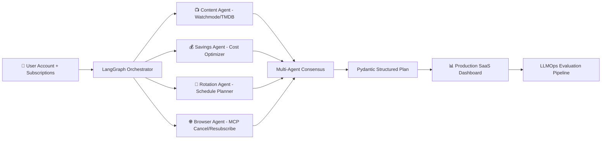

# 📺 STREAMSMART OPTIMIZER — Full Production Scope v2.0

## AI-Powered Autonomous Streaming Subscription Manager
## "Your AI Agent That Manages Your Streaming — So You Don't Have To"

**Document Version:** 2.0 (🎯 **v10.0 REALIGNMENT** — Supporting/backlog (production-grade); 3-stage arc; destination Applied AI Engineer → FDE. Stage-4/5 & Month-35-37 references retired. Prior v1.5 note archived below.)
**Last Updated:** June 16, 2026  
**Status:** 📋 DRAFT — v10.0-aligned; Supporting/backlog (sequence behind the lead trio).
**Author:** Manuel Reyes  
**Target (v10.0):** Stage 3 within the 3-stage model (backlog — no S3).
**Sequencing:** backlog — after the lead trio (DataVault → PolicyPulse → Crucible).
**Predecessor:** StreamSmart Optimizer Stage 1 (Advisory Dashboard)

---


## 🎯 v10.0 ROADMAP ALIGNMENT & STAGE-EVOLUTION ARC — AUTHORITATIVE

> **This block governs.** Where anything below it conflicts (old stage numbers, retired titles, pre-v10.0 portfolio lists), **this block wins.**

**Aligned to:** Career Roadmap **v10.0 (2026 Market Realignment)**.

**Governing model:** **3 stages, not 5.** The retired 14-month "ML Engineer" stage is now an **embedded ML-literacy module inside Stage 3** (earned-overlay — ships only if it beats the baseline). The destination title is **Applied AI Engineer → Forward Deployed Engineer (FDE)**; the retired "Senior LLM Engineer" title is dropped. **This project is ONE system that evolves across stages — never rebuilt per stage.**

**Portfolio role:** 🧩 **Supporting — backlog / positioned last** (production-grade when built; outside the active lead set). Consumer/personal-finance domain, not core trajectory — sequence behind the lead trio. In v10.0, **flagship vs supporting = size & emphasis, not a quality tier — every project is production-grade.** Lead projects get new tooling first and are updated continuously as skills grow.

**Stage-evolution arc:**

| Stage | Theme | This project's layer |
|---|---|---|
| **S1** | Foundation (GenAI-first core) | Advisory optimizer — content/pricing-API ingestion + subscription-optimization dashboard. |
| **S2** | DE/AE hardening | Data platform — **dbt models** over content/pricing feeds, cost-optimization marts, Airflow, contracts, Docker/ECS. |
| **S3** | Applied AI (RAG/agentic + eval) | Agentic subscription manager — autonomous rotation with **HITL** approval + eval + Phoenix. |

- **Every project's S2 adds:** ingestion → **dbt-tested models (CI-gated)** → **data contracts** (Great Expectations) → warehouse/lakehouse → **Airflow** (idempotent runs) → Docker/**ECS** → monitoring + written **postmortem** → **semantic/metrics layer**.
- **Every project's S3 adds:** RAG/GraphRAG/agentic layer + **three-layer eval** (per-query metrics · trajectory tracing · drift vs frozen golden set) + **observability (Arize Phoenix, OTel-native, free)** + MCP + **HITL** on irreversible actions.

**Production standard (non-negotiable, ALL projects):** business-outcome headline · Mermaid diagram · Dockerfile · eval-metrics table · 15–30s demo GIF · "What I Learned" · **synthetic data only in public repos** · `pyproject.toml` + `src/` + `py.typed` + ruff + mypy · Conventional Commits.

**Sequencing (v10.0):** backlog — build only after the lead trio (DataVault → PolicyPulse → Crucible) and the Supporting set (FormSense/AFC) are production-hardened. Retired the Stage-4/5 & Month-35-37 framing (there is no S3 in the 3-stage model).

---

## 📋 Table of Contents

1. [Executive Summary](#1-executive-summary)
2. [Vision: From Advisory to Autonomous](#2-vision-from-advisory-to-autonomous)
3. [Market Opportunity](#3-market-opportunity)
4. [Platform Architecture](#4-platform-architecture)
5. [Agentic AI System Design](#5-agentic-ai-system-design)
6. [Feature Framework: Complete Product](#6-feature-framework-complete-product)
7. [User Account System](#7-user-account-system)
8. [Subscription Automation Engine](#8-subscription-automation-engine)
9. [Content Intelligence Pipeline](#9-content-intelligence-pipeline)
10. [AI Guardrails & Safety](#10-ai-guardrails--safety)
11. [Tech Stack: Production SaaS](#11-tech-stack-production-saas)
12. [Infrastructure & DevOps](#12-infrastructure--devops)
13. [LLMOps & Evaluation](#13-llmops--evaluation)
14. [Data Architecture: Production Scale](#14-data-architecture-production-scale)
15. [Monetization Strategy](#15-monetization-strategy)
16. [Security & Compliance](#16-security--compliance)
17. [Project Structure](#17-project-structure)
18. [Development Phases](#18-development-phases)
19. [Success Metrics](#19-success-metrics)
20. [Risk Mitigation](#20-risk-mitigation)
21. [Skills Required (Roadmap Alignment)](#21-skills-required-roadmap-alignment)

---

## 1. Executive Summary

**StreamSmart Optimizer (Full Production)** is an **autonomous AI-powered subscription management platform** that goes beyond advising users — it **acts on their behalf**. Using multi-agent AI orchestration (LangGraph) implementing Anthropic's "Building Effective Agents" patterns — **sequential** (Planner → Content → Verifier → Action → Monitor), **evaluator-optimizer** (Verifier loop), and **human-in-the-loop checkpoints** — combined with **MCP** tool integration (browser, Watchmode, TMDB, calendar servers) and browser automation, it manages the entire subscription lifecycle: monitoring usage, recommending rotations, executing cancellations, re-subscribing when content drops, and tracking savings.

### Stage 1 vs Full Production

| Dimension | Stage 1 (Advisory) | Full Production (Agentic) |
|-----------|---------------------|---------------------------|
| **AI Role** | "Here's what I recommend" | "I'll handle it — approve my plan" |
| **Subscription Actions** | Manual (user does it) | Automated (agent does it with approval) |
| **Content Intelligence** | API search on demand | Continuous monitoring + predictive alerts |
| **User Data** | Session-based (Streamlit) | Persistent accounts + encrypted storage |
| **Scale** | Single user, local | Multi-tenant SaaS, cloud-deployed |
| **Architecture** | Monolith Streamlit app | Microservices + event-driven + agent orchestration |
| **AI Framework** | LLM SDK (direct calls) | LangGraph (stateful agents) + CrewAI (multi-agent) + MCP |
| **Memory** | None (per-session) | Long-term agentic memory (LangMem) |
| **Monetization** | Free (portfolio project) | Freemium SaaS ($4.99-9.99/month) |
| **Evaluation** | Manual testing | LLMOps: automated eval pipeline, CI/CD for AI |

### What Makes This an Applied AI Engineer → FDE Portfolio Piece

| Senior-Level Skill | How StreamSmart Demonstrates It |
|--------------------|-------------------------------|
| **Multi-Agent Orchestration** | 4+ specialized agents collaborating via LangGraph |
| **MCP Tool Integration** | Agents connect to browser, APIs, databases via MCP servers |
| **Long-Term Memory** | LangMem for user preferences, past decisions, learned patterns |
| **Evaluation-Driven Development** | LLM-as-Judge pipeline catches hallucinations, bad recommendations |
| **Production LLMOps** | CI/CD for AI, automated testing, monitoring, cost management |
| **System Design** | Event-driven microservices, message queues, multi-tenant architecture |
| **Browser Automation** | Playwright-based subscription management (cancel, resubscribe) |
| **Human-in-the-Loop** | LangGraph checkpoints for financial action approval |

---

## 2. Vision: From Advisory to Autonomous

**Evolution (v10.0 — 3 stages):** **S1 Advisory** (dashboard — "what should I do?") → **S2 DE/AE platform** (modeled, tested, orchestrated on cloud) → **S3 Agentic + eval** (manages subscriptions with **mandatory human approval**; never stores credentials, never enters payment). ML prediction folds into S3 as an earned-overlay; monetization / SaaS / mobile are optional beyond-portfolio extensions. See §18 for the full arc.

---

## 3. Market Opportunity

### 3.1 Addressable Market

| Metric | Value | Source |
|--------|-------|--------|
| U.S. streaming subscribers | ~230 million | Statista 2025 |
| % actively rotating | 36% | Antenna Research 2025 |
| Rotators (addressable) | ~82 million | Calculated |
| Avg monthly streaming spend | $52+ | Reviews.org 2026 |
| Avg annual waste on unused subs | $200+ | CNET 2025 |
| Potential savings per user/year | $300-750 | Based on rotation modeling |

### 3.2 Revenue Model Validation

```yaml
freemium_model:
  free_tier:
    - Track up to 3 subscriptions
    - Basic cost analytics (SS01-SS03)
    - 5 AI queries/month
    - Manual rotation reminders
    
  premium_tier: "$4.99/month"
    - Unlimited subscriptions
    - Full AI optimizer (all AI features)
    - Automated cancel/resubscribe (with approval)
    - Priority content alerts
    - Savings tracking + annual report
    - Family/household sharing (up to 5 profiles)
    
  pro_tier: "$9.99/month"
    - Everything in Premium
    - Concierge agent (handles customer service calls — Pine AI style)
    - Multi-household management
    - API access for power users
    - Priority support

conservative_projections:
  year_1_users: 10,000 free + 1,000 premium
  year_1_mrr: "$4,990 - $9,990"
  year_2_users: 50,000 free + 5,000 premium
  year_2_mrr: "$24,950 - $49,950"
```

### 3.3 Competitive Moat

```
┌─────────────────────────────────────────────────────────┐
│  WHY STREAMSMART WINS:                                   │
│                                                          │
│  1. FIRST full-stack AI subscription optimizer           │
│     (no competitor combines all features)                │
│                                                          │
│  2. AGENTIC — actually does it, not just advises         │
│     (Rocket Money cancels, but doesn't re-subscribe      │
│      or plan rotation. Seasons advises but doesn't act)  │
│                                                          │
│  3. CONTENT-AWARE — knows what's on each service         │
│     (subscription trackers have zero content data)       │
│                                                          │
│  4. AI MEMORY — learns your preferences over time        │
│     (gets smarter with every interaction)                │
│                                                          │
│  5. FINANCE + AI — built by someone who understands      │
│     both personal finance AND AI engineering              │
└─────────────────────────────────────────────────────────┘
```

---

## 4. Platform Architecture

### 4.1 High-Level System Design

```
┌─────────────────────────────────────────────────────────────────┐
│                        STREAMSMART PLATFORM                      │
├─────────────────────────────────────────────────────────────────┤
│                                                                  │
│  ┌──────────┐    ┌──────────────────┐    ┌──────────────────┐  │
│  │  Web App  │    │  Mobile App      │    │  API (REST)      │  │
│  │  (React)  │◄──►│  (React Native)  │◄──►│  (FastAPI)       │  │
│  └─────┬─────┘    └────────┬─────────┘    └────────┬─────────┘  │
│        │                   │                        │            │
│  ──────┼───────────────────┼────────────────────────┼──────────  │
│        │            API GATEWAY (Kong/Nginx)         │           │
│  ──────┼───────────────────┼────────────────────────┼──────────  │
│        │                   │                        │            │
│  ┌─────▼──────────────────────────────────────────────────┐     │
│  │              ORCHESTRATION LAYER (LangGraph)            │     │
│  │                                                         │     │
│  │  ┌─────────┐  ┌──────────┐  ┌─────────┐  ┌─────────┐ │     │
│  │  │ Planner │  │ Content  │  │ Action  │  │ Monitor │ │     │
│  │  │  Agent  │  │  Agent   │  │  Agent  │  │  Agent  │ │     │
│  │  └────┬────┘  └────┬─────┘  └────┬────┘  └────┬────┘ │     │
│  │       │            │             │             │       │     │
│  │  ─────┼────────────┼─────────────┼─────────────┼────── │     │
│  │       │     MCP TOOL SERVERS     │             │       │     │
│  │  ┌────▼────┐ ┌─────▼────┐ ┌─────▼─────┐ ┌────▼────┐ │     │
│  │  │Watchmode│ │  TMDB    │ │ Browser   │ │Calendar │ │     │
│  │  │ MCP     │ │  MCP     │ │ MCP       │ │  MCP    │ │     │
│  │  │ Server  │ │  Server  │ │(Playwright)│ │ Server  │ │     │
│  │  └─────────┘ └──────────┘ └───────────┘ └─────────┘ │     │
│  └─────────────────────────────────────────────────────────┘     │
│                                                                  │
│  ┌──────────────────────────────────────────────────────┐       │
│  │                  DATA LAYER                           │       │
│  │  PostgreSQL │ Redis │ S3 │ Pinecone │ LangMem        │       │
│  └──────────────────────────────────────────────────────┘       │
│                                                                  │
│  ┌──────────────────────────────────────────────────────┐       │
│  │               OBSERVABILITY & EVAL                    │       │
│  │  LangSmith │ Prometheus │ Grafana │ LLM-as-Judge      │       │
│  └──────────────────────────────────────────────────────┘       │
└─────────────────────────────────────────────────────────────────┘
```

### 4.2 Event-Driven Architecture

```yaml
event_bus: "Redis Streams or AWS SQS"

events:
  # User events
  - subscription.added
  - subscription.removed
  - viewing.logged
  - rotation.approved        # Human-in-loop approval
  - rotation.rejected

  # Agent events
  - agent.plan.generated     # Planner Agent creates rotation plan
  - agent.content.scanned    # Content Agent finds new releases
  - agent.action.pending     # Action Agent ready to cancel/subscribe
  - agent.action.completed   # Cancel/subscribe action executed
  - agent.monitor.alert      # Monitor Agent detects idle subscription

  # System events
  - billing.renewal.approaching  # 5 days before renewal
  - price.change.detected        # Service price changed
  - content.leaving.soon         # Title leaving platform in 7 days
```

---

## 5. Agentic AI System Design

### 5.1 Multi-Agent Architecture (LangGraph) — Sequential + Evaluator-Optimizer Patterns

```
┌──────────────────────────────────────────────────────────┐
│              LANGGRAPH AGENT ORCHESTRATION                 │
│                                                           │
│  ┌─────────────┐                                         │
│  │   PLANNER   │ "The Strategist"                        │
│  │    AGENT    │ Analyzes habits, budget, content →      │
│  │             │ creates optimal rotation plan             │
│  └──────┬──────┘                                         │
│         │ plan_generated                                  │
│         ▼                                                 │
│  ┌─────────────┐                                         │
│  │  CONTENT    │ "The Scout"                             │
│  │   AGENT     │ Monitors release calendars, tracks       │
│  │             │ watchlist availability, finds deals       │
│  └──────┬──────┘                                         │
│         │ content_enriched                                │
│         ▼                                                 │
│  ┌─────────────┐     ┌──────────────┐                    │
│  │  VERIFIER   │────►│   HUMAN      │                    │
│  │   AGENT     │     │  CHECKPOINT  │ "Do you approve    │
│  │ "The Critic"│◄────│  (LangGraph) │  this plan?"       │
│  └──────┬──────┘     └──────────────┘                    │
│         │ approved                                        │
│         ▼                                                 │
│  ┌─────────────┐                                         │
│  │  ACTION     │ "The Executor"                          │
│  │   AGENT     │ Cancels, re-subscribes, pauses via      │
│  │             │ browser automation (Playwright + MCP)     │
│  └──────┬──────┘                                         │
│         │ action_completed                                │
│         ▼                                                 │
│  ┌─────────────┐                                         │
│  │  MONITOR    │ "The Watchdog"                          │
│  │   AGENT     │ Tracks usage, detects idle subs,        │
│  │             │ alerts on upcoming renewals               │
│  └─────────────┘                                         │
│                                                           │
│  ── State Management: LangGraph checkpointer ──         │
│  ── Memory: LangMem (semantic + episodic + procedural) ──│
│  ── Tracing: LangSmith (every agent step logged) ───────│
└──────────────────────────────────────────────────────────┘
```

**Pattern Recognition (v8.3):** This architecture implements three of Anthropic's canonical "Building Effective Agents" patterns: **sequential** (Planner → Content → Verifier → Action → Monitor — each agent's output feeds the next), **evaluator-optimizer** (Verifier critiques Planner's output, can route back for revision), and **human-in-the-loop** (LangGraph checkpoint between Verifier approval and Action execution). Naming patterns explicitly is a 2026 hiring signal — recruiters scan project READMEs for this vocabulary.

### 5.2 Agent Specifications

#### Planner Agent — "The Strategist"

```yaml
planner_agent:
  role: "Streaming Subscription Strategist"
  capabilities:
    - Analyze user viewing history and patterns
    - Cross-reference with content release calendars
    - Optimize subscription selection against budget constraints
    - Generate monthly rotation plans with reasoning
    - Learn from past plan performance (LangMem episodic memory)
  
  tools_via_mcp:
    - watchmode_search        # Content availability
    - tmdb_metadata           # Release dates, ratings
    - user_history_query      # Past viewing data
    - pricing_database        # Current service prices
  
  state_tracked:
    - current_subscriptions
    - budget_limit
    - watchlist
    - past_plan_performance
  
  output_schema: RotationPlan (Pydantic)
  
  evaluation_criteria:
    - savings_accuracy: "Projected savings within 10% of actual"
    - content_coverage: ">80% of watchlist covered by recommended services"
    - budget_compliance: "Never exceeds stated budget"
```

#### Content Agent — "The Scout"

```yaml
content_agent:
  role: "Content Intelligence Analyst"
  capabilities:
    - Monitor content release calendars across all platforms
    - Track when titles are leaving platforms
    - Find cheapest way to watch specific content
    - Detect content overlap (same title on multiple services)
    - Identify bundle deals and promotional pricing
  
  tools_via_mcp:
    - watchmode_search
    - tmdb_metadata
    - web_search             # For press releases, announcements
    - calendar_events        # Schedule content alerts
  
  output_schema: ContentIntelligenceReport (Pydantic)
  
  scheduled_runs:
    - daily: "Scan for titles leaving platforms within 7 days"
    - weekly: "Full watchlist availability refresh"
    - on_demand: "User searches for specific content"
```

#### Action Agent — "The Executor"

```yaml
action_agent:
  role: "Subscription Action Executor"
  capabilities:
    - Cancel subscriptions via browser automation
    - Re-subscribe to services when content drops
    - Pause subscriptions (where supported)
    - Verify action completion
    - Retry on failure with different strategy
  
  tools_via_mcp:
    - browser_automation     # Playwright MCP server
    - screenshot_capture     # For verification + audit trail
    - email_confirmation     # Check for confirmation emails
  
  CRITICAL_SAFETY:
    - NEVER executes without human approval (LangGraph checkpoint)
    - NEVER stores payment credentials (uses saved browser sessions)
    - Full audit log of every action attempted/completed
    - Screenshot before/after every action
    - Rollback capability (re-subscribe if cancel was wrong)
  
  error_handling:
    - CAPTCHA detected → escalate to user
    - 2FA required → escalate to user
    - Site layout changed → alert + retry with updated selectors
    - Payment required → escalate to user (never enters payment)
```

#### Monitor Agent — "The Watchdog"

```yaml
monitor_agent:
  role: "Subscription Health Monitor"
  capabilities:
    - Track days since last use per subscription
    - Detect approaching renewal dates
    - Calculate real-time cost-per-view
    - Alert on price increases
    - Monitor for promotional deals/discounts
  
  alert_rules:
    - idle_subscription:
        condition: "No usage for 14+ days"
        action: "Send notification with cancel recommendation"
    - renewal_approaching:
        condition: "5 days before billing date"
        action: "Evaluate usage → recommend keep/cancel/pause"
    - price_increase:
        condition: "Detected via web monitoring"
        action: "Recalculate value → update rotation plan"
    - content_dropping:
        condition: "Watchlist title leaving in 7 days"
        action: "Priority notification to watch before it's gone"
  
  output_schema: MonitorAlert (Pydantic)
```

### 5.3 LangGraph State Machine

```python
from langgraph.graph import StateGraph, END
from langgraph.checkpoint import MemorySaver

class StreamSmartState(TypedDict):
    """Global state for the agent orchestration."""
    user_id: str
    subscriptions: list[Subscription]
    viewing_history: list[ViewingLog]
    budget: Decimal
    watchlist: list[str]
    content_intelligence: ContentIntelligenceReport | None
    rotation_plan: RotationPlan | None
    human_approved: bool
    actions_taken: list[ActionLog]
    errors: list[str]

# Build the graph
graph = StateGraph(StreamSmartState)

graph.add_node("planner", planner_agent)
graph.add_node("content_scout", content_agent)
graph.add_node("verifier", verifier_agent)
graph.add_node("human_checkpoint", human_approval_node)
graph.add_node("executor", action_agent)
graph.add_node("monitor", monitor_agent)

# Edges with conditional routing
graph.add_edge("planner", "content_scout")
graph.add_edge("content_scout", "verifier")
graph.add_conditional_edges(
    "verifier",
    route_verification,  # passes → checkpoint, fails → back to planner
    {"approved": "human_checkpoint", "rejected": "planner"}
)
graph.add_conditional_edges(
    "human_checkpoint",
    check_human_approval,
    {"approved": "executor", "rejected": END}
)
graph.add_edge("executor", "monitor")

# Compile with checkpointing
app = graph.compile(checkpointer=MemorySaver())
```

### 5.4 MCP Tool Server Architecture

```yaml
mcp_servers:
  watchmode_server:
    protocol: "MCP (Model Context Protocol)"
    tools_exposed:
      - search_title(query, region) → ContentAvailability[]
      - get_availability(title_id, region) → StreamingSource[]
      - get_changes(start_date, end_date) → ContentChange[]
    auth: "API key (stored in vault)"
    
  tmdb_server:
    protocol: "MCP"
    tools_exposed:
      - get_metadata(title_id) → TitleMetadata
      - get_release_calendar(service, month) → Release[]
      - search_by_genre(genre, min_rating) → Title[]
    auth: "API key (stored in vault)"
    
  browser_server:
    protocol: "MCP (Playwright)"
    tools_exposed:
      - navigate(url) → PageState
      - click_element(selector) → ActionResult
      - fill_form(selector, value) → ActionResult
      - screenshot() → Image
      - verify_cancellation(service) → bool
    safety: "Sandboxed browser, no credential storage, screenshot audit"
    
  calendar_server:
    protocol: "MCP"
    tools_exposed:
      - create_reminder(title, date, action) → Reminder
      - get_upcoming_renewals(days_ahead) → Renewal[]
      - schedule_rotation(plan) → Schedule
```

### 5.5 A2A Protocol — Inter-Agent Communication ⭐ NEW v8.3

**Why A2A:**
While MCP standardizes how an agent calls external tools (Watchmode API, browser, calendar), the **Agent-to-Agent (A2A) protocol** standardizes how independent agents discover and collaborate with each other. Originally Google (April 2025), donated to the Linux Foundation Agentic AI Foundation alongside MCP (December 2025).

**Use Case in StreamSmart Production:**
At multi-tenant household scale, A2A enables scenarios MCP alone can't:
- Mom-Agent discovers Kid-Agent's content preferences without Mom hardcoding them
- StreamSmart-Agent collaborates with external Budget-Agent (e.g., Monarch Money) to align subscription spending with overall household budget
- Service-Provider-Agents (e.g., a future Netflix-Agent) advertise pricing/content changes that StreamSmart-Agent can subscribe to

**Implementation Status:** A2A awareness in scope; full implementation deferred until A2A SDK matures (estimated late 2026 per Linux Foundation roadmap). Internal agent collaboration uses LangGraph today; A2A is the production-scale upgrade path.

**MCP vs A2A in StreamSmart:**

| Layer | Protocol | Example |
|-------|----------|---------|
| Agent ↔ Tool | MCP | Action-Agent calls `browser.click()` via Playwright MCP |
| Agent ↔ Agent (internal) | LangGraph | Planner hands off to Content-Agent |
| Agent ↔ Agent (external) | **A2A** (v2 roadmap) | StreamSmart-Agent ↔ Budget-Agent |

### 5.6 Long-Term Agentic Memory (LangMem)

```yaml
memory_types:
  semantic:
    what: "Facts about the user's preferences"
    examples:
      - "User prefers sci-fi and thriller genres"
      - "User watches mostly on weekends"
      - "User's budget hard limit is $30/month"
      - "User values HBO originals highly"
    storage: "Vector DB (Pinecone)"
    
  episodic:
    what: "Past decisions and their outcomes"
    examples:
      - "Cancelled Disney+ in March, re-subscribed in May for Marvel"
      - "Rotation plan #7 saved $47 over 3 months"
      - "User rejected cancellation of Netflix despite low usage (emotional attachment)"
    storage: "PostgreSQL + embeddings"
    
  procedural:
    what: "Learned patterns for better recommendations"
    examples:
      - "User always watches new Marvel content within 2 weeks of release"
      - "User never watches live sports — sports packages are low value"
      - "Cancel Disney+ after watching target show → user satisfaction high"
    storage: "Vector DB (Pinecone)"
```

---

## 6. Feature Framework: Complete Product

### 6.1 Free Tier Features

| ID | Feature | Description |
|----|---------|-------------|
| **F01** | Subscription Tracker | Add/manage up to 3 active subscriptions |
| **F02** | Basic Cost Dashboard | Monthly spend, per-service breakdown |
| **F03** | Content Search | "Where can I watch X?" (5 queries/month) |
| **F04** | Manual Rotation Reminders | Calendar reminders for billing dates |
| **F05** | Basic Savings Calculator | Simple before/after comparison |

### 6.2 Premium Features ($4.99/month)

| ID | Feature | Description |
|----|---------|-------------|
| **P01** | Unlimited Subscriptions | Track all services |
| **P02** | AI Rotation Planner | Monthly AI-optimized rotation schedules |
| **P03** | Auto-Cancel Agent | Browser automation to cancel subscriptions (with approval) |
| **P04** | Auto-Resubscribe Agent | Re-subscribes when target content drops |
| **P05** | Content Alerts | "Severance S3 drops on Apple TV+ June 15" |
| **P06** | Savings Dashboard | Historical savings tracker with projections |
| **P07** | Family Profiles | Up to 5 household members with shared optimization |
| **P08** | NL Chat | Unlimited AI queries about subscriptions |
| **P09** | Cancel Timing Alerts | "Haven't watched Max in 18 days. Renews in 5." |
| **P10** | Cost-Per-Episode | "The Bear costs $5.67/episode at your usage rate" |

### 6.3 Pro Features ($9.99/month)

| ID | Feature | Description |
|----|---------|-------------|
| **X01** | Concierge Agent | AI handles customer service calls (Pine AI style) |
| **X02** | Multi-Household | Manage separate households |
| **X03** | API Access | Programmatic access for power users |
| **X04** | Priority Content Intel | 48-hour early alerts on content drops |
| **X05** | Annual Report | PDF savings report with recommendations |

---

## 7. User Account System

### 7.1 Authentication

```yaml
auth:
  primary: "Auth0 or Supabase Auth"
  methods:
    - Email + password (bcrypt hashed)
    - Google OAuth 2.0
    - Apple Sign-In
  session: "JWT tokens (15 min access, 7 day refresh)"
  
  critical_rules:
    - NEVER store streaming service credentials
    - NEVER store payment information
    - Browser automation uses saved browser sessions (user logs in once)
    - All PII encrypted at rest (AES-256)
```

### 7.2 User Data Model

```yaml
user_profile:
  id: UUID
  email: encrypted
  name: encrypted
  household_size: int
  budget_limit: Decimal
  notification_preferences: NotificationSettings
  subscriptions: list[Subscription]
  viewing_history: list[ViewingLog]
  watchlist: list[WatchlistItem]
  rotation_history: list[RotationPlan]
  savings_history: list[SavingsRecord]
  agent_memory: LangMem reference
  created_at: datetime
  tier: Literal["free", "premium", "pro"]
```

---

## 8. Subscription Automation Engine

### 8.1 How Automation Works (Safety-First)

```
USER FLOW FOR AUTOMATED CANCEL:
═══════════════════════════════

1. Monitor Agent detects: "Disney+ unused 21 days, renews in 5 days"
   │
2. Planner Agent evaluates: "No upcoming Disney+ content on watchlist"
   │
3. Verifier Agent confirms: "Cancel recommendation is sound"
   │
4. ┌─────────────────────────────────────────────┐
   │  📱 PUSH NOTIFICATION TO USER:              │
   │                                              │
   │  "StreamSmart recommends cancelling          │
   │   Disney+ ($13.99/mo). No watchlist          │
   │   content upcoming. Renews in 5 days."       │
   │                                              │
   │  [✅ Approve Cancel]  [❌ Keep It]  [⏸ Pause] │
   └─────────────────────────────────────────────┘
   │
5. User taps "Approve Cancel"
   │
6. Action Agent:
   ├─ Opens browser session (already logged into Disney+)
   ├─ Navigates to account settings
   ├─ Screenshots current state
   ├─ Clicks cancel subscription
   ├─ Handles confirmation dialogs
   ├─ Screenshots final state
   ├─ Verifies cancellation confirmed
   └─ Logs full audit trail
   │
7. User receives: "✅ Disney+ cancelled. $13.99/mo saved. 
                    I'll alert you when to resubscribe."
```

### 8.2 Automation Safety Rails

```yaml
safety_rails:
  human_approval_required:
    - Every cancel action
    - Every resubscribe action
    - Every pause action
    - Budget changes
    
  never_automated:
    - Payment credential entry
    - New service sign-up (only reactivation of known accounts)
    - Password changes
    - Account deletion
    - Any action costing money without explicit approval
    
  audit_trail:
    - Screenshot before every action
    - Screenshot after every action
    - Full action log with timestamps
    - Rollback log (how to undo each action)
    
  failure_handling:
    - CAPTCHA → escalate to user
    - 2FA → escalate to user
    - Layout change → pause + alert engineering team
    - Unexpected dialog → screenshot + escalate to user
    - Action timeout → retry once, then escalate
```

---

## 9. Content Intelligence Pipeline

### 9.1 Continuous Content Monitoring

```yaml
content_pipeline:
  schedule:
    hourly:
      - "Check for price changes across all services"
    daily:
      - "Scan for new content announcements"
      - "Check titles leaving each platform within 14 days"
      - "Update content availability for all watchlisted titles"
    weekly:
      - "Full content catalog refresh from Watchmode"
      - "Release calendar update from TMDB"
      - "Bundle deal and promotional price scan"
    monthly:
      - "Service pricing database full refresh"
      - "Market trend analysis (new services, shutdowns, mergers)"

  data_sources:
    primary:
      - Watchmode API (streaming availability)
      - TMDB API (metadata, release dates)
    secondary:
      - RSS feeds from streaming service press rooms
      - Web scraping for price change announcements
    enrichment:
      - Genre classification (TMDB)
      - User rating aggregation (TMDB + Trakt)
      - Content similarity (vector embeddings in Pinecone)
```

### 9.2 Recommendation Engine (RAG + ML)

```yaml
recommendation_engine:
  approach: "Hybrid RAG + Collaborative Filtering"
  
  rag_component:
    what: "Content-aware recommendations"
    how: |
      1. Embed user's viewing history + watchlist
      2. Embed content catalog descriptions
      3. Similarity search in Pinecone
      4. LLM synthesizes personalized recommendation
    models:
      embedding: "text-embedding-3-small (OpenAI) or local sentence-transformers"
      generation: "Gemini Flash / Claude Haiku (cost-optimized)"
  
  collaborative_filtering:
    what: "Users like you also watched..."
    how: "scikit-learn / implicit library"
    requires: "Aggregated anonymized viewing data (Stage 3+)"
  
  hybrid_approach:
    weights:
      content_based: 0.6
      collaborative: 0.3
      popularity: 0.1
```

---

## 10. AI Guardrails & Safety

### 10.1 Financial Safety (Critical)

```yaml
financial_guardrails:
  budget_hard_limit:
    rule: "AI recommendations NEVER exceed user's stated budget"
    enforcement: "Pre-response validation + post-response check"
    
  savings_accuracy:
    rule: "Projected savings must be based on actual pricing data"
    enforcement: "Cross-reference services.yaml before every response"
    
  no_financial_advice:
    rule: "StreamSmart optimizes subscriptions — not investments"
    enforcement: "Topic classifier rejects out-of-scope financial queries"
    
  action_cost_transparency:
    rule: "Every automated action shows the financial impact before approval"
    enforcement: "Human checkpoint displays cost change before execution"
    
  rollback_guarantee:
    rule: "Every automated cancellation can be undone"
    enforcement: "Action Agent logs rollback steps for every action"
```

### 10.2 Automation Safety

```yaml
automation_guardrails:
  rate_limiting:
    max_actions_per_day: 3
    max_actions_per_week: 10
    cooldown_after_failure: "24 hours"
    
  scope_limitation:
    allowed_actions: ["cancel", "resubscribe", "pause", "resume"]
    blocked_actions: ["sign_up_new", "change_plan", "enter_payment", "delete_account"]
    
  verification:
    pre_action: "Screenshot + state verification"
    post_action: "Screenshot + confirmation email check"
    human_verify: "User confirms action was correct within 24h"
```

### 10.3 LLM-as-Judge Evaluation

```yaml
evaluation_pipeline:
  judges:
    recommendation_judge:
      evaluates: "Is this rotation plan reasonable and helpful?"
      criteria:
        - Budget compliance (binary)
        - Content coverage quality (1-5)
        - Savings claim accuracy (1-5)
        - Reasoning quality (1-5)
      model: "Claude Sonnet (separate from generation model)"
      
    safety_judge:
      evaluates: "Does this response contain any safety issues?"
      criteria:
        - No financial advice beyond subscriptions
        - No hallucinated services or prices
        - Disclaimer present
        - No PII leakage
      model: "Gemini Flash (fast, cheap)"
      
  ci_cd_integration:
    on_every_pr:
      - Run eval suite against 50 test scenarios
      - Compare to baseline scores
      - Block merge if scores drop >5%
    weekly:
      - Full eval suite against 500 scenarios
      - Regression detection
      - Cost analysis report
```

---

## 11. Tech Stack: Production SaaS

### Backend

| Category | Technology | Rationale |
|----------|------------|-----------|
| Language | Python 3.12+ | Consistency + AI ecosystem |
| API Framework | FastAPI | Async, type-safe, OpenAPI docs |
| Agent Orchestration | **LangGraph** | Stateful multi-agent workflows |
| Multi-Agent | **CrewAI** | Role-based agent collaboration |
| Tool Protocol | **MCP (Anthropic)** | Standard tool integration |
| Browser Automation | **Playwright** (via MCP) | Subscription actions |
| LLM Providers | Gemini (primary), Claude (judge), GPT-4o (fallback) | Provider diversity |
| Structured Outputs | Pydantic v2 | Type-safe everything |
| Memory | **LangMem** | Long-term agentic memory |
| Tracing | **LangSmith** | Agent step tracing + debugging |
| **AI Evaluation** | **DeepEval + LLM-as-Judge** | Automated eval pipeline, faithfulness, answer relevancy CI/CD gate |

### Data

| Category | Technology | Rationale |
|----------|------------|-----------|
| Primary DB | PostgreSQL (Supabase) | User data, subscriptions, history |
| Cache | Redis | Session cache, rate limiting, event bus |
| Vector DB | Pinecone | Content embeddings, memory search |
| Object Storage | AWS S3 | Screenshots, audit logs, exports |
| Migrations | Alembic | Schema versioning |

### Frontend

| Category | Technology | Rationale |
|----------|------------|-----------|
| Web App | React + TypeScript | Modern SPA |
| Mobile | React Native | iOS + Android |
| UI Framework | shadcn/ui + Tailwind | Clean, accessible design |
| State Management | Zustand or Redux Toolkit | Client state |
| API Client | TanStack Query | Server state management |

### Infrastructure

| Category | Technology | Rationale |
|----------|------------|-----------|
| Cloud | AWS (ECS/Fargate) | Scalable containers |
| CI/CD | GitHub Actions | Consistent with portfolio |
| Monitoring | Prometheus + Grafana | System health |
| Error Tracking | Sentry | Production error monitoring |
| Auth | Auth0 or Supabase Auth | User authentication |
| Secrets | AWS Secrets Manager | API keys, credentials |

---

## 12. Infrastructure & DevOps

### 12.1 Deployment Architecture

```yaml
environments:
  development:
    - Local Docker Compose
    - Hot reload for FastAPI + React
    - Local Playwright testing
    
  staging:
    - AWS ECS (Fargate) — mirrors production
    - Separate database instances
    - Full agent testing with sandbox browser
    
  production:
    - AWS ECS (Fargate) — auto-scaling
    - RDS PostgreSQL (Multi-AZ)
    - ElastiCache Redis
    - CloudFront CDN for frontend
    - Route 53 DNS
    
  ci_cd:
    on_push:
      - Lint (Ruff) + Type check (mypy)
      - Unit tests (pytest)
      - Integration tests (agent workflows)
      - LLM eval suite (50 scenarios)
    on_merge_to_main:
      - Build Docker images
      - Deploy to staging
      - Smoke tests
      - Deploy to production (blue-green)
```

---

## 13. LLMOps & Evaluation

### 13.1 The "Circle of Evaluation" (S3 Capstone Skill)

```
┌──────────────────────────────────────────────────────────┐
│            LLMOPS EVALUATION PIPELINE                     │
│                                                           │
│  ┌───────────┐    ┌────────────┐    ┌───────────┐       │
│  │ Test      │    │  LLM       │    │ Score     │       │
│  │ Scenarios │───►│  Generates │───►│ Judge     │       │
│  │ (500+)    │    │  Response  │    │ Evaluates │       │
│  └───────────┘    └────────────┘    └─────┬─────┘       │
│                                           │              │
│                                    ┌──────▼──────┐       │
│                                    │  Dashboard  │       │
│                                    │  Scores +   │       │
│                                    │  Regressions│       │
│                                    └──────┬──────┘       │
│                                           │              │
│                                    ┌──────▼──────┐       │
│                                    │  CI/CD Gate │       │
│                                    │  Block if   │       │
│                                    │  score < X  │       │
│                                    └─────────────┘       │
│                                                           │
│  Evaluation Dimensions:                                   │
│  • Recommendation quality (1-5)                          │
│  • Savings accuracy (within 10%)                         │
│  • Budget compliance (binary)                            │
│  • Safety (no hallucinations, disclaimers present)       │
│  • Latency (<3s for chat, <30s for rotation plan)        │
│  • Cost per query (< $0.05 avg)                          │
└──────────────────────────────────────────────────────────┘
```

### 13.2 Monitoring in Production

```yaml
monitoring:
  system_metrics:
    - Request latency (p50, p95, p99)
    - Error rates by endpoint
    - Active users (DAU/MAU)
    - Agent success rate (actions completed / attempted)
    
  ai_metrics:
    - Token usage per query (input/output)
    - Cost per query by model
    - LLM response latency
    - Guardrail activation rate
    - Structured output validation failures
    
  business_metrics:
    - Monthly savings generated (all users)
    - Subscriptions cancelled via automation
    - Subscriptions re-activated via automation
    - User satisfaction (thumbs up/down on recommendations)
    - Conversion rate (free → premium)
    - Churn rate
    
  agent_metrics:
    - Plan acceptance rate (human approval %)
    - Action success rate (cancel/subscribe succeeded)
    - Retry rate (how often agents need second attempt)
    - Escalation rate (how often agents escalate to user)
    - Memory utilization (semantic/episodic/procedural entries)
```

---

## 14. Data Architecture: Production Scale

### 14.1 Database Schema (Simplified)

```sql
-- Core tables (PostgreSQL)
CREATE TABLE users (
    id UUID PRIMARY KEY DEFAULT gen_random_uuid(),
    email TEXT UNIQUE NOT NULL,  -- encrypted
    name TEXT,                    -- encrypted
    household_size INT DEFAULT 1,
    budget_limit DECIMAL(8,2),
    tier TEXT DEFAULT 'free',
    created_at TIMESTAMPTZ DEFAULT now()
);

CREATE TABLE subscriptions (
    id UUID PRIMARY KEY,
    user_id UUID REFERENCES users(id),
    service_name TEXT NOT NULL,
    tier TEXT,
    monthly_cost DECIMAL(8,2) NOT NULL,
    billing_date INT,
    status TEXT DEFAULT 'active',
    subscribed_since DATE,
    last_used_at TIMESTAMPTZ,
    created_at TIMESTAMPTZ DEFAULT now()
);

CREATE TABLE viewing_logs (
    id UUID PRIMARY KEY,
    user_id UUID REFERENCES users(id),
    subscription_id UUID REFERENCES subscriptions(id),
    title TEXT NOT NULL,
    tmdb_id INT,
    duration_minutes INT,
    watched_at TIMESTAMPTZ DEFAULT now()
);

CREATE TABLE rotation_plans (
    id UUID PRIMARY KEY,
    user_id UUID REFERENCES users(id),
    plan_data JSONB NOT NULL,         -- Full RotationPlan Pydantic model
    status TEXT DEFAULT 'proposed',   -- proposed, approved, rejected, executed
    savings_projected DECIMAL(8,2),
    savings_actual DECIMAL(8,2),
    created_at TIMESTAMPTZ DEFAULT now(),
    approved_at TIMESTAMPTZ
);

CREATE TABLE action_logs (
    id UUID PRIMARY KEY,
    user_id UUID REFERENCES users(id),
    subscription_id UUID REFERENCES subscriptions(id),
    action_type TEXT NOT NULL,         -- cancel, resubscribe, pause
    status TEXT DEFAULT 'pending',     -- pending, approved, executed, failed
    screenshot_before TEXT,            -- S3 URL
    screenshot_after TEXT,             -- S3 URL
    executed_at TIMESTAMPTZ,
    audit_data JSONB                   -- Full action context
);
```

---

## 15. Monetization Strategy

### 15.1 Pricing Tiers

| Tier | Price | Target User | Key Value |
|------|-------|-------------|-----------|
| **Free** | $0 | Casual optimizer | Try before you buy, basic tracking |
| **Premium** | $4.99/mo | Active rotator | Full AI + automation — pays for itself in month 1 |
| **Pro** | $9.99/mo | Power user / multi-household | Concierge + API + multi-household |
| **Annual Premium** | $39.99/yr | Committed user | 33% savings vs monthly |

### 15.2 Unit Economics

```yaml
unit_economics:
  premium_user:
    revenue_per_month: $4.99
    llm_cost_per_month: ~$0.50 (Gemini Flash + caching)
    infrastructure_per_user: ~$0.20
    api_costs_per_user: ~$0.10 (Watchmode/TMDB)
    gross_margin: ~$4.19 (84%)
    
  value_proposition:
    avg_savings_generated: "$25-50/month per user"
    cost_to_user: "$4.99/month"
    roi_for_user: "5-10x return"
```

---

## 16. Security & Compliance

```yaml
security:
  data_encryption:
    at_rest: "AES-256 (AWS KMS)"
    in_transit: "TLS 1.3"
    pii_fields: "Email, name encrypted at column level"
    
  authentication:
    method: "Auth0 with MFA support"
    sessions: "JWT (15min access + 7day refresh)"
    
  authorization:
    model: "RBAC (user, admin)"
    tenant_isolation: "Row-level security in PostgreSQL"
    
  browser_automation_security:
    credential_storage: "NEVER — uses browser saved sessions"
    session_isolation: "Separate Playwright contexts per user"
    audit_logging: "Every browser action logged with screenshots"
    sandbox: "Containerized browser (no host access)"
    
  compliance:
    gdpr: "Data export + deletion on request"
    ccpa: "Opt-out of data sharing"
    soc2: "Target for Year 2 (needed for enterprise)"
```

---

## 17. Project Structure

```
streamsmart-optimizer/
├── .cursor/
│   ├── rules/                    # Production standards (version-controlled)
│   │   ├── git-workflow.mdc      # alwaysApply: true — branch, commit, PR conventions
│   │   ├── learning-mode.mdc     # alwaysApply: true — learning patterns, skill progression
│   │   ├── python-production-standards.mdc  # alwaysApply: true — code style, types, testing
│   │   ├── streamlit-patterns.mdc    # Auto-attached: app/**/*.py
│   │   ├── ai-sdk-patterns.mdc       # Auto-attached: src/ai/**/*.py
│   │   └── evaluation.mdc           # Auto-attached: tests/test_eval.py
│   ├── commands/                 # Repeatable agent workflows (/command-name)
│   │   ├── draft-issue.md        # /draft-issue <goal>
│   │   ├── task-brief.md         # /task-brief <issue#>
│   │   ├── pr-prep.md            # /pr-prep
│   │   ├── review.md             # /review
│   │   ├── test.md               # /test
│   │   ├── eval.md               # /eval
│   │   └── commit-msg.md         # /commit-msg
│   ├── hooks/                    # Auto-run scripts
│   │   └── format.sh             # Auto-format (black + ruff) after agent edits
│   ├── hooks.json                # Hook configuration
│   └── plans/                    # Saved task briefs per Issue
│       └── issue-XX-task-brief.md
├── .cursorignore                 # Excludes data/logs/venv from Cursor indexing
├── .github/
│   ├── templates/                # Production workflow templates
│   │   ├── issue_template.md     # GitHub Issue format
│   │   ├── project_labels.md     # Approved labels + definitions
│   │   ├── pull_request_template.md  # PR body format
│   │   └── cursor_task_brief.md  # Agent execution contract
│   └── workflows/
│       ├── ci.yml                 # Lint, test, type-check
│       ├── eval.yml               # LLM evaluation suite
│       └── deploy.yml             # Build + deploy pipeline
├── backend/
│   ├── src/
│   │   ├── __init__.py
│   │   ├── py.typed               # PEP 561 — type hint support marker
│   │   ├── api/                   # FastAPI routes
│   │   │   ├── routes/
│   │   │   ├── middleware/
│   │   │   └── dependencies/
│   │   ├── agents/                # LangGraph agent definitions
│   │   │   ├── planner.py
│   │   │   ├── content_scout.py
│   │   │   ├── verifier.py
│   │   │   ├── executor.py
│   │   │   ├── monitor.py
│   │   │   └── graph.py           # LangGraph orchestration
│   │   ├── mcp_servers/           # MCP tool servers
│   │   │   ├── watchmode_server.py
│   │   │   ├── tmdb_server.py
│   │   │   ├── browser_server.py
│   │   │   └── calendar_server.py
│   │   ├── models/                # Pydantic schemas
│   │   ├── services/              # Business logic
│   │   ├── analytics/             # Metrics engine (from Stage 1)
│   │   ├── ai/                    # LLM abstraction + guardrails
│   │   ├── memory/                # LangMem integration
│   │   ├── evaluation/            # LLM-as-Judge eval pipeline
│   │   └── utils/
│   ├── tests/
│   │   ├── conftest.py            # Shared fixtures, mock agents, test DB
│   │   ├── unit/
│   │   ├── integration/
│   │   └── eval/                  # 500+ eval scenarios
│   ├── migrations/                # Alembic
│   ├── Dockerfile
│   ├── .dockerignore              # Excludes .git, tests, logs from image
│   └── pyproject.toml             # Backend dependencies + tool config (PEP 621)
├── frontend/
│   ├── web/                       # React web app
│   └── mobile/                    # React Native app
├── infrastructure/
│   ├── terraform/                 # AWS infrastructure as code
│   ├── docker-compose.yml         # Local development
│   └── kubernetes/                # K8s manifests (if scaling)
├── docs/
│   ├── api/                       # OpenAPI docs
│   ├── architecture/              # System design diagrams
│   └── runbooks/                  # Operational procedures
├── .env.example                   # Required environment variables template
├── CONTRIBUTING.md                # Branch naming, commit style, PR process
├── LICENSE                        # MIT License
├── Makefile                       # make test, make lint, make eval, make docker-build
└── README.md
```

---

## 18. Project Evolution (3 Stages — v10.0)

*Backlog / positioned-last — production-grade **when built**, sequenced behind the lead trio. The retired v9.2 "S3 / Months 30-37 / Senior LLM Engineer capstone / monetization" framing is dropped; monetization, mobile, and multi-tenant SaaS are **optional beyond-portfolio extensions**, not requirements.*

| Stage | Role (v10.0) | StreamSmart layer & production deliverables | Exit criteria |
|---|---|---|---|
| **S1** | Foundation (GenAI-first core) | Advisory optimizer — content/pricing-API ingestion (Watchmode/TMDB) + subscription-rotation dashboard (Streamlit) + structured outputs; local **Ollama** for privacy-routed recommendations. | Advisory dashboard live; recommendations structured + validated. |
| **S2** | DE/AE hardening | Data platform — **dbt models** over content/pricing feeds + cost-optimization marts + **Airflow** content-monitoring pipeline + **data contracts** + **Kafka** ingestion + Docker/ECS. | Monitoring pipeline scheduled; contracts enforced; marts modeled + tested. |
| **S3** | Applied AI (agentic + eval) | Agentic subscription manager — **LangGraph** orchestration with **mandatory HITL approval on every financial/browser action**, LangSmith/**Arize Phoenix** tracing, LLM-as-judge eval gate. **Safety rail: never stores credentials, never enters payment**; screenshot audit trail; escalates on CAPTCHA/anti-bot. | HITL gate on 100% of actions; eval gate blocks regressions; safety rails audited. |

> **Optional beyond-portfolio extensions (not required):** Stripe/monetization, freemium tiers, React Native mobile, multi-household — pursue only as a personal-product choice, not as portfolio requirements.


## 19. Success Metrics

### Technical

| Metric | Target |
|--------|--------|
| Agent success rate | >95% (actions complete without escalation) |
| LLM eval score (recommendation quality) | >4.0/5.0 |
| Structured output validation rate | >99% |
| API response time (p95) | <500ms |
| Agent workflow completion (p95) | <30 seconds |
| System uptime | >99.5% |
| Test coverage | >85% |
| Eval suite scenarios | 500+ |

### Business

| Metric | Target (Year 1) |
|--------|------------------|
| Registered users | 10,000+ |
| Premium conversions | 1,000+ |
| MRR | $4,990+ |
| Avg savings per premium user | $25+/month |
| User retention (30-day) | >60% |
| NPS | >50 |

### Portfolio Impact

| Platform | Goal |
|----------|------|
| **GitHub** | Production-grade repo with full system design docs, comprehensive README |
| **LinkedIn** | "Built a production SaaS with multi-agent AI serving 10K+ users" |
| **Resume** | "Designed and deployed agentic AI platform with LangGraph, MCP, and LLMOps" |
| **Blog/Twitter** | Technical deep-dives on agent architecture decisions |
| **Monetization** | Real revenue-generating product (strongest possible portfolio signal) |

---

## 20. Risk Mitigation

| Risk | Severity | Mitigation |
|------|----------|------------|
| Streaming service ToS blocks automation | High | Browser automation mimics human behavior; rate-limited; fallback to manual guidance mode |
| CAPTCHA/anti-bot detection | High | Human escalation path; consider partnership with services for API access |
| Platform layout changes break automation | Medium | Resilient selectors + screenshot verification + alerting; community-maintained selector updates |
| LLM hallucinations in financial recommendations | High | LLM-as-Judge eval pipeline, price validation against DB, strict Pydantic schemas |
| User trust in autonomous actions | High | Mandatory human approval, screenshot audit trail, easy undo |
| API cost scaling | Medium | Gemini Flash for most queries, aggressive caching, token budgets per user |
| Data privacy breach | Critical | Encryption everywhere, no credential storage, SOC2 path, GDPR compliance |
| Market competition (Rocket Money adds rotation) | Medium | First-mover advantage + content intelligence moat + agent capabilities they lack |

---

## 21. Skills Required (Roadmap Alignment — v10.0)

| Skill | Stage | How StreamSmart Uses It |
|-------|-------|------------------------|
| Python, pandas, Pydantic | S1 ✅ | Core data models, analytics engine |
| LLM SDK, Streamlit | S1 ✅ | Stage-1 advisory dashboard |
| Ollama (local LLMs) | S1 | Privacy-preserving recommendations |
| **dbt + data contracts** | **S2** | **Content/pricing models + cost-optimization marts + quality gates** |
| **Airflow, Terraform, Kafka** | **S2** | **Content-monitoring pipeline; reproducible infra; API/content ingestion** |
| AWS (S3, ECS, RDS), Docker, PostgreSQL, Redis | S2 | Cloud infra, production data layer |
| Vector DBs (Pinecone), RAG | S2 | Content similarity + content-aware recommendations |
| **LangGraph agentic orchestration + HITL** | **S3** | **Rotation agent with mandatory human approval on every action** |
| **MCP + Playwright (approval-gated browser actions)** | **S3** | **Cancel/resubscribe with screenshot audit; never enters payment** |
| **LangSmith / Arize Phoenix tracing** | **S3** | **Agent trajectory tracing + debugging** |
| **LLM-as-judge eval + Automated Testing for LLMOps** | **S3** | **CI eval gate for recommendation quality** |
| FastAPI, System Design, Production Monitoring | S3 | Backend, architecture, observability |


---

## ✅ Approval Checklist

- [ ] Multi-agent architecture (4 agents) properly scoped
- [ ] MCP tool server design covers all integration needs
- [ ] Human-in-the-loop safety gates at every financial action
- [ ] LLMOps evaluation pipeline defined (LLM-as-Judge + CI/CD)
- [ ] Monetization tiers and unit economics validated
- [ ] Security architecture addresses automation risks
- [ ] Stage 1 → S3 evolution path is clear
- [ ] All roadmap skills mapped to product features
- [ ] Timeline realistic given skill acquisition schedule
- [ ] Scope matches an Applied AI Engineer → FDE portfolio piece (Stage 3; backlog / positioned-last)

---

## Quick Reference

```
┌─────────────────────────────────────────────────────────────┐
│      STREAMSMART OPTIMIZER — FULL PRODUCTION v1.0            │
│      🤖 Autonomous AI Subscription Management Platform       │
│      "Your AI Agent That Manages Streaming — So You Don't"   │
├─────────────────────────────────────────────────────────────┤
│  🧠 AGENT ARCHITECTURE                                       │
│     • 4 specialized agents (LangGraph orchestration)         │
│     • Planner → Content Scout → Verifier → Executor          │
│     • + Monitor Agent (continuous watchdog)                   │
│     • Human-in-the-loop at every financial action             │
│     • LangMem for long-term memory (3 types)                 │
│     • LangSmith for full agent tracing                       │
├─────────────────────────────────────────────────────────────┤
│  🔧 MCP TOOL INTEGRATION                                     │
│     • Watchmode MCP Server (content availability)            │
│     • TMDB MCP Server (metadata, releases)                   │
│     • Browser MCP Server (Playwright — cancel/subscribe)     │
│     • Calendar MCP Server (reminders, scheduling)            │
├─────────────────────────────────────────────────────────────┤
│  🤖 AUTOMATION ENGINE                                        │
│     • Auto-cancel unused subscriptions (with approval)       │
│     • Auto-resubscribe when content drops                    │
│     • Screenshot audit trail for every action                │
│     • NEVER stores credentials, NEVER enters payment         │
├─────────────────────────────────────────────────────────────┤
│  📊 PRODUCTION INFRASTRUCTURE                                │
│     • FastAPI + React + React Native                         │
│     • PostgreSQL + Redis + Pinecone + S3                     │
│     • AWS ECS (Fargate) with auto-scaling                    │
│     • Auth0 authentication + encryption                      │
├─────────────────────────────────────────────────────────────┤
│  🧪 LLMOPS & EVALUATION (S3 Capstone)                  │
│     • LLM-as-Judge evaluation pipeline                       │
│     • 500+ test scenarios                                    │
│     • CI/CD gate (blocks deploy if scores drop)              │
│     • Production monitoring (Prometheus + Grafana)            │
├─────────────────────────────────────────────────────────────┤
│  💰 MONETIZATION                                             │
│     • Free: 3 subs, basic analytics                          │
│     • Premium ($4.99/mo): Full AI + automation               │
│     • Pro ($9.99/mo): Concierge + API + multi-household      │
│     • Target: $5K+ MRR Year 1                                │
├─────────────────────────────────────────────────────────────┤
│  🎯 SKILLS SHOWCASED                                         │
│     • LangGraph, CrewAI, MCP, LangMem, LangSmith            │
│     • Playwright browser automation                          │
│     • LLMOps evaluation (LLM-as-Judge)                       │
│     • Event-driven microservices                             │
│     • Full-stack SaaS (FastAPI + React)                      │
│     • Revenue-generating production system                    │
└─────────────────────────────────────────────────────────────┘
```

---


## Production README Standard

> **v8.2 Cross-Project Standard:** Every project README must include these elements to meet production-grade portfolio quality.

| Element | Description | Format |
|---------|-------------|--------|
| **Mermaid Architecture Diagram** | System flow rendered inline on GitHub — no external images needed | ```` ```mermaid ```` code block |
| **Dockerfile** | Containerized local setup for reproducibility | `Dockerfile` in project root |
| **Evaluation Metrics Table** | DeepEval + pytest results summary showing AI quality measurements | Markdown table in README |
| **Demo GIF** | 15-30 second walkthrough of key functionality | Embedded GIF in README hero section |
| **"What I Learned" Section** | Key technical takeaways, patterns discovered, and challenges overcome | README section before footer |

### Architecture Diagram (Mermaid)



> **Why Mermaid?** Renders directly in GitHub README — no PNG files to maintain, stays in sync with code, signals architectural thinking to recruiters. Recruiters see the diagram without clicking external links.

---

**Document Status:** 📋 DRAFT (v1.3 — Roadmap v8.3 alignment: Agent Patterns Named + A2A Protocol Section)  
**Date:** May 07, 2026  
**Target (v10.0):** Stage 3 within the 3-stage model (backlog — no S3).
**Sequencing:** backlog — after the lead trio (DataVault → PolicyPulse → Crucible).
**Predecessor:** StreamSmart Optimizer Stage 1 (Advisory Dashboard)

*"Agentic subscription manager with mandatory human-in-the-loop, MCP browser actions, and an LLM-as-judge eval gate — a production-grade **Applied AI Engineer → FDE** portfolio piece (backlog / positioned-last)."*
---

## 📚 Courses & Certifications — per Stage (v10.0 reference)

*Synced to roadmap **v10.0**. Course/cert names match the roadmap's stage tables; ordered by the stage in which StreamSmart needs them. Certs follow the roadmap's **replace-not-stack** rule — committed certs are marked ✅; conditional/platform certs are **take-ONE-only**. Employer-reimbursable certs are noted.*

### 🎓 Stage 1 — Foundation (GenAI-first core)
- **Courses:** Building with the Claude API (Anthropic Academy) · 30 Days of Streamlit · Docker for Beginners
- **Certifications:** Employer-track **AI-901 / AB-620** (shared with the lead projects; nothing StreamSmart-specific)

### 🎓 Stage 2 — DE/AE hardening
- **Courses:** dbt Fundamentals · Astronomer Academy (Airflow 101 + DAG Authoring) · Terraform Fundamentals · Apache Kafka 101 (Confluent — API/content ingestion)
- **Certifications:** Committed **DP-700 + AWS DEA-C01** carry over (shared; nothing StreamSmart-specific)

### 🎓 Stage 3 — Applied AI (RAG / agentic + eval)
- **Courses:** AI Agents in LangGraph · LangChain Academy (LangGraph + LangSmith) · Automated Testing for LLMOps · *(optional)* AI Engineer Agentic Track
- **Certifications:** **Anthropic CCA-F** (optional; shared with the lead projects — not required for a backlog project)

**Focus thread:** content/pricing ingestion → cost-optimization marts → agentic rotation with mandatory HITL → LLM-as-judge eval gate; never stores credentials, never enters payment.

> **Cert discipline (v10.0):** the shipped, production-grade project is the primary hiring signal; certs are tiebreakers. Committed canon = **DP-700 + AWS DEA-C01** (S2) and the S3 GenAI set. Platform certs (SnowPro Core / DP-750 / Databricks DE / dbt AE) are a **conditional menu — take exactly ONE**, matched to a concrete apply-list's stack. Keyword-density is a negative signal.

---

**Document Status:** 📋 DRAFT — v10.0-aligned Full-Production companion. Stages: S1 (built first) → S2 (DE/AE) → S3 (Applied AI → FDE). One evolving system.
**Last aligned:** v10.0 (2026 Market Realignment).