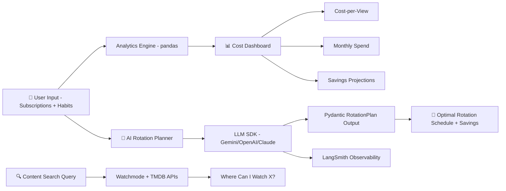

# 📺 STREAMSMART OPTIMIZER — Stage 1 Project Scope v1.0

## AI-Powered Streaming Subscription Rotation Advisor
## "Spend Less, Watch More" — Intelligent Subscription Optimization Dashboard

**Document Version:** 1.2 (SDK-First AI Architecture + Evaluation & Docker + pyproject.toml + 2026 Production Patterns)  
**Last Updated:** April 03, 2026  
**Status:** 📋 DRAFT — Awaiting Approval  
**Author:** Manuel Reyes  
**Stage:** 1 — GenAI-First Data Analyst & AI Engineer  
**Strategic Priority:** ⭐ CONSUMER-FACING AI PROJECT — Real-World Pain Point + Personal Finance Domain

---

## 📋 Table of Contents

1. [Executive Summary](#1-executive-summary)
2. [Market Validation](#2-market-validation)
3. [Business Problem](#3-business-problem)
4. [Data Architecture](#4-data-architecture)
5. [Feature Framework](#5-feature-framework)
6. [Phase 1: Data Pipeline & Analytics Dashboard](#6-phase-1-data-pipeline--analytics-dashboard-weeks-1-3)
7. [Phase 2: AI-Powered Optimization Engine](#7-phase-2-ai-powered-optimization-engine-weeks-4-6)
8. [AI Guardrails](#8-ai-guardrails)
9. [Tech Stack](#9-tech-stack)
10. [CI/CD Pipeline](#10-cicd-pipeline)
11. [Project Structure](#11-project-structure)
12. [Success Metrics](#12-success-metrics)
13. [Risk Mitigation](#13-risk-mitigation)
14. [Timeline Summary](#14-timeline-summary)
15. [Project Evolution (5 Stages)](#15-project-evolution-5-stages)

---

## 1. Executive Summary

**StreamSmart Optimizer** is a consumer-facing AI-powered dashboard that helps households optimize their streaming subscriptions through intelligent rotation scheduling, cost-per-view analytics, and AI-driven recommendations. Users input their subscriptions and viewing habits; the system analyzes their data and recommends optimal rotation schedules to maximize content access while minimizing spend.

### Why This Project Matters

**36% of U.S. streaming subscribers** are already "hopping" between services to cut costs (Antenna Research, 2025). The average household spends **$52+/month** on streaming subscriptions (Reviews.org, 2026). Yet no existing tool combines **AI-powered rotation planning + unified content search + cost analytics + savings tracking** into one platform. People currently manage this with spreadsheets and calendar reminders.

### What Makes This Project Different

| Dimension | Typical Tutorial Project | StreamSmart Optimizer |
|-----------|--------------------------|----------------------|
| **Problem** | Fabricated scenario | Real consumer pain point (36% already rotate manually) |
| **Domain** | Generic dataset | Personal finance optimization (your expertise) |
| **Data Sources** | Single static CSV | User input + Watchmode API + TMDB API (live content data) |
| **AI Architecture** | Single provider, raw text | Provider-agnostic SDK (Gemini/OpenAI/Claude) |
| **AI Outputs** | Unstructured text responses | Pydantic-validated structured outputs (RotationPlan, SavingsReport) |
| **AI Features** | Basic chatbot | LLM SDK + optimization engine + NL content search + savings forecasting |
| **Guardrails** | None | Budget validation, recommendation disclaimers, cost accuracy checks |
| **Observability** | None | Token usage, cost tracking, latency monitoring per query |
| **User Experience** | Developer-only | Consumer-friendly Streamlit with guided setup wizard |
| **CI/CD** | None | GitHub Actions on every PR |

### Core Capabilities (Stage 1)

- **Subscription Tracker:** Input and manage active streaming subscriptions with pricing
- **Viewing Habit Logger:** Log what you watch, where, and how often (manual input)
- **Cost Analytics:** Cost-per-view, cost-per-hour, monthly spend breakdown with pandas
- **Content Search:** "Where can I watch X?" via Watchmode/TMDB API integration
- **AI Rotation Planner:** LLM analyzes your habits + content calendar → optimal rotation schedule
- **Savings Forecaster:** AI projects annual savings from recommended rotation plan
- **AI Chat Interface:** Natural language queries: "What's my cheapest way to watch Marvel shows?"
- **Structured Outputs:** Pydantic-validated AI responses (RotationPlan, SavingsReport, ContentSearch)
- **AI Observability:** Token usage, cost tracking, latency monitoring per query
- **Production Practices:** GitHub Actions CI, type hints, comprehensive testing

---

## 2. Market Validation

### 2.1 The Problem Is Massive and Growing

| Statistic | Source | Implication |
|-----------|--------|-------------|
| 36% of subscribers actively rotate services | Antenna Research (2025) | Huge addressable market already doing this manually |
| $52+/month average household streaming spend | Reviews.org (2026) | Significant cost that people want to optimize |
| 23% practice subscription rotation | Antenna Research (2025) | Proven behavior, no good tool exists |
| $200+/year wasted on unused subscriptions | CNET (2025) | Clear savings opportunity |
| 12 avg subscriptions per person (all types) | Industry data (2025) | Complexity demands management tooling |

### 2.2 Competitive Landscape & Gap Analysis

| Category | Examples | What They Do | What They DON'T Do |
|----------|----------|--------------|---------------------|
| **Subscription Trackers** | Rocket Money, Trim, Hiatus | Detect charges, help cancel | No rotation planning, no content awareness |
| **Streaming Aggregators** | JustWatch, Reelgood | Unified content search | Zero subscription management |
| **Rotation Advisors** | Seasons (iOS) | Schedule subscriptions by shows | No budget caps, no AI optimization, no cancel help |
| **Generic Calculators** | AgentCalc Stack Optimizer | Basic value scoring | No content data, no AI, no personalization |

### 2.3 The Whitespace StreamSmart Fills

```
┌──────────────────────────────────────────────────────────┐
│  NO EXISTING APP COMBINES:                                │
│                                                           │
│  ✅ AI-powered rotation scheduling                        │
│  ✅ Live content availability data (where to watch)       │
│  ✅ Cost-per-view analytics                               │
│  ✅ Usage-based optimization rules                        │
│  ✅ Savings tracking & forecasting                        │
│  ✅ Natural language content search                       │
│                                                           │
│  INTO ONE PLATFORM.                                       │
│  That's the gap. That's StreamSmart.                      │
└──────────────────────────────────────────────────────────┘
```

---

## 3. Business Problem

### 3.1 User Personas

**Primary:** Budget-conscious household (25-45) managing 3-6 streaming subscriptions, spending $40-80/month, aware they're overpaying but lacks tools/time to optimize.

**Secondary:** "Cord-cutter optimizer" who actively rotates but uses spreadsheets/calendar reminders — wants automation and content intelligence.

### 3.2 User Journey (Stage 1)

```
1. SETUP (5 min)
   └─ User enters: active subscriptions, monthly prices, what they watch

2. ANALYZE (instant)
   └─ Dashboard shows: cost breakdown, cost-per-view, usage patterns

3. SEARCH (on-demand)
   └─ "Where can I watch Severance?" → API returns streaming availability

4. OPTIMIZE (AI-powered)
   └─ AI analyzes habits → recommends rotation schedule + projects savings

5. TRACK (ongoing)
   └─ User logs viewing → savings tracker updates → rotation plan adapts
```

### 3.3 Questions the System Answers

| Category | Example Questions |
|----------|-------------------|
| **Cost Analysis** | "How much am I spending per hour of content watched?" |
| **Content Discovery** | "Where can I watch The Bear for the cheapest price?" |
| **Rotation Planning** | "Which services should I keep this month based on upcoming releases?" |
| **Savings Projection** | "How much would I save if I rotated Disney+ and Max every other month?" |
| **Usage Insights** | "Which subscription has the lowest watch time vs cost?" |
| **Optimization** | "What's the optimal 2-service rotation for my watchlist under $25/month?" |

---

## 4. Data Architecture

### 4.1 Data Sources

| Source | Type | What It Provides | API/Method |
|--------|------|-----------------|------------|
| **User Input** | Manual entry (Streamlit forms) | Subscriptions, prices, viewing logs | Session state |
| **Watchmode API** | REST API (free tier: 1,000 calls/month) | Streaming availability, where to watch | `httpx` async |
| **TMDB API** | REST API (free, non-commercial) | Movie/TV metadata, ratings, genres, release dates | `httpx` async |
| **Static Pricing DB** | YAML config | Current streaming service prices (updated manually) | Config file |

### 4.2 Data Models (Pydantic)

```python
# Core data models — all validated with Pydantic v2

class Subscription(BaseModel):
    """Active streaming subscription."""
    service_name: str                    # e.g., "Netflix"
    tier: str                            # e.g., "Standard with Ads"
    monthly_cost: Decimal                # e.g., 15.49
    billing_date: int                    # Day of month (1-28)
    status: Literal["active", "paused", "cancelled"]
    subscribed_since: date

class ViewingLog(BaseModel):
    """Single viewing session."""
    title: str                           # e.g., "Severance S2E01"
    service: str                         # e.g., "Apple TV+"
    date_watched: date
    duration_minutes: int                # How long watched
    content_type: Literal["movie", "series", "documentary"]
    completed: bool                      # Finished the episode/movie?

class ContentAvailability(BaseModel):
    """Where a title can be streamed (from Watchmode/TMDB)."""
    title: str
    tmdb_id: int
    services: list[StreamingSource]      # Which platforms have it
    content_type: str
    genres: list[str]
    rating: float | None

class RotationPlan(BaseModel):
    """AI-generated rotation recommendation."""
    recommended_active: list[str]        # Keep these this month
    recommended_pause: list[str]         # Pause these this month
    upcoming_content: list[ContentHighlight]  # Why keep/add each service
    monthly_cost: Decimal                # Projected cost
    annual_savings: Decimal              # vs keeping all active
    confidence: float                    # 0-1 confidence score
    reasoning: str                       # AI explanation

class SavingsReport(BaseModel):
    """AI-generated savings analysis."""
    current_monthly_spend: Decimal
    optimized_monthly_spend: Decimal
    monthly_savings: Decimal
    annual_savings: Decimal
    cost_per_hour_current: Decimal
    cost_per_hour_optimized: Decimal
    top_recommendations: list[str]
```

### 4.3 Storage Structure

```
data/
├── config/
│   ├── services.yaml              # Streaming service pricing database
│   └── settings.yaml              # App configuration
├── cache/
│   ├── watchmode/                 # Cached API responses (TTL: 24h)
│   └── tmdb/                      # Cached API responses (TTL: 24h)
└── sample/
    └── demo_profile.json          # Demo user profile for Streamlit Cloud

logs/
├── app.log                        # Streamlit app logs
├── api.log                        # External API call logs
└── ai/
    ├── queries.log                # LLM queries, tokens, cost, latency
    └── guardrails.log             # Guardrail activation logs
```

### 4.4 API Caching Strategy

```yaml
caching:
  watchmode:
    ttl: 86400  # 24 hours — content availability changes slowly
    storage: local JSON files
    rationale: "Free tier = 1,000 calls/month. Cache aggressively."
  tmdb:
    ttl: 86400  # 24 hours
    storage: local JSON files
    rationale: "Free API but rate-limited. Cache metadata."
  strategy: |
    1. Check cache first (by title ID + region)
    2. If miss → API call → cache result
    3. Background refresh for user's watchlist titles
    4. Graceful degradation if API unavailable (use cached data)
```

---

## 5. Feature Framework

### 5.1 Pre-Built Analytics (No API Key Required)

| ID | Feature | Description | Visualization |
|----|---------|-------------|---------------|
| **SS01** | Monthly Spend Dashboard | Total cost, per-service breakdown, trend over time | Bar chart + KPI cards |
| **SS02** | Cost-Per-View Calculator | $ per episode/movie watched per service | Horizontal bar chart |
| **SS03** | Cost-Per-Hour Metric | $ per hour of content consumed per service | Comparison chart |
| **SS04** | Usage Heatmap | Which days/times you watch each service | Calendar heatmap |
| **SS05** | Service Utilization Score | Watch hours / monthly cost ratio per service | Gauge charts |
| **SS06** | Subscription Timeline | Visual timeline of active/paused subscriptions | Gantt-style chart |
| **SS07** | Watchlist Coverage | % of your watchlist available on each active service | Stacked bar |

### 5.2 AI-Powered Features (Gemini SDK)

| ID | Feature | AI Implementation | Structured Output |
|----|---------|-------------------|-------------------|
| **AI01** | Smart Rotation Planner | LLM analyzes viewing habits + content releases → rotation schedule | `RotationPlan` model |
| **AI02** | Content Search | "Find sci-fi shows under $15/month effective cost" → queries APIs | `ContentAvailability` model |
| **AI03** | Savings Optimizer | AI reviews usage vs budget → optimal subscription combo | `SavingsReport` model |
| **AI04** | Cancel Timing Alert | "You haven't watched Disney+ in 18 days. Renewal in 5 days." | `AlertNotification` model |
| **AI05** | Content Cost Estimator | "Watching The Bear costs $5.67/episode based on your usage" | `CostEstimate` model |
| **AI06** | Natural Language Chat | Free-form questions about subscriptions, content, savings | `ChatResponse` model |

---

## 6. Phase 1: Data Pipeline & Analytics Dashboard (Weeks 1-3)

### Week 1: Setup + Data Pipeline

```yaml
deliverables:
  - Project scaffold with CI/CD (GitHub Actions)
  - Pydantic data models for all entities
  - Streaming services pricing database (YAML)
  - User input forms (Streamlit): subscriptions, viewing logs
  - Session state management for user data persistence
  - Watchmode API client with caching (httpx async)
  - TMDB API client with caching (httpx async)
  - Demo profile generator for Streamlit Cloud deployment
  - Unit tests for data models and API clients
  - Cursor AI .mdc rule files
```

### Week 2: Analytics Engine

```yaml
deliverables:
  - SS01-SS07 metric calculations (pure pandas)
  - Cost-per-view and cost-per-hour calculations
  - Service utilization scoring algorithm
  - Watchlist coverage analysis (cross-reference APIs)
  - Data validation and edge case handling
  - Unit tests for all metric calculations (>80% coverage)
```

### Week 3: Dashboard Pages

```yaml
deliverables:
  - Streamlit multi-page app structure
  - Page 1: 📊 Spend Overview (SS01, SS06)
  - Page 2: 📈 Value Analysis (SS02, SS03, SS05)
  - Page 3: 📺 Content Search (API-powered "Where to watch")
  - Page 4: 🎯 My Watchlist (coverage analysis, SS07)
  - Plotly interactive charts
  - Responsive filters (date range, service, content type)
  - Demo mode toggle (pre-loaded sample data)
```

---

## 7. Phase 2: AI-Powered Optimization Engine (Weeks 4-6)

### Week 4: AI Layer Foundation

```yaml
deliverables:
  - Provider-agnostic LLM abstraction (Gemini primary)
  - Pydantic structured output schemas (RotationPlan, SavingsReport, etc.)
  - AI context builder (formats user data + API data for LLM prompts)
  - System prompt engineering for financial optimization domain
  - Unit tests for all structured output schemas
```

### Week 5: AI Features

```yaml
deliverables:
  - AI01: Smart Rotation Planner implementation
  - AI02: Natural language content search
  - AI03: Savings Optimizer with scenario comparison
  - AI04: Cancel timing alert engine (rule-based + AI commentary)
  - AI05: Content cost estimator
  - AI06: Chat interface (Page 5)
  - Guardrails system (budget validation, disclaimer injection)
  - Guardrail unit tests (>90% coverage)
```

### Week 6: Polish & Deploy

```yaml
deliverables:
  - AI observability (token/cost/latency per query)
  - Page 5: 🤖 AI Optimizer (chat + rotation planner + savings)
  - README with GIF demo, architecture diagram, live demo link
  - Streamlit Cloud deployment (FREE)
  - Demo video (3-5 minutes)
  - Final CI/CD green, all tests passing
```

---

## 8. AI Guardrails

### 8.1 Financial Advice Disclaimer

```yaml
disclaimer:
  text: |
    ⚠️ StreamSmart provides data-driven suggestions to help you make informed 
    decisions about your streaming subscriptions. This is NOT financial advice.
    Always verify pricing directly with streaming providers before making changes.
  location: "Header of every AI response + app footer"
  enforcement: "Injected automatically by guardrail middleware"
```

### 8.2 Budget Validation

```yaml
budget_guardrails:
  - name: "Price Accuracy Check"
    rule: "AI recommendations must reference pricing from services.yaml (updated monthly)"
    action: "Flag if AI cites a price not in config"
  - name: "Savings Realism Check"
    rule: "Projected savings cannot exceed current total spend"
    action: "Reject and regenerate if savings > current spend"
  - name: "Service Existence Check"
    rule: "AI can only recommend services that exist in the pricing database"
    action: "Filter out hallucinated service names"
```

### 8.3 Query Scope Guardrails

```yaml
scope_guardrails:
  allowed_topics:
    - Streaming subscription optimization
    - Content availability and search
    - Cost analysis and savings projections
    - Rotation scheduling
  blocked_topics:
    - Investment advice
    - Non-streaming financial products
    - Piracy or illegal streaming
    - Personal data beyond subscriptions
  enforcement: "Pre-query classification → reject out-of-scope queries"
```

### 8.4 AI Response Validation

```yaml
validation:
  all_responses:
    - Must pass Pydantic schema validation
    - Must include disclaimer footer
    - Monetary values must be Decimal (not float)
    - Confidence score required (0-1)
  rotation_plans:
    - Must not exceed user's stated budget
    - Must reference actual available content (API-verified)
    - Must include reasoning for each recommendation
```

---

## 9. Tech Stack

### Data Pipeline

| Category | Technology | Rationale |
|----------|------------|-----------|
| Language | Python 3.11+ | Consistent with all portfolio projects |
| Data Processing | pandas, numpy | Analytics engine |
| Data Validation | Pydantic v2 | Type-safe models + AI structured outputs |
| API Client | httpx (async) | Same pattern as Attention-Flow Catalyst |
| Configuration | YAML | Service pricing database |
| Caching | Local JSON | API response caching (TTL-based) |
| Testing | pytest | Comprehensive test suite |
| Linting | Ruff, mypy | Code quality |
| CI/CD | GitHub Actions | Automated on every PR |

### Dashboard

| Category | Technology | Rationale |
|----------|------------|-----------|
| Web Framework | Streamlit | Consistent with portfolio ecosystem |
| Charts | Plotly | Interactive visualizations |
| **AI (Primary)** | **Gemini SDK** (provider-agnostic abstraction) | SDK-first architecture |
| **Structured Outputs** | **Pydantic v2** | Type-safe AI responses |
| **AI Observability** | **LangSmith + Python logging (token/cost/latency tracking)** | Production tracing & monitoring |
| Hosting | Streamlit Cloud (FREE) |
| **AI Evaluation** | **DeepEval (recommendation quality, answer relevancy metrics)** |
| **Containerization** | **Docker (Dockerfile for deployment)** | Live demo for recruiters |

### External APIs

| API | Use Case | Tier | Rate Limit |
|-----|----------|------|------------|
| **Watchmode** | Streaming availability (where to watch) | Free | 1,000 calls/month |
| **TMDB** | Movie/TV metadata, ratings, genres | Free (non-commercial) | ~40 req/10 sec |

---

## 10. CI/CD Pipeline

```yaml
# .github/workflows/ci.yml
name: CI Pipeline
on: [push, pull_request]

jobs:
  test:
    runs-on: ubuntu-latest
    steps:
      - uses: actions/checkout@v4
      - uses: actions/setup-python@v5
        with: { python-version: '3.11' }
      - run: pip install ".[dev]"
      - run: ruff check src/ tests/
      - run: mypy src/ --ignore-missing-imports
      - run: pytest tests/ -v --cov=src --cov-report=term-missing
```

---

## 11. Project Structure

```
streamsmart-optimizer/
├── .cursor/
│   ├── rules/                    # Production standards (version-controlled)
│   │   ├── git-workflow.mdc      # alwaysApply: true — branch, commit, PR conventions
│   │   ├── learning-mode.mdc     # alwaysApply: true — learning patterns, skill progression
│   │   ├── python-production-standards.mdc  # alwaysApply: true — code style, types, testing
│   │   ├── streamlit-patterns.mdc    # Auto-attached: app/**/*.py
│   │   ├── ai-sdk-patterns.mdc       # Auto-attached: src/ai/**/*.py
│   │   └── evaluation.mdc           # Auto-attached: tests/test_eval.py
│   ├── commands/                 # Repeatable agent workflows (/command-name)
│   │   ├── draft-issue.md        # /draft-issue <goal>
│   │   ├── task-brief.md         # /task-brief <issue#>
│   │   ├── pr-prep.md            # /pr-prep
│   │   ├── review.md             # /review
│   │   ├── test.md               # /test
│   │   ├── eval.md               # /eval
│   │   └── commit-msg.md         # /commit-msg
│   ├── hooks/                    # Auto-run scripts
│   │   └── format.sh             # Auto-format (black + ruff) after agent edits
│   ├── hooks.json                # Hook configuration
│   └── plans/                    # Saved task briefs per Issue
│       └── issue-XX-task-brief.md
├── .cursorignore                 # Excludes data/logs/venv from Cursor indexing
├── .github/
│   ├── templates/                # Production workflow templates
│   │   ├── issue_template.md     # GitHub Issue format
│   │   ├── project_labels.md     # Approved labels + definitions
│   │   ├── pull_request_template.md  # PR body format
│   │   └── cursor_task_brief.md  # Agent execution contract
│   └── workflows/ci.yml
├── config/
│   ├── services.yaml              # Streaming service pricing DB
│   ├── settings.yaml              # App configuration
│   └── logging.yaml               # Logging configuration
├── data/
│   ├── cache/                     # API response cache (gitignored)
│   │   ├── watchmode/
│   │   └── tmdb/
│   └── sample/
│       └── demo_profile.json      # Demo user data
├── logs/                          # Application logs (gitignored)
│   ├── app.log
│   ├── api.log
│   ├── evaluation/                # ⭐ DeepEval evaluation results
│   └── ai/
│       ├── queries.log
│       └── guardrails.log
├── src/
│   ├── __init__.py
│   ├── py.typed                   # PEP 561 — type hint support marker
│   ├── models/
│   │   ├── __init__.py
│   │   ├── subscription.py        # Subscription, ViewingLog models
│   │   ├── content.py             # ContentAvailability, StreamingSource
│   │   └── optimization.py        # RotationPlan, SavingsReport
│   ├── api/
│   │   ├── __init__.py
│   │   ├── watchmode.py           # Watchmode API client (async)
│   │   ├── tmdb.py                # TMDB API client (async)
│   │   └── cache.py               # TTL-based response caching
│   ├── analytics/
│   │   ├── __init__.py
│   │   ├── cost_metrics.py        # SS01-SS03: spend & cost-per analytics
│   │   ├── usage_metrics.py       # SS04-SS05: usage patterns
│   │   └── coverage.py            # SS06-SS07: watchlist coverage
│   ├── ai/
│   │   ├── __init__.py
│   │   ├── provider.py            # Provider-agnostic LLM abstraction
│   │   ├── schemas.py             # Pydantic AI response models
│   │   ├── context_builder.py     # Formats user data for LLM prompts
│   │   ├── guardrails.py          # Governance as code (testable)
│   │   └── observability.py       # Token/cost/latency tracking
│   └── utils/
│       ├── __init__.py
│       ├── config.py              # YAML config loader
│       └── logger.py              # Logging configuration
├── app/
│   ├── main.py                    # Streamlit entry point
│   ├── pages/
│   │   ├── 1_📊_Spend_Overview.py
│   │   ├── 2_📈_Value_Analysis.py
│   │   ├── 3_📺_Content_Search.py
│   │   ├── 4_🎯_My_Watchlist.py
│   │   └── 5_🤖_AI_Optimizer.py
│   └── components/
│       ├── input_forms.py         # Subscription & viewing log forms
│       ├── charts.py              # Reusable Plotly chart components
│       └── ai_chat.py             # AI chat interface component
├── tests/
│   ├── conftest.py                # Shared fixtures, mock API responses, test data
│   ├── test_models.py
│   ├── test_api_clients.py
│   ├── test_analytics.py
│   ├── test_ai_schemas.py
│   ├── test_ai_guardrails.py
│   ├── test_eval.py               # ⭐ DeepEval AI quality evaluation tests
│   └── eval_dataset.json          # ⭐ 30+ recommendation query-response pairs for evaluation
├── Dockerfile                     # Container definition for deployment
├── .dockerignore                  # Excludes .git, logs, data/cache, tests from image
├── .env.example                   # Required environment variables template
├── .gitignore
├── CONTRIBUTING.md                # Branch naming, commit style, PR process
├── LICENSE                        # MIT License
├── Makefile                       # make test, make lint, make eval, make docker-build
├── pyproject.toml                 # Project metadata, dependencies, tool config (PEP 621)
└── README.md
```

---

## 12. Success Metrics

### Phase 1 (Pipeline + Dashboard)

| Metric | Target |
|--------|--------|
| All data models validated | ✅ Pydantic schemas pass |
| API clients working | Watchmode + TMDB with caching |
| SS01-SS07 metrics calculating | ✅ All 7 working |
| Dashboard pages rendering | 4/4 (analytics pages) |
| Demo mode functional | ✅ Pre-loaded sample profile |
| Test coverage | >80% |
| CI pipeline | Green |

### Phase 2 (AI Optimizer)

| Metric | Target |
|--------|--------|
| AI features working | AI01-AI06 |
| Structured outputs | 100% Pydantic-validated |
| Provider switching | Gemini ↔ OpenAI works via config |
| AI observability | Token/cost/latency logged per query |
| Guardrail test coverage | >90% |
| Financial disclaimers | 100% of AI responses |
| Deployment | Live on Streamlit Cloud |
| Page load time | <3 seconds |
| Demo GIF | In README |
| Demo video | 3-5 minutes |

### Portfolio Impact

| Platform | Goal |
|----------|------|
| **GitHub** | Professional README with GIF, live demo link, architecture diagram, market data |
| **LinkedIn** | Launch post: "36% rotate manually — I built an AI tool to do it smarter" |
| **Streamlit Cloud** | Live public demo (sample data) |
| **Resume** | "Built AI-powered streaming subscription optimizer serving real consumer need" |

---

## 13. Risk Mitigation

| Risk | Mitigation |
|------|------------|
| Watchmode free tier limits (1K/month) | Aggressive caching (24h TTL), batch queries, fallback to TMDB |
| TMDB rate limits | httpx with rate limiting, retry logic, local cache |
| AI hallucinating service prices | Guardrail validates against services.yaml pricing DB |
| AI recommending non-existent services | Filter against known service list before response |
| API downtime | Graceful degradation — dashboard works with cached/manual data |
| Provider lock-in | Provider-agnostic abstraction layer (swap via config) |
| AI cost overruns | Token/cost observability, rate limits, caching |
| Price data staleness | Monthly manual update cycle + last-updated timestamp displayed |
| Scope creep into subscription automation | Hard boundary: advisory only in Stage 1 (no account actions) |

---


### AI Evaluation Layer (2026 Production Requirement)

Every AI-powered feature includes measurable quality evaluation using DeepEval.

**Framework:** DeepEval (pytest-compatible, open-source)  
**Install:** `pip install deepeval`

| Metric | What It Measures | Target Score |
|--------|-----------------|-------------|
| Answer Relevancy | Does the AI response address the user's question? | > 0.8 |
| Faithfulness | Is the response grounded in provided context? | > 0.85 |
| Hallucination | Does the output contain fabricated info? | < 0.15 |

**Implementation:**
- Evaluation test cases live in `tests/test_eval.py`
- Run with: `deepeval test run tests/test_eval.py`
- Results logged to `logs/evaluation/` for README metrics
- CI pipeline includes evaluation gate (fail build if scores drop)

**Why This Matters for Portfolio:**
Hiring managers in 2026 specifically scan for evaluation-driven development.
Adding measurable AI quality metrics signals production maturity beyond typical junior portfolios.


### Docker Support (Containerization)

**Dockerfile** provided for reproducible local development and deployment.

```dockerfile
# Dockerfile
FROM python:3.11-slim
WORKDIR /app
COPY pyproject.toml .
RUN pip install --no-cache-dir .
COPY . .
EXPOSE 8501
CMD ["streamlit", "run", "app/Home.py", "--server.port=8501"]
```

**`.dockerignore`** (keeps image small and secure):
```
.git
.gitignore
.github/
.cursor/
.env
.env.example
*.md
LICENSE
CONTRIBUTING.md
Makefile
tests/
logs/
data/cache/
__pycache__/
*.pyc
.pytest_cache/
.venv/
```

**Run locally:**
```bash
docker build -t streamsmart-optimizer .
docker run -p 8501:8501 --env-file .env streamsmart-optimizer
```

**Why This Matters for Portfolio:**
Docker appears in 60%+ of AI/ML job postings. Including a Dockerfile
shows deployment readiness — critical for Junior AI Engineer applications.


---

## 14. Timeline Summary

```
Week 1 ──── Week 2 ──── Week 3 ──── Week 4 ──── Week 5 ──── Week 6
  │           │           │           │           │           │
  ▼           ▼           ▼           ▼           ▼           ▼
Setup       Analytics   Dashboard   AI Layer    AI Features  Deploy
Models       Engine      Pages     Foundation   Rotation     Polish
APIs         Metrics     Charts    Structured   Savings      Demo
Cache        Tests       Filters   Outputs      Chat         README

├──────── Phase 1: Pipeline ──────┼──────── Phase 2: AI Engine ────────┤
     + Analytics Dashboard               + AI Optimization Features
```

### Key Milestones

| Week | Milestone |
|------|-----------|
| **Week 1** | ✅ Data models, API clients, caching — CI green |
| **Week 3** | ✅ All 4 analytics dashboard pages rendering with data |
| **Week 6** | ✅ AI optimizer deployed to Streamlit Cloud, README with GIF |

---

## 15. Project Evolution (5 Stages)

This project is designed to evolve through all 5 stages of the career roadmap:

| Stage | Role | Enhancements |
|-------|------|--------------|
| **1 (THIS SCOPE)** | GenAI-First Data Analyst | Advisory dashboard + AI rotation planner + content search |
| **2** | GenAI Data Engineer | AWS deployment, PostgreSQL, Airflow for price monitoring, vector DB for content similarity |
| **3** | ML Engineer | ML-based viewing prediction, churn models, personalized recommendations with collaborative filtering |
| **4** | Agentic AI Engineer | **Full automation: LangGraph agents for cancel/resubscribe, MCP tool integration, multi-agent orchestration** |
| **5** | Senior LLM Engineer | Production SaaS, LLMOps evaluation, monetization, mobile app, user accounts |

### Stage 1 → Stage 4-5 Bridge

```
STAGE 1 (NOW):          "Tell me what to do" (Advisory AI)
  │
  │   Skills to build: AWS, Vector DBs, RAG, ML, LangGraph, MCP
  │
  ▼
STAGE 4-5 (FUTURE):     "Do it for me" (Agentic AI)
```

**The Stage 1 advisory version seeds every future capability.** The rotation planning logic, content data pipeline, and savings models all carry forward into the full agentic platform.

---

## ✅ Approval Checklist

- [ ] Data models correctly defined (Subscription, ViewingLog, RotationPlan, SavingsReport)
- [ ] API strategy confirmed (Watchmode free tier + TMDB + caching)
- [ ] AI architecture aligned with portfolio ecosystem (same SDK patterns as DVA, ODI, AFC)
- [ ] Guardrails scoped (financial disclaimers, price validation, scope limits)
- [ ] Stage 1 boundary clear: advisory only, no account automation
- [ ] Timeline realistic (6 weeks at 25 hrs/week)
- [ ] Scope appropriately focused (not creeping into Stage 4-5 features)

---

## Quick Reference

```
┌─────────────────────────────────────────────────────────────┐
│         STREAMSMART OPTIMIZER v1.0 (Stage 1)                 │
│     ⭐ Consumer-Facing AI + Personal Finance Domain          │
│     "Spend Less, Watch More" — Subscription Optimization     │
├─────────────────────────────────────────────────────────────┤
│  📺 DATA SOURCES                                             │
│     • User input (subscriptions, viewing logs)               │
│     • Watchmode API (streaming availability)                 │
│     • TMDB API (content metadata, ratings)                   │
│     • Static pricing database (YAML config)                  │
├─────────────────────────────────────────────────────────────┤
│  📊 ANALYTICS (No API Key Required)                          │
│     • 7 pre-built metrics (SS01-SS07)                        │
│     • Cost-per-view, cost-per-hour calculations              │
│     • Service utilization scoring                            │
│     • Watchlist coverage analysis                            │
├─────────────────────────────────────────────────────────────┤
│  🤖 AI FEATURES (2026 Production Patterns)                   │
│     • LLM SDK (Gemini primary, OpenAI/Claude supported)      │
│     • Provider-agnostic abstraction layer                    │
│     • Pydantic-validated structured outputs                  │
│     • AI01-AI06: Rotation, Search, Savings, Alerts, Chat     │
│     • Financial disclaimer guardrails                        │
│     • AI observability (tokens, cost, latency per query)     │
├─────────────────────────────────────────────────────────────┤
│  🔧 ENGINEERING                                              │
│     • httpx async API clients with caching                   │
│     • Python logging + AI observability                      │
│     • GitHub Actions CI                                      │
│     • Streamlit Cloud deployment (FREE)                      │
│     • Test coverage >80%                                     │
├─────────────────────────────────────────────────────────────┤
│  🎯 MARKET VALIDATION                                        │
│     • 36% of subscribers already rotate manually             │
│     • $52+/month avg household streaming spend               │
│     • No existing tool combines AI + content + optimization  │
│     • Clear consumer pain point with finance domain tie-in   │
├─────────────────────────────────────────────────────────────┤
│  ⏱️ TIMELINE                                                 │
│     • 6 weeks total (25 hrs/week)                            │
│     • Phase 1: Pipeline + Dashboard (Weeks 1-3)              │
│     • Phase 2: AI Optimizer + Deploy (Weeks 4-6)             │
└─────────────────────────────────────────────────────────────┘
```

---


## Production README Standard

> **v8.2 Cross-Project Standard:** Every project README must include these elements to meet production-grade portfolio quality.

| Element | Description | Format |
|---------|-------------|--------|
| **Mermaid Architecture Diagram** | System flow rendered inline on GitHub — no external images needed | ```` ```mermaid ```` code block |
| **Dockerfile** | Containerized local setup for reproducibility | `Dockerfile` in project root |
| **Evaluation Metrics Table** | DeepEval + pytest results summary showing AI quality measurements | Markdown table in README |
| **Demo GIF** | 15-30 second walkthrough of key functionality | Embedded GIF in README hero section |
| **"What I Learned" Section** | Key technical takeaways, patterns discovered, and challenges overcome | README section before footer |

### Architecture Diagram (Mermaid)



> **Why Mermaid?** Renders directly in GitHub README — no PNG files to maintain, stays in sync with code, signals architectural thinking to recruiters. Recruiters see the diagram without clicking external links.

---

**Document Status:** 📋 DRAFT (v1.2 — SDK-First AI Architecture + pyproject.toml + 2026 Production Patterns)  
**Date:** April 03, 2026  
**Stage:** 1 — GenAI-First Data Analyst & AI Engineer  
**Total Timeline:** 6 weeks

*"Real consumer pain point + Finance domain expertise + SDK-first AI + Structured outputs + Live content APIs = Portfolio project that recruiters AND users actually care about"* 🚀