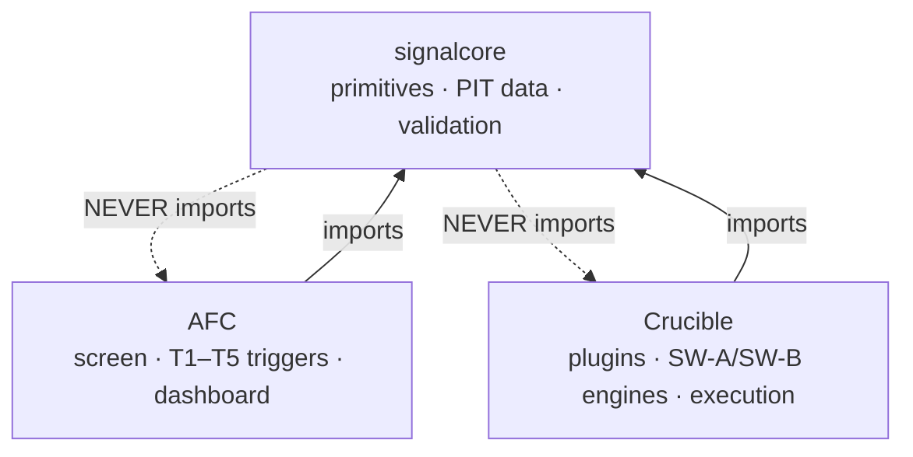

# SHARED SIGNAL-PRIMITIVES LIBRARY — BOUNDARY SPEC v1

*The dependency contract between **AFC** (Attention-Flow Catalyst) and **Crucible**. Defines exactly which code is shared, which stays project-specific, and the rules that keep the boundary from rotting.*

> **Working name:** `signalcore` (plain) — thematic alternatives: `bedrock` / `substrate` (the common foundation both projects stand on). Pick one; this doc uses `signalcore`.
>
> **Why this exists:** AFC and Crucible are locked as **siblings, no merge** (Crucible §20, Decision #2 — split on *liquidity + execution*, not timeframe). They share a thin layer of accumulation/dilution/data primitives and nothing else. This doc draws that line so the same VDU/OBV/dilution math is written **once**, without dragging the two projects toward a merge they explicitly rejected.

---

## 1. The boundary in one rule

> **`signalcore` holds parameterized, point-in-time-safe PRIMITIVES (pure computation + as-of data access + validation stats). It holds NO universe definitions, NO trigger/strategy logic, NO thresholds, NO execution, NO AI. Each project owns those.**

A primitive is a stateless function: *data in → value out*, computing only from what it's passed. The **function** is shared; the **parameter values** that turn it into a signal are project-specific. `vdu_present(df, pct, window)` lives in `signalcore`; AFC's `pct=0.50` and Crucible's SW-B `vdu_pct=0.50` (as a *gate*) live in each project's config.

---

## 2. What lives in `signalcore` (shared)

| Module | Functions / contents | Consumed by |
|---|---|---|
| `signalcore.volume` | `obv`, `vdu_present`, `distribution_days`, `accumulation_days`, `ud_volume_ratio`, `rvol`, `accumulation_score` (close-location-value × volume / ADL), `quiet_accumulation` (price-flat + OBV-rising) | AFC T4a–e · Crucible §9A footprint |
| `signalcore.dilution` | EDGAR fetch + parse (S-1/S-3/424B5/8-K/EFFECT) → structured filing records; `dilution_state(ticker, asof)` → {CLEAR, OVERHANG, ACTIVE_DEAL, CLOSED} + `days_since_last_event` | AFC T5 (state = setup) · Crucible dilution gate (recent filing = exclude) |
| `signalcore.relative` | `rs_line(close, bench)`, `relative_return(series, bench, lookback)`, `cross_sectional_rank(returns)`, `rs_line_new_high`, generic `rank_series_by(metric)` | AFC sector screen · Crucible RS percentile + sector ranking |
| `signalcore.indicators` | `sma`, `ema`, `atr`, `rsi`, `macd` — vanilla TA, no strategy semantics | both |
| `signalcore.data` | **as-of accessor** (returns only rows ≤ `t`), corporate-actions adjustment (splits/divs), **PIT sector membership** (built from SPDR holdings snapshots), **historical universe snapshots** (survivorship) | both (identical PIT discipline) |
| `signalcore.validation` | walk-forward splitter, **purged k-fold + embargo** (López de Prado), `bootstrap_ci`, `de_cluster` (per-ticker N-day rule), calibration (Brier/reliability) | AFC backtest methodology · Crucible walk-forward CV |
| `signalcore.calendar` | exchange calendar, session bounds, half-days | both |

**Design constraints on every `signalcore` function:**
- **PIT-safe by construction.** Pure functions; no hidden I/O, no global state, no future access. The *only* module that does I/O is `signalcore.data`, and it **enforces as-of semantics** — a function asked for date `t` cannot return a row dated `> t`.
- **Parameterized, not configured.** Defaults are arguments, never baked-in constants a project would have to fork.
- **Deterministic.** Same inputs → same output, always (this is what makes both projects' backtests reproducible).

---

## 3. What stays in AFC (never in `signalcore`)

| Stays in AFC | Why |
|---|---|
| Universe screen (`< $5`, micro-cap `< $500M`, small float, top-3 sector by 20-day return) | AFC's universe definition — config, not primitive |
| **T1 insider-buy trigger** (Form-4 *interpretation*) | `signalcore` fetches/parses filings; deciding "this fires T1" is AFC's signal logic |
| **T2 Wikipedia / T3 news** collectors + spike triggers | Attention-as-trigger is AFC's entire thesis; Crucible never triggers on attention |
| +10%-in-3-days labeling, trigger leaderboard, hit-rate research | AFC's research question and outputs |
| AI dashboard, PandasAI, DeepEval/SelfCheckGPT/FActScore | AFC's product + eval layer |

## 4. What stays in Crucible (never in `signalcore`)

| Stays in Crucible | Why |
|---|---|
| Strategy plugin abstraction (Protocol/ABC/registry, `on_bar`, `CrossSection`, `holding_model`) | Crucible's core engine |
| **SW-A v3 / SW-B logic** (archetype detection, VCP detector, confirmation stacks, sizing tiers) | The engines — they *consume* `signalcore` primitives but assemble them into strategies |
| Execution / paper / live (NautilusTrader, brokers, two-speed loop) | Crucible executes; AFC is read-only |
| The Wall, sealed OOS vault, overfitting-budget ledger, engine-parity gate, 3-gate pipeline | Crucible governance / audit artifacts |
| Prediction Engine (§6.5), ML overlay policy (§6.9), forecasting wing (§19) | Crucible research wings |

> **Note the asymmetry that proves the boundary is real:** dilution and volume-accumulation primitives are *shared*, but AFC trades the post-dilution micro-cap *as a setup* while Crucible *excludes* any liquid name with a recent filing. Same `signalcore.dilution` call, opposite decision. That's exactly what a primitive layer should allow.

---

## 5. Dependency direction (acyclic — hard rule)



`signalcore` depends on **nothing** project-specific. If you ever feel the urge to `import afc` or `import crucible` inside `signalcore`, the thing you're writing is not a primitive — it's project logic in the wrong place. Stop.

---

## 6. Governance (so one definition doesn't silently break two projects)

- **`signalcore` is its own versioned package** with its own test suite. Both projects pin a version.
- **A change to a primitive is a deliberate, semver'd event.** Redefining `vdu_present` propagates to *both* consumers by design — that's the benefit — so breaking changes get a major bump and a note in both projects' changelogs. This is the same "change the canonical definition first, then propagate" discipline already in your swing docs.
- **Determinism + PIT are tested, not assumed.** `signalcore` ships leakage tests (assert no function returns data dated `> t`) and golden-value tests (assert stable outputs). Both are CI gates — they protect *both* projects at once.
- **Governance artifacts do NOT move into `signalcore`.** The validation *algorithms* (walk-forward, bootstrap) are shared; the *sealed OOS vault*, *overfitting ledger*, and *who is allowed to touch test data* stay in each project — they're audit trails, not computation.

---

## 7. Anti-patterns (the boundary rotting)

- ❌ A threshold constant (`0.50`, `1.5`, `RS ≥ 80`) hard-coded in `signalcore`. → It's a default argument or it lives in the project's config.
- ❌ A strategy decision (`if vcp.valid and breakout: enter`) in `signalcore`. → Engines stay in Crucible.
- ❌ AFC's `< $5` screen or Crucible's `ADV ≥ 1M` screen in `signalcore`. → Universe is project-specific.
- ❌ `signalcore` importing either project, or reaching into a project's lakehouse path. → Inverts the dependency; forbidden.
- ❌ Attention/insider *trigger logic* in `signalcore`. → Only the *filing fetch/parse* is shared; interpretation is AFC's.

---

## 8. Suggested repo layout

```
signalcore/                      # shared package (its own repo or monorepo pkg)
  signalcore/
    volume.py  dilution.py  relative.py  indicators.py
    data.py    validation.py  calendar.py
  tests/   (leakage tests · golden-value tests)
  pyproject.toml   # versioned, semver'd

afc/                 # imports signalcore
  screen/  triggers/ (T1..T5)  backtest/  dashboard/  ...

crucible/            # imports signalcore
  strategies/ (sw_a_v3, sw_b)  engine/  execution/  vault/  ...
```

---

*Boundary spec only. Defines code ownership and dependency direction; makes no claim about either project's edge. Keep `signalcore` thin — the moment it knows what a "trade" is, the boundary has failed.*
