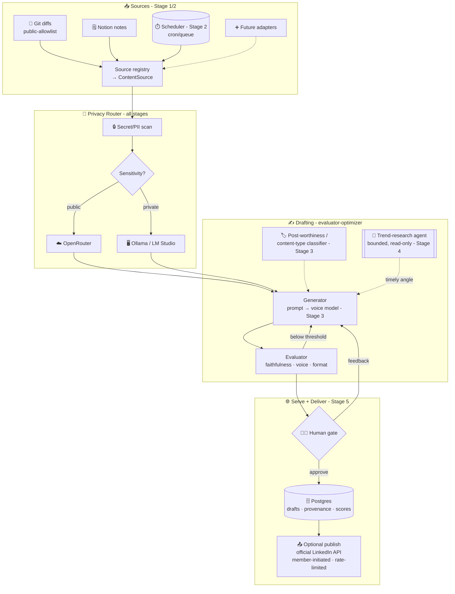

## 📣 CADENCE — Full Production Scope v1.0

## Build-in-Public Content-Operations Platform — Multi-Source → Review-Ready Posts
## "From diff to draft" — from a local diff-to-draft loop to a production, ToS-compliant content pipeline with one bounded research agent

**Document Version:** 1.0 (Full-Production companion to the Stage-1 scope `CADENCE_CONTENT_SCOPE_v1_0_STAGE1.md`. Details all 5 stages — the Stage-1 local-first ingest→draft→evaluate→human-gate loop evolves into a **persisted, scheduled pipeline**, an **earned ML voice/classifier overlay**, a **bounded trend-research agent + observability**, and a **production FastAPI service with LLMOps eval gates and optional ToS-compliant publish of approved drafts via the official LinkedIn API**. Additive — Stage-1 build scope unchanged. **Not a portfolio/flagship project** — a production-grade **support tool** in a separate GitHub hub. Stage labels map every capability to your roadmap so you always know where you are skill-wise. Synced to roadmap v9.0.)
**Last Updated:** July 2, 2026
**Status:** 📋 DRAFT — Future Vision (Stages 2–5 require progressive skill acquisition)
**Author:** Manuel Reyes
**Stages Covered:** 1 (foundation, built first) → 2 (Data Engineer) → 3 (ML Engineer) → 4 (Agentic AI Engineer) → 5 (Senior LLM Engineer)
**Predecessor:** Cadence Stage 1 (ingest → draft → evaluate → human gate — `..._v1_0_STAGE1.md`)
**Strategic Role:** 🛠️ SUPPORT AUTOMATION — production-grade, but never portfolio evidence
**Repo Hub:** Separate tooling hub (`manuel-reyes-ml/cadence`) — **outside** the `*-analyst` flagship set

---

## 📋 Table of Contents

1. [Executive Summary](#1-executive-summary)
2. [Vision: From Diff-to-Draft Loop to Content Pipeline](#2-vision-from-diff-to-draft-loop-to-content-pipeline)
3. [Positioning: A Support Tool, Not a Portfolio Project](#3-positioning-a-support-tool-not-a-portfolio-project)
4. [Platform Architecture](#4-platform-architecture)
5. [The Source + Routing Core (Signature Capability)](#5-the-source--routing-core-signature-capability)
6. [Workflow + Agent Design](#6-workflow--agent-design)
7. [Feature Framework: Complete Tool](#7-feature-framework-complete-tool)
8. [The Trend-Research Agent (Bounded Node)](#8-the-trend-research-agent-bounded-node)
9. [Voice Adaptation: Prompt → Earned ML Overlay](#9-voice-adaptation-prompt--earned-ml-overlay)
10. [AI Guardrails & Safety](#10-ai-guardrails--safety)
11. [Tech Stack: Production](#11-tech-stack-production)
12. [Infrastructure & DevOps](#12-infrastructure--devops)
13. [LLMOps & Evaluation](#13-llmops--evaluation)
14. [Data Architecture: Production Scale](#14-data-architecture-production-scale)
15. [Security, Privacy & Platform Compliance](#15-security-privacy--platform-compliance)
16. [Project Structure](#16-project-structure)
17. [Development Phases](#17-development-phases)
18. [Project Evolution (5 Stages)](#18-project-evolution-5-stages)
19. [Success Metrics](#19-success-metrics)
20. [Risk Mitigation](#20-risk-mitigation)
21. [Skills Required (Roadmap Alignment)](#21-skills-required-roadmap-alignment)

---

## 1. Executive Summary

**Cadence (Full Production)** is the all-stages elaboration of the Stage-1 diff-to-draft tool. The Stage-1 system reads a **git diff (public-allowlist) or a Notion note**, tags its sensitivity, drafts a LinkedIn post grounded in that source, scores it (faithfulness / voice / format), and stops at a **mandatory human gate** — nothing auto-posts. This document carries that foundation through four more stages into a **production content-operations pipeline**: persisted history and scheduled ingestion (Stage 2), an *earned* ML voice/classifier overlay (Stage 3), a **single bounded trend-research agent** plus observability (Stage 4), and a FastAPI service with LLMOps eval gates and **optional ToS-compliant publishing of approved drafts** (Stage 5).

The signature architectural stance never changes: **it's a workflow, not an autonomous agent.** The pipeline — ingest → route → draft → evaluate → human-gate → (optionally) publish — is a control flow *you* own. Agency is spent in exactly **one** place, the trend-research node, because "what's resonating on LinkedIn now" is the only genuinely un-mappable sub-task. This "≈90% deterministic workflow + one justified read-only agent" split is the design thesis, and it holds from Stage 1 to Stage 5.

The second constant is **source-aware privacy routing**: proprietary content is pinned to local models and physically cannot reach a cloud API, enforced in code and proven by a CI test. The privacy principle your roadmap *sells* is a feature this tool *enforces* — at every stage.

### Stage 1 vs Full Production

| Dimension | Stage 1 (Local Loop) | Full Production (Content Pipeline) |
|-----------|----------------------|-------------------------------------|
| **Ingestion** | Git diff + Notion, on demand | + scheduled/batch ingestion; pluggable source registry |
| **Persistence** | Files in `/drafts` | PostgreSQL: drafts, provenance, eval scores, post history |
| **Voice** | Prompt + few-shot + seed corpus | *Earned* LoRA/PEFT voice model (must beat prompt baseline) |
| **Classification** | None | Post-worthiness / content-type classifier |
| **Agent** | None | One bounded, read-only trend-research agent (LangGraph) |
| **Serving** | CLI / optional Streamlit | FastAPI service + review UI |
| **Eval** | DeepEval + pytest, manual | LLMOps CI: voice/faithfulness regression gates, traces |
| **Publish** | Human copies the draft | Optional: **approved** draft published via official LinkedIn API (member-initiated, rate-limited) |
| **Deploy** | Local / Docker | Docker + small always-on service (local or cloud) |

> **The Stage-1 contract is never thrown away.** The `ContentSource` / `PostDraft` schemas, the sensitivity-tag-drives-routing rule, the faithfulness gate, and the mandatory human gate all carry forward unchanged — each later stage adds persistence, accuracy, one agent, and compliant delivery *behind* that stable contract.

---

## 2. Vision: From Diff-to-Draft Loop to Content Pipeline

```
STAGE 1 (NOW):   "Read my diff/note, draft a faithful post in my voice, let me approve it."  (local loop)
  │
  │   + Postgres history + scheduled/batch ingestion (Stage 2)
  │   + earned voice fine-tune + post-worthiness classifier (Stage 3)
  │   + one bounded trend-research agent + observability (Stage 4)
  │   + FastAPI + LLMOps eval gates + optional ToS-compliant publish (Stage 5)
  ▼
STAGE 5 (GOAL):  "Turn my week's public work + notes into review-ready posts with a timely angle,
                  scored and traced — proprietary code never leaving my machine, and me as the
                  only publish button (or one compliant API call on drafts I've approved)."  (pipeline)
```

The promise sharpens but never changes character: **your real work, in your voice, faithful to what it did, human-gated, privacy-safe.** Stage 1 proves the loop locally; Stage 5 proves it holds as a durable, observable, compliant pipeline — the difference between "a prompt that writes posts" and "content operations you actually run."

---

## 3. Positioning: A Support Tool, Not a Portfolio Project

Your portfolio is deliberately finance/compliance-themed and tightly curated (PolicyPulse, FormSense, StreamSmart, AFC, Crucible + DataVault, ODI, SignalCore). "AI content generator" is the single most saturated category recruiters see — on the flagship shelf it would dilute, not strengthen. So Cadence is scoped as infrastructure for your *visibility*, built to production standard but positioned as support.

| Rule | Detail |
|------|--------|
| Repo | Separate tooling hub (`manuel-reyes-ml/cadence`), not the `data-portfolio` set |
| Count | Not one of the 8 portfolio projects; not part of the 5-stage flagship evolution |
| Standard | Production README standard still applies (Mermaid, Docker, eval table, GIF, "What I Learned") |
| Public mention | Only ever as a *build-in-public support story*, never as data/ML portfolio evidence |
| Stage labels | Used purely as a **skills tracker** — so you know which roadmap skills each stage exercises |

> 🧭 **Why still take it to production-grade?** Because a support tool built to the same standard is (a) actually reliable, (b) a genuine skills workout that keeps your Stage-2→5 muscles warm, and (c) safe to show if anyone stumbles on it. Production-grade ≠ flagship. It just means done properly.

---

## 4. Platform Architecture



Every stage slots in behind a stable interface: the **scheduler + Postgres** (Stage 2) feed an unchanged drafting loop; the **voice model + classifier** (Stage 3) swap in behind the same `PostDraft` output; the **trend agent** (Stage 4) only *adds context* to the generator; the **FastAPI service + optional publish** (Stage 5) wrap the same human-gated contract.

---

## 5. The Source + Routing Core (Signature Capability)

Cadence's defining pieces are **multi-source ingestion behind a frozen schema** and **source-aware privacy routing baked in at ingest** — the combination that makes an "AI post tool" finance-credible.

### 5.1 The frozen contract (all stages)

```python
Sensitivity(Enum): PUBLIC | PRIVATE            # set at ingest → drives routing
ContentSource(source_id, kind, sensitivity, title, raw_text, metadata, secrets_scanned)
PostDraft(platform, hook, body, source_ids, faithfulness, voice_score, format_ok,
          iteration, approved)                 # approved flips ONLY at the human gate
```

### 5.2 Source-aware privacy routing (enforced, not conventional)

| Sensitivity | Routing | Models |
|-------------|---------|--------|
| `PUBLIC` | Cloud allowed | OpenRouter — MiniMax M3 (default), DeepSeek V4 Flash (bulk), GLM-5.2 / Qwen3.7 Max (alternates) |
| `PRIVATE` | **Local only — never leaves machine** | Ollama (`qwen3.5-16k`) / LM Studio (MLX Qwen3.5 9B) |

The cloud client is **never constructed** for a `PRIVATE` source; a CI test asserts zero cloud calls on private fixtures (§13). This is the enforcement mechanism, not a guideline.

### 5.3 Pluggable source registry (Stage 2+)

Adapters implement one `SourceAdapter` interface (`fetch() -> list[ContentSource]`) and register. Candidates: changelogs, merged-PR summaries, a learnings journal, eval-run artifacts. The routing + eval + human-gate contract never changes as sources are added.

---

## 6. Workflow + Agent Design

Implements Anthropic's **evaluator-optimizer** workflow for drafting plus a single **agent** node for trend research — the explicit "simplest pattern that passes evaluation; reserve agency for what you can't pre-map" split cited in your roadmap.

### 6.1 The drafting workflow (deterministic control flow you own)

```
normalize(source) → route_model(sensitivity)
   → generate_draft(platform)                 # generator (prompt → voice model, Stage 3)
      → evaluate(draft)                        # evaluator rubric
         ├─ passes                → human gate
         ├─ below threshold       → regenerate with feedback (capped)
         └─ round-cap reached     → best-so-far → human gate
   → human gate: approve | feedback→regenerate
   → persist approved draft (Stage 2) → optional compliant publish (Stage 5)
```

### 6.2 The one agentic node (Stage 4)

The **trend-research agent** answers an open-ended question ("what's resonating on LinkedIn for AI-engineering / finance-to-tech now?") via read-only web search. It's the only component where the model directs its own tool calls — justified because the answer can't be pre-scripted. It returns *angle suggestions* to the generator, never final copy, and never touches a private source or a publish path. (Detail: §8.)

---

## 7. Feature Framework: Complete Tool

| Capability | Stage introduced | Description |
|-----------|------------------|-------------|
| Git-diff + Notion ingest | 1 | Public-allowlist diff + notes → `ContentSource` |
| Secret/PII scan + no-auto-post | 1 | Ingest+final scan; human is the publish button |
| Source-aware privacy routing | 1 | public → OpenRouter; private → local only |
| Evaluator-optimizer drafting | 1 | Generator + evaluator rubric; capped loop |
| DeepEval scoring (faithfulness/voice/format) | 1 | Automated gate before the human sees it |
| Postgres history + provenance | 2 | Drafts, sources, scores, post history persisted |
| Scheduled / batch ingestion | 2 | cron/queue; "draft my week" in one run |
| Pluggable source registry | 2 | Add sources without touching the pipeline |
| Earned voice fine-tune (LoRA/PEFT) | 3 | Adapt a small local model to your voice (beats baseline) |
| Post-worthiness / content-type classifier | 3 | Which diffs are worth posting; which pillar they fit |
| Bounded trend-research agent | 4 | Read-only web search → timely angle suggestions |
| Observability / tracing | 4 | Trace loop + agent runs (tokens, cost, rounds) |
| Optional MCP tool wrapping | 4 | Expose ingest/draft as MCP tools (Claude Desktop/Cursor) |
| FastAPI service + review UI | 5 | Durable service around the human-gated loop |
| LLMOps eval gates | 5 | CI voice/faithfulness regression tracking |
| Optional ToS-compliant publish | 5 | Approved drafts via official LinkedIn API (rate-limited) |

---

## 8. The Trend-Research Agent (Bounded Node)

The single justified agent — everything about it is scoped to stay small, safe, and read-only.

| Property | Spec |
|----------|------|
| **Why an agent** | "What's trending on LinkedIn for my niche now" is open-ended → tool-use loop warranted |
| **Framework** | LangGraph (Stage-4 skill; same stack as your flagship agentic loops) |
| **Tools** | `web_search`, `web_fetch` (read-only); optional public LinkedIn-News-topic reads |
| **Output** | 2–4 angle suggestions with source links → optional context to the generator |
| **Hard limits** | read-only; round-cap; token/cost budget; **no LinkedIn scraping**; no writes; no publish; no private-source access |
| **Faithfulness still applies** | Any draft using a suggested angle is still gated ≥ 0.90 against the actual source |

> **No scraping — by design and by ToS.** LinkedIn prohibits scraping and browser automation; the agent uses the open web only. It cannot be the thing that decides to publish, and cannot read a private source. Agency where it's earned, nowhere else.

---

## 9. Voice Adaptation: Prompt → Earned ML Overlay (Stage 3)

Stage 3 is where a content tool *could* over-reach; Cadence keeps it honest with an **earned-overlay policy** (mirroring Crucible's "ML is an earned overlay, never a foundation").

- **Voice fine-tune (LoRA/PEFT)** on your corpus of *approved* posts, on a small local model — adopted **only if** it beats the prompt+few-shot baseline on the voice metric. If it doesn't, the prompt baseline stays. Runs local (private corpus never leaves the machine).
- **Post-worthiness classifier** — scores which diffs are worth a post at all (avoids "I renamed a variable" posts); a **content-type classifier** tags the pillar (build-log / insight / finance-bridge / tool-tip / career-lesson) to pick the right template.
- **Discipline:** labeled eval set; the model must beat the baseline to ship; otherwise it's documented as "tried, didn't beat baseline" (still a portfolio-worthy *lesson*, just not a forced feature).

> This is the honest answer to "where's the Stage-3 ML skill in a content tool?" — voice adaptation + classification are genuine, non-forced ML applications. If neither beats its baseline, Stage 3 for Cadence is legitimately "prompt engineering won," and that's a real result, not a gap.

---

## 10. AI Guardrails & Safety

| Guardrail | Stage | What it enforces |
|-----------|-------|------------------|
| Public-repo allowlist | 1 | Proprietary repos physically cannot be ingested |
| Secret/PII scan (ingest + final) | 1 | No keys/tokens/SSNs in a source or draft — hard fail |
| **No auto-post (hard rule)** | 1 | Human is the publish button (Stage 5 publish acts only on **approved** drafts) |
| Faithfulness gate ≥ 0.90 | 1 | Draft claiming what the source doesn't support is rejected |
| Private → local-only routing | 1 | Proprietary content never reaches a cloud API (enforced + CI-tested) |
| Loop round-cap | 1 | Evaluator-optimizer + trend agent both capped |
| Trend agent read-only | 4 | Search/fetch only; no scraping, no writes, no publish |
| Voice-model earned-overlay gate | 3 | Fine-tune ships only if it beats baseline |
| **Publish rate-limit + member-initiated** | 5 | Official API only, ≤ limits, on approved drafts — never bots/scraping |
| No real-figure misattribution | 1 | Never fabricate quotes/claims attributed to real people |

---

## 11. Tech Stack: Production

| Layer | Stage 1 | Full Production |
|-------|---------|-----------------|
| Language / editor | Python, VS Code | Same |
| Schemas | Pydantic | Same (frozen contract) |
| Source I/O | GitPython, Notion API | + registry adapters, scheduler |
| Models | Ollama / LM Studio; OpenRouter optional | + earned voice fine-tune (LoRA/PEFT); provider-agnostic (Anthropic SDK primary) |
| Classification | — | scikit-learn / PyTorch classifier |
| Orchestration | Sequential + light loop | LangGraph (evaluator-optimizer + trend agent) |
| Tool protocol | — | Optional MCP (ingest/draft tools) |
| Storage | `/drafts` files | PostgreSQL (drafts, provenance, scores, history) |
| API / UI | CLI / optional Streamlit | FastAPI service + review UI |
| Publish | Human copies | Optional official LinkedIn Posting API (OAuth, `w_member_social`) |
| Eval | DeepEval + pytest | LLMOps CI eval gates + traces |
| Deploy | Local / Docker | Docker + small always-on service (local or cloud) |
| Observability | logging + scores | LangSmith traces + metrics |

> Python standards hold across every stage: `pyproject.toml` (no `requirements.txt`), `src/` layout, `py.typed`, `from __future__ import annotations`, NumPy-style docstrings, Pydantic validation, logging (no `print()`), GitHub Actions CI, Conventional Commits, manual commit as the final gate.

---

## 12. Infrastructure & DevOps

```yaml
environments:
  development:
    - Local run (CLI); Ollama + LM Studio serving local models
    - .env (gitignored): Notion token, allowlist, OpenRouter key (public only)
  service (Stage 5):
    - FastAPI in Docker (local always-on, or a small cloud instance)
    - PostgreSQL (drafts/provenance/scores); optional S3 for artifacts (Stage 2 practice)
  ci_cd:
    on_push:
      - Lint (Ruff) + type check (mypy)
      - Unit tests (pytest)
      - PRIVACY TEST: zero cloud calls for PRIVATE fixtures (hard fail)
      - SECRET TEST: planted key blocks drafting (hard fail)
      - EVAL GATE (Stage 5): faithfulness/voice regression on a fixed set
    on_merge_to_main:
      - Build Docker image
      - Deploy service (local/cloud); run smoke + eval gate
notes:
  - Scheduler (Stage 2) is opt-in; publish (Stage 5) is opt-in and acts only on approved drafts.
  - No browser automation, ever. No scraping, ever.
```

---

## 13. LLMOps & Evaluation

Eval-first, same discipline as the flagships — applied to generated posts.

| Metric | Method | Gate |
|--------|--------|------|
| **Faithfulness to source** | DeepEval (claims-vs-source GEval) | **≥ 0.90** (no invented achievements) |
| Voice consistency | GEval vs approved-post corpus | ≥ threshold (tightens as corpus grows) |
| Format compliance | Rule check (≤3,000 chars, hook, limited hashtags, structure) | Pass/fail |
| Hook strength | LLM-as-judge rubric | ≥ threshold |
| **Secret leak** | Regex/entropy on final draft | **0 — hard fail** |
| **Privacy routing** | CI: cloud-call count for PRIVATE fixtures | **0 — hard fail** |
| Voice-model lift (Stage 3) | Fine-tune vs prompt baseline | Must beat baseline to ship |
| Regression (Stage 5) | LLMOps CI on a fixed eval set | Block deploy on regression |

> The two hard-fail gates (secret leak, private→cloud) protect your finance credibility and are enforced in CI, not left to discipline. Traces (tokens, cost, rounds, model-per-source) give the observability that separates a pipeline from a script.

---

## 14. Data Architecture: Production Scale

- **Postgres schema (Stage 2):** `sources` (with sensitivity + provenance), `drafts` (with scores, iteration, `source_ids`, approved flag), `posts` (what actually shipped, when), `eval_runs` (metric history).
- **Source registry:** adapters keyed by `kind`; sensitivity set at ingest.
- **Voice corpus:** approved posts (gitignored / local); private-flagged notes scored locally only.
- **Artifacts:** trace logs (operational, gitignored) vs provenance/audit records (durable) — the log/audit split mirrors Crucible's §12.1 discipline.

---

## 15. Security, Privacy & Platform Compliance

- **Public-allowlist at ingest** — the git reader constructs nothing for a non-allowlisted repo.
- **Private → local-only, enforced in code + CI** — cloud client never instantiated for a `PRIVATE` source.
- **Secrets never in a draft** — ingest + final scan; hard fail.
- **No credentials for browsing** — the trend agent never logs into LinkedIn; it reads the open web only. **No scraping.**
- **Publishing (Stage 5) is ToS-first:** official LinkedIn Posting API only (OAuth, `w_member_social`, verified "Share on LinkedIn" app, ~100 calls/day), acting **only on human-approved drafts**, member-initiated, rate-limited. **Never** browser automation or scraping (the categories that draw restrictions). If official-API approval is impractical, the permanent posture is **export-for-manual-paste** — the human gate is the design, not a limitation.

---

## 16. Project Structure

```
cadence/
├── pyproject.toml · py.typed · Dockerfile · README.md
├── src/cadence/
│   ├── sources/         # SourceAdapter registry (git_diff, notion, +future)
│   ├── routing/         # privacy_router.py (sensitivity → model, enforced)
│   ├── drafting/        # generator.py · evaluator.py (evaluator-optimizer)
│   ├── ml/              # Stage 3: voice_finetune/ · classifier/ (earned overlay)
│   ├── agent/           # Stage 4: trend_research.py (bounded, read-only, LangGraph)
│   ├── eval/            # DeepEval + GEval suites; LLMOps gates
│   ├── guardrails/      # scanner.py · allowlist · format rules
│   ├── review/          # human gate → /drafts (CLI + optional streamlit_app.py)
│   ├── store/           # Stage 2: Postgres models + provenance
│   ├── api/             # Stage 5: FastAPI service
│   └── publish/         # Stage 5: official LinkedIn API (approved drafts only)
├── tests/               # incl. privacy + secret hard-fail tests
├── config/              # allowlist.yaml · voice_corpus/ (gitignored)
└── drafts/              # review-ready output (gitignored)
```

---

## 17. Development Phases

| Phase | Stage | Exit criteria |
|-------|-------|---------------|
| Local loop | 1 | Ingest → route → draft → eval → human gate; privacy + secret tests green; first post shipped by you |
| Persist + schedule | 2 | Postgres history + provenance; scheduled/batch ingest; source registry; containerized service |
| Earned ML | 3 | Voice fine-tune + classifier — each ships only if it beats baseline (else documented) |
| One agent + observability | 4 | Bounded trend agent (read-only); traces; optional MCP wrapping |
| Service + compliant delivery | 5 | FastAPI + LLMOps eval gates; optional official-API publish of approved drafts |

---

## 18. Project Evolution (5 Stages)

*Stage labels map to your roadmap so you always know where you are skill-wise. Where a stage's signature skill doesn't naturally fit a content tool, it's an **earned/optional overlay**, never forced — the same N/A discipline used across your scopes.*

| Stage | Role | Cadence Enhancements |
|-------|------|----------------------|
| **1** | GenAI-First Analyst | ✅ Ingest → routing → evaluator-optimizer draft → human gate. Local-first. (Stage-1 scope) |
| **2** | Data Engineer | PostgreSQL history/provenance/scores; scheduled+batch ingestion; source registry; containerized service; optional cloud tier (S3/RDS) as Stage-2 practice |
| **3** | ML Engineer | *Earned overlay:* LoRA/PEFT voice fine-tune + post-worthiness/content-type classifier — must beat baseline to ship |
| **4** | Agentic AI Engineer | Bounded LinkedIn trend-research agent (LangGraph, read-only); tracing/observability; optional MCP tool wrapping; multi-platform templates |
| **5** | Senior LLM Engineer | FastAPI service; LLMOps CI eval gates (voice/faithfulness regression); optional **ToS-compliant publish of approved drafts via official LinkedIn API**. **A2A: N/A** for a solo tool (optional MCP interface is the analog) |

---

## 19. Success Metrics

| Metric | Target |
|--------|--------|
| Sustained cadence | ~3 review-ready drafts/week without friction |
| Diff/note → review-ready draft | Minutes, not an evening |
| Drafts approved without heavy edits | Rising as voice_score improves |
| Faithfulness | ≥ 0.90 on every shipped draft |
| **Proprietary-data-to-cloud incidents** | **0 (hard requirement)** |
| **Secret-leak incidents** | **0 (hard requirement)** |
| Stage-3 ML | Voice/classifier beats baseline, or documented "prompt won" |
| Stage-5 | Eval gate blocks regressions; any publish is compliant + on approved drafts only |

---

## 20. Risk Mitigation

| Risk | Mitigation |
|------|------------|
| Proprietary code → cloud | Allowlist + private→local enforced in code + CI hard-fail test |
| Hallucinated claims | Faithfulness gate ≥ 0.90; drafts cite `source_ids` |
| Over-engineering into an "agent for everything" | Workflow-first; agency limited to one read-only node |
| Scope creep into auto-posting | No auto-post; Stage-5 publish acts only on approved drafts, via official API, rate-limited |
| Account restriction | No browser automation, no scraping — official API only, member-initiated |
| Generic AI output (algorithm suppression) | Voice + faithfulness gates; grounded in real diffs |
| Forced Stage-3 ML | Earned-overlay policy: ship only if it beats baseline, else document the lesson |
| Tool distracts from flagships | Support scope; separate hub; Stage 1 deliberately small |

---

## 21. Skills Required (Roadmap Alignment)

| Skill | Roadmap Stage | How Cadence Uses It |
|-------|---------------|---------------------|
| Python, Pydantic, typing | Stage 1 ✅ | Source/draft schemas, structured outputs |
| Git / GitPython | Stage 1 ✅ | Public-repo diff ingestion |
| Local LLM (Ollama, LM Studio) | Stage 1 ✅ | Private-source drafting, offline runs |
| Provider-agnostic routing (OpenRouter) | Stage 1–2 ✅ | Public-source drafting; model/cost selection |
| GEval, DeepEval + pytest | Stage 1 / 4 | Faithfulness/voice/format + privacy CI test |
| Guardrail / validation engineering | Stage 1 ✅ | Allowlist, secret scan, format rules |
| **PostgreSQL** | **Stage 2** | Draft/provenance/score/history store |
| **Scheduling / batch / containerization** | **Stage 2** | cron/queue ingest; Dockerized service; optional S3/RDS |
| **Fine-tuning (LoRA/PEFT)** | **Stage 3** | *Earned* voice model (beats baseline to ship) |
| **Classification (scikit-learn/PyTorch)** | **Stage 3** | Post-worthiness / content-type classifier |
| **LangGraph** | **Stage 4** | Evaluator-optimizer loop + bounded trend agent |
| **Tool-use agent (read-only)** | **Stage 4** | Trend research via web search/fetch |
| **MCP (optional)** | **Stage 4** | Wrap ingest/draft as tools (Claude Desktop/Cursor) |
| Observability / tracing | Stage 4 | Loop + agent run traces |
| **FastAPI, System Design, Monitoring** | **Stage 5** | Service backend, review UI, observability |
| **LLMOps Evaluation** | **Stage 5** | CI voice/faithfulness regression gates |
| Platform-API integration (OAuth) | Stage 5 | Official LinkedIn Posting API (approved drafts only) |
| A2A protocol | Stage 5 | **N/A** for a solo tool (MCP interface is the analog) |

---

## ✅ Approval Checklist

- [ ] Codename confirmed (Cadence, or your choice)
- [ ] Support-tool status + separate hub confirmed (not portfolio, not flagship)
- [ ] Workflow-vs-agent split approved (deterministic pipeline + one read-only trend agent)
- [ ] Frozen contract (`ContentSource`/`PostDraft`) + mandatory human gate / no auto-post confirmed
- [ ] Source-aware privacy routing approved (private → local, enforced + CI-tested)
- [ ] Faithfulness ≥ 0.90 + two hard-fail gates (secret leak, private→cloud) approved
- [ ] Stage-3 **earned-overlay** ML policy approved (ship only if it beats baseline)
- [ ] Stage-5 publish confirmed **ToS-compliant** (official API, approved drafts only, no scraping/bots) — or export-only
- [ ] A2A confirmed **N/A** (optional MCP interface instead)
- [ ] All roadmap v9.0 skills mapped per stage

---

## Quick Reference

```
┌─────────────────────────────────────────────────────────────────┐
│      CADENCE — FULL PRODUCTION v1.0  (SUPPORT TOOL)             │
│      📣 Local diff-to-draft loop → compliant content pipeline    │
│      Separate hub · human is the publish button                 │
├─────────────────────────────────────────────────────────────────┤
│  📥 SOURCES → 🔀 PRIVACY ROUTER (enforced + CI-tested)           │
│     git (allowlist) · Notion · registry · scheduler (S2)        │
│     PUBLIC → OpenRouter   ·   PRIVATE → local only              │
├─────────────────────────────────────────────────────────────────┤
│  ✍️ EVALUATOR-OPTIMIZER DRAFTING                                 │
│     faithfulness ≥0.90 · voice · format · capped loop           │
│     Stage 3: earned voice fine-tune + classifier (beat baseline)│
├─────────────────────────────────────────────────────────────────┤
│  🔎 ONE AGENT (Stage 4, bounded, read-only)                     │
│     LinkedIn trend research → angle suggestions · NO scraping    │
├─────────────────────────────────────────────────────────────────┤
│  🧑‍⚖️ HUMAN GATE (mandatory) → 🗄️ Postgres (S2)                │
│     approve | feedback→revise · NO auto-post                    │
├─────────────────────────────────────────────────────────────────┤
│  🌐 STAGE 5: FastAPI · LLMOps eval gates ·                      │
│     optional publish of APPROVED drafts via official LinkedIn API│
├─────────────────────────────────────────────────────────────────┤
│  🧪 HARD-FAIL: secret leak = 0 · private→cloud = 0             │
└─────────────────────────────────────────────────────────────────┘
```

---

## Production README Standard

> **Cross-Project Standard (applies even to support tools):** README includes a Mermaid architecture diagram, a Dockerfile, an evaluation-metrics table (DeepEval/GEval), a 15–30s demo GIF, and a "What I Learned" section. `pyproject.toml` (no `requirements.txt`), `py.typed`, typed source, logging (no `print()`), Conventional Commits, manual commit as the final gate.

---

## 📚 Courses & Certifications (take in this order)

*Quick reference synced to roadmap v9.0. Same course names as the roadmap; project-specific focus notes. Cadence needs no new courses — it reuses skills from stages you're already progressing through.*

| # | Course (roadmap name) | Stage | Focus for Cadence |
|---|---|---|---|
| 1 | AI Python for Beginners (Andrew Ng) | Stage 1 | Python + LLM control for the drafting layer |
| 2 | Building with the Claude API (Anthropic Academy) | Stage 1 | Provider-agnostic structured (Pydantic) outputs |
| 3 | (Stage-2 Data Engineering courses — as in roadmap) | Stage 2 | Postgres store, scheduling, containerized service |
| 4 | (Stage-3 ML courses — fine-tuning/classification) | Stage 3 | Earned voice fine-tune + classifier |
| 5 | Agentic AI with LangChain / LangGraph | Stage 4 | Evaluator-optimizer loop + bounded trend agent |
| 6 | Evaluating AI Agents (DeepLearning.AI) | Stage 4 | Traces + LLM-as-judge for the loop |
| 7 | Automated Testing for LLMOps (DeepLearning.AI) | Stage 5 | CI eval gates / regression tracking |

**Focus thread:** multi-source ingest, source-aware privacy routing, evaluator-optimizer drafting, earned voice ML, one bounded read-only research agent, human-gated + ToS-compliant delivery.

---

**Document Status:** 📋 DRAFT — Full-Production companion to Cadence Stage 1 (`..._v1_0_STAGE1.md`)
**Date:** July 2, 2026
**Stages Covered:** 1 → 5
**Strategic Role:** Build-in-public content automation — production-grade support tool, never the portfolio shelf

*"Your real work, in your voice, honest about what it did — human-gated, privacy-safe, and (at most) delivered the compliant way."* 📣
