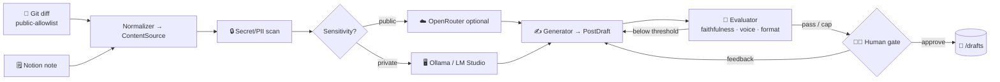

# 📣 CADENCE — Complete Project Scope v1.0 (STAGE 1)

## Build-in-Public Content-Ops Workflow — Diff-and-Note → Review-Ready Post
## "From diff to draft" — turn your real work into posts in your voice, privacy-safe, human-gated

**Document Version:** 1.0 (Stage-1 foundation scope. Establishes CADENCE as a **support / automation tool** — *not* a data-portfolio/flagship project — built to production-grade standards in a **separate GitHub tooling hub**. Stage 1 delivers the local-first ingest → draft → evaluate → human-gate loop for LinkedIn. Stages 2–5 detailed in the companion `CADENCE_CONTENT_SCOPE_v1_0_FULL_PRODUCTION.md`. Synced to roadmap v9.0. Stage labels are used so every skill maps to your roadmap and you always know where you are skill-wise.)
**Last Updated:** July 2, 2026
**Status:** 📋 DRAFT — Awaiting Approval
**Author:** Manuel Reyes
**Codename:** **Cadence** *(provisional — the posting rhythm the tool sustains; alternates: Herald, Loom, Diffcast)*
**Strategic Priority:** 🛠️ SUPPORT AUTOMATION — feeds the LinkedIn content strategy; production-grade, but never portfolio evidence
**Repo Hub:** Separate tooling hub (`manuel-reyes-ml/cadence`) — **outside** the `*-analyst` flagship portfolio set

---

## 📋 Table of Contents

1. [Executive Summary](#1-executive-summary)
2. [Strategic Positioning](#2-strategic-positioning)
3. [Landscape Validation](#3-landscape-validation)
4. [The Problem](#4-the-problem)
5. [Data Architecture](#5-data-architecture)
6. [Feature Framework](#6-feature-framework)
7. [Phase 1: Ingest + Draft Engine (Weeks 1-3)](#7-phase-1-ingest--draft-engine-weeks-1-3)
8. [Phase 2: Evaluator-Optimizer + Privacy Router + Review UX + Deploy (Weeks 4-5)](#8-phase-2-evaluator-optimizer--privacy-router--review-ux--deploy-weeks-4-5)
9. [AI Guardrails](#9-ai-guardrails)
10. [Tech Stack](#10-tech-stack)
11. [Project Structure](#11-project-structure)
12. [Sample / Corpus Strategy](#12-sample--corpus-strategy)
13. [Success Metrics](#13-success-metrics)
14. [Risk Mitigation](#14-risk-mitigation)
15. [Timeline Summary](#15-timeline-summary)
16. [Project Evolution (5 Stages)](#16-project-evolution-5-stages)

---

## 1. Executive Summary

**Cadence** is a workflow-first content-operations tool that turns evidence of your real work — a **git diff from a public repo** or a **note you drop in Notion** — into a **review-ready LinkedIn draft in your voice**. Stage 1 delivers the complete local-first loop: ingest a source, tag its sensitivity, draft a platform-specific post, run an automated quality check, and stop at a **mandatory human gate** where you approve or give feedback for a second iteration. **Nothing is ever auto-posted** — you are the publish button.

This is a **GenAI engineering project** — provider-agnostic LLM SDK usage, Pydantic-structured outputs, evaluation-first discipline, and guardrails — applied to your own build-in-public workflow. It is deliberately **not** a portfolio artifact (see §2); it exists to *sustain the content cadence* that grows your Senior-LLM-Engineer visibility, and it's built to production standard because you don't ship sloppy tools.

### Why This Tool Matters (to *you*, not a recruiter)

| Factor | Why it earns its build |
|--------|------------------------|
| **Cadence is the hard part of build-in-public** | The bottleneck isn't ideas, it's turning a week of commits into posts consistently. Cadence removes that friction. |
| **Privacy is non-negotiable** | Your differentiator is finance/compliance credibility — proprietary code must never touch a cloud API. Cadence enforces that in code. |
| **Anti-generic by design** | LinkedIn's 2026 algorithm actively suppresses low-effort AI text; the faithfulness + voice gates keep drafts specific and yours. |
| **Dogfooding** | The tool that writes your build-in-public posts is itself a build-in-public story — but a *support* one, not a portfolio exhibit. |
| **Skill tracker** | Every capability is mapped to a roadmap Stage, so building Cadence tells you exactly where you are skill-wise. |

### What Makes This Different From a "ChatGPT, write me a LinkedIn post" Script

| Dimension | Generic AI post generator | Cadence |
|-----------|---------------------------|---------|
| **Source** | You paste a topic | Reads your actual git diff / Notion note (provenance-tracked) |
| **Faithfulness** | Will happily invent achievements | **Faithfulness gate ≥ 0.90** — a draft claiming what the diff doesn't support is rejected |
| **Privacy** | Sends whatever you paste to a cloud | **Source-aware routing** — private → local model only, never leaves the machine |
| **Voice** | Generic LinkedIn-ese | Scored for voice-consistency against your approved posts |
| **Control** | One-shot output | Evaluator-optimizer loop + **mandatory human gate**; no auto-post |
| **Outputs** | Raw text | Pydantic-validated `PostDraft` with scores + `source_ids` |
| **Engineering** | A prompt | Typed `src/`, guardrails, DeepEval, CI, Docker |

### Core Capabilities (Stage 1)

- **Multi-source ingestion:** a **git diff reader** (public-allowlist only) and a **Notion reader** (manual notes) normalize into one `ContentSource` schema, each tagged `PUBLIC` or `PRIVATE` at ingest.
- **Source-aware privacy routing:** `PUBLIC` sources may use a cloud model (OpenRouter); `PRIVATE` sources are pinned to **local Ollama / LM Studio** and physically cannot reach a cloud provider.
- **Draft generation:** a generator produces a platform-specific LinkedIn draft grounded in the source.
- **Evaluator check:** faithfulness-to-source, voice, and format scored before you ever see the draft.
- **Mandatory human gate:** approve, or give feedback → a second iteration. **No auto-post.**
- **Guardrails:** public-repo allowlist, secret/PII scan on ingest, no-auto-post hard rule.
- **Production practices:** typed `src/`, Pydantic outputs, DeepEval + pytest, GitHub Actions CI, Dockerfile.

> 📥 **Stage-1 flow:** *ingest (git diff or Notion note) → tag sensitivity → route model → draft → evaluate (faithfulness · voice · format) → human gate (approve | feedback→revise) → export to `/drafts`.* No trend agent yet (that's the single bounded agent added at Stage 4). No cloud required — Stage 1 runs fully local.

---

> 🔁 **Agentic Loop Spec (roadmap v8.8 convention):**
> - **Loop type:** *evaluator-optimizer (light at Stage 1)* — generate a draft → evaluate against a rubric → if below threshold, regenerate with the evaluator's feedback (capped) → hand the best draft to the human. The human's approve/feedback is the outer loop.
> - **Verifier:** the evaluator rubric — **faithfulness gate ≥ 0.90** (the loop's "can say no": a draft that asserts something the source doesn't support is rejected), plus voice and format checks.
> - **Autonomy:** the drafting loop runs **unattended up to the human gate** — it never publishes. **Human approval is mandatory** (mirrors your "manual commit as the final control gate" philosophy). **No auto-post** is the hard rule that stands in for an irreversible-action sign-off gate.

## 2. Strategic Positioning

### 2.1 Roadmap Alignment (Stage 1: GenAI-First Data Analyst & AI Engineer)

Cadence Stage 1 exercises the same Stage-1 skill set your portfolio projects do — so building it keeps those skills warm — while serving a support role:

| Roadmap Stage-1 skill | How Cadence Stage 1 uses it |
|-----------------------|------------------------------|
| Python + LLM control (provider-agnostic SDK) | Draft generation across local + cloud providers |
| Pydantic structured outputs | `ContentSource`, `PostDraft` schemas |
| Guardrails / validation engineering | Allowlist, secret scan, no-auto-post, faithfulness gate |
| GEval / DeepEval | Faithfulness + voice + format scoring |
| Local-first LLM (Ollama / LM Studio) | Private-source drafting, offline runs |
| Streamlit / CLI + CI | Review UX + GitHub Actions |

### 2.2 Where Cadence Sits (NOT the portfolio ecosystem)

```
SUPPORT TOOLING HUB  (separate from data-portfolio)
════════════════════════════════════════════════════
  🛠️ Cadence — build-in-public content-ops tool
     └─ Role: sustain LinkedIn cadence · privacy-safe · human-gated
     └─ NOT one of the 8 portfolio projects
     └─ NOT part of the 5-stage flagship evolution
     └─ Production-grade anyway (README standard applies)

DATA-PORTFOLIO  (unchanged — the flagship shelf)
════════════════════════════════════════════════════
  PolicyPulse · FormSense · StreamSmart · AFC · Crucible
  + DataVault · ODI · SignalCore
```

> 🛠️ **Positioning rule.** Cadence *feeds* the content strategy that markets the portfolio; it is not itself portfolio evidence. If it's ever mentioned publicly, it's as "the tool that writes my build-in-public posts" — a support story, never a data/ML exhibit.

### 2.3 The "No-Vibe-Coding" Gate

Every line intentional and understood before merge; manual commit is the final control gate; Conventional Commits. Cadence is built the same way it will one day help you *write about* building things.

---

## 3. Landscape Validation

The point isn't market size (this is a personal tool) — it's that the design choices are validated by how the platform actually behaves in 2026.

| Signal | Source reality | Design consequence for Cadence |
|--------|----------------|-------------------------------|
| LinkedIn's 2026 algorithm suppresses low-effort/generic AI text; personalization is "mandatory" | Content-automation guides, 2026 | Faithfulness + voice gates are the whole point — generic drafts fail the rubric before you see them |
| Content **scheduling via official API** is the safer automation category; **browser automation + scraping** is what draws restrictions | LinkedIn API ToS + 2026 automation studies | Cadence never uses browser bots or scraping; human-gate + (later, optional) official-API publish only |
| Autonomous "AI assistants" (OpenClaw-class) carry broad-permission + prompt-injection risk | Cisco AI security testing, 2026 | Cadence is a *workflow*, read-only trend research, no account access — the opposite risk profile |

---

## 4. The Problem

### 4.1 Context

You're running a build-in-public content strategy (LinkedIn thought-leader track) alongside a 37-month transition. The work happens in commits and notes; the posts don't write themselves. Two failure modes: (1) cadence collapses because turning work into posts is friction, and (2) a rushed post either reads generic (algorithm suppresses it) or — worse — leaks a fragment of proprietary Daybright code.

### 4.2 Solution

A tool that reads your *actual* public work, drafts a faithful post in your voice, scores it, and hands it to you for approval — with proprietary sources physically barred from any cloud. Low friction, high faithfulness, zero leak risk, human-gated.

### 4.3 What Cadence Ingests (Stage 1)

| Source | What it reads | Default sensitivity |
|--------|---------------|---------------------|
| Git diff (public-allowlist repos) | The human-meaningful change in a commit/PR (new capability, refactor, eval result) | `PUBLIC` |
| Notion note (manual) | A note you deliberately wrote for content | `PUBLIC` (a `#private` tag → `PRIVATE`) |

### 4.4 Measurable Impact (for you)

- Time from "I shipped something" → review-ready draft: **minutes, not an evening.**
- Posting cadence sustained (e.g., 3 review-ready drafts/week) without burnout.
- **Zero** proprietary-data-to-cloud or secret-leak incidents (hard requirement).

---

## 5. Data Architecture

### 5.1 Processing Pipeline



### 5.2 Pydantic Schemas (Structured Outputs — frozen contract)

```python
from __future__ import annotations
from enum import Enum
from pydantic import BaseModel, Field

class Sensitivity(str, Enum):
    PUBLIC = "public"        # cloud (OpenRouter) allowed
    PRIVATE = "private"      # local models ONLY — never leaves the machine

class ContentSource(BaseModel):
    source_id: str                       # "git:cadence@a1b2c3" | "notion:page-xyz"
    kind: str                            # "git_diff" | "notion" | (future kinds)
    sensitivity: Sensitivity             # set at ingest → drives model routing
    title: str
    raw_text: str                        # diff hunk / note body
    metadata: dict = Field(default_factory=dict)   # repo, commit, author, tags, urls
    secrets_scanned: bool = False        # must be True before drafting

class PostDraft(BaseModel):
    platform: str = "linkedin"           # Stage 1 = LinkedIn only
    hook: str
    body: str
    source_ids: list[str]                # provenance — which sources it's built from
    faithfulness: float = 0.0            # eval vs source (gate ≥ 0.90)
    voice_score: float = 0.0
    format_ok: bool = False
    iteration: int = 0                   # evaluator-optimizer round
    approved: bool = False               # flips ONLY at the human gate
```

### 5.3 Source Adapter Interface (extensibility from day one)

```python
from typing import Protocol

class SourceAdapter(Protocol):
    kind: str
    def fetch(self, ref: str) -> list[ContentSource]: ...
    # git_diff.py enforces the public-allowlist; notion.py handles #private tagging
```

New sources (changelogs, PR summaries, a learnings journal) implement this one interface and register — the drafting/eval/gate pipeline downstream never changes.

---

## 6. Feature Framework

### 6.1 Pre-Built Features (No AI Required)

- Git diff extraction (GitPython) with **public-repo allowlist enforcement**.
- Notion note fetch (official Notion API) with `#private` tag handling.
- Secret/PII scanner (regex + entropy) run at ingest; blocks drafting until clean.
- Draft store (`/drafts/{date}-linkedin-{slug}.md`) with front-matter provenance.

### 6.2 AI-Powered Features

- Draft generation (provider-agnostic; local default for private).
- Evaluator rubric (faithfulness / voice / format) — DeepEval + GEval.
- Evaluator-optimizer regeneration loop (capped).

### 6.3 Review UX (Stage 1)

- CLI review (approve / edit / feedback) writing to `/drafts`.
- Optional minimal Streamlit review panel (uses your existing `streamlit-patterns` Cursor rules).

---

## 7. Phase 1: Ingest + Draft Engine (Weeks 1-3)

### Week 1: Setup + Provider-Agnostic Draft Foundation
- Repo scaffold (`pyproject.toml`, `src/cadence/`, `py.typed`, Dockerfile), GitHub Actions CI green.
- Provider-agnostic model client (Anthropic SDK primary; Ollama / LM Studio local; OpenRouter optional).
- `ContentSource` / `PostDraft` schemas; basic local-model draft from a hardcoded sample source.

### Week 2: Real Ingestion + Guardrails
- Git diff reader with **public-allowlist** (work repos physically cannot be ingested).
- Notion reader with `#private` tagging.
- Secret/PII scanner at ingest; `secrets_scanned` gate before drafting.

### Week 3: Drafting + Local Routing
- LinkedIn draft template (hook + body + format rules ≤ 3,000 chars, limited hashtags).
- Source-aware routing: `PRIVATE` → local only (cloud client never constructed for it).
- Unit tests incl. the **privacy hard-fail test** (zero cloud calls for a `PRIVATE` fixture).

---

## 8. Phase 2: Evaluator-Optimizer + Privacy Router + Review UX + Deploy (Weeks 4-5)

### Week 4: Evaluation + Loop
- DeepEval suite: **faithfulness ≥ 0.90**, voice (GEval vs seed corpus), format check.
- Evaluator-optimizer regeneration loop (capped rounds); best draft → human gate.
- Final-draft secret scan (belt-and-suspenders) — hard fail on any hit.

### Week 5: Review UX + Ship
- CLI review gate (approve / feedback → revise); optional Streamlit panel.
- Export approved drafts to `/drafts` with provenance front-matter.
- README (Mermaid diagram, eval table, 15–30s demo GIF, "What I Learned"); Docker run; local/Docker deploy (no public server needed at Stage 1).

---

## 9. AI Guardrails

### 9.1 Guardrail Framework

| Guardrail | What it enforces |
|-----------|------------------|
| Public-repo allowlist | Work/proprietary repos physically cannot be ingested |
| Secret / PII scan (ingest + final) | No API keys, tokens, SSNs in a source or a draft — hard fail |
| **No auto-post (hard rule)** | Tool only writes to `/drafts`; the human is the publish button |
| Faithfulness gate ≥ 0.90 | A draft claiming what the source doesn't support is rejected |
| Private → local-only routing | Proprietary content never reaches a cloud API (enforced in code) |
| Loop round-cap | Evaluator-optimizer can't run away on tokens/cost |
| No real-figure misattribution | Never fabricate quotes/claims attributed to real people |

### 9.2 Guardrail Testing Strategy

- **Privacy hard-fail test:** a `PRIVATE` fixture must produce **zero** cloud calls (mock the cloud client; assert not constructed).
- **Secret-scan test:** planted fake key in a diff must block drafting and fail CI.
- **Faithfulness test:** a draft asserting an unsupported claim must score < 0.90 and be rejected.
- **No-post test:** assert no code path can publish (no LinkedIn client exists at Stage 1).

---

## 10. Tech Stack

### 10.1 Core Stack

| Layer | Choice |
|-------|--------|
| Language | **Python** (typed, `src/` layout) |
| Editor | **VS Code** (primary); Jupyter for eval-corpus exploration |
| Schemas | Pydantic (`ContentSource`, `PostDraft`) |
| Source I/O | GitPython (diffs), Notion API |
| Models | Provider-agnostic (Anthropic SDK primary); **Ollama** (`qwen3.5-16k`) / **LM Studio** (MLX Qwen3.5 9B) local; **OpenRouter** (MiniMax M3) optional for public |
| Evaluation | **DeepEval + pytest**; GEval for voice |
| Review UX | CLI + `/drafts` files; optional Streamlit panel |
| Packaging | `pyproject.toml` (no `requirements.txt`), `py.typed`, Dockerfile |
| CI | GitHub Actions (Ruff, mypy, pytest, privacy + secret tests) |

### 10.2 AI Architecture (Provider-Agnostic + Privacy-Routed)

- One `ModelClient` abstraction; provider chosen by `sensitivity`.
- `PRIVATE` path constructs **only** a local client; the cloud client is never instantiated for it (this is the enforcement, not a convention).

### 10.3 Draft Prompt Engineering

- Grounding: the prompt receives the `raw_text` and must cite only what's in it (faithfulness).
- Voice: few-shot with a small seed corpus of *your* approved posts + the LinkedIn editorial guidelines (commentary / tools / frontline patterns / cross-industry / career lessons).
- Format: hook first, scannable structure, limited hashtags, ≤ 3,000 chars.

---

## 11. Project Structure

```
cadence/
├── pyproject.toml
├── py.typed
├── Dockerfile
├── README.md                 # Mermaid diagram · eval table · demo GIF · What I Learned
├── src/cadence/
│   ├── sources/
│   │   ├── base.py           # SourceAdapter protocol
│   │   ├── git_diff.py       # public-allowlist enforced
│   │   └── notion.py         # #private tagging
│   ├── routing/
│   │   └── privacy_router.py # sensitivity → model (enforced)
│   ├── drafting/
│   │   ├── generator.py
│   │   └── evaluator.py      # evaluator-optimizer rubric
│   ├── guardrails/
│   │   └── scanner.py        # secret/PII scan
│   ├── eval/                 # DeepEval + GEval suites
│   └── review/               # CLI gate → /drafts  (+ optional streamlit_app.py)
├── tests/                    # incl. privacy hard-fail + secret-scan tests
├── config/
│   ├── allowlist.yaml        # public repos permitted for ingest
│   └── voice_corpus/         # your approved posts (gitignored)
└── drafts/                   # review-ready output (gitignored)
```

---

## 12. Sample / Corpus Strategy

### 12.1 Why Your Own Public Repos (and Synthetic Notes)

- **Git source:** use diffs from your *own public* repos (Cadence itself, DataVault, etc.) — real, safe, and dogfooded.
- **Notion source:** a handful of synthetic content notes for testing.
- **Voice corpus:** seed with the few LinkedIn posts you've already approved + the editorial-guideline pillars; grows as you approve more. **No proprietary content, ever** — the corpus is gitignored and, if any note is flagged `#private`, it's scored locally only.

### 12.2 Bootstrapping Voice at Stage 1

You don't yet have a large approved-post history, so Stage-1 voice scoring starts light (a rubric + a few seeds) and **matures automatically** as approved drafts feed back into the corpus. This is honest: voice_score is directional at first, tightening over time.

---

## 13. Success Metrics

### Phase 1 (Ingest + Draft)
- Git diff + Notion note → `ContentSource` with correct sensitivity tag.
- Local-model draft generated; privacy hard-fail test green.
- Secret-scan blocks a planted key; CI green.

### Phase 2 (Eval + Ship)
- Faithfulness ≥ 0.90 on every exported draft.
- Evaluator-optimizer loop improves a weak first draft measurably.
- README + GIF; Docker run works; first real post shipped *by you* from a Cadence draft.

### Cadence Impact
- 3 review-ready drafts/week sustained without friction.
- **Zero** private-to-cloud or secret-leak incidents (hard requirement).

---

## 14. Risk Mitigation

| Risk | Mitigation |
|------|------------|
| Proprietary code → cloud | Public-allowlist + private→local enforced in code + CI hard-fail test |
| Hallucinated claims | Faithfulness gate ≥ 0.90; drafts cite `source_ids` |
| Scope creep into auto-posting | No posting capability exists at Stage 1; human gate mandatory |
| Generic AI output (algorithm suppression) | Voice + faithfulness gates; grounded in real diffs |
| Tool distracts from flagship work | Scoped small (4–5 weeks); support hub; local-first |

### AI Evaluation Layer — Faithfulness GEval (the production marker)

A custom GEval metric scores each draft's claims against the source `raw_text` (0–1). Anything < 0.90 is rejected and regenerated with feedback. This is the eval-first discipline (DeepEval + pytest across all projects) applied to content — the thing that separates Cadence from a prompt.

### Docker Support

Dockerfile for reproducible local runs (Python + deps; Ollama/LM Studio reached on the host). No cloud infra required at Stage 1.

---

## 15. Timeline Summary

```
Week 1 ──── Week 2 ──── Week 3 ──── Week 4 ──── Week 5
  │            │            │            │            │
  ▼            ▼            ▼            ▼            ▼
Setup        Git+Notion   Draft +      Eval loop    Review UX
Model client Ingest       Local route  Faithfulness Export
Schemas      Allowlist    Privacy      Voice/format README+GIF
CI green     Secret scan  hard-fail    Round-cap    Docker/ship

├──── Phase 1: Ingest + Draft Engine ────┼──── Phase 2: Eval + Ship ────┤
```

### Key Milestones

| Week | Milestone |
|------|-----------|
| **Week 1** | ✅ Provider-agnostic client + schemas; CI green |
| **Week 2** | ✅ Git (allowlist) + Notion ingest; secret scan blocking |
| **Week 3** | ✅ Local draft + privacy hard-fail test green |
| **Week 4** | ✅ Faithfulness/voice/format eval + evaluator-optimizer loop |
| **Week 5** | ✅ Review gate, first real post shipped by you, README + GIF, Docker |

---

## 16. Project Evolution (5 Stages)

*Stage labels map to your roadmap so you always know where you are skill-wise. Cadence is a support tool, so where a stage's signature skill doesn't naturally fit (e.g. Stage-3 fine-tuning, Stage-5 A2A) it's an **earned/optional overlay**, never forced — mirroring the N/A discipline in your other scopes.*

| Stage | Role | Cadence Enhancements |
|-------|------|----------------------|
| **1** | GenAI-First Analyst | ✅ Ingest (git diff + Notion) → source-aware routing → draft → evaluator-optimizer → human gate. Local-first. **(THIS SCOPE)** |
| **2** | Data Engineer | PostgreSQL draft/provenance/eval store; scheduled ingestion (cron/queue); batch drafting; containerized service; optional cloud tier (S3 artifacts / RDS). |
| **3** | ML Engineer | *Earned overlay:* LoRA/PEFT **voice fine-tune** on your approved posts + a small **post-worthiness / content-type classifier** — each must beat the prompt baseline to ship. |
| **4** | Agentic AI Engineer | The **bounded LinkedIn trend-research agent** (LangGraph, read-only web search); tracing/observability; optional MCP wrapping of ingest/draft tools; multi-platform templates. |
| **5** | Senior LLM Engineer | FastAPI service; **LLMOps CI eval gates** (voice/faithfulness regression); observability stack; **optional ToS-compliant publish of *approved* drafts via the official LinkedIn Posting API** (member-initiated, rate-limited — never browser automation/scraping). A2A: **N/A** for a solo tool (optional MCP interface instead). |

---

## ✅ Approval Checklist

- [ ] Codename confirmed (Cadence, or your choice)
- [ ] Support-tool status + separate repo hub confirmed (not portfolio, not flagship)
- [ ] Stage-1 schema contract approved (`ContentSource` / `PostDraft`, frozen)
- [ ] Source-aware privacy routing approved (private → local, enforced + CI-tested)
- [ ] Faithfulness ≥ 0.90 + secret-scan + no-auto-post hard rules approved
- [ ] 4–5 week timeline realistic (at your hours/week)
- [ ] Voice-corpus bootstrapping approach (light → matures) accepted
- [ ] Stage 1→5 skill mapping confirmed against roadmap v9.0

---

## Quick Reference

```
┌─────────────────────────────────────────────────────────────────┐
│      CADENCE v1.0 — STAGE 1  (SUPPORT TOOL, not portfolio)      │
│      📣 "From diff to draft" — build-in-public, on rhythm        │
├─────────────────────────────────────────────────────────────────┤
│  📥 INGEST                                                       │
│     • Git diff (public-allowlist) · Notion note (#private aware) │
│     • Secret/PII scan before drafting                           │
├─────────────────────────────────────────────────────────────────┤
│  🔀 PRIVACY ROUTER (enforced + CI-tested)                        │
│     • PUBLIC  → OpenRouter (optional)                           │
│     • PRIVATE → Ollama / LM Studio — never leaves machine       │
├─────────────────────────────────────────────────────────────────┤
│  ✍️ DRAFT + EVALUATE                                             │
│     • LinkedIn draft grounded in source                         │
│     • faithfulness ≥0.90 · voice · format · capped loop         │
├─────────────────────────────────────────────────────────────────┤
│  🧑‍⚖️ HUMAN GATE (mandatory)                                     │
│     • approve | feedback→revise · NO auto-post                   │
├─────────────────────────────────────────────────────────────────┤
│  🔧 ENGINEERING                                                  │
│     • Typed src/ · Pydantic · DeepEval+pytest · CI · Docker     │
│     • HARD-FAIL: secret leak = 0 · private→cloud = 0            │
├─────────────────────────────────────────────────────────────────┤
│  ⏱️ 4–5 weeks · local-first · VS Code                           │
└─────────────────────────────────────────────────────────────────┘
```

---

## Production README Standard

> **Cross-Project Standard (applies even to support tools):** README includes a Mermaid architecture diagram, a Dockerfile, an evaluation-metrics table (DeepEval/GEval), a 15–30s demo GIF, and a "What I Learned" section. `pyproject.toml` (no `requirements.txt`), `py.typed`, typed source, logging (no `print()`), Conventional Commits, manual commit as the final gate.

---

## 📚 Courses & Certifications (supporting skills — already in the roadmap)

*Quick reference synced to roadmap v9.0. Cadence needs no new courses; it reuses Stage-1 skills you're already building.*

| # | Course (roadmap name) | Stage | Focus for Cadence |
|---|---|---|---|
| 1 | AI Python for Beginners (Andrew Ng) | Stage 1 | Python + LLM control for the drafting layer |
| 2 | Building with the Claude API (Anthropic Academy) | Stage 1 | Provider-agnostic structured (Pydantic) outputs |
| 3 | Evaluating AI Agents (DeepLearning.AI) | Stage 4 | Traces + LLM-as-judge (used lightly at Stage 1 for the eval rubric) |

**Focus thread:** multi-source ingest, source-aware privacy routing, grounded drafting, faithfulness eval, human-gated output — no trend agent until Stage 4.

---

**Document Status:** 📋 DRAFT — Stage-1 foundation (companion: `CADENCE_CONTENT_SCOPE_v1_0_FULL_PRODUCTION.md`)
**Date:** July 2, 2026
**Total Timeline:** 4–5 weeks
**Strategic Role:** Build-in-public content automation — feeds the LinkedIn strategy, never the portfolio shelf

*"Your real work, in your voice, honest about what it did — human-gated, and proprietary code never leaves the machine."* 📣
